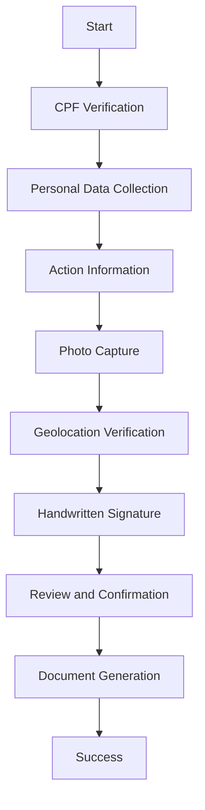
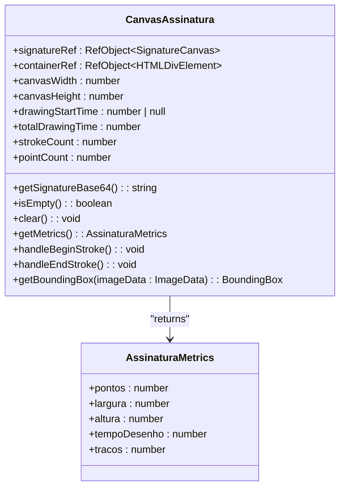
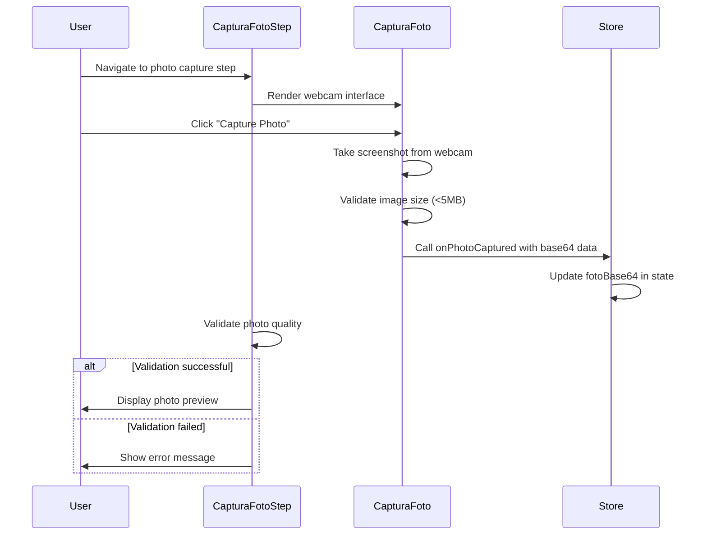

# Signature Capture

<cite>
**Referenced Files in This Document**   
- [captura-foto-step.tsx](file://components/assinatura-digital/capture/captura-foto-step.tsx)
- [captura-foto.tsx](file://components/assinatura-digital/capture/captura-foto.tsx)
- [geolocation-step.tsx](file://components/assinatura-digital/capture/geolocation-step.tsx)
- [canvas-assinatura.tsx](file://components/assinatura-digital/signature/canvas-assinatura.tsx)
- [preview-assinatura.tsx](file://components/assinatura-digital/signature/preview-assinatura.tsx)
- [business.validations.ts](file://app/_lib/assinatura-digital/validations/business.validations.ts)
- [formulario-store.ts](file://app/_lib/stores/assinatura-digital/formulario-store.ts)
- [assinatura-manuscrita-step.tsx](file://components/assinatura-digital/form/assinatura-manuscrita-step.tsx)
</cite>

## Table of Contents
1. [Introduction](#introduction)
2. [Multi-Step Capture Process](#multi-step-capture-process)
3. [CanvasAssinatura Component](#canvasassinatura-component)
4. [CapturaFotoStep Integration](#capturafotostep-integration)
5. [Data Flow and Storage](#data-flow-and-storage)
6. [Error Handling and Common Issues](#error-handling-and-common-issues)
7. [Security Considerations](#security-considerations)
8. [Conclusion](#conclusion)

## Introduction
The Sinesys signature capture system implements a comprehensive multi-step process for collecting biometric data during digital contract signing. This system combines photo capture, geolocation verification, and handwritten signature collection to ensure document authenticity and compliance. The implementation uses React components with Zustand for state management, integrating with browser APIs and device capabilities to create a secure and user-friendly signing experience. The workflow is designed to capture essential metadata that validates the signer's identity, location, and intent, providing a robust foundation for legally binding digital agreements.

**Section sources**
- [captura-foto-step.tsx](file://components/assinatura-digital/capture/captura-foto-step.tsx#L1-L77)
- [geolocation-step.tsx](file://components/assinatura-digital/capture/geolocation-step.tsx#L1-L319)

## Multi-Step Capture Process
The signature capture workflow in Sinesys follows a structured multi-step process that guides users through identity verification, document review, and final signature. The process begins with CPF verification and personal data collection, followed by action-specific information gathering. The core capture steps include photo capture, geolocation verification, and handwritten signature collection, culminating in a review and confirmation phase.

The photo capture step uses the device's webcam to take a selfie for identity verification. This is implemented through the `CapturaFoto` component which accesses the browser's MediaDevices API to stream video from the user's camera. The component provides a user interface for capturing the photo, with validation to ensure the image meets quality requirements (minimum size and maximum 2MB). The geolocation step automatically captures GPS coordinates using the browser's Geolocation API with high accuracy settings. This step runs on component mount, attempting to capture location data immediately while providing retry functionality if permission is denied or the device cannot determine position.

**Diagram sources**
- [captura-foto-step.tsx](file://components/assinatura-digital/capture/captura-foto-step.tsx#L10-L77)
- [geolocation-step.tsx](file://components/assinatura-digital/capture/geolocation-step.tsx#L12-L319)

**Section sources**
- [captura-foto-step.tsx](file://components/assinatura-digital/capture/captura-foto-step.tsx#L10-L77)
- [geolocation-step.tsx](file://components/assinatura-digital/capture/geolocation-step.tsx#L12-L319)

## CanvasAssinatura Component
The `CanvasAssinatura` component implements the handwritten signature capture functionality using the react-signature-canvas library. This component provides a responsive canvas where users can draw their signature using mouse, touch, or stylus input. The canvas dimensions adapt to the container width, with a maximum width of 600px and height of 250px (200px on mobile devices).

The component tracks detailed metrics about the signature drawing process, including the number of points, strokes, total drawing time, and bounding box dimensions (width and height). These metrics are collected through event handlers on the signature canvas: `handleBeginStroke` captures the start time of each stroke, while `handleEndStroke` calculates the elapsed time and updates the stroke count. The `getBoundingBox` function analyzes the canvas image data to determine the actual space occupied by the signature, providing valuable forensic data for signature analysis.

**Diagram sources**
- [canvas-assinatura.tsx](file://components/assinatura-digital/signature/canvas-assinatura.tsx#L1-L189)

**Section sources**
- [canvas-assinatura.tsx](file://components/assinatura-digital/signature/canvas-assinatura.tsx#L1-L189)

## CapturaFotoStep Integration
The `CapturaFotoStep` component integrates the photo capture functionality into the multi-step form workflow. It serves as a wrapper around the `CapturaFoto` component, connecting it to the global form state via the `formulario-store`. This integration allows the captured photo to persist across form steps and be validated before proceeding to the next stage.

The component uses the `useFormularioStore` hook to access and update the form state, specifically the `fotoBase64` field which stores the captured image in base64 format. When a photo is captured, the `onPhotoCaptured` callback immediately updates the store, ensuring data persistence even if the user navigates away and returns. The component also handles validation through the `validatePhotoQuality` function, which checks that the image is in the correct format and meets size requirements (not exceeding 2MB). If validation fails, an appropriate error message is displayed to guide the user in retaking the photo.

**Diagram sources**
- [captura-foto-step.tsx](file://components/assinatura-digital/capture/captura-foto-step.tsx#L10-L77)
- [captura-foto.tsx](file://components/assinatura-digital/capture/captura-foto.tsx#L21-L138)

**Section sources**
- [captura-foto-step.tsx](file://components/assinatura-digital/capture/captura-foto-step.tsx#L10-L77)
- [captura-foto.tsx](file://components/assinatura-digital/capture/captura-foto.tsx#L21-L138)

## Data Flow and Storage
The signature capture data flows through a well-defined pipeline from collection to storage, with validation at each stage. When a user completes the capture process, the collected data (signature, photo, geolocation) is validated and then submitted to the backend for processing. The data flow begins with client-side collection in the browser, moves through state management in the `formulario-store`, and culminates in server-side processing and storage.

The `AssinaturaManuscritaStep` component orchestrates the final data collection and submission process. It gathers all captured data from the store, including the signature base64 string, photo base64 string, geolocation coordinates, and device metadata (IP address, user agent). This data is then packaged into a payload and sent to the `/api/assinatura-digital/signature/finalizar` endpoint. The backend processes this payload, generates the final PDF document with the embedded signature, and stores the biometric data securely. The response includes the generated PDF URL and protocol number, which are stored in the client-side state for subsequent display and download.

```mermaid
flowchart LR
A[Client Device] --> |Capture| B[Browser State]
B --> |Store| C[formulario-store]
C --> |Validate| D[AssinaturaManuscritaStep]
D --> |Submit| E[Backend API]
E --> |Process| F[PDF Generation]
F --> |Store| G[Secure Storage]
G --> |Return| H[PDF URL & Protocol]
H --> |Display| I[Success Page]
```

**Diagram sources**
- [assinatura-manuscrita-step.tsx](file://components/assinatura-digital/form/assinatura-manuscrita-step.tsx#L47-L634)
- [formulario-store.ts](file://app/_lib/stores/assinatura-digital/formulario-store.ts#L51-L72)

**Section sources**
- [assinatura-manuscrita-step.tsx](file://components/assinatura-digital/form/assinatura-manuscrita-step.tsx#L47-L634)
- [formulario-store.ts](file://app/_lib/stores/assinatura-digital/formulario-store.ts#L51-L72)

## Error Handling and Common Issues
The signature capture system implements comprehensive error handling to address common issues that may arise during the capture process. For photo capture, the system handles webcam access errors by displaying clear error messages and providing guidance on enabling camera permissions in different browsers. Image size validation prevents excessively large files from being processed, with a limit of 5MB enforced both in the `CapturaFoto` component and during final validation.

Geolocation capture includes robust error handling for the three main error types defined in the Geolocation API specification: PERMISSION_DENIED, POSITION_UNAVAILABLE, and TIMEOUT. For PERMISSION_DENIED, the system displays instructions for enabling location services in various browsers and operating systems. POSITION_UNAVAILABLE errors suggest checking GPS signal strength and ensuring location services are enabled on the device. TIMEOUT errors indicate network or GPS latency issues, with a 10-second timeout configured to balance user experience with reliability.

Mobile device compatibility is addressed through responsive design and touch event optimization. The signature canvas is configured to handle touch events effectively, with appropriate sizing for mobile screens. The system also handles cases where certain APIs may not be available in all browsers by providing fallbacks and clear error messaging. Network connectivity issues during final submission are managed through retry logic with exponential backoff, attempting up to two retries with increasing delays between attempts.

**Section sources**
- [captura-foto.tsx](file://components/assinatura-digital/capture/captura-foto.tsx#L62-L72)
- [geolocation-step.tsx](file://components/assinatura-digital/capture/geolocation-step.tsx#L77-L109)
- [assinatura-manuscrita-step.tsx](file://components/assinatura-digital/form/assinatura-manuscrita-step.tsx#L377-L410)

## Security Considerations
The signature capture system implements multiple security measures to protect biometric data and ensure the integrity of the signing process. All captured data is transmitted over HTTPS, and sensitive information is validated both on the client and server sides. The system collects device metadata including IP address, user agent, and geolocation coordinates, which are used to verify the authenticity of the signing event.

Photo and signature data are stored in base64 format, which provides a standardized encoding method that can be easily transmitted and stored. The validation process ensures that only properly formatted images are accepted, preventing malicious content from being uploaded. Geolocation data is validated to ensure coordinates are within valid ranges (-90 to 90 for latitude, -180 to 180 for longitude) and that accuracy values are positive numbers.

The system uses a session-based approach with a UUID (`sessaoId`) to group multiple signatures from the same session, providing traceability while maintaining privacy. The backend API endpoints are protected and require proper authentication, ensuring that only authorized users can submit signature data. Additionally, the system implements request IDs for tracking and debugging purposes, which helps in auditing the signature process without exposing sensitive information.

**Section sources**
- [business.validations.ts](file://app/_lib/assinatura-digital/validations/business.validations.ts#L131-L214)
- [assinatura-manuscrita-step.tsx](file://components/assinatura-digital/form/assinatura-manuscrita-step.tsx#L17-L34)
- [formulario-store.ts](file://app/_lib/stores/assinatura-digital/formulario-store.ts#L104-L105)

## Conclusion
The signature capture system in Sinesys provides a comprehensive solution for collecting biometric data during digital contract signing. By combining photo capture, geolocation verification, and handwritten signature collection, the system creates a robust authentication process that enhances document security and legal validity. The implementation leverages modern web technologies and follows best practices for user experience, error handling, and data security. The modular component architecture allows for flexible integration into various workflows while maintaining consistency across different use cases. This system effectively balances security requirements with usability, providing a seamless signing experience for users while ensuring the integrity and authenticity of executed documents.