# Signature Components

<cite>
**Referenced Files in This Document**   
- [captura-foto-step.tsx](file://components/assinatura-digital/capture/captura-foto-step.tsx)
- [geolocation-step.tsx](file://components/assinatura-digital/capture/geolocation-step.tsx)
- [canvas-assinatura.tsx](file://components/assinatura-digital/signature/canvas-assinatura.tsx)
- [FieldMappingEditor.tsx](file://components/assinatura-digital/editor/FieldMappingEditor.tsx)
- [dynamic-form-step.tsx](file://components/assinatura-digital/form/dynamic-form-step.tsx)
- [assinatura-manuscrita-step.tsx](file://components/assinatura-digital/form/assinatura-manuscrita-step.tsx)
- [signature.service.ts](file://backend/assinatura-digital/services/signature.service.ts)
- [templates.service.ts](file://backend/assinatura-digital/services/templates.service.ts)
- [template.types.ts](file://types/assinatura-digital/template.types.ts)
- [form-schema.types.ts](file://types/assinatura-digital/form-schema.types.ts)
- [business.validations.ts](file://app/_lib/assinatura-digital/validations/business.validations.ts)
</cite>

## Table of Contents
1. [Introduction](#introduction)
2. [Core Components Overview](#core-components-overview)
3. [Signature Capture Workflow](#signature-capture-workflow)
4. [Template Management System](#template-management-system)
5. [Form Building and Data Collection](#form-building-and-data-collection)
6. [Digital Signature Workflow](#digital-signature-workflow)
7. [Domain Models and Data Structures](#domain-models-and-data-structures)
8. [Integration with Document Management](#integration-with-document-management)
9. [Common Issues and Solutions](#common-issues-and-solutions)
10. [Configuration Options and Parameters](#configuration-options-and-parameters)

## Introduction
The Sinesys signature components provide a comprehensive digital signature solution for legal and business workflows. This system enables users to capture signatures, manage templates, build dynamic forms, and process documents through a multi-step workflow. The architecture integrates frontend components with backend services to ensure secure, reliable, and compliant digital signature processes. The components are designed to work seamlessly with the document management system and authentication services, providing a complete solution for digital document processing.

## Core Components Overview
The signature system consists of several key components that work together to provide a complete digital signature solution. These components include signature capture, template management, form building, and digital signature workflow processing. Each component has a specific role in the overall system and interacts with other components to provide a seamless user experience.

### CaptureFotoStep
The CaptureFotoStep component handles the photo capture functionality for identity verification. It uses the browser's camera API to capture a selfie from the user, which is then validated for quality before being stored in the application state. The component provides real-time feedback on photo quality and guides users through the capture process.

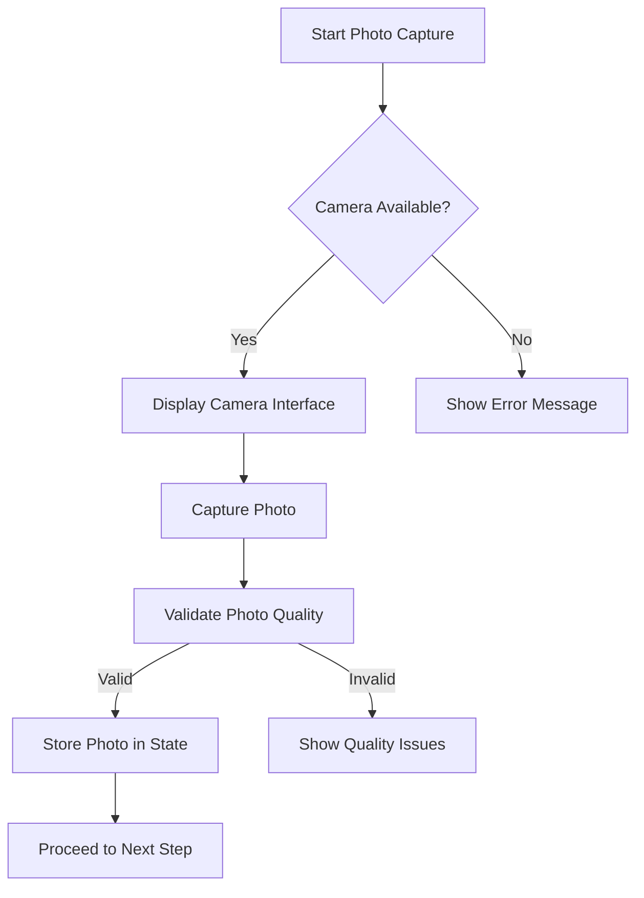

**Diagram sources**
- [captura-foto-step.tsx](file://components/assinatura-digital/capture/captura-foto-step.tsx)

**Section sources**
- [captura-foto-step.tsx](file://components/assinatura-digital/capture/captura-foto-step.tsx)

### FieldMappingEditor
The FieldMappingEditor component provides a visual interface for creating and editing document templates. Users can drag and drop fields onto a PDF canvas, configure field properties, and define the layout of signature fields. The editor supports multiple field types including text, rich text, and signature fields.

```mermaid
classDiagram
class FieldMappingEditor {
+template : Template
+mode : 'edit' | 'create'
+fields : EditorField[]
+selectedField : EditorField | null
+editorMode : 'select' | 'add_text' | 'add_image' | 'add_rich_text'
+zoom : number
+currentPage : number
+totalPages : number
+isLoading : boolean
+pdfUrl : string | null
+hasUnsavedChanges : boolean
+showExitConfirmation : boolean
+showProperties : boolean
+showTemplateInfo : boolean
+showReplacePdf : boolean
+showRichTextEditor : boolean
+editingRichTextField : EditorField | null
+isGeneratingPreview : boolean
+showPreviewModal : boolean
+previewPdfUrl : string | null
+uploadedFile : File | null
+uploadedFilePreview : string | null
+createdTemplate : Template | null
+dragState : DragState
+toolbarPosition : {x : number, y : number}
+toolbarDragging : boolean
+toolbarDragOffset : {x : number, y : number}
+canvasRef : RefObject<HTMLDivElement>
+canvasSize : {width : number, height : number}
}
class EditorField {
+id : string
+template_id : string
+nome : string
+variavel : string | undefined
+tipo : TipoCampo
+posicao : PosicaoCampo
+estilo : EstiloCampo
+obrigatorio : boolean
+ordem : number
+conteudo_composto : ConteudoComposto | undefined
+criado_em : Date
+atualizado_em : Date
+isSelected : boolean
+isDragging : boolean
+justAdded : boolean
}
class DragState {
+isDragging : boolean
+fieldId : string | null
+startX : number
+startY : number
+currentX : number
+currentY : number
+offsetX : number
+offsetY : number
+hasMoved : boolean
+mode : 'move' | 'resize'
+resizeHandle : ResizeHandle | null
+startWidth : number
+startHeight : number
}
FieldMappingEditor --> EditorField : "contains"
FieldMappingEditor --> DragState : "uses"
```

**Diagram sources**
- [FieldMappingEditor.tsx](file://components/assinatura-digital/editor/FieldMappingEditor.tsx)

**Section sources**
- [FieldMappingEditor.tsx](file://components/assinatura-digital/editor/FieldMappingEditor.tsx)

### CanvasAssinatura
The CanvasAssinatura component provides a canvas for users to draw their handwritten signature. It captures the signature as a base64-encoded PNG image and collects metrics about the signing process, including drawing time, stroke count, and point density. The component includes validation to ensure the signature meets quality requirements.

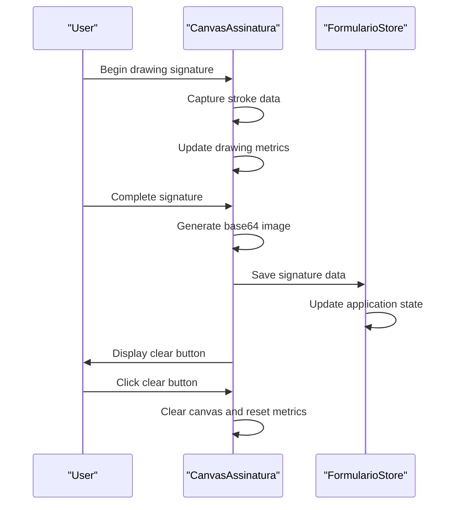

**Diagram sources**
- [canvas-assinatura.tsx](file://components/assinatura-digital/signature/canvas-assinatura.tsx)

**Section sources**
- [canvas-assinatura.tsx](file://components/assinatura-digital/signature/canvas-assinatura.tsx)

## Signature Capture Workflow
The signature capture workflow consists of multiple steps that collect user data and validate identity before allowing document signing. This multi-step process ensures data integrity and compliance with digital signature regulations.

### Geolocation Capture
The geolocation capture step uses the browser's Geolocation API to obtain the user's GPS coordinates. This information is used for document validation and security purposes. The component handles various error conditions and provides guidance to users on enabling location permissions.

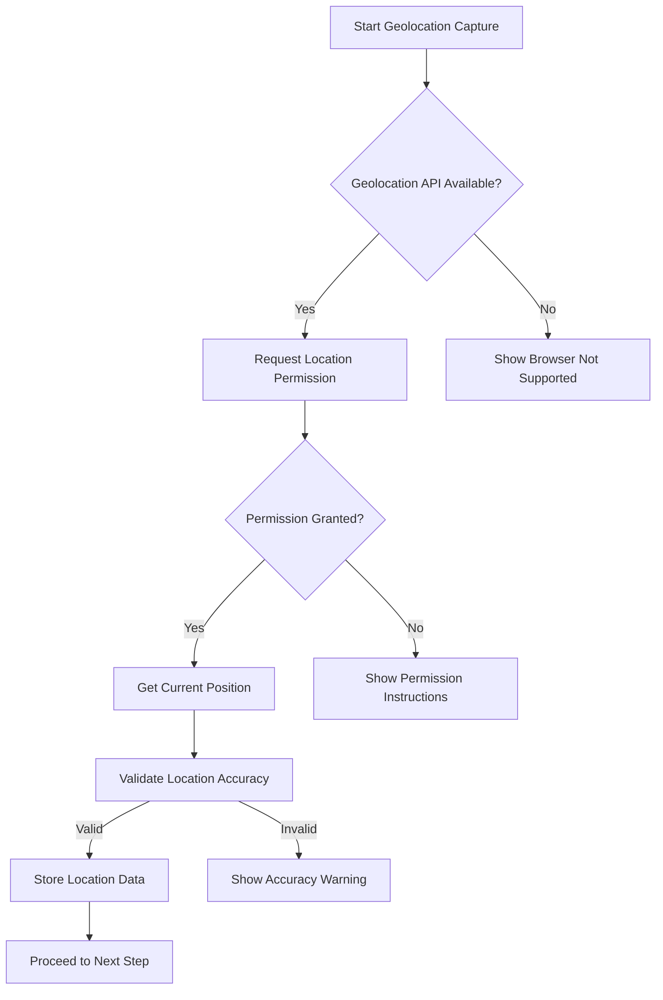

**Diagram sources**
- [geolocation-step.tsx](file://components/assinatura-digital/capture/geolocation-step.tsx)

**Section sources**
- [geolocation-step.tsx](file://components/assinatura-digital/capture/geolocation-step.tsx)

### Photo Quality Validation
The photo quality validation process ensures that captured images meet minimum requirements for identity verification. The validation checks include image resolution, lighting conditions, and facial visibility. This process helps prevent fraud and ensures document integrity.

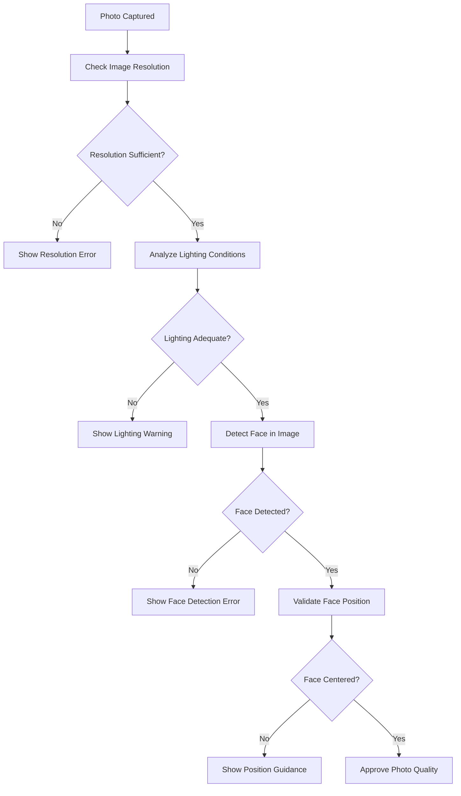

**Section sources**
- [business.validations.ts](file://app/_lib/assinatura-digital/validations/business.validations.ts)

## Template Management System
The template management system allows administrators to create, edit, and manage document templates for digital signatures. Templates define the structure and content of documents, including signature fields, text fields, and other interactive elements.

### Template Creation
The template creation process involves uploading a PDF document and mapping interactive fields onto it. Administrators can define various field types, set validation rules, and configure field properties. The system supports both visual editing and programmatic template creation.

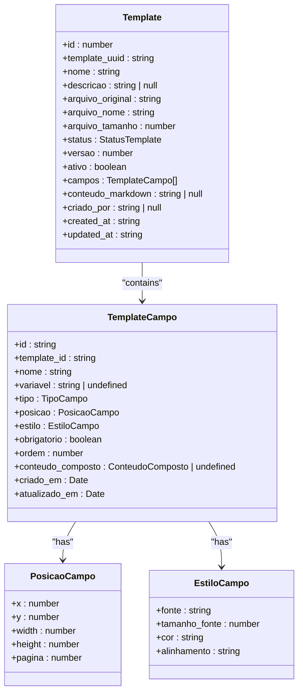

**Diagram sources**
- [template.types.ts](file://types/assinatura-digital/template.types.ts)

**Section sources**
- [templates.service.ts](file://backend/assinatura-digital/services/templates.service.ts)
- [template.types.ts](file://types/assinatura-digital/template.types.ts)

### Template Services
The backend template services provide CRUD operations for managing templates. These services interact with the database to store and retrieve template data, validate inputs, and enforce business rules. The services are exposed through API endpoints for frontend consumption.

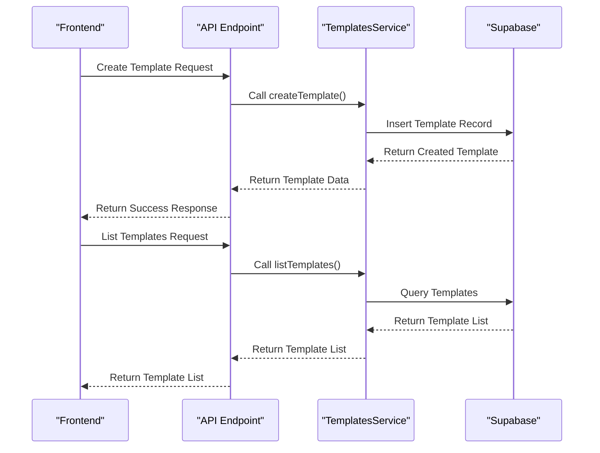

**Diagram sources**
- [templates.service.ts](file://backend/assinatura-digital/services/templates.service.ts)

**Section sources**
- [templates.service.ts](file://backend/assinatura-digital/services/templates.service.ts)

## Form Building and Data Collection
The form building system enables the creation of dynamic forms for collecting user data. These forms are defined using JSON schemas that specify fields, validation rules, and layout properties. The system supports various field types and conditional logic.

### Dynamic Form Schema
The dynamic form schema defines the structure and behavior of forms. It includes sections, fields, validation rules, and cross-field validations. The schema is used to render forms dynamically and validate user input.

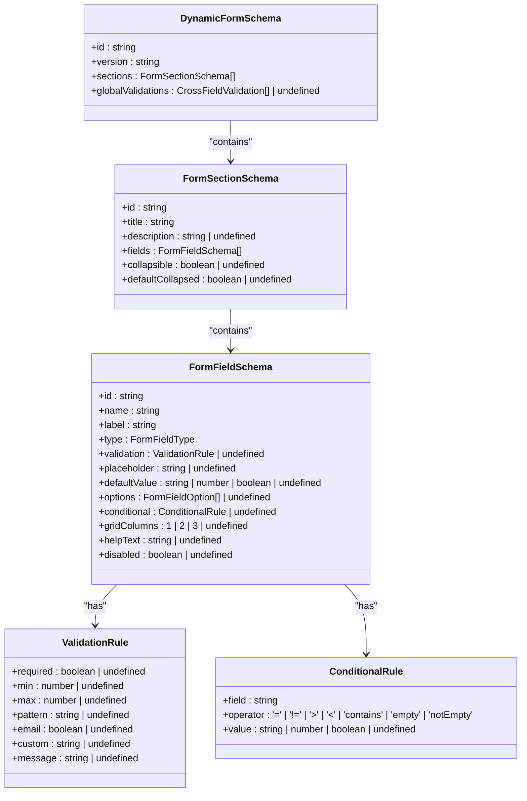

**Diagram sources**
- [form-schema.types.ts](file://types/assinatura-digital/form-schema.types.ts)

**Section sources**
- [form-schema.types.ts](file://types/assinatura-digital/form-schema.types.ts)
- [dynamic-form-step.tsx](file://components/assinatura-digital/form/dynamic-form-step.tsx)

### Form Data Processing
The form data processing workflow collects user input, validates it against defined rules, and prepares it for storage or further processing. The system handles data enrichment, transformation, and ordering to ensure consistency and usability.

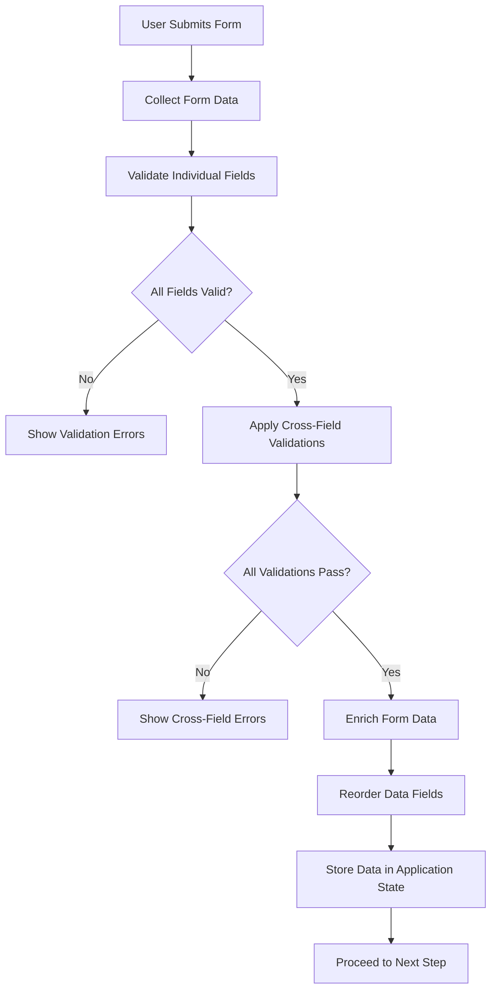

**Section sources**
- [dynamic-form-step.tsx](file://components/assinatura-digital/form/dynamic-form-step.tsx)

## Digital Signature Workflow
The digital signature workflow orchestrates the complete process of document signing, from initiation to finalization. This workflow ensures that all required data is collected, validated, and securely stored.

### Signature Finalization
The signature finalization process combines all collected data, generates the final document, and stores it securely. This process includes generating a unique protocol number, creating PDF documents, and recording the signature event in the database.

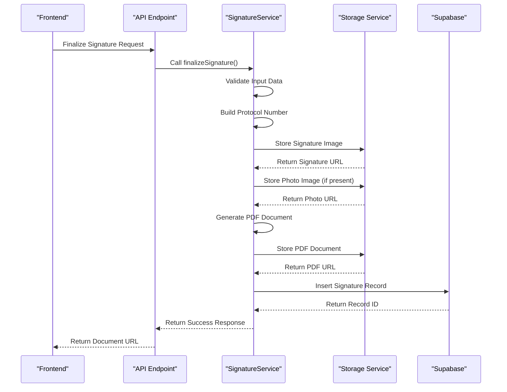

**Diagram sources**
- [signature.service.ts](file://backend/assinatura-digital/services/signature.service.ts)

**Section sources**
- [signature.service.ts](file://backend/assinatura-digital/services/signature.service.ts)
- [assinatura-manuscrita-step.tsx](file://components/assinatura-digital/form/assinatura-manuscrita-step.tsx)

### Data Security and Validation
The system implements multiple layers of data security and validation to ensure the integrity and authenticity of signed documents. This includes client-side validation, server-side validation, and security metadata collection.

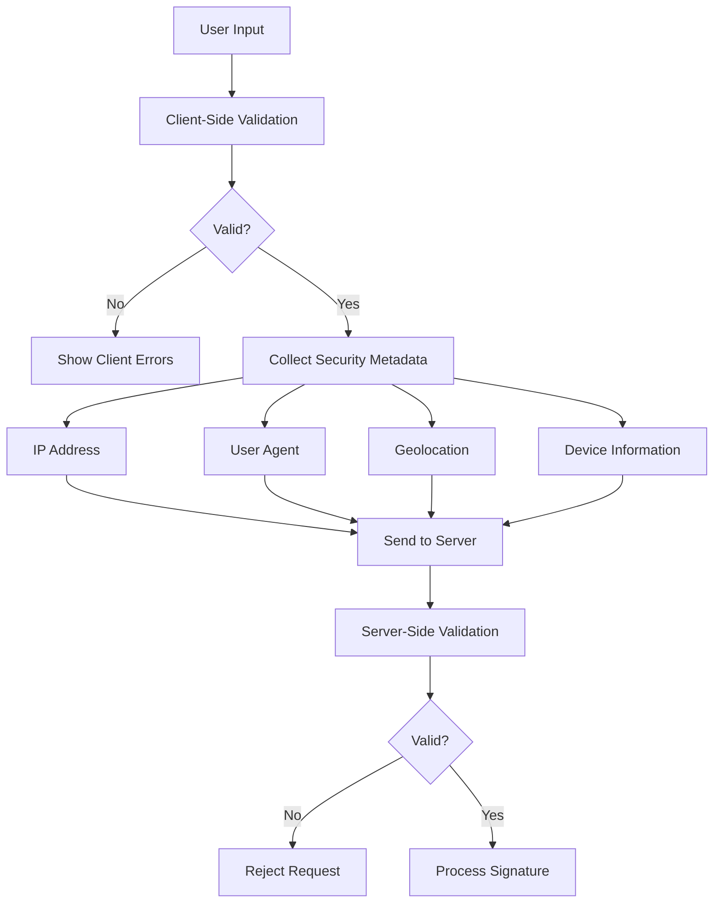

**Section sources**
- [assinatura-manuscrita-step.tsx](file://components/assinatura-digital/form/assinatura-manuscrita-step.tsx)
- [business.validations.ts](file://app/_lib/assinatura-digital/validations/business.validations.ts)

## Domain Models and Data Structures
The signature system uses well-defined domain models and data structures to represent documents, templates, forms, and signatures. These models ensure consistency across the application and facilitate data exchange between components.

### Template Data Model
The template data model defines the structure of document templates, including metadata, file information, and field mappings. This model is used both in the frontend and backend to represent templates consistently.

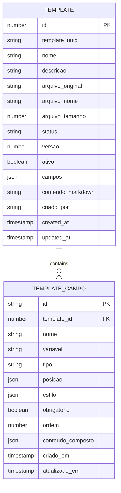

**Section sources**
- [template.types.ts](file://types/assinatura-digital/template.types.ts)
- [templates.service.ts](file://backend/assinatura-digital/services/templates.service.ts)

### Form Data Model
The form data model represents the structure of dynamic forms, including sections, fields, and validation rules. This model enables flexible form creation and consistent data collection.

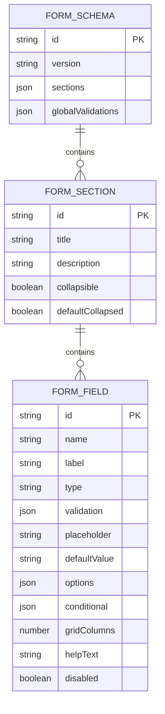

**Section sources**
- [form-schema.types.ts](file://types/assinatura-digital/form-schema.types.ts)

## Integration with Document Management
The signature components integrate seamlessly with the document management system, enabling the creation, storage, and retrieval of signed documents. This integration ensures that all signed documents are properly archived and accessible.

### Document Generation
The document generation process creates PDF documents from templates and user data. This process includes merging template fields with actual values, applying styling, and ensuring document integrity.

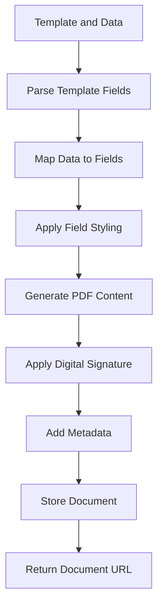

**Section sources**
- [signature.service.ts](file://backend/assinatura-digital/services/signature.service.ts)

### Document Storage
Signed documents are stored securely in the document management system with appropriate metadata and access controls. The storage system ensures document integrity and provides reliable access to authorized users.

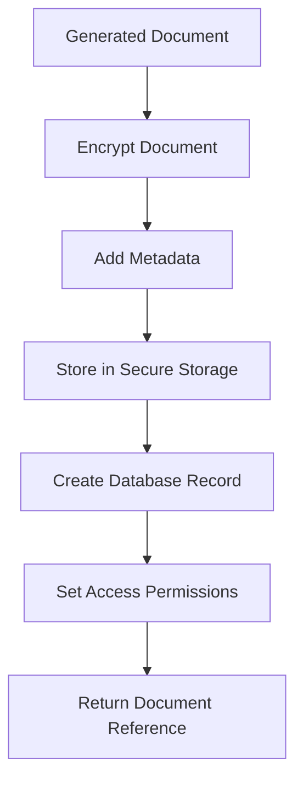

**Section sources**
- [signature.service.ts](file://backend/assinatura-digital/services/signature.service.ts)
- [storage.service.ts](file://backend/assinatura-digital/services/storage.service.ts)

## Common Issues and Solutions
The signature system may encounter various issues during operation. Understanding these common issues and their solutions helps ensure smooth operation and quick resolution of problems.

### Mobile Device Compatibility
Mobile devices present unique challenges for signature capture, including smaller screens, touch input limitations, and varying camera quality. The system addresses these issues through responsive design and adaptive interfaces.

**Solutions:**
- Implement responsive layouts that adapt to screen size
- Optimize touch targets for finger input
- Provide clear instructions for camera positioning
- Support both portrait and landscape orientations
- Implement gesture recognition for canvas navigation

**Section sources**
- [canvas-assinatura.tsx](file://components/assinatura-digital/signature/canvas-assinatura.tsx)
- [captura-foto-step.tsx](file://components/assinatura-digital/capture/captura-foto-step.tsx)

### Signature Quality Issues
Poor signature quality can result from various factors, including rushed signing, small canvas size, or device limitations. The system includes validation to detect and address these issues.

**Solutions:**
- Implement signature quality validation based on stroke count and density
- Provide real-time feedback during signing
- Allow users to clear and retry signatures
- Adjust canvas size based on device capabilities
- Implement minimum signature size requirements

**Section sources**
- [canvas-assinatura.tsx](file://components/assinatura-digital/signature/canvas-assinatura.tsx)
- [business.validations.ts](file://app/_lib/assinatura-digital/validations/business.validations.ts)

## Configuration Options and Parameters
The signature components offer various configuration options and parameters to customize behavior and appearance. These options allow administrators to tailor the system to specific use cases and requirements.

### Template Configuration
Templates can be configured with various parameters that control their behavior and appearance. These parameters include field properties, validation rules, and layout options.

**Configuration Parameters:**
- **Field Position**: X, Y coordinates and dimensions for field placement
- **Field Type**: Text, signature, checkbox, or other input types
- **Validation Rules**: Required, minimum/maximum values, pattern matching
- **Styling Options**: Font, size, color, and alignment
- **Conditional Logic**: Rules for showing/hiding fields based on other values

**Section sources**
- [FieldMappingEditor.tsx](file://components/assinatura-digital/editor/FieldMappingEditor.tsx)
- [template.types.ts](file://types/assinatura-digital/template.types.ts)

### Workflow Configuration
The signature workflow can be configured to include or exclude specific steps based on requirements. This flexibility allows for different signature processes for different document types.

**Configuration Parameters:**
- **Required Steps**: Photo capture, geolocation, signature, etc.
- **Validation Level**: Strictness of data validation
- **Security Metadata**: IP address, user agent, geolocation
- **Document Generation**: Number and type of documents to generate
- **Notification Settings**: Email alerts and status updates

**Section sources**
- [dynamic-form-step.tsx](file://components/assinatura-digital/form/dynamic-form-step.tsx)
- [assinatura-manuscrita-step.tsx](file://components/assinatura-digital/form/assinatura-manuscrita-step.tsx)