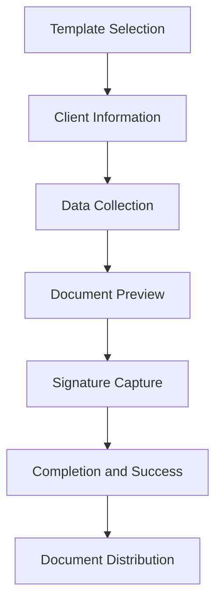
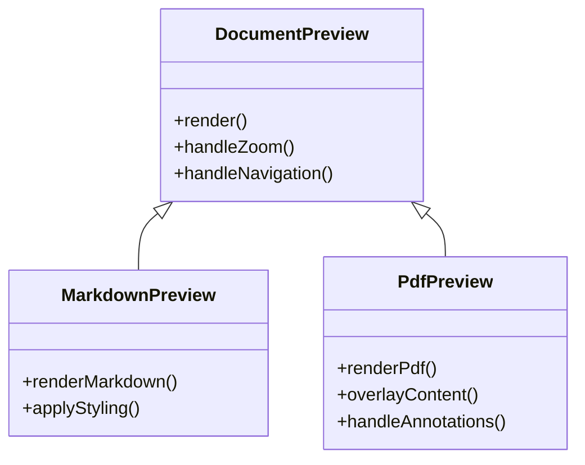
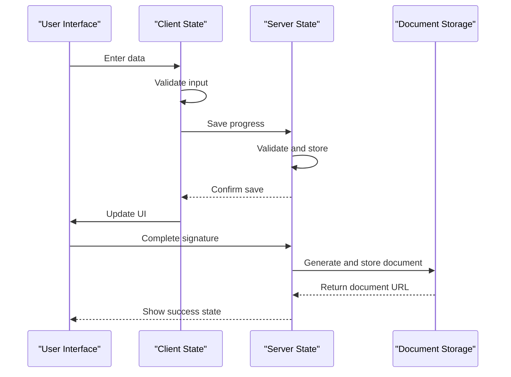

# Signature Workflow

<cite>
**Referenced Files in This Document**   
- [form-step-layout.tsx](file://components/assinatura-digital/form/form-step-layout.tsx)
- [page.tsx](file://app/(dashboard)/assinatura-digital/assinatura/page.tsx)
- [dynamic-form-renderer.tsx](file://components/assinatura-digital/form/dynamic-form-renderer.tsx)
- [formulario-page.tsx](file://components/assinatura-digital/form/formulario-page.tsx)
- [sucesso.tsx](file://components/assinatura-digital/form/sucesso.tsx)
- [signature.service.ts](file://backend/assinatura-digital/services/signature.service.ts)
- [data.service.ts](file://backend/assinatura-digital/services/data.service.ts)
- [template-pdf.service.ts](file://backend/assinatura-digital/services/template-pdf.service.ts)
- [route.ts](file://app/api/assinatura-digital/signature/preview/route.ts)
- [PdfPreview.tsx](file://components/assinatura-digital/pdf/PdfPreview.tsx)
- [PdfPreviewDynamic.tsx](file://components/assinatura-digital/pdf/PdfPreviewDynamic.tsx)
- [formulario-container.tsx](file://components/assinatura-digital/form/formulario-container.tsx)
</cite>

## Table of Contents
1. [Introduction](#introduction)
2. [Workflow Overview](#workflow-overview)
3. [FormStepLayout Orchestration](#formsteplayout-orchestration)
4. [Document Type Handling](#document-type-handling)
5. [Success State and Completion](#success-state-and-completion)
6. [Authentication and Permissions](#authentication-and-permissions)
7. [Data Flow and State Management](#data-flow-and-state-management)
8. [Error Handling and Recovery](#error-handling-and-recovery)
9. [System Integration](#system-integration)
10. [Conclusion](#conclusion)

## Introduction

The signature workflow in Sinesys provides a comprehensive digital signature solution that guides users through a multi-step process from template selection to signature completion. This workflow supports both Markdown and PDF document types, with specialized preview components for each format. The system is designed to handle complex business requirements while maintaining a user-friendly interface.

The workflow is built around a state management system that preserves user data across navigation steps, ensuring a seamless experience even if users need to pause and resume the process. Security is a primary concern, with integration to the permission system and audit logging to track all signature activities.

**Section sources**
- [page.tsx](file://app/(dashboard)/assinatura-digital/assinatura/page.tsx)

## Workflow Overview

The signature workflow follows a structured process that begins with template selection and progresses through several steps to final signature completion. The workflow is designed to be intuitive while accommodating complex document requirements.

The process starts with the user selecting a template from available options, followed by providing client information and other required data. The system then generates a preview of the document with populated fields, allowing the user to verify the content before finalizing the signature. The final step involves capturing the actual signature and completing the process.

Each step in the workflow is carefully orchestrated to ensure data integrity and provide appropriate validation. The system supports both individual and batch processing of documents, making it suitable for various use cases from simple agreements to complex legal documents.

**Diagram sources **
- [form-step-layout.tsx](file://components/assinatura-digital/form/form-step-layout.tsx)
- [dynamic-form-renderer.tsx](file://components/assinatura-digital/form/dynamic-form-renderer.tsx)

## FormStepLayout Orchestration

The FormStepLayout component serves as the central orchestrator of the multi-step signature process. It provides a consistent user interface across all steps while managing navigation, progress tracking, and state preservation.

The component accepts several key parameters that define the current state of the workflow, including the current step number, total steps, and navigation callbacks. It displays a progress bar that visually represents the user's position in the workflow, helping to set expectations about the remaining steps.

Navigation controls are dynamically enabled or disabled based on the current state and validation requirements. The component supports both programmatic navigation (through callback functions) and form-based submission, providing flexibility in how steps are advanced. Loading states are properly handled to prevent duplicate submissions and provide user feedback during asynchronous operations.

The FormStepLayout also manages the visual presentation of each step, including titles, descriptions, and appropriate styling. This ensures a consistent user experience throughout the workflow while allowing customization for specific steps.

**Section sources**
- [form-step-layout.tsx](file://components/assinatura-digital/form/form-step-layout.tsx)

## Document Type Handling

The signature workflow supports two primary document types: Markdown and PDF. Each type has specialized handling and preview components to ensure optimal rendering and user experience.

For Markdown documents, the system uses a rich text editor that preserves formatting while allowing dynamic content insertion. Variables are resolved in real-time, showing users exactly how the final document will appear. The preview component renders Markdown content with proper styling, including headings, lists, and other formatting elements.

PDF documents are handled through a more complex process. The system loads the base PDF template and overlays dynamic content at specified positions. This includes text fields, signatures, and images, all positioned according to the template configuration. The PDF preview component provides a faithful representation of the final document, including all inserted content.

Both document types support variable substitution, allowing personalized content based on client data, system information, and user inputs. The system automatically formats values according to their type (e.g., date formatting, CPF/CNPJ formatting) to ensure professional presentation.

**Diagram sources **
- [PdfPreview.tsx](file://components/assinatura-digital/pdf/PdfPreview.tsx)
- [PdfPreviewDynamic.tsx](file://components/assinatura-digital/pdf/PdfPreviewDynamic.tsx)

## Success State and Completion

The success state represents the final phase of the signature workflow, where users receive confirmation of completion and access to their signed documents. This state is designed to provide clear feedback and facilitate document distribution.

Upon successful signature completion, the system displays a success message with the generated protocol number. Users can download individual documents or all documents as a ZIP archive. The success interface includes information about the legal validity of the documents and recommendations for storage and future reference.

The completion process involves several backend operations: document finalization, storage in the document management system, entry in the audit log, and notification generation. The system generates a unique protocol number for tracking and verification purposes, which is included in both the user interface and document metadata.

Users have the option to start a new signature process directly from the success state, creating a seamless experience for multiple document signing. The interface also provides contact information for support in case users have questions about their signed documents.

**Section sources**
- [sucesso.tsx](file://components/assinatura-digital/form/sucesso.tsx)

## Authentication and Permissions

The signature workflow integrates with the system's authentication and permission framework to ensure secure access and appropriate authorization levels. Access to the workflow requires user authentication, with session management to maintain state during the signing process.

Permission checks are performed at multiple levels: access to the signature module, ability to view templates, and authorization to initiate signature processes. The system uses role-based access control (RBAC) to determine which templates and document types a user can access.

During the signature process, the system records the authenticated user's information in the audit trail. This includes the user ID, timestamp, and IP address, providing a complete record of who performed the signature and when. For sensitive documents, additional authentication factors may be required before allowing signature completion.

The permission system also controls access to completed documents, ensuring that only authorized users can view or download signed agreements. This protects client confidentiality and complies with data protection regulations.

**Section sources**
- [route.ts](file://app/api/assinatura-digital/signature/preview/route.ts)
- [signature.service.ts](file://backend/assinatura-digital/services/signature.service.ts)

## Data Flow and State Management

The signature workflow employs a sophisticated state management system to maintain data integrity across the multi-step process. State is preserved both client-side and server-side to support workflow interruption recovery and ensure data consistency.

Client-side state is managed through a centralized store that tracks user inputs, document selections, and workflow progress. This allows users to navigate between steps without losing previously entered information. The state is also used to enable conditional rendering of form fields based on previous selections.

Server-side state is maintained through temporary session records that store workflow progress. This enables recovery if the user's session is interrupted, allowing them to resume from their last completed step. The system periodically saves state to prevent data loss during extended signing processes.

Data flows from the user interface through validation layers before being processed by backend services. Input validation occurs at multiple levels: client-side for immediate feedback and server-side for security and data integrity. The system handles data transformation between different formats (e.g., date formatting, number formatting) to ensure consistent presentation.

**Diagram sources **
- [formulario-container.tsx](file://components/assinatura-digital/form/formulario-container.tsx)
- [data.service.ts](file://backend/assinatura-digital/services/data.service.ts)

## Error Handling and Recovery

The signature workflow includes comprehensive error handling mechanisms to address various failure scenarios and provide appropriate user guidance. Errors are categorized and handled according to their severity and recoverability.

Common issues such as network interruptions, validation failures, and timeout conditions are handled gracefully. The system provides specific error messages that help users understand the problem and take corrective action. For validation errors, the interface highlights the problematic fields and explains the requirements.

Workflow interruption recovery is a key feature, allowing users to resume signing processes that were interrupted due to connectivity issues or other factors. The system saves progress at each step, enabling recovery from the last completed state. Users receive clear instructions on how to resume their workflow.

Timeout handling is implemented to prevent indefinite session persistence while avoiding premature termination of legitimate signing processes. The system warns users before timeout occurs and provides options to extend the session if needed. Completed steps are preserved even if a timeout occurs later in the process.

The error handling system also includes client-side validation to prevent submission of invalid data, reducing server load and providing immediate feedback. Server-side validation ensures data integrity and security, with appropriate error responses that don't expose sensitive system information.

**Section sources**
- [signature.service.ts](file://backend/assinatura-digital/services/signature.service.ts)
- [dynamic-form-renderer.tsx](file://components/assinatura-digital/form/dynamic-form-renderer.tsx)

## System Integration

The signature workflow is tightly integrated with several core systems within Sinesys, creating a cohesive document management solution. These integrations ensure data consistency, security, and compliance across the platform.

The document management system stores all generated documents with appropriate metadata and access controls. Each signed document is cataloged with information about the signing process, participants, and timestamps. The system supports version control, allowing tracking of document changes over time.

Audit logging is implemented to record all significant events in the signature workflow. This includes template access, data entry, preview generation, and signature completion. The audit trail provides a complete record for compliance and dispute resolution purposes.

Integration with the client management system enables automatic population of client data in document templates. This reduces data entry errors and speeds up the signing process. The system validates client information against existing records to ensure accuracy.

The workflow also integrates with notification systems to inform relevant parties when documents are signed. This can trigger follow-up actions, such as case management updates or billing processes, creating a seamless workflow across different functional areas.

**Section sources**
- [signature.service.ts](file://backend/assinatura-digital/services/signature.service.ts)
- [template-pdf.service.ts](file://backend/assinatura-digital/services/template-pdf.service.ts)

## Conclusion

The signature workflow in Sinesys provides a robust, secure, and user-friendly solution for digital document signing. By combining a well-structured multi-step process with comprehensive state management and error handling, the system delivers a reliable experience for users while maintaining data integrity and security.

The integration of FormStepLayout as the central orchestration component ensures a consistent user interface across all steps, while specialized handling for different document types provides optimal rendering and functionality. The success state and completion handling offer clear feedback and facilitate document distribution, completing the user journey effectively.

The workflow's integration with authentication, permission, and audit systems ensures compliance with security requirements and provides a complete record of all signing activities. This comprehensive approach makes the signature workflow a critical component of Sinesys' document management capabilities.