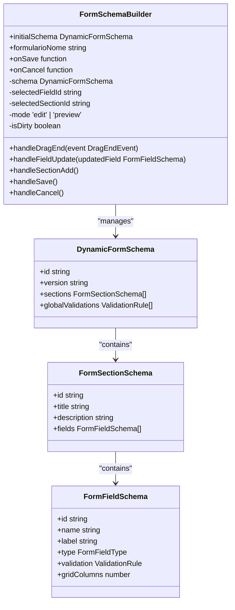
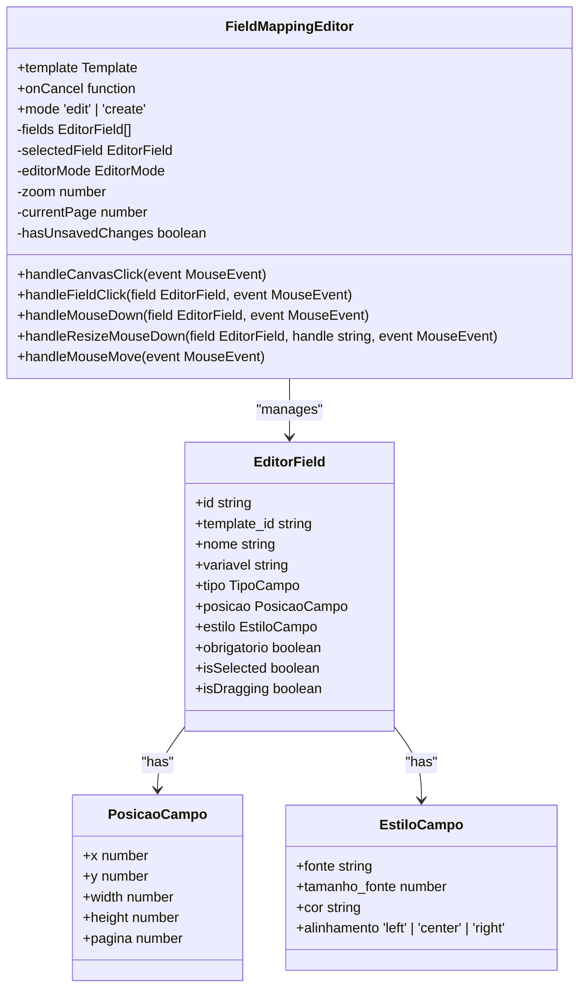
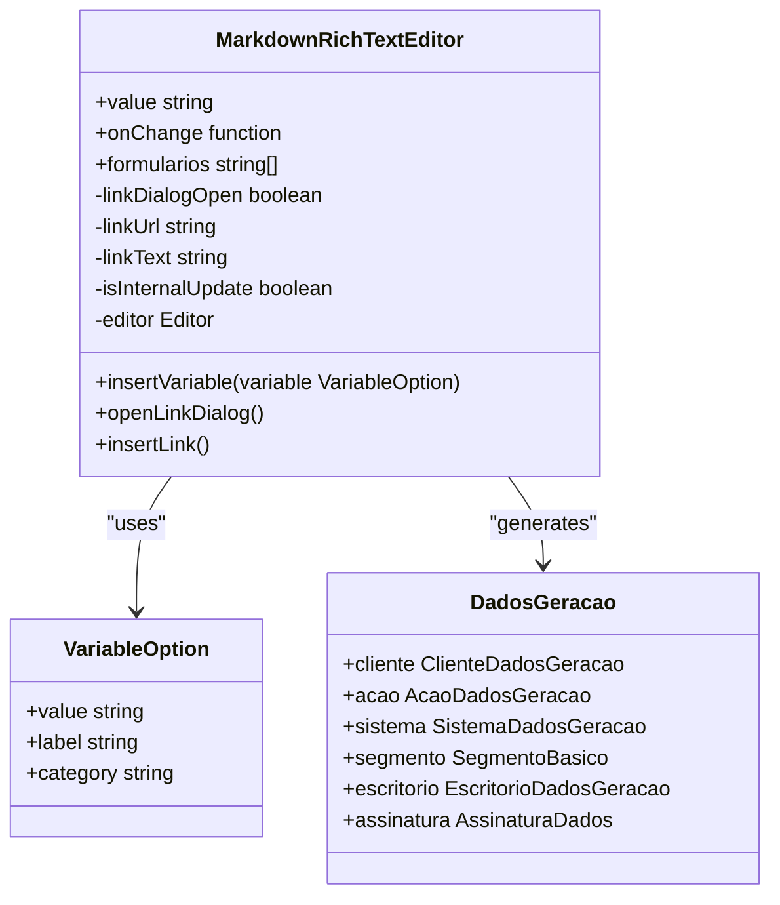
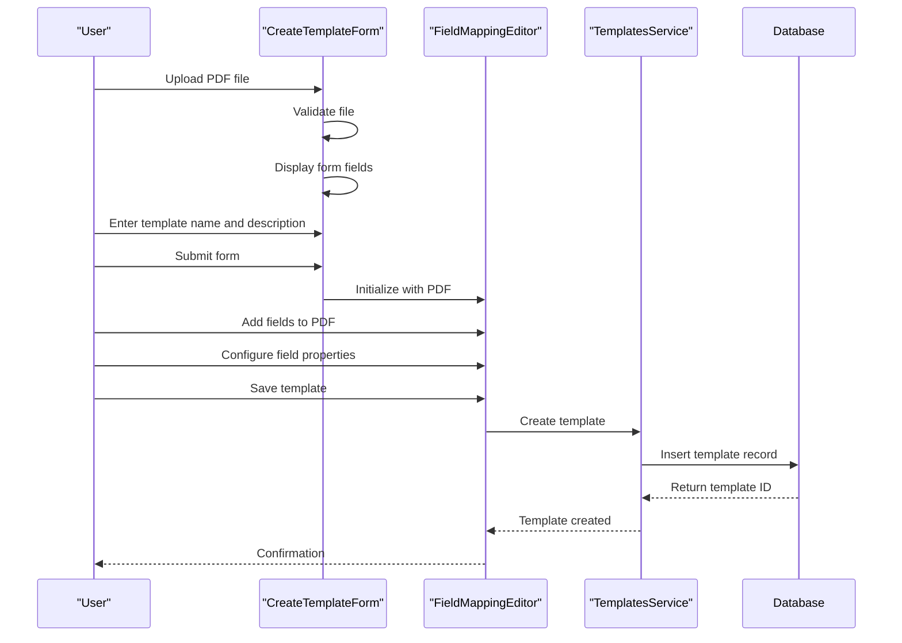
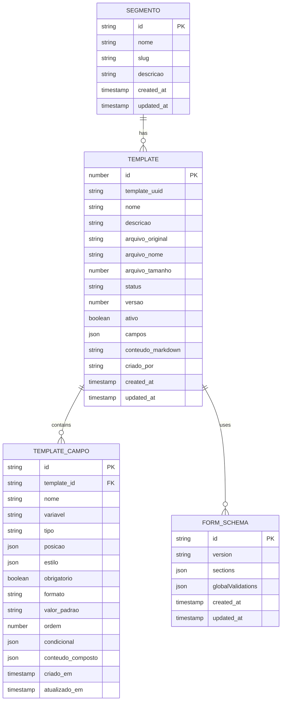
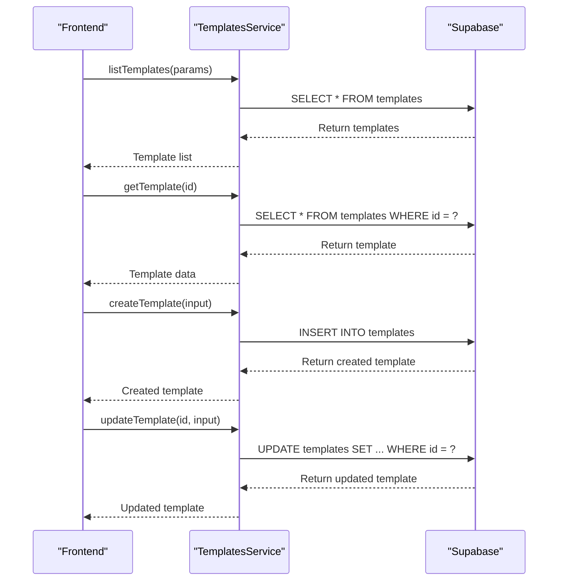
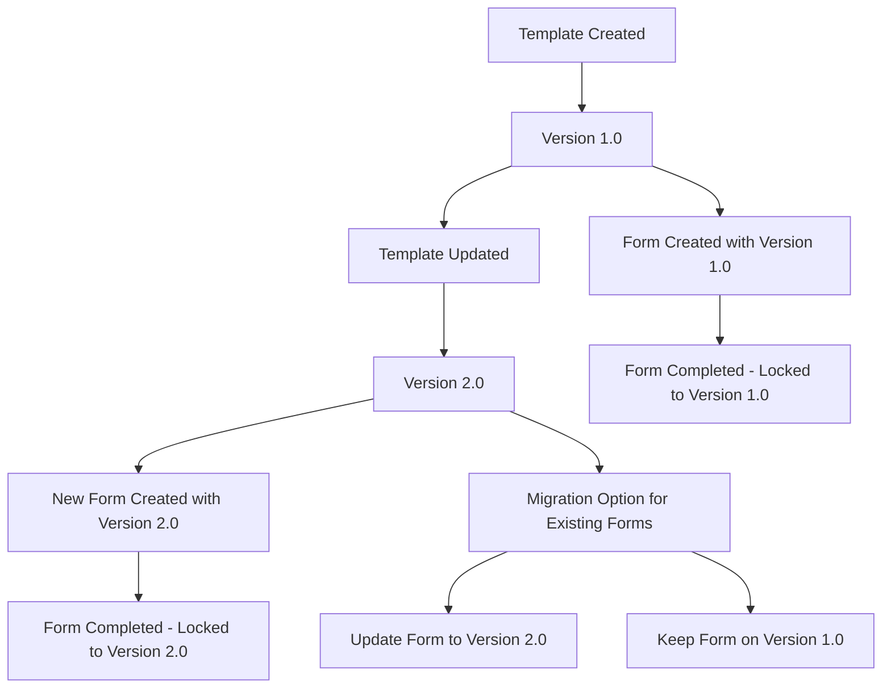
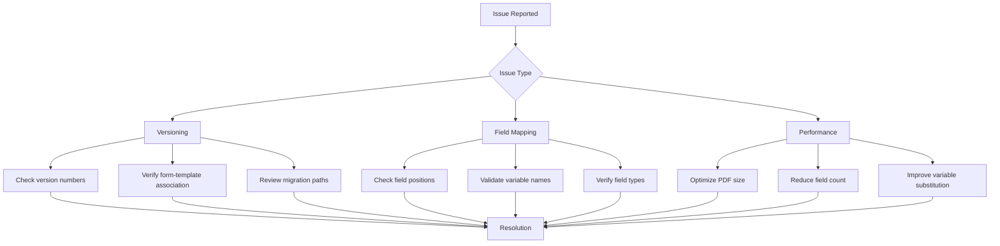

# Template Management

<cite>
**Referenced Files in This Document**   
- [FormSchemaBuilder.tsx](file://components/assinatura-digital/schema-builder/FormSchemaBuilder.tsx)
- [FieldMappingEditor.tsx](file://components/assinatura-digital/editor/FieldMappingEditor.tsx)
- [MarkdownRichTextEditor.tsx](file://components/assinatura-digital/editor/MarkdownRichTextEditor.tsx)
- [CreateTemplateForm.tsx](file://components/assinatura-digital/editor/CreateTemplateForm.tsx)
- [templates.service.ts](file://backend/assinatura-digital/services/templates.service.ts)
- [template-pdf.service.ts](file://backend/assinatura-digital/services/template-pdf.service.ts)
- [template.types.ts](file://types/assinatura-digital/template.types.ts)
- [pdf-preview.types.ts](file://types/assinatura-digital/pdf-preview.types.ts)
- [format-template.ts](file://lib/assinatura-digital/utils/format-template.ts)
</cite>

## Table of Contents
1. [Introduction](#introduction)
2. [Form Schema Builder](#form-schema-builder)
3. [Field Mapping Editor](#field-mapping-editor)
4. [Markdown Rich Text Editor](#markdown-rich-text-editor)
5. [Template Creation Workflow](#template-creation-workflow)
6. [Template Data Model](#template-data-model)
7. [Template Storage and Retrieval](#template-storage-and-retrieval)
8. [Template Versioning and Change Propagation](#template-versioning-and-change-propagation)
9. [Common Issues and Troubleshooting](#common-issues-and-troubleshooting)
10. [Conclusion](#conclusion)

## Introduction
The template management system in Sinesys provides a comprehensive solution for creating, configuring, and managing form templates for digital signature workflows. This system enables users to design dynamic forms, map fields to PDF templates, and integrate rich text content with variable substitution. The core components include the FormSchemaBuilder for creating form structures, the FieldMappingEditor for positioning fields on PDFs, and the MarkdownRichTextEditor for creating responsive content. Templates are associated with segments and used in form generation, with a robust data model supporting versioning and change propagation.

## Form Schema Builder
The FormSchemaBuilder component enables users to create and configure dynamic form templates through a drag-and-drop interface. It allows users to add various field types, organize them into sections, and define validation rules. The builder provides real-time preview functionality and JSON export/import capabilities for schema management.

The component uses a state-based approach to manage the form schema, with features for adding, editing, and deleting sections and fields. Each field has properties such as name, label, type, validation rules, and grid positioning. The schema is validated before saving to ensure structural integrity.

**Diagram sources**
- [FormSchemaBuilder.tsx](file://components/assinatura-digital/schema-builder/FormSchemaBuilder.tsx#L22-L733)

**Section sources**
- [FormSchemaBuilder.tsx](file://components/assinatura-digital/schema-builder/FormSchemaBuilder.tsx#L1-L733)

## Field Mapping Editor
The FieldMappingEditor component allows users to position and configure fields on a PDF template. It provides a canvas interface where users can drag and drop fields, resize them, and set their properties. The editor supports different field types including text, signature, and composite text fields.

The component handles PDF rendering, field positioning, and interaction events. It maintains state for selected fields, zoom level, and page navigation. Field properties such as font, size, color, and alignment can be configured through a properties panel.

**Diagram sources**
- [FieldMappingEditor.tsx](file://components/assinatura-digital/editor/FieldMappingEditor.tsx#L31-L2209)

**Section sources**
- [FieldMappingEditor.tsx](file://components/assinatura-digital/editor/FieldMappingEditor.tsx#L1-L2209)

## Markdown Rich Text Editor
The MarkdownRichTextEditor component provides a WYSIWYG interface for creating rich text content that can be integrated with PDF templates. It supports Markdown formatting, variable substitution, and link insertion. The editor uses the Tiptap library for rich text editing capabilities.

The component allows users to insert variables from different categories (client, system, signature) that will be substituted with actual values during form generation. It provides toolbar buttons for formatting options and a combobox for variable selection.

**Diagram sources**
- [MarkdownRichTextEditor.tsx](file://components/assinatura-digital/editor/MarkdownRichTextEditor.tsx#L37-L273)

**Section sources**
- [MarkdownRichTextEditor.tsx](file://components/assinatura-digital/editor/MarkdownRichTextEditor.tsx#L1-L273)

## Template Creation Workflow
The template creation workflow begins with the CreateTemplateForm component, which guides users through the process of creating a new template. Users upload a PDF file and provide basic information such as name and description. The workflow then transitions to the FieldMappingEditor where users can position fields on the PDF.

The process involves several steps:
1. Upload a PDF template file
2. Provide template metadata (name, description)
3. Position fields on the PDF using drag-and-drop
4. Configure field properties and variable mappings
5. Add optional Markdown content
6. Save the template to the database

**Diagram sources**
- [CreateTemplateForm.tsx](file://components/assinatura-digital/editor/CreateTemplateForm.tsx#L19-L267)
- [FieldMappingEditor.tsx](file://components/assinatura-digital/editor/FieldMappingEditor.tsx#L31-L2209)
- [templates.service.ts](file://backend/assinatura-digital/services/templates.service.ts#L1-L194)

**Section sources**
- [CreateTemplateForm.tsx](file://components/assinatura-digital/editor/CreateTemplateForm.tsx#L1-L267)

## Template Data Model
The template data model in Sinesys defines the structure of templates, fields, and their relationships. Templates are associated with segments and used in form generation. The model supports versioning and change propagation to ensure consistency across related forms.

The core entities include Template, TemplateCampo (template field), and Segmento (segment). Templates can have multiple fields, each with specific properties and variable mappings. Segments define categories or types of templates, allowing for organized template management.

**Diagram sources**
- [template.types.ts](file://types/assinatura-digital/template.types.ts#L35-L170)
- [template.types.ts](file://backend/types/template.types.ts#L6-L64)

**Section sources**
- [template.types.ts](file://types/assinatura-digital/template.types.ts#L1-L170)

## Template Storage and Retrieval
Templates are stored in a PostgreSQL database using Supabase as the backend service. The templates.service.ts file contains functions for creating, reading, updating, and deleting templates. Templates are stored with their metadata, field configurations, and associated PDF file references.

The storage system uses a service client pattern to interact with the database, providing functions for listing templates, retrieving specific templates, creating new templates, updating existing templates, and deleting templates. Each operation includes logging for monitoring and debugging purposes.

**Diagram sources**
- [templates.service.ts](file://backend/assinatura-digital/services/templates.service.ts#L1-L194)

**Section sources**
- [templates.service.ts](file://backend/assinatura-digital/services/templates.service.ts#L1-L194)

## Template Versioning and Change Propagation
The template system supports versioning through the 'versao' field in the template entity. Each time a template is updated, its version number is incremented. This allows for tracking changes and maintaining historical versions of templates.

When template changes are made, they propagate to existing forms through a versioning system. Forms are associated with a specific template version, ensuring that changes to the template do not affect already completed forms. New forms use the latest version of the template.

The system handles change propagation by:
1. Maintaining version history for templates
2. Associating forms with specific template versions
3. Providing migration paths for updating forms to new template versions
4. Preserving data integrity during version transitions

**Section sources**
- [templates.service.ts](file://backend/assinatura-digital/services/templates.service.ts#L1-L194)
- [template.types.ts](file://types/assinatura-digital/template.types.ts#L35-L170)

## Common Issues and Troubleshooting
The template management system may encounter several common issues that require troubleshooting. These include template versioning conflicts, field mapping conflicts, and rendering performance issues with complex templates.

**Template Versioning Issues:**
- Ensure version numbers are incremented correctly when updating templates
- Verify that forms are associated with the correct template version
- Implement proper migration paths for updating forms to new template versions

**Field Mapping Conflicts:**
- Check for overlapping field positions on the PDF
- Validate that variable names are unique and correctly formatted
- Ensure field types match the expected data types

**Rendering Performance:**
- Optimize PDF file size to improve loading times
- Limit the number of fields on complex templates
- Use efficient variable substitution methods

**Section sources**
- [templates.service.ts](file://backend/assinatura-digital/services/templates.service.ts#L1-L194)
- [template-pdf.service.ts](file://backend/assinatura-digital/services/template-pdf.service.ts#L1-L215)
- [format-template.ts](file://lib/assinatura-digital/utils/format-template.ts#L1-L109)

## Conclusion
The template management system in Sinesys provides a comprehensive solution for creating, configuring, and managing form templates for digital signature workflows. The system's modular architecture, with components like FormSchemaBuilder, FieldMappingEditor, and MarkdownRichTextEditor, enables flexible template creation and configuration. The robust data model supports versioning and change propagation, ensuring consistency across related forms. By addressing common issues such as template versioning, field mapping conflicts, and rendering performance, the system provides a reliable foundation for template management in digital signature workflows.