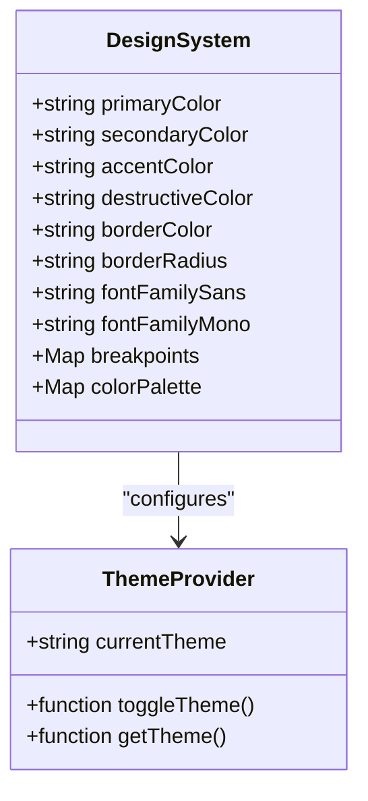
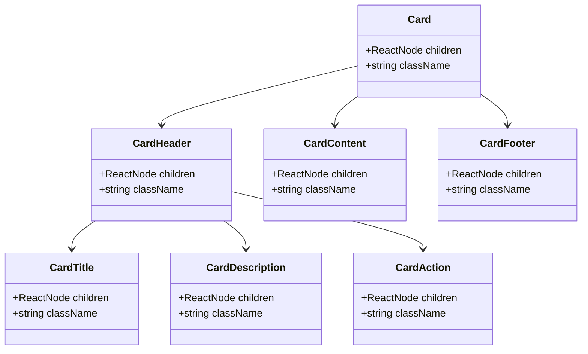
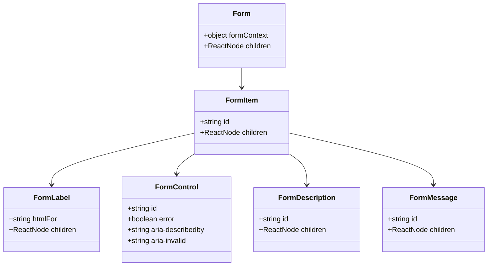
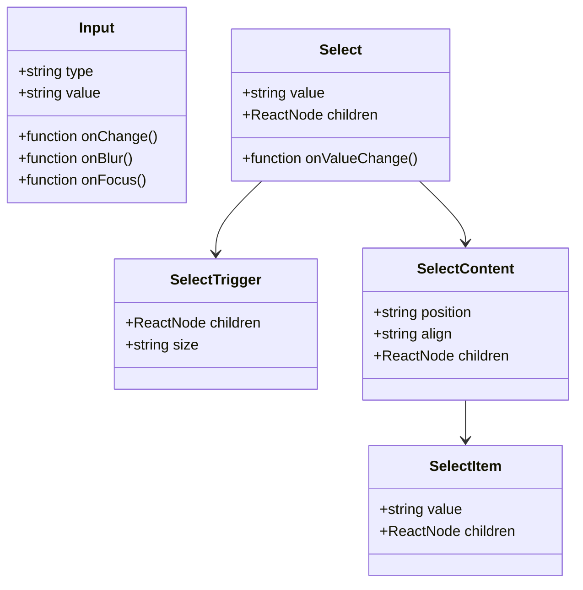
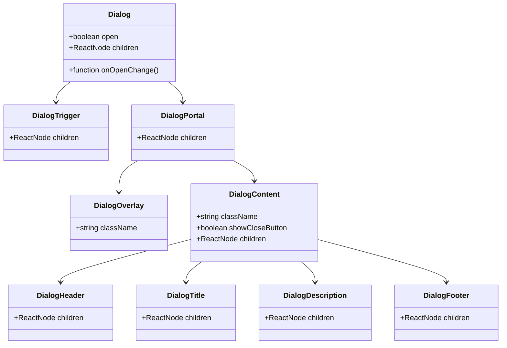
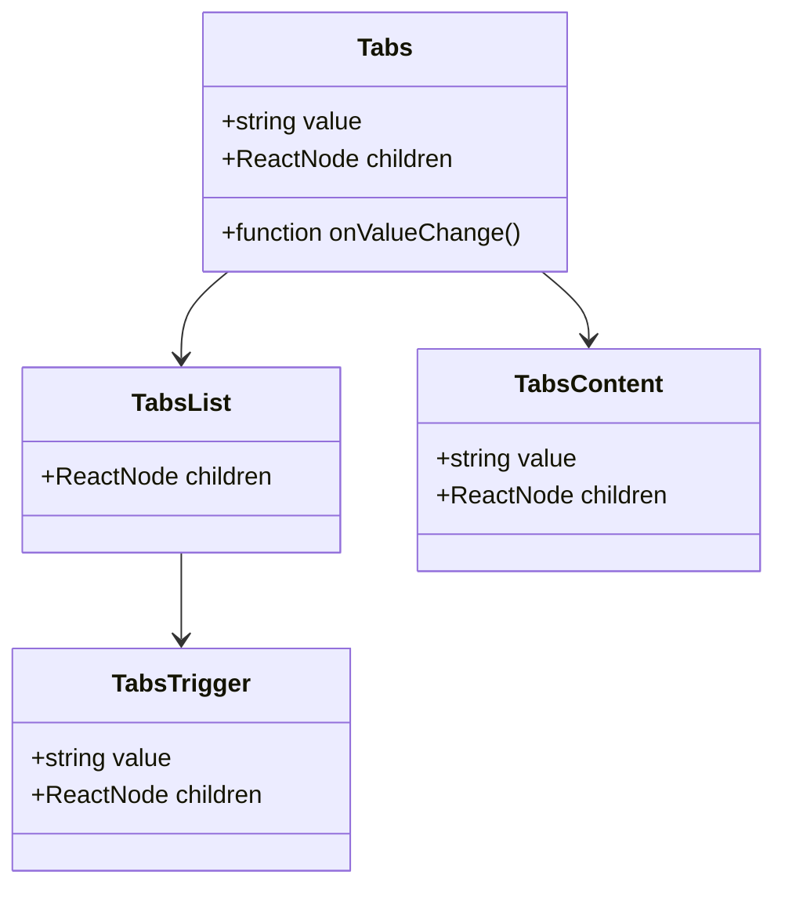
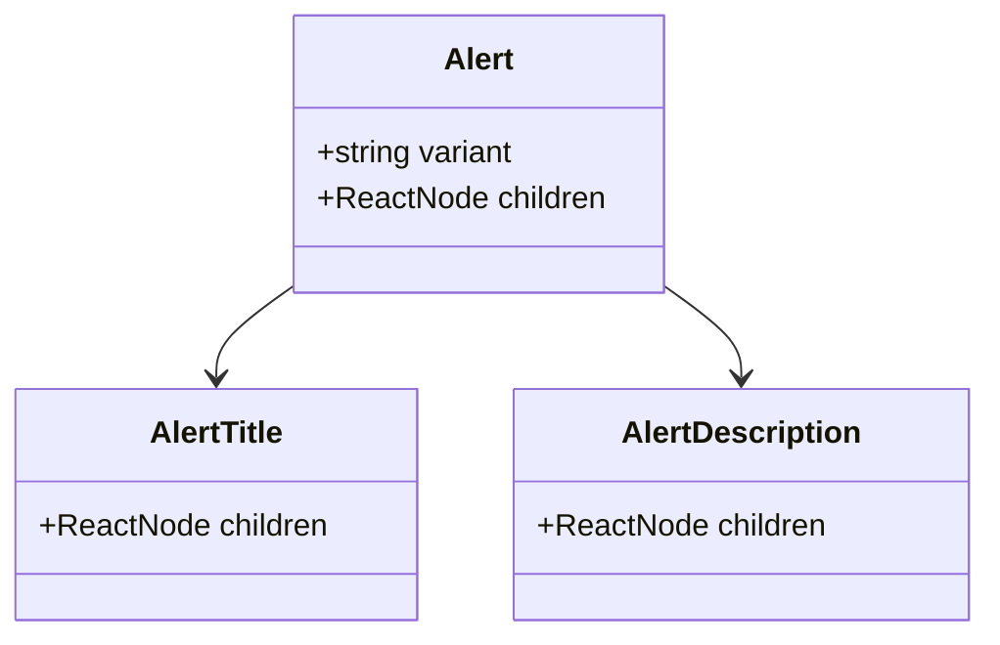
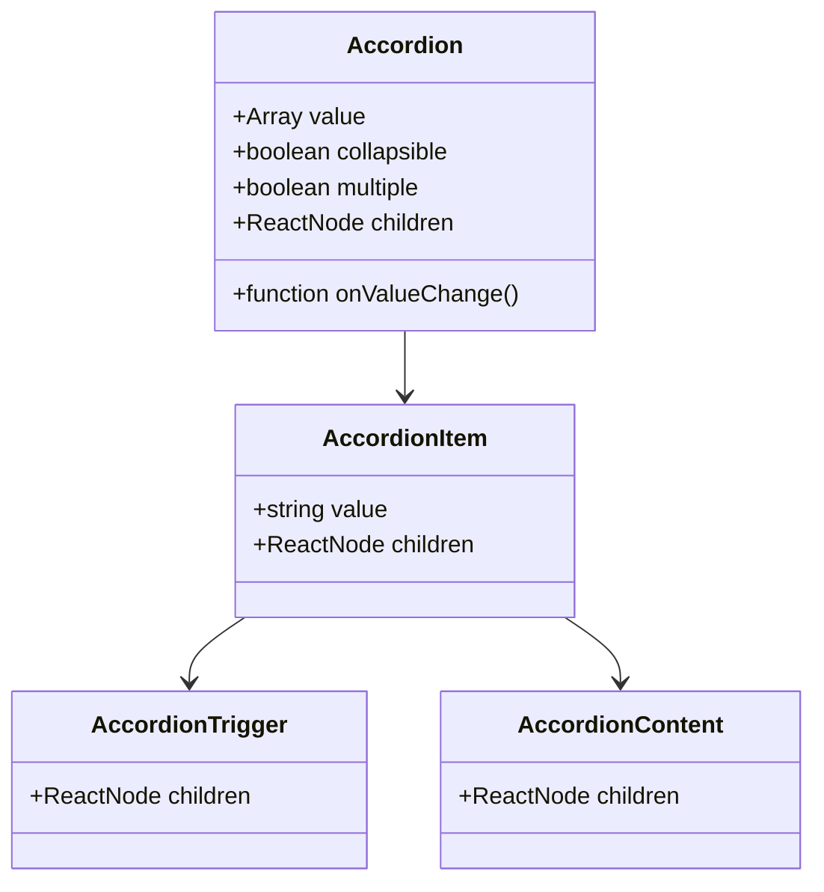
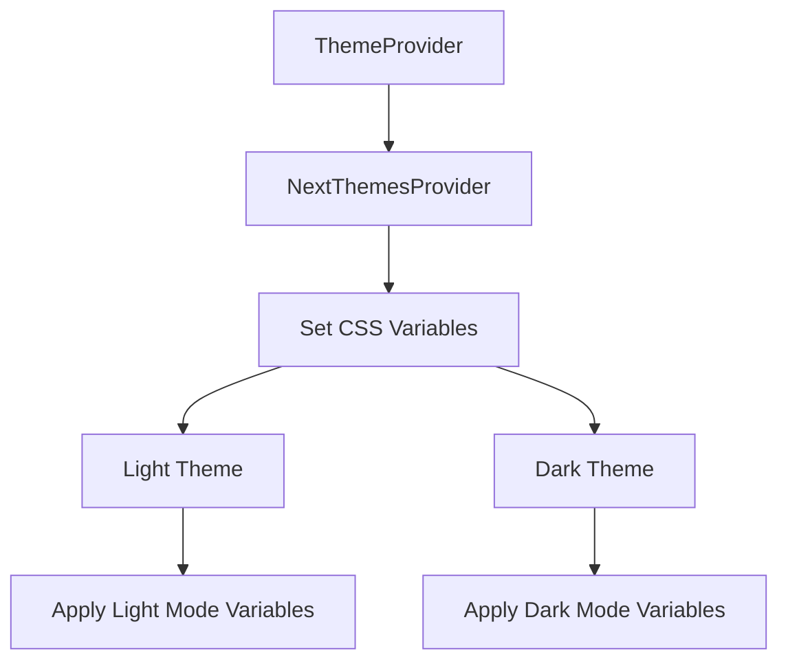

# Frontend Components

<cite>
**Referenced Files in This Document**   
- [components.json](file://components.json)
- [globals.css](file://app/globals.css)
- [button.tsx](file://components/ui/button.tsx)
- [card.tsx](file://components/ui/card.tsx)
- [dialog.tsx](file://components/ui/dialog.tsx)
- [tabs.tsx](file://components/ui/tabs.tsx)
- [form.tsx](file://components/ui/form.tsx)
- [accordion.tsx](file://components/ui/accordion.tsx)
- [alert.tsx](file://components/ui/alert.tsx)
- [input.tsx](file://components/ui/input.tsx)
- [select.tsx](file://components/ui/select.tsx)
- [checkbox.tsx](file://components/ui/checkbox.tsx)
- [theme-provider.tsx](file://components/ui/theme-provider.tsx)
- [typography.tsx](file://components/ui/typography.tsx)
</cite>

## Table of Contents
1. [Introduction](#introduction)
2. [Design System Principles](#design-system-principles)
3. [Component Categorization](#component-categorization)
4. [Core Component Analysis](#core-component-analysis)
5. [Form Components](#form-components)
6. [Layout and Navigation Components](#layout-and-navigation-components)
7. [Data Display Components](#data-display-components)
8. [Interactive Components](#interactive-components)
9. [Accessibility and Responsive Design](#accessibility-and-responsive-design)
10. [Theming and Customization](#theming-and-customization)
11. [Component Composition Patterns](#component-composition-patterns)
12. [Performance Optimization](#performance-optimization)

## Introduction
The Sinesys frontend components are built on the shadcn/ui library with Tailwind CSS, providing a consistent and accessible user interface across the application. The component system follows modern React patterns with a focus on accessibility, responsiveness, and customization. This documentation details the UI library implementation, design system principles, and component categorization used throughout the Sinesys application.

**Section sources**
- [components.json](file://components.json)
- [globals.css](file://app/globals.css)

## Design System Principles
The Sinesys design system is based on shadcn/ui with the "new-york" style, utilizing Tailwind CSS for styling and Lucide for icons. The system implements a comprehensive design language with consistent spacing, typography, and color schemes.

The design system uses CSS variables for theming, with a well-defined color palette that supports both light and dark modes. The color system is based on OKLCH color space, providing perceptually uniform color transitions. The design system includes breakpoints for responsive design at 481px, 768px, 1025px, 1281px, and 1536px.

Typography follows a structured hierarchy with predefined classes for headings (h1-h4), paragraphs, and other text elements. The system uses Geist fonts for both sans-serif and monospace text, with appropriate font weights and line heights for optimal readability.



**Diagram sources**
- [components.json](file://components.json)
- [globals.css](file://app/globals.css)

**Section sources**
- [components.json](file://components.json)
- [globals.css](file://app/globals.css)

## Component Categorization
The Sinesys component library is organized into several categories based on functionality and usage patterns. The components are structured in the components/ui directory and follow the shadcn/ui patterns with additional customizations for the application's specific needs.

The main component categories include:
- **Layout components**: Card, Sheet, Sidebar, ScrollArea
- **Form components**: Input, Select, Checkbox, RadioGroup, Form
- **Interactive components**: Button, Dialog, DropdownMenu, Tabs
- **Navigation components**: Breadcrumb, NavigationMenu, Tabs
- **Data display components**: Table, Badge, Progress, Chart
- **Feedback components**: Alert, Toast, Tooltip, Skeleton

Each component is implemented as a composition of lower-level primitives from Radix UI, enhanced with Tailwind CSS classes for styling. The components follow a consistent API pattern with data-slot attributes for styling and accessibility.

**Section sources**
- [components.json](file://components.json)
- [components/ui](file://components/ui)

## Core Component Analysis

### Button Component
The Button component is a fundamental interactive element in the Sinesys UI, providing multiple variants and sizes for different use cases. It uses class-variance-authority (CVA) to manage variant styles and supports the asChild prop for composing with other components.

The button supports several variants:
- **default**: Primary action with primary background
- **destructive**: For delete or dangerous actions
- **outline**: Border-only style with hover effects
- **secondary**: Secondary action with secondary background
- **ghost**: Minimal style for secondary actions
- **link**: Text link style with underline

Size options include default, small (sm), large (lg), and icon variants. The component implements proper focus states with ring effects and disabled states with reduced opacity.

```mermaid
classDiagram
class Button {
+string variant
+string size
+boolean asChild
+ReactNode children
+function onClick()
}
Button : +variants : default, destructive, outline, secondary, ghost, link
Button : +sizes : default, sm, lg, icon, icon-sm, icon-lg
```

**Diagram sources**
- [button.tsx](file://components/ui/button.tsx)

**Section sources**
- [button.tsx](file://components/ui/button.tsx)

### Card Component
The Card component provides a container for grouping related content with a consistent visual style. It implements a flexible layout with header, title, description, content, footer, and action sections that can be composed as needed.

The card structure follows a semantic hierarchy with appropriate data-slot attributes for styling and accessibility. The component uses a flex layout with gap spacing and supports custom styling through the className prop. The card has a subtle shadow and border to distinguish it from the background.



**Diagram sources**
- [card.tsx](file://components/ui/card.tsx)

**Section sources**
- [card.tsx](file://components/ui/card.tsx)

## Form Components

### Form and FormItem
The form system in Sinesys is built on react-hook-form with custom components for consistent styling and behavior. The Form component provides the context for form state management, while FormItem serves as a wrapper for individual form controls.

The form system implements accessibility features including proper labeling, error messaging, and focus management. Error states are visually indicated with red borders and accompanying tooltips that display error messages when a field is invalid and has been blurred.



**Diagram sources**
- [form.tsx](file://components/ui/form.tsx)

**Section sources**
- [form.tsx](file://components/ui/form.tsx)

### Input and Select Components
The Input component provides a styled text input with consistent styling across the application. It supports all standard HTML input attributes and implements proper focus and error states. The component uses Tailwind CSS for styling with responsive sizing and proper touch targets.

The Select component is a controlled dropdown menu built on Radix UI primitives. It supports single selection from a list of options with proper keyboard navigation and accessibility. The component includes scroll buttons for long lists and supports grouping with SelectGroup and SelectLabel.



**Diagram sources**
- [input.tsx](file://components/ui/input.tsx)
- [select.tsx](file://components/ui/select.tsx)

**Section sources**
- [input.tsx](file://components/ui/input.tsx)
- [select.tsx](file://components/ui/select.tsx)

### Checkbox Component
The Checkbox component provides a styled checkbox input with visual feedback for checked and unchecked states. It uses Radix UI's Checkbox primitive for proper accessibility and keyboard navigation.

The component displays a check icon when checked and implements proper focus states with ring effects. The visual design includes a subtle shadow and border with color changes based on the current theme.

```mermaid
classDiagram
class Checkbox {
+boolean checked
+function onCheckedChange()
+string name
+string value
}
Checkbox : +states : unchecked, checked, indeterminate
```

**Diagram sources**
- [checkbox.tsx](file://components/ui/checkbox.tsx)

**Section sources**
- [checkbox.tsx](file://components/ui/checkbox.tsx)

## Layout and Navigation Components

### Dialog Component
The Dialog component provides a modal overlay for displaying content that requires user attention. It's built on Radix UI's Dialog primitive with custom styling to match the Sinesys design system.

The dialog implements proper accessibility features including focus trapping, proper ARIA attributes, and keyboard navigation. The component includes an overlay with a semi-transparent background and a content area that is centered on the screen.



**Diagram sources**
- [dialog.tsx](file://components/ui/dialog.tsx)

**Section sources**
- [dialog.tsx](file://components/ui/dialog.tsx)

### Tabs Component
The Tabs component provides a tabbed interface for organizing content into multiple sections. It's built on Radix UI's Tabs primitive with custom styling for the tab list, triggers, and content areas.

The component supports horizontal tab layouts with visual indication of the active tab. The tab triggers have proper hover and focus states, and the component implements smooth transitions between tab content.



**Diagram sources**
- [tabs.tsx](file://components/ui/tabs.tsx)

**Section sources**
- [tabs.tsx](file://components/ui/tabs.tsx)

## Data Display Components

### Alert Component
The Alert component provides a way to display important messages to users with visual distinction based on severity. It supports two variants: default and destructive (for error messages).

The component includes optional title and description elements with proper spacing and typography. The visual design includes a left border accent and optional icon to draw attention to the message.



**Diagram sources**
- [alert.tsx](file://components/ui/alert.tsx)

**Section sources**
- [alert.tsx](file://components/ui/alert.tsx)

### Accordion Component
The Accordion component provides a vertically stacked set of headers that can be clicked to reveal or hide associated content. It's built on Radix UI's Accordion primitive with custom styling.

The component supports multiple items with individual open/close states and optional controlled behavior. The visual design includes a chevron icon that rotates to indicate the open/closed state.



**Diagram sources**
- [accordion.tsx](file://components/ui/accordion.tsx)

**Section sources**
- [accordion.tsx](file://components/ui/accordion.tsx)

## Interactive Components

### Theme Provider
The ThemeProvider component wraps the application and manages the current theme state (light/dark). It's built on next-themes and provides a context for theme-aware components.

The component uses CSS variables defined in globals.css to apply the appropriate color scheme based on the current theme. It supports system preference detection and manual theme switching.



**Diagram sources**
- [theme-provider.tsx](file://components/ui/theme-provider.tsx)

**Section sources**
- [theme-provider.tsx](file://components/ui/theme-provider.tsx)

## Accessibility and Responsive Design
The Sinesys component library follows WCAG 2.1 guidelines for accessibility, ensuring that all components are usable by people with various disabilities. Key accessibility features include:

- Proper ARIA attributes for interactive elements
- Keyboard navigation support for all interactive components
- Sufficient color contrast between text and background
- Focus indicators that are visible and consistent
- Semantic HTML structure with appropriate heading levels
- Screen reader support with descriptive labels and messages

The responsive design system uses a mobile-first approach with breakpoints defined in CSS variables. Components adapt their layout and behavior based on screen size, ensuring optimal user experience across devices.

For touch devices, interactive elements have appropriate minimum touch target sizes (44px) to ensure usability. The system also respects user preferences for reduced motion, disabling animations when requested.

**Section sources**
- [globals.css](file://app/globals.css)
- [components/ui/*.tsx](file://components/ui)

## Theming and Customization
The Sinesys component library supports theming through CSS variables defined in globals.css. The theme system allows for easy customization of colors, spacing, typography, and other design tokens.

The CSS variables follow a naming convention that includes the component or property type, making them easy to understand and modify. The theme supports both light and dark modes with carefully selected color values that maintain proper contrast ratios.

Customization options include:
- Color palette overrides through CSS variables
- Typography adjustments via font family and size variables
- Spacing and sizing modifications
- Border radius customization
- Shadow and elevation settings

Components use the cn utility function to combine class names, making it easy to extend or override styles while preserving the base component styling.

**Section sources**
- [globals.css](file://app/globals.css)
- [components.json](file://components.json)

## Component Composition Patterns
The Sinesys component library follows composition patterns that promote reusability and maintainability. Components are designed to be composable, allowing developers to create complex UIs by combining simple building blocks.

Key composition patterns include:
- **Slot pattern**: Using the Slot component from Radix UI to allow children to inherit component styles
- **Compound components**: Components like Card and Form that have multiple sub-components that work together
- **Provider pattern**: Using React context to share state between related components
- **Render props**: Passing functions as children to allow for dynamic content rendering

These patterns enable the creation of complex layouts like dashboard grids and hearing calendars by combining basic components in meaningful ways.

**Section sources**
- [components/ui/*.tsx](file://components/ui)

## Performance Optimization
The Sinesys frontend implements several performance optimization techniques to ensure a smooth user experience:

- **Code splitting**: Components are organized to enable lazy loading of non-critical components
- **Memoization**: React.memo and useMemo are used to prevent unnecessary re-renders
- **Virtualization**: Large lists are virtualized to improve rendering performance
- **Image optimization**: Images are properly sized and compressed
- **Bundle optimization**: Tree shaking and code minification are applied

The component library also implements performance best practices such as avoiding inline function definitions in render methods and using stable component references.

**Section sources**
- [components/ui/*.tsx](file://components/ui)