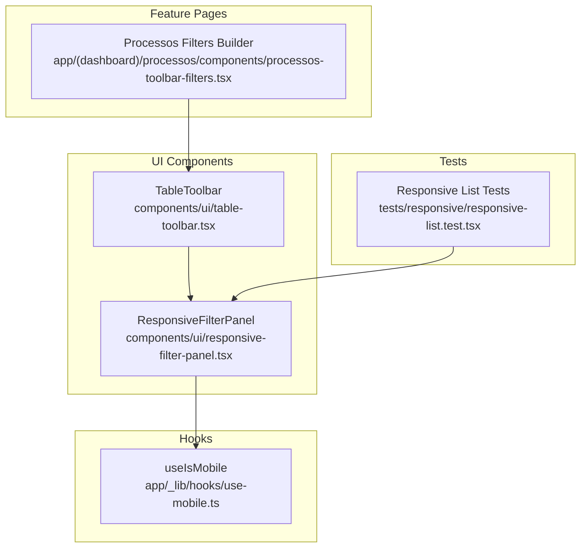
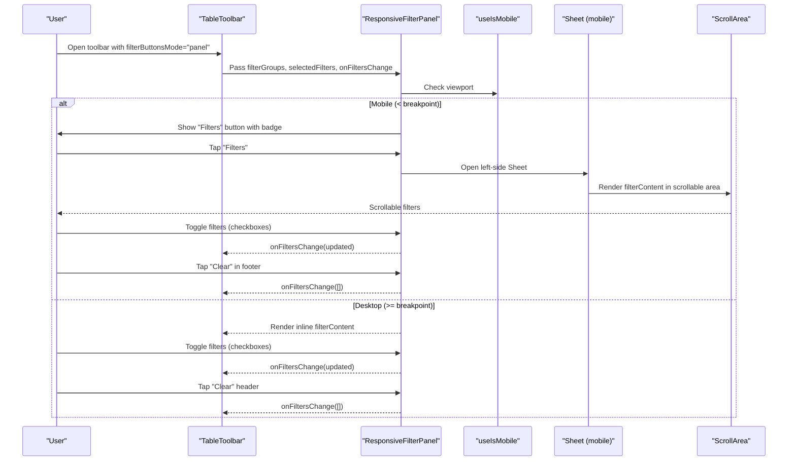
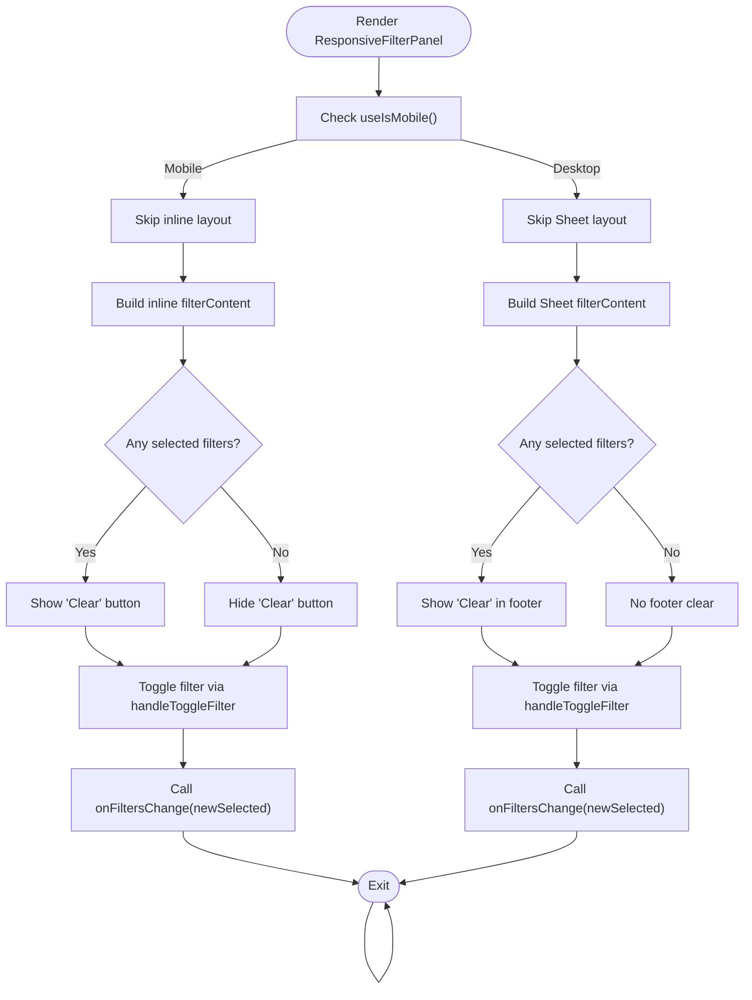
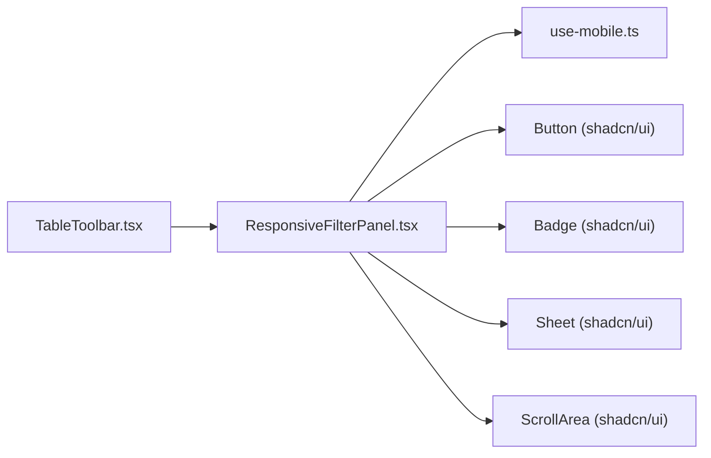

# Responsive Filter Panel

<cite>
**Referenced Files in This Document**
- [responsive-filter-panel.tsx](file://components/ui/responsive-filter-panel.tsx)
- [responsive-filter-panel.md](file://components/ui/responsive-filter-panel.md)
- [table-toolbar.tsx](file://components/ui/table-toolbar.tsx)
- [use-mobile.ts](file://app/_lib/hooks/use-mobile.ts)
- [processos-toolbar-filters.tsx](file://app/(dashboard)/processos/components/processos-toolbar-filters.tsx)
- [responsive-list.test.tsx](file://tests/responsive/responsive-list.test.tsx)
</cite>

## Table of Contents
1. [Introduction](#introduction)
2. [Project Structure](#project-structure)
3. [Core Components](#core-components)
4. [Architecture Overview](#architecture-overview)
5. [Detailed Component Analysis](#detailed-component-analysis)
6. [Dependency Analysis](#dependency-analysis)
7. [Performance Considerations](#performance-considerations)
8. [Troubleshooting Guide](#troubleshooting-guide)
9. [Conclusion](#conclusion)

## Introduction
This document explains the Responsive Filter Panel component, which provides a unified filtering experience across desktop and mobile. On desktop (and larger viewports), filters are displayed inline with clear controls. On mobile (below a specific breakpoint), a compact “Filters” button opens a slide-out panel containing all filters and a clear action. The component integrates tightly with the Table Toolbar to support a consistent filtering UX in list views.

## Project Structure
The Responsive Filter Panel lives under the UI components and is documented alongside its integration points and usage examples.

**Diagram sources**
- [responsive-filter-panel.tsx](file://components/ui/responsive-filter-panel.tsx#L133-L248)
- [table-toolbar.tsx](file://components/ui/table-toolbar.tsx#L159-L269)
- [use-mobile.ts](file://app/_lib/hooks/use-mobile.ts#L1-L19)
- [processos-toolbar-filters.tsx](file://app/(dashboard)/processos/components/processos-toolbar-filters.tsx#L155-L200)
- [responsive-list.test.tsx](file://tests/responsive/responsive-list.test.tsx#L80-L112)

**Section sources**
- [responsive-filter-panel.tsx](file://components/ui/responsive-filter-panel.tsx#L1-L249)
- [table-toolbar.tsx](file://components/ui/table-toolbar.tsx#L127-L269)
- [use-mobile.ts](file://app/_lib/hooks/use-mobile.ts#L1-L19)
- [processos-toolbar-filters.tsx](file://app/(dashboard)/processos/components/processos-toolbar-filters.tsx#L1-L200)
- [responsive-list.test.tsx](file://tests/responsive/responsive-list.test.tsx#L80-L112)

## Core Components
- ResponsiveFilterPanel: The main component that renders filters inline on desktop and in a slide-out panel on mobile. It exposes props for filter groups, selection state, callbacks, and optional custom rendering.
- TableToolbar: Integrates the panel into a toolbar layout, enabling filterButtonsMode="panel" to route the filter UI into the panel.
- useIsMobile: A hook that detects whether the viewport is below the mobile breakpoint and drives responsive behavior.
- Processos Filters Builder: Demonstrates building filter groups for a real-world listing (processes), showing how to structure FilterGroup arrays consumed by the panel.

Key responsibilities:
- Desktop: Inline filter groups with a clear-all control when selections exist.
- Mobile: “Filters” button with badge indicating active filters; tapping opens a Sheet with scrollable filters and a clear-all footer action.
- Customization: Optional renderFilterGroup callback allows replacing the default checkbox-based group rendering.

**Section sources**
- [responsive-filter-panel.tsx](file://components/ui/responsive-filter-panel.tsx#L133-L248)
- [table-toolbar.tsx](file://components/ui/table-toolbar.tsx#L159-L269)
- [use-mobile.ts](file://app/_lib/hooks/use-mobile.ts#L1-L19)
- [processos-toolbar-filters.tsx](file://app/(dashboard)/processos/components/processos-toolbar-filters.tsx#L155-L200)

## Architecture Overview
The panel’s responsive behavior is driven by a viewport-aware hook. On mobile, the panel is rendered inside a Sheet; on desktop, it is rendered inline. TableToolbar coordinates the integration by conditionally rendering the panel when filterButtonsMode is set to "panel".

**Diagram sources**
- [table-toolbar.tsx](file://components/ui/table-toolbar.tsx#L216-L269)
- [responsive-filter-panel.tsx](file://components/ui/responsive-filter-panel.tsx#L133-L248)
- [use-mobile.ts](file://app/_lib/hooks/use-mobile.ts#L1-L19)

## Detailed Component Analysis

### ResponsiveFilterPanel
Responsibilities:
- Accepts filterGroups, selectedFilters, and onFiltersChange.
- Uses useIsMobile to decide between inline desktop layout and Sheet-based mobile layout.
- Provides a default checkbox-based group renderer and supports a custom renderFilterGroup callback.
- Emits updates via onFiltersChange when toggling a filter or clearing all.

Behavior highlights:
- Desktop: Displays filter groups inline with a header and optional clear-all button when selections exist.
- Mobile: Renders a “Filters” button with a badge indicating active filters; tapping opens a Sheet with a scrollable area and a footer clear-all button when selections exist.

Accessibility and UX:
- Uses a scrollable area on mobile for long filter lists.
- Clear-all actions are available in both desktop and mobile contexts.
- Optional custom rendering enables richer filter experiences per group.

**Diagram sources**
- [responsive-filter-panel.tsx](file://components/ui/responsive-filter-panel.tsx#L133-L248)

**Section sources**
- [responsive-filter-panel.tsx](file://components/ui/responsive-filter-panel.tsx#L133-L248)

### TableToolbar Integration
When filterButtonsMode is "panel", TableToolbar wraps the ResponsiveFilterPanel alongside the search bar and optional extra/new buttons. This ensures a cohesive toolbar experience while delegating the filter UI to the panel.

Key integration points:
- Passing filterGroups, selectedFilters, and onFiltersChange to the panel.
- Providing filterPanelTitle and filterPanelDescription for the panel’s Sheet header on mobile.

**Section sources**
- [table-toolbar.tsx](file://components/ui/table-toolbar.tsx#L159-L269)

### Mobile Detection Hook
The useIsMobile hook determines whether the viewport width is below the mobile breakpoint and updates accordingly when the window resizes. This hook is the foundation of the panel’s responsive behavior.

**Section sources**
- [use-mobile.ts](file://app/_lib/hooks/use-mobile.ts#L1-L19)

### Real-World Filter Groups Builder
The Processos Filters Builder demonstrates constructing FilterGroup arrays from configuration objects. It builds grouped options for a listing (e.g., Tribunal, Grau, Origem) and returns FilterGroup[] consumed by the panel.

**Section sources**
- [processos-toolbar-filters.tsx](file://app/(dashboard)/processos/components/processos-toolbar-filters.tsx#L155-L200)

### Documentation and Requirements Validation
The component’s documentation outlines features, usage, props, types, responsive behavior, accessibility, and examples. It also explicitly validates requirements related to grouping filters and search on mobile.

**Section sources**
- [responsive-filter-panel.md](file://components/ui/responsive-filter-panel.md#L1-L185)

### Test Coverage
The responsive list tests demonstrate a Sheet-based filter panel behavior aligned with the mobile layout of the ResponsiveFilterPanel. These tests validate property 55 (“List filters collapsible”) and related responsive behavior.

**Section sources**
- [responsive-list.test.tsx](file://tests/responsive/responsive-list.test.tsx#L80-L112)

## Dependency Analysis
The panel depends on:
- useIsMobile for responsive branching.
- Shadcn/ui components for layout and behavior (Button, Badge, Sheet, ScrollArea).
- TableToolbar for integration in toolbar scenarios.

**Diagram sources**
- [responsive-filter-panel.tsx](file://components/ui/responsive-filter-panel.tsx#L1-L249)
- [table-toolbar.tsx](file://components/ui/table-toolbar.tsx#L159-L269)
- [use-mobile.ts](file://app/_lib/hooks/use-mobile.ts#L1-L19)

**Section sources**
- [responsive-filter-panel.tsx](file://components/ui/responsive-filter-panel.tsx#L1-L249)
- [table-toolbar.tsx](file://components/ui/table-toolbar.tsx#L159-L269)
- [use-mobile.ts](file://app/_lib/hooks/use-mobile.ts#L1-L19)

## Performance Considerations
- Rendering cost: The panel renders all filter groups and options each time it re-renders. Keep filterGroups reasonably sized to avoid heavy DOM trees on mobile.
- Memoization: Consider memoizing filterGroups and callbacks to prevent unnecessary re-renders when data is static.
- Scroll performance: On mobile, the scrollable area is used for long lists; keep the number of options manageable for smooth scrolling.
- Event handlers: The toggle and clear actions are lightweight; ensure onFiltersChange is efficient to avoid blocking UI during frequent updates.

## Troubleshooting Guide
Common issues and resolutions:
- Filters not updating on mobile: Verify that onFiltersChange is passed down from the parent and that selectedFilters is controlled state. Confirm that the Sheet is opened and that toggles trigger the handler.
- Badge not showing: Ensure selectedFilters length is greater than zero; the badge only displays when there are active filters.
- Panel not opening on mobile: Confirm useIsMobile returns true for the current viewport and that the “Filters” button triggers the open state.
- Custom rendering not applied: Ensure renderFilterGroup is provided and returns valid nodes for each group and option.

Validation references:
- The component’s documentation explicitly validates requirement 12.3 and property 55 related to collapsible filter panels on mobile.

**Section sources**
- [responsive-filter-panel.md](file://components/ui/responsive-filter-panel.md#L182-L185)
- [responsive-filter-panel.tsx](file://components/ui/responsive-filter-panel.tsx#L133-L248)

## Conclusion
The Responsive Filter Panel provides a consistent, accessible filtering experience across devices. By leveraging a simple hook for viewport detection and integrating with TableToolbar, it offers a clean separation of concerns and easy customization. Its documentation and tests reinforce compliance with mobile-first requirements for grouped filters and search.