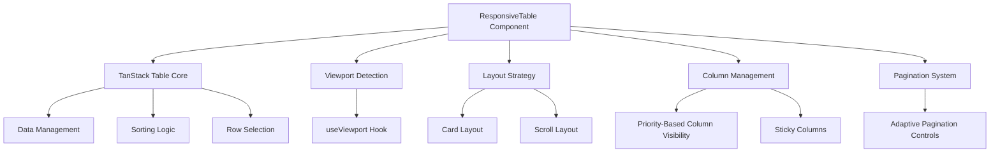
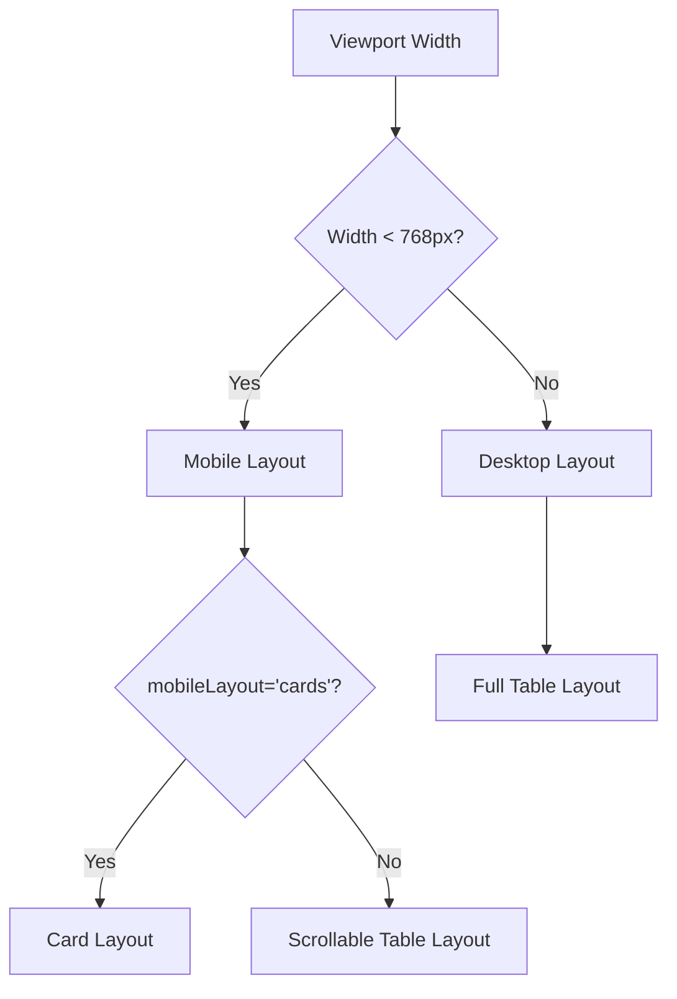
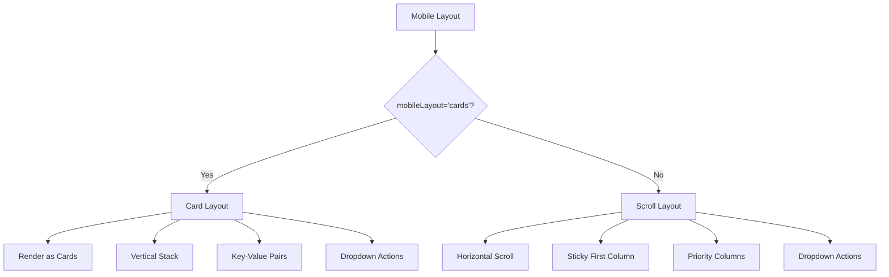
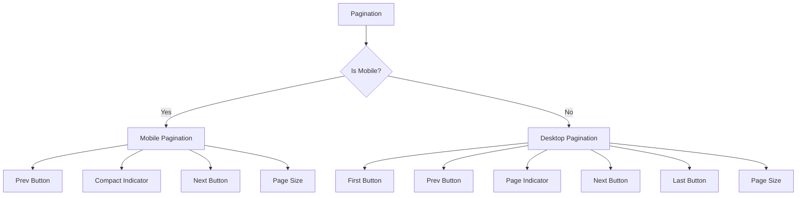
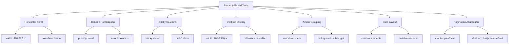

# Responsive Table Implementation

<cite>
**Referenced Files in This Document**   
- [responsive-table.tsx](file://components/ui/responsive-table.tsx)
- [use-viewport.ts](file://hooks/use-viewport.ts)
- [responsive-table.test.tsx](file://tests/responsive/responsive-table.test.tsx)
- [responsive.ts](file://types/responsive.ts)
- [responsive-test-helpers.tsx](file://tests/helpers/responsive-test-helpers.tsx)
</cite>

## Table of Contents
1. [Introduction](#introduction)
2. [Core Architecture](#core-architecture)
3. [Responsive Layout System](#responsive-layout-system)
4. [Column Management](#column-management)
5. [Mobile Layout Strategies](#mobile-layout-strategies)
6. [Pagination System](#pagination-system)
7. [Testing and Validation](#testing-and-validation)
8. [Implementation Guidelines](#implementation-guidelines)

## Introduction

The ResponsiveTable component is a sophisticated table implementation designed to provide optimal user experience across different device sizes and screen resolutions. Built on top of TanStack Table, it offers two distinct mobile layouts (cards and scrollable table) while maintaining a traditional table view on desktop devices. The component intelligently adapts its presentation based on viewport size, ensuring content remains accessible and usable on all devices.

The implementation follows a mobile-first approach, with responsive behavior driven by the useViewport hook that monitors screen dimensions and device characteristics. This allows the table to automatically switch between layouts and adjust its presentation to accommodate the available screen space.

**Section sources**
- [responsive-table.tsx](file://components/ui/responsive-table.tsx)
- [use-viewport.ts](file://hooks/use-viewport.ts)

## Core Architecture

The ResponsiveTable component is built as a wrapper around TanStack Table, extending its functionality with responsive features. It maintains the core table functionality while adding responsive capabilities through conditional rendering and adaptive layout strategies.

The component accepts data and column definitions as props, then uses TanStack Table's useReactTable hook to manage table state, including sorting, pagination, and row selection. The responsive behavior is implemented by monitoring the viewport state and adjusting the rendering strategy accordingly.



**Diagram sources **
- [responsive-table.tsx](file://components/ui/responsive-table.tsx)
- [use-viewport.ts](file://hooks/use-viewport.ts)

**Section sources**
- [responsive-table.tsx](file://components/ui/responsive-table.tsx)
- [use-viewport.ts](file://hooks/use-viewport.ts)

## Responsive Layout System

The responsive layout system is powered by the useViewport hook, which provides real-time information about the current viewport dimensions, breakpoint, and device characteristics. The system uses Tailwind CSS breakpoints (xs: 0, sm: 640, md: 768, lg: 1024, xl: 1280, 2xl: 1536) to determine the appropriate layout strategy.

The component automatically switches between desktop and mobile layouts based on the isMobile property from the viewport state, which is true when the width is less than 768px (md breakpoint). This threshold ensures that tablets in portrait mode receive the mobile experience, while providing the full desktop experience on larger screens.



**Diagram sources **
- [responsive-table.tsx](file://components/ui/responsive-table.tsx)
- [use-viewport.ts](file://hooks/use-viewport.ts)

**Section sources**
- [responsive-table.tsx](file://components/ui/responsive-table.tsx)
- [use-viewport.ts](file://hooks/use-viewport.ts)

## Column Management

The ResponsiveTable component implements a sophisticated column management system that prioritizes content based on importance and screen real estate. The system uses several mechanisms to ensure optimal column visibility across different device sizes.

### Column Prioritization

Columns can be assigned a priority value (1 = highest priority), which determines their visibility on mobile devices. When the mobileVisibleColumns prop is not specified, the component automatically selects the three highest-priority columns for display in scroll layout.

```typescript
// Column interface extension
export interface ResponsiveTableColumn<TData> extends ColumnDef<TData> {
    /**
     * Priority of the column (1 = most important)
     * Lower priority columns are hidden first on mobile
     */
    priority?: number;
    
    /**
     * Whether the column should be sticky during horizontal scroll
     */
    sticky?: boolean;
    
    /**
     * Custom rendering for card mode (mobile)
     */
    cardRender?: (row: TData) => React.ReactNode;
    
    /**
     * Label to display in card mode
     */
    cardLabel?: string;
}
```

### Sticky Columns

The component supports sticky first column functionality, which keeps the first column fixed during horizontal scrolling. This is particularly useful for identifier columns that provide context for the data in other columns.

```mermaid
classDiagram
class ResponsiveTableColumn {
+priority? : number
+sticky? : boolean
+cardRender? : (row : TData) => React.ReactNode
+cardLabel? : string
}
class ResponsiveTableProps {
+mobileLayout? : 'cards' | 'scroll'
+stickyFirstColumn? : boolean
+mobileVisibleColumns? : string[]
+rowActions? : { label : string; onClick : (row : TData) => void; icon? : React.ReactNode }[]
}
ResponsiveTableProps --> ResponsiveTableColumn : contains
```

**Diagram sources **
- [responsive-table.tsx](file://components/ui/responsive-table.tsx)

**Section sources**
- [responsive-table.tsx](file://components/ui/responsive-table.tsx)

## Mobile Layout Strategies

The ResponsiveTable component offers two distinct mobile layout strategies to accommodate different data presentation needs and user preferences.

### Card Layout

The card layout transforms each table row into a card component, making it easier to read and interact with on small screens. This layout is activated when mobileLayout is set to 'cards'.

Key features of the card layout:
- Each row is rendered as a Card component
- The first column serves as the card title
- Remaining columns are displayed as key-value pairs
- Actions are grouped in a dropdown menu
- Cards are vertically stacked for easy scrolling

### Scroll Layout

The scroll layout maintains the traditional table structure but enables horizontal scrolling to access all columns. This layout is activated when mobileLayout is set to 'scroll' (default).

Key features of the scroll layout:
- Horizontal scrolling with custom scrollbar styling
- Sticky first column option to keep identifiers visible
- Column prioritization to show most important data first
- Vertical striping for improved row readability
- Action buttons in a dropdown menu for each row



**Diagram sources **
- [responsive-table.tsx](file://components/ui/responsive-table.tsx)

**Section sources**
- [responsive-table.tsx](file://components/ui/responsive-table.tsx)

## Pagination System

The pagination system in ResponsiveTable is designed to be adaptive, changing its presentation based on the viewport size. The component supports server-side pagination through callback functions that notify the parent component of page changes.

### Desktop Pagination

On desktop devices, the pagination controls include:
- First page button
- Previous page button
- Page indicator (e.g., "Page 1 of 5")
- Next page button
- Last page button
- Page size selector (10, 20, 30, 50, 100)

### Mobile Pagination

On mobile devices, the pagination controls are simplified to conserve screen space:
- Previous page button
- Compact page indicator (e.g., "1/5")
- Next page button
- Page size selector

The adaptive pagination ensures that users can navigate through data efficiently regardless of device size, while maintaining a clean and uncluttered interface.



**Diagram sources **
- [responsive-table.tsx](file://components/ui/responsive-table.tsx)

**Section sources**
- [responsive-table.tsx](file://components/ui/responsive-table.tsx)

## Testing and Validation

The ResponsiveTable component is thoroughly tested using property-based testing with fast-check, ensuring reliable behavior across various viewport sizes and data configurations.

### Property-Based Testing

The test suite validates several key properties:

**Table Horizontal Scroll on Mobile**
- For any table displayed on viewport width < 768px
- Horizontal scroll must be enabled
- Verified by checking for overflow-x-auto class

**Table Column Prioritization**
- On mobile with many columns
- Essential columns must be prioritized
- Verified by checking column visibility based on priority

**Sticky First Column**
- When stickyFirstColumn is true
- First column remains fixed during horizontal scroll
- Verified by checking for sticky and left-0 classes

**Full Display on Desktop**
- On viewport width ≥768px with sufficient space
- All columns must be visible without horizontal scroll
- Verified by checking all columns are present

**Mobile Table Actions Grouped**
- On mobile devices
- Actions must be grouped in dropdown menu or action sheet
- Verified by checking for action buttons with proper touch targets



**Diagram sources **
- [responsive-table.test.tsx](file://tests/responsive/responsive-table.test.tsx)

**Section sources**
- [responsive-table.test.tsx](file://tests/responsive/responsive-table.test.tsx)

## Implementation Guidelines

### Basic Usage

```typescript
import { ResponsiveTable, ResponsiveTableColumn } from '@/components/ui/responsive-table';

const columns: ResponsiveTableColumn<YourDataType>[] = [
  {
    id: 'id',
    accessorKey: 'id',
    header: 'ID',
    priority: 1,
    sticky: true,
    cardLabel: 'ID',
  },
  {
    id: 'name',
    accessorKey: 'name',
    header: 'Name',
    priority: 2,
    cardLabel: 'Name',
  },
  // ... more columns
];

<ResponsiveTable
  data={yourData}
  columns={columns}
  mobileLayout="cards" // or "scroll"
  stickyFirstColumn={true}
/>
```

### Server-Side Integration

For server-side pagination and sorting:

```typescript
<ResponsiveTable
  data={data}
  columns={columns}
  pagination={{
    pageIndex: currentPage,
    pageSize: currentPageSize,
    total: totalItems,
    totalPages: totalPages,
    onPageChange: handlePageChange,
    onPageSizeChange: handlePageSizeChange,
  }}
  sorting={{
    columnId: sortColumn,
    direction: sortDirection,
    onSortingChange: handleSortingChange,
  }}
/>
```

### Row Actions

Add row-level actions that appear in a dropdown menu on mobile:

```typescript
<ResponsiveTable
  data={data}
  columns={columns}
  rowActions={[
    {
      label: 'Edit',
      onClick: handleEdit,
      icon: <EditIcon />,
    },
    {
      label: 'Delete',
      onClick: handleDelete,
      icon: <DeleteIcon />,
    },
  ]}
/>
```

### Custom Card Rendering

For more control over mobile card appearance:

```typescript
{
  id: 'status',
  accessorKey: 'status',
  header: 'Status',
  priority: 3,
  cardLabel: 'Status',
  cardRender: (row) => (
    <Badge variant={row.status === 'active' ? 'success' : 'warning'}>
      {row.status}
    </Badge>
  ),
}
```

**Section sources**
- [responsive-table.tsx](file://components/ui/responsive-table.tsx)
- [responsive-table.test.tsx](file://tests/responsive/responsive-table.test.tsx)