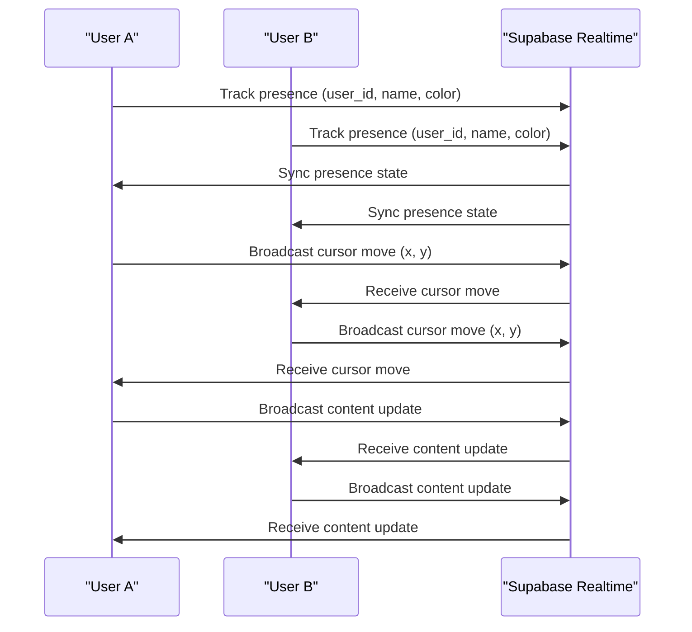
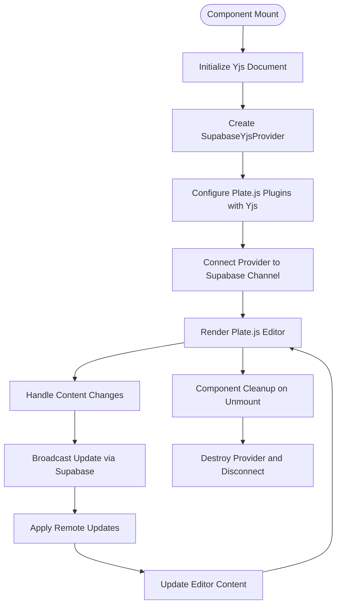
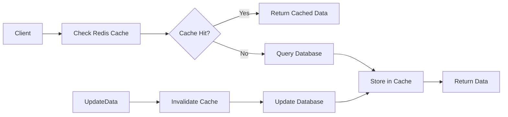

# State Management

<cite>
**Referenced Files in This Document**   
- [use-debounce.ts](file://app/_lib/hooks/use-debounce.ts)
- [formulario-store.ts](file://app/_lib/stores/assinatura-digital/formulario-store.ts)
- [supabase-provider.ts](file://lib/yjs/supabase-provider.ts)
- [use-yjs-collaboration.ts](file://hooks/use-yjs-collaboration.ts)
- [collaborative-plate-editor.tsx](file://components/plate/collaborative-plate-editor.tsx)
- [use-realtime-collaboration.ts](file://hooks/use-realtime-collaboration.ts)
- [use-realtime-cursors.ts](file://hooks/use-realtime-cursors.ts)
- [use-realtime-chat.tsx](file://hooks/use-realtime-chat.tsx)
- [supabase-yjs-provider.ts](file://lib/yjs/supabase-yjs-provider.ts)
- [form.tsx](file://components/ui/form.tsx)
- [dynamic-form-renderer.tsx](file://components/assinatura-digital/form/dynamic-form-renderer.tsx)
- [FormSchemaBuilder.tsx](file://components/assinatura-digital/schema-builder/FormSchemaBuilder.tsx)
- [cache-utils.ts](file://backend/utils/redis/cache-utils.ts)
- [README.md](file://README.md)
- [client.ts](file://lib/client.ts)
</cite>

## Table of Contents
1. [Introduction](#introduction)
2. [React Hooks for State Management](#react-hooks-for-state-management)
3. [Zustand State Management](#zustand-state-management)
4. [Real-Time Collaboration System](#real-time-collaboration-system)
5. [Yjs and WebRTC Implementation](#yjs-and-webrtc-implementation)
6. [Collaborative Plate Editor](#collaborative-plate-editor)
7. [State Persistence and Caching](#state-persistence-and-caching)
8. [Data Synchronization](#data-synchronization)
9. [Performance Considerations](#performance-considerations)
10. [Error Handling and Debugging](#error-handling-and-debugging)

## Introduction
The Sinesys application implements a comprehensive state management system that combines React hooks, Zustand for global state, and Yjs for real-time collaborative editing. The system is designed to handle complex state management requirements across various features including document editing, form handling, and chat functionality. This documentation provides a detailed overview of the state management architecture, focusing on the integration of React Server Components with client components, the implementation of real-time collaboration using Yjs and WebRTC, and the strategies for state persistence and data synchronization.

## React Hooks for State Management
Sinesys utilizes a variety of custom React hooks for managing state across the application. These hooks provide reusable logic for common state management patterns, including data fetching, form handling, and real-time collaboration.

The `useDebounce` hook implements debouncing functionality to delay state updates, which is particularly useful for search inputs and other user interactions that trigger expensive operations. This hook uses `useState` and `useEffect` to manage the debounced value, ensuring that state updates are only applied after a specified delay period.

For form handling, Sinesys leverages `react-hook-form` through the `form.tsx` component, which provides a comprehensive set of components and utilities for building accessible and validated forms. The form system uses the `Controller` component to integrate with various input types, ensuring proper handling of validation, error states, and accessibility attributes.

**Section sources**
- [use-debounce.ts](file://app/_lib/hooks/use-debounce.ts)
- [form.tsx](file://components/ui/form.tsx)

## Zustand State Management
The application uses Zustand as its primary state management library for global state that needs to be shared across multiple components. Zustand provides a lightweight and efficient solution for managing complex state without the overhead of more traditional state management libraries.

The `formulario-store.ts` file implements a Zustand store for managing the state of multi-step forms in the digital signature system. This store maintains various pieces of state including form context, user data, step configurations, and loading states. The store is designed with a comprehensive set of actions that allow components to update specific parts of the state in a controlled manner.

Key features of the Zustand implementation include:
- Centralized management of form state across multiple steps
- Support for template caching to avoid redundant API calls
- Comprehensive reset functionality to clear state when needed
- Type-safe state management with TypeScript interfaces

The store is created using the `create` function from Zustand, which returns a hook that can be used to access and update the state. This approach provides a clean and intuitive API for components to interact with the global state.

```mermaid
classDiagram
class FormularioStore {
+segmentoId : number | null
+formularioId : number | null
+templateIds : string[] | null
+templateIdSelecionado : string | null
+sessaoId : string | null
+formSchema : DynamicFormSchema | null
+formularioNome : string | null
+segmentoNome : string | null
+formularioFlowConfig : FormularioFlowConfig | null
+cachedTemplates : Map<string, Template>
+etapaAtual : number
+dadosCPF : DadosCPF | null
+dadosPessoais : DadosPessoaisStore | null
+dadosAcao : DadosAcaoStore | null
+dadosVisualizacaoPdf : VisualizacaoPdfData | null
+dadosVisualizacaoMarkdown : VisualizacaoMarkdownData | null
+dadosAssinatura : DadosAssinaturaStore | null
+pdfsGerados : PdfGerado[] | null
+fotoBase64 : string | null
+assinaturaBase64 : string | null
+latitude : number | null
+longitude : number | null
+geolocationAccuracy : number | null
+geolocationTimestamp : string | null
+stepConfigs : StepConfig[] | null
+pdfUrlFinal : string | null
+isLoading : boolean
+isSubmitting : boolean
+setContexto(segmentoId : number, formularioId : number)
+hydrateContext(ctx : { segmentoId : number; formularioId : number; templateIds? : string[]; formularioNome? : string; segmentoNome? : string; formSchema? : DynamicFormSchema; flowConfig? : FormularioFlowConfig })
+setTemplateIds(templateIds : string[])
+setTemplateIdSelecionado(templateId : string)
+setSessaoId(sessaoId : string)
+setFormSchema(schema : DynamicFormSchema | null)
+setFormularioFlowConfig(config : FormularioFlowConfig | null)
+getCachedTemplate(templateId : string)
+setCachedTemplate(templateId : string, template : Template)
+clearTemplateCache()
+setEtapaAtual(etapa : number)
+setDadosCPF(dados : DadosCPF)
+setDadosPessoais(dados : DadosPessoaisStore)
+setDadosAcao(dados : DadosAcaoStore)
+setDadosVisualizacaoPdf(dados : VisualizacaoPdfData | null)
+setDadosVisualizacaoMarkdown(dados : VisualizacaoMarkdownData | null)
+setDadosAssinatura(dados : DadosAssinaturaStore)
+setPdfsGerados(pdfs : PdfGerado[])
+setFotoBase64(foto : string)
+setAssinaturaBase64(assinatura : string)
+setGeolocation(latitude : number, longitude : number, accuracy : number, timestamp : string)
+clearGeolocation()
+setStepConfigs(configs : StepConfig[])
+getStepByIndex(index : number)
+getTotalSteps()
+getCurrentStepConfig()
+setPdfUrlFinal(url : string | null)
+setLoading(loading : boolean)
+setSubmitting(submitting : boolean)
+resetFormulario()
+resetAll()
+proximaEtapa()
+etapaAnterior()
}
```

**Diagram sources **
- [formulario-store.ts](file://app/_lib/stores/assinatura-digital/formulario-store.ts)

**Section sources**
- [formulario-store.ts](file://app/_lib/stores/assinatura-digital/formulario-store.ts)

## Real-Time Collaboration System
Sinesys implements a sophisticated real-time collaboration system that enables multiple users to work on documents and chat simultaneously. The system is built on Supabase Realtime, which provides the underlying infrastructure for real-time communication.

The `use-realtime-collaboration.ts` hook manages presence tracking and content synchronization for collaborative editing. It uses Supabase channels to broadcast content updates and track user presence. The hook maintains a list of collaborators with their current cursor positions and selection states, allowing for real-time cursor tracking and awareness of other users' activities.

For chat functionality, the `use-realtime-chat.tsx` hook implements a real-time chat system with typing indicators and message broadcasting. The hook manages the message history, handles sending and receiving messages, and provides typing indicators to show when other users are composing messages.

The `use-realtime-cursors.ts` hook implements real-time cursor tracking across multiple users. It uses throttling to optimize performance by limiting the frequency of cursor position updates. The hook broadcasts cursor movements to other users in the same room and renders remote cursors on the screen.



**Diagram sources **
- [use-realtime-collaboration.ts](file://hooks/use-realtime-collaboration.ts)
- [use-realtime-cursors.ts](file://hooks/use-realtime-cursors.ts)
- [use-realtime-chat.tsx](file://hooks/use-realtime-chat.tsx)

**Section sources**
- [use-realtime-collaboration.ts](file://hooks/use-realtime-collaboration.ts)
- [use-realtime-cursors.ts](file://hooks/use-realtime-cursors.ts)
- [use-realtime-chat.tsx](file://hooks/use-realtime-chat.tsx)

## Yjs and WebRTC Implementation
The real-time collaboration system in Sinesys is built on Yjs, a CRDT (Conflict-Free Replicated Data Type) library that enables seamless synchronization of document state across multiple clients. Yjs is integrated with Supabase Realtime to provide the transport layer for document updates.

The `supabase-provider.ts` file implements a custom provider for Yjs that uses Supabase Realtime as the transport mechanism. This provider handles the bidirectional synchronization of document updates between clients, ensuring that all users see a consistent view of the document regardless of network conditions or edit conflicts.

The `supabase-yjs-provider.ts` file extends this functionality by implementing the `UnifiedProvider` interface expected by Plate.js, allowing for seamless integration with the rich text editor. This provider manages the connection to the Supabase channel, handles document updates, and synchronizes awareness information such as user cursors and selection states.

The `use-yjs-collaboration.ts` hook provides a high-level interface for integrating Yjs collaboration into components. It handles the initialization of the Yjs document, connection to the Supabase provider, and management of synchronization states. The hook returns a set of values including the Yjs document, provider instance, and connection status, which can be used to build collaborative editing interfaces.

```mermaid
classDiagram
class SupabaseYjsProvider {
+type : string
+document : Y.Doc
+awareness : Awareness
+isConnected : boolean
+isSynced : boolean
+connect()
+disconnect()
+destroy()
+handleLocalUpdate(update : Uint8Array, origin : unknown)
+handleRemoteUpdate(payload : { update : number[]; timestamp : number })
+requestSync()
+sendFullState()
+handleSyncResponse(payload : { state : number[]; timestamp : number })
+handleAwarenessUpdate()
+handleRemoteAwareness(payload : { states : [number, unknown][]; timestamp : number })
}
class SupabaseProvider {
+supabase : SupabaseClient
+channelName : string
+channel : RealtimeChannel | null
+_synced : boolean
+_connected : boolean
+onConnect? : () => void
+onDisconnect? : () => void
+onSyncError? : (error : Error) => void
+connect()
+disconnect()
+setupDocListener()
+handleRemoteUpdate(payload : { update : Uint8Array; origin : unknown })
+sendFullState()
+requestSync()
+broadcastUpdate(update : Uint8Array)
}
SupabaseYjsProvider --> SupabaseProvider : "extends"
```

**Diagram sources **
- [supabase-provider.ts](file://lib/yjs/supabase-provider.ts)
- [supabase-yjs-provider.ts](file://lib/yjs/supabase-yjs-provider.ts)
- [use-yjs-collaboration.ts](file://hooks/use-yjs-collaboration.ts)

**Section sources**
- [supabase-provider.ts](file://lib/yjs/supabase-provider.ts)
- [supabase-yjs-provider.ts](file://lib/yjs/supabase-yjs-provider.ts)
- [use-yjs-collaboration.ts](file://hooks/use-yjs-collaboration.ts)

## Collaborative Plate Editor
The collaborative document editor in Sinesys is built on Plate.js, a rich text editor framework for React. The editor is enhanced with Yjs integration to provide real-time collaborative editing capabilities.

The `collaborative-plate-editor.tsx` component implements the collaborative editor interface, integrating Plate.js with the Yjs provider. The editor initializes the Yjs document and provider when mounted, and connects to the Supabase Realtime channel to begin synchronization. The component handles the lifecycle of the collaboration session, including cleanup when unmounted.

Key features of the collaborative editor include:
- Real-time synchronization of document content using Yjs CRDT
- Multi-user cursor tracking with color-coded cursors
- Selection state synchronization to show other users' selections
- Connection status indicators to show collaboration state
- Loading states during initialization and synchronization

The editor uses a plugin architecture to extend Plate.js functionality, with the Yjs plugin providing the collaboration features. The component is designed to be reusable across different parts of the application that require collaborative editing.



**Diagram sources **
- [collaborative-plate-editor.tsx](file://components/plate/collaborative-plate-editor.tsx)

**Section sources**
- [collaborative-plate-editor.tsx](file://components/plate/collaborative-plate-editor.tsx)

## State Persistence and Caching
Sinesys implements a comprehensive state persistence and caching strategy to optimize performance and provide offline capabilities. The system uses multiple layers of persistence, including client-side storage and server-side caching with Redis.

For client-side persistence, the application uses IndexedDB through the `y-indexeddb` library to store document state locally. This allows users to continue working on documents even when offline, with changes automatically synchronized when connectivity is restored. The `use-yjs-collaboration.ts` hook manages the IndexedDB persistence layer, creating a `IndexeddbPersistence` instance for each document.

The server-side caching system uses Redis to cache frequently accessed data and reduce database load. The `cache-utils.ts` file implements a caching layer with functions for getting, setting, and invalidating cached data. The system follows the Cache-Aside pattern, where data is first checked in the cache before querying the database.

Key caching strategies include:
- Lazy loading with TTL-based expiration
- Cache invalidation on data updates
- Pattern-based cache clearing for related data
- Monitoring and statistics collection

The caching system is integrated throughout the application, with API routes automatically checking the cache before querying the database. This significantly reduces response times for frequently accessed data.



**Diagram sources **
- [use-yjs-collaboration.ts](file://hooks/use-yjs-collaboration.ts)
- [cache-utils.ts](file://backend/utils/redis/cache-utils.ts)
- [README.md](file://README.md)

**Section sources**
- [use-yjs-collaboration.ts](file://hooks/use-yjs-collaboration.ts)
- [cache-utils.ts](file://backend/utils/redis/cache-utils.ts)
- [README.md](file://README.md)

## Data Synchronization
The data synchronization system in Sinesys ensures that state remains consistent across clients and servers. The system uses a combination of real-time updates, conflict resolution, and reconciliation strategies to maintain data integrity.

For collaborative editing, the Yjs CRDT implementation handles conflict resolution automatically, ensuring that concurrent edits from multiple users are merged correctly without data loss. The CRDT algorithm guarantees convergence, meaning that all clients will eventually reach the same state regardless of the order of operations.

The application implements a reconciliation strategy for handling network interruptions and connectivity issues. When a client reconnects after being offline, it synchronizes its local changes with the server state, resolving any conflicts that may have occurred during the disconnection period.

Data synchronization is also handled at the API level, with endpoints designed to work with the caching layer to ensure consistency. The system uses optimistic updates in the UI, immediately reflecting user actions while asynchronously synchronizing with the server.

**Section sources**
- [supabase-provider.ts](file://lib/yjs/supabase-provider.ts)
- [supabase-yjs-provider.ts](file://lib/yjs/supabase-yjs-provider.ts)
- [use-yjs-collaboration.ts](file://hooks/use-yjs-collaboration.ts)

## Performance Considerations
The state management system in Sinesys is designed with performance as a key consideration. Several strategies are employed to ensure optimal performance, especially for the real-time collaboration features.

For real-time updates, the system uses throttling and debouncing to limit the frequency of network operations. The `use-realtime-cursors.ts` hook, for example, throttles cursor position updates to prevent excessive network traffic. Similarly, content updates are batched and sent efficiently to minimize the number of network requests.

The Yjs implementation is optimized for performance by only sending incremental updates rather than the entire document state. This reduces bandwidth usage and ensures that synchronization remains fast even for large documents.

Client-side performance is optimized through careful state management and component rendering. The use of React.memo and useCallback helps prevent unnecessary re-renders, while the Zustand store is designed to minimize the amount of state that triggers re-renders.

The caching system significantly improves performance by reducing database queries and response times. Frequently accessed data is served from Redis, which provides sub-millisecond response times compared to database queries.

**Section sources**
- [use-realtime-cursors.ts](file://hooks/use-realtime-cursors.ts)
- [supabase-provider.ts](file://lib/yjs/supabase-provider.ts)
- [cache-utils.ts](file://backend/utils/redis/cache-utils.ts)

## Error Handling and Debugging
The state management system includes comprehensive error handling and debugging capabilities to ensure reliability and ease of maintenance.

For real-time collaboration, the system includes error callbacks that can be used to handle synchronization errors. The `use-yjs-collaboration.ts` hook provides an `onError` callback that is invoked when synchronization errors occur, allowing components to display appropriate error messages to users.

The application uses structured logging to track state changes and synchronization events. This makes it easier to debug issues related to state management and collaboration. The logs include timestamps, user identifiers, and operation details to provide context for troubleshooting.

For debugging collaborative editing issues, the system provides connection status indicators that show whether a user is connected to the collaboration session and whether their changes are synchronized. This helps users understand the state of their collaboration session and identify connectivity issues.

The Zustand store includes comprehensive error handling for form operations, with validation errors and submission errors handled appropriately. The store's actions are designed to be atomic and predictable, making it easier to trace state changes and identify issues.

**Section sources**
- [use-yjs-collaboration.ts](file://hooks/use-yjs-collaboration.ts)
- [use-realtime-collaboration.ts](file://hooks/use-realtime-collaboration.ts)
- [formulario-store.ts](file://app/_lib/stores/assinatura-digital/formulario-store.ts)