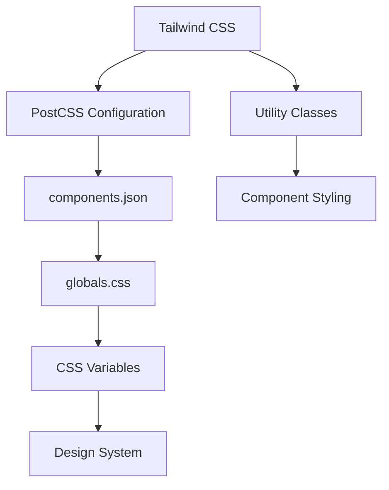
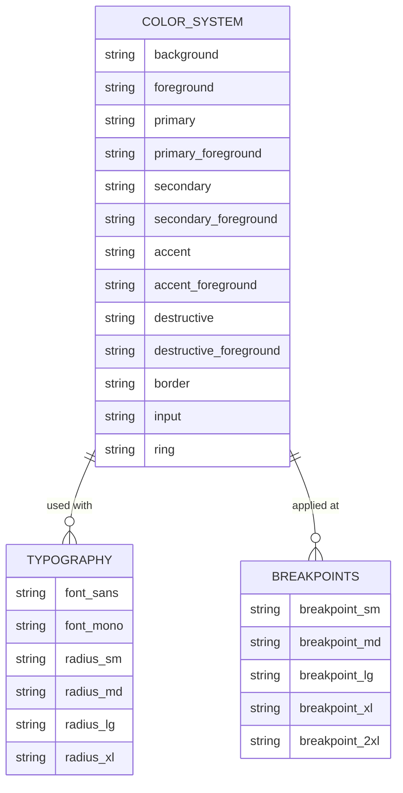
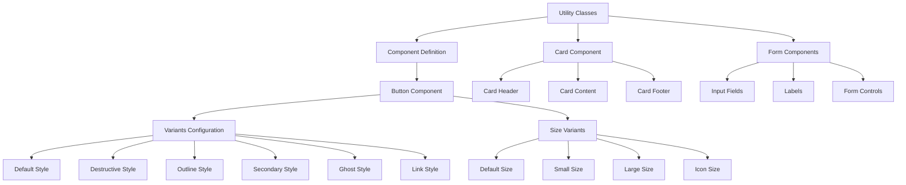
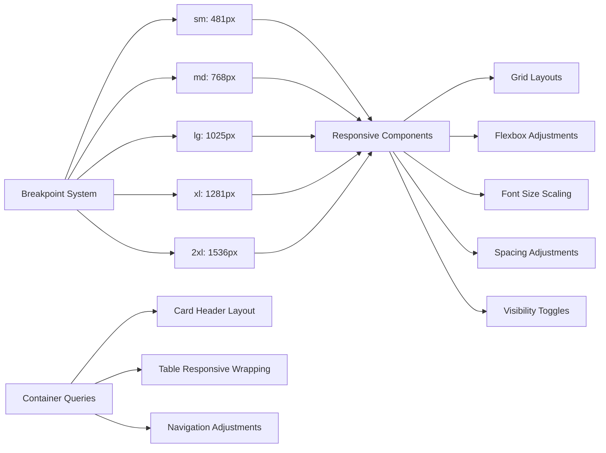
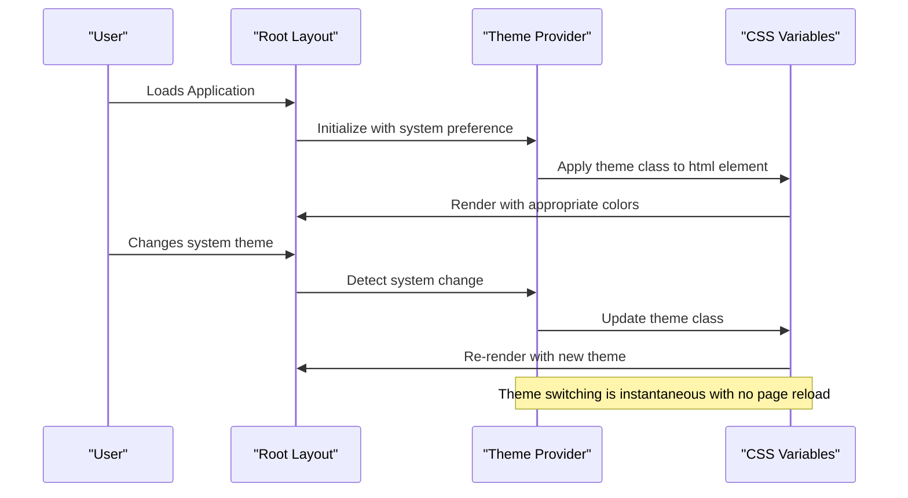
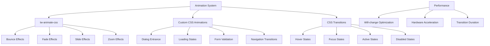
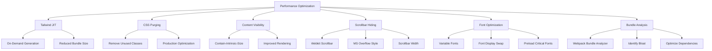

# Styling System

<cite>
**Referenced Files in This Document**   
- [globals.css](file://app/globals.css)
- [tailwind.config.js](file://tailwind.config.js)
- [components.json](file://components.json)
- [theme-provider.tsx](file://components/ui/theme-provider.tsx)
- [layout.tsx](file://app/layout.tsx)
- [button.tsx](file://components/ui/button.tsx)
- [card.tsx](file://components/ui/card.tsx)
- [input.tsx](file://components/ui/input.tsx)
- [dialog.tsx](file://components/ui/dialog.tsx)
- [form.tsx](file://components/ui/form.tsx)
</cite>

## Table of Contents
1. [Introduction](#introduction)
2. [Tailwind CSS Implementation](#tailwind-css-implementation)
3. [Design System and CSS Variables](#design-system-and-css-variables)
4. [Utility-First Approach](#utility-first-approach)
5. [Responsive Design Implementation](#responsive-design-implementation)
6. [Dark Mode and Theme Switching](#dark-mode-and-theme-switching)
7. [Custom Animations and Transitions](#custom-animations-and-transitions)
8. [shadcn/ui Component Integration](#shadcnui-component-integration)
9. [Component Styling Guidelines](#component-styling-guidelines)
10. [Performance Optimization](#performance-optimization)

## Introduction
The Sinesys application implements a comprehensive styling system centered around Tailwind CSS as the primary styling solution. The system combines utility-first CSS principles with a well-defined design system that ensures consistency across the application. The styling architecture leverages CSS variables for theming, implements a robust dark mode system, and integrates seamlessly with the shadcn/ui component library. This documentation provides a detailed overview of the styling system's implementation, covering configuration, theming, responsive design, and developer guidelines for maintaining consistency.

**Section sources**
- [globals.css](file://app/globals.css)
- [components.json](file://components.json)

## Tailwind CSS Implementation
The styling system in Sinesys is built on Tailwind CSS, configured through the project's PostCSS setup. The configuration is managed via the `components.json` file, which specifies the Tailwind configuration path, CSS file location, and other styling parameters. The system uses CSS variables extensively, with the `cssVariables` option enabled in the configuration, allowing for dynamic theme customization.

The Tailwind configuration imports the core framework and additional utilities like `tw-animate-css` for enhanced animations. The `@theme inline` directive in the CSS file establishes a comprehensive set of CSS variables that define the application's visual design, including colors, fonts, radii, and breakpoints. This approach enables consistent styling across components while maintaining the flexibility of the utility-first methodology.



**Diagram sources**
- [postcss.config.mjs](file://postcss.config.mjs)
- [components.json](file://components.json)
- [globals.css](file://app/globals.css)

**Section sources**
- [postcss.config.mjs](file://postcss.config.mjs)
- [components.json](file://components.json)
- [globals.css](file://app/globals.css)

## Design System and CSS Variables
The Sinesys styling system implements a comprehensive design system through CSS variables defined in the `globals.css` file. These variables establish a consistent visual language across the application, covering colors, typography, spacing, and other design tokens. The system uses the OKLCH color format, which provides perceptually uniform color representation, ensuring consistent visual appearance across different devices and viewing conditions.

The design system defines a complete palette of semantic colors including primary, secondary, accent, destructive, and various utility colors. These are mapped to specific CSS variables such as `--primary`, `--secondary`, `--destructive`, and their corresponding foreground colors. The system also defines typographic variables for font families, with `--font-geist-sans` and `--font-geist-mono` establishing the application's typography.



**Diagram sources**
- [globals.css](file://app/globals.css)

**Section sources**
- [globals.css](file://app/globals.css)

## Utility-First Approach
Sinesys implements a utility-first approach to styling, leveraging Tailwind CSS's atomic classes to build components directly in the markup. This approach is evident in the component library, where UI elements are constructed using combinations of utility classes rather than custom CSS. The system uses `class-variance-authority` (CVA) to create reusable component variants, allowing for consistent styling patterns across the application.

The utility-first methodology is applied consistently across all components, with base styles defined using Tailwind classes and variants managed through CVA configurations. For example, the Button component uses a combination of utility classes for layout, typography, and states, with variants defined for different visual styles (default, destructive, outline, secondary, ghost, link) and sizes (default, sm, lg, icon).



**Diagram sources**
- [button.tsx](file://components/ui/button.tsx)
- [card.tsx](file://components/ui/card.tsx)
- [form.tsx](file://components/ui/form.tsx)

**Section sources**
- [button.tsx](file://components/ui/button.tsx)
- [card.tsx](file://components/ui/card.tsx)
- [input.tsx](file://components/ui/input.tsx)
- [form.tsx](file://components/ui/form.tsx)

## Responsive Design Implementation
The responsive design system in Sinesys is implemented through a combination of Tailwind CSS's responsive utilities and custom breakpoints defined in the CSS variables. The system defines five breakpoint tiers: sm (481px), md (768px), lg (1025px), xl (1281px), and 2xl (1536px), which are used consistently across the application to create responsive layouts.

The responsive design approach leverages Tailwind's mobile-first breakpoint prefixes (sm:, md:, lg:, xl:, 2xl:) to apply different styles at various screen sizes. Components are designed to be responsive by default, with layout adjustments, font sizes, spacing, and other properties adapting to the viewport size. The system also uses container queries (indicated by `@container` in the CSS) to enable components to respond to their parent container's size rather than just the viewport.



**Diagram sources**
- [globals.css](file://app/globals.css)
- [card.tsx](file://components/ui/card.tsx)

**Section sources**
- [globals.css](file://app/globals.css)
- [card.tsx](file://components/ui/card.tsx)

## Dark Mode and Theme Switching
Sinesys implements a comprehensive dark mode system using the `next-themes` library and CSS variables. The theme switching functionality is provided by the `ThemeProvider` component, which wraps the application and manages the theme state. The system supports three theme modes: light, dark, and system (which follows the user's operating system preference).

The dark mode implementation uses a `.dark` CSS class applied to the root element, with corresponding CSS variable values defined in the stylesheet. When the dark theme is active, the application switches to a dark color palette with appropriate contrast ratios for readability. The theme provider is configured in the root layout with `attribute="class"`, `defaultTheme="system"`, and `enableSystem` options, allowing for seamless theme switching.



**Diagram sources**
- [theme-provider.tsx](file://components/ui/theme-provider.tsx)
- [layout.tsx](file://app/layout.tsx)
- [globals.css](file://app/globals.css)

**Section sources**
- [theme-provider.tsx](file://components/ui/theme-provider.tsx)
- [layout.tsx](file://app/layout.tsx)
- [globals.css](file://app/globals.css)

## Custom Animations and Transitions
The Sinesys styling system includes custom animations and transitions beyond the standard Tailwind CSS utilities. The application imports `tw-animate-css` to extend the available animation options, providing a wider range of motion effects for UI elements. The system also defines custom CSS animations and transitions for specific interactions and states.

Transitions are applied consistently across interactive elements, with a focus on providing visual feedback for user actions. Components like buttons, inputs, and dialogs use transition effects for hover, focus, and state changes. The system employs a combination of CSS transitions and animations to create a polished user experience, with attention to duration, easing, and timing functions to ensure smooth interactions.



**Diagram sources**
- [globals.css](file://app/globals.css)
- [package.json](file://package.json)

**Section sources**
- [globals.css](file://app/globals.css)
- [package.json](file://package.json)

## shadcn/ui Component Integration
Sinesys integrates the shadcn/ui component library, which provides a collection of accessible, customizable UI components built with Radix UI and Tailwind CSS. The integration is configured in the `components.json` file, which specifies the component aliases and styling preferences. The system uses the "new-york" style for the component library, ensuring a consistent visual language across all UI elements.

The component integration follows a compositional approach, where base components are extended and customized through props and variants rather than creating entirely new components. This approach maintains consistency while allowing for necessary customization. The system leverages the component library's support for React Server Components (RSC) and TypeScript, ensuring type safety and optimal performance.

```mermaid
graph TD
A[shadcn/ui Integration] --> B[components.json]
B --> C[Component Aliases]
C --> D[@/components]
C --> E[@/lib/utils]
C --> F[@/components/ui]
C --> G[@/lib]
C --> H[@/hooks]
A --> I[Component Library]
I --> J[Radix UI Primitives]
I --> K[Tailwind CSS]
I --> L[Class Variance Authority]
I --> M[clsx Utility]
I --> N[UI Components]
N --> O[Button]
N --> P[Card]
N --> Q[Dialog]
N --> R[Form]
N --> S[Input]
N --> T[Select]
N --> U[Table]
N --> V[Tooltip]
```

**Diagram sources**
- [components.json](file://components.json)
- [button.tsx](file://components/ui/button.tsx)
- [card.tsx](file://components/ui/card.tsx)
- [dialog.tsx](file://components/ui/dialog.tsx)

**Section sources**
- [components.json](file://components.json)
- [button.tsx](file://components/ui/button.tsx)
- [card.tsx](file://components/ui/card.tsx)
- [dialog.tsx](file://components/ui/dialog.tsx)

## Component Styling Guidelines
Developers creating new components in Sinesys should follow established styling conventions to maintain consistency across the application. Components should be built using the utility-first approach with Tailwind CSS classes, leveraging the design system's CSS variables for colors, spacing, and typography. When creating new components, developers should use the existing component library as a reference for styling patterns and interactions.

For interactive elements, components should implement appropriate hover, focus, and active states using Tailwind's state variants. Form components should follow the established pattern of using `FormItem`, `FormLabel`, `FormControl`, and `FormDescription` to ensure consistent layout and accessibility. Components should be responsive by default, adapting to different screen sizes using Tailwind's responsive prefixes.

```mermaid
flowchart TD
A[New Component Guidelines] --> B[Use Utility Classes]
A --> C[Leverage CSS Variables]
A --> D[Follow Design System]
A --> E[Implement States]
A --> F[Ensure Responsiveness]
A --> G[Maintain Accessibility]
B --> H[Combine Tailwind Classes]
B --> I[Avoid Custom CSS]
C --> J[Color Variables]
C --> K[Spacing Variables]
C --> L[Typography Variables]
D --> M[Consistent Spacing]
D --> N[Typography Hierarchy]
D --> O[Border Radius]
E --> P[Hover States]
E --> Q[Focus States]
E --> R[Active States]
E --> S[Disabled States]
F --> T[Mobile-First Design]
F --> U[Breakpoint Adjustments]
F --> V[Container Queries]
G --> W[ARIA Attributes]
G --> X[Keyboard Navigation]
G --> Y[Screen Reader Support]
```



**Diagram sources**
- [button.tsx](file://components/ui/button.tsx)
- [card.tsx](file://components/ui/card.tsx)
- [form.tsx](file://components/ui/form.tsx)

**Section sources**
- [button.tsx](file://components/ui/button.tsx)
- [card.tsx](file://components/ui/card.tsx)
- [input.tsx](file://components/ui/input.tsx)
- [form.tsx](file://components/ui/form.tsx)

## Performance Optimization
The Sinesys styling system incorporates several performance optimization techniques to ensure efficient CSS delivery and rendering. The system uses Tailwind CSS's JIT (Just-In-Time) compiler, which generates styles on-demand, significantly reducing the final CSS bundle size. The configuration is optimized to purge unused styles in production, ensuring only the necessary CSS is delivered to the client.

The application implements CSS containment with the `content-visibility: auto` property on appropriate elements, improving rendering performance for long pages. The system also uses the `scrollbar-hide` utility class to hide scrollbars consistently across browsers while maintaining scroll functionality. Font loading is optimized through the use of variable fonts (Geist) with appropriate `font-display` settings to minimize layout shifts.



**Diagram sources**
- [tailwind.config.js](file://tailwind.config.js)
- [globals.css](file://app/globals.css)
- [layout.tsx](file://app/layout.tsx)
- [package.json](file://package.json)

**Section sources**
- [tailwind.config.js](file://tailwind.config.js)
- [globals.css](file://app/globals.css)
- [layout.tsx](file://app/layout.tsx)
- [package.json](file://package.json)