# Data Display Components

<cite>
**Referenced Files in This Document**   
- [data-table.tsx](file://components/ui/data-table.tsx)
- [table.tsx](file://components/ui/table.tsx)
- [chart.tsx](file://components/ui/chart.tsx)
- [badge.tsx](file://components/ui/badge.tsx)
- [progress.tsx](file://components/ui/progress.tsx)
- [typography.tsx](file://components/ui/typography.tsx)
- [empty.tsx](file://components/ui/empty.tsx)
- [skeleton.tsx](file://components/ui/skeleton.tsx)
- [data-table-column-header.tsx](file://components/ui/data-table-column-header.tsx)
- [data-table-column-header-with-filter.tsx](file://components/ui/data-table-column-header-with-filter.tsx)
- [mini-chart.tsx](file://components/ui/charts/mini-chart.tsx)
- [responsive-table.tsx](file://components/ui/responsive-table.tsx)
</cite>

## Table of Contents
1. [Introduction](#introduction)
2. [Core Data Display Components](#core-data-display-components)
3. [Table and Data Table Components](#table-and-data-table-components)
4. [Chart Components](#chart-components)
5. [Status and Indicator Components](#status-and-indicator-components)
6. [Typography System](#typography-system)
7. [Empty States and Skeleton Loaders](#empty-states-and-skeleton-loaders)
8. [Responsive Data Presentation](#responsive-data-presentation)
9. [Styling and Theme Integration](#styling-and-theme-integration)
10. [Accessibility Considerations](#accessibility-considerations)

## Introduction
The Sinesys UI library provides a comprehensive suite of data display components designed to present complex information in a clear, accessible, and visually appealing manner. These components are built with modern React patterns and leverage Tailwind CSS for styling, ensuring consistency across the application. The library includes components for displaying tabular data, charts, status indicators, typographic elements, empty states, and loading skeletons. Each component is designed to handle large datasets efficiently through virtualization and pagination, while also providing responsive layouts that adapt to different screen sizes.

**Section sources**
- [data-table.tsx](file://components/ui/data-table.tsx)
- [chart.tsx](file://components/ui/chart.tsx)
- [badge.tsx](file://components/ui/badge.tsx)

## Core Data Display Components
The Sinesys UI library includes several core components for displaying data, each designed for specific use cases. The Table and DataTable components provide robust solutions for presenting tabular data with sorting, filtering, and pagination capabilities. Chart components enable the visualization of financial metrics, case distributions, and other data through various chart types. Badge and Progress components offer visual indicators for status and completion levels. Typography components ensure consistent text styling across the application. Empty states and Skeleton loaders provide feedback during data loading and when no data is available.

**Section sources**
- [data-table.tsx](file://components/ui/data-table.tsx)
- [chart.tsx](file://components/ui/chart.tsx)
- [badge.tsx](file://components/ui/badge.tsx)
- [progress.tsx](file://components/ui/progress.tsx)
- [typography.tsx](file://components/ui/typography.tsx)
- [empty.tsx](file://components/ui/empty.tsx)
- [skeleton.tsx](file://components/ui/skeleton.tsx)

## Table and Data Table Components

### DataTable Component
The DataTable component is a generic, reusable table built with TanStack Table. It supports server-side pagination, sorting, and row selection. The component accepts data and column definitions as props and provides a flexible API for handling user interactions.

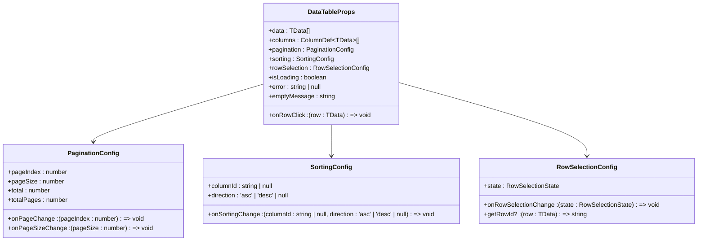

**Diagram sources**
- [data-table.tsx](file://components/ui/data-table.tsx#L35-L74)

### Table Component
The Table component provides the base styling and structure for tables in the application. It includes subcomponents for table headers, body, rows, and cells, ensuring consistent styling across all tables.

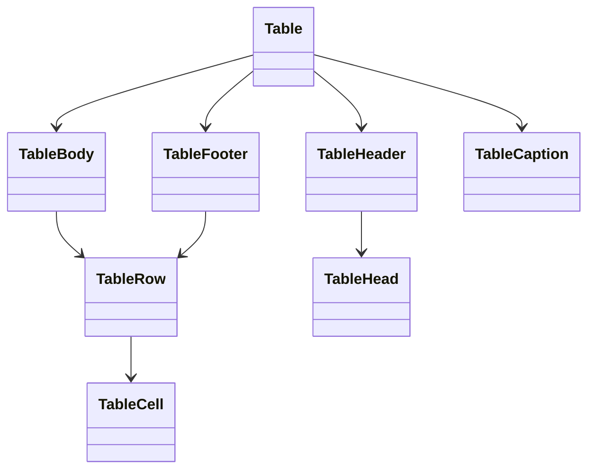

**Diagram sources**
- [table.tsx](file://components/ui/table.tsx#L5-L95)

### Column Header Components
The library includes specialized components for table column headers with sorting and filtering capabilities. The DataTableColumnHeader provides sortable headers with up/down arrows, while DataTableColumnHeaderWithFilter adds filtering functionality through a popover menu.

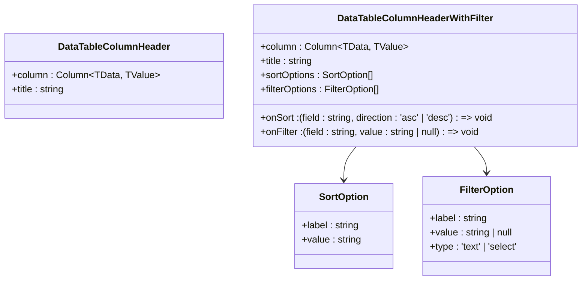

**Diagram sources**
- [data-table-column-header.tsx](file://components/ui/data-table-column-header.tsx#L8-L11)
- [data-table-column-header-with-filter.tsx](file://components/ui/data-table-column-header-with-filter.tsx#L27-L36)

### Responsive Table
The ResponsiveTable component extends the DataTable functionality with responsive layouts that adapt to different screen sizes. On mobile devices, it can display data as cards or provide horizontal scrolling for tables.

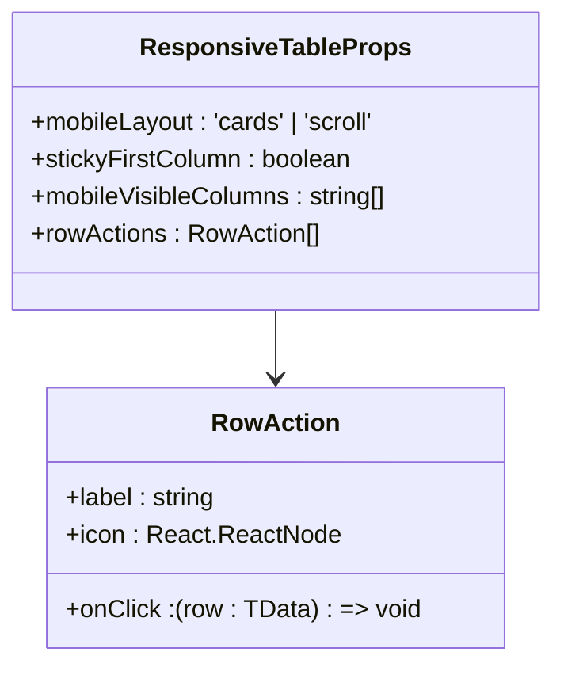

**Diagram sources**
- [responsive-table.tsx](file://components/ui/responsive-table.tsx#L73-L124)

**Section sources**
- [data-table.tsx](file://components/ui/data-table.tsx#L76-L332)
- [table.tsx](file://components/ui/table.tsx#L5-L95)
- [data-table-column-header.tsx](file://components/ui/data-table-column-header.tsx#L13-L47)
- [data-table-column-header-with-filter.tsx](file://components/ui/data-table-column-header-with-filter.tsx#L38-L163)
- [responsive-table.tsx](file://components/ui/responsive-table.tsx#L126-L564)

## Chart Components

### ChartContainer and Configuration
The Chart component provides a wrapper for Recharts with built-in theming support. It uses a context-based configuration system that allows for consistent styling across all charts in the application.

```mermaid
classDiagram
class ChartConfig {
+[k : string] : {
+label : React.ReactNode
+icon : React.ComponentType
} & (
| { color : string; theme? : never }
| { color? : never; theme : Record~keyof typeof THEMES, string~ }
)
}
class ChartContextProps {
+config : ChartConfig
}
class ChartContainer {
+id : string
+className : string
+children : ReactNode
+config : ChartConfig
}
ChartContainer --> ChartConfig
ChartContextProps --> ChartConfig
```

**Diagram sources**
- [chart.tsx](file://components/ui/chart.tsx#L11-L19)

### Chart Visualization Components
The library includes several chart components for different visualization needs, including tooltips, legends, and styling utilities.

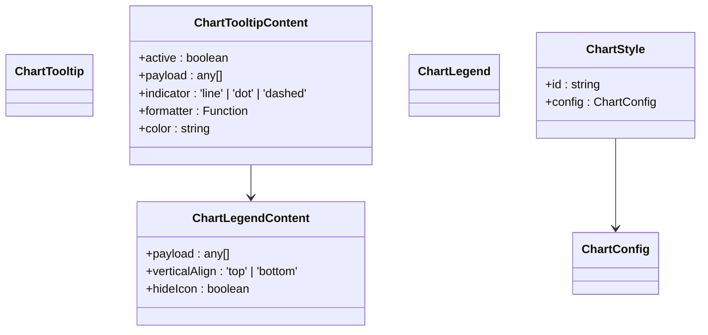

**Diagram sources**
- [chart.tsx](file://components/ui/chart.tsx#L105-L309)

### Mini Chart Components
The mini-chart.tsx file contains several lightweight chart components optimized for dashboards and compact spaces, including line, area, bar, pie, and donut charts.

```mermaid
classDiagram
class MiniLineChart {
+data : ChartDataPoint[]
+dataKey : string
+color : string
+height : number
}
class MiniAreaChart {
+data : ChartDataPoint[]
+dataKey : string
+color : string
+height : number
+gradient : boolean
}
class MiniBarChart {
+data : ChartDataPoint[]
+dataKey : string
+color : string
+height : number
+horizontal : boolean
}
class MiniPieChart {
+data : { name : string; value : number; color? : string }[]
+innerRadius : number
+colors : string[]
}
class MiniDonutChart {
+thickness : number
+centerContent : React.ReactNode
}
class Sparkline {
+data : number[]
+color : string
+height : number
}
class ProgressBarChart {
+data : ProgressBarData[]
+showLabels : boolean
}
class ProgressBarData {
+name : string
+value : number
+color : string
}
MiniDonutChart --> MiniPieChart
ProgressBarChart --> ProgressBarData
```

**Diagram sources**
- [mini-chart.tsx](file://components/ui/charts/mini-chart.tsx#L68-L520)

**Section sources**
- [chart.tsx](file://components/ui/chart.tsx#L37-L357)
- [mini-chart.tsx](file://components/ui/charts/mini-chart.tsx#L1-L521)

## Status and Indicator Components

### Badge Component
The Badge component provides visual indicators for status, categories, or other metadata. It supports multiple tones and appearances, with backward compatibility for legacy variants.

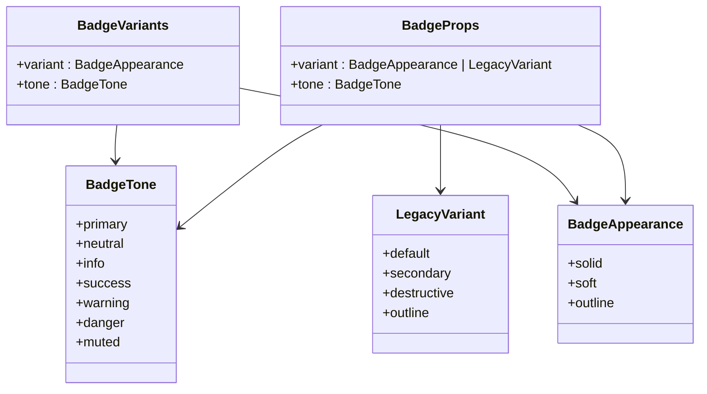

**Diagram sources**
- [badge.tsx](file://components/ui/badge.tsx#L6-L91)

### Progress Component
The Progress component displays a linear progress indicator, commonly used for showing completion percentages or loading states.

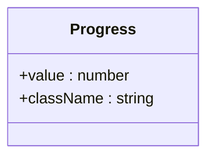

**Diagram sources**
- [progress.tsx](file://components/ui/progress.tsx#L8-L12)

**Section sources**
- [badge.tsx](file://components/ui/badge.tsx#L88-L119)
- [progress.tsx](file://components/ui/progress.tsx#L8-L29)

## Typography System

### Typography Component
The Typography component provides a set of polymorphic text elements with consistent styling. It supports various HTML elements while maintaining the application's typographic hierarchy.

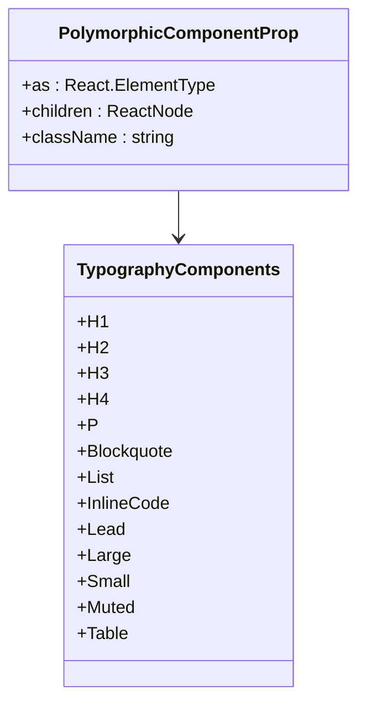

**Diagram sources**
- [typography.tsx](file://components/ui/typography.tsx#L5-L111)

**Section sources**
- [typography.tsx](file://components/ui/typography.tsx#L1-L112)

## Empty States and Skeleton Loaders

### Empty Component
The Empty component provides a consistent way to display content when no data is available. It includes subcomponents for headers, titles, descriptions, and media.

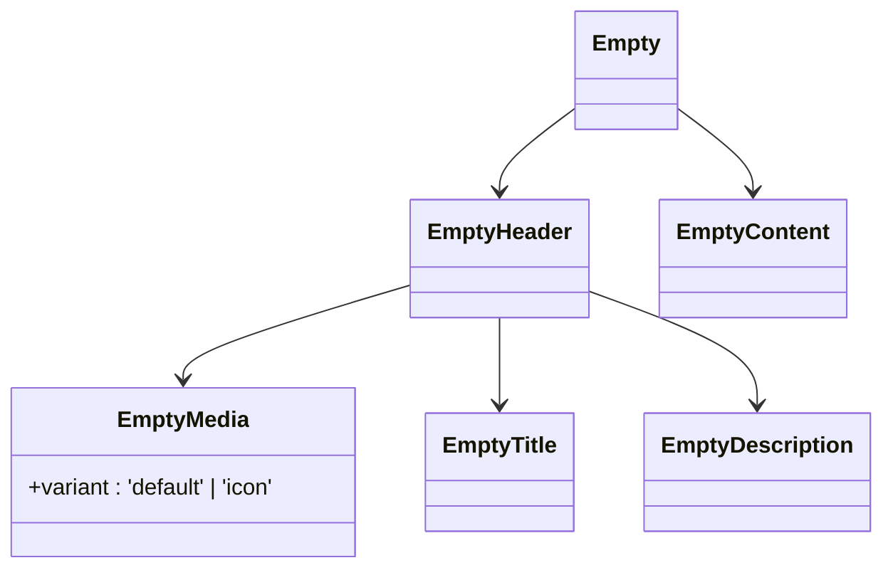

**Diagram sources**
- [empty.tsx](file://components/ui/empty.tsx#L5-L96)

### Skeleton Component
The Skeleton component provides a loading state placeholder that animates to indicate content is being loaded.

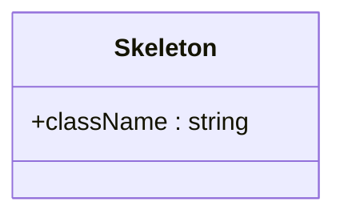

**Diagram sources**
- [skeleton.tsx](file://components/ui/skeleton.tsx#L3-L5)

**Section sources**
- [empty.tsx](file://components/ui/empty.tsx#L5-L104)
- [skeleton.tsx](file://components/ui/skeleton.tsx#L3-L13)

## Responsive Data Presentation
The Sinesys UI library includes several features for responsive data presentation. The ResponsiveTable component adapts its layout based on screen size, switching between card and table views on mobile devices. The mini-chart components are designed to be compact and work well in dashboard layouts. The DataTable component includes pagination controls that adapt to screen size, showing simplified controls on mobile devices. All components are built with Tailwind CSS, which provides a mobile-first responsive design approach.

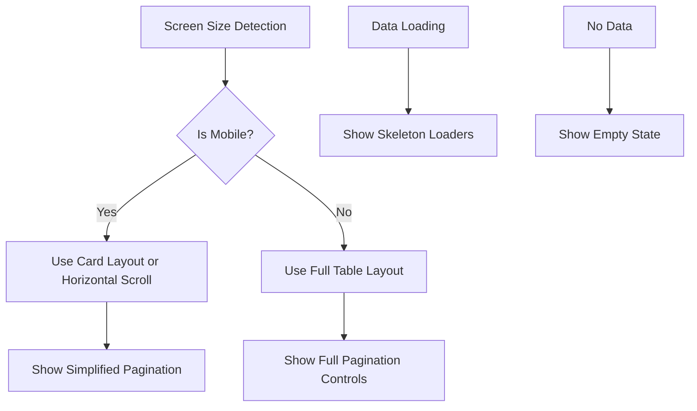

**Diagram sources**
- [responsive-table.tsx](file://components/ui/responsive-table.tsx#L144-L149)

**Section sources**
- [responsive-table.tsx](file://components/ui/responsive-table.tsx#L126-L564)
- [data-table.tsx](file://components/ui/data-table.tsx#L266-L329)

## Styling and Theme Integration
The data display components integrate with the application's theme through Tailwind CSS and CSS variables. The Chart component uses a context-based theming system that defines colors for different chart elements. The Badge component supports multiple tones that align with the application's color palette. All components use the `cn` utility for combining Tailwind classes with custom classes. The styling system is designed to be consistent across components while allowing for customization through props and CSS variables.

```mermaid
graph TB
A[Tailwind CSS] --> B[Component Classes]
C[CSS Variables] --> D[Chart Colors]
D --> E[Primary: var(--primary)]
D --> F[Success: #22c55e]
D --> G[Warning: #f59e0b]
D --> H[Danger: #ef4444]
B --> I[Badge Tones]
I --> J[Primary, Success, Warning, Danger]
I --> K[Neutral, Info, Muted]
A --> L[Responsive Design]
L --> M[Mobile First]
L --> N[Breakpoints]
```

**Diagram sources**
- [badge.tsx](file://components/ui/badge.tsx#L10-L53)
- [chart.tsx](file://components/ui/chart.tsx#L37-L45)
- [mini-chart.tsx](file://components/ui/charts/mini-chart.tsx#L37-L57)

**Section sources**
- [badge.tsx](file://components/ui/badge.tsx#L1-L123)
- [chart.tsx](file://components/ui/chart.tsx#L1-L358)
- [mini-chart.tsx](file://components/ui/charts/mini-chart.tsx#L1-L521)

## Accessibility Considerations
The data display components include several accessibility features. Data tables include proper ARIA labels and keyboard navigation support. The DataTable component supports row selection and keyboard navigation through tabular data. Chart components include ARIA labels and tooltips that provide information to screen readers. The Badge component uses appropriate contrast ratios for text and background colors. All interactive elements are focusable and have visible focus states. The Empty and Skeleton components provide appropriate semantic markup to indicate their purpose to assistive technologies.

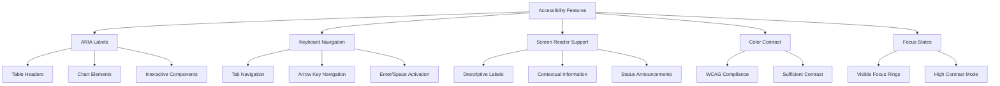

**Diagram sources**
- [data-table.tsx](file://components/ui/data-table.tsx#L214-L244)
- [chart.tsx](file://components/ui/chart.tsx#L107-L251)
- [table.tsx](file://components/ui/table.tsx#L43-L54)

**Section sources**
- [data-table.tsx](file://components/ui/data-table.tsx#L76-L332)
- [chart.tsx](file://components/ui/chart.tsx#L105-L357)
- [table.tsx](file://components/ui/table.tsx#L5-L95)