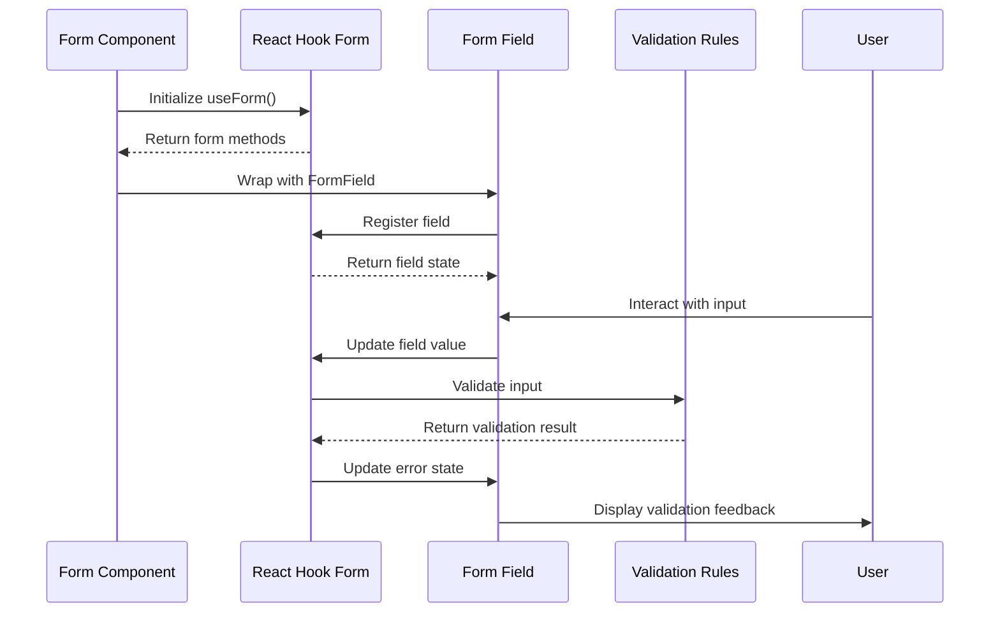
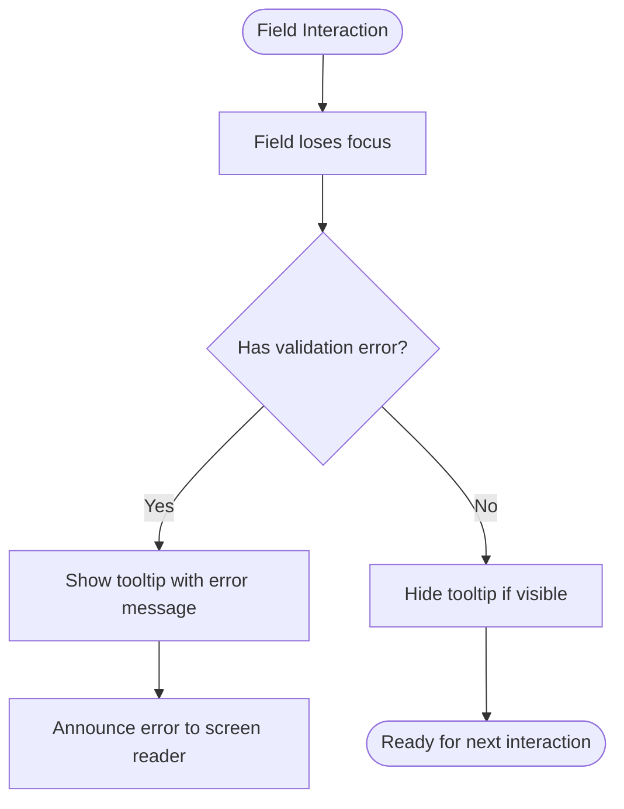
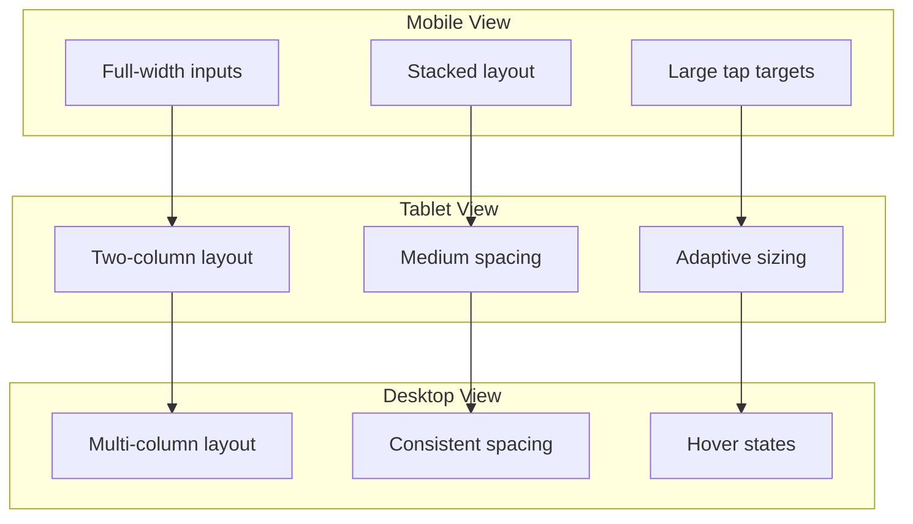
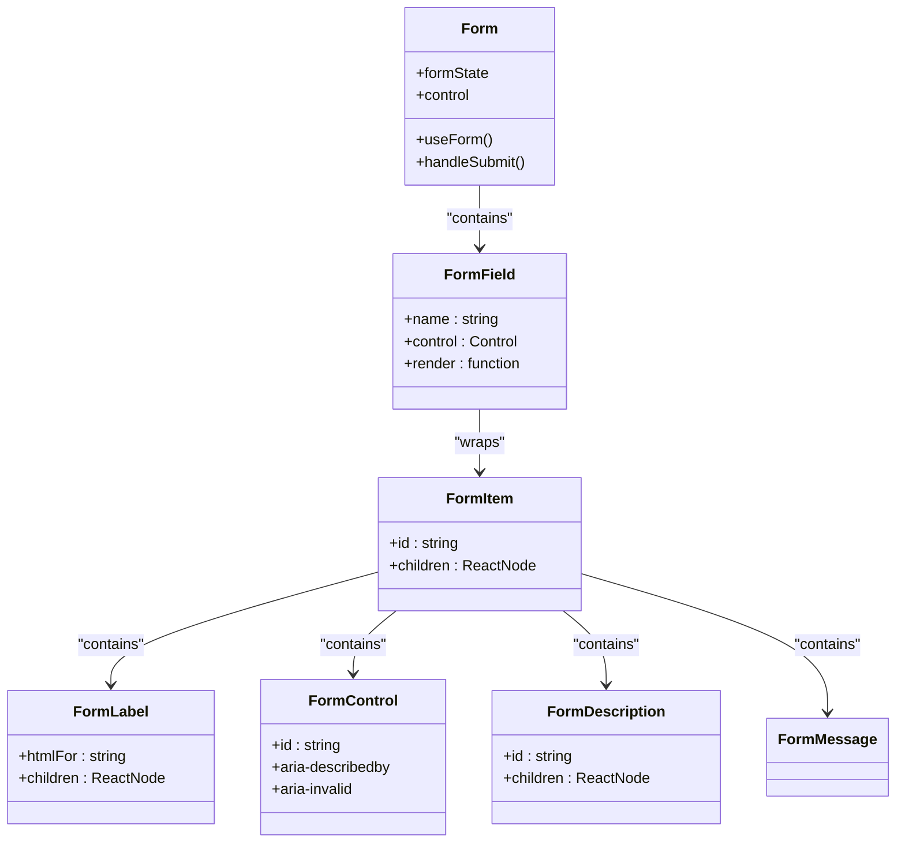

# Form Components

<cite>
**Referenced Files in This Document**   
- [form.tsx](file://components/ui/form.tsx)
- [input.tsx](file://components/ui/input.tsx)
- [textarea.tsx](file://components/ui/textarea.tsx)
- [checkbox.tsx](file://components/ui/checkbox.tsx)
- [radio-group.tsx](file://components/ui/radio-group.tsx)
- [select.tsx](file://components/ui/select.tsx)
- [combobox.tsx](file://components/ui/combobox.tsx)
- [date-picker.tsx](file://components/ui/date-picker.tsx)
- [switch.tsx](file://components/ui/switch.tsx)
</cite>

## Table of Contents
1. [Introduction](#introduction)
2. [Core Form Components](#core-form-components)
3. [Form State Management with React Hook Form](#form-state-management-with-react-hook-form)
4. [Validation and Error Handling](#validation-and-error-handling)
5. [Accessibility Implementation](#accessibility-implementation)
6. [Styling and Responsive Behavior](#styling-and-responsive-behavior)
7. [Usage Examples](#usage-examples)
8. [Component Integration Patterns](#component-integration-patterns)
9. [Performance Considerations](#performance-considerations)

## Introduction
The Sinesys UI library provides a comprehensive set of form components designed for legal data entry applications. These components are built with accessibility, validation, and responsive design principles in mind, ensuring reliable data capture across various legal workflows including client registration, hearing creation, and contract management. The form system integrates seamlessly with React Hook Form for efficient state management and validation handling.

## Core Form Components

The Sinesys UI library includes a complete suite of form controls designed for legal data entry scenarios. Each component follows consistent design patterns for styling, accessibility, and interaction.

### Input
The Input component provides a styled text input field with support for various input types including text, email, phone, and number. It integrates with the form system to display validation states and error messages.

**Section sources**
- [input.tsx](file://components/ui/input.tsx)

### Textarea
The Textarea component offers a multi-line text input with automatic height adjustment. It supports character counting and validation for legal document descriptions and case notes.

**Section sources**
- [textarea.tsx](file://components/ui/textarea.tsx)

### Checkbox
The Checkbox component provides binary selection capability with visual feedback for checked and unchecked states. It supports indeterminate states and can be used in groups for multiple selection scenarios.

**Section sources**
- [checkbox.tsx](file://components/ui/checkbox.tsx)

### Radio Group
The Radio Group component enables single selection from multiple options. It ensures proper keyboard navigation and screen reader support for accessible form interactions.

**Section sources**
- [radio-group.tsx](file://components/ui/radio-group.tsx)

### Select
The Select component implements a dropdown menu for choosing from predefined options. It supports both single and multiple selection modes with keyboard navigation and screen reader compatibility.

**Section sources**
- [select.tsx](file://components/ui/select.tsx)

### Combobox
The Combobox component combines a text input with a dropdown list, allowing users to either select from predefined options or type a custom value. It includes search functionality and supports multiple selections with badge indicators.

**Section sources**
- [combobox.tsx](file://components/ui/combobox.tsx)

### Date Picker
The Date Picker component provides a calendar interface for date selection with proper formatting for Brazilian legal standards. It includes validation for date ranges and business days.

**Section sources**
- [date-picker.tsx](file://components/ui/date-picker.tsx)

### Switch
The Switch component offers a toggle control for binary options with smooth animation and clear visual states. It's commonly used for enabling/disabling features or options.

**Section sources**
- [switch.tsx](file://components/ui/switch.tsx)

## Form State Management with React Hook Form

The form components are designed to work seamlessly with React Hook Form, providing efficient state management and validation capabilities.

**Diagram sources**
- [form.tsx](file://components/ui/form.tsx)

**Section sources**
- [form.tsx](file://components/ui/form.tsx)

## Validation and Error Handling

The form system implements a robust validation approach that provides immediate feedback to users while maintaining accessibility standards.

### Validation Patterns
The components support various validation patterns specific to legal data entry:
- Document number validation (CPF, CNPJ, OAB)
- Date format validation (dd/mm/yyyy)
- Monetary value formatting
- Case number pattern matching
- Email and contact information validation

### Error Messaging
Error messages are displayed using tooltips that appear on blur or when a field loses focus. This approach ensures screen reader compatibility while providing visual feedback without disrupting the form layout.

**Diagram sources**
- [form.tsx](file://components/ui/form.tsx)

**Section sources**
- [form.tsx](file://components/ui/form.tsx)

## Accessibility Implementation

The form components follow WCAG 2.1 guidelines to ensure accessibility for all users.

### Labeling
Each form control is properly associated with its label using ARIA attributes and proper HTML structure. The FormLabel component automatically connects to its corresponding input field.

### Keyboard Navigation
All components support full keyboard navigation:
- Tab to move between fields
- Arrow keys to navigate options in select menus
- Space/Enter to select options
- Escape to close dropdowns

### Screen Reader Support
The components provide appropriate ARIA roles and states:
- aria-invalid for invalid fields
- aria-describedby for error messages
- role="combobox" for enhanced input controls
- Proper landmark roles for form sections

**Section sources**
- [form.tsx](file://components/ui/form.tsx)
- [input.tsx](file://components/ui/input.tsx)
- [checkbox.tsx](file://components/ui/checkbox.tsx)

## Styling and Responsive Behavior

The form components use Tailwind CSS for styling with a consistent design system across the application.

### Validation States
Components respond to different validation states with visual feedback:
- Error state: Red border and icon
- Focus state: Blue ring indicator
- Disabled state: Reduced opacity and cursor

### Responsive Design
Forms adapt to different screen sizes:
- Mobile: Full-width inputs with appropriate tap targets
- Tablet: Two-column layouts for related fields
- Desktop: Multi-column layouts with proper spacing

**Diagram sources**
- [input.tsx](file://components/ui/input.tsx)
- [form.tsx](file://components/ui/form.tsx)

**Section sources**
- [input.tsx](file://components/ui/input.tsx)
- [form.tsx](file://components/ui/form.tsx)

## Usage Examples

The form components are used throughout the application in various legal workflows.

### Client Registration Form
A multi-step form that collects client information including personal details, contact information, and legal representation preferences. Uses Input, Select, and Checkbox components with conditional fields.

### Hearing Creation Dialog
A modal form for scheduling hearings with fields for date, time, participants, and hearing type. Utilizes DatePicker, Combobox, and Radio Group components.

### Contract Editing Sheet
A comprehensive form for editing legal contracts with sections for parties, terms, payment schedules, and attachments. Uses Textarea, Switch, and nested form fields.

**Section sources**
- [form.tsx](file://components/ui/form.tsx)
- [input.tsx](file://components/ui/input.tsx)
- [textarea.tsx](file://components/ui/textarea.tsx)

## Component Integration Patterns

The form components follow consistent integration patterns for easy implementation.

**Diagram sources**
- [form.tsx](file://components/ui/form.tsx)

**Section sources**
- [form.tsx](file://components/ui/form.tsx)

## Performance Considerations

The form components are optimized for performance in legal applications with complex forms.

### Dynamic Fields
Forms with dynamic fields use React Hook Form's efficient re-rendering to minimize performance impact when adding or removing fields.

### Validation Optimization
Validation rules are applied efficiently with debounce for expensive operations like API calls for duplicate checking.

### Memory Management
Components properly clean up event listeners and state to prevent memory leaks in long-lived forms.

**Section sources**
- [form.tsx](file://components/ui/form.tsx)
- [combobox.tsx](file://components/ui/combobox.tsx)