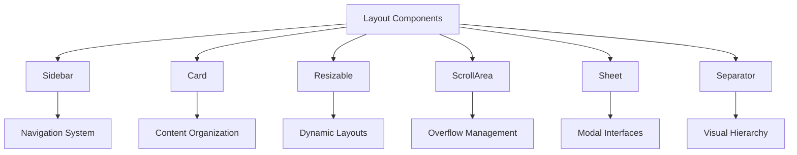
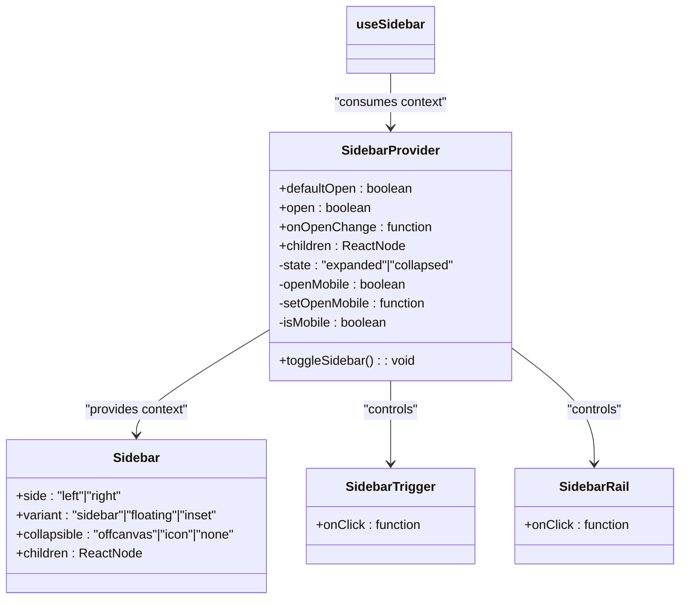
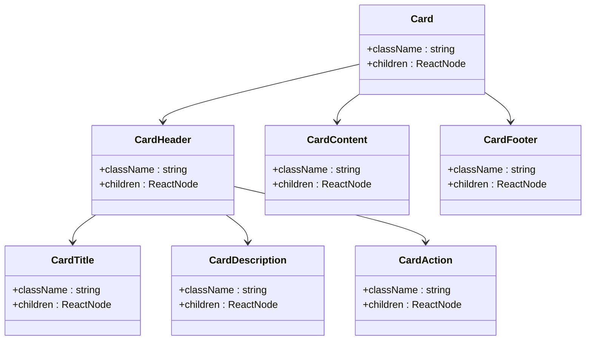
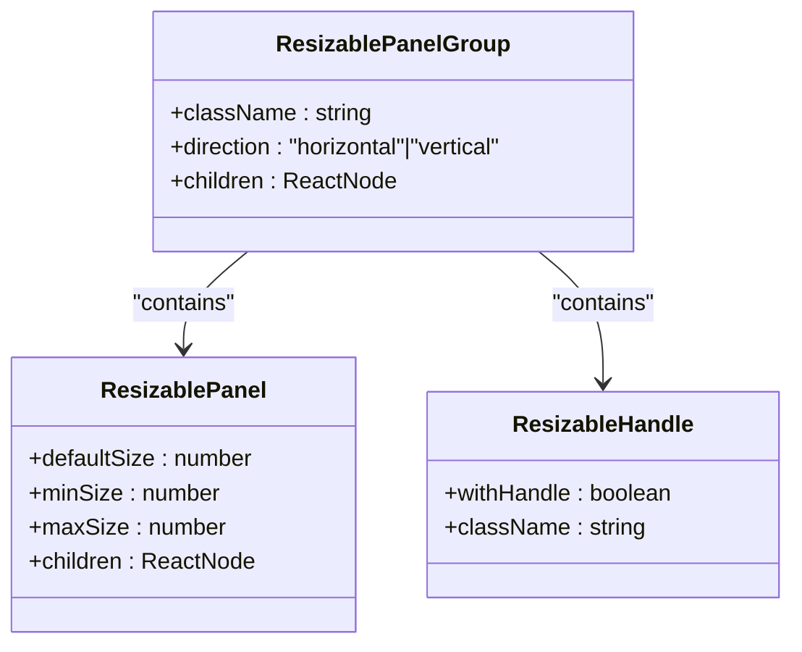
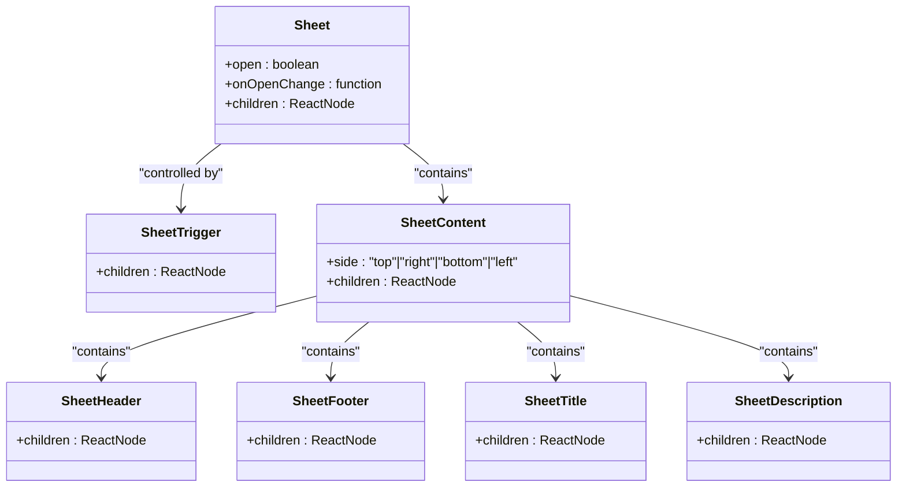
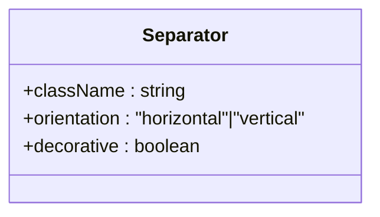
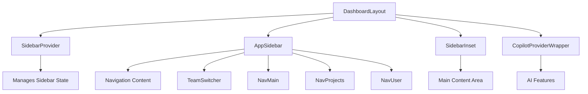

# Layout Components

<cite>
**Referenced Files in This Document**   
- [sidebar.tsx](file://components/ui/sidebar.tsx)
- [card.tsx](file://components/ui/card.tsx)
- [resizable.tsx](file://components/ui/resizable.tsx)
- [scroll-area.tsx](file://components/ui/scroll-area.tsx)
- [sheet.tsx](file://components/ui/sheet.tsx)
- [separator.tsx](file://components/ui/separator.tsx)
- [app-sidebar.tsx](file://components/layout/app-sidebar.tsx)
- [nav-main.tsx](file://components/layout/nav-main.tsx)
- [nav-projects.tsx](file://components/layout/nav-projects.tsx)
- [nav-user.tsx](file://components/layout/nav-user.tsx)
- [team-switcher.tsx](file://components/layout/team-switcher.tsx)
- [layout.tsx](file://app/(dashboard)/layout.tsx)
- [breadcrumb-context.tsx](file://components/layout/breadcrumb-context.tsx)
- [resize-handle.tsx](file://components/ui/resize-handle.tsx)
</cite>

## Table of Contents
1. [Introduction](#introduction)
2. [Layout Components Overview](#layout-components-overview)
3. [Sidebar Component](#sidebar-component)
4. [Card Component](#card-component)
5. [Resizable Component](#resizable-component)
6. [ScrollArea Component](#scrollarea-component)
7. [Sheet Component](#sheet-component)
8. [Separator Component](#separator-component)
9. [Dashboard Integration](#dashboard-integration)
10. [Accessibility and Responsive Design](#accessibility-and-responsive-design)
11. [Styling and Theme Consistency](#styling-and-theme-consistency)
12. [Performance Considerations](#performance-considerations)

## Introduction

The Sinesys UI library provides a comprehensive set of layout components designed to create a cohesive and responsive user interface for the application's dashboard and navigation system. These components work together to establish a consistent information architecture, enabling users to efficiently navigate through various features and data views. The layout system is built with accessibility, responsiveness, and performance in mind, ensuring a seamless experience across desktop and mobile devices.

The core layout components include Sidebar, Card, Resizable, ScrollArea, Sheet, and Separator, each serving a specific purpose in organizing content and facilitating user interaction. These components are implemented using React with TypeScript, leveraging modern web development practices and design patterns. The integration of these components within the dashboard layout demonstrates a sophisticated approach to user interface design, combining collapsible navigation, resizable panels, and responsive layouts to optimize screen real estate and user workflow.

**Section sources**
- [sidebar.tsx](file://components/ui/sidebar.tsx#L1-L727)
- [card.tsx](file://components/ui/card.tsx#L1-L93)
- [resizable.tsx](file://components/ui/resizable.tsx#L1-L46)

## Layout Components Overview

The Sinesys UI library's layout components form a cohesive system that enables the creation of complex, responsive interfaces. These components are designed to work together seamlessly, providing a consistent user experience across the application. The architecture follows a modular approach, where each component has a specific responsibility and can be composed to create more complex layouts.

The layout system is built on several key principles: responsiveness, accessibility, and consistency. Components are designed to adapt to different screen sizes and device types, ensuring optimal usability on both desktop and mobile devices. Accessibility features are integrated throughout, including keyboard navigation support and screen reader compatibility. The styling approach leverages Tailwind CSS and CSS variables to maintain theme consistency across the application.

These components are used extensively in the dashboard layout, where they work together to create a hierarchical information architecture. The Sidebar provides primary navigation, Cards organize content into digestible units, Resizable components enable dynamic panel sizing, ScrollArea handles overflow content, Sheet provides modal interfaces, and Separator creates visual hierarchy. This combination allows for the creation of complex, data-intensive interfaces while maintaining usability and visual coherence.



**Diagram sources**
- [sidebar.tsx](file://components/ui/sidebar.tsx#L1-L727)
- [card.tsx](file://components/ui/card.tsx#L1-L93)
- [resizable.tsx](file://components/ui/resizable.tsx#L1-L46)
- [scroll-area.tsx](file://components/ui/scroll-area.tsx#L1-L47)
- [sheet.tsx](file://components/ui/sheet.tsx#L1-L140)
- [separator.tsx](file://components/ui/separator.tsx#L1-L29)

**Section sources**
- [sidebar.tsx](file://components/ui/sidebar.tsx#L1-L727)
- [card.tsx](file://components/ui/card.tsx#L1-L93)
- [resizable.tsx](file://components/ui/resizable.tsx#L1-L46)
- [scroll-area.tsx](file://components/ui/scroll-area.tsx#L1-L47)
- [sheet.tsx](file://components/ui/sheet.tsx#L1-L140)
- [separator.tsx](file://components/ui/separator.tsx#L1-L29)

## Sidebar Component

The Sidebar component is a comprehensive navigation solution that provides both desktop and mobile interfaces. It implements a collapsible design pattern that adapts to different screen sizes, maintaining usability across devices. The component uses a context-based architecture with `SidebarProvider` and `useSidebar` hook to manage state and enable communication between related components.

On desktop, the sidebar supports multiple collapsibility modes including "offcanvas" and "icon" states, allowing users to maximize content space when needed. The component persists its state using cookies (`SIDEBAR_COOKIE_NAME`), ensuring user preferences are maintained across sessions. Keyboard navigation is supported with the shortcut "Ctrl/Cmd + B" to toggle the sidebar, enhancing accessibility for keyboard users.

The sidebar implementation includes several specialized subcomponents: `SidebarTrigger` for toggling visibility, `SidebarRail` for resize interactions, and various group and menu components for organizing navigation items. These subcomponents work together to create a cohesive navigation experience with visual feedback, tooltips, and smooth transitions. The mobile experience is handled through the `Sheet` component, which provides a modal navigation interface that slides in from the side.



**Diagram sources**
- [sidebar.tsx](file://components/ui/sidebar.tsx#L1-L727)

**Section sources**
- [sidebar.tsx](file://components/ui/sidebar.tsx#L1-L727)
- [app-sidebar.tsx](file://components/layout/app-sidebar.tsx#L1-L258)

## Card Component

The Card component provides a structured container for organizing content into visually distinct units. It follows a consistent layout pattern with designated areas for header, title, description, content, action, and footer. This component is designed to present information in a clear and organized manner, making it easier for users to scan and understand content.

The card implementation uses a flexible grid system that adapts to different content types and screen sizes. The header section supports a two-column layout with actions aligned to the right, while the content area provides consistent padding. The component uses semantic data attributes (e.g., `data-slot="card"`) to enhance accessibility and styling consistency.

Cards are extensively used throughout the application to display various types of information, from dashboard metrics to document previews. The component supports customization through props that control spacing, styling, and content organization. The design emphasizes visual hierarchy through typography, spacing, and subtle shadows, creating a layered effect that helps users understand the information architecture.



**Diagram sources**
- [card.tsx](file://components/ui/card.tsx#L1-L93)

**Section sources**
- [card.tsx](file://components/ui/card.tsx#L1-L93)

## Resizable Component

The Resizable component enables dynamic layout adjustments by allowing users to resize panels interactively. Built on the `react-resizable-panels` library, this component provides a flexible system for creating layouts with adjustable proportions. The implementation includes three main components: `ResizablePanelGroup`, `ResizablePanel`, and `ResizableHandle`.

The `ResizablePanelGroup` serves as the container for resizable panels, managing their collective behavior and layout direction (horizontal or vertical). Each `ResizablePanel` represents a resizable content area that can be configured with default sizes and resize constraints. The `ResizableHandle` provides the interactive element for resizing, with an optional grip indicator when the `withHandle` prop is enabled.

This component is particularly useful for creating complex dashboard layouts where users need to customize the visibility of different information panels. The implementation supports both mouse and touch interactions, ensuring accessibility across different input methods. The component uses CSS custom properties and Tailwind classes to maintain visual consistency with the overall design system.



**Diagram sources**
- [resizable.tsx](file://components/ui/resizable.tsx#L1-L46)
- [resize-handle.tsx](file://components/ui/resize-handle.tsx#L1-L90)

**Section sources**
- [resizable.tsx](file://components/ui/resizable.tsx#L1-L46)
- [resize-handle.tsx](file://components/ui/resize-handle.tsx#L1-L90)

## ScrollArea Component

The ScrollArea component provides a styled container for content that may exceed the available viewport space. Built on Radix UI's ScrollArea primitive, this component enhances native scrolling with custom styling and improved user experience. It addresses common issues with default browser scrollbars, providing a more polished and consistent appearance across different platforms.

The implementation consists of two main components: `ScrollArea` and `ScrollBar`. The `ScrollArea` component serves as the container that clips overflow content and provides the viewport for scrolling. The `ScrollBar` component renders a custom scrollbar with subtle visual styling that appears on hover, reducing visual clutter when not in use.

This component supports both vertical and horizontal scrolling orientations and includes accessibility features such as keyboard navigation support. The design uses CSS custom properties and Tailwind classes to maintain theme consistency, with scrollbars that match the application's color scheme. The component is optimized for performance, using efficient rendering techniques to handle large amounts of content without impacting application responsiveness.

```mermaid
classDiagram
class ScrollArea {
+className : string
+children : ReactNode
+orientation : "vertical"|"horizontal"
}
class ScrollBar {
+className : string
+orientation : "vertical"|"horizontal"
}
ScrollArea --> ScrollBar : "contains"
ScrollArea --> "Viewport" : "contains"
```

**Diagram sources**
- [scroll-area.tsx](file://components/ui/scroll-area.tsx#L1-L47)

**Section sources**
- [scroll-area.tsx](file://components/ui/scroll-area.tsx#L1-L47)

## Sheet Component

The Sheet component provides a modal interface that slides in from the edge of the screen, commonly used for navigation drawers, settings panels, and other secondary interfaces. Built on Radix UI's Dialog primitive, this component offers a flexible system for creating modal experiences with smooth animations and proper accessibility.

The implementation includes several subcomponents: `Sheet`, `SheetTrigger`, `SheetClose`, `SheetContent`, `SheetHeader`, `SheetFooter`, `SheetTitle`, and `SheetDescription`. These components work together to create a cohesive modal experience with proper focus management, keyboard navigation, and screen reader support.

The Sheet component supports multiple positioning options (top, right, bottom, left) and includes built-in animations for entrance and exit transitions. The overlay provides a backdrop that dims the main content and captures clicks outside the modal to dismiss it. On mobile devices, the sheet typically takes up most of the screen width (92vw), while on larger screens it is constrained to a maximum width of 28rem for optimal readability.



**Diagram sources**
- [sheet.tsx](file://components/ui/sheet.tsx#L1-L140)

**Section sources**
- [sheet.tsx](file://components/ui/sheet.tsx#L1-L140)

## Separator Component

The Separator component provides a simple visual divider between content sections, helping to establish hierarchy and improve readability. Built on Radix UI's Separator primitive, this component offers a semantic and accessible way to separate content while maintaining consistent styling throughout the application.

The implementation is minimal yet effective, rendering a thin line that can be oriented horizontally or vertically based on the `orientation` prop. The component uses CSS custom properties to ensure the separator color matches the application's theme (via the `bg-border` class). By default, separators are decorative and do not convey semantic meaning, as indicated by the `decorative` prop being set to `true`.

This component is used extensively throughout the application to separate navigation items, card sections, and other content groupings. The design emphasizes subtlety, with separators that provide visual separation without drawing excessive attention. The component is optimized for performance and accessibility, ensuring it does not interfere with keyboard navigation or screen reader interpretation of content structure.



**Diagram sources**
- [separator.tsx](file://components/ui/separator.tsx#L1-L29)

**Section sources**
- [separator.tsx](file://components/ui/separator.tsx#L1-L29)

## Dashboard Integration

The layout components are integrated within the dashboard through a sophisticated composition of providers and specialized layout components. The main dashboard layout is defined in `layout.tsx`, which wraps the application content with `SidebarProvider` and includes the `AppSidebar` component for navigation.

The `AppSidebar` component serves as the main navigation hub, organizing functionality into three distinct sections: Platform (core office functions), Services (tools and utilities), and Administration (settings and management). This organization reflects the application's information architecture, grouping related features to support intuitive navigation.

The integration leverages React context to manage sidebar state across components, ensuring consistent behavior and enabling features like mobile responsiveness and state persistence. The layout system uses CSS custom properties to define dimensions (e.g., `--sidebar-width`) that can be referenced throughout the application, maintaining consistency in spacing and proportions.



**Diagram sources**
- [layout.tsx](file://app/(dashboard)/layout.tsx#L1-L22)
- [app-sidebar.tsx](file://components/layout/app-sidebar.tsx#L1-L258)

**Section sources**
- [layout.tsx](file://app/(dashboard)/layout.tsx#L1-L22)
- [app-sidebar.tsx](file://components/layout/app-sidebar.tsx#L1-L258)
- [nav-main.tsx](file://components/layout/nav-main.tsx#L1-L117)
- [nav-projects.tsx](file://components/layout/nav-projects.tsx#L1-L172)
- [nav-user.tsx](file://components/layout/nav-user.tsx#L1-L162)
- [team-switcher.tsx](file://components/layout/team-switcher.tsx#L1-L69)

## Accessibility and Responsive Design

The layout components are designed with accessibility and responsive design as core principles. Each component includes features that support keyboard navigation, screen reader compatibility, and adaptive layouts for different screen sizes and device types.

Keyboard navigation is supported throughout the layout system, with logical tab order, focus indicators, and keyboard shortcuts (such as Ctrl/Cmd + B for toggling the sidebar). Screen reader support is implemented using appropriate ARIA attributes, semantic HTML elements, and accessible labels. The components handle focus management during state changes, ensuring that keyboard users can navigate the interface effectively.

Responsive design is achieved through a combination of CSS media queries, flexible layouts, and device detection. The `useIsMobile` hook detects mobile devices and adjusts component behavior accordingly, such as switching from a persistent sidebar to a modal sheet interface. The layout system uses relative units and CSS custom properties to ensure consistent spacing and proportions across different screen sizes.

The components also support accessibility features such as reduced motion preferences, high contrast modes, and dynamic text sizing. These features ensure that the application is usable by people with various disabilities and preferences, aligning with WCAG guidelines for web accessibility.

**Section sources**
- [sidebar.tsx](file://components/ui/sidebar.tsx#L1-L727)
- [app-sidebar.tsx](file://components/layout/app-sidebar.tsx#L1-L258)
- [nav-main.tsx](file://components/layout/nav-main.tsx#L1-L117)
- [breadcrumb-context.tsx](file://components/layout/breadcrumb-context.tsx#L1-L58)

## Styling and Theme Consistency

The layout components use a comprehensive styling approach that combines Tailwind CSS with CSS variables to ensure theme consistency across the application. The design system leverages utility classes for rapid development while maintaining a cohesive visual language through semantic CSS custom properties.

CSS variables are defined at the component level (e.g., `--sidebar-width`, `--sidebar-width-icon`) and integrated with Tailwind's configuration system. This approach allows for easy theme customization and ensures consistent spacing, colors, and proportions throughout the application. The components use data attributes (e.g., `data-slot`, `data-state`) to enable styling based on component state without relying on complex class names.

The color system is built around semantic variables (e.g., `bg-sidebar`, `text-sidebar-foreground`, `border-sidebar-border`) that map to the application's design tokens. This abstraction allows for easy theme switching and ensures visual consistency across components. The typography follows a structured hierarchy with consistent font weights, sizes, and line heights defined through Tailwind classes.

The styling approach also includes support for dark mode through the `next-themes` library, with components that automatically adapt to the user's preferred color scheme. This is implemented in components like `TeamSwitcher` and `NavUser`, which detect the current theme and adjust their appearance accordingly.

**Section sources**
- [sidebar.tsx](file://components/ui/sidebar.tsx#L1-L727)
- [card.tsx](file://components/ui/card.tsx#L1-L93)
- [team-switcher.tsx](file://components/layout/team-switcher.tsx#L1-L69)
- [nav-user.tsx](file://components/layout/nav-user.tsx#L1-L162)

## Performance Considerations

The layout components are optimized for performance, particularly when handling complex layouts with virtualized content. The implementation uses React best practices such as memoization, lazy loading, and efficient rendering patterns to minimize re-renders and optimize component updates.

The `SidebarProvider` uses `React.useMemo` to memoize the context value, preventing unnecessary re-renders of consuming components. Event handlers are wrapped in `React.useCallback` to maintain stable references and prevent downstream re-renders. The components also implement proper cleanup of event listeners and subscriptions to prevent memory leaks.

For layouts with large amounts of content, the components are designed to work effectively with virtualization techniques. The `ScrollArea` component provides a container that can be paired with virtualized list implementations to render only visible items. The `Card` and `Sidebar` components use efficient rendering patterns that minimize layout thrashing and reflow.

The mobile optimization strategy includes conditional rendering based on device detection, ensuring that resource-intensive features are only activated when needed. The cookie-based state persistence reduces the need for server requests to retrieve user preferences, improving initial load performance.

**Section sources**
- [sidebar.tsx](file://components/ui/sidebar.tsx#L1-L727)
- [scroll-area.tsx](file://components/ui/scroll-area.tsx#L1-L47)
- [card.tsx](file://components/ui/card.tsx#L1-L93)