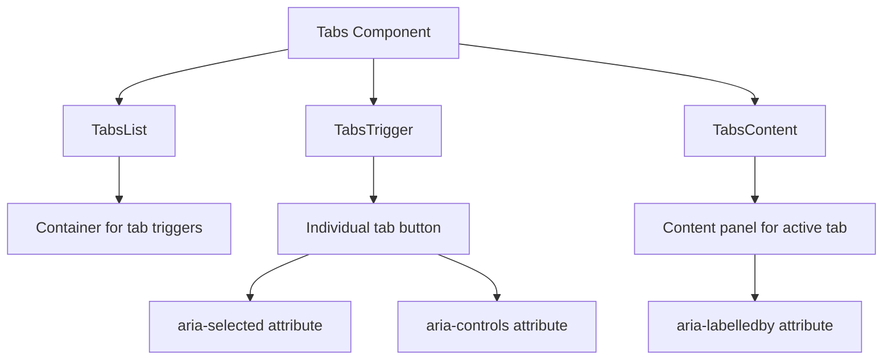
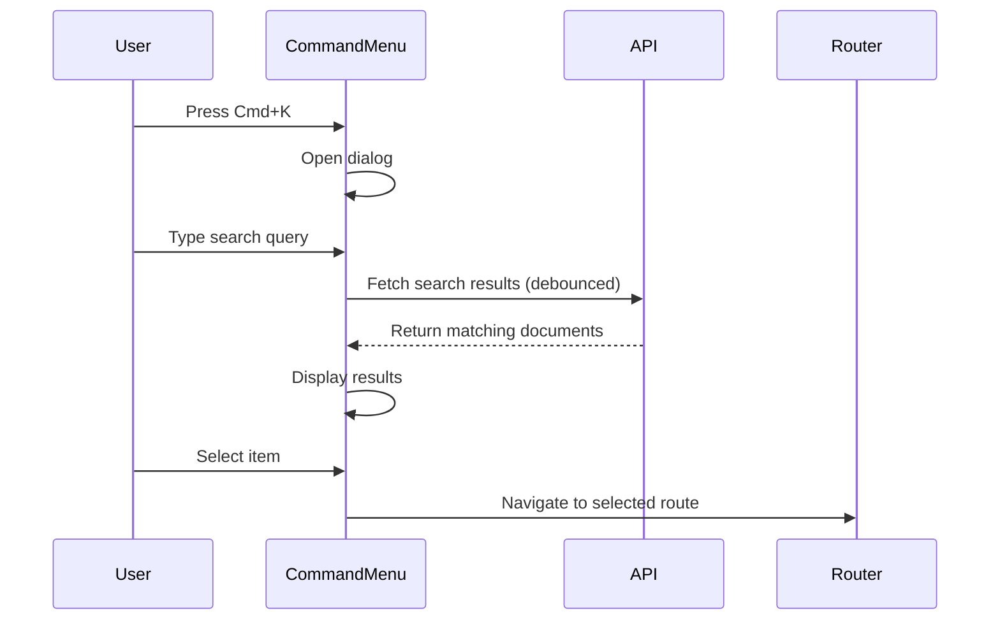
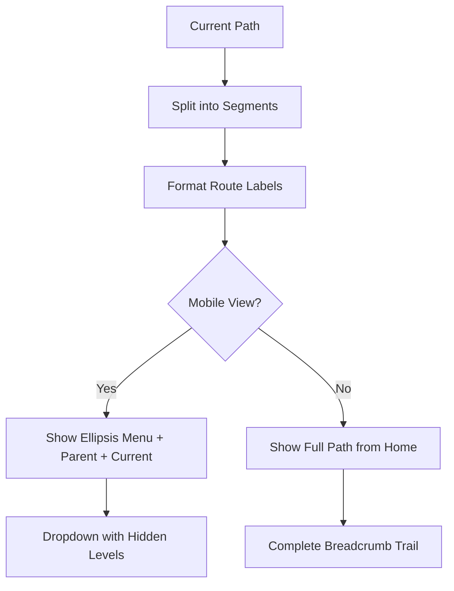
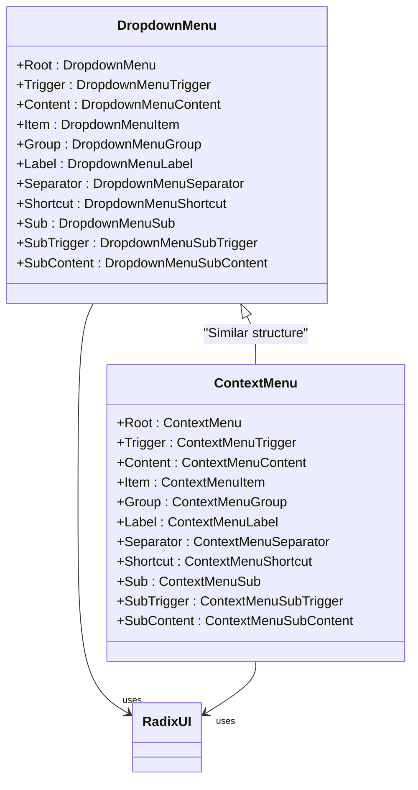
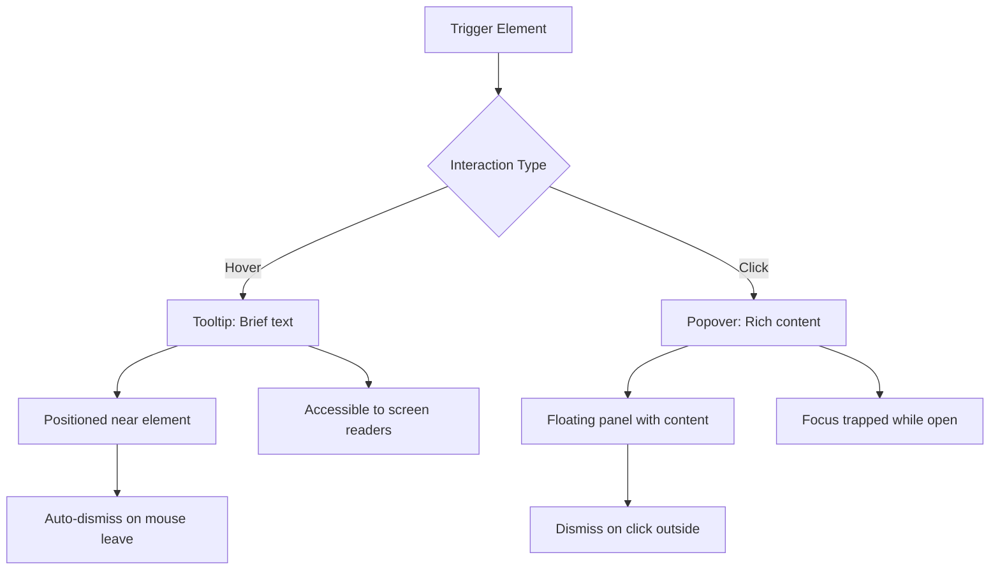

# Navigation Components

<cite>
**Referenced Files in This Document**   
- [tabs.tsx](file://components/ui/tabs.tsx)
- [command.tsx](file://components/ui/command.tsx)
- [breadcrumb.tsx](file://components/ui/breadcrumb.tsx)
- [dropdown-menu.tsx](file://components/ui/dropdown-menu.tsx)
- [context-menu.tsx](file://components/ui/context-menu.tsx)
- [popover.tsx](file://components/ui/popover.tsx)
- [tooltip.tsx](file://components/ui/tooltip.tsx)
- [command-menu.tsx](file://components/documentos/command-menu.tsx)
- [app-breadcrumb.tsx](file://components/layout/app-breadcrumb.tsx)
- [breadcrumb-context.tsx](file://components/layout/breadcrumb-context.tsx)
- [client-only-tabs.tsx](file://components/ui/client-only-tabs.tsx)
</cite>

## Table of Contents
1. [Introduction](#introduction)
2. [Core Navigation Components](#core-navigation-components)
3. [Tabs Component](#tabs-component)
4. [Command Menu](#command-menu)
5. [Breadcrumb Navigation](#breadcrumb-navigation)
6. [Dropdown and Context Menus](#dropdown-and-context-menus)
7. [Popover and Tooltip Components](#popover-and-tooltip-components)
8. [Accessibility and Keyboard Navigation](#accessibility-and-keyboard-navigation)
9. [Styling and Visual Consistency](#styling-and-visual-consistency)
10. [Performance Considerations](#performance-considerations)

## Introduction

The Sinesys UI library provides a comprehensive suite of navigation components designed to enhance user efficiency and information discovery across the application. These components include Tabs, Command Menu, Breadcrumb, Dropdown Menu, Context Menu, Popover, and Tooltip, each serving specific roles in application flow and user interaction. The navigation system enables seamless switching between process views, accessing context menus in data tables, and quick navigation through the global command palette. Built with accessibility in mind, these components support keyboard navigation, focus management, and screen reader compatibility while maintaining visual consistency through Tailwind CSS styling.

**Section sources**
- [tabs.tsx](file://components/ui/tabs.tsx#L1-L67)
- [command.tsx](file://components/ui/command.tsx#L1-L185)

## Core Navigation Components

The Sinesys navigation system comprises several key components that work together to create an intuitive user experience. The Tabs component allows users to switch between different views within a process detail page, maintaining context while navigating related content. The Command Menu (accessible via Cmd+K) serves as a global navigation hub for quick actions and page navigation. Breadcrumb navigation provides hierarchical context and allows users to navigate back through the application structure. Dropdown and Context Menus offer contextual actions based on user interactions, while Popover and Tooltip components provide additional information and actions without cluttering the interface.

These components are implemented using Radix UI primitives, ensuring accessibility and proper keyboard navigation. The Command Menu leverages the cmdk library for efficient search and filtering, while the Breadcrumb component integrates with Next.js routing to dynamically generate navigation paths. The Context Menu is specifically designed for document editing interfaces, providing quick access to formatting and AI-powered actions.

**Section sources**
- [tabs.tsx](file://components/ui/tabs.tsx#L1-L67)
- [command.tsx](file://components/ui/command.tsx#L1-L185)
- [breadcrumb.tsx](file://components/ui/breadcrumb.tsx#L1-L110)

## Tabs Component

The Tabs component in Sinesys provides a tabbed interface for organizing content within a single view. Implemented through the Tabs, TabsList, TabsTrigger, and TabsContent components, it allows users to switch between different sections of related information without leaving the current page. The component is designed to handle React 19 hydration issues through the ClientOnlyTabs wrapper, which ensures tabs are only rendered on the client side.

The Tabs component supports various styling options and can be customized for different use cases, such as process detail pages where users need to switch between overview, documents, and communications tabs. The implementation includes proper ARIA attributes for accessibility, with each tab panel having appropriate role and aria-labelledby attributes. Keyboard navigation is fully supported, allowing users to navigate between tabs using arrow keys and activate them with Enter or Space.

**Diagram sources**
- [tabs.tsx](file://components/ui/tabs.tsx#L8-L66)
- [client-only-tabs.tsx](file://components/ui/client-only-tabs.tsx#L1-L40)

## Command Menu

The Command Menu is a powerful navigation tool that enables users to quickly access commands and navigate through the application. Accessible via the Cmd+K keyboard shortcut, it provides a searchable interface for both navigation and actions. The implementation in command-menu.tsx demonstrates a comprehensive command palette with multiple sections including quick actions, recent documents, and navigation links.

The Command Menu supports fuzzy search functionality, allowing users to find documents and commands with partial text matching. It integrates with the Next.js router for seamless navigation and includes loading states during search operations. The component fetches recent documents from the API when opened and displays them in a dedicated section. Search results are debounced to prevent excessive API calls during typing.

Key features include:
- Global keyboard shortcut (Cmd+K/Ctrl+K)
- Fuzzy search with debounced API calls
- Recent documents section
- Quick action shortcuts
- Navigation to key application areas

**Diagram sources**
- [command-menu.tsx](file://components/documentos/command-menu.tsx#L1-L215)
- [command.tsx](file://components/ui/command.tsx#L1-L185)

## Breadcrumb Navigation

The Breadcrumb component provides hierarchical navigation and context for users within the application. Implemented in breadcrumb.tsx, it uses semantic HTML elements with proper ARIA attributes to ensure accessibility. The component dynamically generates breadcrumb trails based on the current URL path, with customizable labels for specific routes.

The AppBreadcrumb component extends the base Breadcrumb functionality with responsive design considerations. On mobile devices, it collapses intermediate breadcrumb levels into a dropdown menu to conserve screen space, showing only the parent and current page. On larger screens, it displays the full path from the home page to the current location. The component integrates with Next.js routing through the usePathname hook and supports dynamic label overrides through the BreadcrumbContext.

Key features include:
- Responsive design with mobile optimization
- Customizable route labels
- Dynamic path generation
- Screen reader accessibility
- Truncated text with ellipsis for long labels

**Diagram sources**
- [breadcrumb.tsx](file://components/ui/breadcrumb.tsx#L1-L110)
- [app-breadcrumb.tsx](file://components/layout/app-breadcrumb.tsx#L1-L229)

## Dropdown and Context Menus

The Sinesys UI library provides two primary menu components: Dropdown Menu and Context Menu. Both are built on Radix UI primitives and share similar APIs and accessibility features. The Dropdown Menu is typically triggered by a button click and provides a list of options or actions, while the Context Menu is activated by a right-click and offers contextual actions based on the clicked element.

The Context Menu implementation in block-context-menu.tsx demonstrates advanced functionality for document editing interfaces. It provides AI-powered actions, formatting options, and content manipulation tools when users right-click on document blocks. The menu includes nested submenus for actions like "Turn into" (converting content types) and "Align" (text alignment options). It integrates with the Plate editor system to perform actions on selected content blocks.

Both menu types support keyboard navigation, with arrow keys for movement, Enter for selection, and Escape to close. They include visual indicators for selected items and disabled states. The implementation ensures proper focus management and prevents focus loss when menus are opened or closed.

**Diagram sources**
- [dropdown-menu.tsx](file://components/ui/dropdown-menu.tsx#L1-L258)
- [context-menu.tsx](file://components/ui/context-menu.tsx#L1-L253)
- [block-context-menu.tsx](file://components/ui/block-context-menu.tsx#L1-L203)

## Popover and Tooltip Components

The Popover and Tooltip components provide supplementary information and actions without disrupting the main interface. The Popover component creates a floating panel that can contain rich content, forms, or additional controls. It's commonly used for settings panels, detailed information displays, or complex input controls.

The Tooltip component displays brief descriptive text when users hover over or focus on an element. It's implemented with accessibility in mind, supporting both mouse and keyboard interactions. The TooltipProvider ensures proper timing and positioning of tooltips across the application.

Both components use portals to render in the correct position in the DOM, preventing clipping issues and ensuring proper z-index stacking. They include animation transitions for smooth appearance and disappearance, enhancing the user experience. The implementations follow WAI-ARIA best practices for accessible floating elements.

Key features:
- Portal rendering for proper positioning
- Animation transitions
- Accessibility support for screen readers
- Flexible content rendering
- Proper focus trapping and management

**Diagram sources**
- [popover.tsx](file://components/ui/popover.tsx#L1-L49)
- [tooltip.tsx](file://components/ui/tooltip.tsx#L1-L62)

## Accessibility and Keyboard Navigation

All navigation components in the Sinesys UI library prioritize accessibility and keyboard navigation. Each component implements proper ARIA attributes and follows WAI-ARIA design patterns for accessible user interfaces. The components support full keyboard navigation, allowing users to interact with all functionality without a mouse.

The Tabs component supports arrow key navigation between tabs, with Home and End keys moving to the first and last tabs. The Command Menu is fully keyboard-operable, with arrow keys for selection, Enter for activation, and Escape to close. Breadcrumb links are focusable and can be activated with Enter.

Dropdown and Context Menus follow standard menu keyboard patterns, with arrow keys for navigation, Enter for selection, and Escape to close. Submenus are opened with Right Arrow and closed with Left Arrow. The Popover component traps focus within its content when open, ensuring keyboard users don't accidentally navigate to elements behind the popover.

All interactive elements have visible focus indicators, and the components provide appropriate visual feedback for hover, focus, and active states. Screen reader users receive proper announcements for menu openings, tab changes, and other state changes.

**Section sources**
- [tabs.tsx](file://components/ui/tabs.tsx#L1-L67)
- [command.tsx](file://components/ui/command.tsx#L1-L185)
- [breadcrumb.tsx](file://components/ui/breadcrumb.tsx#L1-L110)

## Styling and Visual Consistency

The navigation components maintain visual consistency across the application through the use of Tailwind CSS and a shared design system. All components use the same color palette, spacing system, and typography rules, ensuring a cohesive user experience. The styling approach leverages utility classes for consistent spacing, colors, and responsive behavior.

The components use data attributes (data-slot) to target specific parts of the component for styling, allowing for consistent customization across the application. The implementations include responsive design considerations, with mobile-optimized layouts for smaller screens.

Visual feedback is provided through subtle animations and transitions, enhancing the user experience without being distracting. The components use a consistent approach to hover, focus, and active states, making interactions predictable and intuitive.

The styling system supports dark mode through conditional classes that adapt colors based on the current theme. This ensures readability and visual harmony in both light and dark interfaces.

**Section sources**
- [tabs.tsx](file://components/ui/tabs.tsx#L1-L67)
- [command.tsx](file://components/ui/command.tsx#L1-L185)
- [breadcrumb.tsx](file://components/ui/breadcrumb.tsx#L1-L110)

## Performance Considerations

The navigation components are optimized for performance, particularly in complex navigation structures with potentially large amounts of content. The Command Menu implements debounced search to prevent excessive API calls during typing, improving responsiveness and reducing server load.

The Tabs component uses the ClientOnlyTabs wrapper to prevent hydration mismatches in React 19, ensuring smooth rendering and avoiding potential performance issues during server-side rendering. The Breadcrumb component optimizes rendering by only displaying relevant levels based on screen size, reducing the number of DOM elements on mobile devices.

For data-intensive components like the Command Menu, data fetching is optimized with caching and pagination where appropriate. The implementation avoids unnecessary re-renders through proper use of React.memo and useCallback hooks.

Lazy loading is employed for content that is not immediately visible, such as inactive tab panels, reducing initial load time and memory usage. The components are designed to handle large datasets efficiently, with virtualization considerations for long lists in menus and search results.

**Section sources**
- [command-menu.tsx](file://components/documentos/command-menu.tsx#L1-L215)
- [client-only-tabs.tsx](file://components/ui/client-only-tabs.tsx#L1-L40)
- [app-breadcrumb.tsx](file://components/layout/app-breadcrumb.tsx#L1-L229)