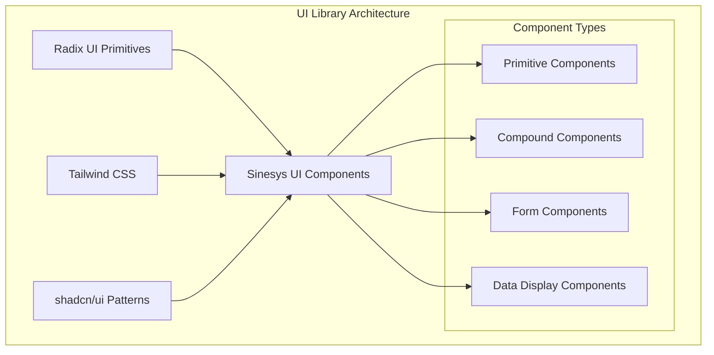
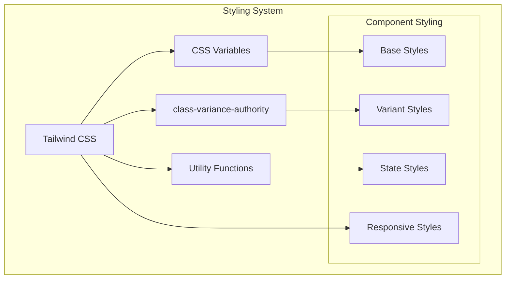
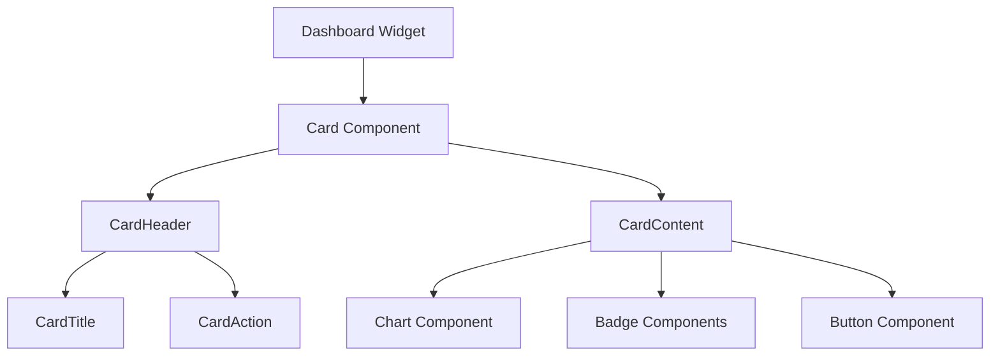
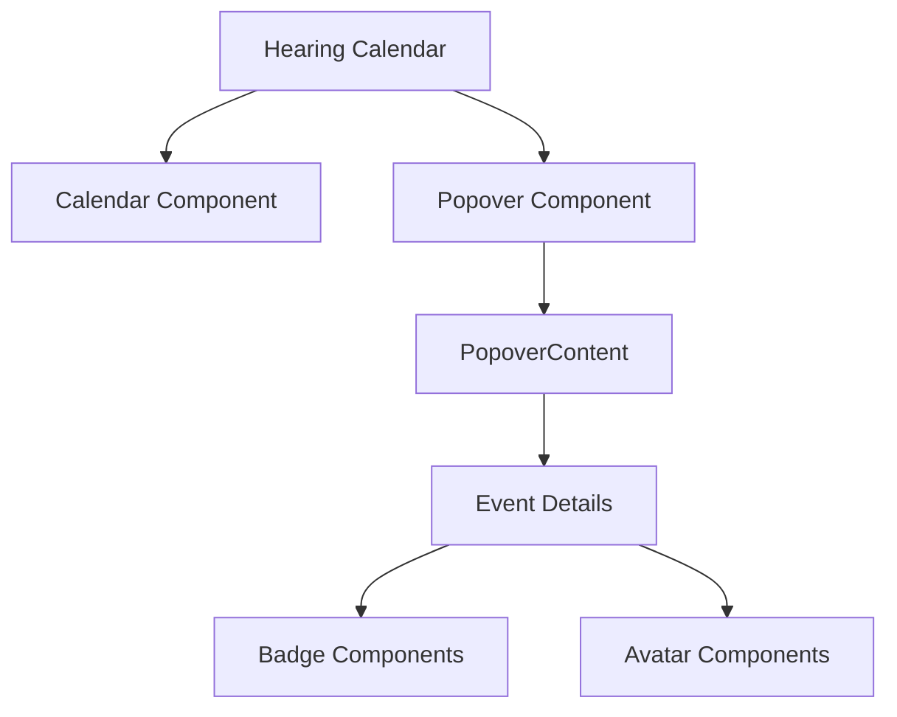
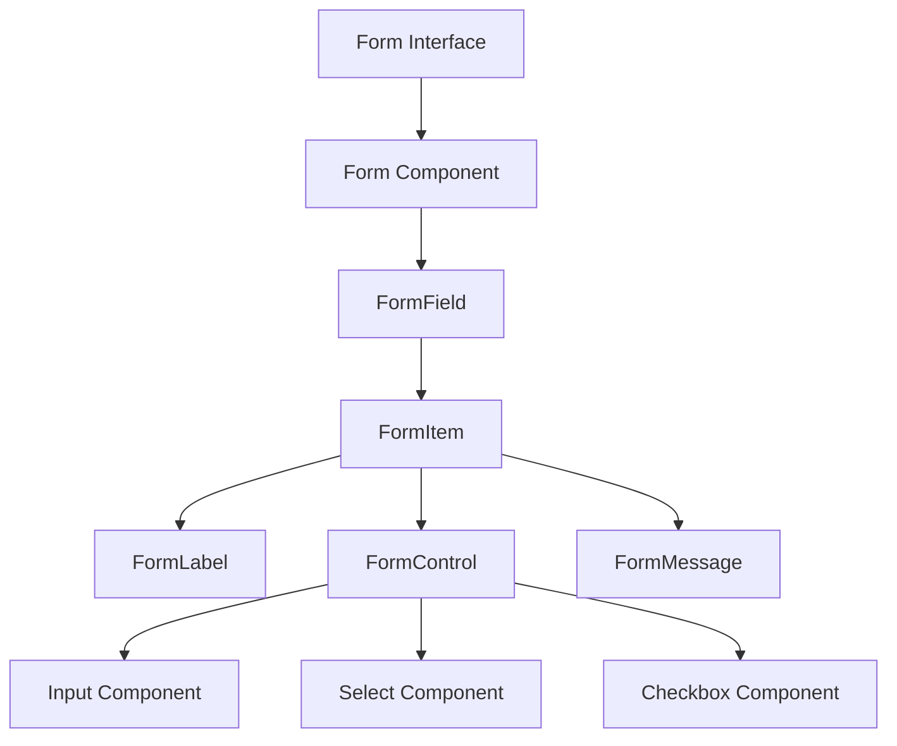
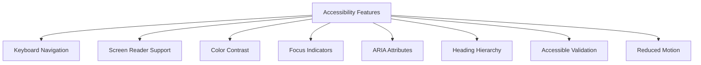
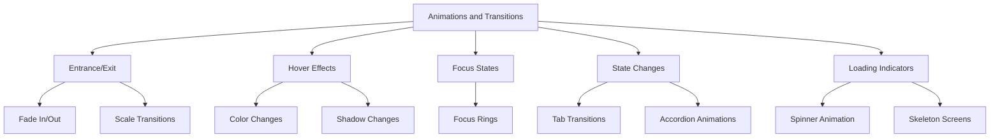
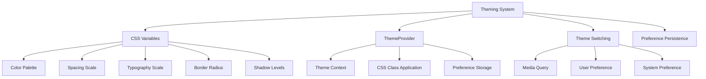
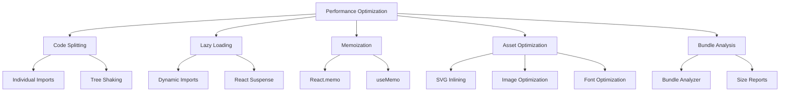
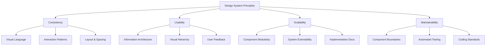

# UI Library (shadcn/ui)

<cite>
**Referenced Files in This Document**   
- [components/ui/accordion.tsx](file://components/ui/accordion.tsx)
- [components/ui/alert.tsx](file://components/ui/alert.tsx)
- [components/ui/avatar.tsx](file://components/ui/avatar.tsx)
- [components/ui/badge.tsx](file://components/ui/badge.tsx)
- [components/ui/button.tsx](file://components/ui/button.tsx)
- [components/ui/card.tsx](file://components/ui/card.tsx)
- [components/ui/checkbox.tsx](file://components/ui/checkbox.tsx)
- [components/ui/combobox.tsx](file://components/ui/combobox.tsx)
- [components/ui/dialog.tsx](file://components/ui/dialog.tsx)
- [components/ui/dropdown-menu.tsx](file://components/ui/dropdown-menu.tsx)
- [components/ui/form.tsx](file://components/ui/form.tsx)
- [components/ui/input.tsx](file://components/ui/input.tsx)
- [components/ui/popover.tsx](file://components/ui/popover.tsx)
- [components/ui/select.tsx](file://components/ui/select.tsx)
- [components/ui/table.tsx](file://components/ui/table.tsx)
- [components/ui/tabs.tsx](file://components/ui/tabs.tsx)
- [components/ui/textarea.tsx](file://components/ui/textarea.tsx)
- [components/ui/toast.tsx](file://components/ui/toast.tsx)
- [components/ui/typography.tsx](file://components/ui/typography.tsx)
- [app/globals.css](file://app/globals.css)
- [components/plate/plate-editor.tsx](file://components/plate/plate-editor.tsx)
- [lib/utils.ts](file://lib/utils.ts)
- [components/ui/theme-provider.tsx](file://components/ui/theme-provider.tsx)
</cite>

## Table of Contents
1. [Introduction](#introduction)
2. [Component Library Architecture](#component-library-architecture)
3. [Styling with Tailwind CSS](#styling-with-tailwind-css)
4. [Component Categories](#component-categories)
   - [Accordion](#accordion)
   - [Alert](#alert)
   - [Avatar](#avatar)
   - [Badge](#badge)
   - [Button](#button)
   - [Card](#card)
   - [Checkbox](#checkbox)
   - [Combobox](#combobox)
   - [Dialog](#dialog)
   - [Dropdown Menu](#dropdown-menu)
   - [Form](#form)
   - [Input](#input)
   - [Popover](#popover)
   - [Select](#select)
   - [Table](#table)
   - [Tabs](#tabs)
   - [Toast](#toast)
   - [Typography](#typography)
5. [Usage Examples](#usage-examples)
6. [Responsive Design and Accessibility](#responsive-design-and-accessibility)
7. [Animations and Transitions](#animations-and-transitions)
8. [Theming and Customization](#theming-and-customization)
9. [Cross-Browser Compatibility](#cross-browser-compatibility)
10. [Performance Optimization](#performance-optimization)
11. [Design System Principles](#design-system-principles)

## Introduction

The Sinesys UI library is built on the shadcn/ui component framework, providing a comprehensive set of accessible, reusable, and customizable UI components. This documentation details the architecture, implementation, and usage of the component library, focusing on its integration with Tailwind CSS for styling, accessibility compliance, and adherence to design system principles.

The library follows a modular architecture with components organized in the `components/ui` directory, each implementing consistent design patterns for visual appearance, behavior, and user interaction. Components are built using Radix UI primitives for accessibility and enhanced with Tailwind CSS for styling.

**Section sources**
- [components/ui/button.tsx](file://components/ui/button.tsx#L1-L61)
- [components/ui/card.tsx](file://components/ui/card.tsx#L1-L93)

## Component Library Architecture

The UI library follows a component-based architecture with a clear separation of concerns. Each component is implemented as a standalone module in the `components/ui` directory, following the shadcn/ui pattern of composition and customization.

The architecture leverages Radix UI primitives for accessible component foundations, enhanced with Tailwind CSS utility classes for styling. Components are designed to be composable, allowing developers to build complex interfaces by combining simple, well-defined building blocks.

The library uses a consistent pattern for component implementation:
- Base components that encapsulate core functionality
- Compound components that provide structured layouts (e.g., Card with Header, Title, Content)
- Context providers for shared state management within component groups
- Utility functions for common operations

This architecture enables consistent behavior across components while allowing for flexible customization through props and composition.

**Diagram sources**
- [components/ui/button.tsx](file://components/ui/button.tsx#L1-L61)
- [components/ui/card.tsx](file://components/ui/card.tsx#L1-L93)
- [components/ui/form.tsx](file://components/ui/form.tsx#L1-L217)

**Section sources**
- [components/ui/button.tsx](file://components/ui/button.tsx#L1-L61)
- [components/ui/card.tsx](file://components/ui/card.tsx#L1-L93)
- [components/ui/form.tsx](file://components/ui/form.tsx#L1-L217)

## Styling with Tailwind CSS

The UI library extensively uses Tailwind CSS for styling, following a utility-first approach that enables rapid UI development and consistent design. The styling system combines Tailwind's utility classes with CSS variables and component-specific styling patterns.

Components use the `cn` utility function from `lib/utils.ts` to conditionally apply classes, enabling dynamic styling based on component props and states. This function merges Tailwind classes with custom classes, handling class name conflicts and ensuring consistent styling application.

The styling approach includes:
- Base styles defined with Tailwind utility classes
- Variant styles managed through `class-variance-authority` (CVA)
- Responsive design using Tailwind's responsive prefixes
- Dark mode support through CSS classes and media queries
- Focus states and accessibility features

The global styles are defined in `app/globals.css`, which sets up the CSS variables used throughout the component library and configures Tailwind's theme settings.

**Diagram sources**
- [app/globals.css](file://app/globals.css)
- [lib/utils.ts](file://lib/utils.ts)
- [components/ui/button.tsx](file://components/ui/button.tsx#L7-L37)

**Section sources**
- [app/globals.css](file://app/globals.css)
- [lib/utils.ts](file://lib/utils.ts)
- [components/ui/button.tsx](file://components/ui/button.tsx#L7-L37)

## Component Categories

This section documents each component category in the Sinesys UI library, including their visual appearance, behavior, user interaction patterns, props/attributes, events, slots, and customization options.

### Accordion

The Accordion component provides a vertically stacked set of headers that can be clicked to reveal or hide content associated with them. It's commonly used for organizing content in a space-efficient way.

**Props/Attributes:**
- `type`: Determines the accordion behavior ("single" or "multiple")
- `defaultValue`: The initially expanded item value
- `value`: Controlled expanded item value
- `onValueChange`: Callback function when the expanded item changes
- `collapsible`: Whether an item can be collapsed

**Visual Appearance:**
- Clean, minimal design with subtle hover effects
- Chevron icon that rotates when expanded
- Smooth animation when expanding/collapsing
- Border separation between items

**Behavior:**
- Clicking a trigger expands or collapses the associated content
- Only one item can be expanded at a time (by default)
- Supports keyboard navigation (Enter, Space, Arrow keys)
- Announces state changes to screen readers

**Customization:**
- Can be customized through CSS variables for colors and spacing
- Supports custom icons for the trigger
- Can be styled with different variants through Tailwind classes

**Section sources**
- [components/ui/accordion.tsx](file://components/ui/accordion.tsx#L1-L67)

### Alert

The Alert component displays a prominent message to the user, typically for important information, warnings, or success states. It comes in different variants to convey different types of messages.

**Props/Attributes:**
- `variant`: The visual style of the alert ("default" or "destructive")
- `className`: Additional CSS classes for customization

**Visual Appearance:**
- Box with rounded corners and border
- Optional icon on the left side
- Title and description text with appropriate spacing
- Destructive variant uses red color scheme for errors

**Behavior:**
- Static display component (no interactive elements by default)
- Can contain interactive elements like buttons or links
- Responsive design that adapts to container width

**Slots:**
- `AlertTitle`: For the main heading of the alert
- `AlertDescription`: For the detailed message content

**Customization:**
- Supports all Tailwind utility classes for styling
- Can be extended with additional content
- Theme-aware (adapts to light/dark mode)

**Section sources**
- [components/ui/alert.tsx](file://components/ui/alert.tsx#L1-L67)

### Avatar

The Avatar component displays a user's profile image, initials, or a fallback icon when no image is available. It's commonly used in user interfaces to represent people.

**Props/Attributes:**
- `className`: Additional CSS classes for customization
- All standard HTML div attributes

**Visual Appearance:**
- Circular shape with overflow hidden
- Image fills the container while maintaining aspect ratio
- Fallback displays user initials or a default icon
- Consistent size across different contexts

**Behavior:**
- Displays image if provided and loads successfully
- Shows fallback content if image fails to load
- Supports lazy loading for performance
- Accessible with appropriate ARIA labels

**Slots:**
- `AvatarImage`: For the profile image
- `AvatarFallback`: For fallback content when image is unavailable

**Customization:**
- Size can be adjusted with Tailwind sizing classes
- Border and shadow can be customized
- Supports different shapes (circular, square with rounded corners)

**Section sources**
- [components/ui/avatar.tsx](file://components/ui/avatar.tsx#L1-L54)

### Badge

The Badge component is used to highlight specific information, such as status indicators, categories, or small amounts of metadata. It comes with multiple variants and tones for different use cases.

**Props/Attributes:**
- `variant`: Visual appearance ("solid", "soft", "outline")
- `tone`: Semantic meaning ("primary", "neutral", "info", "success", "warning", "danger", "muted")
- `className`: Additional CSS classes for customization

**Visual Appearance:**
- Small, pill-shaped container with text
- Different color schemes based on tone
- Subtle shadow for solid variants
- Outline variants have border without background

**Behavior:**
- Static display component
- Can contain icons alongside text
- Responsive text sizing
- Accessible contrast ratios

**Customization:**
- Extensive tone and variant combinations
- Supports icon integration
- Can be disabled with appropriate styling
- Theme-aware colors

**Section sources**
- [components/ui/badge.tsx](file://components/ui/badge.tsx#L1-L123)

### Button

The Button component is a versatile interactive element used for actions throughout the application. It supports multiple variants, sizes, and states.

**Props/Attributes:**
- `variant`: Visual style ("default", "destructive", "outline", "secondary", "ghost", "link")
- `size`: Dimensions ("default", "sm", "lg", "icon", "icon-sm", "icon-lg")
- `asChild`: When true, renders as a Slot component for composing with other components
- `className`: Additional CSS classes for customization
- All standard HTML button attributes

**Visual Appearance:**
- Consistent rounded corners across variants
- Appropriate color schemes for different variants
- Icon support with proper spacing
- Loading state with spinner
- Disabled state with reduced opacity

**Behavior:**
- Clickable with appropriate cursor
- Keyboard accessible (Tab, Enter, Space)
- Hover and focus states with visual feedback
- Loading state prevents multiple submissions
- Disabled state prevents interaction

**Customization:**
- Fully customizable through Tailwind classes
- Supports icon-only buttons
- Can be composed with other components using asChild
- Responsive sizing options

**Section sources**
- [components/ui/button.tsx](file://components/ui/button.tsx#L7-L37)

### Card

The Card component provides a container for related information, typically with a header, title, description, content, and optional action. It's used to group related content in a visually distinct way.

**Props/Attributes:**
- `className`: Additional CSS classes for customization
- All standard HTML div attributes

**Visual Appearance:**
- Elevated container with shadow
- Rounded corners
- Consistent padding and spacing
- Header with title and optional action
- Footer for additional controls

**Behavior:**
- Static container with no inherent interactivity
- Can contain interactive elements
- Responsive design that adapts to container width
- Accessible structure with appropriate semantic elements

**Slots:**
- `Card`: Main container
- `CardHeader`: Container for title and action
- `CardTitle`: Main heading
- `CardDescription`: Supporting text
- `CardAction`: Optional action element (typically a button)
- `CardContent`: Main content area
- `CardFooter`: Footer for additional controls

**Customization:**
- Can be styled with different variants through Tailwind classes
- Supports custom actions and layouts
- Theme-aware (adapts to light/dark mode)
- Responsive design

**Section sources**
- [components/ui/card.tsx](file://components/ui/card.tsx#L1-L93)

### Checkbox

The Checkbox component is a form control that allows users to select one or more items from a set of options.

**Props/Attributes:**
- `className`: Additional CSS classes for customization
- All standard HTML input attributes
- Inherits properties from Radix UI Checkbox.Root

**Visual Appearance:**
- Square with rounded corners
- Check icon when selected
- Visual feedback for hover, focus, and checked states
- Consistent size (1rem)

**Behavior:**
- Click to toggle checked state
- Keyboard accessible (Space to toggle)
- Visual feedback for all states
- Disabled state prevents interaction
- Error state with visual indication

**Customization:**
- Can be styled with different colors through CSS variables
- Supports custom check icons
- Can be disabled with appropriate styling
- Theme-aware appearance

**Section sources**
- [components/ui/checkbox.tsx](file://components/ui/checkbox.tsx#L1-L33)

### Combobox

The Combobox component combines a text input with a dropdown list, allowing users to either type a value or select from a list of options. It supports both single and multiple selection modes.

**Props/Attributes:**
- `options`: Array of option objects with value and label
- `value`: Current selected value(s)
- `onValueChange`: Callback when selection changes
- `placeholder`: Placeholder text for the input
- `searchPlaceholder`: Placeholder for search input
- `emptyText`: Message when no options match search
- `multiple`: Whether multiple selections are allowed
- `disabled`: Whether the component is disabled
- `selectAllText`: Text for select all button
- `clearAllText`: Text for clear all button
- `className`: Additional CSS classes

**Visual Appearance:**
- Input field with dropdown indicator
- Selected values displayed as badges (in multiple mode)
- Dropdown with search functionality
- Visual feedback for selection states
- Empty state with search icon

**Behavior:**
- Click to open dropdown
- Type to search options
- Select to choose option(s)
- Backspace to remove last selection (multiple mode)
- Keyboard navigation (Arrow keys, Enter, Escape)
- Search filters options in real-time
- Select all/clear all functionality (multiple mode)

**Customization:**
- Supports custom option rendering
- Configurable text for buttons and placeholders
- Can be styled with Tailwind classes
- Theme-aware appearance

**Section sources**
- [components/ui/combobox.tsx](file://components/ui/combobox.tsx#L1-L278)

### Dialog

The Dialog component creates a modal window that appears on top of the main content, typically used for forms, confirmations, or detailed information.

**Props/Attributes:**
- Inherits properties from Radix UI Dialog.Root
- `showCloseButton`: Whether to show the close button (default: true)

**Visual Appearance:**
- Centered modal with rounded corners
- Overlay backdrop with semi-transparent black
- Close button with X icon
- Header, content, and footer sections
- Smooth entrance and exit animations

**Behavior:**
- Opens and closes with animation
- Click outside or Escape key closes the dialog
- Focus trapping within the dialog
- Screen reader announcements
- Scroll locking on body when open

**Slots:**
- `Dialog`: Main container
- `DialogTrigger`: Element that opens the dialog
- `DialogContent`: The modal window
- `DialogHeader`: Container for title and close button
- `DialogTitle`: Main heading
- `DialogDescription`: Supporting text
- `DialogFooter`: Container for action buttons
- `DialogClose`: Element that closes the dialog

**Customization:**
- Size can be controlled through className
- Can be styled with different variants
- Supports custom close button
- Theme-aware appearance

**Section sources**
- [components/ui/dialog.tsx](file://components/ui/dialog.tsx#L1-L144)

### Dropdown Menu

The Dropdown Menu component displays a list of actions or options when triggered, typically by clicking a button or icon.

**Props/Attributes:**
- Inherits properties from Radix UI DropdownMenu.Root
- All standard Radix UI DropdownMenu components

**Visual Appearance:**
- Trigger element (typically a button with chevron icon)
- Dropdown list with rounded corners
- Hover effect on items
- Check icon for selected items
- Separators between groups

**Behavior:**
- Click trigger to open/close menu
- Click items to select/activate
- Escape key closes menu
- Click outside closes menu
- Keyboard navigation (Arrow keys, Enter, Escape)
- Focus management

**Slots:**
- `DropdownMenu`: Main container
- `DropdownMenuTrigger`: Element that opens the menu
- `DropdownMenuContent`: The dropdown list
- `DropdownMenuItem`: Individual menu item
- `DropdownMenuCheckboxItem`: Item with checkbox
- `DropdownMenuRadioItem`: Item with radio button
- `DropdownMenuLabel`: Group label
- `DropdownMenuSeparator`: Visual separator
- `DropdownMenuShortcut`: Keyboard shortcut text
- `DropdownMenuGroup`: Group of items
- `DropdownMenuPortal`: Portals the menu to the end of the DOM

**Customization:**
- Can be styled with Tailwind classes
- Supports icons in items
- Can have submenus
- Theme-aware appearance

**Section sources**
- [components/ui/dropdown-menu.tsx](file://components/ui/dropdown-menu.tsx)

### Form

The Form component provides a comprehensive solution for building accessible forms with validation, leveraging react-hook-form for state management.

**Props/Attributes:**
- `Form`: Wrapper component that provides form context
- `FormField`: Wrapper for individual form fields
- `FormItem`: Container for a form field
- `FormLabel`: Label for a form field
- `FormControl`: The actual input element
- `FormDescription`: Helper text for a field
- `FormMessage`: Error message display

**Visual Appearance:**
- Consistent spacing between fields
- Labels above inputs
- Error states with visual feedback
- Tooltip-based error messages
- Loading states for submissions

**Behavior:**
- Client-side validation with immediate feedback
- Error messages displayed in tooltips
- Focus management
- Accessibility features (ARIA attributes)
- Integration with react-hook-form

**Customization:**
- Supports all input types
- Custom validation rules
- Can be styled with Tailwind classes
- Theme-aware appearance
- Configurable error display

**Section sources**
- [components/ui/form.tsx](file://components/ui/form.tsx#L1-L217)

### Input

The Input component is a styled text input field that provides consistent appearance and behavior across the application.

**Props/Attributes:**
- `type`: Input type (text, email, password, etc.)
- `className`: Additional CSS classes
- All standard HTML input attributes

**Visual Appearance:**
- Clean, minimal design
- Consistent height and padding
- Focus ring with appropriate color
- Placeholder text styling
- Error state with visual indication

**Behavior:**
- Standard input behavior
- Focus states with visual feedback
- Disabled state
- Error state with tooltip
- File input styling

**Customization:**
- Can be styled with Tailwind classes
- Supports icon integration
- Different sizes available
- Theme-aware appearance

**Section sources**
- [components/ui/input.tsx](file://components/ui/input.tsx#L1-L22)

### Popover

The Popover component displays content in a floating element that appears on top of other content when triggered.

**Props/Attributes:**
- Inherits properties from Radix UI Popover.Root
- `align`: Alignment of the popover relative to the trigger ("start", "center", "end")
- `sideOffset`: Distance from the trigger element

**Visual Appearance:**
- Floating container with rounded corners
- Subtle shadow
- Arrow pointing to the trigger
- Smooth entrance and exit animations

**Behavior:**
- Click trigger to open/close
- Click outside closes popover
- Escape key closes popover
- Focus trapping
- Positioning based on available space

**Slots:**
- `Popover`: Main container
- `PopoverTrigger`: Element that opens the popover
- `PopoverContent`: The floating content
- `PopoverAnchor`: Optional anchor point for positioning

**Customization:**
- Can be positioned in different directions
- Size can be controlled through className
- Can be styled with Tailwind classes
- Theme-aware appearance

**Section sources**
- [components/ui/popover.tsx](file://components/ui/popover.tsx#L1-L49)

### Select

The Select component is a custom dropdown that allows users to choose one option from a list.

**Props/Attributes:**
- Inherits properties from Radix UI Select.Root
- `size`: Size of the trigger ("sm", "default")

**Visual Appearance:**
- Trigger with label and chevron icon
- Dropdown with scrollable content
- Selected item indication
- Hover effects on items
- Up/down scroll buttons for long lists

**Behavior:**
- Click trigger to open/close
- Click items to select
- Keyboard navigation (Arrow keys, Enter, Escape)
- Type to search (first letter navigation)
- Scroll support for long lists
- Disabled state

**Slots:**
- `Select`: Main container
- `SelectValue`: Display of the selected value
- `SelectTrigger`: The button that opens the dropdown
- `SelectContent`: The dropdown list
- `SelectGroup`: Group of related items
- `SelectLabel`: Label for a group
- `SelectItem`: Individual option
- `SelectSeparator`: Visual separator
- `SelectScrollUpButton`: Button to scroll up
- `SelectScrollDownButton`: Button to scroll down

**Customization:**
- Can be styled with Tailwind classes
- Supports icons in items
- Different sizes available
- Theme-aware appearance

**Section sources**
- [components/ui/select.tsx](file://components/ui/select.tsx#L1-L188)

### Table

The Table component displays data in a tabular format with support for sorting, pagination, and filtering.

**Props/Attributes:**
- Inherits properties from standard HTML table elements
- Composed of multiple sub-components

**Visual Appearance:**
- Clean, minimal design
- Alternating row colors on hover
- Sticky headers
- Responsive design
- Selection states

**Behavior:**
- Standard table navigation
- Sortable columns
- Row selection
- Keyboard navigation
- Responsive layout

**Slots:**
- `Table`: Main container
- `TableHeader`: Container for header row
- `TableBody`: Container for data rows
- `TableFooter`: Container for footer row
- `TableHead`: Header cell
- `TableRow`: Row container
- `TableCell`: Data cell
- `TableCaption`: Table caption

**Customization:**
- Can be styled with Tailwind classes
- Supports custom cell rendering
- Different variants available
- Theme-aware appearance

**Section sources**
- [components/ui/table.tsx](file://components/ui/table.tsx#L1-L96)

### Tabs

The Tabs component allows users to switch between different views or panels of content.

**Props/Attributes:**
- Inherits properties from Radix UI Tabs.Root
- `activationMode`: When tabs are activated ("automatic", "manual")

**Visual Appearance:**
- Horizontal tab list with rounded container
- Active tab indication
- Smooth transition between tabs
- Consistent spacing

**Behavior:**
- Click tab to switch content
- Keyboard navigation (Arrow keys, Enter)
- Focus management
- Content persistence
- Disabled tabs

**Slots:**
- `Tabs`: Main container
- `TabsList`: Container for tab triggers
- `TabsTrigger`: Individual tab button
- `TabsContent`: Container for tab content

**Customization:**
- Can be styled with Tailwind classes
- Vertical orientation possible
- Different activation modes
- Theme-aware appearance

**Section sources**
- [components/ui/tabs.tsx](file://components/ui/tabs.tsx#L1-L67)

### Toast

The Toast component displays brief, temporary messages to the user, typically for notifications or status updates.

**Props/Attributes:**
- `open`: Whether the toast is visible
- `onOpenChange`: Callback when visibility changes
- `type`: Visual style ("default", "success", "error", "warning")
- `title`: Main heading
- `description`: Detailed message
- `duration`: How long the toast remains visible
- `onDismiss`: Callback when toast is dismissed

**Visual Appearance:**
- Small, rectangular notification
- Position fixed at bottom right
- Slide-in/slide-out animation
- Close button
- Visual indication based on type

**Behavior:**
- Automatically dismisses after duration
- Can be manually dismissed
- Pause on hover
- Stacking for multiple toasts
- Screen reader announcements

**Customization:**
- Can be styled with Tailwind classes
- Custom durations
- Different types with appropriate colors
- Theme-aware appearance

**Section sources**
- [components/ui/toast.tsx](file://components/ui/toast.tsx)

### Typography

The Typography component provides consistent text styling across the application, ensuring visual hierarchy and readability.

**Props/Attributes:**
- Various components for different text roles (h1, h2, h3, p, small, etc.)
- `className`: Additional CSS classes

**Visual Appearance:**
- Consistent font family and sizing
- Appropriate line height and letter spacing
- Visual hierarchy through size and weight
- Responsive text sizing

**Behavior:**
- Semantic HTML elements
- Accessibility features
- Responsive design
- Theme-aware colors

**Slots:**
- `h1`, `h2`, `h3`, `h4`, `h5`, `h6`: Headings
- `p`: Paragraph text
- `small`: Small text
- `lead`: Lead paragraph
- `large`: Large text
- `muted`: Muted text

**Customization:**
- Can be styled with Tailwind classes
- Supports custom variants
- Theme-aware appearance
- Responsive typography

**Section sources**
- [components/ui/typography.tsx](file://components/ui/typography.tsx)

## Usage Examples

The UI components are used throughout the Sinesys application in various contexts, including dashboard widgets, hearing calendars, and form interfaces.

### Dashboard Widgets

Dashboard widgets use the Card component as a container, with Header for the title and Action for controls. Content typically includes data visualizations using the Chart component, with Badges for status indicators and Buttons for actions.

**Section sources**
- [components/ui/card.tsx](file://components/ui/card.tsx#L1-L93)
- [components/ui/button.tsx](file://components/ui/button.tsx#L1-L61)
- [components/ui/badge.tsx](file://components/ui/badge.tsx#L1-L123)

### Hearing Calendar

The hearing calendar uses the Calendar component for date selection, with Popover components for detailed event information. Events are displayed using custom rendering with Badges for status and Avatars for participants.

**Section sources**
- [components/ui/calendar.tsx](file://components/ui/calendar.tsx)
- [components/ui/popover.tsx](file://components/ui/popover.tsx#L1-L49)
- [components/ui/badge.tsx](file://components/ui/badge.tsx#L1-L123)
- [components/ui/avatar.tsx](file://components/ui/avatar.tsx#L1-L54)

### Form Interfaces

Form interfaces use the Form component with FormField, FormItem, FormLabel, FormControl, and FormMessage for structured form layouts. Inputs use the Input, Select, and Checkbox components with appropriate validation.

**Section sources**
- [components/ui/form.tsx](file://components/ui/form.tsx#L1-L217)
- [components/ui/input.tsx](file://components/ui/input.tsx#L1-L22)
- [components/ui/select.tsx](file://components/ui/select.tsx#L1-L188)
- [components/ui/checkbox.tsx](file://components/ui/checkbox.tsx#L1-L33)

## Responsive Design and Accessibility

The UI library follows responsive design principles and accessibility standards to ensure usability across devices and for all users.

### Responsive Design

Components are designed to be responsive by default, adapting to different screen sizes and orientations. The library uses Tailwind CSS's responsive prefixes to apply different styles at different breakpoints.

Key responsive features:
- Fluid layouts that adapt to container width
- Mobile-first design approach
- Touch-friendly tap targets (minimum 44px)
- Responsive typography with appropriate scaling
- Stackable layouts for narrow screens
- Hidden elements on small screens when appropriate

### Accessibility

The library follows WCAG 2.1 guidelines to ensure accessibility for users with disabilities. Components are built with accessibility in mind, using semantic HTML and ARIA attributes.

Key accessibility features:
- Keyboard navigation support
- Screen reader compatibility
- Sufficient color contrast
- Focus indicators
- ARIA labels and roles
- Proper heading hierarchy
- Form validation with accessible error messages
- Reduced motion preferences respected

**Diagram sources**
- [components/ui/button.tsx](file://components/ui/button.tsx#L1-L61)
- [components/ui/form.tsx](file://components/ui/form.tsx#L1-L217)
- [components/ui/dialog.tsx](file://components/ui/dialog.tsx#L1-L144)

**Section sources**
- [components/ui/button.tsx](file://components/ui/button.tsx#L1-L61)
- [components/ui/form.tsx](file://components/ui/form.tsx#L1-L217)
- [components/ui/dialog.tsx](file://components/ui/dialog.tsx#L1-L144)

## Animations and Transitions

The UI library uses animations and transitions to enhance user experience and provide visual feedback. Animations are implemented using CSS transitions and animations, with consideration for performance and user preferences.

### Animation Principles

- Purposeful: Animations serve a functional purpose, not just decorative
- Subtle: Animations are smooth and unobtrusive
- Fast: Animations complete quickly (typically 200-300ms)
- Consistent: Similar interactions have similar animations
- Respectful: Respects user preferences (prefers-reduced-motion)

### Transition Types

- **Entrance/Exit**: Components fade in/out with slight scale changes
- **Hover**: Subtle color and shadow changes on hover
- **Focus**: Visual indication of keyboard focus
- **State Changes**: Smooth transitions between component states
- **Loading**: Animated indicators for loading states

### Implementation

Animations are defined in CSS using Tailwind's animation utilities and custom keyframes. The library uses data attributes to control animation states, ensuring animations only play when appropriate.

**Diagram sources**
- [components/ui/dialog.tsx](file://components/ui/dialog.tsx#L38-L41)
- [components/ui/accordion.tsx](file://components/ui/accordion.tsx#L58-L59)
- [components/ui/button.tsx](file://components/ui/button.tsx#L8-L9)

**Section sources**
- [components/ui/dialog.tsx](file://components/ui/dialog.tsx#L38-L41)
- [components/ui/accordion.tsx](file://components/ui/accordion.tsx#L58-L59)
- [components/ui/button.tsx](file://components/ui/button.tsx#L8-L9)

## Theming and Customization

The UI library supports theming and customization through CSS variables, allowing for easy adaptation to different brand identities and user preferences.

### Theme Structure

Themes are defined using CSS variables in `app/globals.css`, following a systematic naming convention. The library supports both light and dark themes, with automatic switching based on user preference.

Key theme variables:
- Color palette (primary, secondary, destructive, etc.)
- Spacing scale
- Typography scale
- Border radius
- Shadow levels
- Z-index scale

### Customization Options

Components can be customized through several mechanisms:
- **CSS Variables**: Override theme variables for global changes
- **Tailwind Classes**: Apply utility classes for local changes
- **Component Props**: Use component-specific props for common variations
- **Composition**: Combine components to create new patterns

### Theme Provider

The ThemeProvider component wraps the application and manages theme state, persisting user preferences and applying the appropriate CSS classes.

**Diagram sources**
- [app/globals.css](file://app/globals.css)
- [components/ui/theme-provider.tsx](file://components/ui/theme-provider.tsx)

**Section sources**
- [app/globals.css](file://app/globals.css)
- [components/ui/theme-provider.tsx](file://components/ui/theme-provider.tsx)

## Cross-Browser Compatibility

The UI library is designed to work consistently across modern browsers, with consideration for older browser support where necessary.

### Supported Browsers

- Latest versions of Chrome, Firefox, Safari, and Edge
- Mobile browsers (iOS Safari, Chrome for Android)
- Internet Explorer 11 (limited support for critical functionality)

### Compatibility Strategies

- Progressive enhancement: Core functionality works without JavaScript
- Feature detection: Use modern features when available, fallbacks when not
- Vendor prefixes: Applied where necessary for CSS properties
- Polyfills: Used for critical JavaScript features
- Testing: Regular testing across target browsers

### Known Limitations

- Some animations may be simplified in older browsers
- Certain CSS features (like CSS Grid) have fallbacks
- File input styling varies by browser
- Date input components use native pickers

**Section sources**
- [app/globals.css](file://app/globals.css)
- [components/ui/button.tsx](file://components/ui/button.tsx#L1-L61)

## Performance Optimization

The UI library implements several performance optimization techniques to ensure fast rendering and smooth interactions.

### Code Splitting

Components are designed to be imported individually, allowing for code splitting and tree shaking. This reduces bundle size by only including used components.

### Lazy Loading

Heavy components (like rich text editors) are lazy-loaded to improve initial page load performance.

### Memoization

Components use React.memo and useMemo to prevent unnecessary re-renders, especially for complex components with expensive calculations.

### Asset Optimization

- SVG icons are inlined to reduce HTTP requests
- Images are optimized and lazy-loaded
- Fonts are subsetted and loaded efficiently

### Bundle Analysis

Regular bundle analysis is performed to identify and eliminate unnecessary dependencies.

**Diagram sources**
- [components/plate/plate-editor.tsx](file://components/plate/plate-editor.tsx)
- [components/ui/button.tsx](file://components/ui/button.tsx#L1-L61)

**Section sources**
- [components/plate/plate-editor.tsx](file://components/plate/plate-editor.tsx)
- [components/ui/button.tsx](file://components/ui/button.tsx#L1-L61)

## Design System Principles

The UI library follows the design system principles outlined in the help section, ensuring consistency and usability across the Sinesys application.

### Consistency

Components maintain consistent visual language, behavior, and interaction patterns throughout the application. This includes:
- Consistent color palette and typography
- Uniform spacing and layout
- Predictable component behavior
- Standardized iconography

### Usability

The design prioritizes user needs with:
- Intuitive navigation and information architecture
- Clear visual hierarchy
- Accessible interactions
- Helpful feedback and error states

### Scalability

The component library is designed to scale with the application:
- Modular components that can be combined
- Extensible design system
- Documentation for consistent implementation
- Versioning and backward compatibility

### Maintainability

The codebase is structured for long-term maintenance:
- Clear component boundaries
- Comprehensive documentation
- Automated testing
- Consistent coding standards

**Diagram sources**
- [components/ui/button.tsx](file://components/ui/button.tsx#L1-L61)
- [components/ui/card.tsx](file://components/ui/card.tsx#L1-L93)
- [components/ui/form.tsx](file://components/ui/form.tsx#L1-L217)

**Section sources**
- [components/ui/button.tsx](file://components/ui/button.tsx#L1-L61)
- [components/ui/card.tsx](file://components/ui/card.tsx#L1-L93)
- [components/ui/form.tsx](file://components/ui/form.tsx#L1-L217)