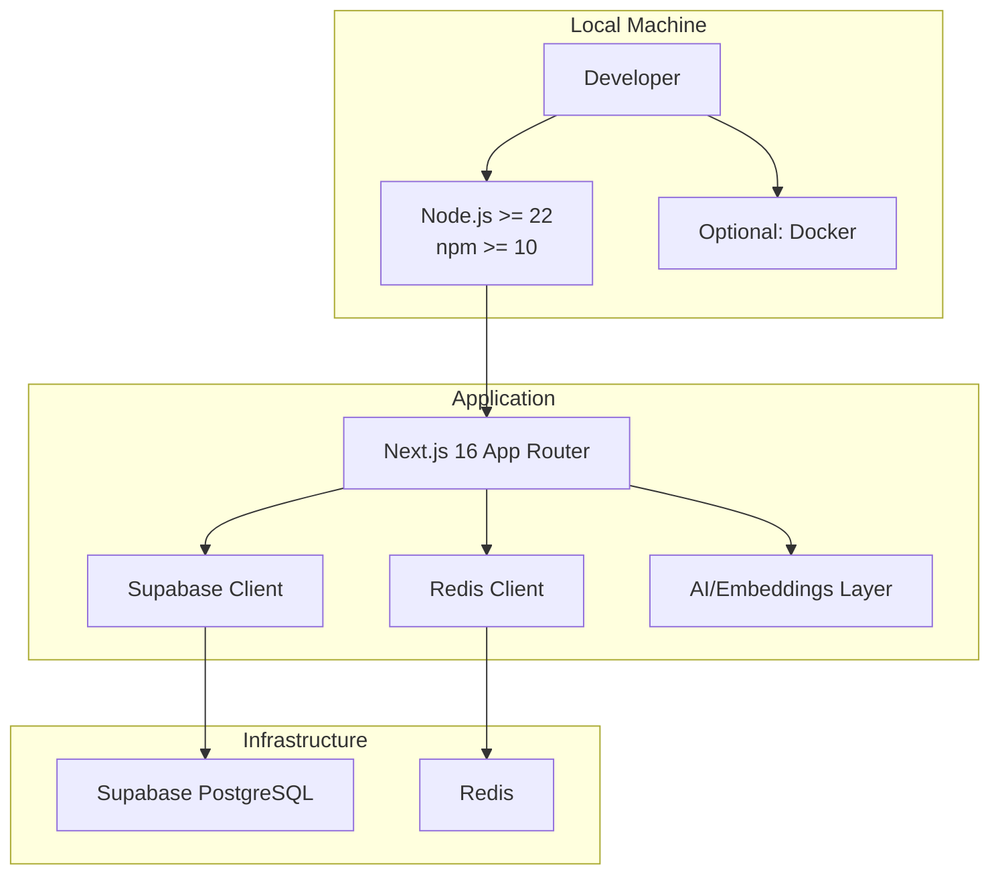
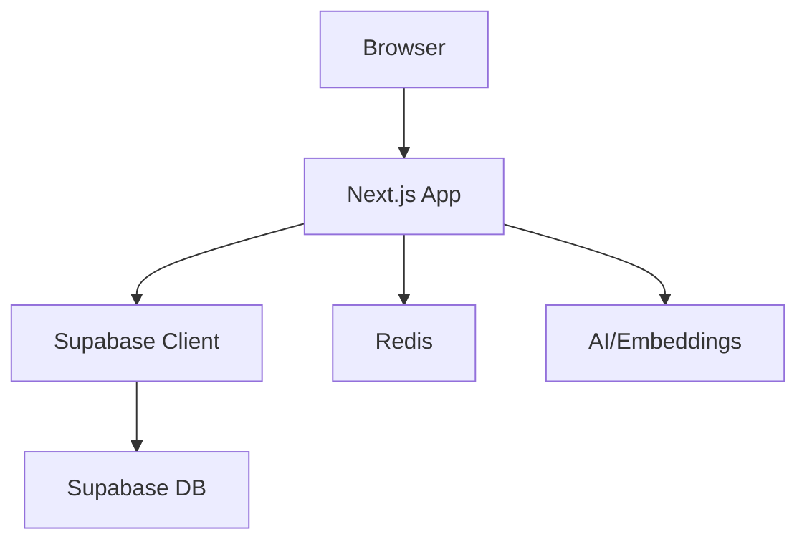
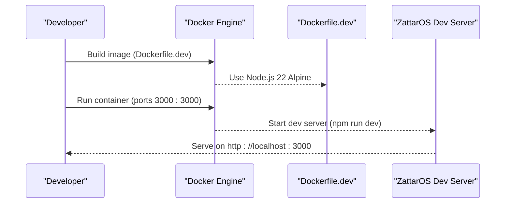
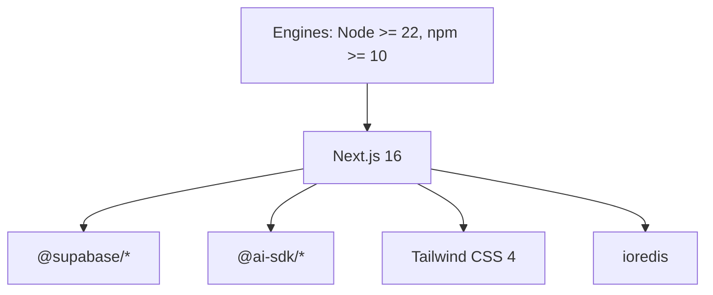

# Getting Started

<cite>
**Referenced Files in This Document**
- [package.json](file://package.json)
- [README.md](file://README.md)
- [Dockerfile.dev](file://Dockerfile.dev)
- [Dockerfile](file://Dockerfile)
- [docker-compose.yml](file://docker-compose.yml)
- [supabase/config.toml](file://supabase/config.toml)
- [src/lib/supabase/client.ts](file://src/lib/supabase/client.ts)
- [src/lib/ai/config.ts](file://src/lib/ai/config.ts)
- [src/lib/ai-editor/config.ts](file://src/lib/ai-editor/config.ts)
- [src/lib/redis/client.ts](file://src/lib/redis/client.ts)
- [scripts/cloudron-deploy-local.sh](file://scripts/cloudron-deploy-local.sh)
- [scripts/cloudron-deploy.sh](file://scripts/cloudron-deploy.sh)
- [scripts/docker/docker-build-with-env.sh](file://scripts/docker/docker-build-with-env.sh)
</cite>

## Table of Contents
1. [Introduction](#introduction)
2. [Project Structure](#project-structure)
3. [Core Components](#core-components)
4. [Architecture Overview](#architecture-overview)
5. [Detailed Component Analysis](#detailed-component-analysis)
6. [Dependency Analysis](#dependency-analysis)
7. [Performance Considerations](#performance-considerations)
8. [Troubleshooting Guide](#troubleshooting-guide)
9. [Conclusion](#conclusion)
10. [Appendices](#appendices)

## Introduction
This guide helps you set up the ZattarOS development environment from scratch. It covers prerequisites, installation, environment configuration, local development, and containerized deployment. You will learn how to prepare your machine, install dependencies, configure environment variables, start the development server, and verify that everything works as expected.

## Project Structure
ZattarOS is a Next.js 16 application with TypeScript, using Supabase for backend services (PostgreSQL, RLS, pgvector), Redis for caching, and Tailwind CSS 4 for the UI. The project follows a colocated Feature-Sliced Design approach inside src/app/(authenticated).

**Diagram sources**
- [package.json:135-324](file://package.json#L135-L324)
- [src/lib/supabase/client.ts:204-239](file://src/lib/supabase/client.ts#L204-L239)
- [src/lib/redis/client.ts:25-79](file://src/lib/redis/client.ts#L25-L79)

**Section sources**
- [README.md:10-14](file://README.md#L10-L14)
- [package.json:135-324](file://package.json#L135-L324)

## Core Components
- Node.js and npm: The project enforces Node.js >= 22.0.0 and npm >= 10.0.0.
- Next.js 16: The frontend framework and runtime.
- Supabase: Authentication, database, and real-time features.
- Redis: Optional caching layer.
- AI/Embeddings: Optional OpenAI or other provider integrations.

Key environment variables (required and optional) are documented in the project’s README and enforced by the application at runtime.

**Section sources**
- [README.md:10-14](file://README.md#L10-L14)
- [README.md:35-42](file://README.md#L35-L42)
- [src/lib/supabase/client.ts:209-214](file://src/lib/supabase/client.ts#L209-L214)

## Architecture Overview
The application architecture integrates:
- Frontend (Next.js App Router) consuming Supabase for auth and data.
- Optional Redis for caching.
- Optional AI/Embeddings pipeline using configured providers.

**Diagram sources**
- [src/lib/supabase/client.ts:204-239](file://src/lib/supabase/client.ts#L204-L239)
- [src/lib/redis/client.ts:25-79](file://src/lib/redis/client.ts#L25-L79)
- [src/lib/ai/config.ts:73-102](file://src/lib/ai/config.ts#L73-L102)

## Detailed Component Analysis

### Prerequisites and Installation
- Prerequisites:
  - Node.js >= 22.0.0
  - npm >= 10
  - Optional: Docker for containerized development
- Install dependencies:
  - Run the standard install script defined in the project.
- Start development server:
  - Use the dev script to launch the Next.js development server with Turbopack.

Verification:
- Access the application at http://localhost:3000.

**Section sources**
- [README.md:10-14](file://README.md#L10-L14)
- [README.md:16-34](file://README.md#L16-L34)
- [package.json:9-17](file://package.json#L9-L17)

### Environment Variables (.env.local)
- Copy the example file to .env.local and fill in the required variables.
- Required variables include Supabase credentials and system API keys.
- Optional variables include AI provider keys, Redis configuration, and storage settings.

Structure and required variables:
- Supabase: NEXT_PUBLIC_SUPABASE_URL, NEXT_PUBLIC_SUPABASE_PUBLISHABLE_OR_ANON_KEY, SUPABASE_SECRET_KEY
- System: SERVICE_API_KEY, CRON_SECRET
- AI: OPENAI_API_KEY, AI_GATEWAY_API_KEY, OPENAI_EMBEDDING_MODEL, AI_EMBEDDING_PROVIDER
- Infrastructure: ENABLE_REDIS_CACHE, REDIS_URL, REDIS_PASSWORD, REDIS_CACHE_TTL

Runtime enforcement:
- The Supabase client throws if required environment variables are missing.

**Section sources**
- [README.md:23-26](file://README.md#L23-L26)
- [README.md:35-42](file://README.md#L35-L42)
- [src/lib/supabase/client.ts:209-214](file://src/lib/supabase/client.ts#L209-L214)

### AI and Embeddings Configuration
- Provider selection and API keys:
  - OPENAI_API_KEY for OpenAI.
  - AI_GATEWAY_API_KEY for the AI Gateway.
  - AI_EMBEDDING_PROVIDER selects the provider (e.g., openai).
- Embedding cache:
  - AI_EMBEDDING_CACHE_ENABLED toggles embedding cache.
  - AI_EMBEDDING_CACHE_TTL sets cache TTL in seconds.

Validation:
- isAIConfigured checks whether the selected provider has a valid API key configured.

**Section sources**
- [src/lib/ai/config.ts:58-102](file://src/lib/ai/config.ts#L58-L102)
- [src/lib/ai-editor/config.ts:33-77](file://src/lib/ai-editor/config.ts#L33-L77)

### Redis Cache Configuration
- Enable Redis with ENABLE_REDIS_CACHE=true and provide REDIS_URL.
- Optional REDIS_PASSWORD and REDIS_CACHE_TTL.
- The client handles connection errors gracefully and reconnects with a backoff strategy.

**Section sources**
- [src/lib/redis/client.ts:25-79](file://src/lib/redis/client.ts#L25-L79)

### Supabase Local Development
- Supabase configuration is managed via supabase/config.toml.
- The project supports local Supabase services (database, studio, realtime, storage).
- The Supabase client enforces presence of required environment variables at runtime.

**Section sources**
- [supabase/config.toml:1-385](file://supabase/config.toml#L1-L385)
- [src/lib/supabase/client.ts:204-239](file://src/lib/supabase/client.ts#L204-L239)

### Containerized Development (Docker)
- Development container:
  - Dockerfile.dev builds a Node.js 22 Alpine image, installs dependencies, and starts the dev server.
  - Exposes port 3000 and sets WATCHPACK_POLLING and PLAYWRIGHT_SKIP_BROWSER_DOWNLOAD for development ergonomics.
- Production/containerized runtime:
  - Dockerfile builds the Next.js static output and runs via a Cloudron-compatible base image.
  - Uses ARG for Node.js version pinning and copies built artifacts into a minimal runtime.
- Docker Compose:
  - docker-compose.yml defines a service for ZattarOS with environment variables mapped from your .env.local.
  - Includes optional Redis, storage, AI, and browser service settings.

**Diagram sources**
- [Dockerfile.dev:1-28](file://Dockerfile.dev#L1-L28)
- [docker-compose.yml:8-30](file://docker-compose.yml#L8-L30)

**Section sources**
- [Dockerfile.dev:1-28](file://Dockerfile.dev#L1-L28)
- [Dockerfile:12-96](file://Dockerfile#L12-L96)
- [docker-compose.yml:1-87](file://docker-compose.yml#L1-L87)

### Cloudron Deployment Scripts
- Local deployment helper:
  - scripts/cloudron-deploy-local.sh parses .env.local and generates a build-time environment file containing NEXT_PUBLIC_* variables.
- Remote deployment helper:
  - scripts/cloudron-deploy.sh validates prerequisites, parses .env.local, and loads runtime variables excluding addons and build-only entries.

These scripts ensure that only the appropriate variables are passed to the build and runtime environments.

**Section sources**
- [scripts/cloudron-deploy-local.sh:155-196](file://scripts/cloudron-deploy-local.sh#L155-L196)
- [scripts/cloudron-deploy.sh:166-381](file://scripts/cloudron-deploy.sh#L166-L381)

### Docker Build with Environment Validation
- scripts/docker/docker-build-with-env.sh validates required variables before building images and passes them as build arguments.

**Section sources**
- [scripts/docker/docker-build-with-env.sh:49-83](file://scripts/docker/docker-build-with-env.sh#L49-L83)

## Dependency Analysis
- Node.js and npm versions are enforced in package.json engines.
- Application dependencies include Next.js, Supabase client libraries, AI SDKs, Tailwind, and others.
- Docker images rely on pinned Node.js versions for reproducibility.

**Diagram sources**
- [package.json:5-8](file://package.json#L5-L8)
- [package.json:135-324](file://package.json#L135-L324)

**Section sources**
- [package.json:5-8](file://package.json#L5-L8)
- [package.json:135-324](file://package.json#L135-L324)

## Performance Considerations
- Memory tuning:
  - The project sets Node.js max-old-space-size in several scripts to accommodate larger builds.
- Build performance:
  - Use Turbopack for faster dev rebuilds.
  - CI builds leverage NEXT_TELEMETRY_DISABLED and SKIP_TYPE_CHECK to reduce overhead.
- Redis:
  - Graceful degradation when Redis is unavailable; backoff retry strategy prevents repeated failures.

**Section sources**
- [package.json:12-25](file://package.json#L12-L25)
- [package.json:18, 34, 51:18-18](file://package.json#L18-L18)
- [src/lib/redis/client.ts:45-54](file://src/lib/redis/client.ts#L45-L54)

## Troubleshooting Guide
Common setup issues and resolutions:

- Missing Node.js or npm versions
  - Ensure Node.js >= 22.0.0 and npm >= 10 are installed.
  - Verify with your package manager or nvm.

- Supabase environment variables missing
  - The Supabase client throws if NEXT_PUBLIC_SUPABASE_URL or NEXT_PUBLIC_SUPABASE_PUBLISHABLE_OR_ANON_KEY are not set.
  - Confirm .env.local contains the required Supabase variables.

- AI provider configuration
  - If using OpenAI, set OPENAI_API_KEY.
  - If using AI Gateway, set AI_GATEWAY_API_KEY.
  - Ensure AI_EMBEDDING_PROVIDER matches your chosen provider.

- Redis connectivity
  - If ENABLE_REDIS_CACHE is true but Redis is unreachable, the client logs errors and operates without cache.
  - Verify REDIS_URL and optional REDIS_PASSWORD.

- Docker build failures
  - Ensure all required variables are exported before running docker build scripts.
  - Pin Node.js version and platform as required by the Dockerfiles.

- Health checks and compose
  - docker-compose.yml includes a healthcheck for the ZattarOS service; verify the container responds to http://localhost:3000/api/health.

**Section sources**
- [src/lib/supabase/client.ts:209-214](file://src/lib/supabase/client.ts#L209-L214)
- [src/lib/ai/config.ts:73-102](file://src/lib/ai/config.ts#L73-L102)
- [src/lib/redis/client.ts:56-79](file://src/lib/redis/client.ts#L56-L79)
- [scripts/docker/docker-build-with-env.sh:49-83](file://scripts/docker/docker-build-with-env.sh#L49-L83)
- [docker-compose.yml:77-82](file://docker-compose.yml#L77-L82)

## Conclusion
You now have the essentials to set up ZattarOS locally or in containers. Install dependencies, configure environment variables, start the development server, and validate the setup by visiting http://localhost:3000. For containerized workflows, use Dockerfile.dev for local development and Dockerfile/docker-compose.yml for production-like deployments. If you encounter issues, consult the troubleshooting section and ensure all required environment variables are present.

## Appendices

### Step-by-Step Setup Checklist
- Install Node.js >= 22.0.0 and npm >= 10.
- Clone the repository and install dependencies.
- Copy .env.example to .env.local and fill in required variables.
- Start the development server and verify the app is reachable.
- For Docker, build and run the development image or use docker-compose for a full stack.

**Section sources**
- [README.md:16-34](file://README.md#L16-L34)
- [README.md:23-26](file://README.md#L23-L26)