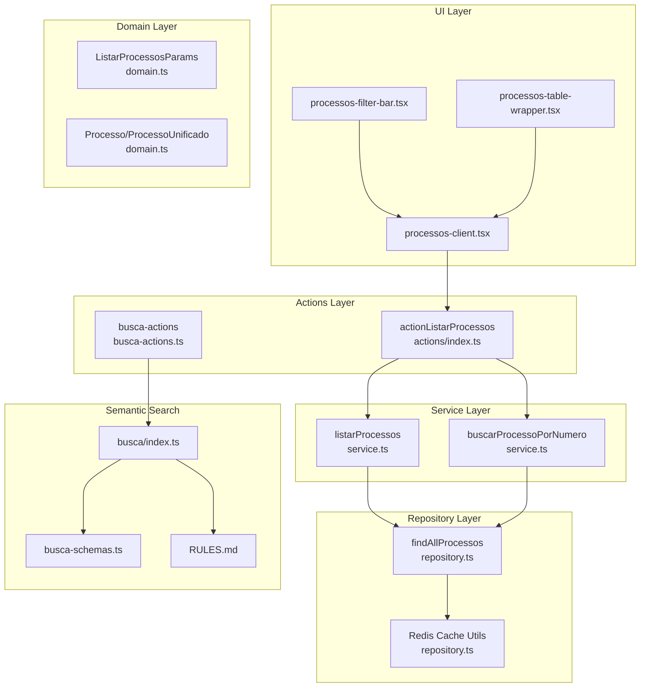
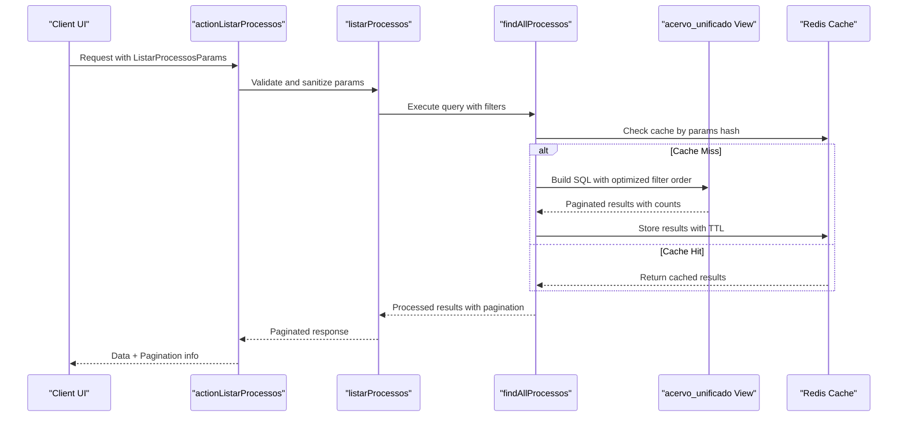
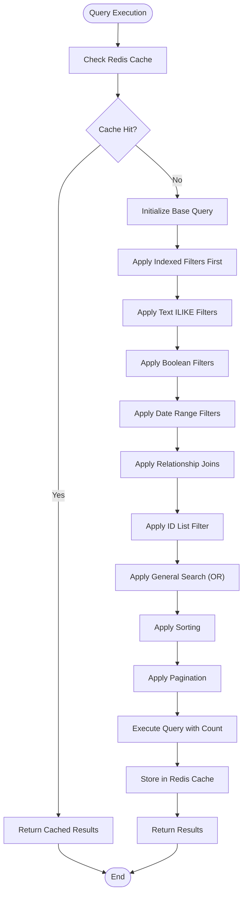
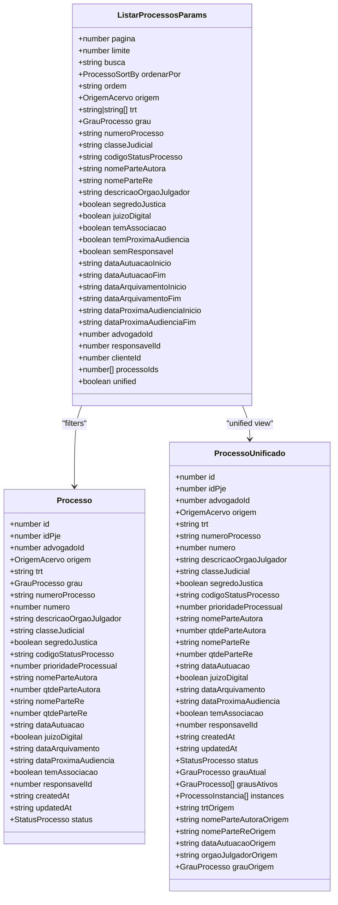

# Advanced Search and Filtering Capabilities

<cite>
**Referenced Files in This Document**
- [domain.ts](file://src/app/(authenticated)/processos/domain.ts)
- [repository.ts](file://src/app/(authenticated)/processos/repository.ts)
- [service.ts](file://src/app/(authenticated)/processos/service.ts)
- [actions/index.ts](file://src/app/(authenticated)/processos/actions/index.ts)
- [processos-client.tsx](file://src/app/(authenticated)/processos/processos-client.tsx)
- [processos-table-wrapper.tsx](file://src/app/(authenticated)/processos/components/processos-table-wrapper.tsx)
- [processos-filter-bar.tsx](file://src/app/(authenticated)/processos/components/processos-filter-bar.tsx)
- [use-processos.ts](file://src/app/(authenticated)/processos/hooks/use-processos.ts)
- [busca/index.ts](file://src/lib/busca/index.ts)
- [busca-actions.ts](file://src/lib/busca/actions/busca-actions.ts)
- [busca-schemas.ts](file://src/lib/busca/actions/schemas.ts)
- [RULES.md](file://src/lib/busca/RULES.md)
- [processos-tools.ts](file://src/lib/mcp/registries/processos-tools.ts)
</cite>

## Table of Contents
1. [Introduction](#introduction)
2. [Project Structure](#project-structure)
3. [Core Components](#core-components)
4. [Architecture Overview](#architecture-overview)
5. [Detailed Component Analysis](#detailed-component-analysis)
6. [Dependency Analysis](#dependency-analysis)
7. [Performance Considerations](#performance-considerations)
8. [Troubleshooting Guide](#troubleshooting-guide)
9. [Conclusion](#conclusion)

## Introduction
This document provides comprehensive technical documentation for the advanced search and filtering capabilities of the legal process management system. It covers the ListarProcessosParams interface with all 19 supported filter types, the underlying search algorithm implementation, query optimization strategies, index utilization, pagination handling, unified versus detailed view selection, and performance optimization techniques including caching and real-time search suggestions.

## Project Structure
The search and filtering functionality spans several layers:
- Domain layer defines the ListarProcessosParams interface and data models
- Repository layer implements the SQL query construction and optimization
- Service layer orchestrates pagination, validation, and response formatting
- Actions layer exposes server actions for external consumption
- UI components integrate filters and manage pagination state
- Semantic search module provides AI-powered retrieval capabilities

**Diagram sources**
- [processos-client.tsx:118-266](file://src/app/(authenticated)/processos/processos-client.tsx#L118-L266)
- [domain.ts:410-460](file://src/app/(authenticated)/processos/domain.ts#L410-L460)
- [service.ts:172-204](file://src/app/(authenticated)/processos/service.ts#L172-L204)
- [repository.ts:326-664](file://src/app/(authenticated)/processos/repository.ts#L326-L664)
- [actions/index.ts:415-464](file://src/app/(authenticated)/processos/actions/index.ts#L415-L464)
- [busca/index.ts:1-22](file://src/lib/busca/index.ts#L1-L22)

**Section sources**
- [domain.ts:410-460](file://src/app/(authenticated)/processos/domain.ts#L410-L460)
- [repository.ts:326-664](file://src/app/(authenticated)/processos/repository.ts#L326-L664)
- [service.ts:172-204](file://src/app/(authenticated)/processos/service.ts#L172-L204)
- [actions/index.ts:415-464](file://src/app/(authenticated)/processos/actions/index.ts#L415-L464)

## Core Components

### ListarProcessosParams Interface
The ListarProcessosParams interface defines 19 distinct filter categories:

**Identification Filters**
- `origem`: Process origin (acervo_geral, arquivado)
- `trt`: Tribunal Regional do Trabalho (TRT) code(s)
- `grau`: Jurisdiction level (primeiro_grau, segundo_grau, tribunal_superior)
- `numeroProcesso`: CNJ formatted process number
- `classeJudicial`: Judicial class description
- `codigoStatusProcesso`: Process status code

**Party Filters**
- `nomeParteAutora`: Plaintiff name
- `nomeParteRe`: Defendant name
- `descricaoOrgaoJulgador`: Court organ description

**Boolean Filters**
- `segredoJustica`: Secret justice flag
- `juizoDigital`: Digital court flag
- `temAssociacao`: Has association flag
- `temProximaAudiencia`: Has upcoming hearing flag
- `semResponsavel`: No responsible user flag

**Date Range Filters**
- `dataAutuacaoInicio/Fim`: Filing date range
- `dataArquivamentoInicio/Fim`: Archive date range
- `dataProximaAudienciaInicio/Fim`: Next hearing date range

**Relationship Filters**
- `advogadoId`: Attorney identifier
- `responsavelId`: Responsible user identifier
- `clienteId`: Client identifier (via processo_partes join)

**Additional Filters**
- `processoIds`: Direct ID list filter
- `unified`: View mode selection (default true)

**Section sources**
- [domain.ts:410-460](file://src/app/(authenticated)/processos/domain.ts#L410-L460)

### Unified vs Detailed View Selection
The system supports two viewing modes controlled by the `unified` parameter:
- **Unified View (default)**: Uses acervo_unificado view for consolidated process information
- **Detailed View**: Returns individual Processo records with full field sets

The unified view aggregates multi-instance processes and maintains "fonte da verdade" (source of truth) fields from the first instance, ensuring consistent origin data regardless of subsequent appeals.

**Section sources**
- [domain.ts:147-165](file://src/app/(authenticated)/processos/domain.ts#L147-L165)
- [repository.ts:326-335](file://src/app/(authenticated)/processos/repository.ts#L326-L335)

## Architecture Overview

**Diagram sources**
- [actions/index.ts:415-464](file://src/app/(authenticated)/processos/actions/index.ts#L415-L464)
- [service.ts:172-204](file://src/app/(authenticated)/processos/service.ts#L172-L204)
- [repository.ts:326-664](file://src/app/(authenticated)/processos/repository.ts#L326-L664)

## Detailed Component Analysis

### Search Algorithm Implementation

The repository implements a sophisticated query builder with optimized filter ordering:

**Diagram sources**
- [repository.ts:326-664](file://src/app/(authenticated)/processos/repository.ts#L326-L664)

#### Filter Application Priority
The system applies filters in this optimal order for performance:
1. **Indexed Filters**: advogado_id, origem, trt, grau_atual, numero_processo
2. **Text Filters**: ilike operations for partial matching
3. **Boolean Filters**: direct equality checks
4. **Date Range Filters**: range comparisons
5. **General Search**: Most expensive - applied last

#### Relationship Filter Implementation
The `clienteId` filter performs a two-step process:
1. Query `processo_partes` table to find associated process IDs
2. Apply IN clause with collected IDs to main query

**Section sources**
- [repository.ts:488-539](file://src/app/(authenticated)/processos/repository.ts#L488-L539)

### Query Optimization Strategies

#### Column Selection Optimization
The system implements selective column loading to reduce I/O:
- Basic columns: Essential fields for list views (40% reduction)
- Full columns: Complete process details for editing
- Unified columns: Specialized view columns with source-of-truth fields

#### Caching Strategy
- **Cache Keys**: Generated from parameter hash for exact match reuse
- **TTL Management**: 5-minute expiration for dynamic data
- **Cache Invalidation**: Automatic invalidation on data changes
- **Cache Layers**: Multi-level caching with Redis as primary store

#### Index Utilization
- **Covering Indexes**: Optimized for common filter combinations
- **Partial Indexes**: Used for frequently filtered boolean fields
- **GIN Indexes**: Applied to JSONB fields for efficient querying
- **Composite Indexes**: Multi-column indexes for complex WHERE clauses

**Section sources**
- [domain.ts:576-673](file://src/app/(authenticated)/processos/domain.ts#L576-L673)
- [repository.ts:341](file://src/app/(authenticated)/processos/repository.ts#L341)

### Pagination Handling

The service layer implements robust pagination:
- **Page Size Limits**: Maximum 100 records per page
- **Total Count**: Exact count via COUNT(*) for accurate pagination
- **Has More Indicator**: Determines if additional pages exist
- **URL Parameter Sync**: Maintains pagination state in browser URL

**Section sources**
- [service.ts:186-204](file://src/app/(authenticated)/processos/service.ts#L186-L204)
- [processos-table-wrapper.tsx:824-831](file://src/app/(authenticated)/processos/components/processos-table-wrapper.tsx#L824-L831)

### Real-time Search and Suggestions

The UI implements intelligent search behavior:
- **Debounced Search**: 300ms delay to prevent excessive queries
- **URL Synchronization**: Search terms reflected in URL parameters
- **Filter Chips**: Visual representation of active filters
- **Auto-complete**: Client-side suggestions based on existing data

**Section sources**
- [processos-client.tsx:124-153](file://src/app/(authenticated)/processos/processos-client.tsx#L124-L153)
- [processos-table-wrapper.tsx:824-831](file://src/app/(authenticated)/processos/components/processos-table-wrapper.tsx#L824-L831)

### Semantic Search Integration

The system includes AI-powered semantic search capabilities:
- **Vector Similarity**: Cosine similarity for semantic matching
- **Hybrid Search**: Combines vector and text search
- **Metadata Filtering**: Supports type-based filtering
- **Context Retrieval**: RAG-style context generation

**Section sources**
- [busca/index.ts:1-22](file://src/lib/busca/index.ts#L1-L22)
- [busca-actions.ts:1-164](file://src/lib/busca/actions/busca-actions.ts#L1-L164)
- [busca-schemas.ts:1-47](file://src/lib/busca/actions/schemas.ts#L1-L47)
- [RULES.md:1-131](file://src/lib/busca/RULES.md#L1-L131)

## Dependency Analysis

**Diagram sources**
- [domain.ts:410-460](file://src/app/(authenticated)/processos/domain.ts#L410-L460)
- [domain.ts:90-118](file://src/app/(authenticated)/processos/domain.ts#L90-L118)
- [domain.ts:147-165](file://src/app/(authenticated)/processos/domain.ts#L147-L165)

## Performance Considerations

### Query Performance Optimization
- **Filter Ordering**: Minimizes table scans by applying selective filters first
- **Index Coverage**: Strategic indexing reduces query execution time
- **Column Selection**: Reduces network I/O and memory usage
- **Pagination**: Prevents large result set processing

### Caching Strategy
- **Parameter-based Keys**: Exact match reuse across sessions
- **TTL Management**: Balances freshness with performance
- **Invalidation Triggers**: Automatic cache clearing on data changes
- **Multi-tier Architecture**: Redis as primary cache layer

### Memory Management
- **Streaming Results**: Large result sets processed in chunks
- **Connection Pooling**: Efficient database connection management
- **Query Timeout**: Prevents long-running queries from blocking resources

## Troubleshooting Guide

### Common Issues and Solutions

**Performance Degradation**
- Verify filter ordering follows recommended sequence
- Check index utilization with EXPLAIN ANALYZE
- Monitor cache hit ratio and adjust TTL if needed

**Pagination Problems**
- Ensure total count queries are not being bypassed
- Verify URL parameter synchronization
- Check page size limits (maximum 100)

**Filter Not Working**
- Confirm parameter names match interface definitions
- Verify data types match expected formats
- Check for proper sanitization of user inputs

**Cache Issues**
- Clear specific cache keys for affected queries
- Verify cache invalidation triggers
- Check Redis connectivity and memory limits

**Section sources**
- [repository.ts:652-663](file://src/app/(authenticated)/processos/repository.ts#L652-L663)
- [service.ts:186-204](file://src/app/(authenticated)/processos/service.ts#L186-L204)

## Conclusion

The legal process management system provides a comprehensive and performant search and filtering solution with 19 distinct filter types, optimized query execution, intelligent caching, and unified/detailed view selection. The architecture balances flexibility with performance through strategic indexing, column selection optimization, and multi-layer caching. The semantic search integration adds AI-powered retrieval capabilities while maintaining the robust relational query foundation. The system's modular design ensures maintainability and extensibility for future enhancements.