# Automated Data Capture from PJE-TRT Systems

<cite>
**Referenced Files in This Document**
- [trt-driver.ts](file://src/app/(authenticated)/captura/drivers/pje/trt-driver.ts)
- [trt-auth.service.ts](file://src/app/(authenticated)/captura/services/trt/trt-auth.service.ts)
- [trt-capture.service.ts](file://src/app/(authenticated)/captura/services/trt/trt-capture.service.ts)
- [pje-trt.ts](file://src/types/contracts/pje-trt.ts)
- [trt-types.ts](file://src/app/(authenticated)/captura/types/trt-types.ts)
- [captura-combinada.service.ts](file://src/app/(authenticated)/captura/services/trt/captura-combinada.service.ts)
- [pje-expediente-documento.service.ts](file://src/app/(authenticated)/captura/services/pje/pje-expediente-documento.service.ts)
- [pje-documento-types.ts](file://src/app/(authenticated)/captura/types/pje-documento-types.ts)
- [cadastros-pje-repository.ts](file://src/shared/partes/repositories/cadastros-pje-repository.ts)
- [cadastros-pje-repository.ts](file://src/app/(authenticated)/partes/repositories/cadastros-pje-repository.ts)
- [captura-dialog.tsx](file://src/app/(authenticated)/captura/components/captura-dialog.tsx)
- [captura-form-base.tsx](file://src/app/(authenticated)/captura/components/captura-form-base.tsx)
- [acervo-geral-form.tsx](file://src/app/(authenticated)/captura/components/acervo-geral-form.tsx)
- [audiencias-form.tsx](file://src/app/(authenticated)/captura/components/audiencias-form.tsx)
- [credenciais-combobox.tsx](file://src/app/(authenticated)/captura/components/credenciais-combobox.tsx)
- [credenciais-dialog.tsx](file://src/app/(authenticated)/captura/components/credenciais/credenciais-dialog.tsx)
- [credenciais-columns.tsx](file://src/app/(authenticated)/captura/components/credenciais/credenciais-columns.tsx)
- [constants.ts](file://src/app/(authenticated)/captura/constants.ts)
- [credenciais.ts](file://src/app/(authenticated)/captura/types/credenciais.ts)
</cite>

## Update Summary
**Changes Made**
- Updated UI component documentation to reflect enhanced credential selection interface with new popover-based system
- Added comprehensive documentation for Select All functionality and improved grade formatting
- Enhanced credential selection interface documentation with modernized UI components
- Updated form component examples to show new popover-based credential selection with Select All feature

## Table of Contents
1. [Introduction](#introduction)
2. [Project Structure](#project-structure)
3. [Core Components](#core-components)
4. [Architecture Overview](#architecture-overview)
5. [Detailed Component Analysis](#detailed-component-analysis)
6. [Enhanced Credential Selection Interface](#enhanced-credential-selection-interface)
7. [UI Component Enhancements](#ui-component-enhancements)
8. [Dependency Analysis](#dependency-analysis)
9. [Performance Considerations](#performance-considerations)
10. [Troubleshooting Guide](#troubleshooting-guide)
11. [Conclusion](#conclusion)
12. [Appendices](#appendices)

## Introduction
This document describes the automated data capture system that integrates with PJE-TRT legal databases. It covers the authentication architecture, session lifecycle, and end-to-end capture workflows for process movements, audiência schedules, and party information. It also documents error handling, retry mechanisms, data validation, mapping between PJE-TRT data structures and internal Processo entities, and operational guidance for configuration, monitoring, and troubleshooting.

## Project Structure
The capture system is organized around:
- Authentication and session management for PJE-TRT
- Data capture orchestration for multiple domains (audiências, expedientes, timeline, partes)
- Persistence services for timelines, audiências, expedientes, and parties
- Document capture pipeline for pending manifestação documents
- Shared type definitions and repositories for cross-cutting concerns
- Enhanced UI components with modernized credential management and streamlined validation

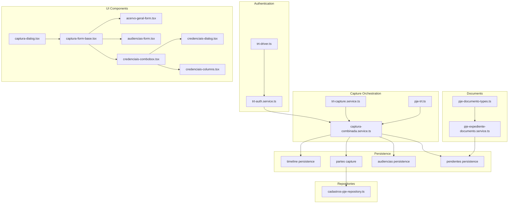

**Diagram sources**
- [trt-auth.service.ts](file://src/app/(authenticated)/captura/services/trt/trt-auth.service.ts#L592-L652)
- [trt-driver.ts](file://src/app/(authenticated)/captura/drivers/pje/trt-driver.ts#L33-L81)
- [captura-combinada.service.ts](file://src/app/(authenticated)/captura/services/trt/captura-combinada.service.ts#L230-L257)
- [trt-capture.service.ts](file://src/app/(authenticated)/captura/services/trt/trt-capture.service.ts#L12-L49)
- [pje-trt.ts:13-172](file://src/types/contracts/pje-trt.ts#L13-L172)
- [pje-expediente-documento.service.ts](file://src/app/(authenticated)/captura/services/pje/pje-expediente-documento.service.ts#L218-L297)
- [pje-documento-types.ts](file://src/app/(authenticated)/captura/types/pje-documento-types.ts#L5-L14)
- [cadastros-pje-repository.ts:45-73](file://src/shared/partes/repositories/cadastros-pje-repository.ts#L45-L73)
- [captura-dialog.tsx](file://src/app/(authenticated)/captura/components/captura-dialog.tsx#L40-L41)
- [captura-form-base.tsx](file://src/app/(authenticated)/captura/components/captura-form-base.tsx#L44-L51)
- [credenciais-combobox.tsx](file://src/app/(authenticated)/captura/components/credenciais-combobox.tsx#L1-L101)
- [credenciais-dialog.tsx](file://src/app/(authenticated)/captura/components/credenciais/credenciais-dialog.tsx#L1-L138)
- [credenciais-columns.tsx](file://src/app/(authenticated)/captura/components/credenciais/credenciais-columns.tsx#L1-L125)

**Section sources**
- [trt-driver.ts](file://src/app/(authenticated)/captura/drivers/pje/trt-driver.ts#L1-L81)
- [trt-auth.service.ts](file://src/app/(authenticated)/captura/services/trt/trt-auth.service.ts#L592-L652)
- [captura-combinada.service.ts](file://src/app/(authenticated)/captura/services/trt/captura-combinada.service.ts#L1-L967)
- [trt-capture.service.ts](file://src/app/(authenticated)/captura/services/trt/trt-capture.service.ts#L1-L49)
- [pje-trt.ts:1-379](file://src/types/contracts/pje-trt.ts#L1-L379)
- [pje-expediente-documento.service.ts](file://src/app/(authenticated)/captura/services/pje/pje-expediente-documento.service.ts#L1-L298)
- [pje-documento-types.ts](file://src/app/(authenticated)/captura/types/pje-documento-types.ts#L1-L16)
- [cadastros-pje-repository.ts:1-117](file://src/shared/partes/repositories/cadastros-pje-repository.ts#L1-L117)
- [cadastros-pje-repository.ts](file://src/app/(authenticated)/partes/repositories/cadastros-pje-repository.ts#L1-L5)
- [captura-dialog.tsx](file://src/app/(authenticated)/captura/components/captura-dialog.tsx#L1-L125)
- [captura-form-base.tsx](file://src/app/(authenticated)/captura/components/captura-form-base.tsx#L1-L258)
- [credenciais-combobox.tsx](file://src/app/(authenticated)/captura/components/credenciais-combobox.tsx#L1-L101)
- [credenciais-dialog.tsx](file://src/app/(authenticated)/captura/components/credenciais/credenciais-dialog.tsx#L1-L138)
- [credenciais-columns.tsx](file://src/app/(authenticated)/captura/components/credenciais/credenciais-columns.tsx#L1-L125)

## Core Components
- Authentication and session management:
  - Anti-detection browser configuration, SSO gov.br login, OTP processing, token extraction, and robust retry logic.
- Capture orchestration:
  - Combined capture workflow spanning audiências, expedientes, and timeline+partes for unique processes.
- Data contracts:
  - Strongly typed PJE-TRT shapes for timelines, audiências, expedientes, and documents.
- Document capture:
  - End-to-end pipeline for fetching pending manifestação documents, validating content, uploading to storage, and updating database records.
- Repositories:
  - Upsert and lookup of PJE entity mappings for clients, parties, third parties, and representatives.
- UI Components:
  - Modernized credential selection interface with popover-based system and Select All functionality
  - Enhanced credential management with improved grade formatting and streamlined validation

**Section sources**
- [trt-auth.service.ts](file://src/app/(authenticated)/captura/services/trt/trt-auth.service.ts#L65-L84)
- [trt-auth.service.ts](file://src/app/(authenticated)/captura/services/trt/trt-auth.service.ts#L90-L279)
- [trt-auth.service.ts](file://src/app/(authenticated)/captura/services/trt/trt-auth.service.ts#L592-L652)
- [captura-combinada.service.ts](file://src/app/(authenticated)/captura/services/trt/captura-combinada.service.ts#L230-L257)
- [pje-trt.ts:13-172](file://src/types/contracts/pje-trt.ts#L13-L172)
- [pje-expediente-documento.service.ts](file://src/app/(authenticated)/captura/services/pje/pje-expediente-documento.service.ts#L68-L168)
- [pje-expediente-documento.service.ts](file://src/app/(authenticated)/captura/services/pje/pje-expediente-documento.service.ts#L218-L297)
- [cadastros-pje-repository.ts:45-73](file://src/shared/partes/repositories/cadastros-pje-repository.ts#L45-L73)
- [captura-dialog.tsx](file://src/app/(authenticated)/captura/components/captura-dialog.tsx#L40-L41)
- [captura-form-base.tsx](file://src/app/(authenticated)/captura/components/captura-form-base.tsx#L44-L51)
- [credenciais-combobox.tsx](file://src/app/(authenticated)/captura/components/credenciais-combobox.tsx#L1-L101)

## Architecture Overview
The system authenticates via SSO gov.br with OTP, maintains a browser session, and executes targeted captures. It consolidates unique process identifiers, enriches with timeline and parties, and persists results to PostgreSQL and storage systems.

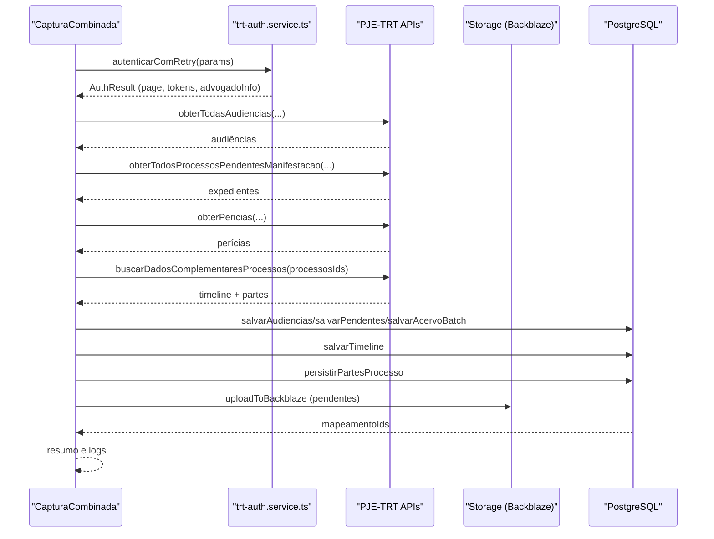

**Diagram sources**
- [captura-combinada.service.ts](file://src/app/(authenticated)/captura/services/trt/captura-combinada.service.ts#L230-L257)
- [trt-auth.service.ts](file://src/app/(authenticated)/captura/services/trt/trt-auth.service.ts#L659-L677)
- [pje-trt.ts:349-367](file://src/types/contracts/pje-trt.ts#L349-L367)

## Detailed Component Analysis

### Authentication and Session Management
- Anti-detection browser configuration removes automation flags.
- SSO gov.br login with retry on navigation/network errors.
- OTP detection and submission with fallback to next OTP if current fails.
- Token extraction (access_token, XSRF) and JWT decoding to obtain attorney info.
- Robust retry wrapper for authentication failures.

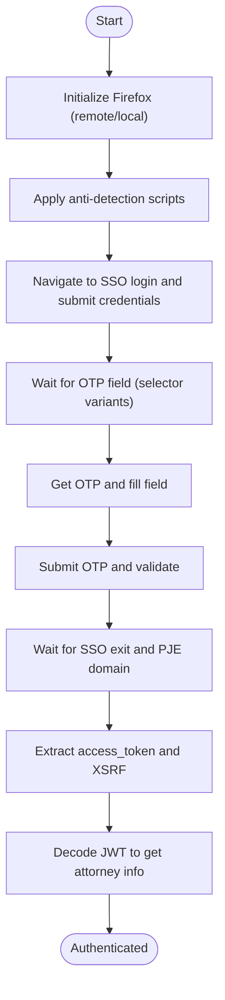

**Diagram sources**
- [trt-auth.service.ts](file://src/app/(authenticated)/captura/services/trt/trt-auth.service.ts#L65-L84)
- [trt-auth.service.ts](file://src/app/(authenticated)/captura/services/trt/trt-auth.service.ts#L338-L423)
- [trt-auth.service.ts](file://src/app/(authenticated)/captura/services/trt/trt-auth.service.ts#L429-L451)
- [trt-auth.service.ts](file://src/app/(authenticated)/captura/services/trt/trt-auth.service.ts#L579-L652)

**Section sources**
- [trt-auth.service.ts](file://src/app/(authenticated)/captura/services/trt/trt-auth.service.ts#L65-L84)
- [trt-auth.service.ts](file://src/app/(authenticated)/captura/services/trt/trt-auth.service.ts#L90-L279)
- [trt-auth.service.ts](file://src/app/(authenticated)/captura/services/trt/trt-auth.service.ts#L592-L652)
- [trt-auth.service.ts](file://src/app/(authenticated)/captura/services/trt/trt-auth.service.ts#L659-L677)

### Capture Orchestration and Workflows
- Combined capture executes multiple domains in a single authenticated session:
  - Audiências (designadas, realizadas, canceladas) within specified date ranges.
  - Expedientes (no prazo, sem prazo) with configurable filters.
  - Perícias (first degree only).
  - Timeline and partes enrichment for unique processes, with recapture thresholds and delays.
- Consolidation phase extracts unique process IDs and persists results to PostgreSQL and storage.

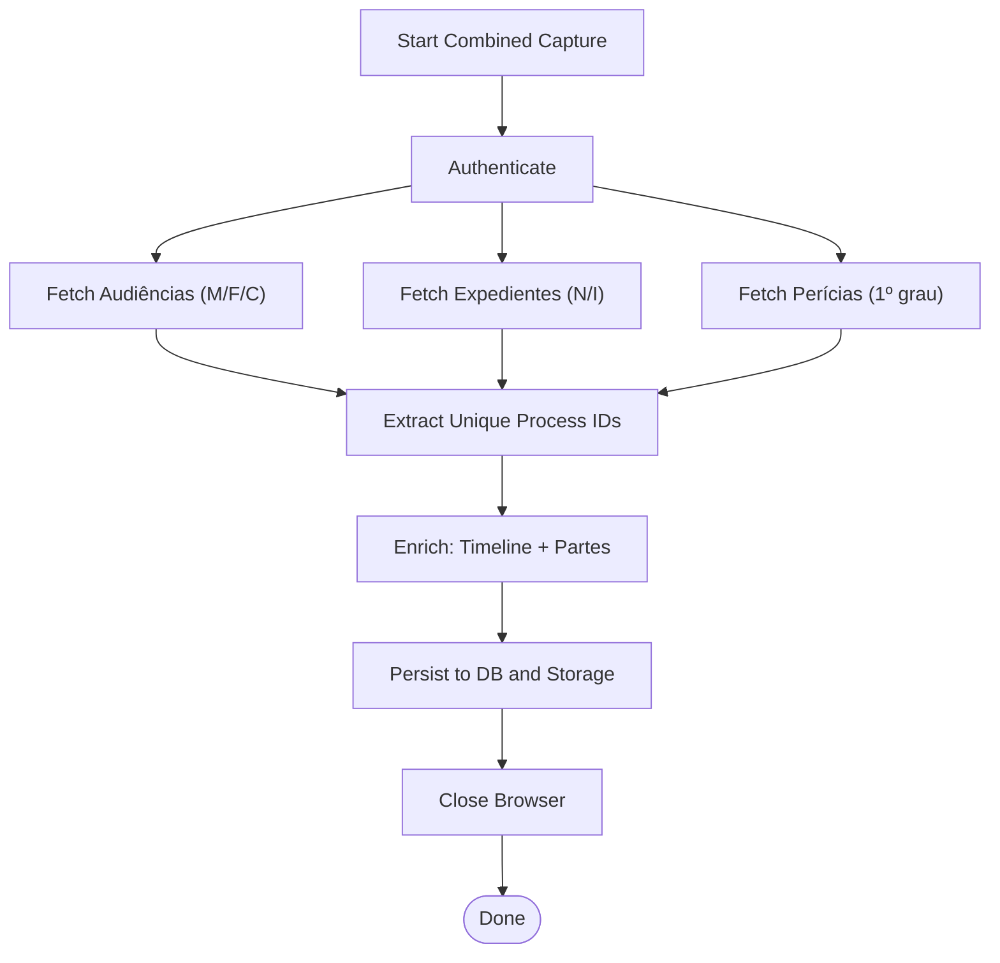

**Diagram sources**
- [captura-combinada.service.ts](file://src/app/(authenticated)/captura/services/trt/captura-combinada.service.ts#L230-L257)
- [captura-combinada.service.ts](file://src/app/(authenticated)/captura/services/trt/captura-combinada.service.ts#L287-L306)
- [captura-combinada.service.ts](file://src/app/(authenticated)/captura/services/trt/captura-combinada.service.ts#L362-L386)
- [captura-combinada.service.ts](file://src/app/(authenticated)/captura/services/trt/captura-combinada.service.ts#L422-L434)
- [captura-combinada.service.ts](file://src/app/(authenticated)/captura/services/trt/captura-combinada.service.ts#L458-L491)
- [captura-combinada.service.ts](file://src/app/(authenticated)/captura/services/trt/captura-combinada.service.ts#L646-L757)

**Section sources**
- [captura-combinada.service.ts](file://src/app/(authenticated)/captura/services/trt/captura-combinada.service.ts#L230-L257)
- [captura-combinada.service.ts](file://src/app/(authenticated)/captura/services/trt/captura-combinada.service.ts#L287-L306)
- [captura-combinada.service.ts](file://src/app/(authenticated)/captura/services/trt/captura-combinada.service.ts#L362-L386)
- [captura-combinada.service.ts](file://src/app/(authenticated)/captura/services/trt/captura-combinada.service.ts#L422-L434)
- [captura-combinada.service.ts](file://src/app/(authenticated)/captura/services/trt/captura-combinada.service.ts#L458-L491)
- [captura-combinada.service.ts](file://src/app/(authenticated)/captura/services/trt/captura-combinada.service.ts#L646-L757)

### Data Contracts and Type Definitions
- Timeline items support both documents and movements with distinct fields.
- Audiência entities include process, type, room, and polo details.
- Document metadata and content types define document capture behavior.
- Strong typing ensures consistency across capture and persistence layers.

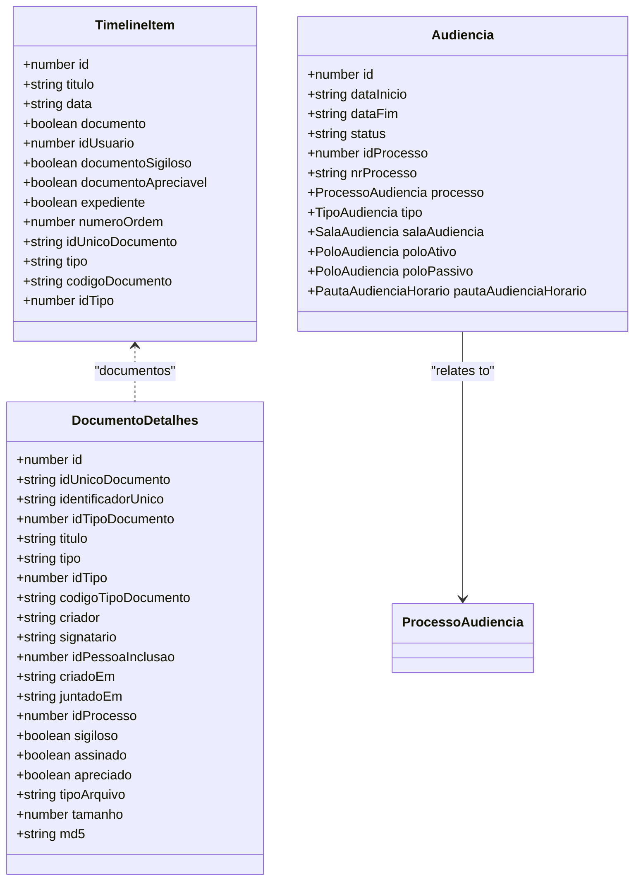

**Diagram sources**
- [pje-trt.ts:13-172](file://src/types/contracts/pje-trt.ts#L13-L172)
- [pje-trt.ts:298-367](file://src/types/contracts/pje-trt.ts#L298-L367)
- [pje-trt.ts:69-143](file://src/types/contracts/pje-trt.ts#L69-L143)

**Section sources**
- [pje-trt.ts:13-172](file://src/types/contracts/pje-trt.ts#L13-L172)
- [pje-trt.ts:298-367](file://src/types/contracts/pje-trt.ts#L298-L367)
- [pje-trt.ts:69-143](file://src/types/contracts/pje-trt.ts#L69-L143)

### Document Capture Pipeline (Pending Manifestação)
- Fetch document metadata and validate type.
- Download content (PDF) and convert to base64.
- Upload to Backblaze B2 with generated key and filename.
- Update database record with file metadata.

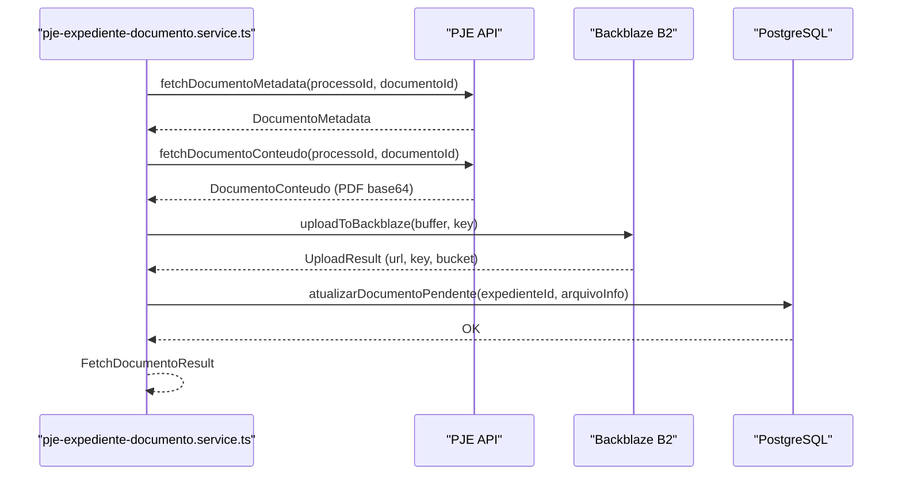

**Diagram sources**
- [pje-expediente-documento.service.ts](file://src/app/(authenticated)/captura/services/pje/pje-expediente-documento.service.ts#L68-L99)
- [pje-expediente-documento.service.ts](file://src/app/(authenticated)/captura/services/pje/pje-expediente-documento.service.ts#L124-L168)
- [pje-expediente-documento.service.ts](file://src/app/(authenticated)/captura/services/pje/pje-expediente-documento.service.ts#L218-L297)

**Section sources**
- [pje-expediente-documento.service.ts](file://src/app/(authenticated)/captura/services/pje/pje-expediente-documento.service.ts#L68-L168)
- [pje-expediente-documento.service.ts](file://src/app/(authenticated)/captura/services/pje/pje-expediente-documento.service.ts#L218-L297)
- [pje-documento-types.ts](file://src/app/(authenticated)/captura/types/pje-documento-types.ts#L5-L14)

### Party Information Capture and Mapping
- Parties are captured per process and persisted with associated Processo IDs.
- Entity-to-PJE ID mapping is maintained via a shared repository supporting multiple systems and tribunals.

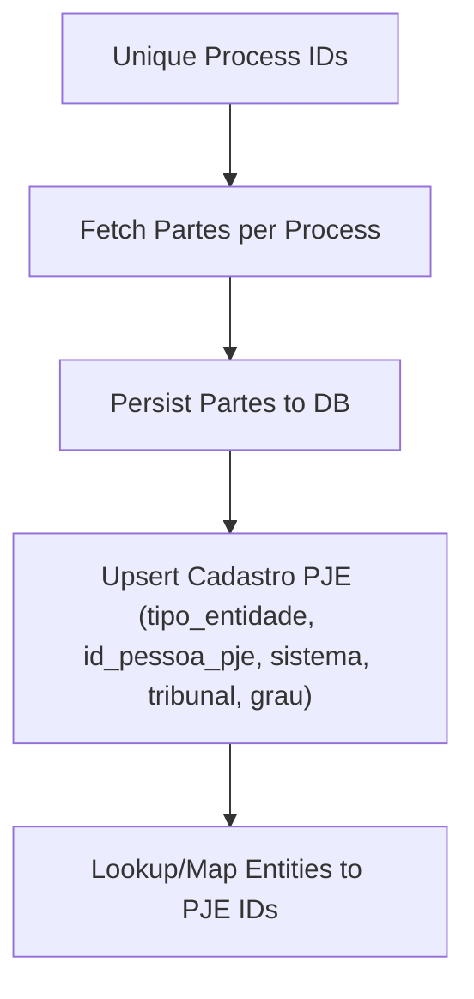

**Diagram sources**
- [captura-combinada.service.ts](file://src/app/(authenticated)/captura/services/trt/captura-combinada.service.ts#L686-L757)
- [cadastros-pje-repository.ts:45-73](file://src/shared/partes/repositories/cadastros-pje-repository.ts#L45-L73)
- [cadastros-pje-repository.ts:78-115](file://src/shared/partes/repositories/cadastros-pje-repository.ts#L78-L115)

**Section sources**
- [captura-combinada.service.ts](file://src/app/(authenticated)/captura/services/trt/captura-combinada.service.ts#L686-L757)
- [cadastros-pje-repository.ts:45-73](file://src/shared/partes/repositories/cadastros-pje-repository.ts#L45-L73)
- [cadastros-pje-repository.ts:78-115](file://src/shared/partes/repositories/cadastros-pje-repository.ts#L78-L115)

### Driver Abstraction and Migration Notes
- The PJE TRT driver currently throws "not implemented" due to backend service migrations and is marked for reimplementation using new architecture paths.

**Section sources**
- [trt-driver.ts](file://src/app/(authenticated)/captura/drivers/pje/trt-driver.ts#L33-L81)

## Enhanced Credential Selection Interface

### Modernized Popover-Based System
The credential selection interface has been completely redesigned with a modern popover-based system that replaces the previous grid-based approach. This new system provides improved user experience with better credential organization and selection capabilities.

**Updated** Enhanced credential selection interface with popover-based system and Select All functionality

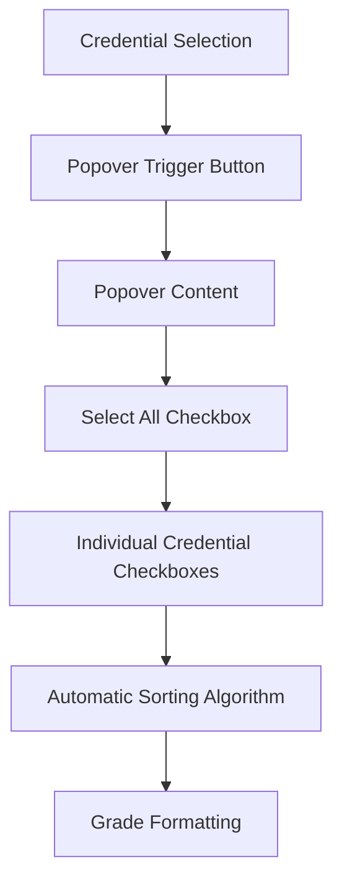

**Diagram sources**
- [captura-form-base.tsx](file://src/app/(authenticated)/captura/components/captura-form-base.tsx#L183-L240)
- [captura-form-base.tsx](file://src/app/(authenticated)/captura/components/captura-form-base.tsx#L202-L238)

### Select All Functionality
The new interface includes a comprehensive Select All feature that allows users to quickly select or deselect all available credentials with a single action. The system displays the count of selected vs total credentials and provides visual feedback through indeterminate state checkboxes.

**Updated** Select All functionality with visual feedback and credential count display

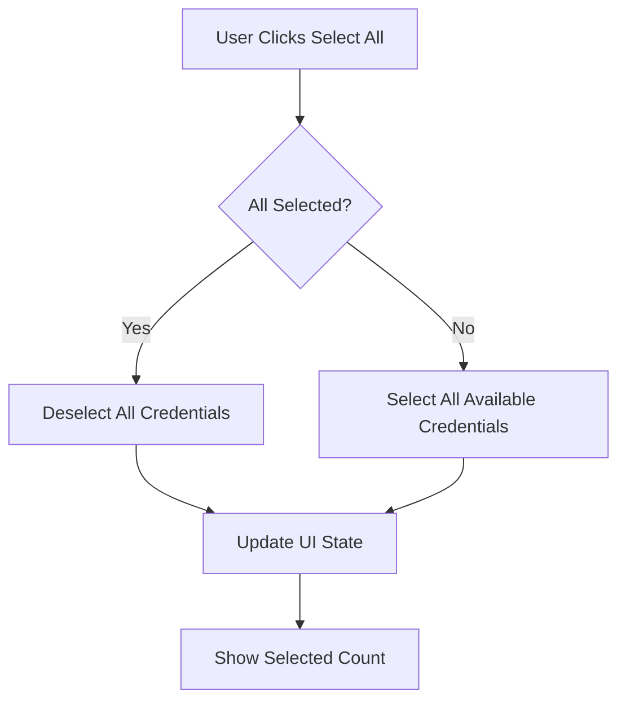

**Diagram sources**
- [captura-form-base.tsx](file://src/app/(authenticated)/captura/components/captura-form-base.tsx#L114-L120)
- [captura-form-base.tsx](file://src/app/(authenticated)/captura/components/captura-form-base.tsx#L202-L217)

### Improved Grade Formatting
The system now provides enhanced grade formatting with proper Portuguese labels (1º Grau, 2º Grau, Tribunal Superior) instead of raw enum values. This improvement makes the interface more user-friendly and internationally comprehensible.

**Updated** Enhanced grade formatting with proper Portuguese labels

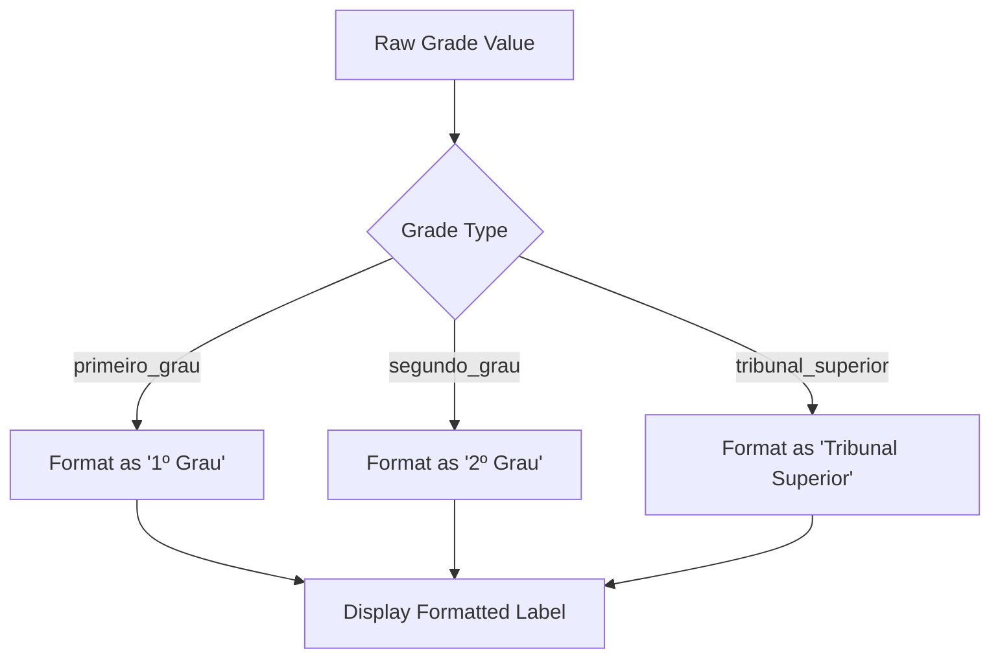

**Diagram sources**
- [captura-form-base.tsx](file://src/app/(authenticated)/captura/components/captura-form-base.tsx#L49-L54)

### Automatic Credential Sorting Algorithm
The system implements a sophisticated sorting algorithm that organizes credentials by tribunal number and degree priority. The algorithm prioritizes TRT1 through TRT24 in numerical order, followed by TST, and then sorts by degree (1º Grau, 2º Grau, Tribunal Superior).

**Updated** Automatic sorting algorithm with tribunal number extraction and degree weighting

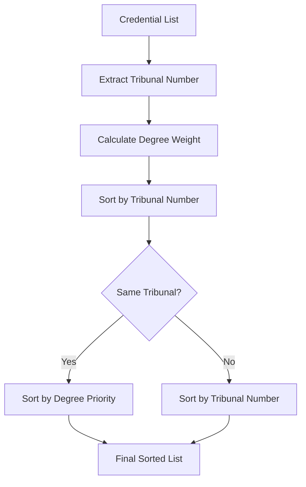

**Diagram sources**
- [captura-form-base.tsx](file://src/app/(authenticated)/captura/components/captura-form-base.tsx#L36-L63)

### Modernized UI Components
The credential selection interface now uses modern UI components including:
- Popover-based dropdown with proper width alignment
- Clean checkbox list with hover states and visual feedback
- Responsive design with proper spacing and typography
- Status indicators for credential activation state

**Section sources**
- [captura-form-base.tsx](file://src/app/(authenticated)/captura/components/captura-form-base.tsx#L183-L240)
- [captura-form-base.tsx](file://src/app/(authenticated)/captura/components/captura-form-base.tsx#L114-L120)
- [captura-form-base.tsx](file://src/app/(authenticated)/captura/components/captura-form-base.tsx#L49-L54)
- [captura-form-base.tsx](file://src/app/(authenticated)/captura/components/captura-form-base.tsx#L36-L63)
- [credenciais-combobox.tsx](file://src/app/(authenticated)/captura/components/credenciais-combobox.tsx#L1-L101)
- [credenciais-dialog.tsx](file://src/app/(authenticated)/captura/components/credenciais/credenciais-dialog.tsx#L1-L138)
- [credenciais-columns.tsx](file://src/app/(authenticated)/captura/components/credenciais/credenciais-columns.tsx#L1-L125)

## UI Component Enhancements

### Simplified Dialog Interface
The CapturaDialog component has been simplified with a static submit button label, replacing the previous complex dynamic `SUBMIT_LABELS` mapping system. This change improves code maintainability and reduces complexity in the dialog component.

**Updated** CapturaDialog now uses a simple static constant `SUBMIT_LABEL = 'Iniciar'` instead of dynamic label mapping

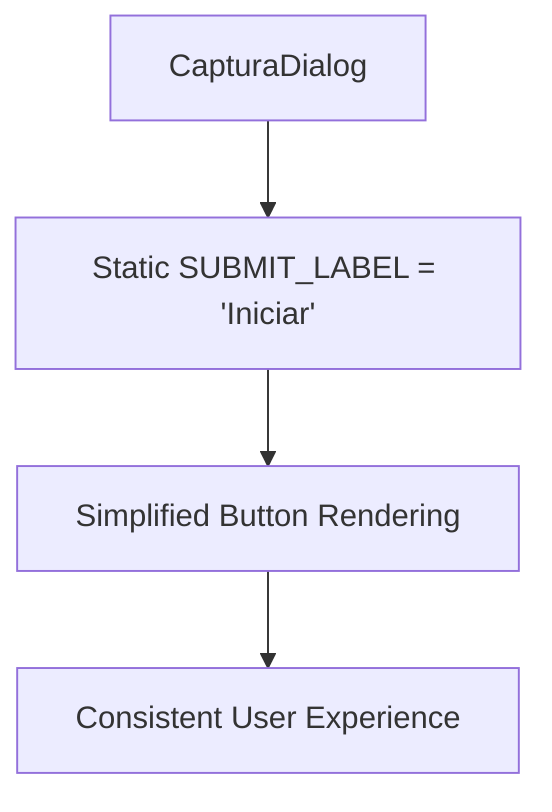

**Diagram sources**
- [captura-dialog.tsx](file://src/app/(authenticated)/captura/components/captura-dialog.tsx#L40-L41)
- [captura-dialog.tsx](file://src/app/(authenticated)/captura/components/captura-dialog.tsx#L116-L119)

**Section sources**
- [captura-dialog.tsx](file://src/app/(authenticated)/captura/components/captura-dialog.tsx#L40-L41)
- [captura-dialog.tsx](file://src/app/(authenticated)/captura/components/captura-dialog.tsx#L116-L119)

### Enhanced Credential Selection Interface
The CapturaFormBase component has been significantly enhanced with improved credential selection interface, automatic sorting algorithm, and streamlined validation logic.

#### Streamlined Validation Logic
The validation system has been simplified with the `validarCamposCaptura` function that provides consistent validation across all form components.

**Updated** Streamlined validation with centralized `validarCamposCaptura` function

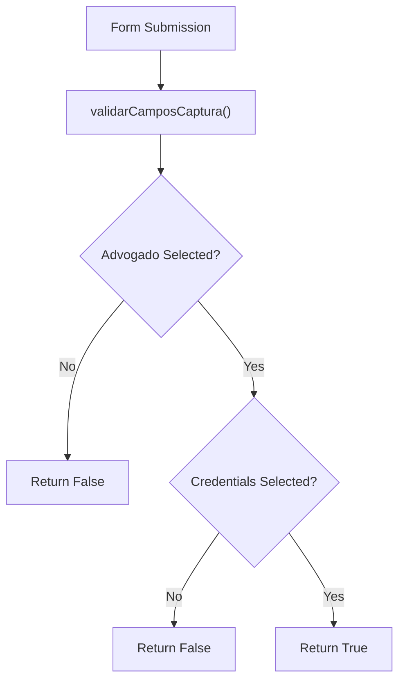

**Diagram sources**
- [captura-form-base.tsx](file://src/app/(authenticated)/captura/components/captura-form-base.tsx#L250-L257)

#### Improved Credential Selection Interface
The credential selection interface now provides better user experience with automatic sorting and validation feedback.

**Section sources**
- [captura-form-base.tsx](file://src/app/(authenticated)/captura/components/captura-form-base.tsx#L250-L257)
- [acervo-geral-form.tsx](file://src/app/(authenticated)/captura/components/acervo-geral-form.tsx#L32-L39)

## Dependency Analysis
- Authentication depends on browser connection utilities and OTP retrieval.
- Combined capture orchestrator depends on PJE API fetchers, persistence services, and logging.
- Document capture depends on storage upload utilities and persistence updates.
- Repositories depend on Supabase client for upsert and lookup operations.
- UI components depend on shared form base with enhanced credential management.

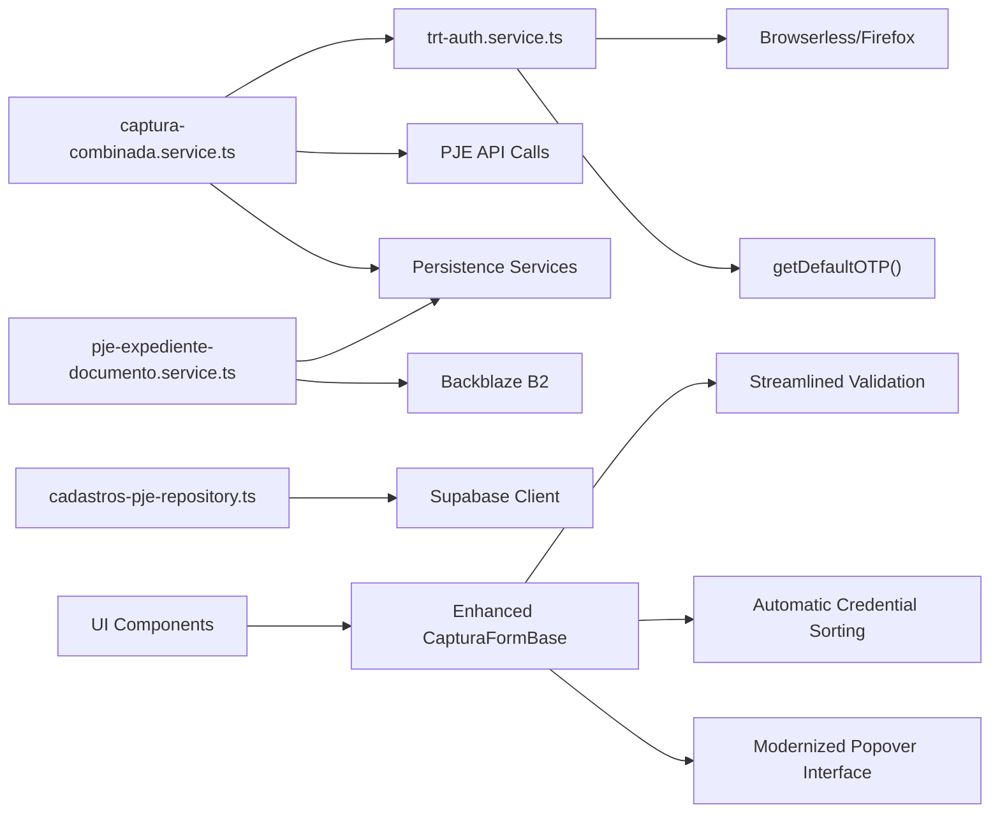

**Diagram sources**
- [trt-auth.service.ts](file://src/app/(authenticated)/captura/services/trt/trt-auth.service.ts#L8-L10)
- [trt-auth.service.ts](file://src/app/(authenticated)/captura/services/trt/trt-auth.service.ts#L185-L187)
- [captura-combinada.service.ts](file://src/app/(authenticated)/captura/services/trt/captura-combinada.service.ts#L58-L87)
- [pje-expediente-documento.service.ts](file://src/app/(authenticated)/captura/services/pje/pje-expediente-documento.service.ts#L37-L39)
- [cadastros-pje-repository.ts](file://src/shared/partes/repositories/cadastros-pje-repository.ts#L6)
- [captura-form-base.tsx](file://src/app/(authenticated)/captura/components/captura-form-base.tsx#L44-L51)
- [captura-form-base.tsx](file://src/app/(authenticated)/captura/components/captura-form-base.tsx#L250-L257)

**Section sources**
- [trt-auth.service.ts](file://src/app/(authenticated)/captura/services/trt/trt-auth.service.ts#L8-L10)
- [captura-combinada.service.ts](file://src/app/(authenticated)/captura/services/trt/captura-combinada.service.ts#L58-L87)
- [pje-expediente-documento.service.ts](file://src/app/(authenticated)/captura/services/pje/pje-expediente-documento.service.ts#L37-L39)
- [cadastros-pje-repository.ts](file://src/shared/partes/repositories/cadastros-pje-repository.ts#L6)
- [captura-form-base.tsx](file://src/app/(authenticated)/captura/components/captura-form-base.tsx#L44-L51)
- [captura-form-base.tsx](file://src/app/(authenticated)/captura/components/captura-form-base.tsx#L250-L257)

## Performance Considerations
- Session reuse across multiple capture domains reduces authentication overhead.
- Batch operations for acervo insertion and timeline persistence minimize round trips.
- Configurable delays between requests and recapture thresholds prevent API saturation.
- Anti-detection measures reduce timeouts and retries caused by automation detection.
- Enhanced credential sorting reduces user interaction time for credential selection.
- Simplified dialog interface reduces component complexity and improves rendering performance.
- Popover-based credential selection improves performance by lazy-loading credential lists.
- Select All functionality reduces individual checkbox interactions for bulk operations.

## Troubleshooting Guide
Common issues and remedies:
- OTP field not found or invalid:
  - Verify OTP selectors and availability; the system attempts a fallback OTP if configured.
- SSO redirection timeout:
  - Ensure target host is reachable and network conditions are stable; the system waits for domain transitions.
- Missing access_token cookie:
  - Confirm successful login and JWT decoding; the system retries cookie acquisition.
- Document capture failures:
  - Validate PDF type, handle base64 conversion errors, and confirm storage upload success.
- Party capture errors:
  - Check process-to-acervo mapping and tribunal/grau configuration before persisting parties.
- Credential selection issues:
  - Verify that the `validarCamposCaptura` function returns true before attempting capture.
  - Check that credentials are properly sorted and displayed in the interface.
  - Ensure Select All functionality works correctly for bulk credential selection.
  - Verify that grade formatting displays proper Portuguese labels.
- Dialog submission problems:
  - Ensure the static 'Iniciar' label is properly rendered and accessible.
- Popover credential interface problems:
  - Check that the popover opens correctly and displays credential options.
  - Verify that automatic sorting works for tribunal and degree combinations.
  - Ensure individual credential selection works within the popover interface.

**Section sources**
- [trt-auth.service.ts](file://src/app/(authenticated)/captura/services/trt/trt-auth.service.ts#L164-L178)
- [trt-auth.service.ts](file://src/app/(authenticated)/captura/services/trt/trt-auth.service.ts#L281-L332)
- [trt-auth.service.ts](file://src/app/(authenticated)/captura/services/trt/trt-auth.service.ts#L439-L450)
- [pje-expediente-documento.service.ts](file://src/app/(authenticated)/captura/services/pje/pje-expediente-documento.service.ts#L231-L235)
- [captura-combinada.service.ts](file://src/app/(authenticated)/captura/services/trt/captura-combinada.service.ts#L693-L697)
- [captura-form-base.tsx](file://src/app/(authenticated)/captura/components/captura-form-base.tsx#L250-L257)
- [captura-dialog.tsx](file://src/app/(authenticated)/captura/components/captura-dialog.tsx#L116-L119)
- [credenciais-combobox.tsx](file://src/app/(authenticated)/captura/components/credenciais-combobox.tsx#L1-L101)

## Conclusion
The system provides a robust, session-reuse-based capture pipeline for PJE-TRT with strong typing, anti-detection, and resilient retry logic. It supports combined capture across audiências, expedientes, and enriched timeline+partes, with dedicated document capture for pending manifestação and entity-to-PJE ID mapping via repositories. Recent UI enhancements include a modernized popover-based credential selection interface with Select All functionality, improved grade formatting, and streamlined validation processes, significantly enhancing the user experience while maintaining system reliability and performance.

## Appendices

### Practical Examples

- Combined capture configuration:
  - Use the combined capture service with credential and config parameters to execute audiências, expedientes, and perícias in a single authenticated session.

- Monitoring capture progress:
  - Inspect logs emitted during each phase and review the consolidated result object for totals, skipped processes, and persistence outcomes.

- Troubleshooting integration issues:
  - Review OTP handling, SSO exit timing, and cookie presence; validate document type and storage upload; confirm tribunal/grau and mapping IDs before persisting parties.
  - Verify credential validation using the `validarCamposCaptura` function.
  - Check that credentials are properly sorted and displayed in the enhanced interface.
  - Ensure Select All functionality works correctly for bulk credential selection.
  - Verify that grade formatting displays proper Portuguese labels.

- UI Component Usage:
  - The simplified dialog interface provides consistent 'Iniciar' button labeling across all capture types.
  - Enhanced credential selection interface automatically sorts credentials by tribunal and degree.
  - Streamlined validation ensures consistent form validation across all capture components.
  - Popover-based credential selection provides improved user experience with Select All functionality.
  - Modernized grade formatting displays proper Portuguese labels for tribunal degrees.