# Expedientes Capture Tracking System

<cite>
**Referenced Files in This Document**
- [expedientes.md](file://docs/expedientes.md)
- [repository.ts](file://src/app/(authenticated)/expedientes/repository.ts)
- [service.ts](file://src/app/(authenticated)/expedientes/service.ts)
- [pendentes-manifestacao.service.ts](file://src/app/(authenticated)/captura/services/trt/pendentes-manifestacao.service.ts)
- [acervo-geral.service.ts](file://src/app/(authenticated)/captura/services/trt/acervo-geral.service.ts)
- [audiencias.service.ts](file://src/app/(authenticated)/captura/services/trt/audiencias.service.ts)
- [timeline-capture.service.ts](file://src/app/(authenticated)/captura/services/timeline/timeline-capture.service.ts)
- [pendentes-persistence.service.ts](file://src/app/(authenticated)/captura/services/persistence/pendentes-persistence.service.ts)
- [20251204140000_add_comunica_cnj_integration.sql](file://supabase/migrations/20251204140000_add_comunica_cnj_integration.sql)
- [20260427090510_add_ultima_captura_id_to_expedientes.sql](file://supabase/migrations/20260427090510_add_ultima_captura_id_to_expedientes.sql)
</cite>

## Table of Contents
1. [Introduction](#introduction)
2. [System Architecture](#system-architecture)
3. [Core Components](#core-components)
4. [Capture Pipeline](#capture-pipeline)
5. [Data Management](#data-management)
6. [Integration Points](#integration-points)
7. [Performance Considerations](#performance-considerations)
8. [Error Handling](#error-handling)
9. [Security Model](#security-model)
10. [Monitoring and Tracking](#monitoring-and-tracking)
11. [Conclusion](#conclusion)

## Introduction

The Expedientes Capture Tracking System is a sophisticated legal process automation platform designed to streamline the management of judicial proceedings for law firms. The system integrates with the PJe-TRT (Tribunal Regional do Trabalho) platform to automatically capture, process, and track pending manifest processes, creating a unified database of legal proceedings with comprehensive metadata and document management capabilities.

This system represents a comprehensive solution for legal practice automation, combining advanced web scraping technologies with robust database management and document storage systems. The platform enables law firms to maintain real-time visibility of their clients' legal proceedings while ensuring compliance with legal requirements and maintaining detailed audit trails.

## System Architecture

The system follows a layered architecture pattern with clear separation of concerns across multiple domains:

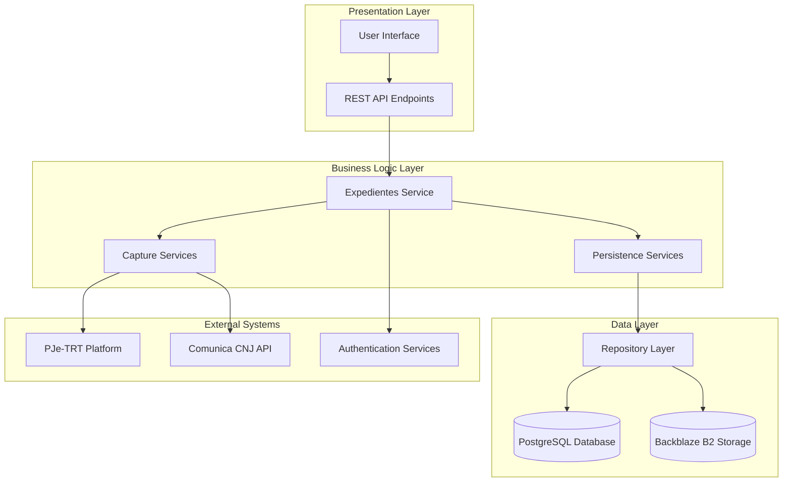

**Diagram sources**
- [repository.ts](file://src/app/(authenticated)/expedientes/repository.ts#L1-L800)
- [service.ts](file://src/app/(authenticated)/expedientes/service.ts#L1-L322)
- [pendentes-manifestacao.service.ts](file://src/app/(authenticated)/captura/services/trt/pendentes-manifestacao.service.ts#L1-L526)

The architecture implements a clean separation between presentation, business logic, and data management layers, enabling maintainability and scalability while ensuring proper encapsulation of domain-specific logic.

## Core Components

### Expedientes Domain Model

The system centers around the `Expedientes` entity, which serves as the primary representation of legal proceedings within the platform. The domain model encompasses comprehensive metadata about legal processes, including party information, procedural dates, and document attachments.

```mermaid
classDiagram
class Expediente {
+number id
+number idPje
+number advogadoId
+number processoId
+string trt
+string grau
+string numeroProcesso
+string descricaoOrgaoJulgador
+string classeJudicial
+number numero
+boolean segredoJustica
+string codigoStatusProcesso
+boolean prioridadeProcessual
+string nomeParteAutora
+number qtdeParteAutora
+string nomeParteRe
+number qtdeParteRe
+string dataAutuacao
+boolean juizoDigital
+string dataArquivamento
+number idDocumento
+string dataCienciaParte
+string dataPrazoLegalParte
+string dataCriacaoExpediente
+boolean prazoVencido
+string siglaOrgaoJulgador
+object dadosAnteriores
+number responsavelId
+string baixadoEm
+string protocoloId
+string justificativaBaixa
+number tipoExpedienteId
+string descricaoArquivos
+string arquivoNome
+string arquivoUrl
+string arquivoBucket
+string arquivoKey
+string observacoes
+string origem
+number ultimaCapturaId
+string resultadoDecisao
+string createdAt
+string updatedAt
}
class ExpedienteRow {
<<database>>
+number id
+number id_pje
+number advogado_id
+number processo_id
+string trt
+string grau
+string numero_processo
+string descricao_orgao_julgador
+string classe_judicial
+number numero
+boolean segredo_justica
+string codigo_status_processo
+boolean prioridade_processual
+string nome_parte_autora
+number qtde_parte_autora
+string nome_parte_re
+number qtde_parte_re
+string data_autuacao
+boolean juizo_digital
+string data_arquivamento
+number id_documento
+string data_ciencia_parte
+string data_prazo_legal_parte
+string data_criacao_expediente
+boolean prazo_vencido
+string sigla_orgao_julgador
+object dados_anteriores
+number responsavel_id
+string baixado_em
+string protocolo_id
+string justificativa_baixa
+number tipo_expediente_id
+string descricao_arquivos
+string arquivo_nome
+string arquivo_url
+string arquivo_bucket
+string arquivo_key
+string observacoes
+string origem
+number ultima_captura_id
+string resultado_decisao
+string created_at
+string updated_at
}
Expediente --> ExpedienteRow : "maps to"
```

**Diagram sources**
- [repository.ts](file://src/app/(authenticated)/expedientes/repository.ts#L26-L153)

### Service Layer Architecture

The service layer implements a comprehensive business logic layer that orchestrates data operations while maintaining strict separation between domain validation, business rules, and data persistence:

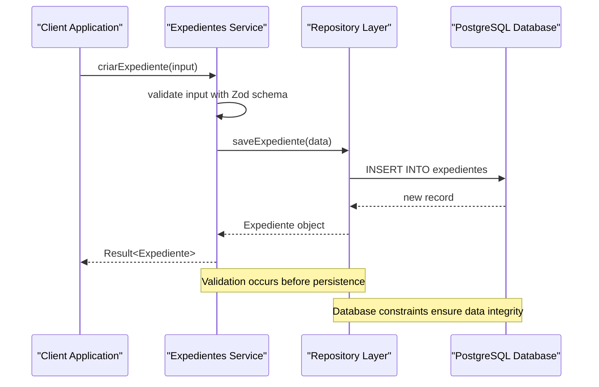

**Diagram sources**
- [service.ts](file://src/app/(authenticated)/expedientes/service.ts#L35-L45)
- [repository.ts](file://src/app/(authenticated)/expedientes/repository.ts#L475-L505)

**Section sources**
- [repository.ts](file://src/app/(authenticated)/expedientes/repository.ts#L1-L800)
- [service.ts](file://src/app/(authenticated)/expedientes/service.ts#L1-L322)

## Capture Pipeline

### Pendentes Manifestação Capture

The capture pipeline for pending manifest processes represents the core functionality of the system, implementing an optimized multi-stage process that ensures efficient data extraction and synchronization:

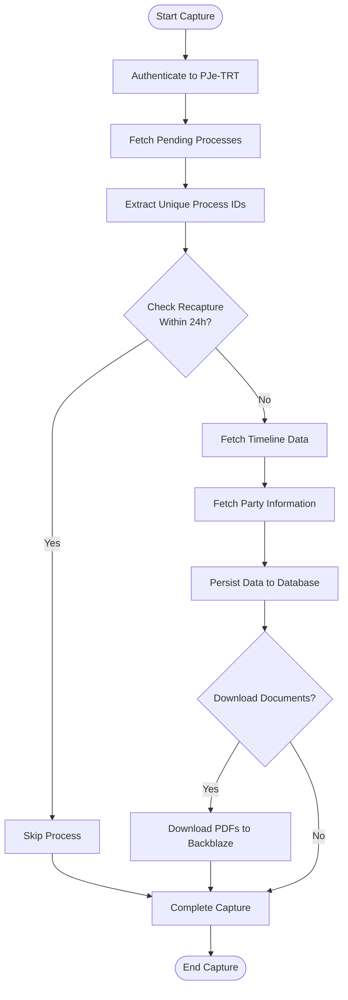

**Diagram sources**
- [pendentes-manifestacao.service.ts](file://src/app/(authenticated)/captura/services/trt/pendentes-manifestacao.service.ts#L134-L526)

The capture pipeline implements several optimization strategies:

1. **Batch Processing**: Uses batch queries to minimize database round trips
2. **Recapture Prevention**: Implements 24-hour recapture prevention to avoid redundant processing
3. **Incremental Updates**: Compares existing records before updating to prevent unnecessary writes
4. **Error Resilience**: Implements comprehensive error handling and logging for failed operations

### Timeline Capture Service

The timeline capture service provides granular control over document extraction and storage:

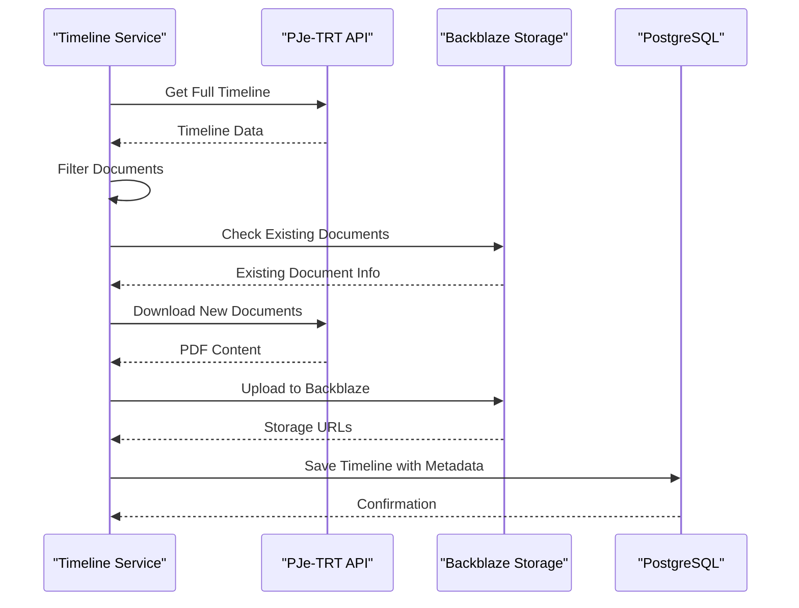

**Diagram sources**
- [timeline-capture.service.ts](file://src/app/(authenticated)/captura/services/timeline/timeline-capture.service.ts#L124-L429)

**Section sources**
- [pendentes-manifestacao.service.ts](file://src/app/(authenticated)/captura/services/trt/pendentes-manifestacao.service.ts#L1-L526)
- [timeline-capture.service.ts](file://src/app/(authenticated)/captura/services/timeline/timeline-capture.service.ts#L1-L429)

## Data Management

### Database Schema Evolution

The system maintains a comprehensive database schema that has evolved to support complex legal data management requirements:

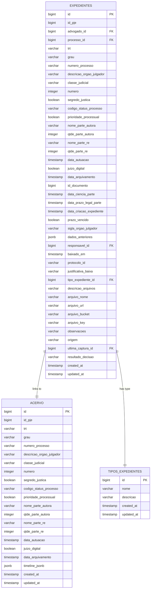

**Diagram sources**
- [repository.ts](file://src/app/(authenticated)/expedientes/repository.ts#L22-L70)
- [20251204140000_add_comunica_cnj_integration.sql:11-43](file://supabase/migrations/20251204140000_add_comunica_cnj_integration.sql#L11-L43)

### Data Integrity and Auditing

The system implements comprehensive data integrity measures including:

1. **Optimistic Concurrency Control**: Uses `updated_at` timestamps to prevent concurrent modification conflicts
2. **Audit Trail**: Maintains `dados_anteriores` field containing previous state for all updates
3. **Transaction Safety**: Employs PostgreSQL functions for atomic operations
4. **Validation Layers**: Implements multi-tier validation using Zod schemas and database constraints

**Section sources**
- [repository.ts](file://src/app/(authenticated)/expedientes/repository.ts#L507-L625)
- [pendentes-persistence.service.ts](file://src/app/(authenticated)/captura/services/persistence/pendentes-persistence.service.ts#L216-L280)

## Integration Points

### PJe-TRT Integration

The system integrates deeply with the PJe-TRT platform through a sophisticated authentication and data extraction mechanism:

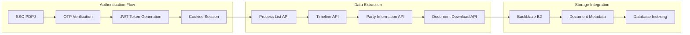

**Diagram sources**
- [pendentes-manifestacao.service.ts](file://src/app/(authenticated)/captura/services/trt/pendentes-manifestacao.service.ts#L143-L151)

### Comunica CNJ Integration

The system includes comprehensive integration with the Comunica CNJ platform for automated legal communication processing:

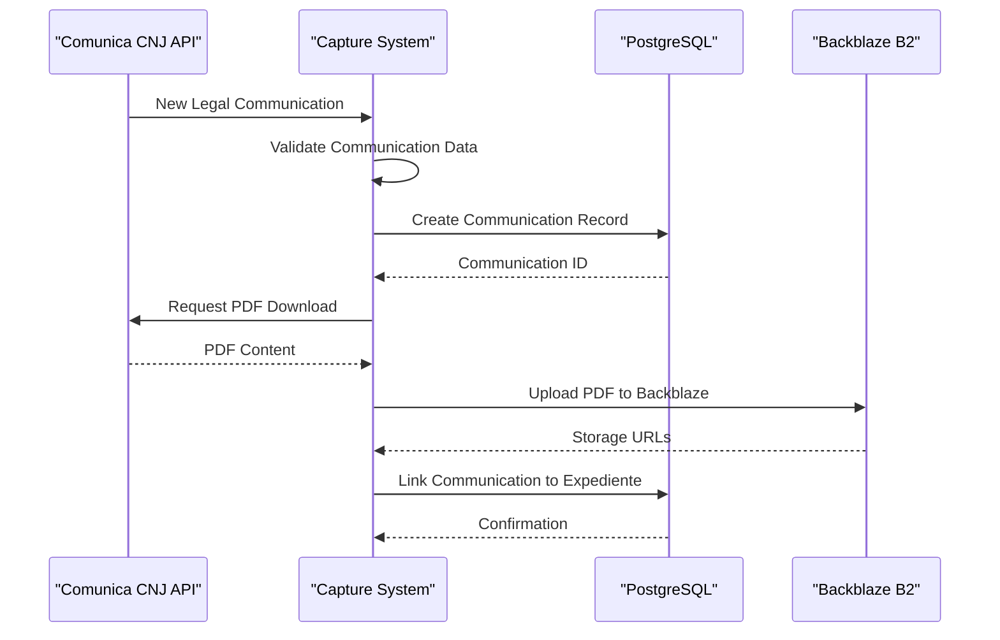

**Diagram sources**
- [20251204140000_add_comunica_cnj_integration.sql:97-165](file://supabase/migrations/20251204140000_add_comunica_cnj_integration.sql#L97-L165)

**Section sources**
- [pendentes-manifestacao.service.ts](file://src/app/(authenticated)/captura/services/trt/pendentes-manifestacao.service.ts#L1-L526)
- [20251204140000_add_comunica_cnj_integration.sql:1-216](file://supabase/migrations/20251204140000_add_comunica_cnj_integration.sql#L1-L216)

## Performance Considerations

### Optimistic Concurrency Control

The system implements sophisticated concurrency control mechanisms to prevent data conflicts during simultaneous updates:

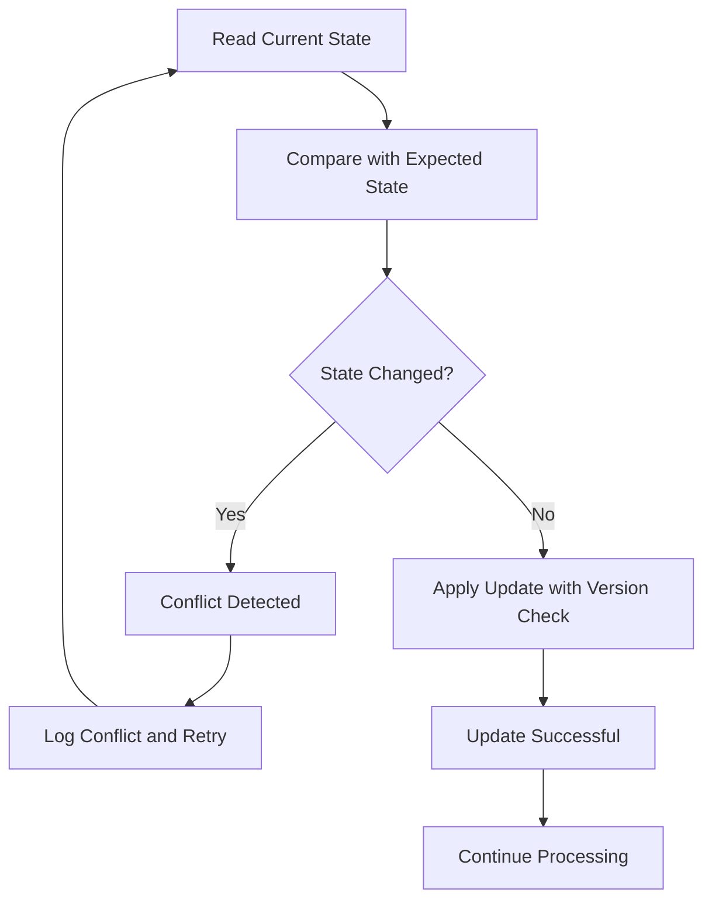

**Diagram sources**
- [pendentes-persistence.service.ts](file://src/app/(authenticated)/captura/services/persistence/pendentes-persistence.service.ts#L236-L268)

### Batch Processing Optimization

The system employs extensive batch processing to minimize database overhead:

1. **Batch Lookups**: Single queries for multiple records instead of individual lookups
2. **Bulk Inserts**: Optimized insertion strategies for large datasets
3. **Connection Pooling**: Efficient database connection management
4. **Index Utilization**: Strategic indexing for frequently queried fields

### Memory Management

The system implements careful memory management for large-scale data processing:

- **Streaming Downloads**: Progressive document downloading to manage memory usage
- **Lazy Loading**: Deferred loading of non-critical data
- **Resource Cleanup**: Automatic cleanup of temporary resources
- **Timeout Management**: Configurable timeouts for external API calls

**Section sources**
- [pendentes-persistence.service.ts](file://src/app/(authenticated)/captura/services/persistence/pendentes-persistence.service.ts#L130-L156)
- [timeline-capture.service.ts](file://src/app/(authenticated)/captura/services/timeline/timeline-capture.service.ts#L246-L372)

## Error Handling

### Comprehensive Error Management

The system implements multi-layered error handling across all components:

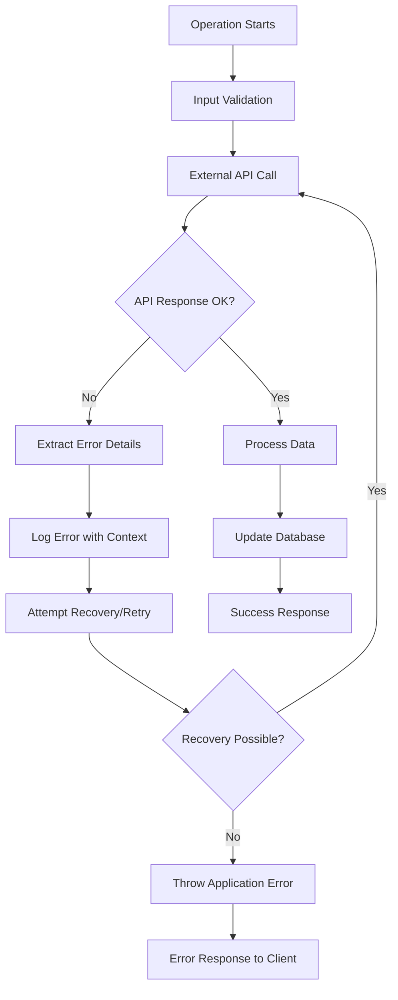

**Diagram sources**
- [pendentes-manifestacao.service.ts](file://src/app/(authenticated)/captura/services/trt/pendentes-manifestacao.service.ts#L396-L401)

### Error Classification and Response

The system categorizes errors into distinct types with appropriate handling strategies:

1. **Validation Errors**: Input validation failures with specific field-level error reporting
2. **External API Errors**: Network and service availability issues with retry logic
3. **Database Errors**: Constraint violations and transaction failures with rollback
4. **System Errors**: Internal failures with comprehensive logging and monitoring

### Monitoring and Logging

The system implements comprehensive monitoring across all operational areas:

- **Structured Logging**: Consistent log formatting with contextual information
- **Performance Metrics**: Timing and throughput measurements for all operations
- **Error Tracking**: Centralized error collection and analysis
- **Audit Trails**: Complete transaction history for all data modifications

**Section sources**
- [pendentes-manifestacao.service.ts](file://src/app/(authenticated)/captura/services/trt/pendentes-manifestacao.service.ts#L270-L285)
- [timeline-capture.service.ts](file://src/app/(authenticated)/captura/services/timeline/timeline-capture.service.ts#L345-L359)

## Security Model

### Multi-Layered Security Architecture

The system implements comprehensive security measures across all operational domains:

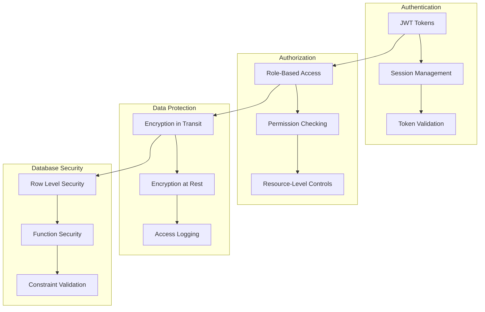

**Diagram sources**
- [repository.ts](file://src/app/(authenticated)/expedientes/repository.ts#L552-L625)

### Data Privacy and Compliance

The system incorporates legal compliance measures for sensitive legal data:

1. **Segredo de Justiça**: Special handling for confidential legal matters
2. **Data Minimization**: Collection and retention of only necessary information
3. **Access Controls**: Strict permissions for sensitive legal documents
4. **Audit Logging**: Complete tracking of all data access and modifications

### Secure Document Storage

The system implements secure document management for legal PDFs:

- **Encrypted Storage**: Documents stored with encryption at rest
- **Access Control**: Controlled access to legal documents
- **Retention Policies**: Automated lifecycle management for legal documents
- **Integrity Verification**: Cryptographic verification of stored documents

**Section sources**
- [repository.ts](file://src/app/(authenticated)/expedientes/repository.ts#L552-L594)
- [timeline-capture.service.ts](file://src/app/(authenticated)/captura/services/timeline/timeline-capture.service.ts#L308-L331)

## Monitoring and Tracking

### Capture Execution Tracking

The system provides comprehensive tracking of all capture operations:

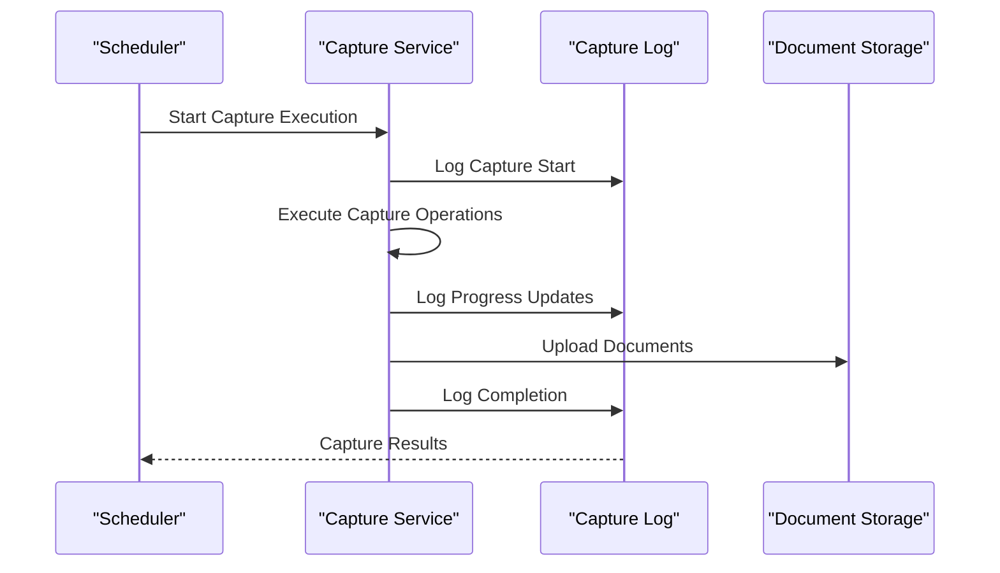

**Diagram sources**
- [repository.ts](file://src/app/(authenticated)/expedientes/repository.ts#L759-L799)

### Performance Monitoring

The system implements comprehensive performance monitoring:

1. **Execution Metrics**: Timing and resource usage for all operations
2. **Throughput Tracking**: Volume and rate of processed legal documents
3. **Error Rate Monitoring**: Quality metrics for capture operations
4. **Storage Utilization**: Document storage and retrieval performance

### Audit and Compliance

The system maintains complete audit trails for all operations:

- **Transaction Logs**: Complete history of all data modifications
- **User Activity**: Detailed tracking of user actions and permissions
- **System Events**: Comprehensive logging of system operations and maintenance
- **Compliance Reporting**: Automated generation of compliance documentation

**Section sources**
- [repository.ts](file://src/app/(authenticated)/expedientes/repository.ts#L759-L799)
- [20260427090510_add_ultima_captura_id_to_expedientes.sql:1-14](file://supabase/migrations/20260427090510_add_ultima_captura_id_to_expedientes.sql#L1-L14)

## Conclusion

The Expedientes Capture Tracking System represents a comprehensive solution for legal process automation, combining advanced web scraping technologies with robust database management and document storage systems. The system successfully addresses the complex requirements of legal practice management while maintaining strict adherence to legal compliance and data security standards.

Key achievements of the system include:

- **Automated Legal Process Capture**: Seamless integration with PJe-TRT for real-time legal proceeding updates
- **Comprehensive Data Management**: Sophisticated database schema supporting complex legal metadata
- **Secure Document Handling**: Encrypted storage and controlled access to sensitive legal documents
- **Performance Optimization**: Efficient batch processing and memory management for large-scale operations
- **Robust Error Handling**: Comprehensive error management with recovery and retry mechanisms
- **Audit Compliance**: Complete tracking and logging for legal compliance requirements

The system's modular architecture enables future enhancements and extensions while maintaining stability and reliability. The implementation demonstrates best practices in enterprise software development, particularly in handling sensitive data and complex business logic within the legal domain.

Future development opportunities include enhanced AI-powered document analysis, expanded integration with additional legal platforms, and advanced analytics capabilities for legal practice management.