# Legal Process Management System

<cite>
**Referenced Files in This Document**
- [domain.ts](file://src/app/(authenticated)/processos/domain.ts)
- [timeline-unificada.ts](file://src/app/(authenticated)/acervo/timeline-unificada.ts)
- [04_acervo.sql](file://supabase/schemas/04_acervo.sql)
- [05_acervo_unificado_view.sql](file://supabase/schemas/05_acervo_unificado_view.sql)
- [17_processo_partes.sql](file://supabase/schemas/17_processo_partes.sql)
- [service.ts](file://src/app/(authenticated)/calendar/service.ts)
- [index.ts](file://scripts/captura/index.ts)
- [index.ts](file://scripts/sincronizacao/index.ts)
- [route.ts](file://src/app/api/captura/tribunais/route.ts)
- [route.ts](file://src/app/api/captura/tribunais/[id]/route.ts)
- [audit-log.service.ts](file://src/lib/domain/audit/services/audit-log.service.ts)
- [14_logs_alteracao.sql](file://supabase/schemas/14_logs_alteracao.sql)
- [design.md](file://openspec/changes/archive/2025-11-24-captura-partes-pje/design.md)
- [tasks.md](file://openspec/changes/archive/2025-11-24-captura-partes-pje/tasks.md)
- [spec.md](file://openspec/specs/audit-atividades/spec.md)
- [expedientes.tsx](file://src/app/(authenticated)/ajuda/content/expedientes.tsx)
- [data.ts](file://src/app/(authenticated)/agenda/mock/data.ts)
- [mock-data.ts](file://src/app/(authenticated)/agenda/components/mock-data.ts)
- [capture-log.service.ts](file://src/app/(authenticated)/captura/services/persistence/capture-log.service.ts)
- [errors.ts](file://src/app/(authenticated)/captura/services/partes/errors.ts)
- [distributed-lock.ts](file://src/lib/utils/locks/distributed-lock.ts)
- [server-action-error-handler.ts](file://src/lib/server-action-error-handler.ts)
- [errors.ts](file://src/shared/partes/errors.ts)
- [partes-form-actions.ts](file://src/app/(authenticated)/partes/actions/partes-form-actions.ts)
- [MASTER.md](file://design-system/zattaros/MASTER.md)
- [obrigacao-detalhes-dialog.tsx](file://src/app/(authenticated)/obrigacoes/components/dialogs/obrigacao-detalhes-dialog.tsx)
- [nova-obrigacao-dialog.tsx](file://src/app/(authenticated)/obrigacoes/components/dialogs/nova-obrigacao-dialog.tsx)
- [promover-transitoria-dialog.tsx](file://src/app/(authenticated)/partes/components/partes-contrarias/promover-transitoria-dialog.tsx)
- [cliente-form.tsx](file://src/app/(authenticated)/partes/components/clientes/cliente-form.tsx)
- [dialog.tsx](file://src/components/ui/dialog.tsx)
</cite>

## Update Summary
**Changes Made**
- Enhanced dialog components across legal process management modules with improved accessibility and semantic HTML structure
- Updated obrigacoes module with proper dialog patterns including inline editing and status management
- Updated partes module with comprehensive dialog patterns for partie management and promotion workflows
- Implemented standardized dialog shell components with proper focus management and keyboard navigation
- Added semantic labeling and screen reader support throughout dialog interfaces
- Enhanced dialog density and spacing patterns for better visual hierarchy

## Table of Contents
1. [Introduction](#introduction)
2. [Project Structure](#project-structure)
3. [Core Components](#core-components)
4. [Architecture Overview](#architecture-overview)
5. [Detailed Component Analysis](#detailed-component-analysis)
6. [Enhanced Dialog Patterns](#enhanced-dialog-patterns)
7. [Enhanced Error Handling System](#enhanced-error-handling-system)
8. [Dependency Analysis](#dependency-analysis)
9. [Performance Considerations](#performance-considerations)
10. [Troubleshooting Guide](#troubleshooting-guide)
11. [Conclusion](#conclusion)
12. [Appendices](#appendices)

## Introduction
This document describes the Legal Process Management System with a focus on unified legal case tracking and management. It explains the Processo entity model, the ProcessoUnificado view for multi-instance tracking, and the timeline/movimentations system. It documents automated data capture from PJE-TRT systems, data synchronization workflows, and unified process aggregation. It also covers status management, workflow automation, and audit trails, along with practical examples of process creation, updates, filtering, and reporting. The system now features enhanced dialog components across legal process management modules with improved accessibility and semantic HTML structure, providing better user experience and compliance with accessibility standards.

## Project Structure
The system is organized around:
- Domain models and validation for legal processes
- Database schema with core tables and a unified view
- Timeline aggregation service for multi-instance processes
- Calendar integration for audiências and expedientes
- Automated data capture and synchronization scripts with enhanced error handling
- Audit logging for compliance and traceability
- API routes for tribunal configuration and data capture
- Distributed locking mechanism for concurrent operation protection
- Structured error handling with semantic categorization
- **Enhanced Dialog Components**: Standardized dialog patterns across obrigacoes and partes modules with improved accessibility and semantic structure

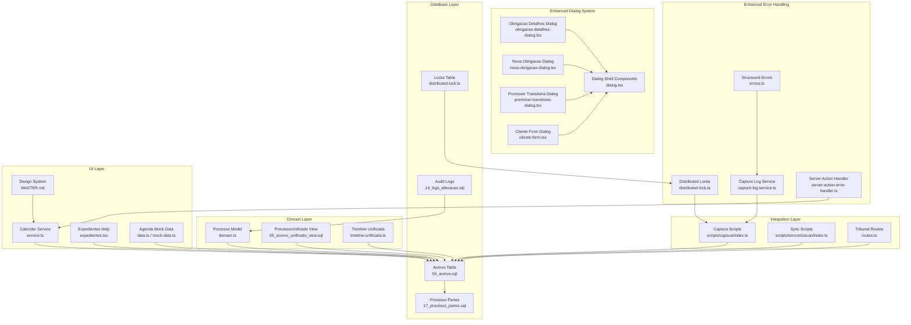

**Diagram sources**
- [domain.ts](file://src/app/(authenticated)/processos/domain.ts#L75-L118)
- [05_acervo_unificado_view.sql:44-151](file://supabase/schemas/05_acervo_unificado_view.sql#L44-L151)
- [timeline-unificada.ts](file://src/app/(authenticated)/acervo/timeline-unificada.ts#L169-L178)
- [04_acervo.sql:4-32](file://supabase/schemas/04_acervo.sql#L4-L32)
- [17_processo_partes.sql:6-69](file://supabase/schemas/17_processo_partes.sql#L6-L69)
- [index.ts:1-177](file://scripts/captura/index.ts#L1-L177)
- [index.ts:1-234](file://scripts/sincronizacao/index.ts#L1-L234)
- [route.ts:130-171](file://src/app/api/captura/tribunais/route.ts#L130-L171)
- [service.ts](file://src/app/(authenticated)/calendar/service.ts#L88-L127)
- [capture-log.service.ts](file://src/app/(authenticated)/captura/services/persistence/capture-log.service.ts#L65-L234)
- [errors.ts](file://src/app/(authenticated)/captura/services/partes/errors.ts#L9-L109)
- [distributed-lock.ts:25-147](file://src/lib/utils/locks/distributed-lock.ts#L25-L147)
- [server-action-error-handler.ts:21-53](file://src/lib/server-action-error-handler.ts#L21-L53)
- [obrigacao-detalhes-dialog.tsx](file://src/app/(authenticated)/obrigacoes/components/dialogs/obrigacao-detalhes-dialog.tsx#L360-L390)
- [nova-obrigacao-dialog.tsx](file://src/app/(authenticated)/obrigacoes/components/dialogs/nova-obrigacao-dialog.tsx#L97-L106)
- [promover-transitoria-dialog.tsx](file://src/app/(authenticated)/partes/components/partes-contrarias/promover-transitoria-dialog.tsx#L234-L243)
- [cliente-form.tsx](file://src/app/(authenticated)/partes/components/clientes/cliente-form.tsx#L43-L48)
- [dialog.tsx](file://src/components/ui/dialog.tsx)

**Section sources**
- [domain.ts](file://src/app/(authenticated)/processos/domain.ts#L1-L674)
- [04_acervo.sql:1-77](file://supabase/schemas/04_acervo.sql#L1-L77)
- [05_acervo_unificado_view.sql:1-247](file://supabase/schemas/05_acervo_unificado_view.sql#L1-L247)
- [17_processo_partes.sql:1-144](file://supabase/schemas/17_processo_partes.sql#L1-L144)
- [index.ts:1-177](file://scripts/captura/index.ts#L1-L177)
- [index.ts:1-234](file://scripts/sincronizacao/index.ts#L1-L234)
- [route.ts:130-171](file://src/app/api/captura/tribunais/route.ts#L130-L171)

## Core Components
- Processo entity model: Complete mapping of the acervo table with validation schemas, sorting, filtering, and CNJ number validation.
- ProcessoUnificado view: Materialized view that aggregates multi-instance processes (first, second, superior courts) and identifies the current instance.
- Timeline/Movimentations: Timeline unification service that merges events across instances and applies deduplication.
- ProcessoPartes: N:N relationship between processes and parties (clients, adverse parties, third parties), enabling unified party tracking.
- Audit trail: Centralized logs for ownership changes and other business events.
- Calendar integration: Unified calendar events for audiências and expedientes, including scheduling and reminders.
- Data capture and sync: Scripts for capturing PJE-TRT data and synchronizing entities and relationships with enhanced error handling.
- **Enhanced Dialog Components**: Standardized dialog patterns across obrigacoes and partes modules with improved accessibility, semantic HTML structure, and proper focus management.
- **Enhanced Error Handling**: Structured error types with semantic categorization, conflict detection for concurrent operations, and comprehensive logging.
- **Distributed Locking**: Mechanism to prevent concurrent operations on the same resources.
- **Server Action Error Handling**: Automatic detection and recovery from version mismatch errors.

**Section sources**
- [domain.ts](file://src/app/(authenticated)/processos/domain.ts#L75-L118)
- [domain.ts](file://src/app/(authenticated)/processos/domain.ts#L147-L165)
- [timeline-unificada.ts](file://src/app/(authenticated)/acervo/timeline-unificada.ts#L1-L195)
- [17_processo_partes.sql:6-69](file://supabase/schemas/17_processo_partes.sql#L6-L69)
- [audit-log.service.ts:1-50](file://src/lib/domain/audit/services/audit-log.service.ts#L1-L50)
- [service.ts](file://src/app/(authenticated)/calendar/service.ts#L88-L127)
- [index.ts:1-177](file://scripts/captura/index.ts#L1-L177)
- [index.ts:1-234](file://scripts/sincronizacao/index.ts#L1-L234)
- [capture-log.service.ts](file://src/app/(authenticated)/captura/services/persistence/capture-log.service.ts#L65-L234)
- [errors.ts](file://src/app/(authenticated)/captura/services/partes/errors.ts#L9-L109)
- [distributed-lock.ts:25-147](file://src/lib/utils/locks/distributed-lock.ts#L25-L147)
- [server-action-error-handler.ts:21-53](file://src/lib/server-action-error-handler.ts#L21-L53)
- [obrigacao-detalhes-dialog.tsx](file://src/app/(authenticated)/obrigacoes/components/dialogs/obrigacao-detalhes-dialog.tsx#L360-L390)
- [nova-obrigacao-dialog.tsx](file://src/app/(authenticated)/obrigacoes/components/dialogs/nova-obrigacao-dialog.tsx#L97-L106)
- [promover-transitoria-dialog.tsx](file://src/app/(authenticated)/partes/components/partes-contrarias/promover-transitoria-dialog.tsx#L234-L243)
- [cliente-form.tsx](file://src/app/(authenticated)/partes/components/clientes/cliente-form.tsx#L43-L48)

## Architecture Overview
The system follows a layered architecture with enhanced dialog components and error handling:
- Domain layer defines entities, enums, and validation rules for legal processes.
- Database layer persists core entities and exposes a materialized view for unified process display.
- Integration layer orchestrates automated capture and synchronization with PJE-TRT systems using distributed locks and structured error handling.
- UI layer consumes unified views and calendar services to present audiências and expedientes with improved visual hierarchy and accessibility.
- Dialog layer provides standardized dialog patterns with semantic HTML structure and proper accessibility features.
- Audit layer ensures compliance and traceability of ownership and process changes.
- Error handling layer provides comprehensive error categorization, conflict detection, and recovery mechanisms.

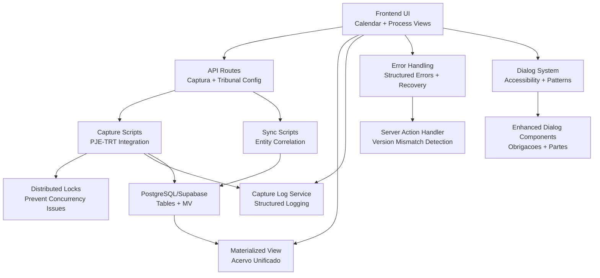

**Diagram sources**
- [route.ts:130-171](file://src/app/api/captura/tribunais/route.ts#L130-L171)
- [route.ts:20-62](file://src/app/api/captura/tribunais/[id]/route.ts#L20-L62)
- [index.ts:1-177](file://scripts/captura/index.ts#L1-L177)
- [index.ts:1-234](file://scripts/sincronizacao/index.ts#L1-L234)
- [05_acervo_unificado_view.sql:44-151](file://supabase/schemas/05_acervo_unificado_view.sql#L44-L151)
- [14_logs_alteracao.sql:6-16](file://supabase/schemas/14_logs_alteracao.sql#L6-L16)
- [capture-log.service.ts](file://src/app/(authenticated)/captura/services/persistence/capture-log.service.ts#L65-L234)
- [errors.ts](file://src/app/(authenticated)/captura/services/partes/errors.ts#L9-L109)
- [distributed-lock.ts:25-147](file://src/lib/utils/locks/distributed-lock.ts#L25-L147)
- [server-action-error-handler.ts:21-53](file://src/lib/server-action-error-handler.ts#L21-L53)
- [obrigacao-detalhes-dialog.tsx](file://src/app/(authenticated)/obrigacoes/components/dialogs/obrigacao-detalhes-dialog.tsx#L360-L390)
- [nova-obrigacao-dialog.tsx](file://src/app/(authenticated)/obrigacoes/components/dialogs/nova-obrigacao-dialog.tsx#L97-L106)
- [promover-transitoria-dialog.tsx](file://src/app/(authenticated)/partes/components/partes-contrarias/promover-transitoria-dialog.tsx#L234-L243)

## Detailed Component Analysis

### Processo Entity Model
The Processo entity mirrors the acervo table with derived status mapping from PJE codes. It includes:
- Required fields: PJE ID, attorney, origin, TRT, degree, CNJ number, court description, classes, parties, dates, digital court flag, associations, and timestamps.
- Validation schemas for creation, updates, and manual creation without PJE data.
- Sorting, filtering, pagination parameters, and CNJ format validation.
- Column selection helpers to optimize disk I/O for listing vs. detail views.

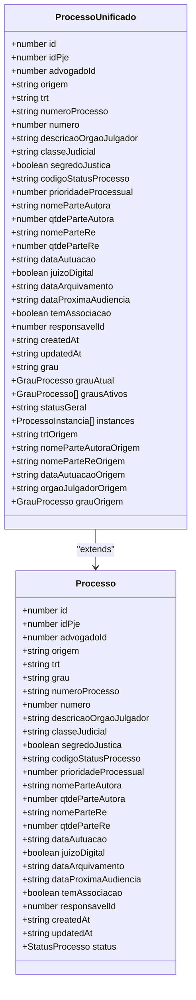

**Diagram sources**
- [domain.ts](file://src/app/(authenticated)/processos/domain.ts#L90-L118)
- [domain.ts](file://src/app/(authenticated)/processos/domain.ts#L147-L165)

**Section sources**
- [domain.ts](file://src/app/(authenticated)/processos/domain.ts#L75-L118)
- [domain.ts](file://src/app/(authenticated)/processos/domain.ts#L147-L165)
- [domain.ts](file://src/app/(authenticated)/processos/domain.ts#L210-L283)
- [domain.ts](file://src/app/(authenticated)/processos/domain.ts#L360-L393)
- [domain.ts](file://src/app/(authenticated)/processos/domain.ts#L404-L460)
- [domain.ts](file://src/app/(authenticated)/processos/domain.ts#L568-L570)

### ProcessoUnificado View (Multi-Instance Aggregation)
The materialized view aggregates instances of the same process across degrees (first, second, superior) and identifies the current instance by latest autuation date and updated timestamp. It exposes:
- Current instance fields (grau_atual)
- Active degrees array
- Instances JSONB with per-degree metadata and a flag indicating the current instance
- Indexes optimized for performance and refresh strategies

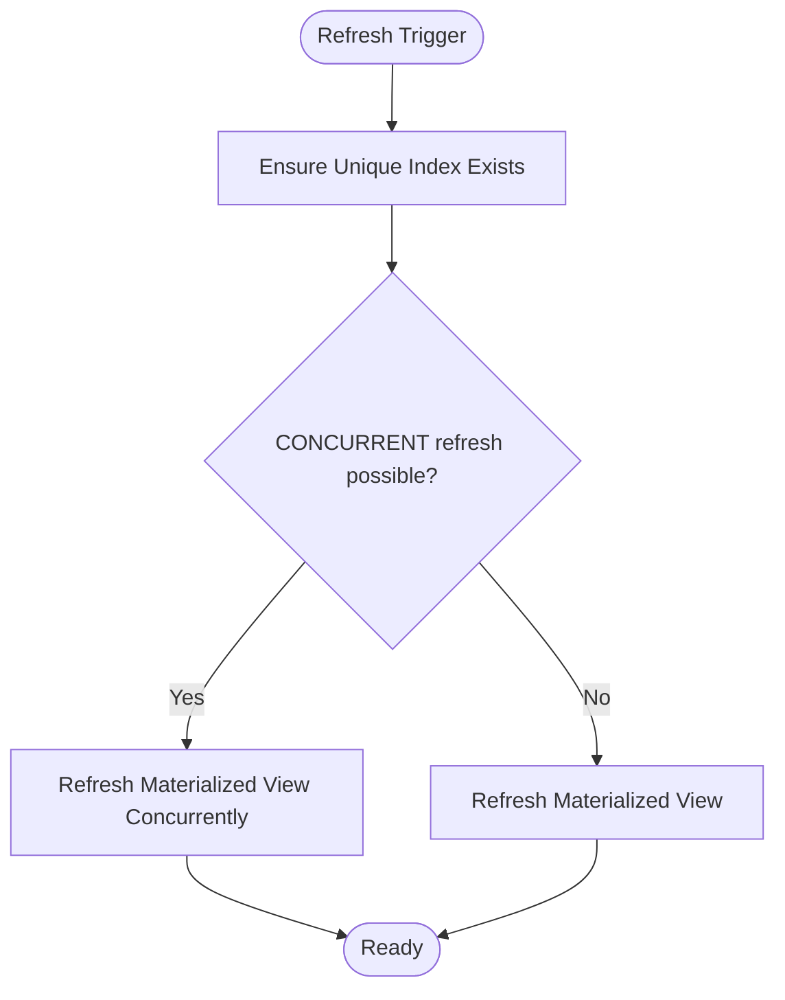

**Diagram sources**
- [05_acervo_unificado_view.sql:173-194](file://supabase/schemas/05_acervo_unificado_view.sql#L173-L194)

**Section sources**
- [05_acervo_unificado_view.sql:44-151](file://supabase/schemas/05_acervo_unificado_view.sql#L44-L151)
- [05_acervo_unificado_view.sql:171-196](file://supabase/schemas/05_acervo_unificado_view.sql#L171-L196)

### Timeline/Movimentations System
The timeline unification service:
- Retrieves all instances of a process by CNJ
- Fetches timeline JSONB from each instance
- Builds enriched items with source degree, TRT, and instance ID
- Applies deduplication using a hash built from event attributes
- Returns a unified timeline ordered chronologically

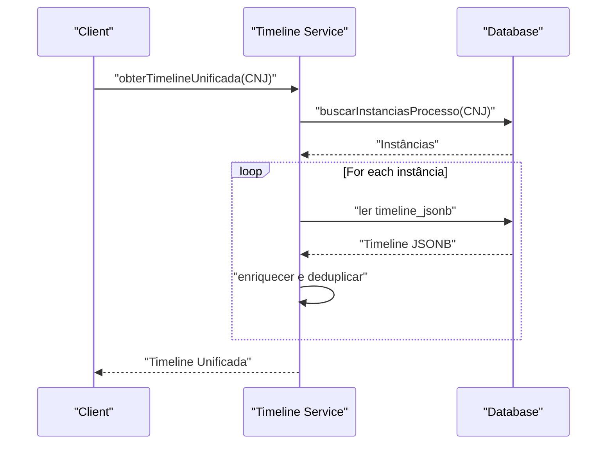

**Diagram sources**
- [timeline-unificada.ts](file://src/app/(authenticated)/acervo/timeline-unificada.ts#L169-L178)
- [timeline-unificada.ts](file://src/app/(authenticated)/acervo/timeline-unificada.ts#L180-L195)

**Section sources**
- [timeline-unificada.ts](file://src/app/(authenticated)/acervo/timeline-unificada.ts#L1-L195)

### ProcessoPartes Relationship
The processo_partes table establishes N:N relationships between processes and parties:
- Polymorphic foreign keys for clients, adverse parties, and third parties
- PJE identifiers and participation type mapping
- Polo (party side) and order within the side
- Constraints to prevent duplicates per process-degree combination
- Indexes for performance and RLS policies

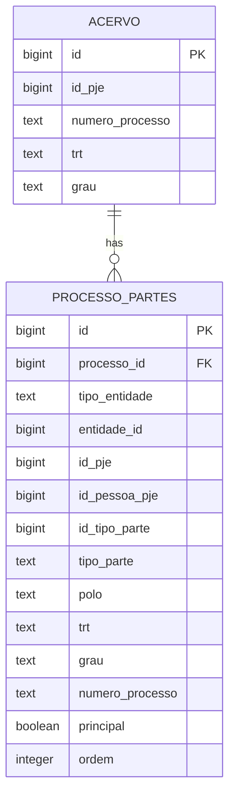

**Diagram sources**
- [17_processo_partes.sql:6-69](file://supabase/schemas/17_processo_partes.sql#L6-L69)
- [04_acervo.sql:4-32](file://supabase/schemas/04_acervo.sql#L4-L32)

**Section sources**
- [17_processo_partes.sql:6-69](file://supabase/schemas/17_processo_partes.sql#L6-L69)
- [17_processo_partes.sql:98-107](file://supabase/schemas/17_processo_partes.sql#L98-L107)

### Calendar Integration: Audiências and Expedientes
The calendar service converts audiências and expedientes into unified calendar events:
- Audiências: Title, start/end, source, metadata (process ID, CNJ, TRT, degree, status, modalities, venue/virtual link)
- Expedientes: Title, all-day events, metadata (process ID, CNJ, TRT, class, deadline status)
- Unified event IDs and color coding for UI presentation

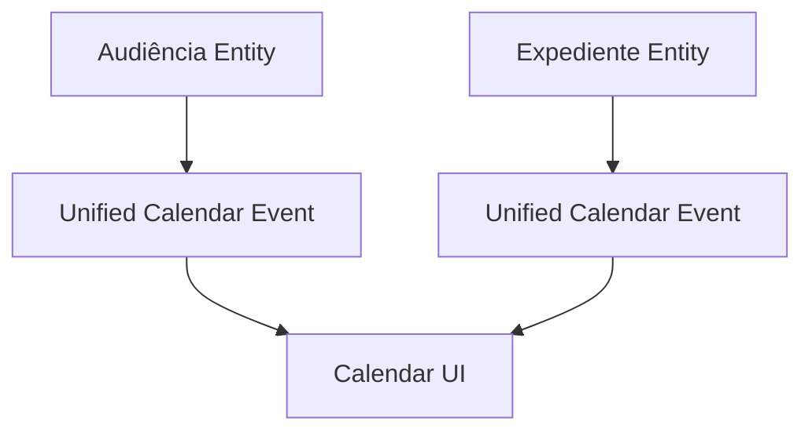

**Diagram sources**
- [service.ts](file://src/app/(authenticated)/calendar/service.ts#L88-L127)

**Section sources**
- [service.ts](file://src/app/(authenticated)/calendar/service.ts#L88-L127)
- [expedientes.tsx](file://src/app/(authenticated)/ajuda/content/expedientes.tsx#L146-L207)
- [data.ts](file://src/app/(authenticated)/agenda/mock/data.ts#L294-L352)
- [mock-data.ts](file://src/app/(authenticated)/agenda/components/mock-data.ts#L277-L354)

### Automated Data Capture from PJE-TRT Systems
The capture and synchronization scripts orchestrate:
- Development/test scripts for PJE/TRT data capture (acervo, audiências, partes, pendentes, timeline)
- Synchronization scripts for users, entities, and process-party correlation
- API routes for tribunal configuration and access parameters
- **Enhanced Error Handling**: Structured error types with semantic categorization, conflict detection, and comprehensive logging
- **Distributed Locking**: Prevents concurrent operations on the same resources during capture
- Performance considerations: parallel tasks, rate limiting, and batch processing

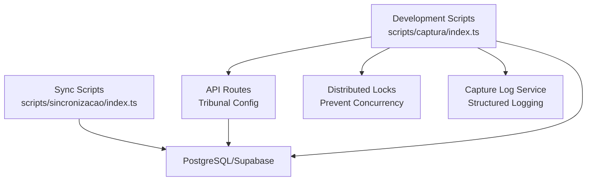

**Diagram sources**
- [index.ts:1-177](file://scripts/captura/index.ts#L1-L177)
- [index.ts:1-234](file://scripts/sincronizacao/index.ts#L1-L234)
- [route.ts:130-171](file://src/app/api/captura/tribunais/route.ts#L130-L171)
- [distributed-lock.ts:25-147](file://src/lib/utils/locks/distributed-lock.ts#L25-L147)
- [capture-log.service.ts](file://src/app/(authenticated)/captura/services/persistence/capture-log.service.ts#L65-L234)

**Section sources**
- [index.ts:1-177](file://scripts/captura/index.ts#L1-L177)
- [index.ts:1-234](file://scripts/sincronizacao/index.ts#L1-L234)
- [route.ts:130-171](file://src/app/api/captura/tribunais/route.ts#L130-L171)
- [route.ts:20-62](file://src/app/api/captura/tribunais/[id]/route.ts#L20-L62)
- [design.md:235-250](file://openspec/changes/archive/2025-11-24-captura-partes-pje/design.md#L235-L250)
- [tasks.md:602-615](file://openspec/changes/archive/2025-11-24-captura-partes-pje/tasks.md#L602-L615)

### Audit Trails and Compliance
The audit log system tracks ownership changes and other business events:
- Centralized logs with entity type, entity ID, event type, actor, previous/new responsible, and flexible JSONB payload
- Repository service to fetch logs with user joins for display
- Policies and indices for performance and security

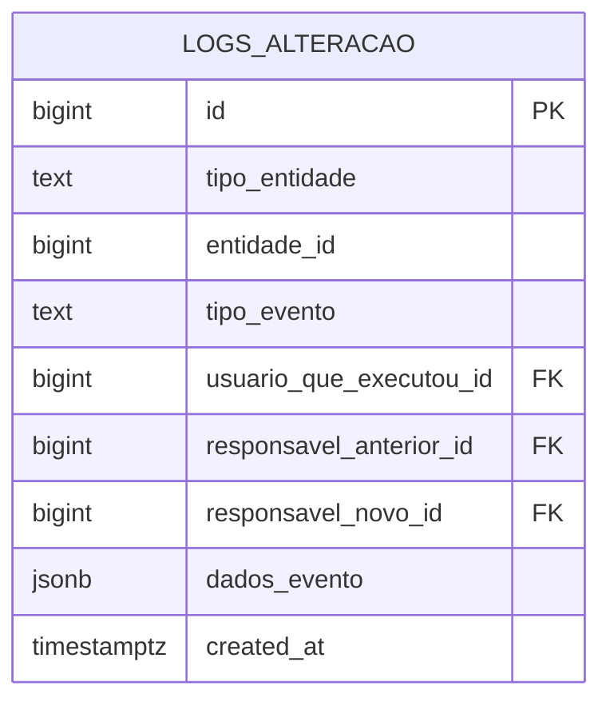

**Diagram sources**
- [14_logs_alteracao.sql:6-16](file://supabase/schemas/14_logs_alteracao.sql#L6-L16)
- [audit-log.service.ts:1-50](file://src/lib/domain/audit/services/audit-log.service.ts#L1-L50)

**Section sources**
- [14_logs_alteracao.sql:6-16](file://supabase/schemas/14_logs_alteracao.sql#L6-L16)
- [audit-log.service.ts:1-50](file://src/lib/domain/audit/services/audit-log.service.ts#L1-L50)
- [spec.md:1-28](file://openspec/specs/audit-atividades/spec.md#L1-L28)

## Enhanced Dialog Patterns

### Standardized Dialog Architecture
The system now features enhanced dialog components across legal process management modules with improved accessibility and semantic HTML structure:

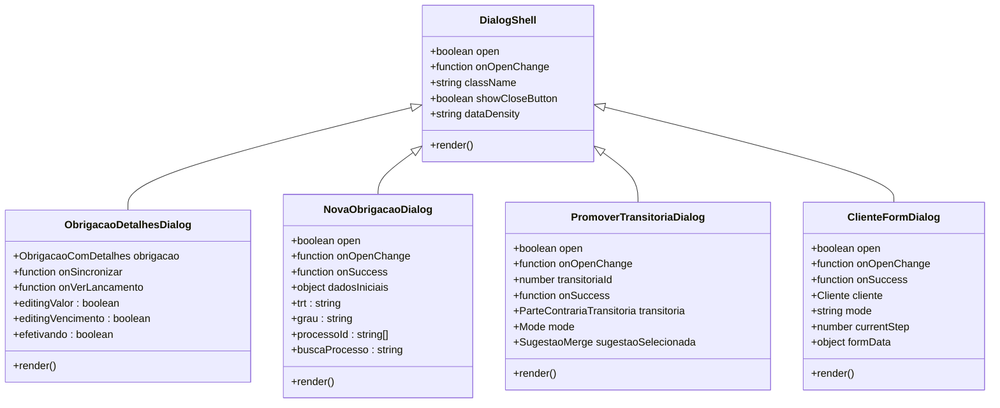

**Diagram sources**
- [obrigacao-detalhes-dialog.tsx](file://src/app/(authenticated)/obrigacoes/components/dialogs/obrigacao-detalhes-dialog.tsx#L64-L70)
- [nova-obrigacao-dialog.tsx](file://src/app/(authenticated)/obrigacoes/components/dialogs/nova-obrigacao-dialog.tsx#L23-L33)
- [promover-transitoria-dialog.tsx](file://src/app/(authenticated)/partes/components/partes-contrarias/promover-transitoria-dialog.tsx#L49-L54)
- [cliente-form.tsx](file://src/app/(authenticated)/partes/components/clientes/cliente-form.tsx#L55-L61)

### Accessibility and Semantic HTML Improvements
Enhanced dialog components now feature:
- Proper semantic labeling with DialogTitle and DialogDescription components
- Screen reader support with sr-only descriptions for complex dialogs
- Keyboard navigation and focus management
- Accessible form controls with proper labeling
- Semantic section headers using Text variant="overline"
- Proper ARIA attributes for enhanced accessibility

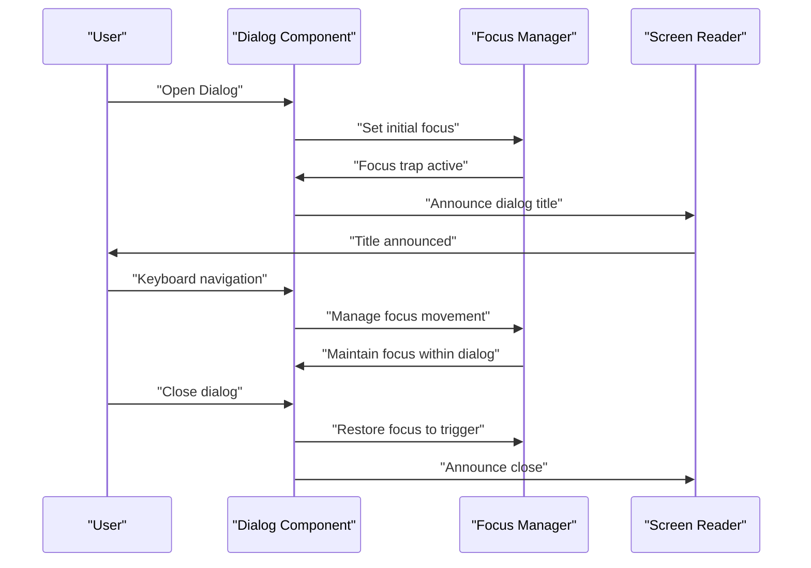

**Diagram sources**
- [obrigacao-detalhes-dialog.tsx](file://src/app/(authenticated)/obrigacoes/components/dialogs/obrigacao-detalhes-dialog.tsx#L360-L390)
- [nova-obrigacao-dialog.tsx](file://src/app/(authenticated)/obrigacoes/components/dialogs/nova-obrigacao-dialog.tsx#L97-L106)
- [promover-transitoria-dialog.tsx](file://src/app/(authenticated)/partes/components/partes-contrarias/promover-transitoria-dialog.tsx#L234-L243)
- [cliente-form.tsx](file://src/app/(authenticated)/partes/components/clientes/cliente-form.tsx#L43-L48)

### Inline Editing Patterns
The obrigacoes module implements sophisticated inline editing patterns:
- Value editing with draft state management
- Date editing with proper date formatting
- Status management with visual indicators
- Real-time validation and feedback
- Undo/redo capabilities through draft state

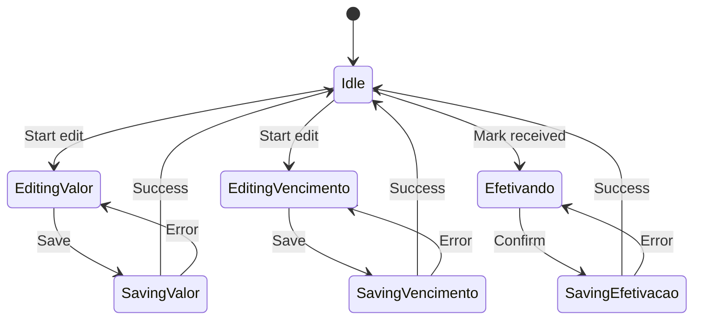

**Diagram sources**
- [obrigacao-detalhes-dialog.tsx](file://src/app/(authenticated)/obrigacoes/components/dialogs/obrigacao-detalhes-dialog.tsx#L204-L224)

### Dialog Density and Spacing Patterns
Standardized dialog density and spacing patterns ensure consistent user experience:
- Comfortable density for complex forms
- Appropriate spacing for different content types
- Responsive design patterns
- Scrollable content areas with proper overflow handling
- Consistent header/footer layouts

**Section sources**
- [obrigacao-detalhes-dialog.tsx](file://src/app/(authenticated)/obrigacoes/components/dialogs/obrigacao-detalhes-dialog.tsx#L360-L390)
- [nova-obrigacao-dialog.tsx](file://src/app/(authenticated)/obrigacoes/components/dialogs/nova-obrigacao-dialog.tsx#L97-L106)
- [promover-transitoria-dialog.tsx](file://src/app/(authenticated)/partes/components/partes-contrarias/promover-transitoria-dialog.tsx#L234-L243)
- [cliente-form.tsx](file://src/app/(authenticated)/partes/components/clientes/cliente-form.tsx#L43-L48)

## Enhanced Error Handling System

### Structured Error Types
The system now uses structured error types with semantic categorization for better error handling and user experience:

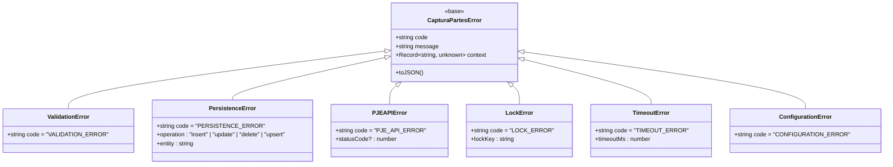

**Diagram sources**
- [errors.ts](file://src/app/(authenticated)/captura/services/partes/errors.ts#L9-L109)

### Conflict Detection and Distributed Locking
The system implements distributed locking to prevent concurrent operations on the same resources:

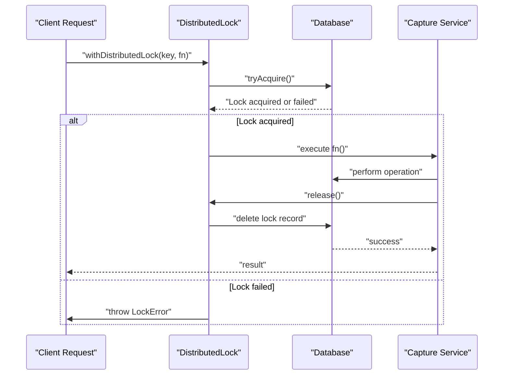

**Diagram sources**
- [distributed-lock.ts:133-147](file://src/lib/utils/locks/distributed-lock.ts#L133-L147)

### Comprehensive Logging System
The capture log service provides structured logging for all operations with conflict detection:

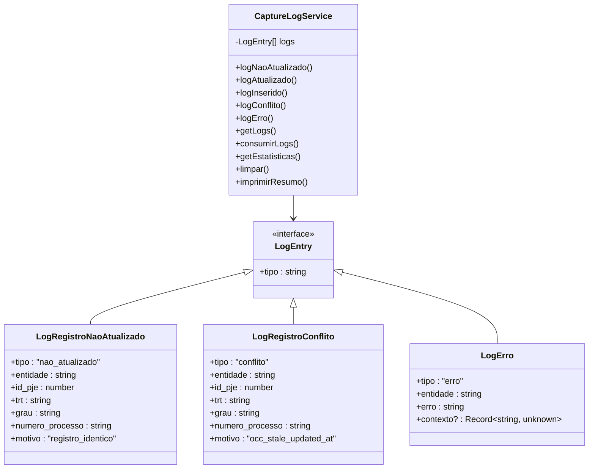

**Diagram sources**
- [capture-log.service.ts](file://src/app/(authenticated)/captura/services/persistence/capture-log.service.ts#L65-L234)

### Server Action Error Handling
The system includes automatic error handling for server action version mismatches:

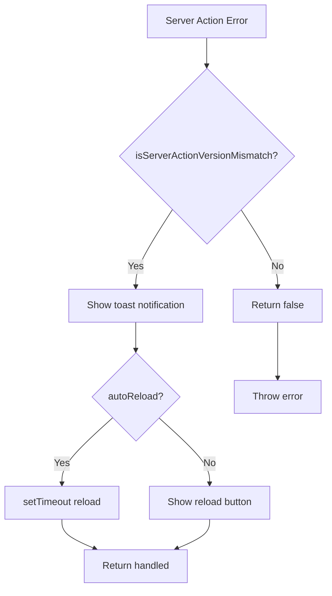

**Diagram sources**
- [server-action-error-handler.ts:21-53](file://src/lib/server-action-error-handler.ts#L21-L53)

**Section sources**
- [capture-log.service.ts](file://src/app/(authenticated)/captura/services/persistence/capture-log.service.ts#L65-L234)
- [errors.ts](file://src/app/(authenticated)/captura/services/partes/errors.ts#L9-L109)
- [distributed-lock.ts:25-147](file://src/lib/utils/locks/distributed-lock.ts#L25-L147)
- [server-action-error-handler.ts:21-53](file://src/lib/server-action-error-handler.ts#L21-L53)
- [errors.ts:190-251](file://src/shared/partes/errors.ts#L190-L251)
- [partes-form-actions.ts](file://src/app/(authenticated)/partes/actions/partes-form-actions.ts#L57-L75)

## Dependency Analysis
Key dependencies and relationships:
- ProcessoUnificado depends on acervo instances and window functions to determine the current degree.
- TimelineUnificada depends on acervo timeline JSONB fields and deduplication logic.
- ProcessoPartes depends on acervo and supports polymorphic party relationships.
- Calendar service depends on audiências and expedientes entities.
- Audit logs depend on users and are indexed for fast retrieval.
- **Enhanced Dialog Components**: Dialog shell components provide standardized patterns across obrigacoes and partes modules.
- **Enhanced Error Handling**: Capture log service depends on structured error types and distributed locks.
- **Distributed Locking**: Used by capture services to prevent concurrent operations.
- **Server Action Error Handling**: Provides automatic recovery from version mismatch errors.

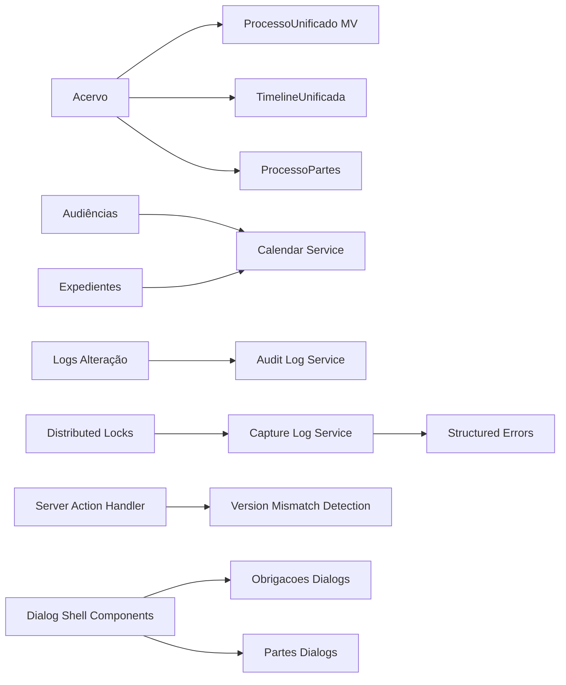

**Diagram sources**
- [05_acervo_unificado_view.sql:44-151](file://supabase/schemas/05_acervo_unificado_view.sql#L44-L151)
- [timeline-unificada.ts](file://src/app/(authenticated)/acervo/timeline-unificada.ts#L169-L178)
- [17_processo_partes.sql:6-69](file://supabase/schemas/17_processo_partes.sql#L6-L69)
- [service.ts](file://src/app/(authenticated)/calendar/service.ts#L88-L127)
- [audit-log.service.ts:1-50](file://src/lib/domain/audit/services/audit-log.service.ts#L1-L50)
- [capture-log.service.ts](file://src/app/(authenticated)/captura/services/persistence/capture-log.service.ts#L65-L234)
- [errors.ts](file://src/app/(authenticated)/captura/services/partes/errors.ts#L9-L109)
- [distributed-lock.ts:25-147](file://src/lib/utils/locks/distributed-lock.ts#L25-L147)
- [server-action-error-handler.ts:21-53](file://src/lib/server-action-error-handler.ts#L21-L53)
- [dialog.tsx](file://src/components/ui/dialog.tsx)

**Section sources**
- [05_acervo_unificado_view.sql:44-151](file://supabase/schemas/05_acervo_unificado_view.sql#L44-L151)
- [timeline-unificada.ts](file://src/app/(authenticated)/acervo/timeline-unificada.ts#L169-L178)
- [17_processo_partes.sql:6-69](file://supabase/schemas/17_processo_partes.sql#L6-L69)
- [service.ts](file://src/app/(authenticated)/calendar/service.ts#L88-L127)
- [audit-log.service.ts:1-50](file://src/lib/domain/audit/services/audit-log.service.ts#L1-L50)
- [capture-log.service.ts](file://src/app/(authenticated)/captura/services/persistence/capture-log.service.ts#L65-L234)
- [errors.ts](file://src/app/(authenticated)/captura/services/partes/errors.ts#L9-L109)
- [distributed-lock.ts:25-147](file://src/lib/utils/locks/distributed-lock.ts#L25-L147)
- [server-action-error-handler.ts:21-53](file://src/lib/server-action-error-handler.ts#L21-L53)
- [dialog.tsx](file://src/components/ui/dialog.tsx)

## Performance Considerations
- Materialized view refresh: Prefer concurrent refresh when possible; fall back to normal refresh if needed.
- Index coverage: Unique index on materialized view enables concurrent refresh; additional indexes support filtering and joins.
- Column selection: Use basic/full/unified column sets to minimize I/O during listing and detail operations.
- Parallelization: Capture and sync scripts leverage parallel tasks to improve throughput.
- Rate limiting: Apply delays between document captures and handle rate limits gracefully.
- Disk I/O optimization: Use column selection helpers and avoid unnecessary JSONB parsing.
- **Enhanced Dialog Components**: Standardized dialog patterns reduce rendering overhead and improve user experience.
- **Enhanced Error Handling**: Structured logging minimizes performance impact while providing comprehensive debugging information.
- **Distributed Locking**: Prevents wasted CPU cycles from concurrent operations on the same resources.
- **Server Action Error Handling**: Automatic recovery reduces user frustration and improves system reliability.

## Troubleshooting Guide
Common issues and resolutions:
- SERVICE_API_KEY not configured: Set the service API key in environment variables for development scripts.
- Authentication failure: Verify PJE credentials in the credentials table and ensure proper service role keys.
- Timeout errors: Increase timeouts or retry with backoff; verify network connectivity and Redis/Supabase availability.
- Duplicate key violations: Use upsert semantics or deduplicate before insertion; verify constraints and foreign keys.
- Foreign key constraint violations: Ensure referenced entities exist before linking; run dependency synchronization first.
- Materialized view refresh failures: Ensure unique index exists; use concurrent refresh when possible.
- **Enhanced Dialog Components**: Use proper dialog patterns and accessibility features for better user experience.
- **Capture Conflicts**: Use distributed locks to prevent concurrent operations on the same resources.
- **Structured Errors**: Leverage semantic error codes for precise error handling and user feedback.
- **Version Mismatch**: Server action handler automatically detects and recovers from deployment version conflicts.

**Section sources**
- [index.ts:142-153](file://scripts/captura/index.ts#L142-L153)
- [index.ts:208-221](file://scripts/sincronizacao/index.ts#L208-L221)
- [route.ts:135-148](file://src/app/api/captura/tribunais/route.ts#L135-L148)
- [distributed-lock.ts:133-147](file://src/lib/utils/locks/distributed-lock.ts#L133-L147)
- [server-action-error-handler.ts:21-53](file://src/lib/server-action-error-handler.ts#L21-L53)

## Conclusion
The Legal Process Management System provides a robust foundation for unified legal case tracking across multiple instances and degrees. Its domain models, materialized view, timeline unification, and calendar integration deliver a comprehensive solution for managing legal processes, audiências, and expedientes. The enhanced dialog components across obrigacoes and partes modules significantly improve accessibility and user experience with standardized patterns, semantic HTML structure, and proper focus management. The enhanced error handling system with conflict detection, structured error types, distributed locking, and comprehensive logging ensures reliable operation under concurrent loads. The improved visual hierarchy and professional UI standards in the design system provide an excellent user experience. Together, these features ensure data integrity, compliance, operational efficiency, and a superior user experience within the Brazilian legal system.

## Appendices

### Practical Examples

- Creating a Processo manually (without PJE data):
  - Use the manual creation schema to supply CNJ, TRT, degree, parties, and optional fields.
  - Defaults are applied for origin, secret justice, digital court, associations, and priorities.

- Updating a Processo:
  - Use the update schema to partially modify fields while preserving others.
  - Ensure CNJ format validation passes.

- Filtering and Listing:
  - Apply filters by origin, TRT, degree, CNJ, class, status, parties, and date ranges.
  - Choose unified view for aggregated multi-instance display.

- Timeline Unification:
  - Call the timeline unification service with a CNJ to receive a deduplicated chronological timeline across instances.

- Calendar Integration:
  - Convert audiências and expedientes into unified calendar events with metadata for scheduling and reminders.

- Audit Trail:
  - Retrieve activity logs for any entity to track ownership changes and other events.

- **Enhanced Dialog Components**:
  - Use standardized dialog patterns with proper accessibility features and semantic HTML structure.
  - Implement inline editing patterns for real-time data modification.
  - Apply consistent dialog density and spacing for optimal user experience.

- **Enhanced Error Handling**:
  - Use structured error types with semantic codes for precise error handling.
  - Implement distributed locks to prevent concurrent operations on the same resources.
  - Leverage comprehensive logging for debugging and monitoring.
  - Utilize server action error handler for automatic version mismatch recovery.

**Section sources**
- [domain.ts](file://src/app/(authenticated)/processos/domain.ts#L360-L393)
- [domain.ts](file://src/app/(authenticated)/processos/domain.ts#L289-L345)
- [domain.ts](file://src/app/(authenticated)/processos/domain.ts#L404-L460)
- [timeline-unificada.ts](file://src/app/(authenticated)/acervo/timeline-unificada.ts#L169-L178)
- [service.ts](file://src/app/(authenticated)/calendar/service.ts#L88-L127)
- [audit-log.service.ts:28-47](file://src/lib/domain/audit/services/audit-log.service.ts#L28-L47)
- [capture-log.service.ts](file://src/app/(authenticated)/captura/services/persistence/capture-log.service.ts#L65-L234)
- [errors.ts](file://src/app/(authenticated)/captura/services/partes/errors.ts#L9-L109)
- [distributed-lock.ts:25-147](file://src/lib/utils/locks/distributed-lock.ts#L25-L147)
- [server-action-error-handler.ts:21-53](file://src/lib/server-action-error-handler.ts#L21-L53)
- [obrigacao-detalhes-dialog.tsx](file://src/app/(authenticated)/obrigacoes/components/dialogs/obrigacao-detalhes-dialog.tsx#L360-L390)
- [nova-obrigacao-dialog.tsx](file://src/app/(authenticated)/obrigacoes/components/dialogs/nova-obrigacao-dialog.tsx#L97-L106)
- [promover-transitoria-dialog.tsx](file://src/app/(authenticated)/partes/components/partes-contrarias/promover-transitoria-dialog.tsx#L234-L243)
- [cliente-form.tsx](file://src/app/(authenticated)/partes/components/clientes/cliente-form.tsx#L43-L48)