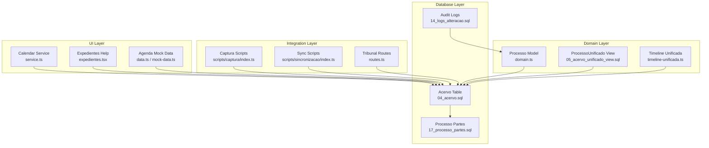
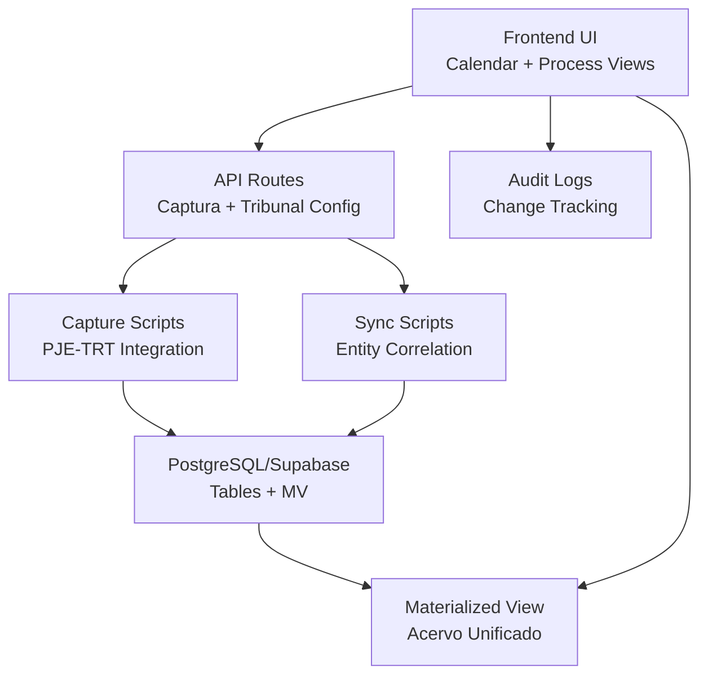
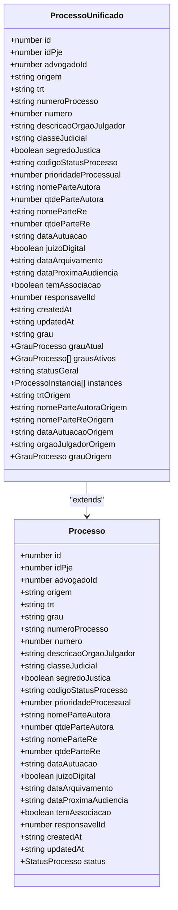
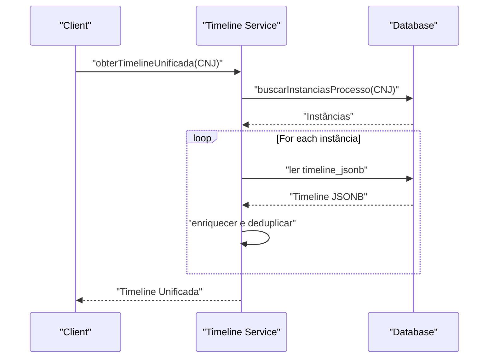
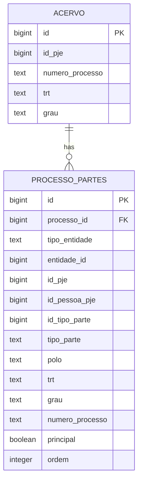
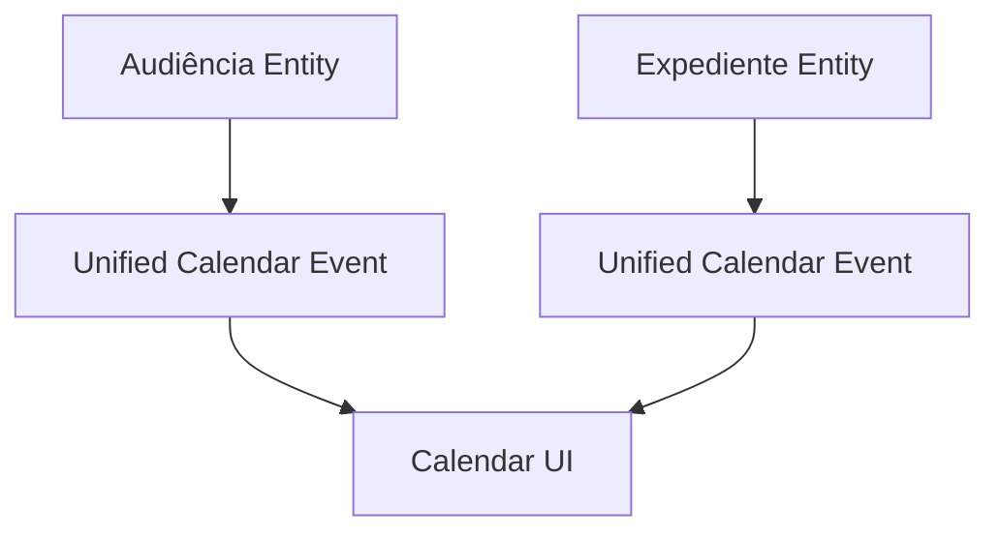
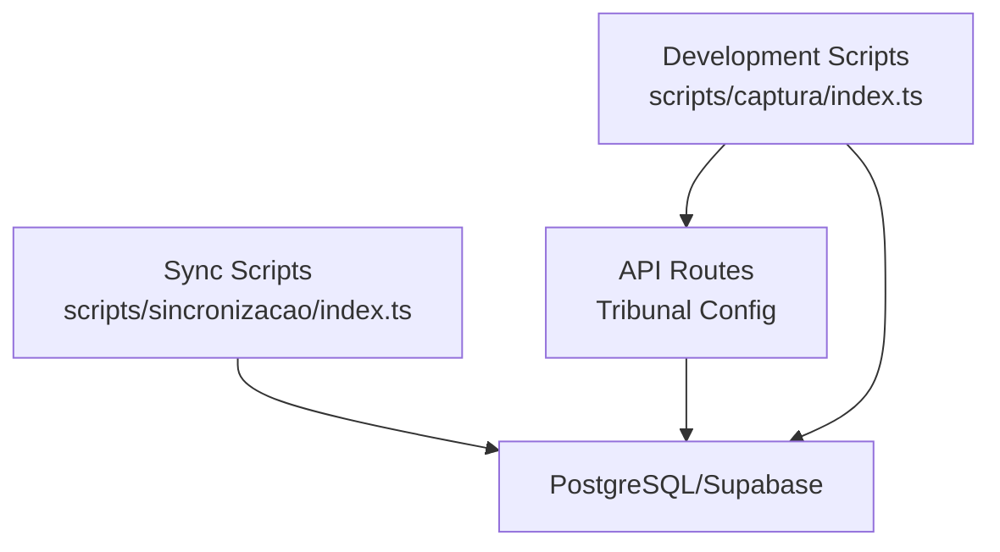
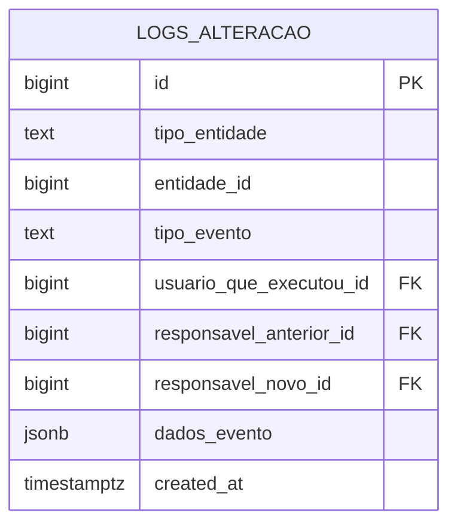
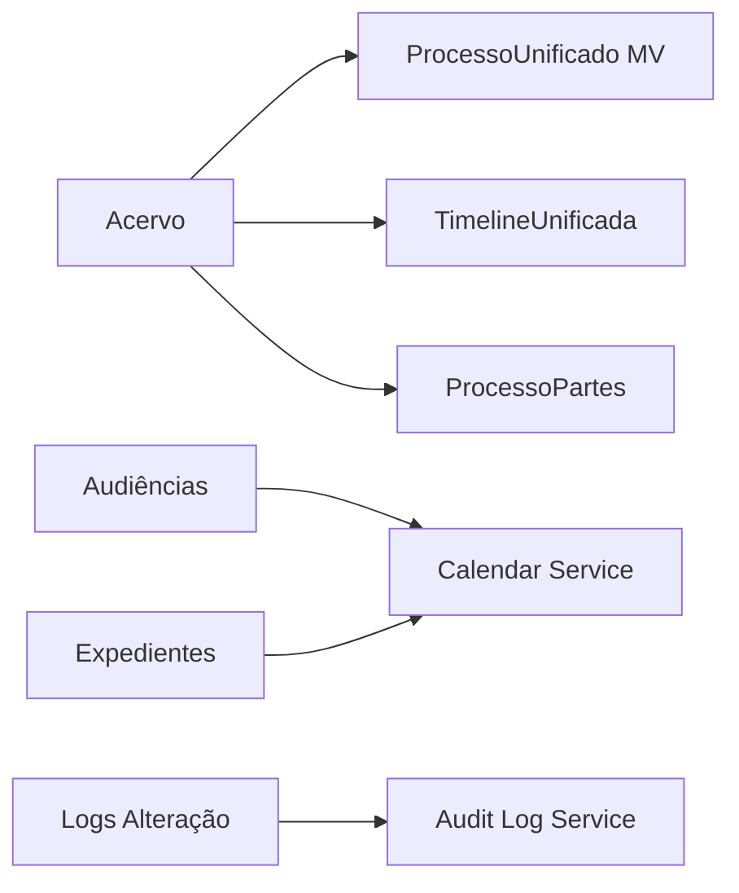

# Legal Process Management System

<cite>
**Referenced Files in This Document**
- [domain.ts](file://src/app/(authenticated)/processos/domain.ts)
- [timeline-unificada.ts](file://src/app/(authenticated)/acervo/timeline-unificada.ts)
- [04_acervo.sql](file://supabase/schemas/04_acervo.sql)
- [05_acervo_unificado_view.sql](file://supabase/schemas/05_acervo_unificado_view.sql)
- [17_processo_partes.sql](file://supabase/schemas/17_processo_partes.sql)
- [service.ts](file://src/app/(authenticated)/calendar/service.ts)
- [index.ts](file://scripts/captura/index.ts)
- [index.ts](file://scripts/sincronizacao/index.ts)
- [route.ts](file://src/app/api/captura/tribunais/route.ts)
- [route.ts](file://src/app/api/captura/tribunais/[id]/route.ts)
- [audit-log.service.ts](file://src/lib/domain/audit/services/audit-log.service.ts)
- [14_logs_alteracao.sql](file://supabase/schemas/14_logs_alteracao.sql)
- [design.md](file://openspec/changes/archive/2025-11-24-captura-partes-pje/design.md)
- [tasks.md](file://openspec/changes/archive/2025-11-24-captura-partes-pje/tasks.md)
- [spec.md](file://openspec/specs/audit-atividades/spec.md)
- [expedientes.tsx](file://src/app/(authenticated)/ajuda/content/expedientes.tsx)
- [data.ts](file://src/app/(authenticated)/agenda/mock/data.ts)
- [mock-data.ts](file://src/app/(authenticated)/agenda/components/mock-data.ts)
</cite>

## Table of Contents
1. [Introduction](#introduction)
2. [Project Structure](#project-structure)
3. [Core Components](#core-components)
4. [Architecture Overview](#architecture-overview)
5. [Detailed Component Analysis](#detailed-component-analysis)
6. [Dependency Analysis](#dependency-analysis)
7. [Performance Considerations](#performance-considerations)
8. [Troubleshooting Guide](#troubleshooting-guide)
9. [Conclusion](#conclusion)
10. [Appendices](#appendices)

## Introduction
This document describes the Legal Process Management System with a focus on unified legal case tracking and management. It explains the Processo entity model, the ProcessoUnificado view for multi-instance tracking, and the timeline/movimentations system. It documents automated data capture from PJE-TRT systems, data synchronization workflows, and unified process aggregation. It also covers status management, workflow automation, and audit trails, along with practical examples of process creation, updates, filtering, and reporting. Finally, it addresses the relationship between legal processes, expedientes (proceedings), and court scheduling, and outlines integration with external legal APIs, data validation rules, and compliance requirements for the Brazilian legal system.

## Project Structure
The system is organized around:
- Domain models and validation for legal processes
- Database schema with core tables and a unified view
- Timeline aggregation service for multi-instance processes
- Calendar integration for audiências and expedientes
- Automated data capture and synchronization scripts
- Audit logging for compliance and traceability
- API routes for tribunal configuration and data capture

**Diagram sources**
- [domain.ts](file://src/app/(authenticated)/processos/domain.ts#L75-L118)
- [05_acervo_unificado_view.sql:44-151](file://supabase/schemas/05_acervo_unificado_view.sql#L44-L151)
- [timeline-unificada.ts](file://src/app/(authenticated)/acervo/timeline-unificada.ts#L169-L178)
- [04_acervo.sql:4-32](file://supabase/schemas/04_acervo.sql#L4-L32)
- [17_processo_partes.sql:6-69](file://supabase/schemas/17_processo_partes.sql#L6-L69)
- [index.ts:1-177](file://scripts/captura/index.ts#L1-L177)
- [index.ts:1-234](file://scripts/sincronizacao/index.ts#L1-L234)
- [route.ts:130-171](file://src/app/api/captura/tribunais/route.ts#L130-L171)
- [service.ts](file://src/app/(authenticated)/calendar/service.ts#L88-L127)

**Section sources**
- [domain.ts](file://src/app/(authenticated)/processos/domain.ts#L1-L674)
- [04_acervo.sql:1-77](file://supabase/schemas/04_acervo.sql#L1-L77)
- [05_acervo_unificado_view.sql:1-247](file://supabase/schemas/05_acervo_unificado_view.sql#L1-L247)
- [17_processo_partes.sql:1-144](file://supabase/schemas/17_processo_partes.sql#L1-L144)
- [index.ts:1-177](file://scripts/captura/index.ts#L1-L177)
- [index.ts:1-234](file://scripts/sincronizacao/index.ts#L1-L234)
- [route.ts:130-171](file://src/app/api/captura/tribunais/route.ts#L130-L171)

## Core Components
- Processo entity model: Complete mapping of the acervo table with validation schemas, sorting, filtering, and CNJ number validation.
- ProcessoUnificado view: Materialized view that aggregates multi-instance processes (first, second, superior courts) and identifies the current instance.
- Timeline/Movimentations: Timeline unification service that merges events across instances and applies deduplication.
- ProcessoPartes: N:N relationship between processes and parties (clients, adverse parties, third parties), enabling unified party tracking.
- Audit trail: Centralized logs for ownership changes and other business events.
- Calendar integration: Unified calendar events for audiências and expedientes, including scheduling and reminders.
- Data capture and sync: Scripts for capturing PJE-TRT data and synchronizing entities and relationships.

**Section sources**
- [domain.ts](file://src/app/(authenticated)/processos/domain.ts#L75-L118)
- [domain.ts](file://src/app/(authenticated)/processos/domain.ts#L147-L165)
- [timeline-unificada.ts](file://src/app/(authenticated)/acervo/timeline-unificada.ts#L1-L195)
- [17_processo_partes.sql:6-69](file://supabase/schemas/17_processo_partes.sql#L6-L69)
- [audit-log.service.ts:1-50](file://src/lib/domain/audit/services/audit-log.service.ts#L1-L50)
- [service.ts](file://src/app/(authenticated)/calendar/service.ts#L88-L127)
- [index.ts:1-177](file://scripts/captura/index.ts#L1-L177)
- [index.ts:1-234](file://scripts/sincronizacao/index.ts#L1-L234)

## Architecture Overview
The system follows a layered architecture:
- Domain layer defines entities, enums, and validation rules for legal processes.
- Database layer persists core entities and exposes a materialized view for unified process display.
- Integration layer orchestrates automated capture and synchronization with PJE-TRT systems.
- UI layer consumes unified views and calendar services to present audiências and expedientes.
- Audit layer ensures compliance and traceability of ownership and process changes.

**Diagram sources**
- [route.ts:130-171](file://src/app/api/captura/tribunais/route.ts#L130-L171)
- [route.ts:20-62](file://src/app/api/captura/tribunais/[id]/route.ts#L20-L62)
- [index.ts:1-177](file://scripts/captura/index.ts#L1-L177)
- [index.ts:1-234](file://scripts/sincronizacao/index.ts#L1-L234)
- [05_acervo_unificado_view.sql:44-151](file://supabase/schemas/05_acervo_unificado_view.sql#L44-L151)
- [14_logs_alteracao.sql:6-16](file://supabase/schemas/14_logs_alteracao.sql#L6-L16)

## Detailed Component Analysis

### Processo Entity Model
The Processo entity mirrors the acervo table with derived status mapping from PJE codes. It includes:
- Required fields: PJE ID, attorney, origin, TRT, degree, CNJ number, court description, classes, parties, dates, digital court flag, associations, and timestamps.
- Validation schemas for creation, updates, and manual creation without PJE data.
- Sorting, filtering, pagination parameters, and CNJ format validation.
- Column selection helpers to optimize disk I/O for listing vs. detail views.

**Diagram sources**
- [domain.ts](file://src/app/(authenticated)/processos/domain.ts#L90-L118)
- [domain.ts](file://src/app/(authenticated)/processos/domain.ts#L147-L165)

**Section sources**
- [domain.ts](file://src/app/(authenticated)/processos/domain.ts#L75-L118)
- [domain.ts](file://src/app/(authenticated)/processos/domain.ts#L147-L165)
- [domain.ts](file://src/app/(authenticated)/processos/domain.ts#L210-L283)
- [domain.ts](file://src/app/(authenticated)/processos/domain.ts#L360-L393)
- [domain.ts](file://src/app/(authenticated)/processos/domain.ts#L404-L460)
- [domain.ts](file://src/app/(authenticated)/processos/domain.ts#L568-L570)

### ProcessoUnificado View (Multi-Instance Aggregation)
The materialized view aggregates instances of the same process across degrees (first, second, superior) and identifies the current instance by latest autuation date and updated timestamp. It exposes:
- Current instance fields (grau_atual)
- Active degrees array
- Instances JSONB with per-degree metadata and a flag indicating the current instance
- Indexes optimized for performance and refresh strategies

**Diagram sources**
- [05_acervo_unificado_view.sql:173-194](file://supabase/schemas/05_acervo_unificado_view.sql#L173-L194)

**Section sources**
- [05_acervo_unificado_view.sql:44-151](file://supabase/schemas/05_acervo_unificado_view.sql#L44-L151)
- [05_acervo_unificado_view.sql:171-196](file://supabase/schemas/05_acervo_unificado_view.sql#L171-L196)

### Timeline/Movimentations System
The timeline unification service:
- Retrieves all instances of a process by CNJ
- Fetches timeline JSONB from each instance
- Builds enriched items with source degree, TRT, and instance ID
- Applies deduplication using a hash built from event attributes
- Returns a unified timeline ordered chronologically

**Diagram sources**
- [timeline-unificada.ts](file://src/app/(authenticated)/acervo/timeline-unificada.ts#L169-L178)
- [timeline-unificada.ts](file://src/app/(authenticated)/acervo/timeline-unificada.ts#L180-L195)

**Section sources**
- [timeline-unificada.ts](file://src/app/(authenticated)/acervo/timeline-unificada.ts#L1-L195)

### ProcessoPartes Relationship
The processo_partes table establishes N:N relationships between processes and parties:
- Polymorphic foreign keys for clients, adverse parties, and third parties
- PJE identifiers and participation type mapping
- Polo (party side) and order within the side
- Constraints to prevent duplicates per process-degree combination
- Indexes for performance and RLS policies

**Diagram sources**
- [17_processo_partes.sql:6-69](file://supabase/schemas/17_processo_partes.sql#L6-L69)
- [04_acervo.sql:4-32](file://supabase/schemas/04_acervo.sql#L4-L32)

**Section sources**
- [17_processo_partes.sql:6-69](file://supabase/schemas/17_processo_partes.sql#L6-L69)
- [17_processo_partes.sql:98-107](file://supabase/schemas/17_processo_partes.sql#L98-L107)

### Calendar Integration: Audiências and Expedientes
The calendar service converts audiências and expedientes into unified calendar events:
- Audiências: Title, start/end, source, metadata (process ID, CNJ, TRT, degree, status, modalities, venue/virtual link)
- Expedientes: Title, all-day events, metadata (process ID, CNJ, TRT, class, deadline status)
- Unified event IDs and color coding for UI presentation

**Diagram sources**
- [service.ts](file://src/app/(authenticated)/calendar/service.ts#L88-L127)

**Section sources**
- [service.ts](file://src/app/(authenticated)/calendar/service.ts#L88-L127)
- [expedientes.tsx](file://src/app/(authenticated)/ajuda/content/expedientes.tsx#L146-L207)
- [data.ts](file://src/app/(authenticated)/agenda/mock/data.ts#L294-L352)
- [mock-data.ts](file://src/app/(authenticated)/agenda/components/mock-data.ts#L277-L354)

### Automated Data Capture from PJE-TRT Systems
The capture and synchronization scripts orchestrate:
- Development/test scripts for PJE/TRT data capture (acervo, audiências, partes, pendentes, timeline)
- Synchronization scripts for users, entities, and process-party correlation
- API routes for tribunal configuration and access parameters
- Error handling strategies and retry/backoff patterns
- Performance considerations: parallel tasks, rate limiting, and batch processing

**Diagram sources**
- [index.ts:1-177](file://scripts/captura/index.ts#L1-L177)
- [index.ts:1-234](file://scripts/sincronizacao/index.ts#L1-L234)
- [route.ts:130-171](file://src/app/api/captura/tribunais/route.ts#L130-L171)

**Section sources**
- [index.ts:1-177](file://scripts/captura/index.ts#L1-L177)
- [index.ts:1-234](file://scripts/sincronizacao/index.ts#L1-L234)
- [route.ts:130-171](file://src/app/api/captura/tribunais/route.ts#L130-L171)
- [route.ts:20-62](file://src/app/api/captura/tribunais/[id]/route.ts#L20-L62)
- [design.md:235-250](file://openspec/changes/archive/2025-11-24-captura-partes-pje/design.md#L235-L250)
- [tasks.md:602-615](file://openspec/changes/archive/2025-11-24-captura-partes-pje/tasks.md#L602-L615)

### Audit Trails and Compliance
The audit log system tracks ownership changes and other business events:
- Centralized logs with entity type, entity ID, event type, actor, previous/new responsible, and flexible JSONB payload
- Repository service to fetch logs with user joins for display
- Policies and indices for performance and security

**Diagram sources**
- [14_logs_alteracao.sql:6-16](file://supabase/schemas/14_logs_alteracao.sql#L6-L16)
- [audit-log.service.ts:1-50](file://src/lib/domain/audit/services/audit-log.service.ts#L1-L50)

**Section sources**
- [14_logs_alteracao.sql:6-16](file://supabase/schemas/14_logs_alteracao.sql#L6-L16)
- [audit-log.service.ts:1-50](file://src/lib/domain/audit/services/audit-log.service.ts#L1-L50)
- [spec.md:1-28](file://openspec/specs/audit-atividades/spec.md#L1-L28)

## Dependency Analysis
Key dependencies and relationships:
- ProcessoUnificado depends on acervo instances and window functions to determine the current degree.
- TimelineUnificada depends on acervo timeline JSONB fields and deduplication logic.
- ProcessoPartes depends on acervo and supports polymorphic party relationships.
- Calendar service depends on audiências and expedientes entities.
- Audit logs depend on users and are indexed for fast retrieval.

**Diagram sources**
- [05_acervo_unificado_view.sql:44-151](file://supabase/schemas/05_acervo_unificado_view.sql#L44-L151)
- [timeline-unificada.ts](file://src/app/(authenticated)/acervo/timeline-unificada.ts#L169-L178)
- [17_processo_partes.sql:6-69](file://supabase/schemas/17_processo_partes.sql#L6-L69)
- [service.ts](file://src/app/(authenticated)/calendar/service.ts#L88-L127)
- [audit-log.service.ts:1-50](file://src/lib/domain/audit/services/audit-log.service.ts#L1-L50)

**Section sources**
- [05_acervo_unificado_view.sql:44-151](file://supabase/schemas/05_acervo_unificado_view.sql#L44-L151)
- [timeline-unificada.ts](file://src/app/(authenticated)/acervo/timeline-unificada.ts#L169-L178)
- [17_processo_partes.sql:6-69](file://supabase/schemas/17_processo_partes.sql#L6-L69)
- [service.ts](file://src/app/(authenticated)/calendar/service.ts#L88-L127)
- [audit-log.service.ts:1-50](file://src/lib/domain/audit/services/audit-log.service.ts#L1-L50)

## Performance Considerations
- Materialized view refresh: Prefer concurrent refresh when possible; fall back to normal refresh if needed.
- Index coverage: Unique index on materialized view enables concurrent refresh; additional indexes support filtering and joins.
- Column selection: Use basic/full/unified column sets to minimize I/O during listing and detail operations.
- Parallelization: Capture and sync scripts leverage parallel tasks to improve throughput.
- Rate limiting: Apply delays between document captures and handle rate limits gracefully.
- Disk I/O optimization: Use column selection helpers and avoid unnecessary JSONB parsing.

[No sources needed since this section provides general guidance]

## Troubleshooting Guide
Common issues and resolutions:
- SERVICE_API_KEY not configured: Set the service API key in environment variables for development scripts.
- Authentication failure: Verify PJE credentials in the credentials table and ensure proper service role keys.
- Timeout errors: Increase timeouts or retry with backoff; verify network connectivity and Redis/Supabase availability.
- Duplicate key violations: Use upsert semantics or deduplicate before insertion; verify constraints and foreign keys.
- Foreign key constraint violations: Ensure referenced entities exist before linking; run dependency synchronization first.
- Materialized view refresh failures: Ensure unique index exists; use concurrent refresh when possible.

**Section sources**
- [index.ts:142-153](file://scripts/captura/index.ts#L142-L153)
- [index.ts:208-221](file://scripts/sincronizacao/index.ts#L208-L221)
- [route.ts:135-148](file://src/app/api/captura/tribunais/route.ts#L135-L148)

## Conclusion
The Legal Process Management System provides a robust foundation for unified legal case tracking across multiple instances and degrees. Its domain models, materialized view, timeline unification, and calendar integration deliver a comprehensive solution for managing legal processes, audiências, and expedientes. Automated capture and synchronization scripts, combined with centralized audit logging, ensure data integrity, compliance, and operational efficiency within the Brazilian legal system.

[No sources needed since this section summarizes without analyzing specific files]

## Appendices

### Practical Examples

- Creating a Processo manually (without PJE data):
  - Use the manual creation schema to supply CNJ, TRT, degree, parties, and optional fields.
  - Defaults are applied for origin, secret justice, digital court, associations, and priorities.

- Updating a Processo:
  - Use the update schema to partially modify fields while preserving others.
  - Ensure CNJ format validation passes.

- Filtering and Listing:
  - Apply filters by origin, TRT, degree, CNJ, class, status, parties, and date ranges.
  - Choose unified view for aggregated multi-instance display.

- Timeline Unification:
  - Call the timeline unification service with a CNJ to receive a deduplicated chronological timeline across instances.

- Calendar Integration:
  - Convert audiências and expedientes into unified calendar events with metadata for scheduling and reminders.

- Audit Trail:
  - Retrieve activity logs for any entity to track ownership changes and other events.

**Section sources**
- [domain.ts](file://src/app/(authenticated)/processos/domain.ts#L360-L393)
- [domain.ts](file://src/app/(authenticated)/processos/domain.ts#L289-L345)
- [domain.ts](file://src/app/(authenticated)/processos/domain.ts#L404-L460)
- [timeline-unificada.ts](file://src/app/(authenticated)/acervo/timeline-unificada.ts#L169-L178)
- [service.ts](file://src/app/(authenticated)/calendar/service.ts#L88-L127)
- [audit-log.service.ts:28-47](file://src/lib/domain/audit/services/audit-log.service.ts#L28-L47)