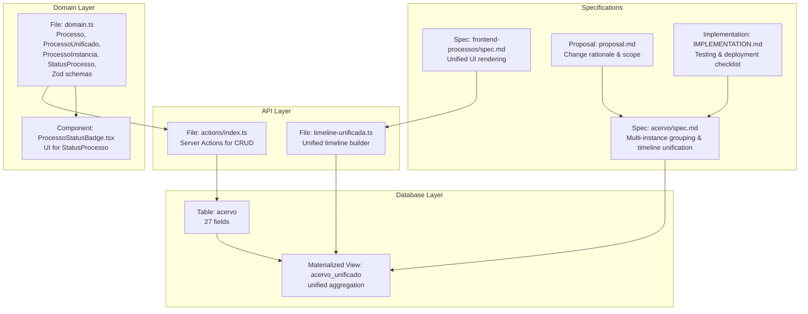
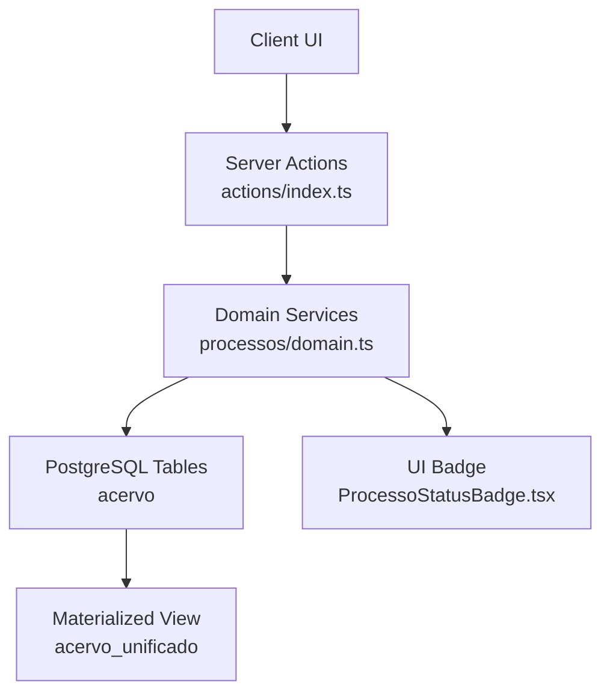
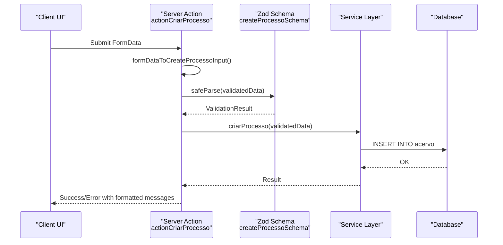
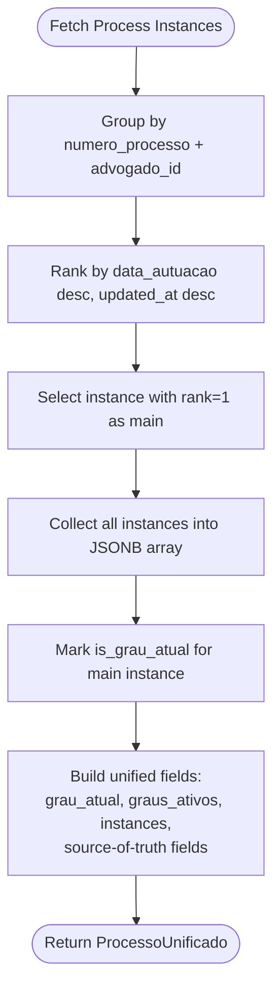
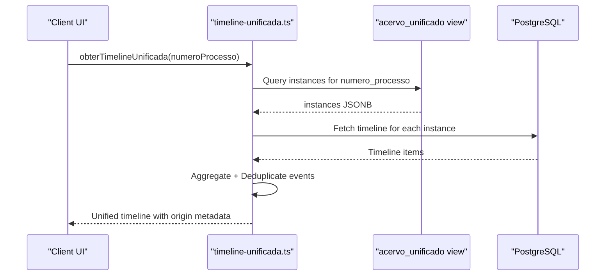
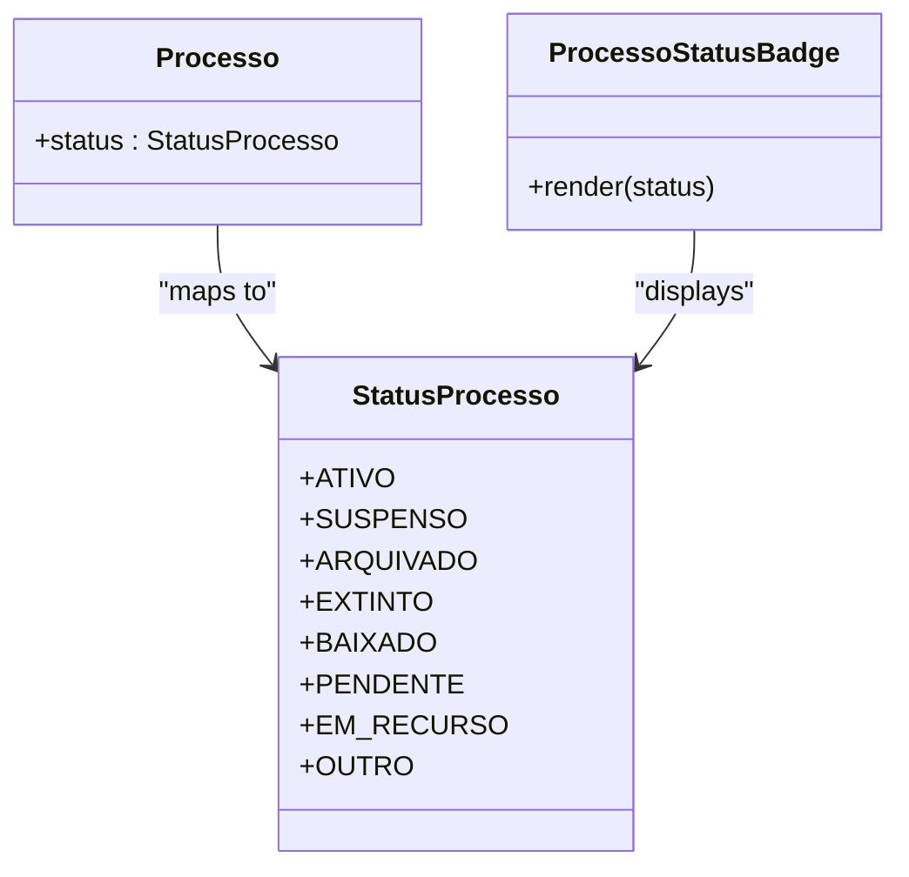
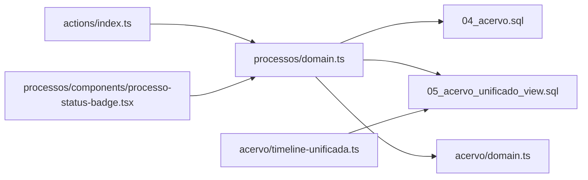

# Processo Entity Model and Data Structures

<cite>
**Referenced Files in This Document**
- [processo-workspace-architecture.md](file://docs/architecture/processo-workspace-architecture.md)
- [domain.ts](file://src/app/(authenticated)/processos/domain.ts)
- [index.ts](file://src/app/(authenticated)/processos/actions/index.ts)
- [04_acervo.sql](file://supabase/schemas/04_acervo.sql)
- [05_acervo_unificado_view.sql](file://supabase/schemas/05_acervo_unificado_view.sql)
- [timeline-unificada.ts](file://src/app/(authenticated)/acervo/timeline-unificada.ts)
- [acervo.spec.md](file://openspec/changes/archive/2025-12-05-unify-multi-instance-processes/specs/acervo/spec.md)
- [frontend-processos.spec.md](file://openspec/changes/archive/2025-12-05-unify-multi-instance-processes/specs/frontend-processos/spec.md)
- [proposal.md](file://openspec/changes/archive/2025-12-05-unify-multi-instance-processes/proposal.md)
- [IMPLEMENTATION.md](file://openspec/changes/archive/2025-12-05-unify-multi-instance-processes/IMPLEMENTATION.md)
- [processo-status-badge.tsx](file://src/app/(authenticated)/processos/components/processo-status-badge.tsx)
- [domain.ts](file://src/app/(authenticated)/acervo/domain.ts)
</cite>

## Table of Contents
1. [Introduction](#introduction)
2. [Project Structure](#project-structure)
3. [Core Components](#core-components)
4. [Architecture Overview](#architecture-overview)
5. [Detailed Component Analysis](#detailed-component-analysis)
6. [Dependency Analysis](#dependency-analysis)
7. [Performance Considerations](#performance-considerations)
8. [Troubleshooting Guide](#troubleshooting-guide)
9. [Conclusion](#conclusion)

## Introduction
This document describes the Processo entity model and data structures used to represent judicial processes across multiple jurisdictions and degrees. It covers:
- The Processo interface with all 27 database fields, including mandatory and optional properties
- The ProcessoUnificado view for multi-instance process tracking
- The ProcessoInstancia interface for individual process instances
- Status management through the StatusProcesso enum
- Unified source-of-truth concept for multi-degree processes
- Validation schemas using Zod for create/update operations
- Relationships with related entities (Advogado, Parte, Expediente)
- Practical examples of entity instantiation, validation, and transformation between views

## Project Structure
The Processo domain spans backend database schemas, frontend domain types, server actions, and specialized views for unified process tracking.

**Diagram sources**
- [04_acervo.sql:1-77](file://supabase/schemas/04_acervo.sql#L1-L77)
- [05_acervo_unificado_view.sql:1-247](file://supabase/schemas/05_acervo_unificado_view.sql#L1-L247)
- [domain.ts](file://src/app/(authenticated)/processos/domain.ts#L1-L674)
- [index.ts](file://src/app/(authenticated)/processos/actions/index.ts#L1-L800)
- [timeline-unificada.ts](file://src/app/(authenticated)/acervo/timeline-unificada.ts#L153-L195)
- [acervo.spec.md:1-64](file://openspec/changes/archive/2025-12-05-unify-multi-instance-processes/specs/acervo/spec.md#L1-L64)
- [frontend-processos.spec.md:1-37](file://openspec/changes/archive/2025-12-05-unify-multi-instance-processes/specs/frontend-processos/spec.md#L1-L37)
- [proposal.md:1-62](file://openspec/changes/archive/2025-12-05-unify-multi-instance-processes/proposal.md#L1-L62)
- [IMPLEMENTATION.md:245-400](file://openspec/changes/archive/2025-12-05-unify-multi-instance-processes/IMPLEMENTATION.md#L245-L400)

**Section sources**
- [processo-workspace-architecture.md:1-57](file://docs/architecture/processo-workspace-architecture.md#L1-L57)
- [domain.ts](file://src/app/(authenticated)/processos/domain.ts#L1-L674)
- [index.ts](file://src/app/(authenticated)/processos/actions/index.ts#L1-L800)
- [04_acervo.sql:1-77](file://supabase/schemas/04_acervo.sql#L1-L77)
- [05_acervo_unificado_view.sql:1-247](file://supabase/schemas/05_acervo_unificado_view.sql#L1-L247)
- [timeline-unificada.ts](file://src/app/(authenticated)/acervo/timeline-unificada.ts#L153-L195)
- [acervo.spec.md:1-64](file://openspec/changes/archive/2025-12-05-unify-multi-instance-processes/specs/acervo/spec.md#L1-L64)
- [frontend-processos.spec.md:1-37](file://openspec/changes/archive/2025-12-05-unify-multi-instance-processes/specs/frontend-processos/spec.md#L1-L37)
- [proposal.md:1-62](file://openspec/changes/archive/2025-12-05-unify-multi-instance-processes/proposal.md#L1-L62)
- [IMPLEMENTATION.md:245-400](file://openspec/changes/archive/2025-12-05-unify-multi-instance-processes/IMPLEMENTATION.md#L245-L400)

## Core Components
This section documents the Processo entity model and related structures.

- Processo interface (27 fields)
  - Mandatory fields: id, idPje, advogadoId, origem, trt, grau, numeroProcesso, numero, descricaoOrgaoJulgador, classeJudicial, segredoJustica, codigoStatusProcesso, prioridadeProcessual, nomeParteAutora, qtdeParteAutora, nomeParteRe, qtdeParteRe, dataAutuacao, juizoDigital, temAssociacao, createdAt, updatedAt
  - Optional fields: dataArquivamento, dataProximaAudiencia, responsavelId
  - Derived field: status (mapped from codigoStatusProcesso)

- ProcessoUnificado view
  - Extends Processo with unified fields: grauAtual, grausAtivos, statusGeral, instances
  - Source-of-truth fields (always from first degree): trtOrigem, nomeParteAutoraOrigem, nomeParteReOrigem, dataAutuacaoOrigem, orgaoJulgadorOrigem, grauOrigem
  - Instances array contains ProcessoInstancia entries with grau, origem, trt, dataAutuacao, status, updatedAt, isGrauAtual

- ProcessoInstancia interface
  - Represents a single instance of a process in a specific degree/jurisdiction
  - Includes isGrauAtual flag to indicate the current degree

- StatusProcesso enum
  - Values: ATIVO, SUSPENSO, ARQUIVADO, EXTINTO, BAIXADO, PENDENTE, EM_RECURSO, OUTRO
  - Mapped from PJE status codes

- Zod validation schemas
  - createProcessoSchema: strict validation for creation with CNJ number regex and defaults
  - updateProcessoSchema: partial update schema
  - createProcessoManualSchema: simplified manual creation schema
  - Validation enforces numeric constraints, string min-lengths, booleans, nullable dates, and CNJ format

- Unified source-of-truth concept
  - Data from first degree (origem = primeiro_grau) is considered the canonical truth
  - Fields like trtOrigem, dataAutuacaoOrigem, and party names are preserved from the originating degree
  - This ensures consistency across degrees while aggregating multi-instance processes

**Section sources**
- [domain.ts](file://src/app/(authenticated)/processos/domain.ts#L75-L189)
- [domain.ts](file://src/app/(authenticated)/processos/domain.ts#L230-L393)
- [domain.ts](file://src/app/(authenticated)/processos/domain.ts#L531-L563)
- [04_acervo.sql:4-32](file://supabase/schemas/04_acervo.sql#L4-L32)
- [05_acervo_unificado_view.sql:105-151](file://supabase/schemas/05_acervo_unificado_view.sql#L105-L151)

## Architecture Overview
The system separates concerns across database, domain, API, and presentation layers, with a focus on multi-degree process unification.

**Diagram sources**
- [index.ts](file://src/app/(authenticated)/processos/actions/index.ts#L264-L323)
- [domain.ts](file://src/app/(authenticated)/processos/domain.ts#L1-L674)
- [04_acervo.sql:1-77](file://supabase/schemas/04_acervo.sql#L1-L77)
- [05_acervo_unificado_view.sql:1-247](file://supabase/schemas/05_acervo_unificado_view.sql#L1-L247)
- [processo-status-badge.tsx](file://src/app/(authenticated)/processos/components/processo-status-badge.tsx#L1-L22)

## Detailed Component Analysis

### Processo Entity and Validation
- Purpose: Complete representation of a judicial process captured from PJE, including metadata, parties, jurisdiction, and status.
- 27 fields mapped from acervo table with clear typing and defaults.
- Zod schemas enforce:
  - Numeric constraints (positive integers, non-negative priorities)
  - String validations (CNJ format, minimum lengths)
  - Boolean defaults
  - Nullable date fields
- Practical example pattern:
  - Convert FormData to typed input using helpers
  - Validate with createProcessoSchema or updateProcessoSchema
  - Call service layer to persist or query

**Diagram sources**
- [index.ts](file://src/app/(authenticated)/processos/actions/index.ts#L64-L181)
- [index.ts](file://src/app/(authenticated)/processos/actions/index.ts#L264-L323)
- [domain.ts](file://src/app/(authenticated)/processos/domain.ts#L230-L283)

**Section sources**
- [domain.ts](file://src/app/(authenticated)/processos/domain.ts#L75-L118)
- [domain.ts](file://src/app/(authenticated)/processos/domain.ts#L230-L393)
- [index.ts](file://src/app/(authenticated)/processos/actions/index.ts#L64-L181)
- [index.ts](file://src/app/(authenticated)/processos/actions/index.ts#L264-L323)

### ProcessoUnificado and Multi-Instance Aggregation
- Materialized view acervo_unificado groups instances by numero_processo and advogado_id.
- Identifies the current degree using the latest data_autuacao and updated_at tiebreaker.
- Builds an instances JSONB array containing all degrees with is_grau_atual flag.
- Adds derived fields: grau_atual, graus_ativos, instances, and source-of-truth fields (trt_origem, data_autuacao_origem, etc.).

**Diagram sources**
- [05_acervo_unificado_view.sql:44-151](file://supabase/schemas/05_acervo_unificado_view.sql#L44-L151)

**Section sources**
- [05_acervo_unificado_view.sql:14-151](file://supabase/schemas/05_acervo_unificado_view.sql#L14-L151)
- [domain.ts](file://src/app/(authenticated)/processos/domain.ts#L147-L165)

### ProcessoInstancia and Unified Timeline
- ProcessoInstancia captures per-degree metadata for rendering degree badges and tooltips.
- Unified timeline aggregation:
  - Fetches all instances for a given numero_processo
  - Aggregates timeline items across instances
  - Deduplicates events by hashing (data, tipo, descricao)
  - Preserves origin degree metadata for traceability

**Diagram sources**
- [timeline-unificada.ts](file://src/app/(authenticated)/acervo/timeline-unificada.ts#L169-L195)
- [05_acervo_unificado_view.sql:105-151](file://supabase/schemas/05_acervo_unificado_view.sql#L105-L151)

**Section sources**
- [domain.ts](file://src/app/(authenticated)/processos/domain.ts#L128-L137)
- [timeline-unificada.ts](file://src/app/(authenticated)/acervo/timeline-unificada.ts#L169-L195)
- [acervo.spec.md:43-64](file://openspec/changes/archive/2025-12-05-unify-multi-instance-processes/specs/acervo/spec.md#L43-L64)

### Status Management and UI Badge
- StatusProcesso enum maps PJE status codes to semantic statuses.
- UI badge component renders status with semantic categories.

**Diagram sources**
- [domain.ts](file://src/app/(authenticated)/processos/domain.ts#L60-L69)
- [domain.ts](file://src/app/(authenticated)/processos/domain.ts#L531-L563)
- [processo-status-badge.tsx](file://src/app/(authenticated)/processos/components/processo-status-badge.tsx#L1-L22)

**Section sources**
- [domain.ts](file://src/app/(authenticated)/processos/domain.ts#L60-L69)
- [domain.ts](file://src/app/(authenticated)/processos/domain.ts#L531-L563)
- [processo-status-badge.tsx](file://src/app/(authenticated)/processos/components/processo-status-badge.tsx#L1-L22)
- [domain.ts](file://src/app/(authenticated)/acervo/domain.ts#L418-L433)

### Relationship with Related Entities
- Advogado: Foreign key advogado_id references advogados table; used to group instances per lawyer.
- Parte: Processo stores partie names and counts; related via processo_partes for detailed linkage.
- Expediente: Timeline and movements are stored in acervo timeline_jsonb; unified timeline merges across degrees.

Note: The Processo entity itself does not directly embed Advogado or Parte objects; relationships are maintained through foreign keys and auxiliary tables/views.

**Section sources**
- [04_acervo.sql:7-32](file://supabase/schemas/04_acervo.sql#L7-L32)
- [05_acervo_unificado_view.sql:105-151](file://supabase/schemas/05_acervo_unificado_view.sql#L105-L151)

## Dependency Analysis
The following diagram shows key dependencies among components:

**Diagram sources**
- [index.ts](file://src/app/(authenticated)/processos/actions/index.ts#L1-L800)
- [domain.ts](file://src/app/(authenticated)/processos/domain.ts#L1-L674)
- [04_acervo.sql:1-77](file://supabase/schemas/04_acervo.sql#L1-L77)
- [05_acervo_unificado_view.sql:1-247](file://supabase/schemas/05_acervo_unificado_view.sql#L1-L247)
- [domain.ts](file://src/app/(authenticated)/acervo/domain.ts#L418-L433)
- [timeline-unificada.ts](file://src/app/(authenticated)/acervo/timeline-unificada.ts#L153-L195)
- [processo-status-badge.tsx](file://src/app/(authenticated)/processos/components/processo-status-badge.tsx#L1-L22)

**Section sources**
- [index.ts](file://src/app/(authenticated)/processos/actions/index.ts#L1-L800)
- [domain.ts](file://src/app/(authenticated)/processos/domain.ts#L1-L674)
- [04_acervo.sql:1-77](file://supabase/schemas/04_acervo.sql#L1-L77)
- [05_acervo_unificado_view.sql:1-247](file://supabase/schemas/05_acervo_unificado_view.sql#L1-L247)
- [domain.ts](file://src/app/(authenticated)/acervo/domain.ts#L418-L433)
- [timeline-unificada.ts](file://src/app/(authenticated)/acervo/timeline-unificada.ts#L153-L195)
- [processo-status-badge.tsx](file://src/app/(authenticated)/processos/components/processo-status-badge.tsx#L1-L22)

## Performance Considerations
- Materialized view acervo_unificado offloads grouping and aggregation from application memory to the database, enabling efficient pagination and indexing.
- Indexes on numero_processo, advogado_id, grau, and data fields improve query performance for unified listings.
- refresh_acervo_unificado supports concurrent refresh to minimize downtime.
- Column selection helpers reduce I/O by selecting only necessary columns for list/detail views.

[No sources needed since this section provides general guidance]

## Troubleshooting Guide
Common issues and resolutions:
- Frontend shows duplicated processes
  - Verify unified=true is passed in query
  - Confirm API response includes instances array
  - Check type guards in components
- Responsible assignment not propagating across instances
  - Ensure SQL UPDATE targets numero_processo
  - Invalidate cache after bulk updates
- Timeline duplicates or missing items
  - Confirm deduplication logic uses event hash (data, tipo, descricao)
  - Validate that instances metadata preserves origin degree

**Section sources**
- [IMPLEMENTATION.md:352-400](file://openspec/changes/archive/2025-12-05-unify-multi-instance-processes/IMPLEMENTATION.md#L352-L400)
- [acervo.spec.md:43-64](file://openspec/changes/archive/2025-12-05-unify-multi-instance-processes/specs/acervo/spec.md#L43-L64)

## Conclusion
The Processo entity model provides a robust foundation for managing multi-degree, multi-jurisdictional judicial processes. By leveraging a materialized view for unified aggregation, a clear source-of-truth concept, and strict Zod validation, the system ensures data integrity, performance, and a consistent user experience. The separation of concerns across database, domain, API, and UI layers enables maintainability and scalability.