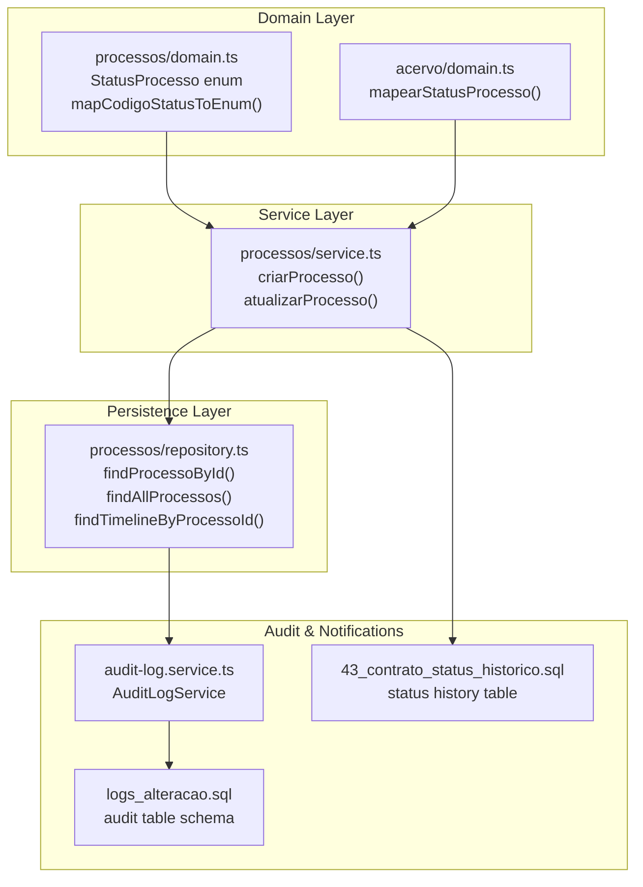
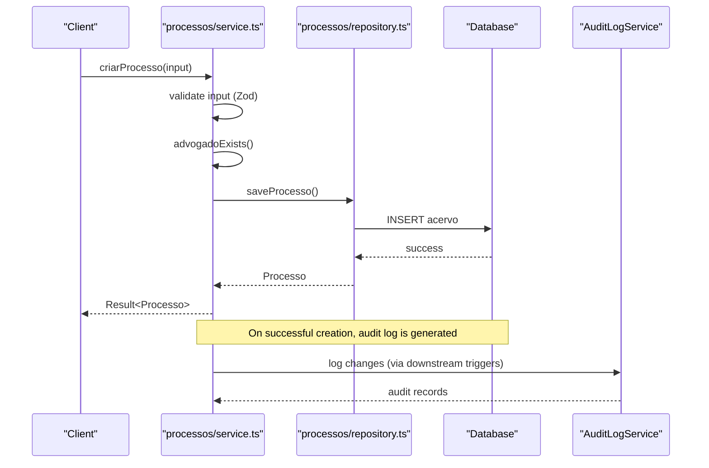
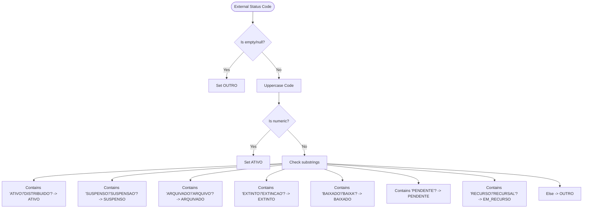
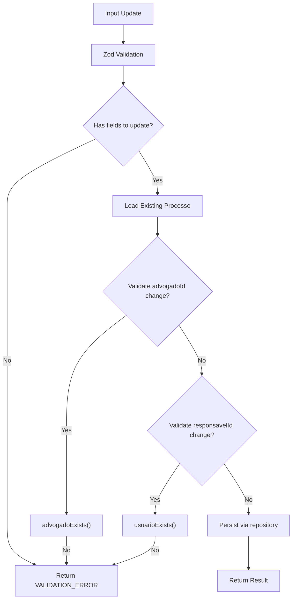
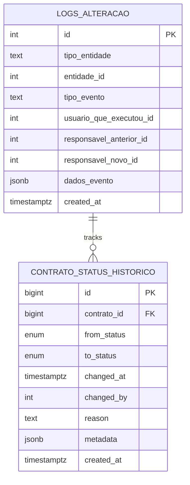
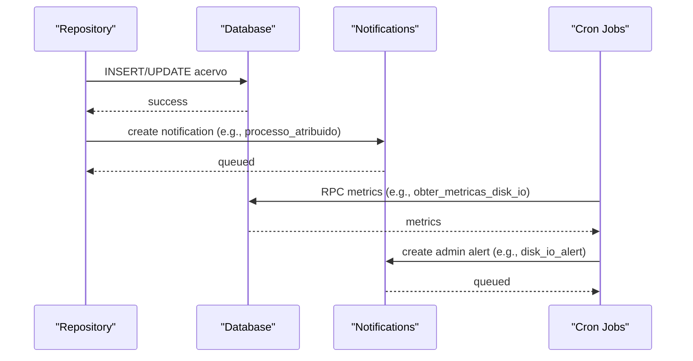
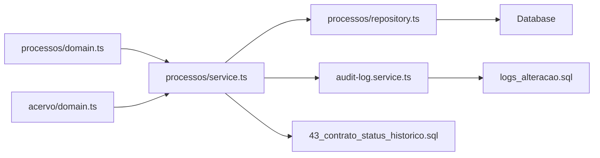

# Status Management and Workflow Automation

<cite>
**Referenced Files in This Document**
- [domain.ts](file://src/app/(authenticated)/processos/domain.ts)
- [domain.ts](file://src/app/(authenticated)/acervo/domain.ts)
- [service.ts](file://src/app/(authenticated)/processos/service.ts)
- [repository.ts](file://src/app/(authenticated)/processos/repository.ts)
- [audit-log.service.ts](file://src/lib/domain/audit/services/audit-log.service.ts)
- [logs_alteracao.sql](file://supabase/schemas/14_logs_alteracao.sql)
- [43_contrato_status_historico.sql](file://supabase/schemas/43_contrato_status_historico.sql)
- [pje-documento-types.ts](file://src/app/(authenticated)/captura/types/pje-documento-types.ts)
- [processo-status-badge.tsx](file://src/app/(authenticated)/processos/components/processo-status-badge.tsx)
- [processos-table-wrapper.tsx](file://src/app/(authenticated)/processos/components/processos-table-wrapper.tsx)
- [use-audit-logs.ts](file://src/lib/domain/audit/hooks/use-audit-logs.ts)
- [audiencia-timeline.tsx](file://src/app/(authenticated)/audiencias/components/audiencia-timeline.tsx)
- [route.ts](file://src/app/api/cron/alertas-disk-io/route.ts)
</cite>

## Table of Contents
1. [Introduction](#introduction)
2. [Project Structure](#project-structure)
3. [Core Components](#core-components)
4. [Architecture Overview](#architecture-overview)
5. [Detailed Component Analysis](#detailed-component-analysis)
6. [Dependency Analysis](#dependency-analysis)
7. [Performance Considerations](#performance-considerations)
8. [Troubleshooting Guide](#troubleshooting-guide)
9. [Conclusion](#conclusion)

## Introduction
This document describes the legal process status management and workflow automation system. It covers the StatusProcesso enumeration, status mapping from PJE-TRT codes, normalization rules, automated status updates, workflow triggers, audit trails, status history tracking, and downstream impacts such as notifications and reporting. Practical examples illustrate status change workflows, manual overrides, and integration points with external systems.

## Project Structure
The status management system spans three layers:
- Domain layer: Defines StatusProcesso, normalization functions, and status mapping logic
- Service layer: Implements business rules for creation, updates, and validations
- Persistence layer: Handles database operations and maintains audit trails

**Diagram sources**
- [domain.ts](file://src/app/(authenticated)/processos/domain.ts#L60-L69)
- [domain.ts](file://src/app/(authenticated)/acervo/domain.ts#L419-L433)
- [service.ts](file://src/app/(authenticated)/processos/service.ts#L56-L124)
- [repository.ts](file://src/app/(authenticated)/processos/repository.ts#L181-L220)
- [audit-log.service.ts:25-47](file://src/lib/domain/audit/services/audit-log.service.ts#L25-L47)
- [logs_alteracao.sql:18-32](file://supabase/schemas/14_logs_alteracao.sql#L18-L32)
- [43_contrato_status_historico.sql:3-13](file://supabase/schemas/43_contrato_status_historico.sql#L3-L13)

**Section sources**
- [domain.ts](file://src/app/(authenticated)/processos/domain.ts#L57-L69)
- [domain.ts](file://src/app/(authenticated)/acervo/domain.ts#L419-L433)
- [service.ts](file://src/app/(authenticated)/processos/service.ts#L47-L124)
- [repository.ts](file://src/app/(authenticated)/processos/repository.ts#L181-L220)
- [audit-log.service.ts:25-47](file://src/lib/domain/audit/services/audit-log.service.ts#L25-L47)
- [logs_alteracao.sql:18-32](file://supabase/schemas/14_logs_alteracao.sql#L18-L32)
- [43_contrato_status_historico.sql:3-13](file://supabase/schemas/43_contrato_status_historico.sql#L3-L13)

## Core Components
- StatusProcesso enum: Canonical set of legal process statuses used across the system
- PJE-TRT status mapping: Functions that normalize external status codes into StatusProcesso
- Validation and normalization: Zod schemas and helper functions ensure data integrity
- Audit and notifications: Centralized audit logging and notification triggers for downstream systems

Key responsibilities:
- Normalize PJE-TRT status codes to internal StatusProcesso values
- Enforce validation rules during creation and updates
- Track status changes and maintain audit trails
- Trigger notifications and downstream effects on status transitions

**Section sources**
- [domain.ts](file://src/app/(authenticated)/processos/domain.ts#L60-L69)
- [domain.ts](file://src/app/(authenticated)/acervo/domain.ts#L419-L433)
- [service.ts](file://src/app/(authenticated)/processos/service.ts#L250-L356)
- [repository.ts](file://src/app/(authenticated)/processos/repository.ts#L90-L123)

## Architecture Overview
The system follows a layered architecture with clear separation of concerns:
- Domain: Enumerations, mapping functions, and validation rules
- Service: Business logic for process lifecycle operations
- Repository: Database access and caching
- Audit: Centralized logging for all changes
- Notifications: Cron-triggered alerts and real-time channels

**Diagram sources**
- [service.ts](file://src/app/(authenticated)/processos/service.ts#L56-L124)
- [repository.ts](file://src/app/(authenticated)/processos/repository.ts#L181-L220)
- [audit-log.service.ts:25-47](file://src/lib/domain/audit/services/audit-log.service.ts#L25-L47)

## Detailed Component Analysis

### StatusProcesso Enumeration and Mapping
The StatusProcesso enum defines canonical statuses for legal processes. Two mapping functions normalize external PJE-TRT status codes into this enum:
- mapCodigoStatusToEnum in the process domain
- mapearStatusProcesso in the acervo domain

**Diagram sources**
- [domain.ts](file://src/app/(authenticated)/processos/domain.ts#L531-L563)
- [domain.ts](file://src/app/(authenticated)/acervo/domain.ts#L419-L433)

**Section sources**
- [domain.ts](file://src/app/(authenticated)/processos/domain.ts#L60-L69)
- [domain.ts](file://src/app/(authenticated)/processos/domain.ts#L531-L563)
- [domain.ts](file://src/app/(authenticated)/acervo/domain.ts#L419-L433)

### Status Normalization and Validation
Normalization ensures external codes are consistently mapped to internal statuses. Validation enforces:
- CNJ number format compliance
- Existence checks for related entities (advogado, usuário)
- Preventing updates without changes

**Diagram sources**
- [service.ts](file://src/app/(authenticated)/processos/service.ts#L250-L356)
- [repository.ts](file://src/app/(authenticated)/processos/repository.ts#L1017-L1067)

**Section sources**
- [service.ts](file://src/app/(authenticated)/processos/service.ts#L250-L356)
- [repository.ts](file://src/app/(authenticated)/processos/repository.ts#L1017-L1067)

### Audit Trail Generation and Status History Tracking
All changes are captured in centralized audit logs. The system maintains:
- logs_alteracao: Generic audit table for any entity/event type
- contrato_status_historico: Dedicated table for contract status history (conceptually analogous for processes)

**Diagram sources**
- [logs_alteracao.sql:18-32](file://supabase/schemas/14_logs_alteracao.sql#L18-L32)
- [43_contrato_status_historico.sql:3-13](file://supabase/schemas/43_contrato_status_historico.sql#L3-L13)

**Section sources**
- [audit-log.service.ts:25-47](file://src/lib/domain/audit/services/audit-log.service.ts#L25-L47)
- [logs_alteracao.sql:18-32](file://supabase/schemas/14_logs_alteracao.sql#L18-L32)
- [43_contrato_status_historico.sql:3-13](file://supabase/schemas/43_contrato_status_historico.sql#L3-L13)

### Downstream System Impacts
Status changes trigger notifications and reporting:
- Real-time notifications for events like "processo_atribuido"
- Cron-based alerts for system metrics impacting process data availability
- Timeline enrichment for process visibility

**Diagram sources**
- [repository.ts](file://src/app/(authenticated)/processos/repository.ts#L181-L220)
- [route.ts:61-87](file://src/app/api/cron/alertas-disk-io/route.ts#L61-L87)

**Section sources**
- [route.ts:61-87](file://src/app/api/cron/alertas-disk-io/route.ts#L61-L87)
- [audiencia-timeline.tsx](file://src/app/(authenticated)/audiencias/components/audiencia-timeline.tsx#L103-L135)

### UI Integration and Display
Status badges and tables reflect current status values and support manual overrides:
- ProcessoStatusBadge renders semantic status badges
- ProcessosTableWrapper displays status columns and supports inline edits

**Section sources**
- [processo-status-badge.tsx](file://src/app/(authenticated)/processos/components/processo-status-badge.tsx#L16-L22)
- [processos-table-wrapper.tsx](file://src/app/(authenticated)/processos/components/processos-table-wrapper.tsx#L376-L379)

## Dependency Analysis
The system exhibits low coupling and high cohesion:
- Domain functions are pure and reusable across services
- Services depend on repositories for persistence
- Audit logging is decoupled via service calls and database triggers
- Notifications are triggered by explicit actions or cron jobs

**Diagram sources**
- [domain.ts](file://src/app/(authenticated)/processos/domain.ts#L531-L563)
- [domain.ts](file://src/app/(authenticated)/acervo/domain.ts#L419-L433)
- [service.ts](file://src/app/(authenticated)/processos/service.ts#L56-L124)
- [repository.ts](file://src/app/(authenticated)/processos/repository.ts#L181-L220)
- [audit-log.service.ts:25-47](file://src/lib/domain/audit/services/audit-log.service.ts#L25-L47)
- [logs_alteracao.sql:18-32](file://supabase/schemas/14_logs_alteracao.sql#L18-L32)
- [43_contrato_status_historico.sql:3-13](file://supabase/schemas/43_contrato_status_historico.sql#L3-L13)

**Section sources**
- [service.ts](file://src/app/(authenticated)/processos/service.ts#L56-L124)
- [repository.ts](file://src/app/(authenticated)/processos/repository.ts#L181-L220)
- [audit-log.service.ts:25-47](file://src/lib/domain/audit/services/audit-log.service.ts#L25-L47)

## Performance Considerations
- Column selection optimization: Basic/full/unified views reduce I/O and improve query performance
- Caching: Redis caching for frequently accessed lists and unified views
- Indexes: Strategic indexes on frequently filtered columns (trt, grau, numero_processo, responsavel_id)
- Pagination: Controlled limits prevent heavy result sets

Recommendations:
- Prefer basic column sets for list views
- Leverage unified views for cross-grau aggregations
- Monitor slow queries and add missing indexes as needed

**Section sources**
- [domain.ts](file://src/app/(authenticated)/processos/domain.ts#L580-L631)
- [repository.ts](file://src/app/(authenticated)/processos/repository.ts#L336-L664)

## Troubleshooting Guide
Common issues and resolutions:
- Validation errors: Ensure CNJ format compliance and that related entities exist before updates
- Empty or null status codes: Mapped to OUTRO; verify upstream data quality
- Missing audit logs: Confirm audit triggers and service role permissions
- Notification delivery failures: Review cron job logs and notification queue status

Operational checks:
- Verify status mapping accuracy against PJE-TRT codes
- Confirm audit-log service connectivity and query performance
- Validate notification channel subscriptions and polling fallbacks

**Section sources**
- [service.ts](file://src/app/(authenticated)/processos/service.ts#L250-L356)
- [audit-log.service.ts:25-47](file://src/lib/domain/audit/services/audit-log.service.ts#L25-L47)
- [use-audit-logs.ts:1-15](file://src/lib/domain/audit/hooks/use-audit-logs.ts#L1-L15)

## Conclusion
The system provides robust status management with clear normalization rules, comprehensive audit trails, and integrated notifications. Status changes are validated, audited, and propagated to downstream systems. The architecture supports both automated updates from external sources and manual overrides, ensuring flexibility while maintaining data integrity and traceability.