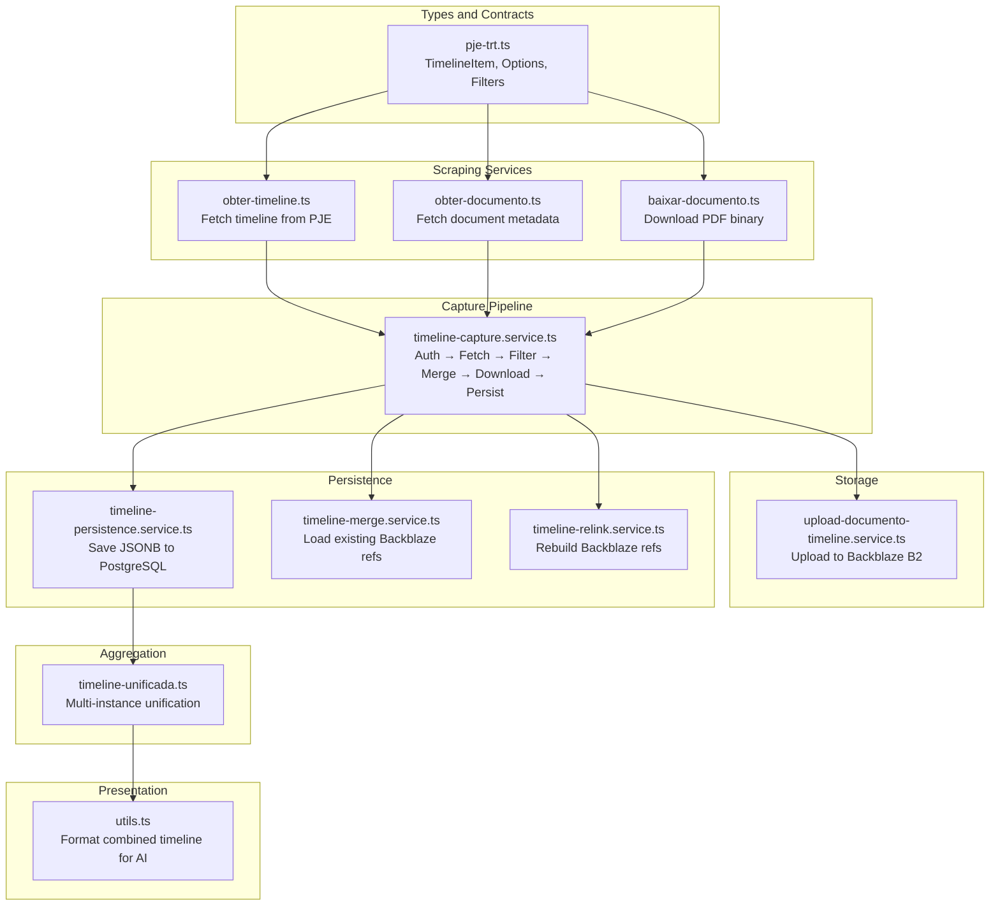
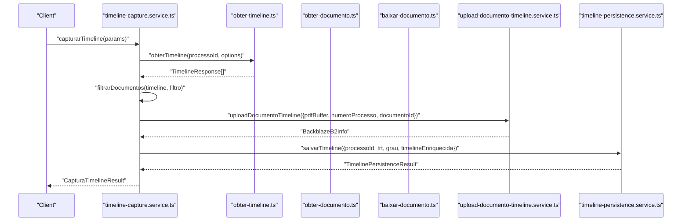
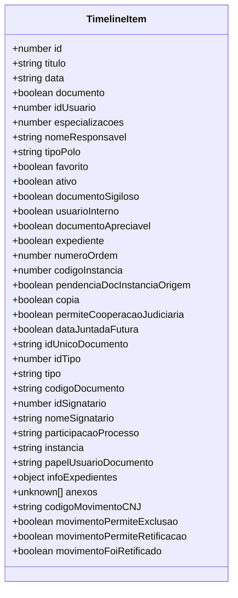
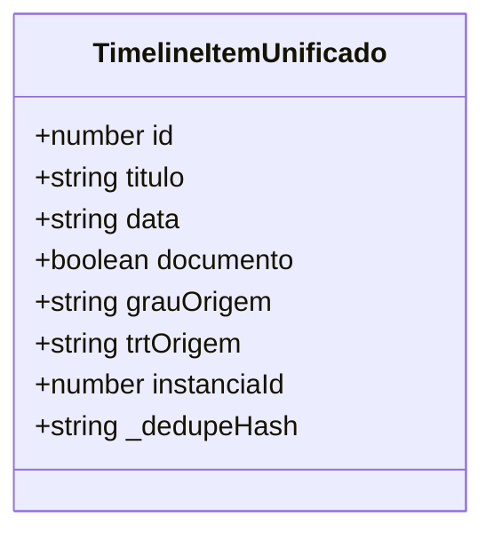
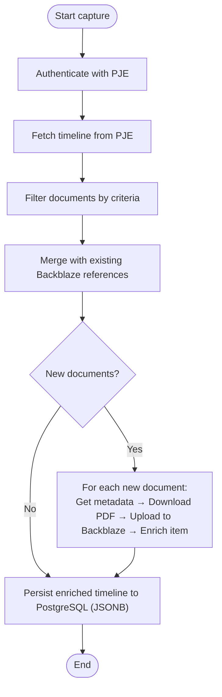
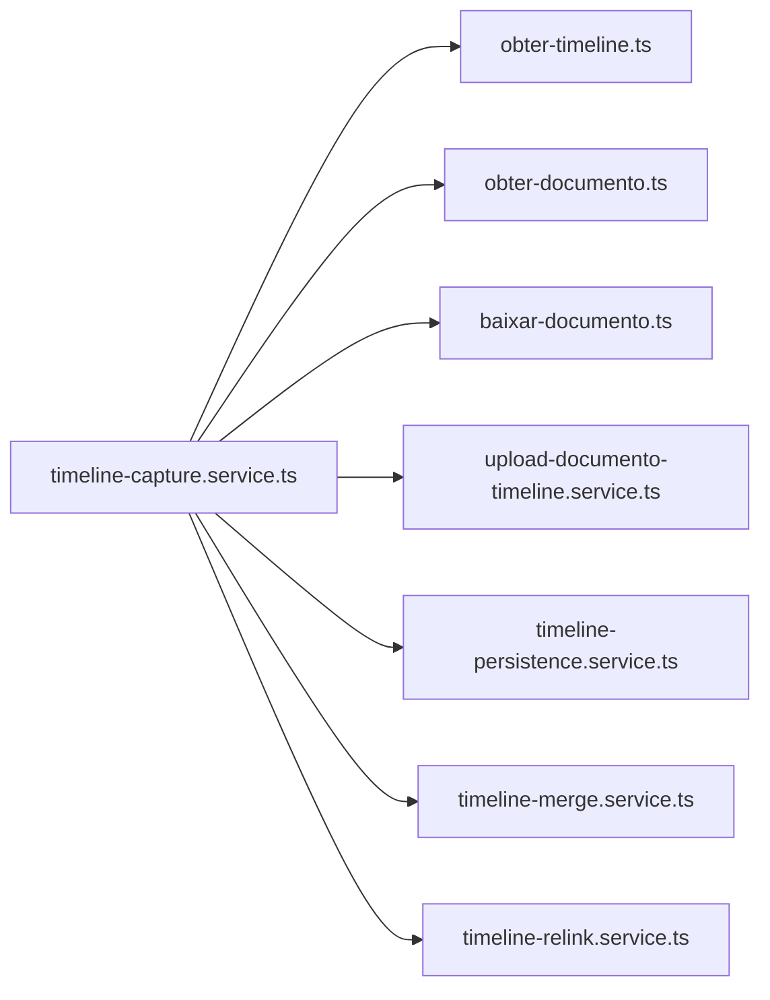

# Timeline and Movimentations System

<cite>
**Referenced Files in This Document**
- [timeline-capture.service.ts](file://src/app/(authenticated)/captura/services/timeline/timeline-capture.service.ts)
- [obter-timeline.ts](file://src/app/(authenticated)/captura/pje-trt/timeline/obter-timeline.ts)
- [obter-documento.ts](file://src/app/(authenticated)/captura/pje-trt/timeline/obter-documento.ts)
- [baixar-documento.ts](file://src/app/(authenticated)/captura/pje-trt/timeline/baixar-documento.ts)
- [pje-trt.ts](file://src/types/contracts/pje-trt.ts)
- [timeline-persistence.service.ts](file://src/app/(authenticated)/captura/services/timeline/timeline-persistence.service.ts)
- [timeline-merge.service.ts](file://src/app/(authenticated)/captura/services/timeline/timeline-merge.service.ts)
- [timeline-relink.service.ts](file://src/app/(authenticated)/captura/services/timeline/timeline-relink.service.ts)
- [upload-documento-timeline.service.ts](file://src/app/(authenticated)/captura/services/storage/upload-documento-timeline.service.ts)
- [timeline-unificada.ts](file://src/app/(authenticated)/acervo/timeline-unificada.ts)
- [utils.ts](file://src/app/(authenticated)/acervo/utils.ts)
- [processos.repository.test.ts](file://src/app/(authenticated)/processos/__tests__/unit/processos.repository.test.ts)
- [fixtures.ts](file://src/app/(authenticated)/processos/__tests__/fixtures.ts)
- [RESUMO-IMPLEMENTACAO-TIMELINE.md](file://scripts/results/api-timeline/RESUMO-IMPLEMENTACAO-TIMELINE.md)
</cite>

## Table of Contents
1. [Introduction](#introduction)
2. [Project Structure](#project-structure)
3. [Core Components](#core-components)
4. [Architecture Overview](#architecture-overview)
5. [Detailed Component Analysis](#detailed-component-analysis)
6. [Dependency Analysis](#dependency-analysis)
7. [Performance Considerations](#performance-considerations)
8. [Troubleshooting Guide](#troubleshooting-guide)
9. [Conclusion](#conclusion)

## Introduction
This document describes the legal process timeline and movimentations system. It explains how process events are captured from PJE-TRT, how the timeline is aggregated from multiple sources, and how the unified timeline is presented. It documents the timeline data model, event categorization (documents vs. movements), chronological ordering, integration with PJE-TRT, manual capture capabilities, filtering, and practical examples. It also covers performance considerations for large timelines, pagination strategies, and real-time updates via WebSocket connections.

## Project Structure
The timeline system spans several layers:
- Types and contracts define the timeline data model and API shapes.
- Scraping services interact with PJE-TRT to fetch timeline data and documents.
- Persistence services store the enriched timeline in PostgreSQL (JSONB).
- Storage services upload PDFs to Backblaze B2.
- Aggregation services unify timelines across instances and deduplicate events.
- Presentation utilities format timelines for AI and user interfaces.

**Diagram sources**
- [pje-trt.ts:13-58](file://src/types/contracts/pje-trt.ts#L13-L58)
- [obter-timeline.ts](file://src/app/(authenticated)/captura/pje-trt/timeline/obter-timeline.ts#L36-L72)
- [obter-documento.ts](file://src/app/(authenticated)/captura/pje-trt/timeline/obter-documento.ts#L40-L82)
- [baixar-documento.ts](file://src/app/(authenticated)/captura/pje-trt/timeline/baixar-documento.ts#L36-L109)
- [timeline-capture.service.ts](file://src/app/(authenticated)/captura/services/timeline/timeline-capture.service.ts#L124-L428)
- [upload-documento-timeline.service.ts](file://src/app/(authenticated)/captura/services/storage/upload-documento-timeline.service.ts#L45-L80)
- [timeline-persistence.service.ts](file://src/app/(authenticated)/captura/services/timeline/timeline-persistence.service.ts#L41-L104)
- [timeline-merge.service.ts](file://src/app/(authenticated)/captura/services/timeline/timeline-merge.service.ts#L33-L78)
- [timeline-relink.service.ts](file://src/app/(authenticated)/captura/services/timeline/timeline-relink.service.ts#L67-L208)
- [timeline-unificada.ts](file://src/app/(authenticated)/acervo/timeline-unificada.ts#L18-L27)
- [utils.ts](file://src/app/(authenticated)/acervo/utils.ts#L233-L261)

**Section sources**
- [pje-trt.ts:13-58](file://src/types/contracts/pje-trt.ts#L13-L58)
- [timeline-capture.service.ts](file://src/app/(authenticated)/captura/services/timeline/timeline-capture.service.ts#L124-L428)

## Core Components
- Timeline data model: A unified item representing either a document or a procedural movement, with standardized fields for identification, classification, timestamps, and metadata.
- Capture pipeline: Authenticates against PJE-TRT, fetches the timeline, filters documents, merges with existing Backblaze references, downloads PDFs, enriches with storage info, persists to PostgreSQL, and returns results.
- Storage integration: Uploads PDFs to Backblaze B2 with a structured path and returns public URLs.
- Persistence: Stores the enriched timeline as JSONB in the acervo table with metadata counters.
- Aggregation: Unifies timelines across instances (first and second instance, TST) and deduplicates repeated events.
- Presentation: Formats combined timelines for downstream consumers (e.g., AI).

**Section sources**
- [pje-trt.ts:13-58](file://src/types/contracts/pje-trt.ts#L13-L58)
- [timeline-capture.service.ts](file://src/app/(authenticated)/captura/services/timeline/timeline-capture.service.ts#L86-L119)
- [upload-documento-timeline.service.ts](file://src/app/(authenticated)/captura/services/storage/upload-documento-timeline.service.ts#L45-L80)
- [timeline-persistence.service.ts](file://src/app/(authenticated)/captura/services/timeline/timeline-persistence.service.ts#L41-L104)
- [timeline-unificada.ts](file://src/app/(authenticated)/acervo/timeline-unificada.ts#L18-L27)
- [utils.ts](file://src/app/(authenticated)/acervo/utils.ts#L233-L261)

## Architecture Overview
The system integrates external PJE-TRT APIs with internal storage and persistence layers. The capture service orchestrates authentication, scraping, enrichment, and persistence. Backblaze B2 stores PDFs and provides public URLs. PostgreSQL (JSONB) stores the timeline with metadata. Aggregation services combine multi-instance timelines and deduplicate events.

**Diagram sources**
- [timeline-capture.service.ts](file://src/app/(authenticated)/captura/services/timeline/timeline-capture.service.ts#L124-L428)
- [obter-timeline.ts](file://src/app/(authenticated)/captura/pje-trt/timeline/obter-timeline.ts#L36-L72)
- [obter-documento.ts](file://src/app/(authenticated)/captura/pje-trt/timeline/obter-documento.ts#L40-L82)
- [baixar-documento.ts](file://src/app/(authenticated)/captura/pje-trt/timeline/baixar-documento.ts#L36-L109)
- [upload-documento-timeline.service.ts](file://src/app/(authenticated)/captura/services/storage/upload-documento-timeline.service.ts#L45-L80)
- [timeline-persistence.service.ts](file://src/app/(authenticated)/captura/services/timeline/timeline-persistence.service.ts#L41-L104)

## Detailed Component Analysis

### Timeline Data Model
The timeline item supports two categories:
- Document: Includes metadata such as type, signer, confidentiality, and document-specific fields.
- Movement: Includes procedural movement codes and attributes.

Key fields enable filtering and display:
- Classification: boolean flag indicating document vs. movement.
- Timestamp: ISO 8601 date string for chronological ordering.
- Signer and confidentiality flags for access control.
- Type and category for categorization and filtering.

**Diagram sources**
- [pje-trt.ts:13-58](file://src/types/contracts/pje-trt.ts#L13-L58)

**Section sources**
- [pje-trt.ts:13-58](file://src/types/contracts/pje-trt.ts#L13-L58)

### Movimentacao Interface and Event Categorization
The system treats movimentacoes as a special category of timeline items where document is false. The Movimentacao interface is represented by the timeline item with document=false and includes procedural movement codes and attributes for legal action categorization.

Event categorization:
- Documents: Filterable by type, confidentiality, and signing status.
- Movements: Filterable by procedural codes and textual descriptions.

Filtering criteria:
- Only signed documents (optional).
- Non-confidential documents (optional).
- Specific document types.
- Date range boundaries.

**Section sources**
- [pje-trt.ts:13-58](file://src/types/contracts/pje-trt.ts#L13-L58)
- [timeline-capture.service.ts](file://src/app/(authenticated)/captura/services/timeline/timeline-capture.service.ts#L86-L119)

### Timeline Aggregation and Unification
The unified timeline service aggregates multiple instances (first and second instance, TST) and deduplicates events. Each item includes origin metadata (instance, TRT, instance ID) and a deduplication hash.

**Diagram sources**
- [timeline-unificada.ts](file://src/app/(authenticated)/acervo/timeline-unificada.ts#L18-L27)

**Section sources**
- [timeline-unificada.ts](file://src/app/(authenticated)/acervo/timeline-unificada.ts#L18-L27)

### PJE-TRT Integration and Capture Pipeline
The capture pipeline authenticates, fetches the timeline, filters documents, merges with existing Backblaze references, downloads PDFs, enriches items with storage info, and persists to PostgreSQL.

**Diagram sources**
- [timeline-capture.service.ts](file://src/app/(authenticated)/captura/services/timeline/timeline-capture.service.ts#L124-L428)
- [timeline-merge.service.ts](file://src/app/(authenticated)/captura/services/timeline/timeline-merge.service.ts#L33-L78)
- [upload-documento-timeline.service.ts](file://src/app/(authenticated)/captura/services/storage/upload-documento-timeline.service.ts#L45-L80)
- [timeline-persistence.service.ts](file://src/app/(authenticated)/captura/services/timeline/timeline-persistence.service.ts#L41-L104)

**Section sources**
- [timeline-capture.service.ts](file://src/app/(authenticated)/captura/services/timeline/timeline-capture.service.ts#L124-L428)
- [timeline-merge.service.ts](file://src/app/(authenticated)/captura/services/timeline/timeline-merge.service.ts#L33-L78)
- [upload-documento-timeline.service.ts](file://src/app/(authenticated)/captura/services/storage/upload-documento-timeline.service.ts#L45-L80)
- [timeline-persistence.service.ts](file://src/app/(authenticated)/captura/services/timeline/timeline-persistence.service.ts#L41-L104)

### Manual Timeline Entry and Filtering
Manual entry is supported through the capture service’s filtering options. Users can specify:
- Only signed documents.
- Only non-confidential documents.
- Specific document types.
- Date range boundaries.

These filters are applied during capture to reduce the number of documents processed and stored.

**Section sources**
- [timeline-capture.service.ts](file://src/app/(authenticated)/captura/services/timeline/timeline-capture.service.ts#L86-L119)

### Practical Examples
- Timeline construction: The capture service builds a timeline with counts of items, documents, and movements, then optionally filters and enriches with Backblaze references.
- Event display patterns: Documents are displayed with type, signer, and confidentiality flags; movements are displayed with procedural codes and descriptions.
- User interaction: The unified timeline service adds origin metadata and deduplication hashes to support cross-instance navigation and deduplication.

**Section sources**
- [timeline-capture.service.ts](file://src/app/(authenticated)/captura/services/timeline/timeline-capture.service.ts#L124-L428)
- [timeline-unificada.ts](file://src/app/(authenticated)/acervo/timeline-unificada.ts#L18-L27)

## Dependency Analysis
The capture service depends on:
- Authentication and configuration services for PJE access.
- PJE timeline and document APIs.
- Storage upload service for Backblaze.
- Persistence service for PostgreSQL.
- Merge and relink services for resilient document references.

**Diagram sources**
- [timeline-capture.service.ts](file://src/app/(authenticated)/captura/services/timeline/timeline-capture.service.ts#L12-L29)
- [obter-timeline.ts](file://src/app/(authenticated)/captura/pje-trt/timeline/obter-timeline.ts#L27-L29)
- [obter-documento.ts](file://src/app/(authenticated)/captura/pje-trt/timeline/obter-documento.ts#L31-L33)
- [baixar-documento.ts](file://src/app/(authenticated)/captura/pje-trt/timeline/baixar-documento.ts#L28-L30)
- [upload-documento-timeline.service.ts](file://src/app/(authenticated)/captura/services/storage/upload-documento-timeline.service.ts#L8-L9)
- [timeline-persistence.service.ts](file://src/app/(authenticated)/captura/services/timeline/timeline-persistence.service.ts#L11-L12)
- [timeline-merge.service.ts](file://src/app/(authenticated)/captura/services/timeline/timeline-merge.service.ts#L11-L12)
- [timeline-relink.service.ts](file://src/app/(authenticated)/captura/services/timeline/timeline-relink.service.ts#L14-L16)

**Section sources**
- [timeline-capture.service.ts](file://src/app/(authenticated)/captura/services/timeline/timeline-capture.service.ts#L12-L29)

## Performance Considerations
- Large timelines: Store as JSONB in PostgreSQL for efficient querying and indexing. Use pagination at the API layer to avoid loading entire timelines into memory.
- Pagination strategies: Implement cursor-based pagination or offset-based pagination depending on stability of ordering keys. For timeline ordering, prefer stable timestamps and IDs.
- Real-time updates: Use WebSocket connections to push incremental updates (new documents or movements) to clients. Clients can subscribe to process-specific channels and update the UI incrementally.
- Deduplication: Use deduplication hashes in unified timelines to prevent redundant rendering and improve performance.
- Backblaze caching: Merge with existing Backblaze references to avoid re-downloading documents, reducing network and storage costs.
- Filtering early: Apply filters during capture to minimize downstream processing and storage overhead.

[No sources needed since this section provides general guidance]

## Troubleshooting Guide
Common issues and resolutions:
- Authentication failures: Verify tribunal configuration and credentials for the given TRT and degree.
- Missing Backblaze references: Use the relink service to reconstruct references from existing files in Backblaze B2.
- Document download errors: Validate PDF validity and retry with delays between requests.
- Persistence errors: Log and handle PostgreSQL errors without failing the entire capture operation.

**Section sources**
- [timeline-capture.service.ts](file://src/app/(authenticated)/captura/services/timeline/timeline-capture.service.ts#L150-L174)
- [timeline-relink.service.ts](file://src/app/(authenticated)/captura/services/timeline/timeline-relink.service.ts#L67-L208)
- [baixar-documento.ts](file://src/app/(authenticated)/captura/pje-trt/timeline/baixar-documento.ts#L94-L97)
- [timeline-persistence.service.ts](file://src/app/(authenticated)/captura/services/timeline/timeline-persistence.service.ts#L91-L94)

## Conclusion
The timeline and movimentations system provides a robust framework for capturing, aggregating, and presenting legal process events. It integrates seamlessly with PJE-TRT, supports manual filtering and enrichment, and offers scalable persistence and storage. The unified timeline enables cross-instance visibility with deduplication, while performance strategies and real-time updates ensure responsiveness at scale.