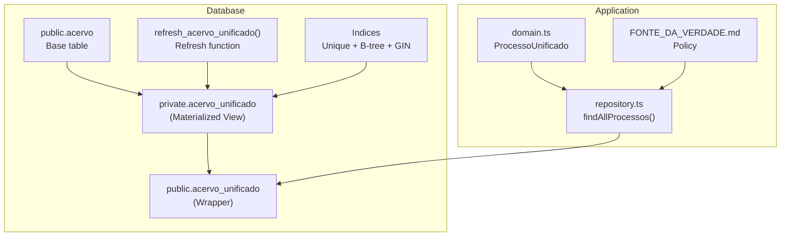
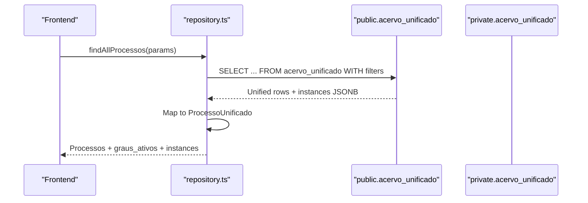
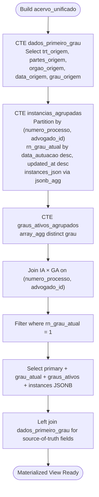
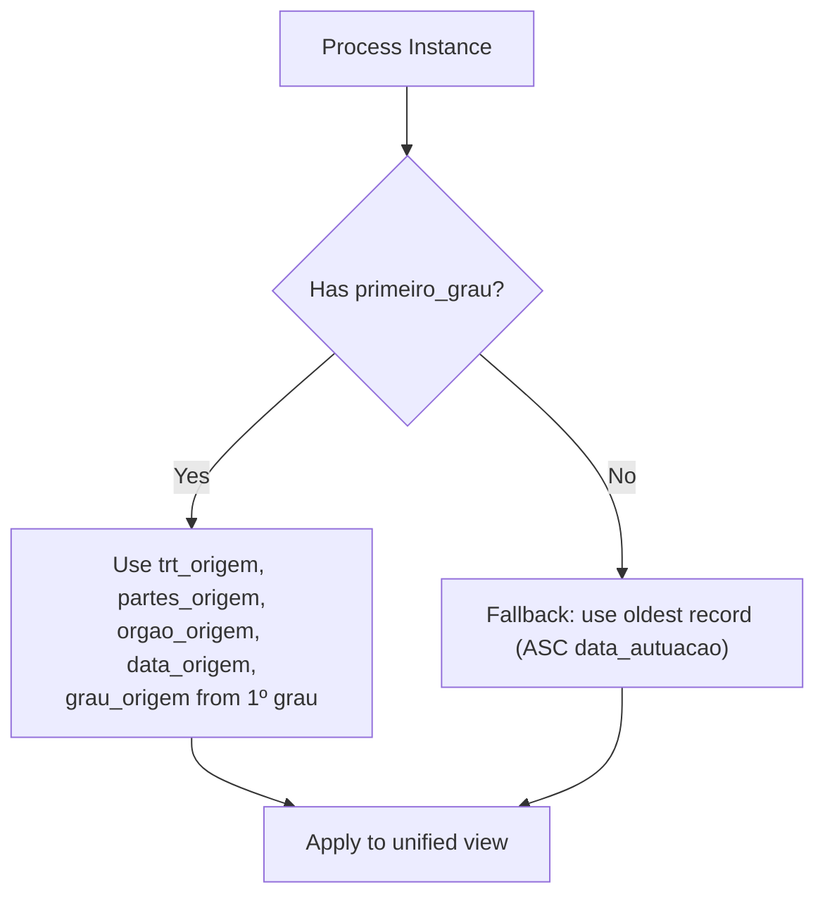
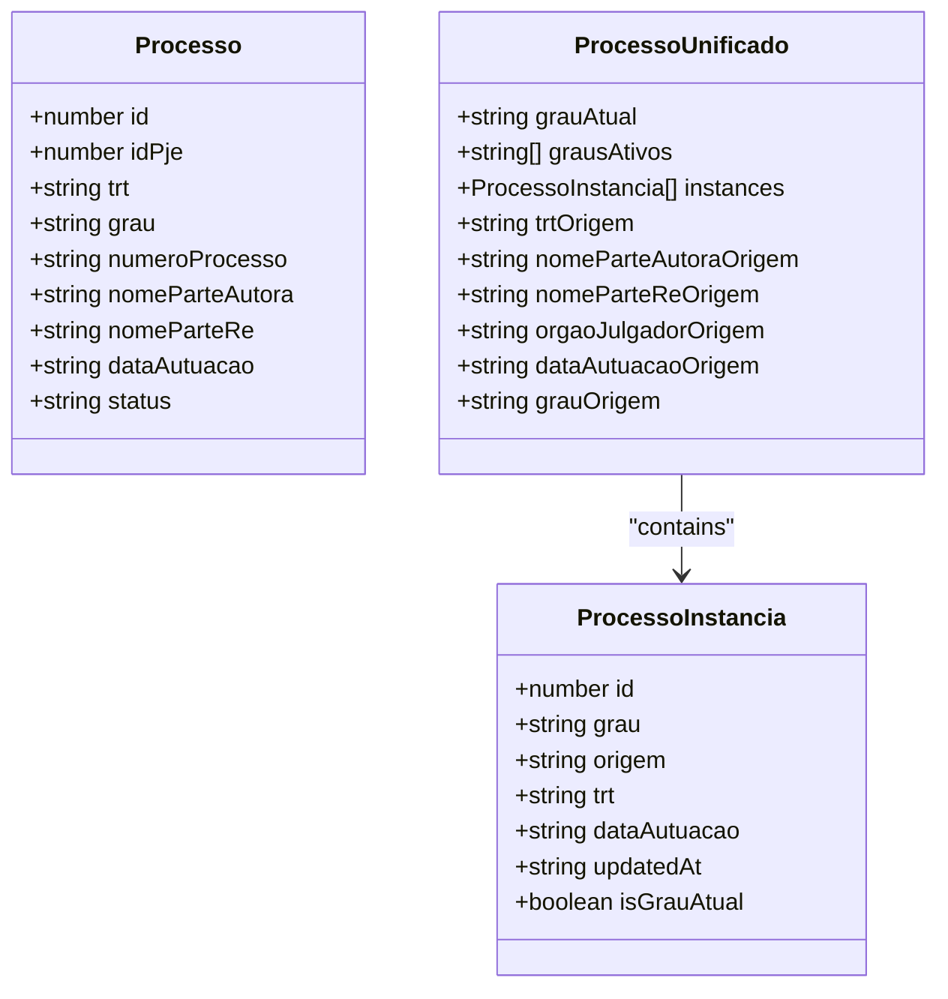
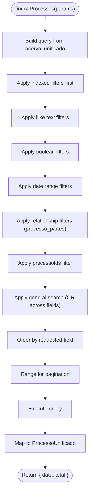

# Unified Process View and Multi-Instance Tracking

<cite>
**Referenced Files in This Document**
- [05_acervo_unificado_view.sql](file://supabase/schemas/05_acervo_unificado_view.sql)
- [04_acervo.sql](file://supabase/schemas/04_acervo.sql)
- [20251223000001_fix_acervo_unificado_fonte_verdade.sql](file://supabase/migrations/20251223000001_fix_acervo_unificado_fonte_verdade.sql)
- [20260420140000_fase5_acervo_unificado_to_private.sql](file://supabase/migrations/20260420140000_fase5_acervo_unificado_to_private.sql)
- [domain.ts](file://src/app/(authenticated)/processos/domain.ts)
- [repository.ts](file://src/app/(authenticated)/processos/repository.ts)
- [FONTE_DA_VERDADE.md](file://src/app/(authenticated)/processos/FONTE_DA_VERDADE.md)
- [acervo-actions.ts](file://src/app/(authenticated)/acervo/actions/acervo-actions.ts)
</cite>

## Table of Contents
1. [Introduction](#introduction)
2. [Project Structure](#project-structure)
3. [Core Components](#core-components)
4. [Architecture Overview](#architecture-overview)
5. [Detailed Component Analysis](#detailed-component-analysis)
6. [Dependency Analysis](#dependency-analysis)
7. [Performance Considerations](#performance-considerations)
8. [Troubleshooting Guide](#troubleshooting-guide)
9. [Conclusion](#conclusion)

## Introduction
This document explains the Unified Process View system that enables multi-instance legal case tracking across multiple TRTs and jurisdictions. It covers the acervo_unificado view implementation, the source-of-truth methodology prioritizing first-degree jurisdiction data, and how the system aggregates process instances while maintaining historical tracking. It also documents the ProcessoUnificado interface, derived fields such as grauAtual, grausAtivos, and the instances array, and provides practical guidance for querying, filtering, and optimizing unified views.

## Project Structure
The Unified Process View spans both backend database views and frontend TypeScript interfaces:

- Database layer: A materialized view in the private schema with a public security_invoker wrapper, plus supporting indices and refresh functions.
- Domain layer: TypeScript interfaces and selection helpers for unified processes.
- Repository layer: Query builders and caching for unified process retrieval.
- Documentation: Source-of-truth policy for first-degree data.

**Diagram sources**
- [05_acervo_unificado_view.sql:44-151](file://supabase/schemas/05_acervo_unificado_view.sql#L44-L151)
- [04_acervo.sql:4-32](file://supabase/schemas/04_acervo.sql#L4-L32)
- [20260420140000_fase5_acervo_unificado_to_private.sql:32-63](file://supabase/migrations/20260420140000_fase5_acervo_unificado_to_private.sql#L32-L63)
- [repository.ts](file://src/app/(authenticated)/processos/repository.ts#L336-L664)
- [domain.ts](file://src/app/(authenticated)/processos/domain.ts#L147-L165)

**Section sources**
- [05_acervo_unificado_view.sql:1-247](file://supabase/schemas/05_acervo_unificado_view.sql#L1-L247)
- [04_acervo.sql:1-77](file://supabase/schemas/04_acervo.sql#L1-L77)
- [domain.ts](file://src/app/(authenticated)/processos/domain.ts#L147-L165)
- [repository.ts](file://src/app/(authenticated)/processos/repository.ts#L336-L664)

## Core Components
- Materialized View (private): Groups process instances by numero_processo and advogado_id, identifies grau_atual by latest data_autuacao and updated_at, collects instances as JSONB, and exposes graus_ativos.
- Public Wrapper: Security invoker view over private.acervo_unificado to preserve PostgREST compatibility.
- Source-of-Truth Fields: trt_origem, nome_parte_autora_origem, nome_parte_re_origem, orgao_julgador_origem, data_autuacao_origem, grau_origem, ensuring author/re names and origin dates remain immutable across appeals.
- TypeScript Interface: ProcessoUnificado augments Processo with grauAtual, grausAtivos, instances, and source-of-truth fields.
- Repository Functions: findAllProcessos applies 19 filters against acervo_unificado, paginates, and caches results; findProcessoUnificadoById fetches a single unified record.

**Section sources**
- [05_acervo_unificado_view.sql:44-151](file://supabase/schemas/05_acervo_unificado_view.sql#L44-L151)
- [05_acervo_unificado_view.sql:171-196](file://supabase/schemas/05_acervo_unificado_view.sql#L171-L196)
- [20251223000001_fix_acervo_unificado_fonte_verdade.sql:23-160](file://supabase/migrations/20251223000001_fix_acervo_unificado_fonte_verdade.sql#L23-L160)
- [domain.ts](file://src/app/(authenticated)/processos/domain.ts#L147-L165)
- [repository.ts](file://src/app/(authenticated)/processos/repository.ts#L336-L664)

## Architecture Overview
The system separates concerns across layers:

- Data capture populates public.acervo with instances per grau and TRT.
- private.acervo_unificado aggregates instances, selects grau_atual, computes graus_ativos, and enriches with source-of-truth fields.
- public.acervo_unificado exposes the unified view to PostgREST via security_invoker.
- Application code queries acervo_unificado, applies filters, and renders unified rows with instances.

**Diagram sources**
- [repository.ts](file://src/app/(authenticated)/processos/repository.ts#L336-L664)
- [05_acervo_unificado_view.sql:233-235](file://supabase/schemas/05_acervo_unificado_view.sql#L233-L235)

**Section sources**
- [repository.ts](file://src/app/(authenticated)/processos/repository.ts#L336-L664)
- [05_acervo_unificado_view.sql:233-235](file://supabase/schemas/05_acervo_unificado_view.sql#L233-L235)

## Detailed Component Analysis

### Database Materialized View: acervo_unificado
- Purpose: Aggregate multi-instance processes into a single unified row per numero_processo and advogado_id.
- Aggregation logic:
  - Partition by numero_processo and advogado_id.
  - Row_number identifies grau_atual by ordering by data_autuacao desc, updated_at desc.
  - jsonb_agg collects all instances with id, grau, origem, trt, data_autuacao, updated_at.
  - graus_ativos computed via array_agg of distinct grau.
- Source-of-truth enrichment:
  - CTE dados_primeiro_grau selects trt_origem, nome_parte_autora_origem, nome_parte_re_origem, orgao_julgador_origem, data_autuacao_origem, grau_origem.
  - Prioritizes primeiro_grau; otherwise falls back to earliest record.
- Output fields:
  - Primary fields from grau_atual instance.
  - Derived: grau_atual, graus_ativos, instances (JSONB with is_grau_atual flag).
  - Source-of-truth: trt_origem, nome_parte_autora_origem, nome_parte_re_origem, orgao_julgador_origem, data_autuacao_origem, grau_origem.

**Diagram sources**
- [20251223000001_fix_acervo_unificado_fonte_verdade.sql:27-160](file://supabase/migrations/20251223000001_fix_acervo_unificado_fonte_verdade.sql#L27-L160)

**Section sources**
- [05_acervo_unificado_view.sql:44-151](file://supabase/schemas/05_acervo_unificado_view.sql#L44-L151)
- [20251223000001_fix_acervo_unificado_fonte_verdade.sql:23-160](file://supabase/migrations/20251223000001_fix_acervo_unificado_fonte_verdade.sql#L23-L160)

### Source-of-Truth Methodology
- Rule: First-degree jurisdiction data is always the source of truth for identifiers.
- Fields enriched from 1º grau: trt_origem, nome_parte_autora_origem, nome_parte_re_origem, orgao_julgador_origem, data_autuacao_origem, grau_origem.
- Fallback: If no primeiro_grau exists, use the oldest record by data_autuacao.
- Policy rationale: Pole positions invert across appeals; identifiers must remain immutable.

**Diagram sources**
- [20251223000001_fix_acervo_unificado_fonte_verdade.sql:27-44](file://supabase/migrations/20251223000001_fix_acervo_unificado_fonte_verdade.sql#L27-L44)
- [FONTE_DA_VERDADE.md](file://src/app/(authenticated)/processos/FONTE_DA_VERDADE.md#L53-L83)

**Section sources**
- [FONTE_DA_VERDADE.md](file://src/app/(authenticated)/processos/FONTE_DA_VERDADE.md#L1-L136)
- [20251223000001_fix_acervo_unificado_fonte_verdade.sql:27-44](file://supabase/migrations/20251223000001_fix_acervo_unificado_fonte_verdade.sql#L27-L44)

### ProcessoUnificado Interface and Derived Fields
- Extends Processo with:
  - grauAtual: current degree (first_grau, second_grau, tribunal_superior).
  - grausAtivos: array of degrees currently active for the process.
  - instances: array of ProcessoInstancia with id, grau, origem, trt, data_autuacao, updated_at, isGrauAtual.
  - Source-of-truth fields: trtOrigem, nomeParteAutoraOrigem, nomeParteReOrigem, orgaoJulgadorOrigem, dataAutuacaoOrigem, grauOrigem.

**Diagram sources**
- [domain.ts](file://src/app/(authenticated)/processos/domain.ts#L90-L118)
- [domain.ts](file://src/app/(authenticated)/processos/domain.ts#L128-L137)
- [domain.ts](file://src/app/(authenticated)/processos/domain.ts#L147-L165)

**Section sources**
- [domain.ts](file://src/app/(authenticated)/processos/domain.ts#L147-L165)

### Repository Queries and Filtering
- findAllProcessos:
  - Selects from acervo_unificado using getProcessoUnificadoColumns().
  - Applies filters in order of performance: indexed fields (advogado_id, origem, trt, grau_atual, numero_processo), ilike text filters, booleans, date ranges, and general search.
  - Orders by chosen field and paginates using range(offset, offset + limite - 1).
  - Returns unified rows with instances JSONB mapped to ProcessoUnificado.
- findProcessoUnificadoById:
  - Fetches a single unified record by id from acervo_unificado.
  - Maps to ProcessoUnificado and caches for 600 seconds.

**Diagram sources**
- [repository.ts](file://src/app/(authenticated)/processos/repository.ts#L336-L664)

**Section sources**
- [repository.ts](file://src/app/(authenticated)/processos/repository.ts#L336-L664)

### Refresh and Maintenance
- refresh_acervo_unificado:
  - Attempts concurrent refresh (requires unique index); falls back to normal refresh if needed.
- Automatic refresh trigger:
  - Optional trigger notifies acervo_unificado_needs_refresh; production typically prefers scheduled/manual refresh to avoid frequent MV updates.

**Section sources**
- [05_acervo_unificado_view.sql:171-196](file://supabase/schemas/05_acervo_unificado_view.sql#L171-L196)
- [05_acervo_unificado_view.sql:198-221](file://supabase/schemas/05_acervo_unificado_view.sql#L198-L221)

## Dependency Analysis
- acervo_unificado depends on public.acervo for base data.
- private.acervo_unificado depends on:
  - Window functions for grau_atual.
  - jsonb_agg for instances.
  - Left join to dados_primeiro_grau for source-of-truth enrichment.
- public.acervo_unificado is a security_invoker wrapper over private.acervo_unificado.
- Application code depends on repository.ts for unified queries and domain.ts for typing.

**Diagram sources**
- [05_acervo_unificado_view.sql:44-151](file://supabase/schemas/05_acervo_unificado_view.sql#L44-L151)
- [20260420140000_fase5_acervo_unificado_to_private.sql:32-63](file://supabase/migrations/20260420140000_fase5_acervo_unificado_to_private.sql#L32-L63)
- [repository.ts](file://src/app/(authenticated)/processos/repository.ts#L336-L664)
- [domain.ts](file://src/app/(authenticated)/processos/domain.ts#L147-L165)

**Section sources**
- [05_acervo_unificado_view.sql:44-151](file://supabase/schemas/05_acervo_unificado_view.sql#L44-L151)
- [20260420140000_fase5_acervo_unificado_to_private.sql:32-63](file://supabase/migrations/20260420140000_fase5_acervo_unificado_to_private.sql#L32-L63)
- [repository.ts](file://src/app/(authenticated)/processos/repository.ts#L336-L664)

## Performance Considerations
- Materialized View Refresh:
  - Use refresh_acervo_unificado with concurrent=true for minimal blocking; fallback to normal refresh if needed.
- Indexing Strategy:
  - Unique index on (id, numero_processo, advogado_id) for refresh concurrency.
  - B-tree indexes on numero_processo, advogado_id, trt, grau_atual, data_autuacao, responsavel_id, origem, and compound keys for efficient filtering.
  - Consider GIN index on instances JSONB if querying nested fields frequently.
- Column Selection:
  - Use getProcessoUnificadoColumns to limit selected fields and reduce I/O.
- Caching:
  - Repository caches unified results for 300 seconds; adjust TTL based on refresh cadence and data volatility.
- Pagination:
  - Count is exact; ensure filters leverage indexes to keep count accurate and fast.

**Section sources**
- [05_acervo_unificado_view.sql:155-169](file://supabase/schemas/05_acervo_unificado_view.sql#L155-L169)
- [05_acervo_unificado_view.sql:171-196](file://supabase/schemas/05_acervo_unificado_view.sql#L171-L196)
- [repository.ts](file://src/app/(authenticated)/processos/repository.ts#L336-L664)
- [domain.ts](file://src/app/(authenticated)/processos/domain.ts#L637-L673)

## Troubleshooting Guide
- Refresh Failures:
  - If concurrent refresh fails (e.g., first run), the function automatically falls back to normal refresh. Verify MV creation and unique index existence.
- Missing First-Degree Data:
  - If no primeiro_grau exists, fallback to the oldest record is applied. Confirm data capture coverage for early-degree records.
- Incorrect Pole Positions:
  - Ensure UI reads trt_origem and partes_origem for author/re identification; avoid relying solely on current grau fields.
- Query Performance Degradation:
  - Confirm filters hit supported indexes. Prefer indexed fields (trt, grau_atual, numero_processo) and avoid broad ilike searches when possible.
- Cache Stale Data:
  - Unified results are cached for 300 seconds. Trigger refresh or wait for TTL expiration if data appears outdated.

**Section sources**
- [05_acervo_unificado_view.sql:171-196](file://supabase/schemas/05_acervo_unificado_view.sql#L171-L196)
- [20251223000001_fix_acervo_unificado_fonte_verdade.sql:16-17](file://supabase/migrations/20251223000001_fix_acervo_unificado_fonte_verdade.sql#L16-L17)
- [FONTE_DA_VERDADE.md](file://src/app/(authenticated)/processos/FONTE_DA_VERDADE.md#L131-L136)
- [repository.ts](file://src/app/(authenticated)/processos/repository.ts#L336-L664)

## Conclusion
The Unified Process View system consolidates multi-instance legal cases into a single, source-of-truth–enriched representation. By prioritizing first-degree data for identifiers and aggregating instances with derived fields like grauAtual and grausAtivos, it provides a coherent view across TRTs and jurisdictions. The combination of materialized views, targeted indices, and application-layer caching ensures scalable, real-time performance for unified process retrieval and rendering.