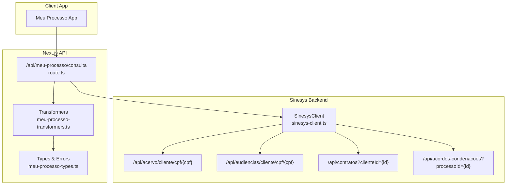
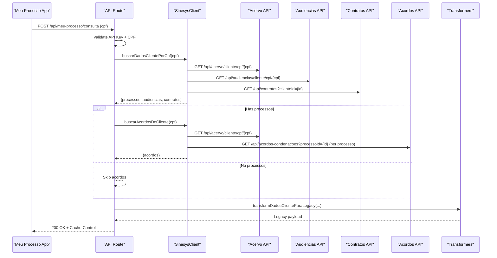
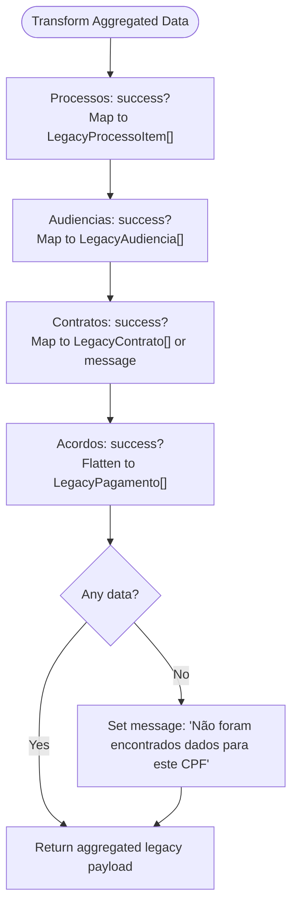
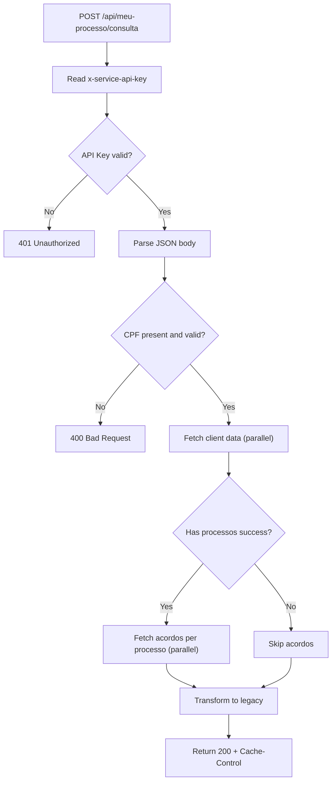
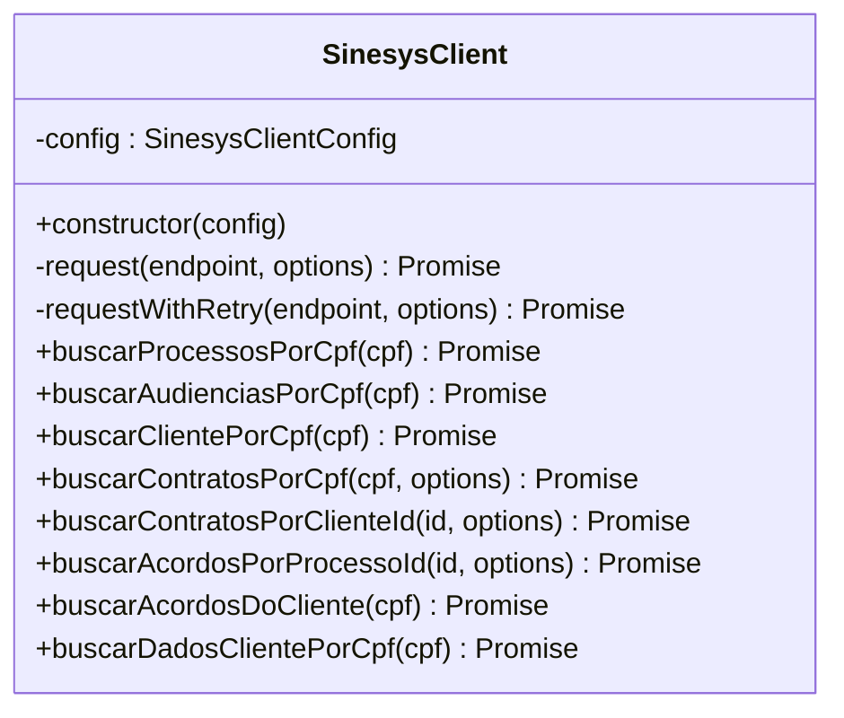
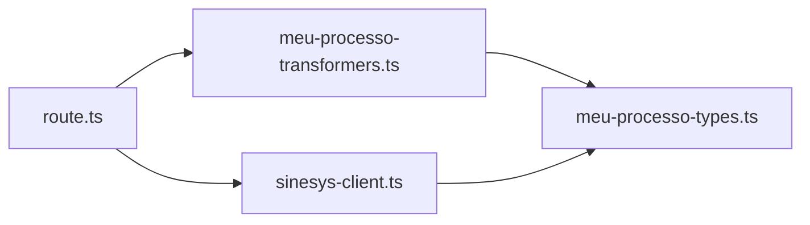

# Meu Processo Transformers

<cite>
**Referenced Files in This Document**
- [meu-processo-transformers.ts](file://lib/transformers/meu-processo-transformers.ts)
- [meu-processo-types.ts](file://lib/types/meu-processo-types.ts)
- [route.ts](file://app/api/meu-processo/consulta/route.ts)
- [README.md](file://app/api/meu-processo/README.md)
- [sinesys-client.ts](file://lib/services/sinesys-client.ts)
- [transformers.test.ts](file://tests/unit/meu-processo/transformers.test.ts)
- [api-endpoint.test.ts](file://tests/integration/meu-processo/api-endpoint.test.ts)
- [ANALISE-MIGRACAO-MEU-PROCESSO.md](file://ANALISE-MIGRACAO-MEU-PROCESSO.md)
</cite>

## Table of Contents
1. [Introduction](#introduction)
2. [Project Structure](#project-structure)
3. [Core Components](#core-components)
4. [Architecture Overview](#architecture-overview)
5. [Detailed Component Analysis](#detailed-component-analysis)
6. [Dependency Analysis](#dependency-analysis)
7. [Performance Considerations](#performance-considerations)
8. [Troubleshooting Guide](#troubleshooting-guide)
9. [Conclusion](#conclusion)

## Introduction
This document explains the Meu Processo Transformers module and the surrounding integration that powers the “Meu Processo” client-facing app. It focuses on how data from the Sinesys APIs is transformed into a legacy-compatible format expected by the app, and how the API route orchestrates authentication, validation, parallel fetching, and transformation.

The goal is to provide a clear, layered understanding suitable for both developers and stakeholders, with diagrams and references to the actual source files.

## Project Structure
The Meu Processo integration spans three main areas:
- Transformers: Convert Sinesys responses into the legacy N8N-compatible shape
- API Route: Validates requests, authenticates, fetches data, and returns transformed results
- Types: Define Sinesys responses, legacy shapes, and errors

**Diagram sources**
- [route.ts](file://app/api/meu-processo/consulta/route.ts#L1-L182)
- [meu-processo-transformers.ts](file://lib/transformers/meu-processo-transformers.ts#L1-L361)
- [meu-processo-types.ts](file://lib/types/meu-processo-types.ts#L1-L328)
- [sinesys-client.ts](file://lib/services/sinesys-client.ts#L1-L373)

**Section sources**
- [route.ts](file://app/api/meu-processo/consulta/route.ts#L1-L182)
- [meu-processo-transformers.ts](file://lib/transformers/meu-processo-transformers.ts#L1-L361)
- [meu-processo-types.ts](file://lib/types/meu-processo-types.ts#L1-L328)
- [sinesys-client.ts](file://lib/services/sinesys-client.ts#L1-L373)

## Core Components
- Transformers: Convert Sinesys entities (processes, audiencias, contratos, acordos/condenacoes) into the legacy N8N shape used by the Meu Processo app. Includes helpers to extract jurisdiction/municipality from tribunal/vara, flatten acordos into individual payment rows, and aggregate all client data into a single response.
- API Route: Enforces authentication, validates CPF, triggers parallel fetches via SinesysClient, conditionally fetches acordos, applies transformations, and returns a legacy-shaped payload with cache headers.
- Types: Strongly typed interfaces for Sinesys responses, legacy shapes, and error handling.
- SinesysClient: Encapsulates HTTP calls, timeouts, retries, and parallel orchestration for client data retrieval.

**Section sources**
- [meu-processo-transformers.ts](file://lib/transformers/meu-processo-transformers.ts#L1-L361)
- [route.ts](file://app/api/meu-processo/consulta/route.ts#L1-L182)
- [meu-processo-types.ts](file://lib/types/meu-processo-types.ts#L1-L328)
- [sinesys-client.ts](file://lib/services/sinesys-client.ts#L1-L373)

## Architecture Overview
The Meu Processo API route acts as a thin adapter that:
- Authenticates with a service API key
- Validates CPF
- Calls SinesysClient to fetch processos, audiencias, and contratos in parallel
- Optionally fetches acordos per processos
- Transforms all data into the legacy shape
- Returns a cached response

**Diagram sources**
- [route.ts](file://app/api/meu-processo/consulta/route.ts#L50-L121)
- [sinesys-client.ts](file://lib/services/sinesys-client.ts#L274-L357)
- [meu-processo-transformers.ts](file://lib/transformers/meu-processo-transformers.ts#L307-L361)

**Section sources**
- [route.ts](file://app/api/meu-processo/consulta/route.ts#L50-L121)
- [sinesys-client.ts](file://lib/services/sinesys-client.ts#L274-L357)
- [meu-processo-transformers.ts](file://lib/transformers/meu-processo-transformers.ts#L307-L361)

## Detailed Component Analysis

### Transformers Module
Responsibilities:
- Extract jurisdiction/municipality from tribunal/vara
- Transform timeline items into legacy movements
- Map Sinesys instances to legacy instance shape
- Convert Sinesys processes to legacy process items, handling sigilo and timeline availability
- Transform audiencias to legacy shape, combining date/time and selecting virtual link
- Transform contratos to legacy shape, falling back to status if stage is missing
- Flatten acordos into legacy payment rows, formatting monetary values and mapping parcel fields
- Aggregate all client data into a single legacy response, including error messages when nothing is found

**Diagram sources**
- [meu-processo-transformers.ts](file://lib/transformers/meu-processo-transformers.ts#L307-L361)

Key functions and behaviors:
- Jurisdiction extraction from tribunal name and municipality from vara
- Timeline flattening into legacy movements
- Instance mapping with empty movements (timeline grouping not supported in Sinesys)
- Audiência virtual link selection and client name injection
- Contrato fallback from stage to status
- Acordo flattening and monetary formatting
- Aggregated message when no data is available

**Section sources**
- [meu-processo-transformers.ts](file://lib/transformers/meu-processo-transformers.ts#L32-L131)
- [meu-processo-transformers.ts](file://lib/transformers/meu-processo-transformers.ts#L146-L199)
- [meu-processo-transformers.ts](file://lib/transformers/meu-processo-transformers.ts#L200-L239)
- [meu-processo-transformers.ts](file://lib/transformers/meu-processo-transformers.ts#L241-L301)
- [meu-processo-transformers.ts](file://lib/transformers/meu-processo-transformers.ts#L303-L361)

### API Route: /api/meu-processo/consulta
Responsibilities:
- Authentication via service API key header
- CPF validation (format and repeated digits)
- Parallel fetches using SinesysClient
- Conditional acordos fetch per processos
- Transformation to legacy shape
- Error handling with appropriate status codes
- Cache header set to 5 minutes

**Diagram sources**
- [route.ts](file://app/api/meu-processo/consulta/route.ts#L50-L121)

**Section sources**
- [route.ts](file://app/api/meu-processo/consulta/route.ts#L50-L121)
- [README.md](file://app/api/meu-processo/README.md#L1-L254)

### SinesysClient
Responsibilities:
- HTTP client with configurable timeout and retries
- Retry logic with exponential backoff for transient failures
- Parallel orchestration for client data retrieval
- Conditional acordos aggregation per processos
- Environment-driven configuration (base URL, API key, timeout, retries)

**Diagram sources**
- [sinesys-client.ts](file://lib/services/sinesys-client.ts#L22-L357)

**Section sources**
- [sinesys-client.ts](file://lib/services/sinesys-client.ts#L22-L357)

### Types and Error Handling
- Strongly typed Sinesys responses for processes, audiencias, contratos, acordos
- Legacy shapes for the Meu Processo app
- Error type with status code, details, and code fields
- Configuration options for caching and client behavior

**Section sources**
- [meu-processo-types.ts](file://lib/types/meu-processo-types.ts#L1-L328)

### Tests Coverage
Unit tests validate:
- Process transformation (sigilo, timeline status, jurisdiction extraction)
- Audiencia transformation (virtual link, client name)
- Contrato transformation (stage fallback)
- Acordo flattening and monetary formatting
- Aggregated transformation and error messaging

Integration tests validate:
- Authentication and request validation
- Parallel fetching and cache header
- Graceful handling when acordos fail
- Error propagation with correct status codes

**Section sources**
- [transformers.test.ts](file://tests/unit/meu-processo/transformers.test.ts#L1-L837)
- [api-endpoint.test.ts](file://tests/integration/meu-processo/api-endpoint.test.ts#L1-L607)

## Dependency Analysis
- route.ts depends on:
  - SinesysClient for data fetching
  - transformDadosClienteParaLegacy for conversion
  - SinesysAPIError for error handling
- SinesysClient depends on:
  - fetch with AbortController for timeouts
  - retry logic with exponential backoff
  - environment variables for configuration
- Transformers depend on:
  - Sinesys types for input
  - Legacy types for output

**Diagram sources**
- [route.ts](file://app/api/meu-processo/consulta/route.ts#L1-L182)
- [sinesys-client.ts](file://lib/services/sinesys-client.ts#L1-L373)
- [meu-processo-transformers.ts](file://lib/transformers/meu-processo-transformers.ts#L1-L361)
- [meu-processo-types.ts](file://lib/types/meu-processo-types.ts#L1-L328)

**Section sources**
- [route.ts](file://app/api/meu-processo/consulta/route.ts#L1-L182)
- [sinesys-client.ts](file://lib/services/sinesys-client.ts#L1-L373)
- [meu-processo-transformers.ts](file://lib/transformers/meu-processo-transformers.ts#L1-L361)
- [meu-processo-types.ts](file://lib/types/meu-processo-types.ts#L1-L328)

## Performance Considerations
- Parallel fetching reduces latency by overlapping network calls.
- Retry with exponential backoff improves resilience against transient failures.
- Timeout prevents long-running requests from blocking the route.
- Cache-Control header enables client-side caching for 5 minutes.
- Consider adding Redis caching for frequently accessed clients.
- For clients with many processes, consider an aggregated acordos endpoint to reduce parallel calls.

[No sources needed since this section provides general guidance]

## Troubleshooting Guide
Common issues and resolutions:
- Authentication failure: Ensure the x-service-api-key header matches the configured SERVICE_API_KEY.
- Invalid CPF: Verify the CPF contains exactly 11 digits and is not all identical.
- Timeout errors: Increase SINESYS_TIMEOUT or reduce load on upstream APIs.
- Acordos unavailable: The route continues without acordos if the fetch fails; verify upstream acordos endpoints.
- Missing data: The aggregated transformer sets a message when no data is found; verify upstream endpoints and client existence.

**Section sources**
- [route.ts](file://app/api/meu-processo/consulta/route.ts#L50-L148)
- [api-endpoint.test.ts](file://tests/integration/meu-processo/api-endpoint.test.ts#L488-L606)
- [ANALISE-MIGRACAO-MEU-PROCESSO.md](file://ANALISE-MIGRACAO-MEU-PROCESSO.md#L1168-L1189)

## Conclusion
The Meu Processo Transformers module and the API route provide a robust, backward-compatible bridge between Sinesys and the Meu Processo app. They handle authentication, validation, parallel fetching, graceful error handling, and precise data transformation. The included tests and documentation facilitate maintenance and future enhancements, such as Redis caching and aggregated acordos endpoints.