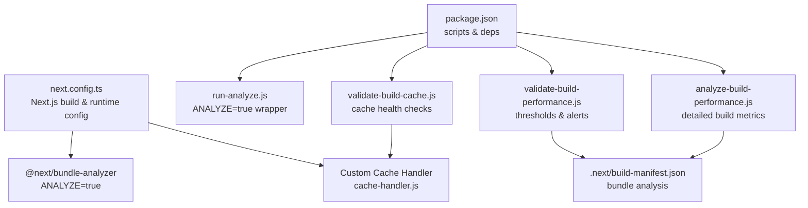
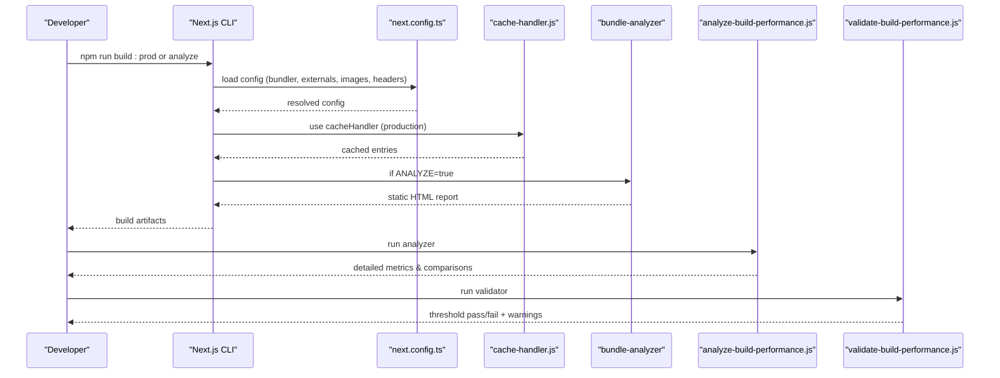
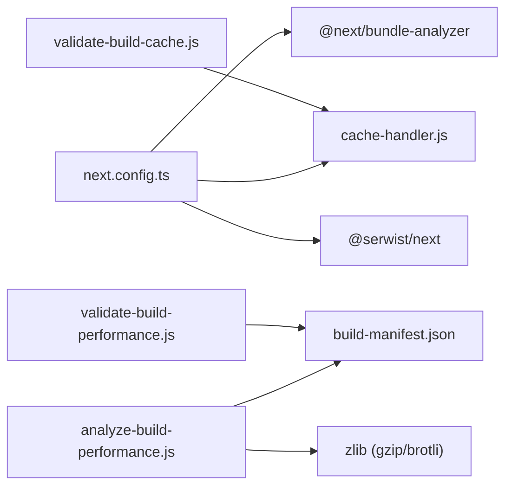

# Build Performance

<cite>
**Referenced Files in This Document**
- [next.config.ts](file://next.config.ts)
- [package.json](file://package.json)
- [cache-handler.js](file://cache-handler.js)
- [scripts/dev-tools/build/analyze-build-performance.js](file://scripts/dev-tools/build/analyze-build-performance.js)
- [scripts/dev-tools/build/validate-build-performance.js](file://scripts/dev-tools/build/validate-build-performance.js)
- [scripts/dev-tools/build/validate-build-cache.js](file://scripts/dev-tools/build/validate-build-cache.js)
- [scripts/dev-tools/build/run-analyze.js](file://scripts/dev-tools/build/run-analyze.js)
</cite>

## Table of Contents
1. [Introduction](#introduction)
2. [Project Structure](#project-structure)
3. [Core Components](#core-components)
4. [Architecture Overview](#architecture-overview)
5. [Detailed Component Analysis](#detailed-component-analysis)
6. [Dependency Analysis](#dependency-analysis)
7. [Performance Considerations](#performance-considerations)
8. [Troubleshooting Guide](#troubleshooting-guide)
9. [Conclusion](#conclusion)

## Introduction
This document focuses on build performance optimization for the Next.js legal management interface. It covers build configuration, asset optimization, development workflow improvements, Webpack/Turbopack optimization, bundle analysis, code splitting, image optimization, static generation and SSR tuning, caching, incremental compilation, development server optimization, and production deployment performance. Practical examples and scripts are referenced to enable repeatable performance monitoring and optimization.

## Project Structure
The build performance tooling centers around:
- Next.js configuration for bundling, externalization, and runtime behavior
- Custom cache handler for persistent cache across builds
- Scripts for build performance analysis, validation, and bundle analysis
- Package scripts orchestrating build modes and performance checks

**Diagram sources**
- [next.config.ts:1-435](file://next.config.ts#L1-L435)
- [cache-handler.js:1-140](file://cache-handler.js#L1-L140)
- [package.json:1-409](file://package.json#L1-L409)
- [scripts/dev-tools/build/analyze-build-performance.js:1-586](file://scripts/dev-tools/build/analyze-build-performance.js#L1-L586)
- [scripts/dev-tools/build/validate-build-performance.js:1-455](file://scripts/dev-tools/build/validate-build-performance.js#L1-L455)
- [scripts/dev-tools/build/validate-build-cache.js:1-183](file://scripts/dev-tools/build/validate-build-cache.js#L1-L183)
- [scripts/dev-tools/build/run-analyze.js:1-12](file://scripts/dev-tools/build/run-analyze.js#L1-L12)

**Section sources**
- [next.config.ts:1-435](file://next.config.ts#L1-L435)
- [package.json:1-409](file://package.json#L1-L409)

## Core Components
- Next.js configuration: defines bundler selection, external packages, modularizeImports/optimizePackageImports, experimental CPU limits, server actions, image formats, headers, and PWA integration.
- Custom cache handler: persists ISR/fetch cache to disk for production and dev environments, enabling faster rebuilds and reduced memory footprint.
- Build performance analyzer: measures build phases, computes bundle sizes (raw/gzip/brotli), identifies top chunks, estimates cache stats, and compares with previous runs.
- Performance validator: enforces configurable thresholds for bundle size, build time, chunk count, and cache hit rate.
- Cache validator: verifies cache handler validity, directory writability, and integrity of persisted cache entries.
- Bundle analyzer runner: toggles @next/bundle-analyzer via environment variable to produce static HTML reports.

**Section sources**
- [next.config.ts:79-435](file://next.config.ts#L79-L435)
- [cache-handler.js:1-140](file://cache-handler.js#L1-L140)
- [scripts/dev-tools/build/analyze-build-performance.js:1-586](file://scripts/dev-tools/build/analyze-build-performance.js#L1-L586)
- [scripts/dev-tools/build/validate-build-performance.js:1-455](file://scripts/dev-tools/build/validate-build-performance.js#L1-L455)
- [scripts/dev-tools/build/validate-build-cache.js:1-183](file://scripts/dev-tools/build/validate-build-cache.js#L1-L183)
- [scripts/dev-tools/build/run-analyze.js:1-12](file://scripts/dev-tools/build/run-analyze.js#L1-L12)

## Architecture Overview
The build pipeline integrates Next.js configuration, optional bundle analysis, and performance validation. Persistent caching reduces cold-start costs and speeds up incremental builds.

**Diagram sources**
- [next.config.ts:1-435](file://next.config.ts#L1-L435)
- [cache-handler.js:1-140](file://cache-handler.js#L1-L140)
- [scripts/dev-tools/build/analyze-build-performance.js:1-586](file://scripts/dev-tools/build/analyze-build-performance.js#L1-L586)
- [scripts/dev-tools/build/validate-build-performance.js:1-455](file://scripts/dev-tools/build/validate-build-performance.js#L1-L455)
- [scripts/dev-tools/build/run-analyze.js:1-12](file://scripts/dev-tools/build/run-analyze.js#L1-L12)

## Detailed Component Analysis

### Next.js Build Configuration and Optimization
Key areas impacting build performance:
- Bundler selection: explicit scripts choose between Webpack and Turbopack for reproducible builds and diagnostics.
- Custom cache handler: enables persistent cache for ISR/fetch in production and dev.
- External packages: serverExternalPackages excludes heavy Node-only libraries from client bundles.
- Import optimization: modularizeImports and optimizePackageImports reduce bundle size by importing only used members.
- Image optimization: formats and remote patterns configured centrally.
- Static generation concurrency: experimental.cpus limits worker count to avoid OOM in constrained environments.
- Server actions: increased bodySizeLimit and allowed origins for large uploads.
- Output: standalone output for optimized Docker deployments.

Practical implications:
- Use build:prod with --webpack for deterministic Webpack builds.
- Use build:ci with --turbopack for Turbopack builds in CI when needed.
- Persist cache across builds to reduce cold-start overhead.
- Keep optimizePackageImports aligned with actual imports to maximize tree-shaking.

**Section sources**
- [next.config.ts:79-435](file://next.config.ts#L79-L435)
- [package.json:9-409](file://package.json#L9-L409)

### Custom Cache Handler
Purpose:
- Persist cache entries to disk instead of memory to improve reliability and reuse across builds.
- Support tag-based invalidation and deletion.

Behavior:
- Selects persistent cache dir based on environment.
- Sanitizes keys and stores JSON entries with expiration and tags.
- Provides revalidateTag to invalidate by tags and delete by key.

Operational tips:
- Ensure write permissions to cache directory.
- Monitor cache size and health with validate:cache.
- Use in production for faster incremental builds and lower memory pressure.

**Section sources**
- [cache-handler.js:1-140](file://cache-handler.js#L1-L140)

### Build Performance Analyzer
Capabilities:
- Runs Next.js build and measures total duration.
- Parses build-manifest.json to compute bundle sizes (raw/gzip/brotli).
- Identifies top 10 largest chunks by raw and compressed sizes.
- Estimates cache stats from .next/cache.
- Compares with previous run and prints deltas.
- Outputs JSON for CI integration.

Usage:
- npm run analyze:build-performance
- Optional flags: --skip-build, --verbose, --json-only

Outputs:
- scripts/results/build-performance/latest.json
- scripts/results/build-performance/history/<timestamp>.json
- Human-friendly summary and comparison

**Section sources**
- [scripts/dev-tools/build/analyze-build-performance.js:1-586](file://scripts/dev-tools/build/analyze-build-performance.js#L1-L586)

### Performance Threshold Validator
Capabilities:
- Enforces thresholds for main chunk size, total bundle size, chunk count, build time, and cache hit rate.
- Supports strict mode (fail on threshold exceeded) and warn mode.
- Reads from performance report or build manifest.

Environment controls:
- BUNDLE_SIZE_METRIC: raw|gzip|brotli
- BUNDLE_MAIN_CHUNK_MAX_KB
- BUNDLE_TOTAL_MAX_MB
- BUNDLE_SINGLE_CHUNK_MAX_MB
- BUILD_TIME_MAX_MIN
- BUILD_CACHE_HIT_RATE_MIN
- BUNDLE_BROTLI_QUALITY

Usage:
- npm run validate:build-performance
- npm run validate:build-performance:strict
- npm run validate:build-performance:warn

**Section sources**
- [scripts/dev-tools/build/validate-build-performance.js:1-455](file://scripts/dev-tools/build/validate-build-performance.js#L1-L455)

### Cache Health Validator
Checks:
- Cache handler file exists and exports a valid class with required methods.
- Cache directory exists and is writable.
- Cache entries are valid JSON and readable.
- next.config.ts includes cacheHandler and related settings.

Usage:
- npm run validate:cache

**Section sources**
- [scripts/dev-tools/build/validate-build-cache.js:1-183](file://scripts/dev-tools/build/validate-build-cache.js#L1-L183)

### Bundle Analyzer Runner
Purpose:
- Sets ANALYZE=true and runs Next build to generate static bundle analysis report.
- Uses Turbopack by default in the runner script.

Usage:
- npm run analyze:bundle

**Section sources**
- [scripts/dev-tools/build/run-analyze.js:1-12](file://scripts/dev-tools/build/run-analyze.js#L1-L12)

## Dependency Analysis
Build-time dependencies and their roles:
- next.config.ts depends on:
  - @next/bundle-analyzer for static HTML reports
  - @serwist/next for PWA integration
  - Custom cache-handler.js for persistent cache
- Scripts depend on:
  - Node child_process and perf_hooks for timing
  - zlib for gzip/brotli computation
  - File system for reading build artifacts and writing reports

**Diagram sources**
- [next.config.ts:1-435](file://next.config.ts#L1-L435)
- [scripts/dev-tools/build/analyze-build-performance.js:1-586](file://scripts/dev-tools/build/analyze-build-performance.js#L1-L586)
- [scripts/dev-tools/build/validate-build-performance.js:1-455](file://scripts/dev-tools/build/validate-build-performance.js#L1-L455)
- [scripts/dev-tools/build/validate-build-cache.js:1-183](file://scripts/dev-tools/build/validate-build-cache.js#L1-L183)

**Section sources**
- [next.config.ts:1-435](file://next.config.ts#L1-L435)
- [scripts/dev-tools/build/analyze-build-performance.js:1-586](file://scripts/dev-tools/build/analyze-build-performance.js#L1-L586)
- [scripts/dev-tools/build/validate-build-performance.js:1-455](file://scripts/dev-tools/build/validate-build-performance.js#L1-L455)
- [scripts/dev-tools/build/validate-build-cache.js:1-183](file://scripts/dev-tools/build/validate-build-cache.js#L1-L183)

## Performance Considerations
- Bundler choice:
  - Prefer explicit flags in scripts to ensure reproducibility.
  - Use --webpack for deterministic builds; --turbopack for faster iteration when acceptable.
- Worker limits:
  - experimental.cpus set to 2 to prevent OOM in constrained environments.
- Import optimization:
  - Keep modularizeImports and optimizePackageImports in sync with actual imports.
- Image optimization:
  - Configure formats and remote patterns in next.config.ts to leverage modern formats.
- Static generation:
  - Limit concurrency via experimental.cpus to balance speed and resource usage.
- Caching:
  - Enable persistent cache via cacheHandler for production and dev.
  - Monitor cache health regularly with validate:cache.
- Validation:
  - Integrate validate:build-performance in CI to enforce thresholds.
  - Use analyze:build-performance for periodic deep dives.

[No sources needed since this section provides general guidance]

## Troubleshooting Guide
Common issues and remedies:
- Out of memory during build:
  - Increase Node heap via environment variables in scripts.
  - Reduce concurrency with experimental.cpus.
  - Use analyze:build-performance to identify oversized chunks.
- Bundle growth:
  - Run analyze:build-performance and review top chunks.
  - Adjust optimizePackageImports and imports to reduce unused code.
- Cache problems:
  - Run validate:cache to check handler, directory, and entries.
  - Clear cache directory if corruption suspected.
- Bundle analysis not generated:
  - Ensure ANALYZE=true is set when running analyze:bundle.
  - Verify @next/bundle-analyzer is installed.

**Section sources**
- [scripts/dev-tools/build/analyze-build-performance.js:1-586](file://scripts/dev-tools/build/analyze-build-performance.js#L1-L586)
- [scripts/dev-tools/build/validate-build-performance.js:1-455](file://scripts/dev-tools/build/validate-build-performance.js#L1-L455)
- [scripts/dev-tools/build/validate-build-cache.js:1-183](file://scripts/dev-tools/build/validate-build-cache.js#L1-L183)
- [scripts/dev-tools/build/run-analyze.js:1-12](file://scripts/dev-tools/build/run-analyze.js#L1-L12)

## Conclusion
By combining explicit bundler selection, persistent caching, import optimization, image configuration, and robust validation scripts, the project achieves predictable and measurable build performance. Regular use of analyze:build-performance and validate:build-performance ensures continuous monitoring and early detection of regressions. The custom cache handler further improves incremental build times and reduces memory pressure, especially beneficial for legal document-heavy applications with large assets and frequent updates.