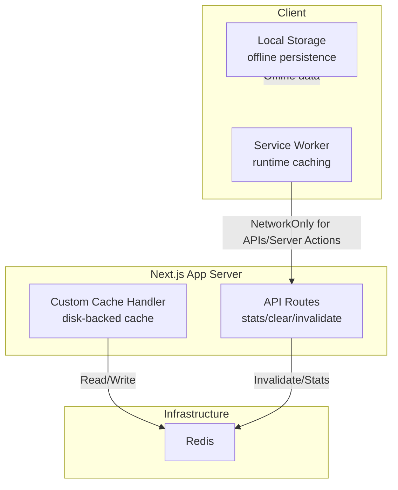
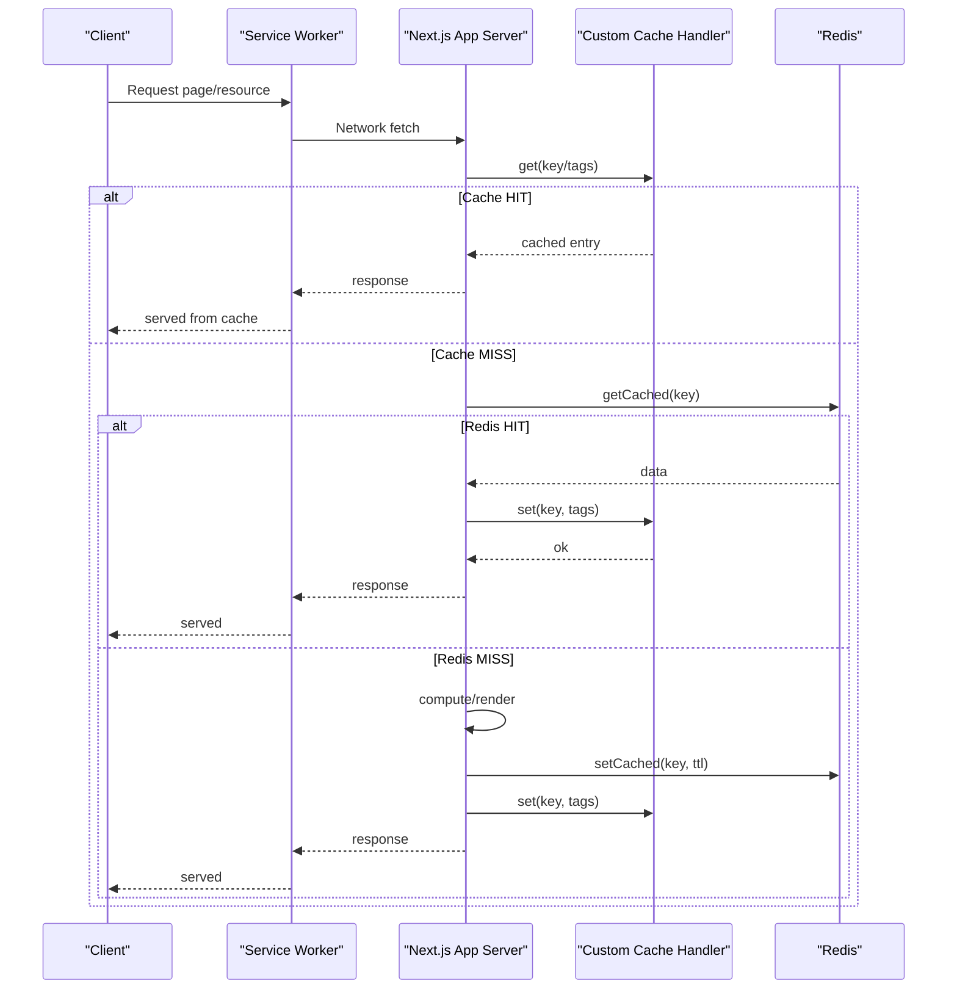
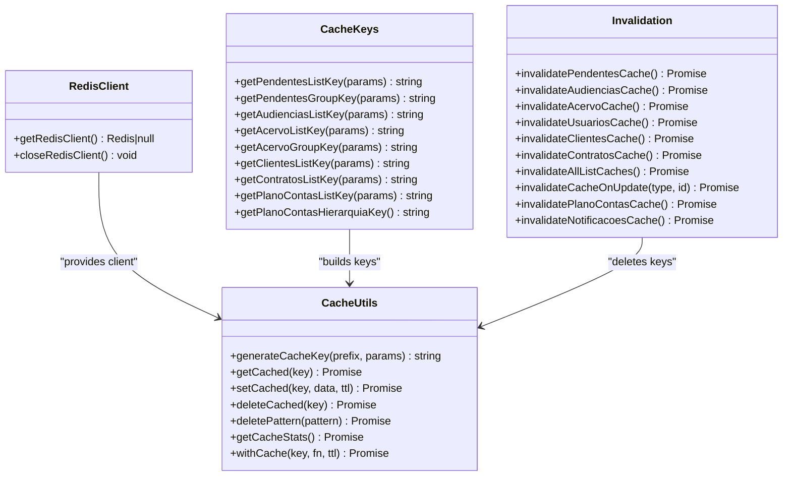
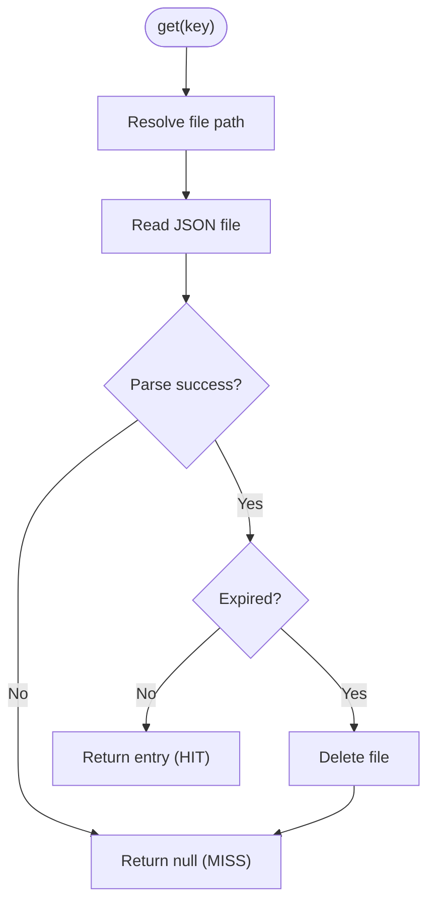
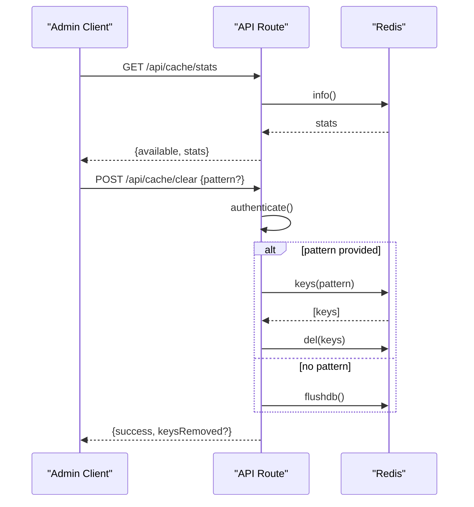
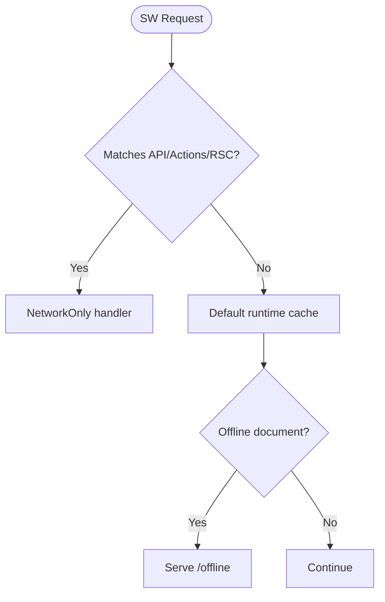
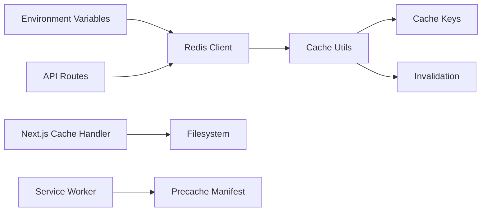

# Caching Strategies

<cite>
**Referenced Files in This Document**
- [next.config.ts](file://next.config.ts)
- [cache-handler.js](file://cache-handler.js)
- [src/lib/redis/index.ts](file://src/lib/redis/index.ts)
- [src/lib/redis/client.ts](file://src/lib/redis/client.ts)
- [src/lib/redis/cache-utils.ts](file://src/lib/redis/cache-utils.ts)
- [src/lib/redis/cache-keys.ts](file://src/lib/redis/cache-keys.ts)
- [src/lib/redis/invalidation.ts](file://src/lib/redis/invalidation.ts)
- [src/lib/redis/utils.ts](file://src/lib/redis/utils.ts)
- [src/app/api/cache/stats/route.ts](file://src/app/api/cache/stats/route.ts)
- [src/app/api/cache/clear/route.ts](file://src/app/api/cache/clear/route.ts)
- [src/app/sw.ts](file://src/app/sw.ts)
</cite>

## Table of Contents
1. [Introduction](#introduction)
2. [Project Structure](#project-structure)
3. [Core Components](#core-components)
4. [Architecture Overview](#architecture-overview)
5. [Detailed Component Analysis](#detailed-component-analysis)
6. [Dependency Analysis](#dependency-analysis)
7. [Performance Considerations](#performance-considerations)
8. [Troubleshooting Guide](#troubleshooting-guide)
9. [Conclusion](#conclusion)

## Introduction
This document defines the caching strategy for the project, focusing on:
- Redis-backed caching for frequently accessed legal data, session management, and real-time collaboration data
- Next.js caching mechanisms (custom cache handler, SWR-like patterns, and API route invalidation)
- Local storage and service worker caching for offline functionality and performance
- Cache invalidation strategies for process updates, contract changes, and user permission changes
- Practical examples for cache warming, tiered caching, monitoring hit rates, expiration policies, and memory management for large legal datasets

## Project Structure
The caching stack spans three layers:
- Redis layer: centralized, durable cache for structured data and session-like keys
- Next.js layer: custom disk-backed cache handler for ISR/fetch persistence and tag-based invalidation
- Client layer: service worker runtime caching and local storage patterns for offline-first behavior

**Diagram sources**
- [next.config.ts](file://next.config.ts)
- [cache-handler.js](file://cache-handler.js)
- [src/lib/redis/index.ts](file://src/lib/redis/index.ts)
- [src/app/api/cache/stats/route.ts](file://src/app/api/cache/stats/route.ts)
- [src/app/api/cache/clear/route.ts](file://src/app/api/cache/clear/route.ts)
- [src/app/sw.ts](file://src/app/sw.ts)

**Section sources**
- [next.config.ts](file://next.config.ts)
- [cache-handler.js](file://cache-handler.js)
- [src/lib/redis/index.ts](file://src/lib/redis/index.ts)

## Core Components
- Redis client and utilities
  - Connection lifecycle, readiness checks, and graceful fallbacks
  - Prefix-based key spaces and TTLs tailored to legal data domains
  - Cache helpers: get/set/delete/pattern deletion, stats retrieval, and higher-order caching wrapper
  - Cache key builders for lists and groups
  - Granular invalidation helpers per domain (processes, audiencias, acervo, users, clients, contracts, accounting)
- Next.js custom cache handler
  - Disk-backed cache for ISR/fetch entries with tag-based invalidation
  - Expiration-aware reads and robust error handling
- API endpoints for cache inspection and maintenance
  - Cache stats endpoint
  - Manual cache clearing endpoint
- Service worker runtime caching
  - Never-cache APIs, Server Actions, and RSC payloads
  - Precache and runtime caching for static/offline resources

**Section sources**
- [src/lib/redis/client.ts](file://src/lib/redis/client.ts)
- [src/lib/redis/cache-utils.ts](file://src/lib/redis/cache-utils.ts)
- [src/lib/redis/cache-keys.ts](file://src/lib/redis/cache-keys.ts)
- [src/lib/redis/invalidation.ts](file://src/lib/redis/invalidation.ts)
- [src/lib/redis/utils.ts](file://src/lib/redis/utils.ts)
- [cache-handler.js](file://cache-handler.js)
- [src/app/api/cache/stats/route.ts](file://src/app/api/cache/stats/route.ts)
- [src/app/api/cache/clear/route.ts](file://src/app/api/cache/clear/route.ts)
- [src/app/sw.ts](file://src/app/sw.ts)

## Architecture Overview
The caching architecture integrates Redis for hot data, Next.js for SSR/ISR persistence, and the service worker for offline-first UX.

**Diagram sources**
- [cache-handler.js](file://cache-handler.js)
- [src/lib/redis/cache-utils.ts](file://src/lib/redis/cache-utils.ts)
- [src/app/sw.ts](file://src/app/sw.ts)

## Detailed Component Analysis

### Redis Implementation
Redis is configured behind a thin abstraction that:
- Lazily connects with retry/backoff and logs errors at a throttled cadence
- Provides availability checks and graceful degradation
- Offers deterministic cache keys via prefix + sorted params
- Supports TTLs tuned for legal data domains (documents, templates, folders)
- Exposes higher-order caching with automatic miss/fill behavior
- Provides targeted invalidation helpers for domain entities and lists

**Diagram sources**
- [src/lib/redis/client.ts](file://src/lib/redis/client.ts)
- [src/lib/redis/cache-utils.ts](file://src/lib/redis/cache-utils.ts)
- [src/lib/redis/cache-keys.ts](file://src/lib/redis/cache-keys.ts)
- [src/lib/redis/invalidation.ts](file://src/lib/redis/invalidation.ts)

**Section sources**
- [src/lib/redis/client.ts](file://src/lib/redis/client.ts)
- [src/lib/redis/cache-utils.ts](file://src/lib/redis/cache-utils.ts)
- [src/lib/redis/cache-keys.ts](file://src/lib/redis/cache-keys.ts)
- [src/lib/redis/invalidation.ts](file://src/lib/redis/invalidation.ts)
- [src/lib/redis/utils.ts](file://src/lib/redis/utils.ts)

### Next.js Custom Cache Handler
The custom cache handler persists ISR/fetch entries to disk, enabling cross-deploy persistence and tag-based invalidation. It:
- Stores entries as JSON with tags and timestamps
- Enforces expiration checks on read
- Supports tag-based revalidation by scanning stored entries
- Logs debug information when enabled

**Diagram sources**
- [cache-handler.js](file://cache-handler.js)

**Section sources**
- [cache-handler.js](file://cache-handler.js)
- [next.config.ts](file://next.config.ts)

### API Routes for Cache Inspection and Maintenance
- Cache stats endpoint: returns Redis availability and selected metrics (memory, hits, misses, uptime)
- Cache clear endpoint: clears Redis keys by pattern (supports wildcard) with admin authentication

**Diagram sources**
- [src/app/api/cache/stats/route.ts](file://src/app/api/cache/stats/route.ts)
- [src/app/api/cache/clear/route.ts](file://src/app/api/cache/clear/route.ts)
- [src/lib/redis/cache-utils.ts](file://src/lib/redis/cache-utils.ts)

**Section sources**
- [src/app/api/cache/stats/route.ts](file://src/app/api/cache/stats/route.ts)
- [src/app/api/cache/clear/route.ts](file://src/app/api/cache/clear/route.ts)

### Service Worker and Local Storage Patterns
- Service worker runtime caching:
  - Never caches API routes, Server Actions, or RSC payloads
  - Applies default caching to static assets and precache entries
  - Supports offline fallback for documents
- Local storage patterns:
  - Intended for client-side data persistence and offline scenarios
  - Should complement service worker caching for user preferences and transient UI state

**Diagram sources**
- [src/app/sw.ts](file://src/app/sw.ts)

**Section sources**
- [src/app/sw.ts](file://src/app/sw.ts)

## Dependency Analysis
- Redis layer depends on environment variables for connection and TTLs
- Next.js cache handler depends on filesystem and environment flags for persistence
- API routes depend on Redis client and authentication middleware
- Service worker depends on precache manifest and runtime caching configuration

**Diagram sources**
- [src/lib/redis/client.ts](file://src/lib/redis/client.ts)
- [src/lib/redis/cache-utils.ts](file://src/lib/redis/cache-utils.ts)
- [src/lib/redis/cache-keys.ts](file://src/lib/redis/cache-keys.ts)
- [src/lib/redis/invalidation.ts](file://src/lib/redis/invalidation.ts)
- [cache-handler.js](file://cache-handler.js)
- [src/app/api/cache/stats/route.ts](file://src/app/api/cache/stats/route.ts)
- [src/app/sw.ts](file://src/app/sw.ts)

**Section sources**
- [src/lib/redis/client.ts](file://src/lib/redis/client.ts)
- [src/lib/redis/cache-utils.ts](file://src/lib/redis/cache-utils.ts)
- [src/lib/redis/cache-keys.ts](file://src/lib/redis/cache-keys.ts)
- [src/lib/redis/invalidation.ts](file://src/lib/redis/invalidation.ts)
- [cache-handler.js](file://cache-handler.js)
- [src/app/api/cache/stats/route.ts](file://src/app/api/cache/stats/route.ts)
- [src/app/sw.ts](file://src/app/sw.ts)

## Performance Considerations
- Redis TTL tuning
  - Legal data documents: short TTLs for freshness; templates and folders: moderate TTLs; lists: shorter TTLs due to frequent changes
- Cache warming
  - Pre-warm high-traffic legal data queries (e.g., acervo, audiencias, pendentes) by invoking cache helpers during off-peak hours
- Tiered caching
  - Use Next.js disk cache for SSR/ISR persistence; Redis for hot, frequently accessed domain data
- Monitoring cache hit rates
  - Use the cache stats endpoint to track keyspace hits and misses; derive hit ratio from these metrics
- Memory management for large datasets
  - Prefer streaming/aggregation queries and smaller payloads; leverage pattern-based invalidation to avoid stale data accumulation
- Graceful degradation
  - Redis unavailability should not block requests; rely on compute-and-set patterns and Next.js cache handler

[No sources needed since this section provides general guidance]

## Troubleshooting Guide
- Redis connectivity issues
  - Verify environment variables for Redis URL and password; check readiness status; inspect throttled error logs
- Cache misses despite data presence
  - Confirm TTLs and expiration logic; ensure deterministic cache keys via sorted params; validate prefix usage
- Stale data after updates
  - Trigger domain-specific invalidation helpers; use tag-based revalidation via the Next.js cache handler; clear Redis patterns selectively
- High misses and slow responses
  - Monitor keyspace hits/misses via the stats endpoint; consider increasing TTLs for infrequent queries; implement cache warming
- Service worker caching anomalies
  - Ensure APIs/Server Actions/RSC payloads are excluded from caching; confirm precache entries and offline fallback configuration

**Section sources**
- [src/lib/redis/client.ts](file://src/lib/redis/client.ts)
- [src/lib/redis/cache-utils.ts](file://src/lib/redis/cache-utils.ts)
- [cache-handler.js](file://cache-handler.js)
- [src/app/api/cache/stats/route.ts](file://src/app/api/cache/stats/route.ts)
- [src/app/sw.ts](file://src/app/sw.ts)

## Conclusion
The caching strategy combines Redis for hot legal data, a Next.js custom cache handler for persistent SSR/ISR caching, and a service worker for offline-first UX. By leveraging deterministic cache keys, domain-specific TTLs, and targeted invalidation, the system balances performance, correctness, and resilience. Operational monitoring via the cache stats endpoint and selective cache clearing enables proactive maintenance and troubleshooting.