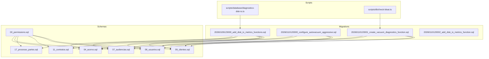
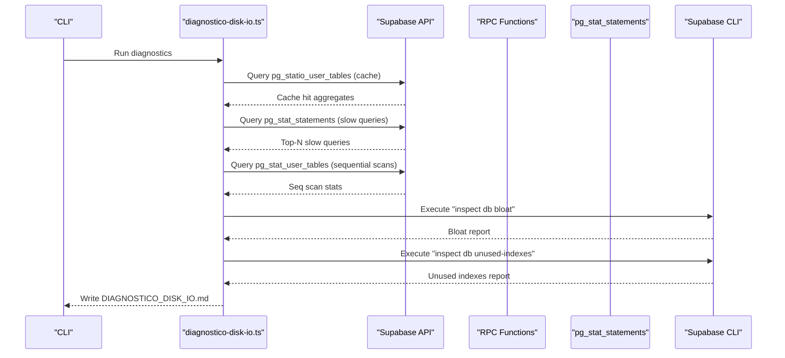
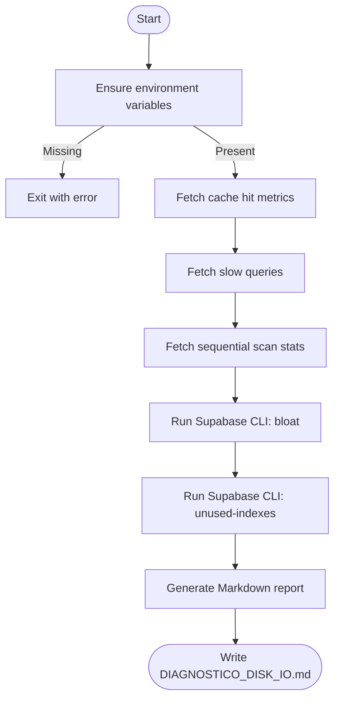
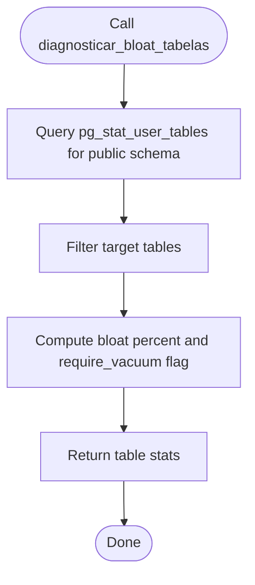
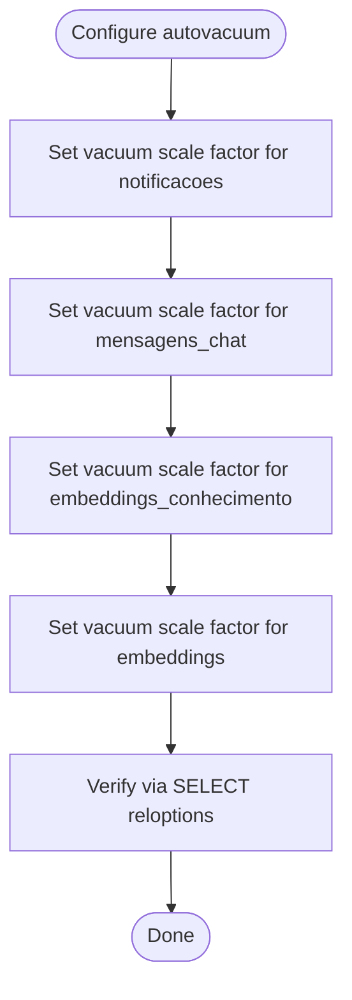
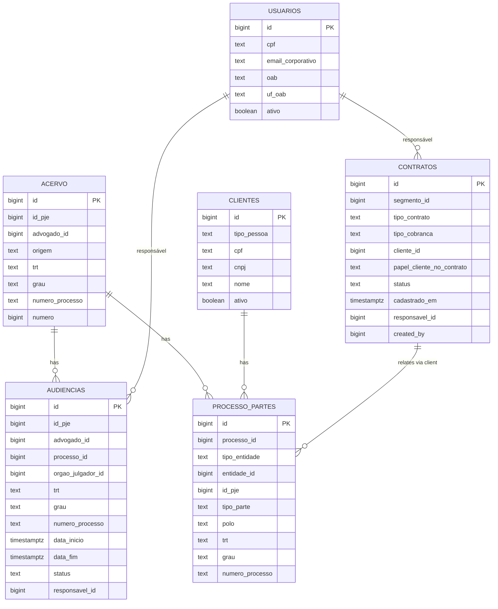
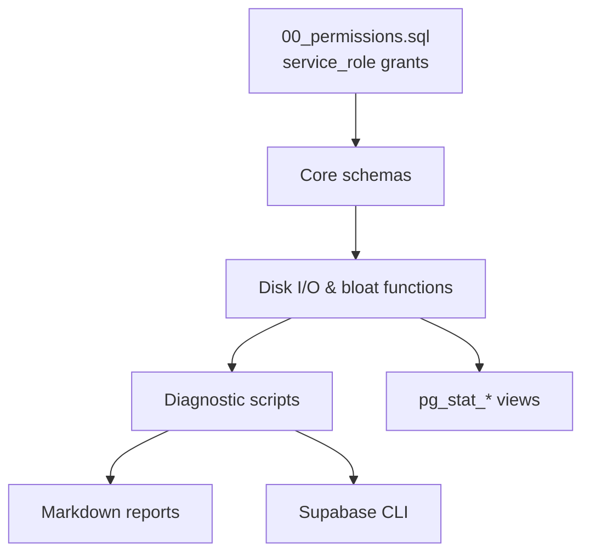

# Database Optimization

<cite>
**Referenced Files in This Document**
- [diagnostico-disk-io.ts](file://scripts/database/diagnostico-disk-io.ts)
- [check-bloat.ts](file://scripts/db/check-bloat.ts)
- [20260109123000_add_disk_io_metrics_functions.sql](file://supabase/migrations/20260109123000_add_disk_io_metrics_functions.sql)
- [20260110120000_configure_autovacuum_aggressive.sql](file://supabase/migrations/20260110120000_configure_autovacuum_aggressive.sql)
- [20260110120001_create_vacuum_diagnostics_function.sql](file://supabase/migrations/20260110120001_create_vacuum_diagnostics_function.sql)
- [20260110120002_add_disk_io_metrics_function.sql](file://supabase/migrations/20260110120002_add_disk_io_metrics_function.sql)
- [07_audiencias.sql](file://supabase/schemas/07_audiencias.sql)
- [04_acervo.sql](file://supabase/schemas/04_acervo.sql)
- [17_processo_partes.sql](file://supabase/schemas/17_processo_partes.sql)
- [11_contratos.sql](file://supabase/schemas/11_contratos.sql)
- [00_permissions.sql](file://supabase/schemas/00_permissions.sql)
- [08_usuarios.sql](file://supabase/schemas/08_usuarios.sql)
- [09_clientes.sql](file://supabase/schemas/09_clientes.sql)
</cite>

## Table of Contents
1. [Introduction](#introduction)
2. [Project Structure](#project-structure)
3. [Core Components](#core-components)
4. [Architecture Overview](#architecture-overview)
5. [Detailed Component Analysis](#detailed-component-analysis)
6. [Dependency Analysis](#dependency-analysis)
7. [Performance Considerations](#performance-considerations)
8. [Troubleshooting Guide](#troubleshooting-guide)
9. [Conclusion](#conclusion)
10. [Appendices](#appendices)

## Introduction
This document provides comprehensive database optimization guidance for the legal management system built on Supabase/PostgreSQL. It focuses on PostgreSQL performance tuning, indexing strategies, and query optimization tailored to legal data structures such as process management, contract tracking, and audiência scheduling. It also documents the disk I/O diagnostic script implementation, cache hit rate monitoring, slow query identification, sequential scan analysis, index optimization techniques, vacuum maintenance procedures, autovacuum configuration, table bloat analysis, practical query performance profiling, explain plan analysis, optimization implementation, database migration strategies, schema optimization for large legal datasets, and capacity planning for multi-instance process tracking.

## Project Structure
The database optimization effort spans:
- Supabase migrations that define schema, indexes, triggers, policies, and monitoring functions
- TypeScript scripts that collect metrics and generate diagnostics
- Schema files that define legal data structures and their indexes

**Diagram sources**
- [diagnostico-disk-io.ts:1-416](file://scripts/database/diagnostico-disk-io.ts#L1-L416)
- [check-bloat.ts:1-96](file://scripts/db/check-bloat.ts#L1-L96)
- [20260109123000_add_disk_io_metrics_functions.sql:1-104](file://supabase/migrations/20260109123000_add_disk_io_metrics_functions.sql#L1-L104)
- [20260110120000_configure_autovacuum_aggressive.sql:1-54](file://supabase/migrations/20260110120000_configure_autovacuum_aggressive.sql#L1-L54)
- [20260110120001_create_vacuum_diagnostics_function.sql:1-54](file://supabase/migrations/20260110120001_create_vacuum_diagnostics_function.sql#L1-L54)
- [20260110120002_add_disk_io_metrics_function.sql:1-29](file://supabase/migrations/20260110120002_add_disk_io_metrics_function.sql#L1-L29)
- [04_acervo.sql:1-77](file://supabase/schemas/04_acervo.sql#L1-L77)
- [07_audiencias.sql:1-159](file://supabase/schemas/07_audiencias.sql#L1-L159)
- [17_processo_partes.sql:1-144](file://supabase/schemas/17_processo_partes.sql#L1-L144)
- [11_contratos.sql:1-61](file://supabase/schemas/11_contratos.sql#L1-L61)
- [08_usuarios.sql:1-100](file://supabase/schemas/08_usuarios.sql#L1-L100)
- [09_clientes.sql:1-139](file://supabase/schemas/09_clientes.sql#L1-L139)
- [00_permissions.sql:1-21](file://supabase/schemas/00_permissions.sql#L1-L21)

**Section sources**
- [diagnostico-disk-io.ts:1-416](file://scripts/database/diagnostico-disk-io.ts#L1-L416)
- [check-bloat.ts:1-96](file://scripts/db/check-bloat.ts#L1-L96)
- [20260109123000_add_disk_io_metrics_functions.sql:1-104](file://supabase/migrations/20260109123000_add_disk_io_metrics_functions.sql#L1-L104)
- [20260110120000_configure_autovacuum_aggressive.sql:1-54](file://supabase/migrations/20260110120000_configure_autovacuum_aggressive.sql#L1-L54)
- [20260110120001_create_vacuum_diagnostics_function.sql:1-54](file://supabase/migrations/20260110120001_create_vacuum_diagnostics_function.sql#L1-L54)
- [20260110120002_add_disk_io_metrics_function.sql:1-29](file://supabase/migrations/20260110120002_add_disk_io_metrics_function.sql#L1-L29)
- [04_acervo.sql:1-77](file://supabase/schemas/04_acervo.sql#L1-L77)
- [07_audiencias.sql:1-159](file://supabase/schemas/07_audiencias.sql#L1-L159)
- [17_processo_partes.sql:1-144](file://supabase/schemas/17_processo_partes.sql#L1-L144)
- [11_contratos.sql:1-61](file://supabase/schemas/11_contratos.sql#L1-L61)
- [08_usuarios.sql:1-100](file://supabase/schemas/08_usuarios.sql#L1-L100)
- [09_clientes.sql:1-139](file://supabase/schemas/09_clientes.sql#L1-L139)
- [00_permissions.sql:1-21](file://supabase/schemas/00_permissions.sql#L1-L21)

## Core Components
- Disk I/O diagnostic script: Collects cache hit rates, slow queries, sequential scans, and runs Supabase CLI inspections for bloat and unused indexes. Outputs a Markdown report.
- Vacuum diagnostics function: Returns bloat statistics and dead tuple counts for critical tables.
- Autovacuum aggressive configuration: Adjusts vacuum/analyzer thresholds for high-frequency tables.
- Monitoring functions: Expose cache hit rate, slow queries, sequential scans, and unused indexes via RPC functions.
- Legal data schemas: Define core tables (processes, audiências, parties, contracts) with targeted indexes and RLS policies.

Key capabilities:
- Real-time cache hit rate calculation
- Top-N slow query reporting via pg_stat_statements
- Sequential scan analysis per table
- Bloat detection and recommendations
- Unused index discovery
- Autovacuum tuning for hot tables

**Section sources**
- [diagnostico-disk-io.ts:93-221](file://scripts/database/diagnostico-disk-io.ts#L93-L221)
- [check-bloat.ts:26-93](file://scripts/db/check-bloat.ts#L26-L93)
- [20260109123000_add_disk_io_metrics_functions.sql:3-75](file://supabase/migrations/20260109123000_add_disk_io_metrics_functions.sql#L3-L75)
- [20260110120001_create_vacuum_diagnostics_function.sql:8-46](file://supabase/migrations/20260110120001_create_vacuum_diagnostics_function.sql#L8-L46)
- [20260110120000_configure_autovacuum_aggressive.sql:9-31](file://supabase/migrations/20260110120000_configure_autovacuum_aggressive.sql#L9-L31)

## Architecture Overview
The optimization architecture integrates client-side diagnostics with server-side monitoring functions and migrations.

**Diagram sources**
- [diagnostico-disk-io.ts:93-221](file://scripts/database/diagnostico-disk-io.ts#L93-L221)
- [20260109123000_add_disk_io_metrics_functions.sql:3-75](file://supabase/migrations/20260109123000_add_disk_io_metrics_functions.sql#L3-L75)

**Section sources**
- [diagnostico-disk-io.ts:359-415](file://scripts/database/diagnostico-disk-io.ts#L359-L415)
- [20260109123000_add_disk_io_metrics_functions.sql:3-75](file://supabase/migrations/20260109123000_add_disk_io_metrics_functions.sql#L3-L75)

## Detailed Component Analysis

### Disk I/O Diagnostic Script Implementation
The script orchestrates:
- Environment validation (Supabase URL and service key)
- Cache hit rate computation from pg_statio_user_tables
- Slow query extraction from pg_stat_statements
- Sequential scan analysis from pg_stat_user_tables
- Execution of Supabase CLI for bloat and unused indexes
- Markdown report generation

**Diagram sources**
- [diagnostico-disk-io.ts:24-415](file://scripts/database/diagnostico-disk-io.ts#L24-L415)

**Section sources**
- [diagnostico-disk-io.ts:24-415](file://scripts/database/diagnostico-disk-io.ts#L24-L415)

### Vacuum Diagnostics Function
The function returns bloat statistics for critical tables, including total size, live/dead tuples, bloat percentage, and vacuum recommendations.

**Diagram sources**
- [20260110120001_create_vacuum_diagnostics_function.sql:22-46](file://supabase/migrations/20260110120001_create_vacuum_diagnostics_function.sql#L22-L46)

**Section sources**
- [check-bloat.ts:26-93](file://scripts/db/check-bloat.ts#L26-L93)
- [20260110120001_create_vacuum_diagnostics_function.sql:8-46](file://supabase/migrations/20260110120001_create_vacuum_diagnostics_function.sql#L8-L46)

### Autovacuum Aggressive Configuration
Aggressive autovacuum thresholds are configured for tables with high churn:
- notificacoes: frequent updates (mark as read)
- mensagens_chat: frequent inserts
- embeddings_conhecimento and embeddings: moderate churn during batch reindexing

**Diagram sources**
- [20260110120000_configure_autovacuum_aggressive.sql:9-43](file://supabase/migrations/20260110120000_configure_autovacuum_aggressive.sql#L9-L43)

**Section sources**
- [20260110120000_configure_autovacuum_aggressive.sql:9-43](file://supabase/migrations/20260110120000_configure_autovacuum_aggressive.sql#L9-L43)

### Index Optimization Techniques for Legal Data Structures
Targeted indexes improve performance for legal data:

- audiencias
  - Advogado, processo, órgão julgador, TRT, grau, número do processo, status, data início/fim, modalidade, responsáveis
  - Composite indexes for common filters: (advogado_id, trt, grau), (processo_id, data_inicio)

- acervo
  - Advogado, origem, TRT, grau, número do processo, ID PJE, data autuação, data arquivamento
  - Composite indexes: (advogado_id, trt, grau), (numero_processo, trt, grau)

- processo_partes
  - Processo, entidade (polymorphic), polo, TRT+grau, número do processo, ID pessoa PJE
  - Unique constraint: (processo_id, tipo_entidade, entidade_id, grau)

- contratos
  - Segmento, tipo contrato, status, cliente, responsável, criado por

- clientes
  - Tipo pessoa, CPF/CNPJ únicos, nome, ativo, criado por, endereço

- usuários
  - CPF, email corporativo, auth_user_id, cargo, ativo, nome completo, OAB

**Diagram sources**
- [04_acervo.sql:4-32](file://supabase/schemas/04_acervo.sql#L4-L32)
- [07_audiencias.sql:4-46](file://supabase/schemas/07_audiencias.sql#L4-L46)
- [17_processo_partes.sql:6-99](file://supabase/schemas/17_processo_partes.sql#L6-L99)
- [11_contratos.sql:4-27](file://supabase/schemas/11_contratos.sql#L4-L27)
- [09_clientes.sql:8-86](file://supabase/schemas/09_clientes.sql#L8-L86)
- [08_usuarios.sql:6-41](file://supabase/schemas/08_usuarios.sql#L6-L41)

**Section sources**
- [07_audiencias.sql:84-98](file://supabase/schemas/07_audiencias.sql#L84-L98)
- [04_acervo.sql:56-66](file://supabase/schemas/04_acervo.sql#L56-L66)
- [17_processo_partes.sql:98-108](file://supabase/schemas/17_processo_partes.sql#L98-L108)
- [11_contratos.sql:44-50](file://supabase/schemas/11_contratos.sql#L44-L50)
- [09_clientes.sql:110-117](file://supabase/schemas/09_clientes.sql#L110-L117)
- [08_usuarios.sql:65-73](file://supabase/schemas/08_usuarios.sql#L65-L73)

### Query Optimization Strategies
- Enable and use pg_stat_statements for slow query identification
- Prefer selective filters and joins; avoid SELECT *
- Leverage composite indexes aligned with WHERE/HAVING/ORDER BY clauses
- Monitor sequential scans and add indexes for high-read tables
- Use explain analyze to validate index usage and query plans

[No sources needed since this section provides general guidance]

### Practical Examples of Query Performance Profiling
- Use the slow query RPC to retrieve top-N queries by max time
- Cross-reference with pg_stat_statements to identify long-running queries
- Inspect sequential scans to prioritize index creation
- Combine with bloat diagnostics to decide between vacuum/reindex actions

**Section sources**
- [20260109123000_add_disk_io_metrics_functions.sql:23-45](file://supabase/migrations/20260109123000_add_disk_io_metrics_functions.sql#L23-L45)
- [20260109123000_add_disk_io_metrics_functions.sql:49-73](file://supabase/migrations/20260109123000_add_disk_io_metrics_functions.sql#L49-L73)

### Explain Plan Analysis and Optimization Implementation
- Use explain analyze to review query plans
- Add missing indexes for filtered/ordered columns
- Remove unnecessary sequential scans by adding appropriate indexes
- Regularly update statistics after bulk operations

[No sources needed since this section provides general guidance]

### Database Migration Strategies and Schema Optimization
- Apply migrations incrementally and verify index coverage
- Use polymorphic relations (processo_partes) to reduce duplication and maintain referential integrity
- Normalize legal entities (clientes, partes_contrarias, terceiros) with unique identifiers
- Keep RLS policies aligned with business rules and minimize per-row overhead

**Section sources**
- [17_processo_partes.sql:98-99](file://supabase/schemas/17_processo_partes.sql#L98-L99)
- [09_clientes.sql:110-117](file://supabase/schemas/09_clientes.sql#L110-L117)
- [00_permissions.sql:4-19](file://supabase/schemas/00_permissions.sql#L4-L19)

### Capacity Planning for Multi-Instance Process Tracking
- Monitor cache hit rates and sequential scans to size compute appropriately
- Track bloat trends and schedule maintenance windows for vacuum/reindex
- Use autovacuum tuning for hot tables to sustain write throughput
- Plan for concurrent access patterns across multiple instances

**Section sources**
- [20260109123000_add_disk_io_metrics_functions.sql:3-18](file://supabase/migrations/20260109123000_add_disk_io_metrics_functions.sql#L3-L18)
- [20260110120000_configure_autovacuum_aggressive.sql:9-31](file://supabase/migrations/20260110120000_configure_autovacuum_aggressive.sql#L9-L31)
- [20260110120001_create_vacuum_diagnostics_function.sql:8-46](file://supabase/migrations/20260110120001_create_vacuum_diagnostics_function.sql#L8-L46)

## Dependency Analysis
The optimization stack depends on:
- Supabase service role permissions for bypassing RLS in internal operations
- pg_stat_statements for slow query tracking
- pg_stat_user_tables/pg_statio_user_tables for cache hit and sequential scan metrics
- Supabase CLI for bloat and unused index inspection

**Diagram sources**
- [00_permissions.sql:4-19](file://supabase/schemas/00_permissions.sql#L4-L19)
- [20260109123000_add_disk_io_metrics_functions.sql:3-75](file://supabase/migrations/20260109123000_add_disk_io_metrics_functions.sql#L3-L75)
- [diagnostico-disk-io.ts:223-249](file://scripts/database/diagnostico-disk-io.ts#L223-L249)

**Section sources**
- [00_permissions.sql:4-19](file://supabase/schemas/00_permissions.sql#L4-L19)
- [20260109123000_add_disk_io_metrics_functions.sql:3-75](file://supabase/migrations/20260109123000_add_disk_io_metrics_functions.sql#L3-L75)
- [diagnostico-disk-io.ts:223-249](file://scripts/database/diagnostico-disk-io.ts#L223-L249)

## Performance Considerations
- Maintain up-to-date statistics and analyze heavy tables regularly
- Use composite indexes aligned with query patterns
- Monitor and act on sequential scans promptly
- Tune autovacuum for high-write tables to prevent bloat
- Use explain analyze to validate plan changes

[No sources needed since this section provides general guidance]

## Troubleshooting Guide
Common issues and resolutions:
- Low cache hit rate (<99%): Investigate missing indexes and working set size; consider scaling compute
- High sequential scans: Add indexes for filtered/ordered columns; rewrite queries to use indexed columns
- High bloat (>20%): Run VACUUM ANALYZE; consider VACUUM FULL during low-traffic periods for severe cases
- Slow queries: Review pg_stat_statements output; add indexes; avoid SELECT *; optimize joins

**Section sources**
- [diagnostico-disk-io.ts:276-297](file://scripts/database/diagnostico-disk-io.ts#L276-L297)
- [check-bloat.ts:66-92](file://scripts/db/check-bloat.ts#L66-L92)
- [20260110120001_create_vacuum_diagnostics_function.sql:30-40](file://supabase/migrations/20260110120001_create_vacuum_diagnostics_function.sql#L30-L40)

## Conclusion
By combining automated diagnostics, targeted indexing, autovacuum tuning, and continuous monitoring, the legal management system can achieve robust performance at scale. The provided scripts and migrations offer a practical foundation for ongoing database optimization, ensuring efficient query execution, reduced disk I/O, and reliable maintenance of large legal datasets.

[No sources needed since this section summarizes without analyzing specific files]

## Appendices

### Appendix A: Disk I/O Metrics Functions
- obter_cache_hit_rate: Returns index and table cache hit ratios
- obter_queries_lentas: Returns top-N slowest queries by max time
- obter_tabelas_sequential_scan: Returns tables with highest sequential tuple reads
- obter_indices_nao_utilizados: Returns unused non-unique indexes

**Section sources**
- [20260109123000_add_disk_io_metrics_functions.sql:3-75](file://supabase/migrations/20260109123000_add_disk_io_metrics_functions.sql#L3-L75)

### Appendix B: Placeholder Disk I/O Metrics Function
- obter_metricas_disk_io: Placeholder for compute-tier and disk I/O budget metrics via Management API

**Section sources**
- [20260110120002_add_disk_io_metrics_function.sql:6-26](file://supabase/migrations/20260110120002_add_disk_io_metrics_function.sql#L6-L26)