# Memory Management

<cite>
**Referenced Files in This Document**
- [use-realtime-collaboration.ts](file://src/hooks/use-realtime-collaboration.ts)
- [supabase-yjs-provider.ts](file://src/lib/yjs/supabase-yjs-provider.ts)
- [collaborative-plate-editor.tsx](file://src/components/editor/plate/collaborative-plate-editor.tsx)
- [use-realtime-chat.tsx](file://src/hooks/use-realtime-chat.tsx)
- [use-debounce.ts](file://src/hooks/use-debounce.ts)
- [use-throttle.ts](file://src/components/ui/custom/minimal-tiptap/hooks/use-throttle.ts)
- [use-event-visibility.ts](file://src/app/(authenticated)/calendar/hooks/use-event-visibility.ts)
- [responsive-table.tsx](file://src/components/ui/responsive-table.tsx)
- [use-timeline-search.ts](file://src/app/(authenticated)/processos/components/search/use-timeline-search.ts)
- [device-fingerprint.ts](file://src/shared/assinatura-digital/utils/device-fingerprint.ts)
- [validation.service.ts](file://src/shared/assinatura-digital/services/signature/validation.service.ts)
- [client.ts](file://src/lib/supabase/client.ts)
- [uploads-actions.ts](file://src/app/(authenticated)/documentos/actions/uploads-actions.ts)
- [expediente-actions.ts](file://src/app/(authenticated)/expedientes/actions/expediente-actions.ts)
- [repository.ts](file://src/app/(authenticated)/documentos/repository.ts)
- [route.ts](file://src/app/api/plate/ai/route.ts)
- [prometheus parsing](file://src/lib/supabase/management-api.ts)
</cite>

## Table of Contents
1. [Introduction](#introduction)
2. [Project Structure](#project-structure)
3. [Core Components](#core-components)
4. [Architecture Overview](#architecture-overview)
5. [Detailed Component Analysis](#detailed-component-analysis)
6. [Dependency Analysis](#dependency-analysis)
7. [Performance Considerations](#performance-considerations)
8. [Troubleshooting Guide](#troubleshooting-guide)
9. [Conclusion](#conclusion)
10. [Appendices](#appendices)

## Introduction
This document provides a comprehensive guide to memory management for the legal case management system, focusing on JavaScript heap optimization, React component lifecycle optimization, and long-term memory leak prevention. It covers efficient data structures for legal case management, memory-efficient filtering and sorting algorithms for large legal datasets, React component cleanup patterns, proper event listener management, and memory optimization for real-time collaboration features. It also explains browser memory monitoring techniques, heap snapshot analysis, and memory leak detection strategies, with practical examples for document processing, AI-assisted editing, and real-time chat features. Finally, it documents garbage collection optimization, memory profiling tools, and performance monitoring for memory-intensive legal operations.

## Project Structure
The system integrates Next.js front-end with Supabase Realtime channels and Yjs CRDT for collaborative editing. Key memory-sensitive areas include:
- Real-time collaboration hooks and providers
- Plate.js editor with Yjs synchronization
- Real-time chat with Supabase channels
- Filtering and sorting of large legal timelines
- Device fingerprinting and secure storage utilities
- AI indexing and document processing actions
- Prometheus-based performance metrics

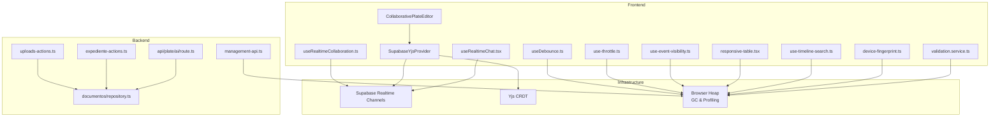

**Diagram sources**
- [use-realtime-collaboration.ts:88-181](file://src/hooks/use-realtime-collaboration.ts#L88-L181)
- [supabase-yjs-provider.ts:134-192](file://src/lib/yjs/supabase-yjs-provider.ts#L134-L192)
- [collaborative-plate-editor.tsx:88-151](file://src/components/editor/plate/collaborative-plate-editor.tsx#L88-L151)
- [use-realtime-chat.tsx:71-151](file://src/hooks/use-realtime-chat.tsx#L71-L151)
- [use-debounce.ts:11-25](file://src/hooks/use-debounce.ts#L11-L25)
- [use-throttle.ts:1-37](file://src/components/ui/custom/minimal-tiptap/hooks/use-throttle.ts#L1-L37)
- [use-event-visibility.ts](file://src/app/(authenticated)/calendar/hooks/use-event-visibility.ts#L20-L60)
- [responsive-table.tsx:147-188](file://src/components/ui/responsive-table.tsx#L147-L188)
- [use-timeline-search.ts](file://src/app/(authenticated)/processos/components/search/use-timeline-search.ts#L77-L118)
- [device-fingerprint.ts:137-177](file://src/shared/assinatura-digital/utils/device-fingerprint.ts#L137-L177)
- [validation.service.ts:60-67](file://src/shared/assinatura-digital/services/signature/validation.service.ts#L60-L67)
- [uploads-actions.ts](file://src/app/(authenticated)/documentos/actions/uploads-actions.ts#L25-L54)
- [expediente-actions.ts](file://src/app/(authenticated)/expedientes/actions/expediente-actions.ts#L172-L204)
- [repository.ts](file://src/app/(authenticated)/documentos/repository.ts#L1986-L2046)
- [route.ts:225-271](file://src/app/api/plate/ai/route.ts#L225-L271)
- [prometheus parsing:119-158](file://src/lib/supabase/management-api.ts#L119-L158)

**Section sources**
- [use-realtime-collaboration.ts:1-244](file://src/hooks/use-realtime-collaboration.ts#L1-L244)
- [supabase-yjs-provider.ts:1-358](file://src/lib/yjs/supabase-yjs-provider.ts#L1-L358)
- [collaborative-plate-editor.tsx:1-220](file://src/components/editor/plate/collaborative-plate-editor.tsx#L1-L220)
- [use-realtime-chat.tsx:1-256](file://src/hooks/use-realtime-chat.tsx#L1-L256)
- [use-debounce.ts:1-27](file://src/hooks/use-debounce.ts#L1-L27)
- [use-throttle.ts:1-37](file://src/components/ui/custom/minimal-tiptap/hooks/use-throttle.ts#L1-L37)
- [use-event-visibility.ts](file://src/app/(authenticated)/calendar/hooks/use-event-visibility.ts#L1-L86)
- [responsive-table.tsx:147-188](file://src/components/ui/responsive-table.tsx#L147-L188)
- [use-timeline-search.ts](file://src/app/(authenticated)/processos/components/search/use-timeline-search.ts#L77-L118)
- [device-fingerprint.ts:137-177](file://src/shared/assinatura-digital/utils/device-fingerprint.ts#L137-L177)
- [validation.service.ts:60-67](file://src/shared/assinatura-digital/services/signature/validation.service.ts#L60-L67)
- [uploads-actions.ts](file://src/app/(authenticated)/documentos/actions/uploads-actions.ts#L25-L54)
- [expediente-actions.ts](file://src/app/(authenticated)/expedientes/actions/expediente-actions.ts#L172-L204)
- [repository.ts](file://src/app/(authenticated)/documentos/repository.ts#L1986-L2046)
- [route.ts:225-271](file://src/app/api/plate/ai/route.ts#L225-L271)
- [prometheus parsing:119-158](file://src/lib/supabase/management-api.ts#L119-L158)

## Core Components
- Real-time collaboration hook manages Supabase channels, presence, and broadcast updates with proper cleanup.
- Yjs provider encapsulates Yjs document and awareness synchronization over Supabase Realtime channels with explicit destroy semantics.
- Collaborative Plate editor wires Yjs provider and handles lifecycle cleanup.
- Real-time chat hook demonstrates channel subscription, typing indicators, and cleanup.
- Debounce and throttle utilities prevent excessive re-renders and API calls.
- Event visibility hook uses ResizeObserver efficiently to avoid layout thrashing.
- Responsive table and timeline search implement memory-conscious filtering and sorting.
- Device fingerprinting and validation utilities collect and validate browser entropy safely.
- Uploads and expediente actions coordinate AI indexing and document processing.
- Prometheus parsing extracts performance metrics for disk I/O and cache hit rates.

**Section sources**
- [use-realtime-collaboration.ts:88-181](file://src/hooks/use-realtime-collaboration.ts#L88-L181)
- [supabase-yjs-provider.ts:134-219](file://src/lib/yjs/supabase-yjs-provider.ts#L134-L219)
- [collaborative-plate-editor.tsx:142-151](file://src/components/editor/plate/collaborative-plate-editor.tsx#L142-L151)
- [use-realtime-chat.tsx:145-151](file://src/hooks/use-realtime-chat.tsx#L145-L151)
- [use-debounce.ts:11-25](file://src/hooks/use-debounce.ts#L11-L25)
- [use-throttle.ts:1-37](file://src/components/ui/custom/minimal-tiptap/hooks/use-throttle.ts#L1-L37)
- [use-event-visibility.ts](file://src/app/(authenticated)/calendar/hooks/use-event-visibility.ts#L20-L60)
- [responsive-table.tsx:147-188](file://src/components/ui/responsive-table.tsx#L147-L188)
- [use-timeline-search.ts](file://src/app/(authenticated)/processos/components/search/use-timeline-search.ts#L77-L118)
- [device-fingerprint.ts:137-177](file://src/shared/assinatura-digital/utils/device-fingerprint.ts#L137-L177)
- [validation.service.ts:60-67](file://src/shared/assinatura-digital/services/signature/validation.service.ts#L60-L67)
- [uploads-actions.ts](file://src/app/(authenticated)/documentos/actions/uploads-actions.ts#L25-L54)
- [expediente-actions.ts](file://src/app/(authenticated)/expedientes/actions/expediente-actions.ts#L172-L204)
- [repository.ts](file://src/app/(authenticated)/documentos/repository.ts#L1986-L2046)
- [route.ts:225-271](file://src/app/api/plate/ai/route.ts#L225-L271)
- [prometheus parsing:119-158](file://src/lib/supabase/management-api.ts#L119-L158)

## Architecture Overview
The architecture centers on Supabase Realtime channels for collaboration and chat, Yjs CRDT for conflict-free document synchronization, and React hooks for lifecycle management. Memory-critical flows include:
- Channel subscriptions and presence tracking with cleanup on unmount
- Yjs document and awareness lifecycle with destroy semantics
- Debounce/throttle for frequent UI interactions
- Efficient filtering and sorting for large datasets
- Secure device fingerprinting and validation

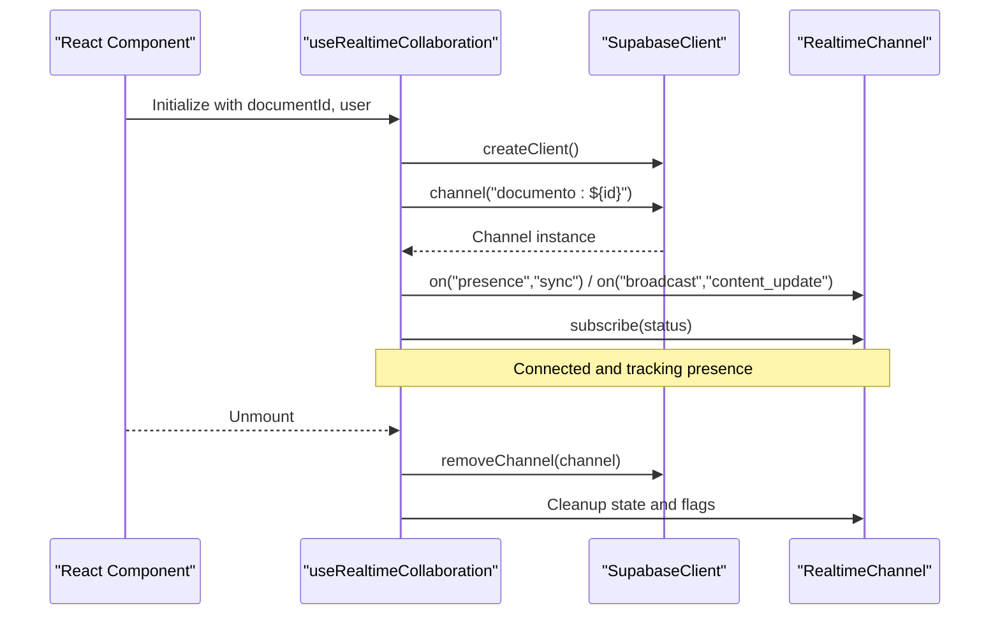

**Diagram sources**
- [use-realtime-collaboration.ts:88-181](file://src/hooks/use-realtime-collaboration.ts#L88-L181)

**Section sources**
- [use-realtime-collaboration.ts:88-181](file://src/hooks/use-realtime-collaboration.ts#L88-L181)

## Detailed Component Analysis

### Real-time Collaboration Hook
- Manages Supabase channel lifecycle, presence sync, and broadcast updates
- Uses refs to store channel and callback references to avoid stale closures
- Provides cleanup via removing the channel and resetting state

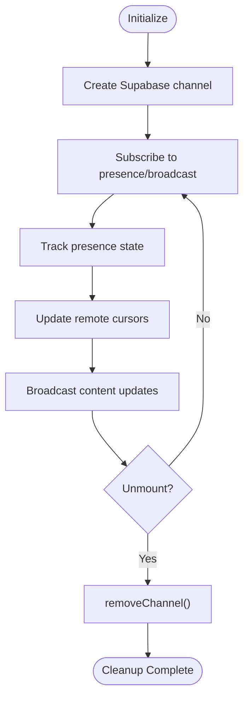

**Diagram sources**
- [use-realtime-collaboration.ts:88-181](file://src/hooks/use-realtime-collaboration.ts#L88-L181)

**Section sources**
- [use-realtime-collaboration.ts:88-181](file://src/hooks/use-realtime-collaboration.ts#L88-L181)

### Yjs Provider for Collaborative Editing
- Implements UnifiedProvider interface for @platejs/yjs
- Manages Y.Doc and Awareness lifecycle
- Handles local and remote updates, sync requests, and awareness propagation
- Provides explicit destroy method to detach listeners and disconnect channel

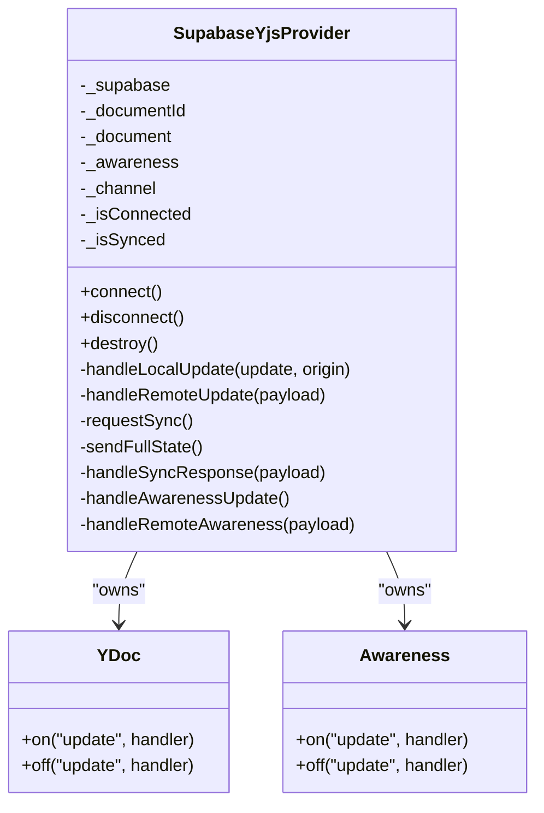

**Diagram sources**
- [supabase-yjs-provider.ts:78-130](file://src/lib/yjs/supabase-yjs-provider.ts#L78-L130)
- [supabase-yjs-provider.ts:215-219](file://src/lib/yjs/supabase-yjs-provider.ts#L215-L219)

**Section sources**
- [supabase-yjs-provider.ts:78-130](file://src/lib/yjs/supabase-yjs-provider.ts#L78-L130)
- [supabase-yjs-provider.ts:215-219](file://src/lib/yjs/supabase-yjs-provider.ts#L215-L219)

### Collaborative Plate Editor Lifecycle
- Creates Yjs provider and plugins, sets ready state, connects provider
- Cleans up provider destroy and resets editor plugins on unmount

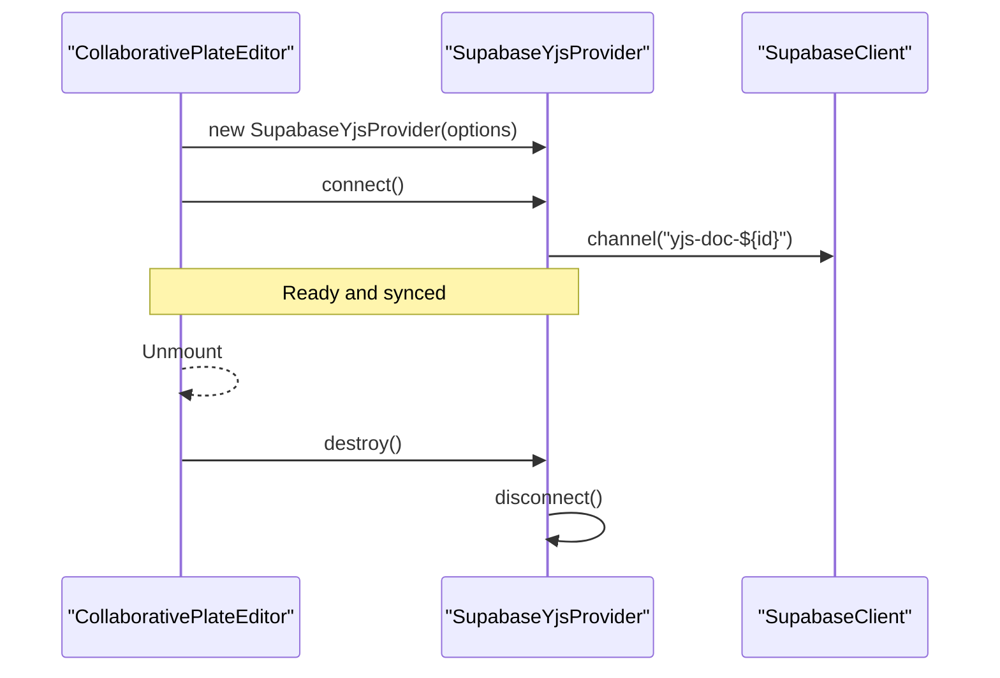

**Diagram sources**
- [collaborative-plate-editor.tsx:88-151](file://src/components/editor/plate/collaborative-plate-editor.tsx#L88-L151)
- [supabase-yjs-provider.ts:134-192](file://src/lib/yjs/supabase-yjs-provider.ts#L134-L192)

**Section sources**
- [collaborative-plate-editor.tsx:88-151](file://src/components/editor/plate/collaborative-plate-editor.tsx#L88-L151)
- [supabase-yjs-provider.ts:134-192](file://src/lib/yjs/supabase-yjs-provider.ts#L134-L192)

### Real-time Chat Hook
- Subscribes to broadcast events for messages and typing indicators
- Manages typing state with timeouts and cleanup on unmount
- Broadcasts typing and message events via channel

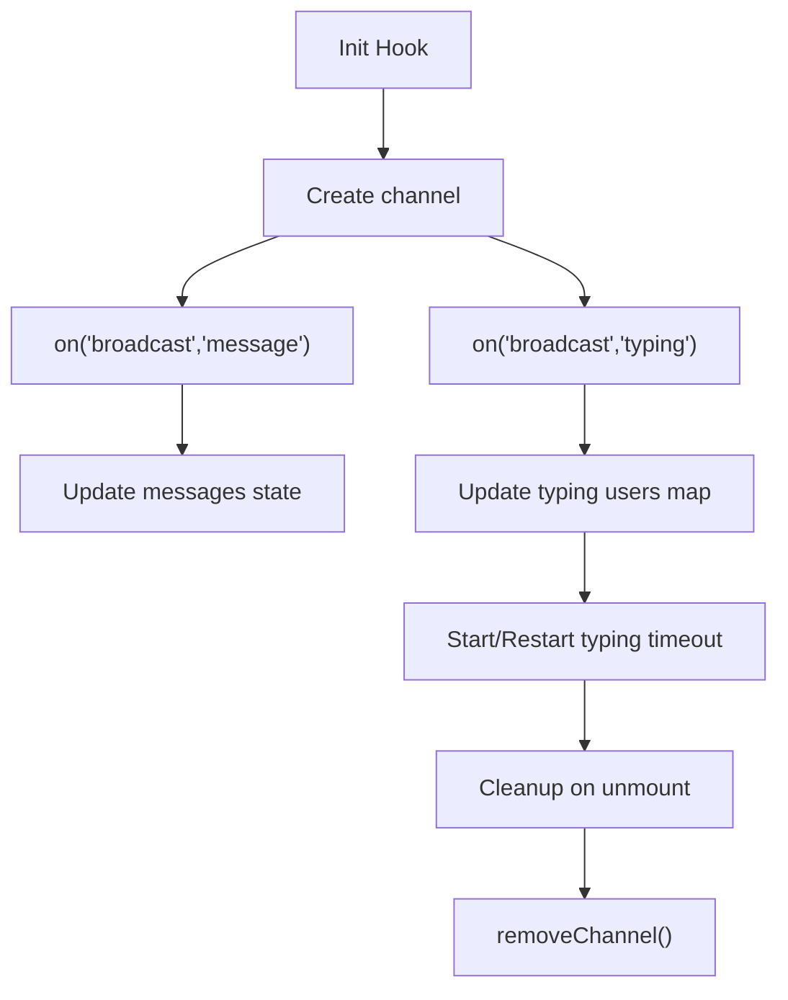

**Diagram sources**
- [use-realtime-chat.tsx:71-151](file://src/hooks/use-realtime-chat.tsx#L71-L151)

**Section sources**
- [use-realtime-chat.tsx:71-151](file://src/hooks/use-realtime-chat.tsx#L71-L151)

### Debounce and Throttle Utilities
- Debounce prevents rapid re-execution of expensive operations
- Throttle limits frequency of callbacks while ensuring eventual execution

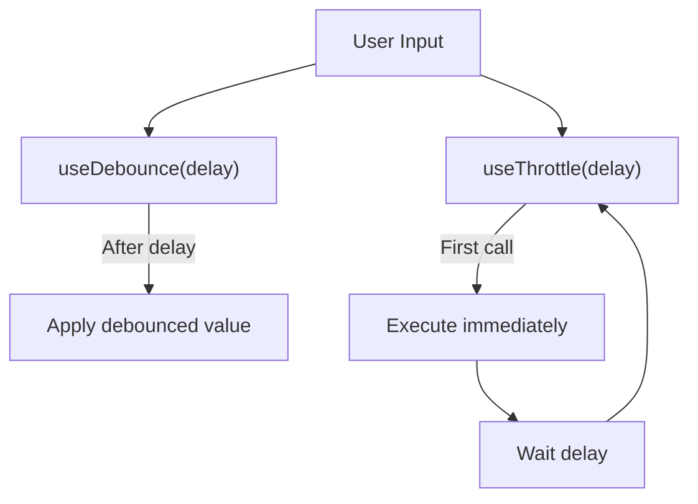

**Diagram sources**
- [use-debounce.ts:11-25](file://src/hooks/use-debounce.ts#L11-L25)
- [use-throttle.ts:1-37](file://src/components/ui/custom/minimal-tiptap/hooks/use-throttle.ts#L1-L37)

**Section sources**
- [use-debounce.ts:11-25](file://src/hooks/use-debounce.ts#L11-L25)
- [use-throttle.ts:1-37](file://src/components/ui/custom/minimal-tiptap/hooks/use-throttle.ts#L1-L37)

### Event Visibility Optimization
- Uses ResizeObserver to measure container height and compute visible event count
- Avoids repeated layout calculations and reduces reflows

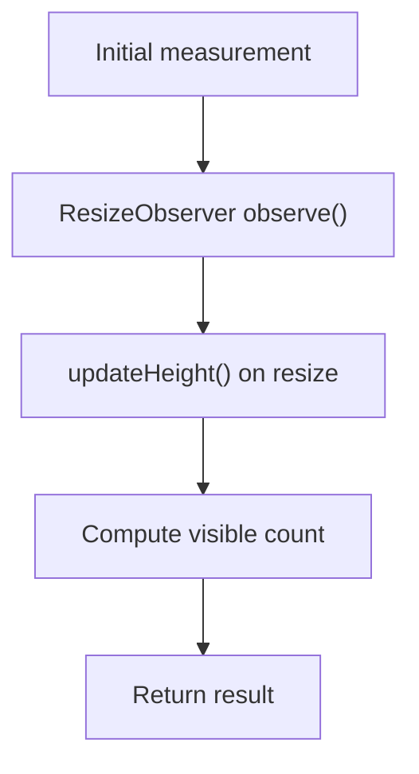

**Diagram sources**
- [use-event-visibility.ts](file://src/app/(authenticated)/calendar/hooks/use-event-visibility.ts#L20-L60)

**Section sources**
- [use-event-visibility.ts](file://src/app/(authenticated)/calendar/hooks/use-event-visibility.ts#L20-L60)

### Filtering and Sorting for Large Legal Datasets
- Timeline search filters and sorts items with memoization to avoid unnecessary recalculations
- Responsive table manages pagination and sorting state efficiently

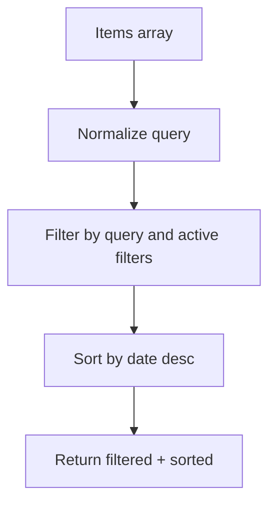

**Diagram sources**
- [use-timeline-search.ts](file://src/app/(authenticated)/processos/components/search/use-timeline-search.ts#L77-L118)
- [responsive-table.tsx:147-188](file://src/components/ui/responsive-table.tsx#L147-L188)

**Section sources**
- [use-timeline-search.ts](file://src/app/(authenticated)/processos/components/search/use-timeline-search.ts#L77-L118)
- [responsive-table.tsx:147-188](file://src/components/ui/responsive-table.tsx#L147-L188)

### Device Fingerprinting and Validation
- Collects browser entropy and generates a hash for device fingerprinting
- Validates fingerprint entropy to ensure sufficient entropy for security

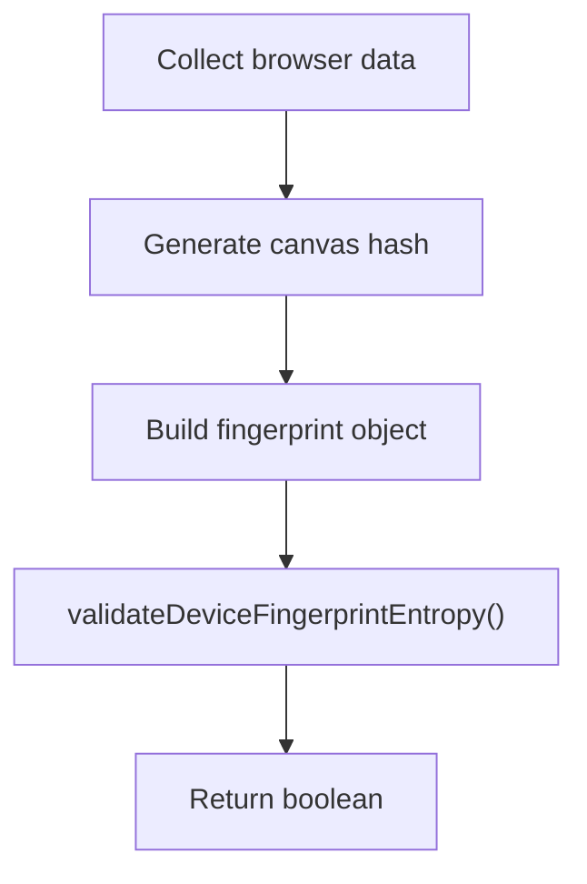

**Diagram sources**
- [device-fingerprint.ts:137-177](file://src/shared/assinatura-digital/utils/device-fingerprint.ts#L137-L177)
- [validation.service.ts:60-67](file://src/shared/assinatura-digital/services/signature/validation.service.ts#L60-L67)

**Section sources**
- [device-fingerprint.ts:137-177](file://src/shared/assinatura-digital/utils/device-fingerprint.ts#L137-L177)
- [validation.service.ts:60-67](file://src/shared/assinatura-digital/services/signature/validation.service.ts#L60-L67)

### AI-Assisted Editing and Document Processing
- Uploads and expediente actions coordinate AI indexing and embedding generation
- Repository functions manage document versions and comparisons
- AI route orchestrates tool selection and streaming responses

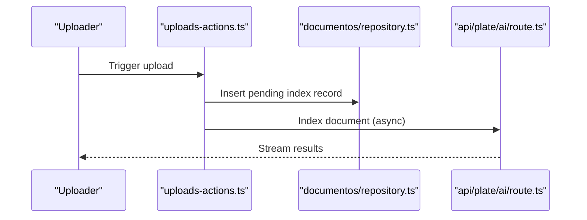

**Diagram sources**
- [uploads-actions.ts](file://src/app/(authenticated)/documentos/actions/uploads-actions.ts#L25-L54)
- [expediente-actions.ts](file://src/app/(authenticated)/expedientes/actions/expediente-actions.ts#L172-L204)
- [repository.ts](file://src/app/(authenticated)/documentos/repository.ts#L1986-L2046)
- [route.ts:225-271](file://src/app/api/plate/ai/route.ts#L225-L271)

**Section sources**
- [uploads-actions.ts](file://src/app/(authenticated)/documentos/actions/uploads-actions.ts#L25-L54)
- [expediente-actions.ts](file://src/app/(authenticated)/expedientes/actions/expediente-actions.ts#L172-L204)
- [repository.ts](file://src/app/(authenticated)/documentos/repository.ts#L1986-L2046)
- [route.ts:225-271](file://src/app/api/plate/ai/route.ts#L225-L271)

## Dependency Analysis
- Collaboration hook depends on Supabase client and manages channel lifecycle
- Yjs provider depends on Yjs and Awareness, and interacts with Supabase channels
- Plate editor depends on Yjs provider and manages lifecycle cleanup
- Chat hook depends on Supabase channels and manages typing state
- Utilities (debounce/throttle) reduce re-renders and API calls
- Filtering and sorting utilities depend on memoization to avoid recomputation
- Device fingerprinting and validation utilities depend on browser APIs

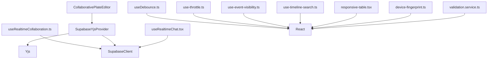

**Diagram sources**
- [use-realtime-collaboration.ts:61-65](file://src/hooks/use-realtime-collaboration.ts#L61-L65)
- [supabase-yjs-provider.ts:81-90](file://src/lib/yjs/supabase-yjs-provider.ts#L81-L90)
- [collaborative-plate-editor.tsx:80-85](file://src/components/editor/plate/collaborative-plate-editor.tsx#L80-L85)
- [use-realtime-chat.tsx:60-62](file://src/hooks/use-realtime-chat.tsx#L60-L62)
- [use-debounce.ts:11-12](file://src/hooks/use-debounce.ts#L11-L12)
- [use-throttle.ts:1-3](file://src/components/ui/custom/minimal-tiptap/hooks/use-throttle.ts#L1-L3)
- [use-event-visibility.ts](file://src/app/(authenticated)/calendar/hooks/use-event-visibility.ts#L24-L27)
- [use-timeline-search.ts](file://src/app/(authenticated)/processos/components/search/use-timeline-search.ts#L77-L78)
- [responsive-table.tsx:147-165](file://src/components/ui/responsive-table.tsx#L147-L165)
- [device-fingerprint.ts:137-140](file://src/shared/assinatura-digital/utils/device-fingerprint.ts#L137-L140)
- [validation.service.ts:60-63](file://src/shared/assinatura-digital/services/signature/validation.service.ts#L60-L63)

**Section sources**
- [use-realtime-collaboration.ts:61-65](file://src/hooks/use-realtime-collaboration.ts#L61-L65)
- [supabase-yjs-provider.ts:81-90](file://src/lib/yjs/supabase-yjs-provider.ts#L81-L90)
- [collaborative-plate-editor.tsx:80-85](file://src/components/editor/plate/collaborative-plate-editor.tsx#L80-L85)
- [use-realtime-chat.tsx:60-62](file://src/hooks/use-realtime-chat.tsx#L60-L62)
- [use-debounce.ts:11-12](file://src/hooks/use-debounce.ts#L11-L12)
- [use-throttle.ts:1-3](file://src/components/ui/custom/minimal-tiptap/hooks/use-throttle.ts#L1-L3)
- [use-event-visibility.ts](file://src/app/(authenticated)/calendar/hooks/use-event-visibility.ts#L24-L27)
- [use-timeline-search.ts](file://src/app/(authenticated)/processos/components/search/use-timeline-search.ts#L77-L78)
- [responsive-table.tsx:147-165](file://src/components/ui/responsive-table.tsx#L147-L165)
- [device-fingerprint.ts:137-140](file://src/shared/assinatura-digital/utils/device-fingerprint.ts#L137-L140)
- [validation.service.ts:60-63](file://src/shared/assinatura-digital/services/signature/validation.service.ts#L60-L63)

## Performance Considerations
- Prefer memoization for derived data and expensive computations (e.g., timeline search, table sorting).
- Use debounce/throttle for frequent UI interactions to limit re-renders and API calls.
- Avoid unnecessary state updates; leverage functional updates and stable references.
- Clean up event listeners, channels, and observers on component unmount.
- Minimize DOM measurements and reflows; use ResizeObserver and layout effects judiciously.
- Optimize rendering by splitting components and using React.memo where appropriate.
- Use controlled props for sorting and pagination to avoid internal state churn.
- Keep device fingerprinting lightweight and avoid heavy computations in hot paths.

[No sources needed since this section provides general guidance]

## Troubleshooting Guide
- Memory leaks from missing cleanup:
  - Ensure channel removal in collaboration and chat hooks.
  - Verify provider destroy in editor lifecycle.
  - Clear timeouts and intervals in hooks.
- Excessive re-renders:
  - Wrap callbacks with stable references and memoize derived data.
  - Use debounce/throttle for rapid events.
- Layout thrashing:
  - Use ResizeObserver and layout effects carefully; batch measurements.
- Performance regressions:
  - Monitor with browser devtools and heap snapshots.
  - Use profiling tools to identify hot paths.

**Section sources**
- [use-realtime-collaboration.ts:174-181](file://src/hooks/use-realtime-collaboration.ts#L174-L181)
- [use-realtime-chat.tsx:145-151](file://src/hooks/use-realtime-chat.tsx#L145-L151)
- [collaborative-plate-editor.tsx:142-151](file://src/components/editor/plate/collaborative-plate-editor.tsx#L142-L151)
- [use-debounce.ts:19-22](file://src/hooks/use-debounce.ts#L19-L22)
- [use-throttle.ts:1-37](file://src/components/ui/custom/minimal-tiptap/hooks/use-throttle.ts#L1-L37)
- [use-event-visibility.ts](file://src/app/(authenticated)/calendar/hooks/use-event-visibility.ts#L55-L59)

## Conclusion
Effective memory management in this legal case management system hinges on disciplined React lifecycle management, careful handling of real-time channels and observers, and performance-conscious data processing. By leveraging debounce/throttle utilities, memoization, and explicit cleanup patterns, the system maintains responsiveness and stability under heavy workloads. Integrating Yjs CRDT ensures scalable collaboration without memory overhead, while secure device fingerprinting and validation protect sensitive operations. Monitoring with browser tools and metrics enables proactive identification and resolution of memory issues.

[No sources needed since this section summarizes without analyzing specific files]

## Appendices

### Browser Memory Monitoring and Heap Snapshot Analysis
- Use Chrome DevTools Memory panel to capture heap snapshots and compare generations.
- Look for retained sizes and avoid cycles involving DOM nodes, event listeners, and closures.
- Focus on long-lived objects in real-time hooks and editors.

[No sources needed since this section provides general guidance]

### Memory Leak Detection Strategies
- Instrument channel creation/removal and provider lifecycle events.
- Verify cleanup of ResizeObserver instances and timers.
- Audit callback references and ensure stable references for event handlers.

[No sources needed since this section provides general guidance]

### Practical Examples

#### Document Processing and AI Indexing
- Queue asynchronous indexing to avoid blocking UI.
- Use repository functions to manage document versions and comparisons.
- Stream AI responses to minimize memory footprint during generation.

**Section sources**
- [uploads-actions.ts](file://src/app/(authenticated)/documentos/actions/uploads-actions.ts#L25-L54)
- [expediente-actions.ts](file://src/app/(authenticated)/expedientes/actions/expediente-actions.ts#L172-L204)
- [repository.ts](file://src/app/(authenticated)/documentos/repository.ts#L1986-L2046)
- [route.ts:225-271](file://src/app/api/plate/ai/route.ts#L225-L271)

#### Real-time Chat Features
- Manage typing indicators with timeouts and cleanup.
- Broadcast and listen to events on Supabase channels.
- Avoid storing large payloads in state; keep only necessary metadata.

**Section sources**
- [use-realtime-chat.tsx:127-151](file://src/hooks/use-realtime-chat.tsx#L127-L151)
- [use-realtime-chat.tsx:154-202](file://src/hooks/use-realtime-chat.tsx#L154-L202)

#### Garbage Collection Optimization and Profiling
- Parse Prometheus metrics to monitor disk I/O and cache hit rates.
- Use profiling tools to identify allocation hotspots and reduce churn.
- Apply incremental improvements to filtering and sorting algorithms.

**Section sources**
- [prometheus parsing:119-158](file://src/lib/supabase/management-api.ts#L119-L158)