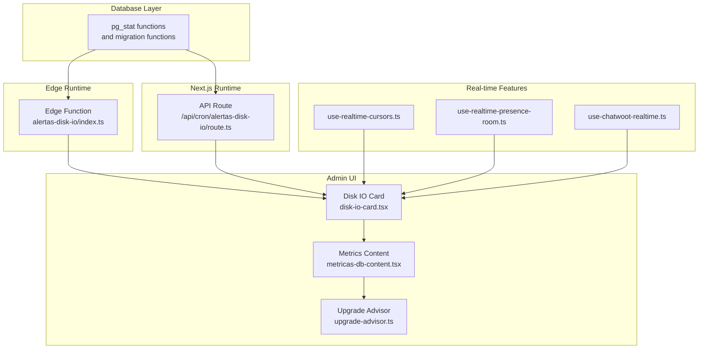
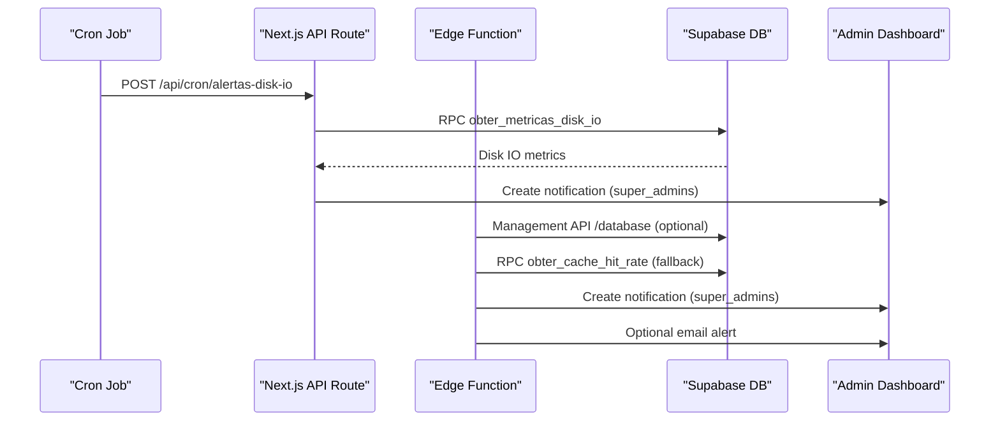
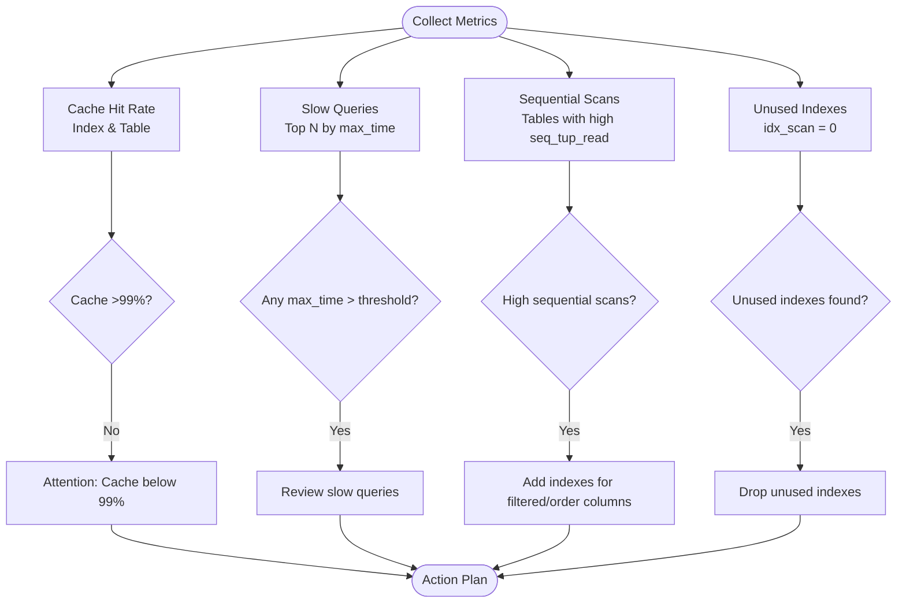
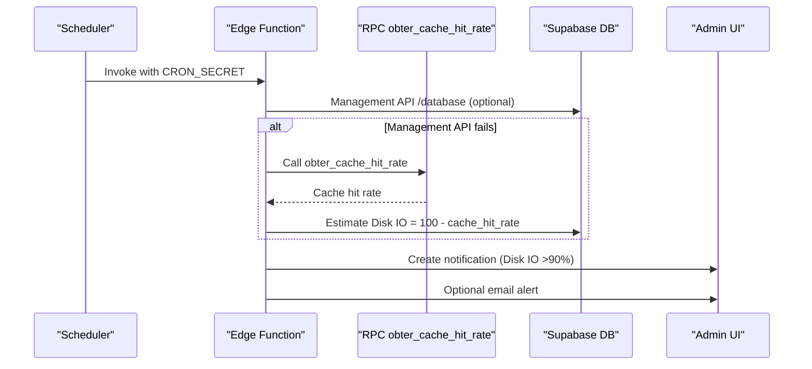
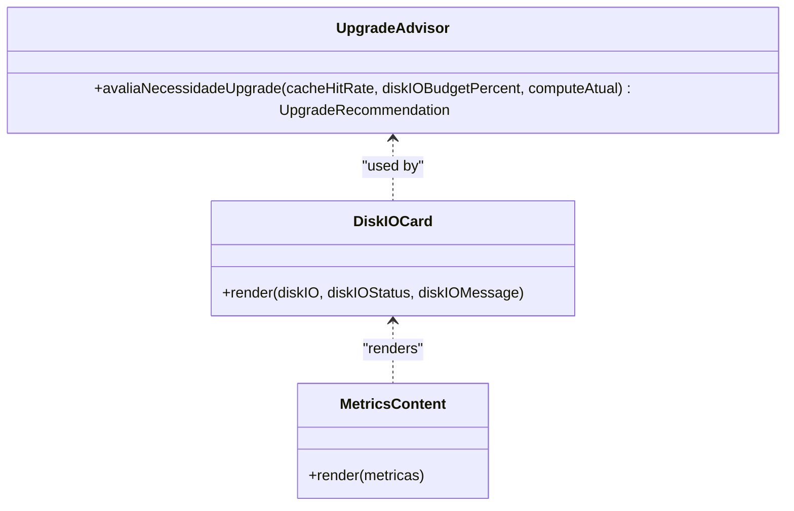
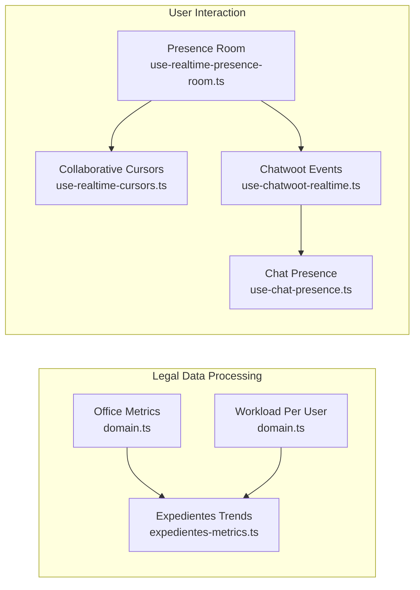
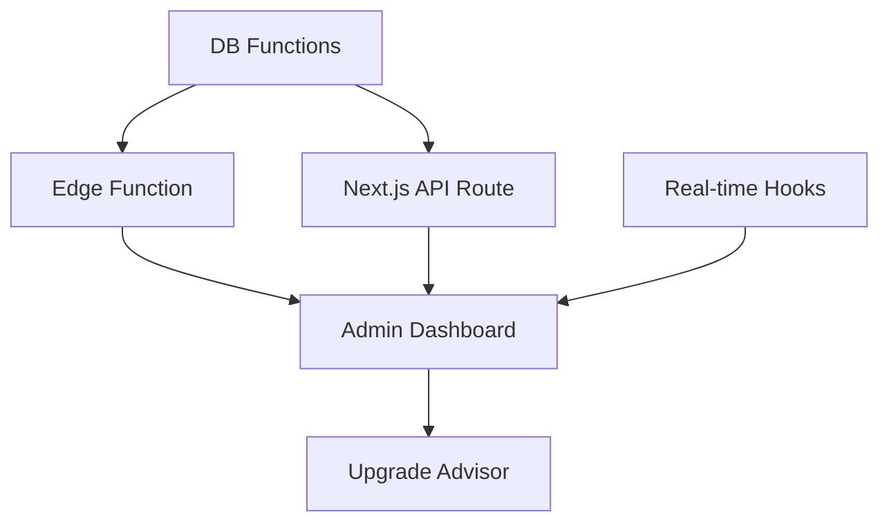

# Monitoring and Alerting

<cite>
**Referenced Files in This Document**
- [20260109123000_add_disk_io_metrics_functions.sql](file://supabase/migrations/20260109123000_add_disk_io_metrics_functions.sql)
- [diagnostico-disk-io.ts](file://scripts/database/diagnostico-disk-io.ts)
- [alertas-disk-io/index.ts](file://supabase/functions/alertas-disk-io/index.ts)
- [route.ts](file://src/app/api/cron/alertas-disk-io/route.ts)
- [upgrade-advisor.ts](file://src/app/(authenticated)/admin/services/upgrade-advisor.ts)
- [upgrade-actions.ts](file://src/app/(authenticated)/admin/actions/upgrade-actions.ts)
- [disk-io-card.tsx](file://src/app/(authenticated)/admin/metricas-db/components/disk-io-card.tsx)
- [metricas-db-content.tsx](file://src/app/(authenticated)/admin/metricas-db/components/metricas-db-content.tsx)
- [logger/index.ts](file://src/lib/logger/index.ts)
- [logger.ts](file://src/shared/assinatura-digital/services/logger.ts)
- [use-realtime-cursors.ts](file://src/hooks/use-realtime-cursors.ts)
- [use-realtime-presence-room.ts](file://src/hooks/use-realtime-presence-room.ts)
- [use-chatwoot-realtime.ts](file://src/lib/chatwoot/hooks/use-chatwoot-realtime.ts)
- [examples.tsx](file://src/lib/chatwoot/hooks/examples.tsx)
- [use-chat-presence.ts](file://src/app/(authenticated)/chat/hooks/use-chat-presence.ts)
- [domain.ts](file://src/app/(authenticated)/dashboard/domain.ts)
- [service.ts](file://src/app/(authenticated)/dashboard/service.ts)
- [actions/metricas-actions.ts](file://src/app/(authenticated)/dashboard/actions/metricas-actions.ts)
- [admin-metrics.ts](file://src/app/(authenticated)/dashboard/repositories/admin-metrics.ts)
- [expedientes-metrics.ts](file://src/app/(authenticated)/dashboard/repositories/expedientes-metrics.ts)
- [tendencia-responsividade.tsx](file://src/app/(authenticated)/dashboard/widgets/expedientes/tendencia-responsividade.tsx)
- [dashboard-content.tsx](file://src/app/(authenticated)/dashboard/components/shared/dashboard-content.tsx)
- [page.tsx](file://src/app/(ajuda)/ajuda/desenvolvimento/troubleshooting/page.tsx)
</cite>

## Table of Contents
1. [Introduction](#introduction)
2. [Project Structure](#project-structure)
3. [Core Components](#core-components)
4. [Architecture Overview](#architecture-overview)
5. [Detailed Component Analysis](#detailed-component-analysis)
6. [Dependency Analysis](#dependency-analysis)
7. [Performance Considerations](#performance-considerations)
8. [Troubleshooting Guide](#troubleshooting-guide)
9. [Conclusion](#conclusion)

## Introduction
This document provides comprehensive monitoring and alerting guidance for the legal management platform. It covers database performance monitoring (disk I/O metrics, query execution times, cache hit rates), application performance monitoring (legal data processing, user interactions, real-time features), automated alerting thresholds, capacity planning, and proactive issue detection. It also includes practical examples for setting up monitoring dashboards, configuring performance alerts, and incident response procedures, along with logging strategies for compliance, performance benchmarking, and capacity planning.

## Project Structure
The monitoring and alerting capabilities span database functions, Edge Functions, Next.js API routes, admin dashboards, and real-time features:
- Database functions expose metrics for cache hit rate, slow queries, sequential scans, and unused indexes.
- Edge Functions and Next.js API routes implement automated alerting and notifications.
- Admin dashboards visualize Disk I/O budget, cache hit rates, and upgrade recommendations.
- Real-time hooks track presence, cursors, and Chatwoot events for user interaction monitoring.
- Logging utilities centralize structured logging with correlation IDs for traceability.

**Diagram sources**
- [20260109123000_add_disk_io_metrics_functions.sql:1-104](file://supabase/migrations/20260109123000_add_disk_io_metrics_functions.sql#L1-L104)
- [alertas-disk-io/index.ts:1-342](file://supabase/functions/alertas-disk-io/index.ts#L1-L342)
- [route.ts:1-115](file://src/app/api/cron/alertas-disk-io/route.ts#L1-L115)
- [disk-io-card.tsx](file://src/app/(authenticated)/admin/metricas-db/components/disk-io-card.tsx#L1-L159)
- [metricas-db-content.tsx](file://src/app/(authenticated)/admin/metricas-db/components/metricas-db-content.tsx#L1-L80)
- [upgrade-advisor.ts](file://src/app/(authenticated)/admin/services/upgrade-advisor.ts#L1-L126)
- [use-realtime-cursors.ts:1-176](file://src/hooks/use-realtime-cursors.ts#L1-L176)
- [use-realtime-presence-room.ts:1-55](file://src/hooks/use-realtime-presence-room.ts#L1-L55)
- [use-chatwoot-realtime.ts:105-177](file://src/lib/chatwoot/hooks/use-chatwoot-realtime.ts#L105-L177)

**Section sources**
- [20260109123000_add_disk_io_metrics_functions.sql:1-104](file://supabase/migrations/20260109123000_add_disk_io_metrics_functions.sql#L1-L104)
- [alertas-disk-io/index.ts:1-342](file://supabase/functions/alertas-disk-io/index.ts#L1-L342)
- [route.ts:1-115](file://src/app/api/cron/alertas-disk-io/route.ts#L1-L115)
- [disk-io-card.tsx](file://src/app/(authenticated)/admin/metricas-db/components/disk-io-card.tsx#L1-L159)
- [metricas-db-content.tsx](file://src/app/(authenticated)/admin/metricas-db/components/metricas-db-content.tsx#L1-L80)
- [upgrade-advisor.ts](file://src/app/(authenticated)/admin/services/upgrade-advisor.ts#L1-L126)
- [use-realtime-cursors.ts:1-176](file://src/hooks/use-realtime-cursors.ts#L1-L176)
- [use-realtime-presence-room.ts:1-55](file://src/hooks/use-realtime-presence-room.ts#L1-L55)
- [use-chatwoot-realtime.ts:105-177](file://src/lib/chatwoot/hooks/use-chatwoot-realtime.ts#L105-L177)

## Core Components
- Database metrics functions:
  - Cache hit rate for indexes and tables.
  - Slow queries via pg_stat_statements.
  - Tables with sequential scans.
  - Unused indexes.
- Automated alerting:
  - Edge Function checks Disk IO budget and emits notifications and optional emails.
  - Next.js API route performs periodic checks and creates admin notifications.
- Admin dashboards:
  - Disk I/O budget card with progress indicators and upgrade suggestions.
  - Metrics content rendering cache hit rates and Disk I/O status.
- Capacity planning:
  - Upgrade advisor evaluates cache hit rate, Disk IO budget, and compute tier to recommend upgrades.
- Real-time monitoring:
  - Presence, cursors, and Chatwoot event streams for user interaction tracking.
- Logging:
  - Structured logging with correlation IDs and service-specific contexts.

**Section sources**
- [20260109123000_add_disk_io_metrics_functions.sql:3-104](file://supabase/migrations/20260109123000_add_disk_io_metrics_functions.sql#L3-L104)
- [alertas-disk-io/index.ts:253-297](file://supabase/functions/alertas-disk-io/index.ts#L253-L297)
- [route.ts:78-85](file://src/app/api/cron/alertas-disk-io/route.ts#L78-L85)
- [disk-io-card.tsx](file://src/app/(authenticated)/admin/metricas-db/components/disk-io-card.tsx#L17-L62)
- [metricas-db-content.tsx](file://src/app/(authenticated)/admin/metricas-db/components/metricas-db-content.tsx#L17-L26)
- [upgrade-advisor.ts](file://src/app/(authenticated)/admin/services/upgrade-advisor.ts#L23-L125)
- [use-realtime-presence-room.ts:23-47](file://src/hooks/use-realtime-presence-room.ts#L23-L47)
- [use-realtime-cursors.ts:77-103](file://src/hooks/use-realtime-cursors.ts#L77-L103)
- [use-chatwoot-realtime.ts:105-177](file://src/lib/chatwoot/hooks/use-chatwoot-realtime.ts#L105-L177)
- [logger/index.ts:1-57](file://src/lib/logger/index.ts#L1-L57)
- [logger.ts:109-158](file://src/shared/assinatura-digital/services/logger.ts#L109-L158)

## Architecture Overview
The monitoring pipeline integrates database metrics, automated alerting, and admin dashboards:
- Database functions expose metrics to both Edge Functions and Next.js routes.
- Edge Function attempts Management API metrics, falls back to RPC-based heuristics.
- Next.js API route triggers periodic checks and creates admin notifications.
- Admin UI renders Disk I/O budget, cache hit rates, and upgrade recommendations.
- Real-time hooks continuously stream presence and collaboration events.
- Logging utilities provide structured traces with correlation IDs.

**Diagram sources**
- [route.ts:61-87](file://src/app/api/cron/alertas-disk-io/route.ts#L61-L87)
- [alertas-disk-io/index.ts:224-242](file://supabase/functions/alertas-disk-io/index.ts#L224-L242)
- [20260109123000_add_disk_io_metrics_functions.sql:3-19](file://supabase/migrations/20260109123000_add_disk_io_metrics_functions.sql#L3-L19)

## Detailed Component Analysis

### Database Performance Monitoring
- Cache hit rate:
  - Index and table hit rates computed from pg_statio_user_indexes and pg_statio_user_tables.
  - Thresholds: excellent >99%, attention 95–99%, critical <95%.
- Slow queries:
  - Top N queries by max execution time via pg_stat_statements.
  - Includes calls, total time, and max time for prioritization.
- Sequential scans:
  - Tables with high seq_scan and seq_tup_read indicate missing indexes.
- Unused indexes:
  - Identifies indexes with idx_scan = 0 (excluding primary and unique).

**Diagram sources**
- [20260109123000_add_disk_io_metrics_functions.sql:3-104](file://supabase/migrations/20260109123000_add_disk_io_metrics_functions.sql#L3-L104)
- [diagnostico-disk-io.ts:276-297](file://scripts/database/diagnostico-disk-io.ts#L276-L297)

**Section sources**
- [20260109123000_add_disk_io_metrics_functions.sql:3-104](file://supabase/migrations/20260109123000_add_disk_io_metrics_functions.sql#L3-L104)
- [diagnostico-disk-io.ts:276-297](file://scripts/database/diagnostico-disk-io.ts#L276-L297)

### Automated Alerting for Disk I/O Budget
- Edge Function:
  - Attempts Management API for Disk IO percentage; falls back to RPC-based cache hit rate heuristic.
  - Emits notifications for Disk IO >90% and critical bloat (>50%).
  - Optionally sends email alerts if SMTP is configured.
- Next.js API Route:
  - Periodic check via RPC obter_metricas_disk_io.
  - Creates admin notifications when Disk IO budget exceeds 90%.

**Diagram sources**
- [alertas-disk-io/index.ts:224-242](file://supabase/functions/alertas-disk-io/index.ts#L224-L242)
- [alertas-disk-io/index.ts:253-285](file://supabase/functions/alertas-disk-io/index.ts#L253-L285)
- [route.ts:70-85](file://src/app/api/cron/alertas-disk-io/route.ts#L70-L85)

**Section sources**
- [alertas-disk-io/index.ts:48-98](file://supabase/functions/alertas-disk-io/index.ts#L48-L98)
- [alertas-disk-io/index.ts:253-297](file://supabase/functions/alertas-disk-io/index.ts#L253-L297)
- [route.ts:61-87](file://src/app/api/cron/alertas-disk-io/route.ts#L61-L87)

### Admin Dashboard Metrics and Upgrade Recommendations
- Disk I/O Budget Card:
  - Displays disk_io_budget_percent, IOPS, and throughput.
  - Shows compute tier badge and upgrade suggestion when budget ≥80%.
- Metrics Content:
  - Renders cache hit rates for indexes and tables with progress bars and color-coded status.
- Upgrade Advisor:
  - Evaluates cache hit rate, Disk IO budget, and compute tier to recommend upgrades.
  - Provides cost increase estimates and downtime assumptions.

**Diagram sources**
- [upgrade-advisor.ts](file://src/app/(authenticated)/admin/services/upgrade-advisor.ts#L23-L125)
- [disk-io-card.tsx](file://src/app/(authenticated)/admin/metricas-db/components/disk-io-card.tsx#L64-L159)
- [metricas-db-content.tsx](file://src/app/(authenticated)/admin/metricas-db/components/metricas-db-content.tsx#L28-L80)

**Section sources**
- [disk-io-card.tsx](file://src/app/(authenticated)/admin/metricas-db/components/disk-io-card.tsx#L17-L62)
- [metricas-db-content.tsx](file://src/app/(authenticated)/admin/metricas-db/components/metricas-db-content.tsx#L17-L26)
- [upgrade-advisor.ts](file://src/app/(authenticated)/admin/services/upgrade-advisor.ts#L23-L125)
- [upgrade-actions.ts](file://src/app/(authenticated)/admin/actions/upgrade-actions.ts#L44-L76)

### Application Performance Monitoring (Legal Data Processing and User Interactions)
- Legal data processing:
  - Dashboard metrics include office-wide KPIs, workload per user, and performance trends for legal processes.
  - Repositories aggregate metrics for expedientes, deadlines, and response times.
- User interaction tracking:
  - Real-time presence and cursors for collaborative editing.
  - Chatwoot event monitoring for live chat conversations.
  - Chat presence tracking to detect online/away status.

**Diagram sources**
- [domain.ts](file://src/app/(authenticated)/dashboard/domain.ts#L430-L482)
- [expedientes-metrics.ts](file://src/app/(authenticated)/dashboard/repositories/expedientes-metrics.ts#L218-L266)
- [use-realtime-presence-room.ts:23-47](file://src/hooks/use-realtime-presence-room.ts#L23-L47)
- [use-realtime-cursors.ts:77-103](file://src/hooks/use-realtime-cursors.ts#L77-L103)
- [use-chatwoot-realtime.ts:105-177](file://src/lib/chatwoot/hooks/use-chatwoot-realtime.ts#L105-L177)
- [use-chat-presence.ts](file://src/app/(authenticated)/chat/hooks/use-chat-presence.ts#L81-L117)

**Section sources**
- [domain.ts](file://src/app/(authenticated)/dashboard/domain.ts#L430-L482)
- [expedientes-metrics.ts](file://src/app/(authenticated)/dashboard/repositories/expedientes-metrics.ts#L218-L266)
- [use-realtime-presence-room.ts:23-47](file://src/hooks/use-realtime-presence-room.ts#L23-L47)
- [use-realtime-cursors.ts:77-103](file://src/hooks/use-realtime-cursors.ts#L77-L103)
- [use-chatwoot-realtime.ts:105-177](file://src/lib/chatwoot/hooks/use-chatwoot-realtime.ts#L105-L177)
- [use-chat-presence.ts](file://src/app/(authenticated)/chat/hooks/use-chat-presence.ts#L81-L117)

### Logging Strategies for Compliance and Benchmarking
- Structured logging:
  - Base logger with correlation IDs for traceability across requests.
  - Child loggers inherit correlation IDs for downstream operations.
- Service-specific logging:
  - Signature and storage operations include operation types and metrics (e.g., duration).
- Best practices:
  - Use correlation IDs to link logs across backend, Edge Functions, and admin actions.
  - Include timestamps, operation names, and performance metrics for benchmarking.

**Section sources**
- [logger/index.ts:1-57](file://src/lib/logger/index.ts#L1-L57)
- [logger.ts:109-158](file://src/shared/assinatura-digital/services/logger.ts#L109-L158)

## Dependency Analysis
- Database functions depend on pg_stat_statements and pg_statio_user_* views.
- Edge Function depends on Management API availability; falls back to RPC.
- Next.js API route depends on RPC obter_metricas_disk_io.
- Admin UI components depend on upgrade advisor service and metric retrieval actions.
- Real-time features depend on Supabase channels and presence synchronization.

**Diagram sources**
- [20260109123000_add_disk_io_metrics_functions.sql:3-19](file://supabase/migrations/20260109123000_add_disk_io_metrics_functions.sql#L3-L19)
- [alertas-disk-io/index.ts:224-242](file://supabase/functions/alertas-disk-io/index.ts#L224-L242)
- [route.ts:70-73](file://src/app/api/cron/alertas-disk-io/route.ts#L70-L73)
- [upgrade-advisor.ts](file://src/app/(authenticated)/admin/services/upgrade-advisor.ts#L23-L125)
- [use-realtime-presence-room.ts:23-47](file://src/hooks/use-realtime-presence-room.ts#L23-L47)

**Section sources**
- [20260109123000_add_disk_io_metrics_functions.sql:3-19](file://supabase/migrations/20260109123000_add_disk_io_metrics_functions.sql#L3-L19)
- [alertas-disk-io/index.ts:224-242](file://supabase/functions/alertas-disk-io/index.ts#L224-L242)
- [route.ts:70-73](file://src/app/api/cron/alertas-disk-io/route.ts#L70-L73)
- [upgrade-advisor.ts](file://src/app/(authenticated)/admin/services/upgrade-advisor.ts#L23-L125)
- [use-realtime-presence-room.ts:23-47](file://src/hooks/use-realtime-presence-room.ts#L23-L47)

## Performance Considerations
- Database:
  - Enable pg_stat_statements for slow query identification.
  - Add indexes for tables with high sequential scans.
  - Regularly vacuum/reindex to reduce bloat.
- Application:
  - Cache metrics with appropriate TTLs (e.g., dashboard metrics cached for 5 minutes).
  - Use parallel queries to minimize latency.
- Real-time:
  - Throttle cursor movement events to reduce bandwidth.
  - Use presence synchronization to avoid redundant updates.

[No sources needed since this section provides general guidance]

## Troubleshooting Guide
- Disk I/O diagnostics:
  - Run diagnostic script to collect cache hit rate, slow queries, sequential scans, bloat, and unused indexes.
  - Review generated report and apply recommended actions.
- Health checks:
  - Use Next.js debug endpoints for quick checks (cache stats, health).
- Edge Function and API route:
  - Verify CRON_SECRET and Management API token configuration.
  - Confirm service role keys and permissions for RPC access.

**Section sources**
- [diagnostico-disk-io.ts:359-416](file://scripts/database/diagnostico-disk-io.ts#L359-L416)
- [page.tsx](file://src/app/(ajuda)/ajuda/desenvolvimento/troubleshooting/page.tsx#L128-L152)
- [alertas-disk-io/index.ts:190-207](file://supabase/functions/alertas-disk-io/index.ts#L190-L207)
- [route.ts:65-66](file://src/app/api/cron/alertas-disk-io/route.ts#L65-L66)

## Conclusion
The platform implements a robust monitoring and alerting framework combining database metrics, automated alerts, admin dashboards, and real-time user interaction tracking. By leveraging cache hit rates, slow query identification, Disk I/O budget monitoring, and upgrade recommendations, administrators can proactively manage performance and capacity. Structured logging with correlation IDs ensures traceability for compliance and benchmarking. The provided troubleshooting steps and practical examples enable efficient setup and maintenance of monitoring and alerting for the legal management platform.