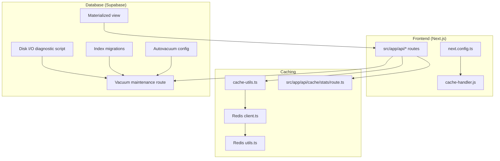
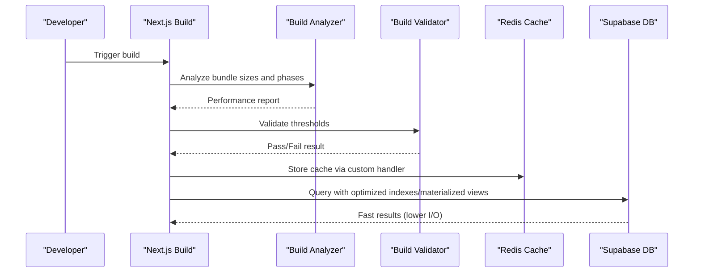
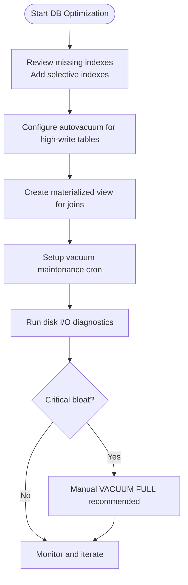
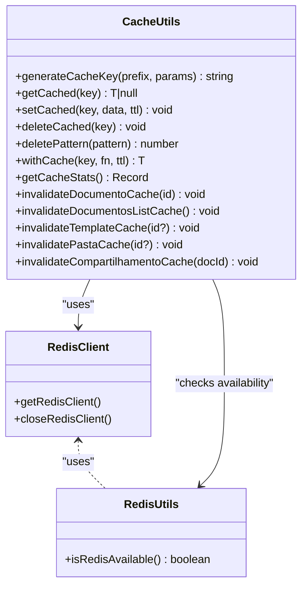
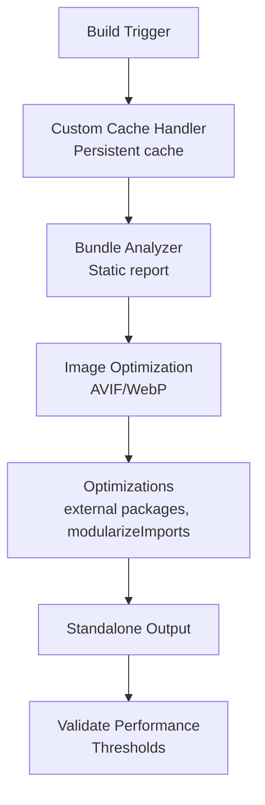
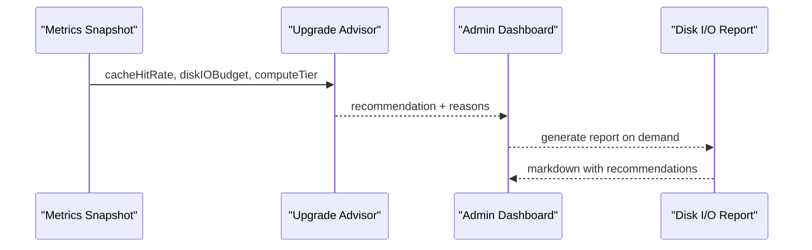
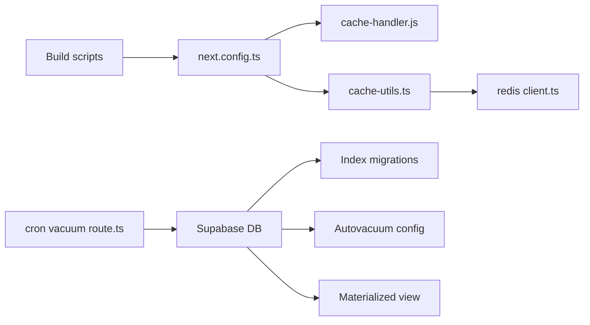

# Performance and Optimization

<cite>
**Referenced Files in This Document**
- [next.config.ts](file://next.config.ts)
- [package.json](file://package.json)
- [cache-handler.js](file://cache-handler.js)
- [src/lib/redis/cache-utils.ts](file://src/lib/redis/cache-utils.ts)
- [src/lib/redis/client.ts](file://src/lib/redis/client.ts)
- [src/lib/redis/utils.ts](file://src/lib/redis/utils.ts)
- [src/app/api/cache/stats/route.ts](file://src/app/api/cache/stats/route.ts)
- [src/app/api/cron/vacuum-maintenance/route.ts](file://src/app/api/cron/vacuum-maintenance/route.ts)
- [scripts/database/diagnostico-disk-io.ts](file://scripts/database/diagnostico-disk-io.ts)
- [scripts/db/check-bloat.ts](file://scripts/db/check-bloat.ts)
- [supabase/migrations/20260109150000_add_missing_indexes_disk_io_optimization.sql](file://supabase/migrations/20260109150000_add_missing_indexes_disk_io_optimization.sql)
- [supabase/migrations/20260110120000_configure_autovacuum_aggressive.sql](file://supabase/migrations/20260110120000_configure_autovacuum_aggressive.sql)
- [supabase/migrations/20260110000000_create_mensagens_chat_materialized_view.sql](file://supabase/migrations/20260110000000_create_mensagens_chat_materialized_view.sql)
- [supabase/COMMANDS_REFERENCE.sh](file://supabase/COMMANDS_REFERENCE.sh)
- [scripts/dev-tools/build/analyze-build-performance.js](file://scripts/dev-tools/build/analyze-build-performance.js)
- [scripts/dev-tools/build/validate-build-performance.js](file://scripts/dev-tools/build/validate-build-performance.js)
- [src/app/(authenticated)/admin/services/upgrade-advisor.ts](file://src/app/(authenticated)/admin/services/upgrade-advisor.ts)
- [src/app/(authenticated)/admin/metricas-db/avaliar-upgrade/components/avaliar-upgrade-content.tsx](file://src/app/(authenticated)/admin/metricas-db/avaliar-upgrade/components/avaliar-upgrade-content.tsx)
- [supabase/useful_queries.sql](file://supabase/useful_queries.sql)
</cite>

## Table of Contents
1. [Introduction](#introduction)
2. [Project Structure](#project-structure)
3. [Core Components](#core-components)
4. [Architecture Overview](#architecture-overview)
5. [Detailed Component Analysis](#detailed-component-analysis)
6. [Dependency Analysis](#dependency-analysis)
7. [Performance Considerations](#performance-considerations)
8. [Troubleshooting Guide](#troubleshooting-guide)
9. [Conclusion](#conclusion)
10. [Appendices](#appendices)

## Introduction
This document consolidates performance optimization strategies across database, caching, build, and memory management for the project. It covers PostgreSQL optimization techniques (indexes, vacuum maintenance, materialized views), Redis caching implementation and invalidation, Next.js build optimization and image handling, and practical profiling and capacity planning for legal data volume scaling. It also documents monitoring and alerting mechanisms and provides actionable guidance for identifying bottlenecks and implementing targeted improvements.

## Project Structure
The performance optimization effort spans three primary areas:
- Database layer: Supabase/PostgreSQL with migration-driven index and vacuum tuning, plus materialized views for frequently accessed joins.
- Application layer: Next.js configuration for build performance, custom cache handler for persistent caching, and Redis client utilities for caching and stats.
- Tooling layer: Scripts for disk I/O diagnosis, vacuum maintenance, bundle analysis, and build validation.

**Diagram sources**
- [next.config.ts:1-435](file://next.config.ts#L1-L435)
- [cache-handler.js:1-140](file://cache-handler.js#L1-L140)
- [src/lib/redis/cache-utils.ts:1-218](file://src/lib/redis/cache-utils.ts#L1-L218)
- [src/lib/redis/client.ts:1-107](file://src/lib/redis/client.ts#L1-L107)
- [src/lib/redis/utils.ts:1-12](file://src/lib/redis/utils.ts#L1-L12)
- [src/app/api/cache/stats/route.ts:78-98](file://src/app/api/cache/stats/route.ts#L78-L98)
- [src/app/api/cron/vacuum-maintenance/route.ts:1-133](file://src/app/api/cron/vacuum-maintenance/route.ts#L1-L133)
- [scripts/database/diagnostico-disk-io.ts:1-416](file://scripts/database/diagnostico-disk-io.ts#L1-L416)
- [supabase/migrations/20260109150000_add_missing_indexes_disk_io_optimization.sql:1-123](file://supabase/migrations/20260109150000_add_missing_indexes_disk_io_optimization.sql#L1-L123)
- [supabase/migrations/20260110120000_configure_autovacuum_aggressive.sql:1-31](file://supabase/migrations/20260110120000_configure_autovacuum_aggressive.sql#L1-L31)
- [supabase/migrations/20260110000000_create_mensagens_chat_materialized_view.sql:1-59](file://supabase/migrations/20260110000000_create_mensagens_chat_materialized_view.sql#L1-L59)

**Section sources**
- [next.config.ts:1-435](file://next.config.ts#L1-L435)
- [cache-handler.js:1-140](file://cache-handler.js#L1-L140)
- [src/lib/redis/cache-utils.ts:1-218](file://src/lib/redis/cache-utils.ts#L1-L218)
- [src/lib/redis/client.ts:1-107](file://src/lib/redis/client.ts#L1-L107)
- [src/lib/redis/utils.ts:1-12](file://src/lib/redis/utils.ts#L1-L12)
- [src/app/api/cache/stats/route.ts:78-98](file://src/app/api/cache/stats/route.ts#L78-L98)
- [src/app/api/cron/vacuum-maintenance/route.ts:1-133](file://src/app/api/cron/vacuum-maintenance/route.ts#L1-L133)
- [scripts/database/diagnostico-disk-io.ts:1-416](file://scripts/database/diagnostico-disk-io.ts#L1-L416)
- [supabase/migrations/20260109150000_add_missing_indexes_disk_io_optimization.sql:1-123](file://supabase/migrations/20260109150000_add_missing_indexes_disk_io_optimization.sql#L1-L123)
- [supabase/migrations/20260110120000_configure_autovacuum_aggressive.sql:1-31](file://supabase/migrations/20260110120000_configure_autovacuum_aggressive.sql#L1-L31)
- [supabase/migrations/20260110000000_create_mensagens_chat_materialized_view.sql:1-59](file://supabase/migrations/20260110000000_create_mensagens_chat_materialized_view.sql#L1-L59)

## Core Components
- Next.js build and runtime configuration tuned for performance, including bundle analysis, image optimization, and persistent caching.
- Redis caching utilities with deterministic key generation, TTL management, and cache stats retrieval.
- Database optimization via migrations adding selective indexes, aggressive autovacuum, and materialized views.
- Automated vacuum maintenance and disk I/O diagnostics with actionable alerts and reporting.

**Section sources**
- [next.config.ts:1-435](file://next.config.ts#L1-L435)
- [src/lib/redis/cache-utils.ts:1-218](file://src/lib/redis/cache-utils.ts#L1-L218)
- [src/lib/redis/client.ts:1-107](file://src/lib/redis/client.ts#L1-L107)
- [src/lib/redis/utils.ts:1-12](file://src/lib/redis/utils.ts#L1-L12)
- [src/app/api/cron/vacuum-maintenance/route.ts:1-133](file://src/app/api/cron/vacuum-maintenance/route.ts#L1-L133)
- [scripts/database/diagnostico-disk-io.ts:1-416](file://scripts/database/diagnostico-disk-io.ts#L1-L416)

## Architecture Overview
The performance architecture integrates build-time optimizations, runtime caching, and database tuning to scale with legal data volumes.

**Diagram sources**
- [next.config.ts:1-435](file://next.config.ts#L1-L435)
- [scripts/dev-tools/build/analyze-build-performance.js:1-586](file://scripts/dev-tools/build/analyze-build-performance.js#L1-L586)
- [scripts/dev-tools/build/validate-build-performance.js:1-455](file://scripts/dev-tools/build/validate-build-performance.js#L1-L455)
- [cache-handler.js:1-140](file://cache-handler.js#L1-L140)
- [src/lib/redis/cache-utils.ts:1-218](file://src/lib/redis/cache-utils.ts#L1-L218)
- [supabase/migrations/20260109150000_add_missing_indexes_disk_io_optimization.sql:1-123](file://supabase/migrations/20260109150000_add_missing_indexes_disk_io_optimization.sql#L1-L123)
- [supabase/migrations/20260110000000_create_mensagens_chat_materialized_view.sql:1-59](file://supabase/migrations/20260110000000_create_mensagens_chat_materialized_view.sql#L1-L59)

## Detailed Component Analysis

### Database Optimization (PostgreSQL)
- Index strategies: Selective indexes on frequently filtered/ordered columns to avoid sequential scans and improve query performance.
- Vacuum maintenance: Aggressive autovacuum settings for high-write tables and automated vacuum diagnostics via cron endpoint.
- Materialized views: Precomputed joins to eliminate repeated joins and reduce latency for chat messages with user data.

**Diagram sources**
- [supabase/migrations/20260109150000_add_missing_indexes_disk_io_optimization.sql:1-123](file://supabase/migrations/20260109150000_add_missing_indexes_disk_io_optimization.sql#L1-L123)
- [supabase/migrations/20260110120000_configure_autovacuum_aggressive.sql:1-31](file://supabase/migrations/20260110120000_configure_autovacuum_aggressive.sql#L1-L31)
- [supabase/migrations/20260110000000_create_mensagens_chat_materialized_view.sql:1-59](file://supabase/migrations/20260110000000_create_mensagens_chat_materialized_view.sql#L1-L59)
- [src/app/api/cron/vacuum-maintenance/route.ts:1-133](file://src/app/api/cron/vacuum-maintenance/route.ts#L1-L133)
- [scripts/database/diagnostico-disk-io.ts:1-416](file://scripts/database/diagnostico-disk-io.ts#L1-L416)

**Section sources**
- [supabase/migrations/20260109150000_add_missing_indexes_disk_io_optimization.sql:1-123](file://supabase/migrations/20260109150000_add_missing_indexes_disk_io_optimization.sql#L1-L123)
- [supabase/migrations/20260110120000_configure_autovacuum_aggressive.sql:1-31](file://supabase/migrations/20260110120000_configure_autovacuum_aggressive.sql#L1-L31)
- [supabase/migrations/20260110000000_create_mensagens_chat_materialized_view.sql:1-59](file://supabase/migrations/20260110000000_create_mensagens_chat_materialized_view.sql#L1-L59)
- [src/app/api/cron/vacuum-maintenance/route.ts:1-133](file://src/app/api/cron/vacuum-maintenance/route.ts#L1-L133)
- [scripts/database/diagnostico-disk-io.ts:1-416](file://scripts/database/diagnostico-disk-io.ts#L1-L416)
- [scripts/db/check-bloat.ts:65-95](file://scripts/db/check-bloat.ts#L65-L95)
- [supabase/COMMANDS_REFERENCE.sh:115-155](file://supabase/COMMANDS_REFERENCE.sh#L115-L155)

### Redis Caching Implementation
- Deterministic cache keys with parameter normalization.
- TTL management per cache prefix and document-specific TTLs.
- Cache stats retrieval via Redis INFO parsing.
- Cache invalidation by tag and document ID.

**Diagram sources**
- [src/lib/redis/client.ts:1-107](file://src/lib/redis/client.ts#L1-L107)
- [src/lib/redis/utils.ts:1-12](file://src/lib/redis/utils.ts#L1-L12)
- [src/lib/redis/cache-utils.ts:1-218](file://src/lib/redis/cache-utils.ts#L1-L218)

**Section sources**
- [src/lib/redis/cache-utils.ts:1-218](file://src/lib/redis/cache-utils.ts#L1-L218)
- [src/lib/redis/client.ts:1-107](file://src/lib/redis/client.ts#L1-L107)
- [src/lib/redis/utils.ts:1-12](file://src/lib/redis/utils.ts#L1-L12)
- [src/app/api/cache/stats/route.ts:78-98](file://src/app/api/cache/stats/route.ts#L78-L98)

### Next.js Build Optimization
- Bundle analysis with @next/bundle-analyzer and static report generation.
- Persistent cache handler for ISR/fetch caching across builds.
- Image optimization with modern formats (AVIF/WebP) and remote patterns.
- Optimizations: standalone output, external server packages, modularizeImports, reduced workers for constrained environments.

**Diagram sources**
- [next.config.ts:1-435](file://next.config.ts#L1-L435)
- [cache-handler.js:1-140](file://cache-handler.js#L1-L140)
- [scripts/dev-tools/build/analyze-build-performance.js:1-586](file://scripts/dev-tools/build/analyze-build-performance.js#L1-L586)
- [scripts/dev-tools/build/validate-build-performance.js:1-455](file://scripts/dev-tools/build/validate-build-performance.js#L1-L455)

**Section sources**
- [next.config.ts:1-435](file://next.config.ts#L1-L435)
- [cache-handler.js:1-140](file://cache-handler.js#L1-L140)
- [scripts/dev-tools/build/analyze-build-performance.js:1-586](file://scripts/dev-tools/build/analyze-build-performance.js#L1-L586)
- [scripts/dev-tools/build/validate-build-performance.js:1-455](file://scripts/dev-tools/build/validate-build-performance.js#L1-L455)

### Monitoring and Capacity Planning
- Upgrade advisor evaluates cache hit rate and disk IO budget to recommend compute tier upgrades.
- Dashboard component aggregates metrics snapshots to drive decisions.
- Disk I/O diagnostic script produces Markdown reports with actionable recommendations.

**Diagram sources**
- [src/app/(authenticated)/admin/services/upgrade-advisor.ts:1-126](file://src/app/(authenticated)/admin/services/upgrade-advisor.ts#L1-L126)
- [src/app/(authenticated)/admin/metricas-db/avaliar-upgrade/components/avaliar-upgrade-content.tsx:98-143](file://src/app/(authenticated)/admin/metricas-db/avaliar-upgrade/components/avaliar-upgrade-content.tsx#L98-L143)
- [scripts/database/diagnostico-disk-io.ts:1-416](file://scripts/database/diagnostico-disk-io.ts#L1-L416)

**Section sources**
- [src/app/(authenticated)/admin/services/upgrade-advisor.ts:1-126](file://src/app/(authenticated)/admin/services/upgrade-advisor.ts#L1-L126)
- [src/app/(authenticated)/admin/metricas-db/avaliar-upgrade/components/avaliar-upgrade-content.tsx:98-143](file://src/app/(authenticated)/admin/metricas-db/avaliar-upgrade/components/avaliar-upgrade-content.tsx#L98-L143)
- [scripts/database/diagnostico-disk-io.ts:1-416](file://scripts/database/diagnostico-disk-io.ts#L1-L416)

## Dependency Analysis
- Next.js depends on a custom cache handler for persistent caching and on Redis utilities for runtime cache operations.
- Database routes depend on Supabase service client and rely on migrations for index and vacuum configurations.
- Build tools depend on Node.js memory limits and environment variables to manage resource constraints.

**Diagram sources**
- [next.config.ts:1-435](file://next.config.ts#L1-L435)
- [cache-handler.js:1-140](file://cache-handler.js#L1-L140)
- [src/lib/redis/cache-utils.ts:1-218](file://src/lib/redis/cache-utils.ts#L1-L218)
- [src/lib/redis/client.ts:1-107](file://src/lib/redis/client.ts#L1-L107)
- [src/app/api/cron/vacuum-maintenance/route.ts:1-133](file://src/app/api/cron/vacuum-maintenance/route.ts#L1-L133)
- [supabase/migrations/20260109150000_add_missing_indexes_disk_io_optimization.sql:1-123](file://supabase/migrations/20260109150000_add_missing_indexes_disk_io_optimization.sql#L1-L123)
- [supabase/migrations/20260110120000_configure_autovacuum_aggressive.sql:1-31](file://supabase/migrations/20260110120000_configure_autovacuum_aggressive.sql#L1-L31)
- [supabase/migrations/20260110000000_create_mensagens_chat_materialized_view.sql:1-59](file://supabase/migrations/20260110000000_create_mensagens_chat_materialized_view.sql#L1-L59)

**Section sources**
- [next.config.ts:1-435](file://next.config.ts#L1-L435)
- [src/lib/redis/cache-utils.ts:1-218](file://src/lib/redis/cache-utils.ts#L1-L218)
- [src/lib/redis/client.ts:1-107](file://src/lib/redis/client.ts#L1-L107)
- [src/app/api/cron/vacuum-maintenance/route.ts:1-133](file://src/app/api/cron/vacuum-maintenance/route.ts#L1-L133)
- [supabase/migrations/20260109150000_add_missing_indexes_disk_io_optimization.sql:1-123](file://supabase/migrations/20260109150000_add_missing_indexes_disk_io_optimization.sql#L1-L123)
- [supabase/migrations/20260110120000_configure_autovacuum_aggressive.sql:1-31](file://supabase/migrations/20260110120000_configure_autovacuum_aggressive.sql#L1-L31)
- [supabase/migrations/20260110000000_create_mensagens_chat_materialized_view.sql:1-59](file://supabase/migrations/20260110000000_create_mensagens_chat_materialized_view.sql#L1-L59)

## Performance Considerations
- Database
  - Add selective indexes on frequently filtered/ordered columns to reduce sequential scans.
  - Tune autovacuum for high-write tables to minimize bloat and maintain performance.
  - Use materialized views for expensive joins to accelerate read-heavy queries.
- Caching
  - Prefer deterministic cache keys and short TTLs for sensitive data; longer TTLs for stable lists.
  - Invalidate cache by tags to propagate changes efficiently.
  - Monitor Redis stats to detect cache misses and capacity needs.
- Build and Runtime
  - Use bundle analysis to identify oversized chunks and reduce dependencies.
  - Persist Next.js cache across builds to improve incremental builds.
  - Optimize images with modern formats and remote patterns to reduce payload.
- Memory Management
  - Increase Node.js heap size for builds when necessary.
  - Limit build workers in constrained environments to avoid OOM.

[No sources needed since this section provides general guidance]

## Troubleshooting Guide
- Vacuum maintenance
  - Use the vacuum maintenance cron endpoint to diagnose bloat and receive recommendations.
  - For critical bloat (>50%), run VACUUM FULL during low traffic windows.
- Disk I/O diagnosis
  - Run the disk I/O diagnostic script to collect cache hit rates, slow queries, sequential scans, and inspect bloat and unused indexes.
- Build performance
  - Use the build analyzer to generate performance reports and the validator to enforce thresholds.
  - Adjust memory limits and worker counts to fit your environment.
- Redis cache
  - Verify availability and fetch stats via the cache stats API.
  - If Redis is unavailable, cache operations gracefully return null and log warnings.

**Section sources**
- [src/app/api/cron/vacuum-maintenance/route.ts:1-133](file://src/app/api/cron/vacuum-maintenance/route.ts#L1-L133)
- [scripts/database/diagnostico-disk-io.ts:1-416](file://scripts/database/diagnostico-disk-io.ts#L1-L416)
- [scripts/dev-tools/build/analyze-build-performance.js:1-586](file://scripts/dev-tools/build/analyze-build-performance.js#L1-L586)
- [scripts/dev-tools/build/validate-build-performance.js:1-455](file://scripts/dev-tools/build/validate-build-performance.js#L1-L455)
- [src/app/api/cache/stats/route.ts:78-98](file://src/app/api/cache/stats/route.ts#L78-L98)
- [src/lib/redis/cache-utils.ts:136-175](file://src/lib/redis/cache-utils.ts#L136-L175)

## Conclusion
By combining database tuning (indexes, autovacuum, materialized views), robust Redis caching with invalidation strategies, and Next.js build optimizations with persistent caching and image improvements, the system achieves scalable performance for legal data workloads. Automated diagnostics and upgrade advisories provide ongoing guidance for capacity planning and performance monitoring.

[No sources needed since this section summarizes without analyzing specific files]

## Appendices

### Practical Examples and Commands
- PostgreSQL maintenance
  - Vacuum and analyze: [supabase/COMMANDS_REFERENCE.sh:131-141](file://supabase/COMMANDS_REFERENCE.sh#L131-L141)
  - Backup: [supabase/COMMANDS_REFERENCE.sh:151-155](file://supabase/COMMANDS_REFERENCE.sh#L151-L155)
- Disk I/O diagnosis
  - Run diagnostic script: [scripts/database/diagnostico-disk-io.ts:359-416](file://scripts/database/diagnostico-disk-io.ts#L359-L416)
- Build performance
  - Analyze build: [scripts/dev-tools/build/analyze-build-performance.js:1-586](file://scripts/dev-tools/build/analyze-build-performance.js#L1-L586)
  - Validate thresholds: [scripts/dev-tools/build/validate-build-performance.js:1-455](file://scripts/dev-tools/build/validate-build-performance.js#L1-L455)
- Database utilities
  - Useful queries for schema export: [supabase/useful_queries.sql:1-276](file://supabase/useful_queries.sql#L1-L276)

**Section sources**
- [supabase/COMMANDS_REFERENCE.sh:131-155](file://supabase/COMMANDS_REFERENCE.sh#L131-L155)
- [scripts/database/diagnostico-disk-io.ts:359-416](file://scripts/database/diagnostico-disk-io.ts#L359-L416)
- [scripts/dev-tools/build/analyze-build-performance.js:1-586](file://scripts/dev-tools/build/analyze-build-performance.js#L1-L586)
- [scripts/dev-tools/build/validate-build-performance.js:1-455](file://scripts/dev-tools/build/validate-build-performance.js#L1-L455)
- [supabase/useful_queries.sql:1-276](file://supabase/useful_queries.sql#L1-L276)