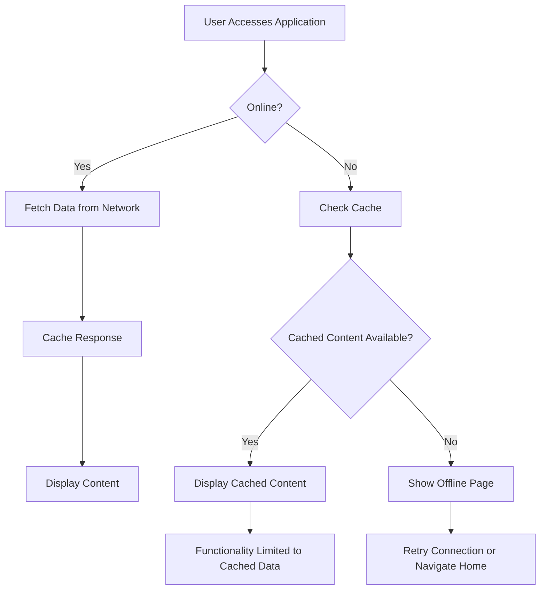
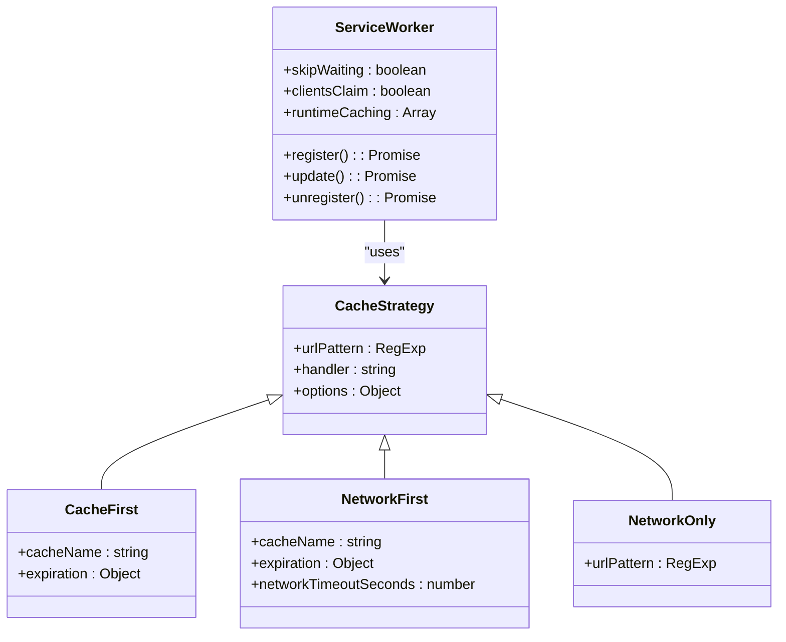
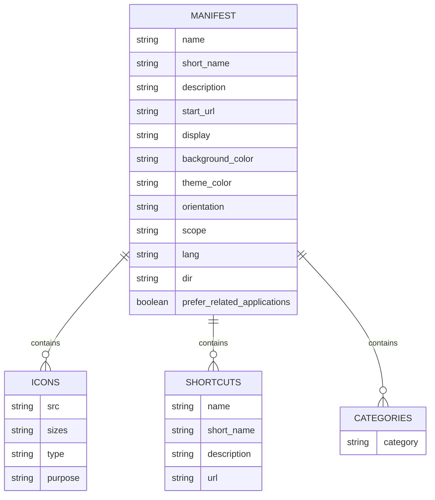
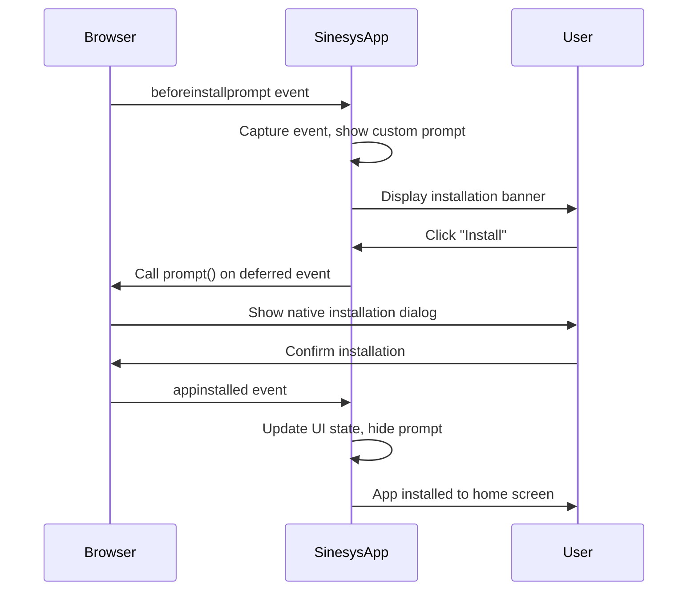
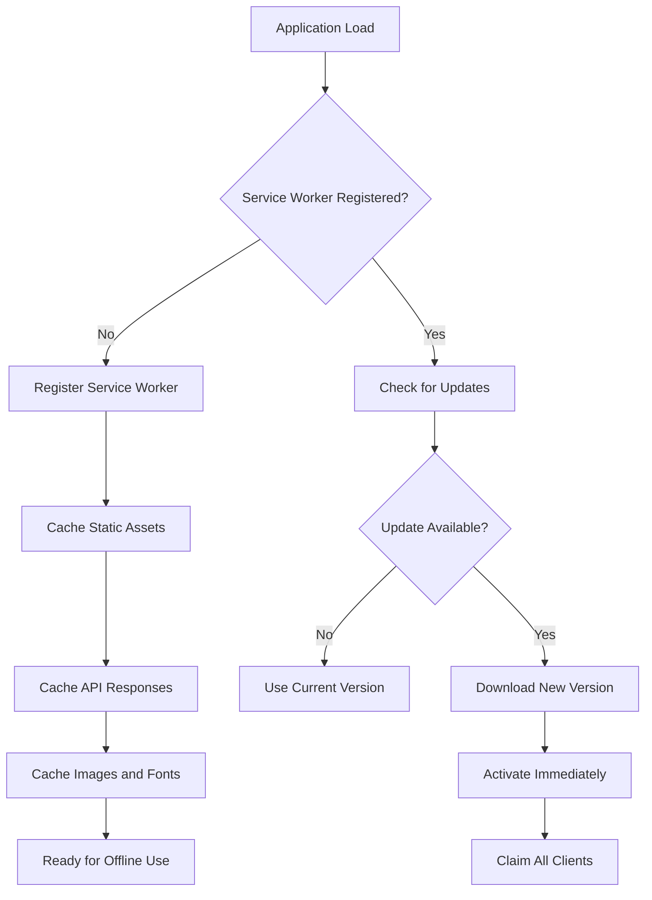
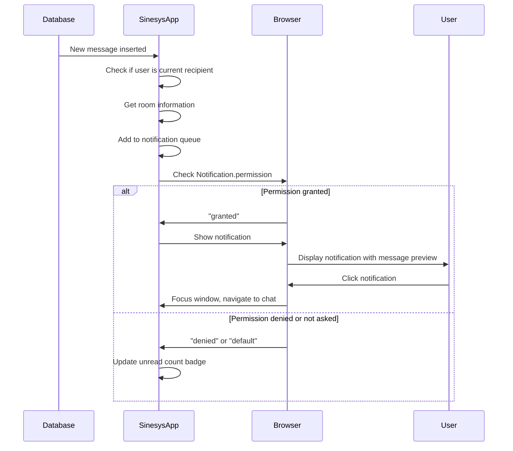

# Progressive Web App

<cite>
**Referenced Files in This Document**   
- [manifest.json](file://public/manifest.json)
- [next.config.ts](file://next.config.ts)
- [pwa-utils.ts](file://lib/pwa-utils.ts)
- [use-pwa-install.ts](file://hooks/use-pwa-install.ts)
- [pwa-install-prompt.tsx](file://components/pwa-install-prompt.tsx)
- [page.tsx](file://app/offline/page.tsx)
- [OfflinePageClient.tsx](file://app/offline/OfflinePageClient.tsx)
- [layout.tsx](file://app/layout.tsx)
- [pwa.d.ts](file://types/pwa.d.ts)
</cite>

## Table of Contents
1. [Introduction](#introduction)
2. [PWA Installation Process](#pwa-installation-process)
3. [Offline Functionality](#offline-functionality)
4. [Service Worker Implementation](#service-worker-implementation)
5. [Web App Manifest Configuration](#web-app-manifest-configuration)
6. [PWA Installation Prompt and User Experience](#pwa-installation-prompt-and-user-experience)
7. [Update Handling and Cache Management](#update-handling-and-cache-management)
8. [Push Notifications Implementation](#push-notifications-implementation)
9. [Performance Considerations](#performance-considerations)
10. [Common Issues and Troubleshooting](#common-issues-and-troubleshooting)
11. [Conclusion](#conclusion)

## Introduction
Sinesys implements Progressive Web App (PWA) features to provide users with an app-like experience directly through the web browser. The PWA capabilities allow users to install the application on their home screen for quick access, work offline with cached content, and receive push notifications. This documentation details the implementation of PWA features in Sinesys, including the installation process, offline functionality, service worker configuration, and manifest settings that define the application's appearance when installed. The PWA implementation leverages modern web technologies to deliver a reliable, fast, and engaging user experience across mobile and desktop devices.

## PWA Installation Process
The PWA installation process in Sinesys enables users to add the application to their home screen on both mobile devices and desktops. When users visit the application with a compatible browser, they receive a prompt to install the app, which transforms the web application into a standalone experience that appears and functions like a native application. The installation process is triggered by the browser when certain criteria are met, including visiting the site on HTTPS (or localhost for development), interacting with the site for at least 30 seconds, and navigating to at least two different pages. Once these conditions are satisfied, the browser displays a native installation prompt that allows users to add the Sinesys application to their device's home screen or applications menu.

The installation process is managed through the Web App Manifest file and service worker registration, with the application meeting all PWA criteria for installability. After installation, the application launches in standalone mode, hiding the browser's address bar and navigation controls to provide a seamless app-like interface. The installation flow is enhanced by a custom installation prompt component that appears when the native browser prompt is not automatically displayed, ensuring users are aware of the option to install the application for an improved experience.

**Section sources**
- [manifest.json](file://public/manifest.json)
- [next.config.ts](file://next.config.ts)
- [use-pwa-install.ts](file://hooks/use-pwa-install.ts)
- [pwa-install-prompt.tsx](file://components/pwa-install-prompt.tsx)
- [layout.tsx](file://app/layout.tsx)

## Offline Functionality
Sinesys provides robust offline functionality through service worker caching strategies, allowing users to access key features even when disconnected from the network. When users lose internet connectivity, the application automatically serves a custom offline page that informs them of the connection status and provides options to retry the connection or navigate to the home page. The offline page is designed with a clean, user-friendly interface that maintains the application's branding and provides clear feedback about the network status.

Beyond the offline indicator, certain application features remain functional in offline mode due to strategic caching of assets and API responses. The service worker caches static assets such as JavaScript bundles, CSS files, images, and fonts, ensuring the application shell loads quickly even without network access. Additionally, API responses are cached using a network-first strategy with a one-hour expiration period, allowing recently accessed data to be available offline. This enables users to view previously loaded content such as dashboard information, process lists, and document details even when disconnected from the internet. The offline capabilities are particularly valuable for legal professionals who may need to access case information in courtrooms or other locations with limited connectivity.

**Diagram sources**
- [next.config.ts](file://next.config.ts)
- [page.tsx](file://app/offline/page.tsx)
- [OfflinePageClient.tsx](file://app/offline/OfflinePageClient.tsx)

**Section sources**
- [next.config.ts](file://next.config.ts)
- [page.tsx](file://app/offline/page.tsx)
- [OfflinePageClient.tsx](file://app/offline/OfflinePageClient.tsx)

## Service Worker Implementation
The service worker implementation in Sinesys is configured through the `@ducanh2912/next-pwa` plugin, which automatically generates and registers a service worker during the build process. The service worker acts as a network proxy between the application and the network, intercepting HTTP requests and applying caching strategies to improve performance and enable offline functionality. The implementation follows best practices for PWA development, with the service worker registered automatically when the application loads, eliminating the need for manual registration code in the application.

The service worker configuration includes multiple caching strategies tailored to different types of resources. Static assets such as JavaScript, CSS, and images are cached using a CacheFirst strategy with appropriate expiration periods, ensuring fast loading on subsequent visits. API requests are handled with a NetworkFirst strategy, which attempts to fetch fresh data from the network but falls back to cached responses when offline, with a one-hour cache expiration to balance freshness and availability. Google Fonts are cached using a dedicated CacheFirst strategy with a one-year expiration period, reducing external dependencies and improving loading performance.

The service worker is configured to activate immediately when updates are available, with the `skipWaiting` and `clientsClaim` options enabled to ensure users always have the latest version of the application. This approach prevents situations where users might be running different versions of the application simultaneously. The service worker also handles navigation requests, serving the offline fallback page when network requests fail, providing a consistent user experience even in poor network conditions.

**Diagram sources**
- [next.config.ts](file://next.config.ts)
- [pwa-utils.ts](file://lib/pwa-utils.ts)

**Section sources**
- [next.config.ts](file://next.config.ts)
- [pwa-utils.ts](file://lib/pwa-utils.ts)

## Web App Manifest Configuration
The Web App Manifest configuration in Sinesys is defined in the `public/manifest.json` file, which specifies how the application appears when installed on a user's device. The manifest file contains essential metadata that enables the browser to treat the web application as a progressive web app, including the application name, icons, theme colors, and display mode. The manifest is referenced in the application's HTML head through the `manifest` metadata tag in the root layout component, ensuring browsers can discover and parse the PWA configuration.

The manifest defines the application name as "Zattar Advogados - Sistema de Gestão Jurídica" with a short name of "Zattar" for display on home screens with limited space. The description provides context about the application's purpose as a legal case management system. The `start_url` is set to the root path, ensuring the application launches to the main dashboard when opened from the home screen. The display mode is configured as "standalone", which presents the application in a full-screen mode without browser UI elements, creating a native app-like experience.

The manifest includes multiple icon sizes for different device resolutions and contexts, with 192x192 and 512x512 PNG images for Android devices and a 180x180 image for Apple devices. The icons are marked with the "any maskable" purpose, allowing operating systems to apply custom masks for different device designs. The background color is set to white (#ffffff) and the theme color to black (#000000), which affects the appearance of the status bar and browser chrome when the app is launched. The manifest also defines shortcuts for quick access to key application sections like Dashboard, Processes, and Hearings, enhancing usability for installed applications.

**Diagram sources**
- [manifest.json](file://public/manifest.json)
- [layout.tsx](file://app/layout.tsx)

**Section sources**
- [manifest.json](file://public/manifest.json)
- [layout.tsx](file://app/layout.tsx)

## PWA Installation Prompt and User Experience
The PWA installation prompt in Sinesys enhances the user experience by providing a custom installation dialog that appears when the native browser installation prompt is not automatically displayed. The installation prompt is implemented as a React component that listens for the `beforeinstallprompt` event, which is fired by the browser when the application meets the criteria for installation. When this event occurs, the application captures the installation prompt and displays a custom banner at the bottom of the screen, giving users clear options to install the application or dismiss the prompt.

The installation prompt component uses the `usePWAInstall` hook to manage the installation state, tracking whether the application is installable, already installed, or if the user has dismissed the prompt. The hook listens for both the `beforeinstallprompt` event, which indicates the installation is possible, and the `appinstalled` event, which confirms successful installation. When users click the install button, the component calls the `prompt()` method on the deferred installation event, triggering the browser's native installation flow. If users choose not to install the application, their preference is stored in localStorage to prevent the prompt from reappearing on subsequent visits.

The user experience is further enhanced by visual feedback and clear messaging. The prompt appears as a non-intrusive banner with an installation icon, a brief message explaining the benefits of installing the application, and two action buttons: "Install" and "Not now". The design follows the application's visual language and is positioned to avoid interfering with primary content. After installation, users experience a seamless transition to the standalone application mode, with the application launching directly from their home screen without the browser interface, providing a native app-like experience.

**Diagram sources**
- [use-pwa-install.ts](file://hooks/use-pwa-install.ts)
- [pwa-install-prompt.tsx](file://components/pwa-install-prompt.tsx)

**Section sources**
- [use-pwa-install.ts](file://hooks/use-pwa-install.ts)
- [pwa-install-prompt.tsx](file://components/pwa-install-prompt.tsx)

## Update Handling and Cache Management
Sinesys implements a comprehensive update handling and cache management system to ensure users always have access to the latest application version while maintaining optimal performance. The service worker is configured to check for updates on every application load, with the `skipWaiting` and `clientsClaim` options enabled to ensure new versions are activated immediately when available. This approach prevents users from running outdated versions of the application and ensures all users are synchronized to the latest features and bug fixes.

Cache management is implemented through Workbox strategies configured in the Next.js PWA plugin, with different caching policies applied to various types of resources based on their update frequency and importance. Static assets such as JavaScript bundles and CSS files are cached with a 24-hour expiration period, balancing the need for fresh content with performance benefits of caching. Images are cached for 30 days with a maximum of 50 entries, preventing excessive storage usage while maintaining quick loading of frequently accessed images. API responses are cached for one hour with a maximum of 100 entries, allowing users to access recent data offline while ensuring data freshness.

The application also provides utility functions for advanced cache management scenarios. The `checkForUpdates` function allows for manual triggering of service worker updates, which can be useful in situations where immediate updates are required. The `unregisterServiceWorker` function enables complete cache clearing and service worker removal, which is valuable for debugging and troubleshooting cache-related issues. These functions are implemented with proper error handling and user feedback to ensure reliable operation.

**Diagram sources**
- [next.config.ts](file://next.config.ts)
- [pwa-utils.ts](file://lib/pwa-utils.ts)

**Section sources**
- [next.config.ts](file://next.config.ts)
- [pwa-utils.ts](file://lib/pwa-utils.ts)

## Push Notifications Implementation
Sinesys implements push notifications through the Web Notifications API, enabling users to receive real-time alerts about important events even when the application is not actively open. The notification system is integrated with the application's chat functionality, providing users with immediate alerts when they receive new messages in chat rooms or are mentioned by other users. This feature enhances collaboration and ensures timely responses to important communications.

The push notification implementation is managed through the `NotificationProvider` component and associated hooks, which handle permission requests, notification display, and state management. When a new message is received from another user, the system first checks if the user has granted notification permissions. If permissions are granted, a browser notification is displayed with the sender's name, a preview of the message content, and the chat room name. The notification includes an icon and is configured to close automatically after five seconds if not interacted with.

Users can manage their notification preferences through the application interface, with options to request permission, enable or disable notifications, and control which types of events trigger alerts. The notification system also maintains an unread count displayed in the application's navigation interface, allowing users to see at a glance how many messages require their attention. This combination of push notifications and in-app indicators ensures users never miss important communications while providing control over their notification experience.

**Diagram sources**
- [use-notifications.tsx](file://hooks/use-notifications.tsx)
- [notification-badge.tsx](file://components/chat/notification-badge.tsx)

**Section sources**
- [use-notifications.tsx](file://hooks/use-notifications.tsx)
- [notification-badge.tsx](file://components/chat/notification-badge.tsx)

## Performance Considerations
Sinesys addresses several key performance considerations in its PWA implementation to ensure optimal loading speed, efficient cache usage, and a smooth user experience. The application leverages Next.js's built-in optimization features, including code splitting, image optimization, and server-side rendering, to minimize the initial load size and improve time-to-interactive metrics. The build process generates optimized static assets with hashed filenames, enabling long-term caching while ensuring cache invalidation when content changes.

Cache storage limits are carefully managed through the service worker configuration, with specific maximum entry counts and expiration periods for different cache types. The images cache is limited to 50 entries with a 30-day expiration, preventing excessive storage usage on user devices while maintaining performance benefits. The API cache is limited to 100 entries with a one-hour expiration, balancing data freshness with offline availability. Static assets are cached with appropriate expiration periods based on their update frequency, with JavaScript bundles cached for 24 hours and Google Fonts cached for one year.

The application also implements lazy loading for non-critical components and routes, ensuring that only the essential code is loaded for the initial page render. This approach reduces the initial payload size and improves loading performance, particularly on slower network connections. The PWA configuration excludes health check endpoints from caching with a NetworkOnly strategy, ensuring these critical monitoring endpoints always return fresh data. These performance optimizations work together to create a fast, reliable user experience that meets the core principles of Progressive Web Apps.

**Section sources**
- [next.config.ts](file://next.config.ts)
- [pwa-utils.ts](file://lib/pwa-utils.ts)

## Common Issues and Troubleshooting
Several common issues may arise with PWA installation and offline functionality in Sinesys, along with corresponding troubleshooting solutions. One frequent issue is the installation prompt not appearing, which typically occurs when the application is not served over HTTPS (except on localhost) or when the user has previously dismissed the prompt. The solution is to ensure the application is accessed via HTTPS and to clear the localStorage flag that remembers the dismissed prompt.

Another common issue is stale content after application updates, which can occur if the service worker is not properly updating. This can be resolved by manually triggering an update check through the developer tools or by using the `checkForUpdates` utility function. In some cases, completely unregistering and re-registering the service worker may be necessary to resolve caching issues.

Offline functionality problems often stem from insufficient caching or network requests that are not properly intercepted by the service worker. Developers can troubleshoot these issues by examining the cache storage in browser developer tools and verifying that the expected resources are being cached according to the defined strategies. The offline fallback page should be tested by simulating network conditions to ensure it displays correctly when connectivity is lost.

For push notifications, common issues include notifications not appearing, which is typically due to denied permissions or browser settings. Users should be guided to check their browser notification settings and ensure permissions are granted. In some cases, browser extensions or operating system settings may block notifications, requiring users to adjust their device settings.

**Section sources**
- [pwa-utils.ts](file://lib/pwa-utils.ts)
- [next.config.ts](file://next.config.ts)
- [use-pwa-install.ts](file://hooks/use-pwa-install.ts)

## Conclusion
Sinesys implements a comprehensive Progressive Web App solution that enhances user experience through installability, offline functionality, and app-like interactions. The PWA features are carefully configured to provide legal professionals with reliable access to case management tools regardless of network conditions. By leveraging the `@ducanh2912/next-pwa` plugin with Next.js, the application achieves optimal performance through strategic caching of assets and API responses, while maintaining data freshness with appropriate cache expiration policies.

The installation process is seamless, with both native browser prompts and a custom installation banner guiding users to add the application to their home screen. Once installed, the application launches in standalone mode, providing a native app-like experience that increases user engagement and productivity. The offline capabilities ensure critical functionality remains available even in courtrooms or other locations with limited connectivity, with a well-designed offline page that maintains the application's usability.

Future enhancements could include more sophisticated offline data synchronization, background sync for submitting changes when connectivity is restored, and improved push notification personalization. The current implementation provides a solid foundation for a reliable, fast, and engaging user experience that meets the needs of legal professionals requiring access to case information anytime, anywhere.