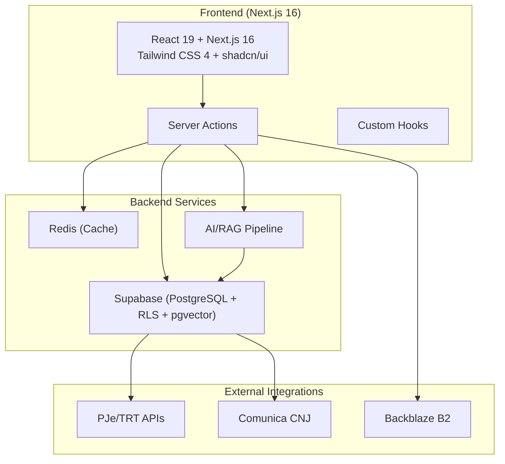
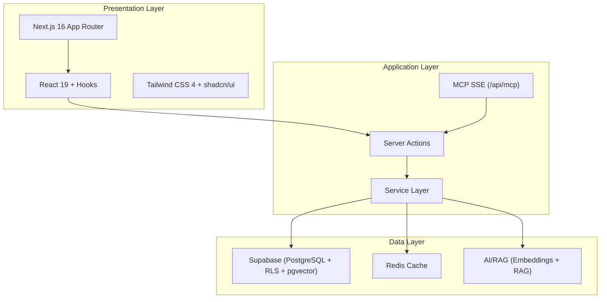
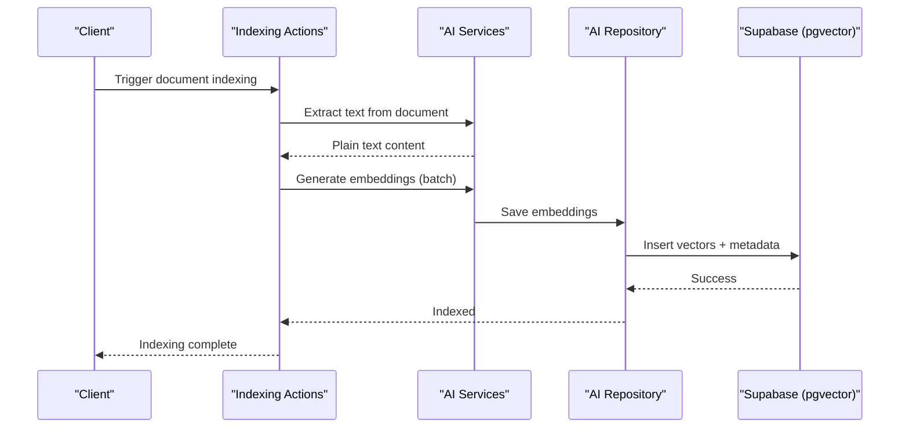
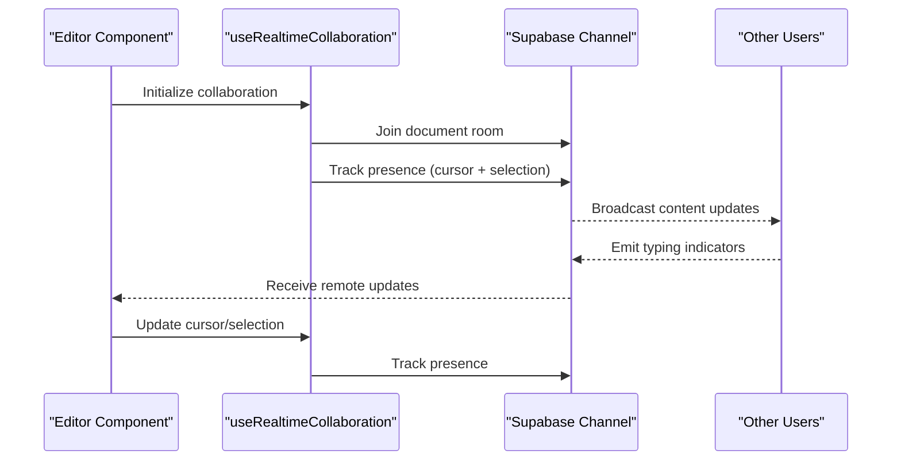
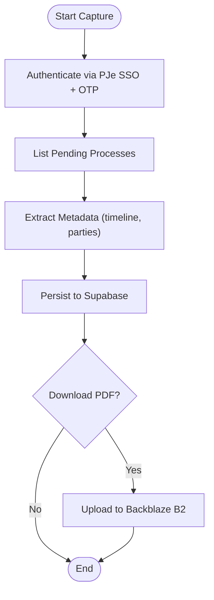
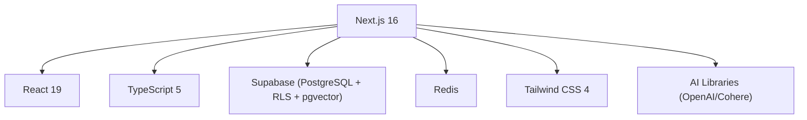

# Project Overview

<cite>
**Referenced Files in This Document**
- [README.md](file://README.md)
- [package.json](file://package.json)
- [next.config.ts](file://next.config.ts)
- [supabase/README.md](file://supabase/README.md)
- [supabase/config.toml](file://supabase/config.toml)
- [docs/architecture/AGENTS.md](file://docs/architecture/AGENTS.md)
- [src/lib/ai/index.ts](file://src/lib/ai/index.ts)
- [src/lib/ai/repository.ts](file://src/lib/ai/repository.ts)
- [src/lib/ai/services/extraction.service.ts](file://src/lib/ai/services/extraction.service.ts)
- [src/hooks/use-realtime-collaboration.ts](file://src/hooks/use-realtime-collaboration.ts)
- [src/app/(authenticated)/acervo/service.ts](file://src/app/(authenticated)/acervo/service.ts)
- [src/app/(authenticated)/processos/actions/indexing-actions.ts](file://src/app/(authenticated)/processos/actions/indexing-actions.ts)
- [src/app/(authenticated)/expedientes/actions/expediente-actions.ts](file://src/app/(authenticated)/expedientes/actions/expediente-actions.ts)
- [.agents/skills/realtime-websocket/SKILL.md](file://.agents/skills/realtime-websocket/SKILL.md)
- [.claude/skills/realtime-websocket/SKILL.md](file://.claude/skills/realtime-websocket/SKILL.md)
- [src/lib/constants/comunica-cnj-tribunais.ts](file://src/lib/constants/comunica-cnj-tribunais.ts)
</cite>

## Table of Contents
1. [Introduction](#introduction)
2. [Project Structure](#project-structure)
3. [Core Components](#core-components)
4. [Architecture Overview](#architecture-overview)
5. [Detailed Component Analysis](#detailed-component-analysis)
6. [Dependency Analysis](#dependency-analysis)
7. [Performance Considerations](#performance-considerations)
8. [Troubleshooting Guide](#troubleshooting-guide)
9. [Conclusion](#conclusion)

## Introduction
ZattarOS is an AI-enhanced legal case management platform designed specifically for Brazilian labor courts (TRTs, TST, STJ, STF). The system streamlines legal workflow automation by integrating automated data capture from court systems, intelligent document processing, semantic search, real-time collaboration, and unified process tracking. It leverages modern full-stack technologies including Next.js 16, React 19, TypeScript 5, Supabase (PostgreSQL + RLS + pgvector), Redis, Tailwind CSS 4, and advanced AI capabilities for embedding generation, retrieval-augmented generation (RAG), and AI-powered document summarization.

The platform targets legal professionals who need to manage complex litigation processes efficiently, reduce manual administrative tasks, and gain actionable insights from case-related documents and timelines. It provides both conceptual benefits for stakeholders (automation, improved collaboration, unified tracking) and robust technical foundations for developers (modular architecture, AI/RAG pipeline, real-time features).

## Project Structure
The project follows a colocated Feature-Sliced Design (FSD) approach, organizing features around routes under src/app/(authenticated). Each feature module encapsulates its own actions, components, domain logic, services, and repositories, promoting maintainability and scalability. The architecture emphasizes strict barrel exports and discourages deep imports to preserve module boundaries.

**Diagram sources**
- [README.md:43-68](file://README.md#L43-L68)
- [package.json:135-324](file://package.json#L135-L324)
- [next.config.ts:17-36](file://next.config.ts#L17-L36)

**Section sources**
- [README.md:43-68](file://README.md#L43-L68)
- [next.config.ts:17-36](file://next.config.ts#L17-L36)

## Core Components
This section outlines the primary building blocks that define ZattarOS’s legal management capabilities:

- Legal Case Management (Processos): Full lifecycle management of labor court cases, including automated data capture from PJe/TRT systems, timeline enrichment, and unified process tracking.
- Parties and Contacts (Partes): Client, opposing party, representative, and third-party management with CPF/CNPJ validation.
- Contracts and Financials (Contratos/Financeiro): Contract lifecycle management, digital signatures, compliance with MP 2.200-2/2001, and financial dashboards with bank reconciliation.
- Documents and Collaboration (Documentos): Real-time collaborative editing using Plate + Yjs, AI-powered editing via Vercel AI SDK, and document versioning.
- Automated Data Capture (Captura): Multi-driver integration with PJe/TRT and Comunica CNJ to extract process data, hearings, and parties.
- Digital Signature (Assinatura Digital): Legal compliance with MP 2.200-2/2001, template management, and dynamic form builders.
- AI/RAG Engine: Embedding generation (OpenAI/Cohere), pgvector storage, semantic search, and RAG-powered document understanding.
- MCP (Model Context Protocol): Exposes Server Actions as AI tools via SSE endpoint at /api/mcp for agent-driven automation.

**Section sources**
- [docs/architecture/AGENTS.md:234-289](file://docs/architecture/AGENTS.md#L234-L289)
- [README.md:5-8](file://README.md#L5-L8)

## Architecture Overview
ZattarOS employs a layered architecture with clear separation between UI, server actions, service layer, repository, and infrastructure. The system integrates tightly with Supabase for data persistence and real-time features, while leveraging Redis for caching and AI services for semantic indexing and retrieval.

**Diagram sources**
- [docs/architecture/AGENTS.md:122-156](file://docs/architecture/AGENTS.md#L122-L156)
- [next.config.ts:79-260](file://next.config.ts#L79-L260)

**Section sources**
- [docs/architecture/AGENTS.md:122-156](file://docs/architecture/AGENTS.md#L122-L156)
- [next.config.ts:79-260](file://next.config.ts#L79-L260)

## Detailed Component Analysis

### AI/RAG Pipeline
The AI/RAG subsystem provides semantic search and document understanding capabilities powered by embeddings and pgvector. It supports document extraction, chunking, embedding generation, and hybrid retrieval strategies.

**Diagram sources**
- [src/app/(authenticated)/processos/actions/indexing-actions.ts:71-112](file://src/app/(authenticated)/processos/actions/indexing-actions.ts#L71-L112)
- [src/lib/ai/repository.ts:1-41](file://src/lib/ai/repository.ts#L1-L41)
- [src/lib/ai/services/extraction.service.ts:92-132](file://src/lib/ai/services/extraction.service.ts#L92-L132)

**Section sources**
- [src/lib/ai/index.ts:1-76](file://src/lib/ai/index.ts#L1-L76)
- [src/lib/ai/repository.ts:1-41](file://src/lib/ai/repository.ts#L1-L41)
- [src/lib/ai/services/extraction.service.ts:1-175](file://src/lib/ai/services/extraction.service.ts#L1-L175)

### Real-time Collaboration
Real-time collaboration is enabled through Supabase Realtime channels, allowing multiple users to edit documents concurrently with cursor tracking, presence awareness, and broadcast updates.

**Diagram sources**
- [src/hooks/use-realtime-collaboration.ts:1-242](file://src/hooks/use-realtime-collaboration.ts#L1-L242)

**Section sources**
- [src/hooks/use-realtime-collaboration.ts:1-242](file://src/hooks/use-realtime-collaboration.ts#L1-L242)
- [.agents/skills/realtime-websocket/SKILL.md:312-515](file://.agents/skills/realtime-websocket/SKILL.md#L312-L515)
- [.claude/skills/realtime-websocket/SKILL.md:312-515](file://.claude/skills/realtime-websocket/SKILL.md#L312-L515)

### Automated Data Capture (PJe/TRT)
The system automates data capture from PJe/TRT systems, enriching process timelines and persisting structured data with optional document downloads to Backblaze B2.

**Diagram sources**
- [src/app/(authenticated)/acervo/service.ts:330-379](file://src/app/(authenticated)/acervo/service.ts#L330-L379)

**Section sources**
- [src/app/(authenticated)/acervo/service.ts:330-379](file://src/app/(authenticated)/acervo/service.ts#L330-L379)

### Practical Examples of Workflow Automation
- Automated Hearing Assignment: The system automatically assigns responsibility for upcoming hearings based on jurisdiction and case type, reducing administrative overhead.
- AI-Powered Document Indexing: When a new expediente is created, the system automatically extracts text from uploaded documents, generates embeddings, and indexes them for semantic search.
- Unified Legal Process Tracking: By integrating with PJe/TRT and Comunica CNJ, the platform consolidates case timelines, parties, and documents into a single view, enabling seamless oversight across multiple tribunals.

**Section sources**
- [src/app/(authenticated)/expedientes/actions/expediente-actions.ts:170-212](file://src/app/(authenticated)/expedientes/actions/expediente-actions.ts#L170-L212)
- [src/lib/constants/comunica-cnj-tribunais.ts:1-6](file://src/lib/constants/comunica-cnj-tribunais.ts#L1-L6)

## Dependency Analysis
The technology stack combines modern frontend frameworks with robust backend services and AI capabilities. Key dependencies include Next.js 16 for the application framework, Supabase for database and real-time features, Redis for caching, and AI libraries for embedding generation and semantic search.

**Diagram sources**
- [README.md:5-8](file://README.md#L5-L8)
- [package.json:135-324](file://package.json#L135-L324)

**Section sources**
- [README.md:5-8](file://README.md#L5-L8)
- [package.json:135-324](file://package.json#L135-L324)

## Performance Considerations
- Build Optimization: Next.js 16 with Turbopack and selective package imports improve build performance and bundle sizes. The configuration limits CPU workers in containerized environments to prevent memory exhaustion.
- AI Batch Processing: Embedding insertion uses batched writes to avoid oversized payloads and improve throughput.
- Real-time Scalability: Supabase Realtime channels scale horizontally; presence tracking and broadcast updates are optimized for concurrent editors.
- Caching Strategy: Redis is used for caching frequently accessed data, reducing database load and improving response times.

[No sources needed since this section provides general guidance]

## Troubleshooting Guide
- Authentication Failures: Verify Supabase configuration and environment variables for PJe authentication. Check allowed origins and JWT settings in Supabase config.
- AI Indexing Issues: Ensure ENABLE_AI_INDEXING is set appropriately and that embedding models are configured. Confirm pgvector extension is enabled and RPC functions are available.
- Real-time Collaboration Problems: Validate Supabase Realtime connectivity and channel subscriptions. Check presence tracking and broadcast events.
- Database Migration: Use Supabase CLI commands to pull and push schema changes. Follow the migration checklist and verify RLS policies and indexes.

**Section sources**
- [supabase/config.toml:146-170](file://supabase/config.toml#L146-L170)
- [supabase/README.md:262-277](file://supabase/README.md#L262-L277)

## Conclusion
ZattarOS delivers a comprehensive, AI-enhanced legal case management solution tailored for Brazilian labor courts. Its architecture balances developer productivity with enterprise-grade features, including automated data capture, intelligent document processing, real-time collaboration, and unified legal process tracking. The platform’s modular design, strong AI/RAG pipeline, and real-time capabilities position it as a powerful tool for legal teams seeking to automate workflows and gain deeper insights from case-related information.