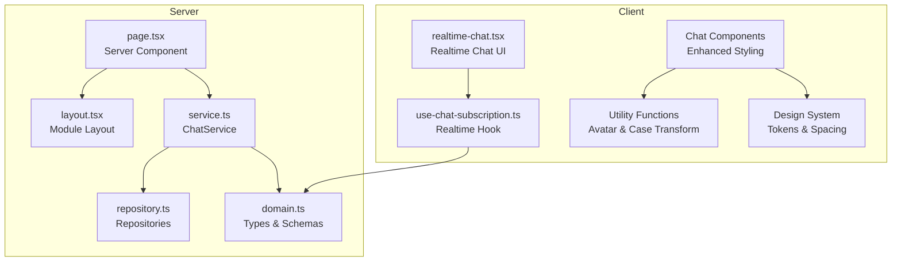
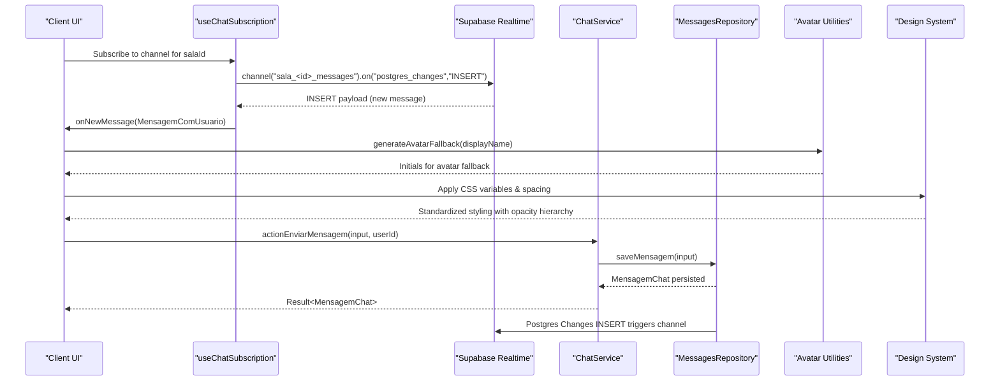
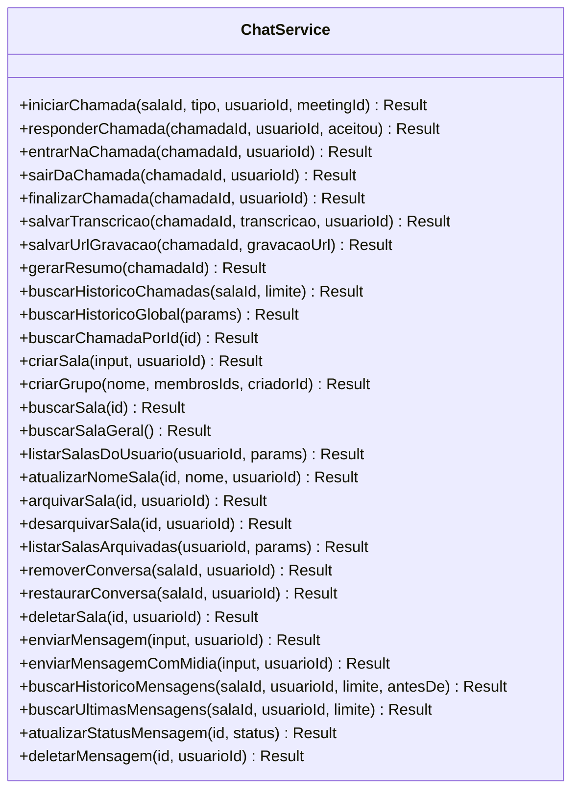
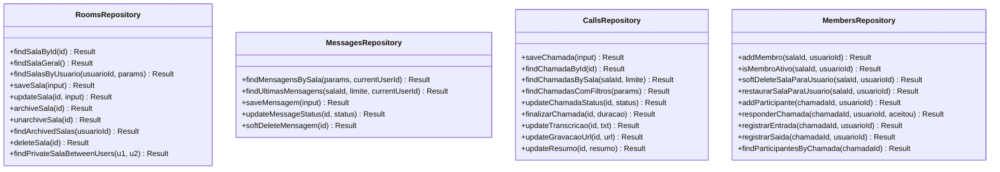
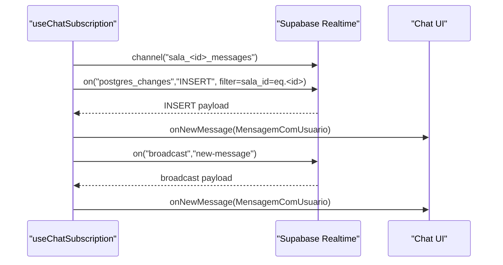
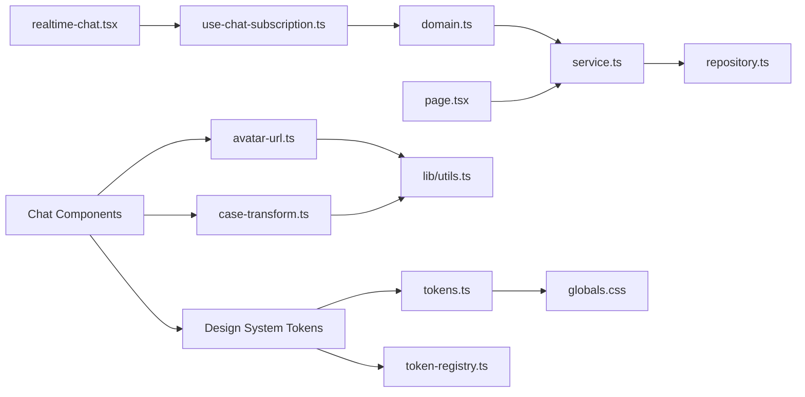

# Chat System

<cite>
**Referenced Files in This Document**
- [service.ts](file://src/app/(authenticated)/chat/service.ts)
- [repository.ts](file://src/app/(authenticated)/chat/repository.ts)
- [domain.ts](file://src/app/(authenticated)/chat/domain.ts)
- [page.tsx](file://src/app/(authenticated)/chat/page.tsx)
- [layout.tsx](file://src/app/(authenticated)/chat/layout.tsx)
- [index.ts](file://src/app/(authenticated)/chat/index.ts)
- [use-chat-subscription.ts](file://src/app/(authenticated)/chat/hooks/use-chat-subscription.ts)
- [realtime-chat.tsx](file://src/components/realtime/realtime-chat.tsx)
- [utils.ts](file://src/app/(authenticated)/chat/utils.ts)
- [avatar-url.ts](file://src/lib/avatar-url.ts)
- [case-transform.ts](file://src/lib/case-transform.ts)
- [chat-list-item.tsx](file://src/app/(authenticated)/chat/components/chat-list-item.tsx)
- [message-group.tsx](file://src/app/(authenticated)/chat/components/message-group.tsx)
- [chat-detail-panel.tsx](file://src/app/(authenticated)/chat/components/chat-detail-panel.tsx)
- [chat-bubbles.tsx](file://src/app/(authenticated)/chat/components/chat-bubbles.tsx)
- [chat-sidebar.tsx](file://src/app/(authenticated)/chat/components/chat-sidebar.tsx)
- [chat-content.tsx](file://src/app/(authenticated)/chat/components/chat-content.tsx)
- [chat-footer.tsx](file://src/app/(authenticated)/chat/components/chat-footer.tsx)
- [custom-audio-grid.tsx](file://src/app/(authenticated)/chat/components/custom-audio-grid.tsx)
- [tokens.ts](file://src/lib/design-system/tokens.ts)
- [token-registry.ts](file://src/lib/design-system/token-registry.ts)
- [globals.css](file://src/app/globals.css)
</cite>

## Update Summary
**Changes Made**
- Updated styling documentation to reflect comprehensive chat bubble improvements including standardized spacing values, CSS variable usage for colors, refined opacity values for visual hierarchy, and enhanced accessibility with improved touch targets for audio player buttons
- Added detailed analysis of chat bubble component styling improvements and design system integration
- Enhanced documentation of design system tokens and their application in chat components

## Table of Contents
1. [Introduction](#introduction)
2. [Project Structure](#project-structure)
3. [Core Components](#core-components)
4. [Architecture Overview](#architecture-overview)
5. [Detailed Component Analysis](#detailed-component-analysis)
6. [Design System Integration](#design-system-integration)
7. [Utility Functions](#utility-functions)
8. [Dependency Analysis](#dependency-analysis)
9. [Performance Considerations](#performance-considerations)
10. [Troubleshooting Guide](#troubleshooting-guide)
11. [Conclusion](#conclusion)

## Introduction
This document describes the Chat System component, focusing on room management, message handling, and user interactions. It explains the implementation of chat rooms, message persistence, and real-time message delivery. It also documents the component structure, server actions, message validation schemas, pagination handling, practical examples, security and permissions, and integration with Supabase real-time subscriptions and WebSocket connections.

**Updated** The chat system now features comprehensive styling improvements with standardized spacing values, CSS variable usage for colors, refined opacity values for visual hierarchy, and enhanced accessibility with improved touch targets for audio player buttons. These improvements are integrated throughout the chat bubble components and follow the established design system architecture.

## Project Structure
The chat feature is organized under the authenticated route group with a clear separation of concerns:
- Domain: Type definitions, enums, and validation schemas
- Service: Business logic and orchestration
- Repository: Data access and persistence
- Hooks: Real-time subscriptions and client-side utilities
- Components: UI building blocks (exported via public API)
- Utilities: Avatar generation and case transformation helpers
- Design System: Token-based styling and spacing standards
- Pages: Server-side rendering and initial hydration



**Diagram sources**
- [page.tsx:1-83](file://src/app/(authenticated)/chat/page.tsx#L1-L83)
- [layout.tsx:1-4](file://src/app/(authenticated)/chat/layout.tsx#L1-L4)
- [service.ts:1-749](file://src/app/(authenticated)/chat/service.ts#L1-L749)
- [repository.ts:1-800](file://src/app/(authenticated)/chat/repository.ts#L1-L800)
- [domain.ts:1-519](file://src/app/(authenticated)/chat/domain.ts#L1-L519)
- [use-chat-subscription.ts:1-252](file://src/app/(authenticated)/chat/hooks/use-chat-subscription.ts#L1-L252)
- [realtime-chat.tsx:1-70](file://src/components/realtime/realtime-chat.tsx#L1-L70)
- [avatar-url.ts:1-24](file://src/lib/avatar-url.ts#L1-L24)
- [case-transform.ts:1-33](file://src/lib/case-transform.ts#L1-L33)
- [tokens.ts:297-496](file://src/lib/design-system/tokens.ts#L297-L496)
- [token-registry.ts:234-433](file://src/lib/design-system/token-registry.ts#L234-L433)

**Section sources**
- [page.tsx:1-83](file://src/app/(authenticated)/chat/page.tsx#L1-L83)
- [layout.tsx:1-4](file://src/app/(authenticated)/chat/layout.tsx#L1-L4)
- [index.ts:1-116](file://src/app/(authenticated)/chat/index.ts#L1-L116)

## Core Components
- ChatService: Orchestrates chat operations (rooms, messages, calls), applies validation, and coordinates repositories
- RoomsRepository, MessagesRepository, CallsRepository, MembersRepository: Data access layer for persistence
- useChatSubscription: Real-time subscription hook using Supabase Realtime
- Domain types and Zod schemas: Strongly typed models and validation for inputs
- Server Actions: Exposed via public API for client invocation
- Avatar utilities: generateAvatarFallback and resolveAvatarUrl for consistent user representation
- Case transformation utilities: camelToSnakeKey, fromSnakeToCamel, fromCamelToSnake for data format conversion
- **Updated** Enhanced chat bubble components with standardized spacing, CSS variables, and improved accessibility

Key responsibilities:
- Room management: create, archive, unarchive, soft-delete, and list rooms
- Message handling: send, paginate, and mark status
- Real-time delivery: subscribe to inserts and broadcasts
- Call management: initiate, respond, enter/exit, finalize, and summarize calls
- Avatar management: generate consistent fallback avatars and resolve avatar URLs
- Data transformation: convert between camelCase and snake_case formats
- **Updated** Styling: standardized spacing values, CSS variable usage, refined opacity hierarchy, enhanced accessibility

**Section sources**
- [service.ts:45-749](file://src/app/(authenticated)/chat/service.ts#L45-L749)
- [repository.ts:143-800](file://src/app/(authenticated)/chat/repository.ts#L143-L800)
- [domain.ts:165-210](file://src/app/(authenticated)/chat/domain.ts#L165-L210)
- [index.ts:68-104](file://src/app/(authenticated)/chat/index.ts#L68-L104)
- [avatar-url.ts:1-24](file://src/lib/avatar-url.ts#L1-L24)
- [case-transform.ts:1-33](file://src/lib/case-transform.ts#L1-L33)

## Architecture Overview
The system follows a layered architecture:
- Presentation: Next.js Server Component renders the chat shell and hydrates with initial data
- Application: ChatService encapsulates business rules and orchestrates repositories
- Persistence: Supabase ORM queries with RLS policies
- Real-time: Supabase Realtime channels for live updates
- Utilities: Dedicated helper functions for avatar generation and data transformation
- **Updated** Design System: Token-based styling with standardized spacing and color variables



**Diagram sources**
- [use-chat-subscription.ts:181-221](file://src/app/(authenticated)/chat/hooks/use-chat-subscription.ts#L181-L221)
- [service.ts:632-667](file://src/app/(authenticated)/chat/service.ts#L632-L667)
- [repository.ts:631-662](file://src/app/(authenticated)/chat/repository.ts#L631-L662)
- [avatar-url.ts:1-11](file://src/lib/avatar-url.ts#L1-L11)

## Detailed Component Analysis

### ChatService: Business Orchestration
Responsibilities:
- Room lifecycle: create, update, archive/unarchive, soft-delete, list with pagination
- Message lifecycle: send, paginate history, update status, soft-delete
- Call lifecycle: initiate, respond, enter/exit, finalize, summarize, manage transcription/recording
- Authorization checks: enforce ownership and membership rules

Validation:
- Uses Zod schemas for inputs (e.g., criarMensagemChatSchema, criarSalaChatSchema)
- Returns typed errors via Result monad

Concurrency and context:
- Single Supabase client shared across repositories for consistent auth context



**Diagram sources**
- [service.ts:45-749](file://src/app/(authenticated)/chat/service.ts#L45-L749)

**Section sources**
- [service.ts:45-749](file://src/app/(authenticated)/chat/service.ts#L45-L749)

### Repositories: Data Access Layer
- RoomsRepository: CRUD for rooms, membership-aware listing, archive/unarchive, soft-delete
- MessagesRepository: paginated message retrieval, latest messages, status updates, soft-delete
- CallsRepository: call lifecycle, participant tracking, transcription/recording, summaries
- MembersRepository: membership management, participant enrollment, presence tracking



**Diagram sources**
- [repository.ts:143-800](file://src/app/(authenticated)/chat/repository.ts#L143-L800)

**Section sources**
- [repository.ts:143-800](file://src/app/(authenticated)/chat/repository.ts#L143-L800)

### Real-time Subscription Hook
The hook subscribes to:
- Postgres INSERT events on the messages table filtered by sala_id
- Broadcast events named "new-message" for fallback scenarios

It exposes:
- isConnected state
- broadcastNewMessage(payload) to emit fallback events



**Diagram sources**
- [use-chat-subscription.ts:181-221](file://src/app/(authenticated)/chat/hooks/use-chat-subscription.ts#L181-L221)

**Section sources**
- [use-chat-subscription.ts:1-252](file://src/app/(authenticated)/chat/hooks/use-chat-subscription.ts#L1-L252)

### Domain Types and Validation
Core types:
- SalaChat, MensagemChat, MensagemComUsuario, UsuarioChat, ChatItem
- Enums: TipoSalaChat, TipoMensagemChat, TipoChamada, StatusChamada
- Validation schemas: criarSalaChatSchema, criarMensagemChatSchema, criarChamadaSchema, responderChamadaSchema

Pagination:
- PaginatedResponse<T> with currentPage, pageSize, totalCount, totalPages
- ListarMensagensParams and ListarSalasParams support limits and offsets

**Section sources**
- [domain.ts:165-261](file://src/app/(authenticated)/chat/domain.ts#L165-L261)
- [domain.ts:286-441](file://src/app/(authenticated)/chat/domain.ts#L286-L441)

### Server Actions and Public API
The public API re-exports:
- Types and schemas
- Components (ChatLayout, ChatWindow, ChatSidebarWrapper, ChatSidebar)
- Hooks (useChatSubscription, useTypingIndicator, useChatStore)
- Server Actions (e.g., actionEnviarMensagem, actionCriarSala, actionListarSalas)

These actions are intended to be imported directly in server components/actions.

**Section sources**
- [index.ts:21-116](file://src/app/(authenticated)/chat/index.ts#L21-L116)

### Practical Examples

#### Example: Chat Room Creation
- Use actionCriarSala or ChatService.criarSala with a validated input conforming to criarSalaChatSchema
- For private chats, the service ensures uniqueness between two users and adds both as members

**Section sources**
- [service.ts:372-431](file://src/app/(authenticated)/chat/service.ts#L372-L431)
- [domain.ts:165-189](file://src/app/(authenticated)/chat/domain.ts#L165-L189)

#### Example: Sending a Message
- Use actionEnviarMensagem or ChatService.enviarMensagem with a validated input conforming to criarMensagemChatSchema
- The repository persists the message; Supabase Realtime emits an INSERT event that the client receives via useChatSubscription

**Section sources**
- [service.ts:632-667](file://src/app/(authenticated)/chat/service.ts#L632-L667)
- [repository.ts:631-662](file://src/app/(authenticated)/chat/repository.ts#L631-L662)
- [domain.ts:194-209](file://src/app/(authenticated)/chat/domain.ts#L194-L209)

#### Example: Retrieving Message History
- Use actionBuscarHistorico or ChatService.buscarHistoricoMensagens with ListarMensagensParams
- The repository returns a PaginatedResponse<MensagemComUsuario>

**Section sources**
- [service.ts:683-694](file://src/app/(authenticated)/chat/service.ts#L683-L694)
- [repository.ts:534-584](file://src/app/(authenticated)/chat/repository.ts#L534-L584)

### Security, Permissions, and Moderation
- Real-time security: The subscription setup logs potential causes for channel errors (RLS blocking, missing publication, or Realtime disabled)
- Ownership and membership: Several operations enforce ownership (e.g., only creator can hard-delete a room) or require active membership (e.g., initiating calls)
- Soft deletion: Removing a conversation hides it for the user while preserving data for others
- Moderation note: There is no explicit moderation API in the reviewed code; moderation features would require additional repository methods and UI components

**Section sources**
- [use-chat-subscription.ts:209-212](file://src/app/(authenticated)/chat/hooks/use-chat-subscription.ts#L209-L212)
- [service.ts:578-591](file://src/app/(authenticated)/chat/service.ts#L578-L591)
- [service.ts:617-622](file://src/app/(authenticated)/chat/service.ts#L617-L622)

### Integration with Supabase Realtime and WebSocket Connections
- Postgres Changes: Subscribes to INSERT events on mensagens_chat filtered by sala_id
- Broadcast fallback: Supports "new-message" broadcast events for scenarios where Postgres Changes might fail
- Automatic reconnection: Supabase Realtime handles exponential backoff and rejoin after network interruptions
- Channel states: SUBSCRIBED, TIMED_OUT, CLOSED, CHANNEL_ERROR are handled explicitly

**Section sources**
- [use-chat-subscription.ts:181-252](file://src/app/(authenticated)/chat/hooks/use-chat-subscription.ts#L181-L252)

## Design System Integration

### Enhanced Chat Bubble Styling
The chat bubble components have received comprehensive styling improvements:

#### Standardized Spacing Values
- **Updated** All chat bubbles now use standardized spacing values from the design system:
  - `px-4 py-2` for text bubbles (16px horizontal padding, 8px vertical padding)
  - `p-3 pr-4` for file bubbles (12px padding with right padding optimized)
  - `px-4 py-2 flex items-center gap-2.5` for audio bubbles (16px horizontal, 8px vertical, 10px gap)
  - `p-2` for image/video bubbles (8px padding around media content)

#### CSS Variable Usage for Colors
- **Updated** Chat bubbles now use CSS variables for consistent theming:
  - `bg-chat-bubble-received` for received messages (white in light mode, dark gray in dark mode)
  - `bg-primary` for sent messages (Zattar Purple brand color)
  - `text-white` for sent message text (high contrast)
  - `shadow-lg shadow-primary/20` for sent message shadows

#### Refined Opacity Values for Visual Hierarchy
- **Updated** Improved opacity hierarchy for better visual clarity:
  - `text-muted-foreground/55` for timestamps (35% opacity)
  - `text-muted-foreground/65` for file sizes and metadata (40% opacity)
  - `bg-foreground/3` for file bubble borders (18% opacity)
  - `opacity-60` for audio duration labels (60% opacity)
  - `bg-primary/8` for sent file bubbles (50% opacity)

#### Enhanced Accessibility Features
- **Updated** Improved touch targets for audio player buttons:
  - `size-8` for play/pause buttons (12px minimum touch target)
  - `rounded-full` for circular touch targets
  - `active:scale-95` for visual feedback on interaction
  - Proper focus states with `focus-visible:outline-none focus-visible:ring-2 focus-visible:ring-primary/20`

#### Corner Radius Standardization
- **Updated** Consistent corner radius styling:
  - `rounded-[0.875rem]` for top corners (14px)
  - `rounded-[0.25rem_0.875rem_0.875rem_0.875rem]` for asymmetric corners
  - `rounded-xl` for image/video media containers (16px)

```mermaid
graph TB
subgraph "Chat Bubble Styling"
TextBubble["Text Bubble<br/>px-4 py-2<br/>bg-chat-bubble-received<br/>text-muted-foreground/55"]
FileBubble["File Bubble<br/>p-3 pr-4<br/>gap-3<br/>bg-foreground/3<br/>text-muted-foreground/65"]
AudioBubble["Audio Bubble<br/>px-4 py-2 flex<br/>size-8 rounded-full<br/>opacity-60"]
ImageBubble["Image Bubble<br/>p-2 rounded-xl<br/>max-w-70<br/>shadow-none"]
VideoBubble["Video Bubble<br/>rounded-xl overflow-hidden<br/>max-h-75"]
End
```

**Diagram sources**
- [chat-bubbles.tsx:114-126](file://src/app/(authenticated)/chat/components/chat-bubbles.tsx#L114-L126)
- [chat-bubbles.tsx:151-159](file://src/app/(authenticated)/chat/components/chat-bubbles.tsx#L151-L159)
- [chat-bubbles.tsx:271-277](file://src/app/(authenticated)/chat/components/chat-bubbles.tsx#L271-L277)
- [chat-bubbles.tsx:347-353](file://src/app/(authenticated)/chat/components/chat-bubbles.tsx#L347-L353)
- [chat-bubbles.tsx:390-394](file://src/app/(authenticated)/chat/components/chat-bubbles.tsx#L390-L394)

**Section sources**
- [chat-bubbles.tsx:114-126](file://src/app/(authenticated)/chat/components/chat-bubbles.tsx#L114-L126)
- [chat-bubbles.tsx:151-159](file://src/app/(authenticated)/chat/components/chat-bubbles.tsx#L151-L159)
- [chat-bubbles.tsx:271-277](file://src/app/(authenticated)/chat/components/chat-bubbles.tsx#L271-L277)
- [chat-bubbles.tsx:347-353](file://src/app/(authenticated)/chat/components/chat-bubbles.tsx#L347-L353)
- [chat-bubbles.tsx:390-394](file://src/app/(authenticated)/chat/components/chat-bubbles.tsx#L390-L394)

### Design System Tokens and Variables
The chat system leverages a comprehensive design system with token-based theming:

#### Chat-Specific Tokens
- `--chat-thread-bg`: Background color for chat thread area
- `--chat-bubble-received`: Color for received message bubbles
- `--chat-bubble-sent`: Color for sent message bubbles
- `--chat-sidebar-active`: Active state color for chat sidebar

#### Spacing System
- **Updated** Grid-based spacing system using 4px increments:
  - `0.5rem` (2px), `1rem` (4px), `1.5rem` (6px), `2rem` (8px)
  - `2.5rem` (10px), `3rem` (12px), `3.5rem` (14px), `4rem` (16px)
  - Consistent spacing across all chat components

#### Color Token Integration
- **Updated** Chat bubbles use semantic color tokens instead of hardcoded colors
- Light mode: `--chat-bubble-received: oklch(1 0 0)` (white), `--chat-bubble-sent: var(--primary)` (Zattar Purple)
- Dark mode: `--chat-bubble-received: oklch(0.26 0.005 281)` (dark gray), `--chat-bubble-sent: var(--primary)` (Zattar Purple)
- Thread background uses `--chat-thread-bg` for consistent theming

**Section sources**
- [tokens.ts:297-351](file://src/lib/design-system/tokens.ts#L297-L351)
- [token-registry.ts:234-239](file://src/lib/design-system/token-registry.ts#L234-L239)
- [globals.css:464-467](file://src/app/globals.css#L464-L467)

## Component Analysis with Enhanced Styling

### Chat Bubbles: Comprehensive Styling Improvements
The chat bubble components have undergone extensive styling enhancements:

#### Text Chat Bubbles
- **Updated** Standardized padding: `px-4 py-2` for consistent bubble sizing
- **Updated** Corner radius: `rounded-[0.875rem]` for modern, rounded appearance
- **Updated** Border styling: `border border-border/30 dark:border-white/5` for subtle borders
- **Updated** Shadow effects: `shadow-[0_1px_3px_rgba(0,0,0,0.03)] dark:shadow-none` for depth
- **Updated** Status indicators: Proper alignment with `justify-end` for sent messages

#### File Chat Bubbles
- **Updated** Flexible layout: `flex items-center gap-3 p-3 pr-4 min-w-60` for optimal file display
- **Updated** Icon styling: `size-9 rounded-lg` with proper sizing and rounding
- **Updated** Download button: `size-7 rounded-md flex items-center justify-center` with accessible touch targets
- **Updated** Hover states: `hover:bg-foreground/8 hover:text-foreground` for interactive feedback

#### Audio Chat Bubbles
- **Updated** Enhanced accessibility: `size-8 rounded-full` for larger touch targets
- **Updated** Visual feedback: `active:scale-95` for responsive interaction
- **Updated** Progress visualization: Dynamic waveform bars with `opacity-60` for progress indication
- **Updated** Duration display: `text-[0.625rem] tabular-nums opacity-60` for consistent typography

#### Image and Video Chat Bubbles
- **Updated** Media containers: `rounded-xl overflow-hidden` for consistent media presentation
- **Updated** Max dimensions: `max-w-70` and `max-h-75` for responsive media sizing
- **Updated** Shadow handling: `shadow-none` for media content to maintain visual consistency

**Section sources**
- [chat-bubbles.tsx:83-131](file://src/app/(authenticated)/chat/components/chat-bubbles.tsx#L83-L131)
- [chat-bubbles.tsx:133-207](file://src/app/(authenticated)/chat/components/chat-bubbles.tsx#L133-L207)
- [chat-bubbles.tsx:209-333](file://src/app/(authenticated)/chat/components/chat-bubbles.tsx#L209-L333)
- [chat-bubbles.tsx:335-376](file://src/app/(authenticated)/chat/components/chat-bubbles.tsx#L335-L376)
- [chat-bubbles.tsx:378-407](file://src/app/(authenticated)/chat/components/chat-bubbles.tsx#L378-L407)

### Message Group Component Integration
The message group component coordinates bubble styling and avatar presentation:

#### Avatar Integration
- **Updated** Consistent avatar sizing: `size-7 rounded-lg` for all group chat avatars
- **Updated** Fallback styling: `bg-primary/10 text-primary text-[0.625rem] font-semibold rounded-lg`
- **Updated** Visibility control: `invisible` class for own message avatars to maintain visual balance

#### Group Chat Styling
- **Updated** Flex layout: `flex gap-[0.625rem] max-w-[70%]` for optimal group chat presentation
- **Updated** Alignment: `self-start` for received messages, `self-end flex-row-reverse` for sent messages
- **Updated** Sender names: `text-[0.625rem] font-semibold text-primary opacity-60 mb-1 pl-[0.125rem]` for clear attribution

**Section sources**
- [message-group.tsx:13-66](file://src/app/(authenticated)/chat/components/message-group.tsx#L13-L66)

### Footer Component Enhancements
The chat footer maintains consistent styling standards:

#### Input Area Styling
- **Updated** Glass effect: `bg-foreground/2 dark:bg-foreground/4` with proper backdrop blur
- **Updated** Focus states: `focus-within:border-primary/25 focus-within:shadow-[0_0_0_3px_rgba(139,92,246,0.06)]`
- **Updated** Border styling: `border-border/50 dark:border-foreground/8` for subtle borders

#### Button Styling
- **Updated** Send button: `size-9 rounded-[0.625rem] bg-primary text-primary-foreground`
- **Updated** Hover effects: `hover:shadow-[0_4px_15px_rgba(139,92,246,0.4)] hover:-translate-y-px`
- **Updated** Transition effects: `transition-all shrink-0 self-end` for smooth animations

**Section sources**
- [chat-footer.tsx:219-381](file://src/app/(authenticated)/chat/components/chat-footer.tsx#L219-L381)

### Audio Grid Component Styling
The custom audio grid component demonstrates advanced design system integration:

#### Visual Design
- **Updated** Avatar styling: `w-24 h-24 rounded-full flex items-center justify-center text-3xl font-bold`
- **Updated** Ring effects: `ring-4 ring-success/30` for active speaker indication
- **Updated** Hover states: `group-hover:scale-105` for interactive feedback
- **Updated** Status indicators: `absolute -bottom-1 -right-1 w-8 h-8 rounded-full`

#### Accessibility Features
- **Updated** Screen reader support: `sr-only` class for hidden tiles
- **Updated** Focus management: Proper tab order for interactive elements
- **Updated** Visual hierarchy: Clear distinction between active and inactive states

**Section sources**
- [custom-audio-grid.tsx:25-85](file://src/app/(authenticated)/chat/components/custom-audio-grid.tsx#L25-L85)

## Utility Functions

### Avatar Management Utilities
The chat system now includes dedicated utilities for consistent avatar management:

#### generateAvatarFallback
Generates initials-based fallback avatars from user names:
- Handles null/undefined/empty names gracefully
- Splits names by whitespace and filters empty parts
- Returns single character for single names, first two characters for multiple names
- Converts to uppercase for consistent appearance

#### resolveAvatarUrl
Resolves avatar URLs for consistent image serving:
- Accepts absolute URLs (http/https) without modification
- Resolves relative URLs using NEXT_PUBLIC_SUPABASE_URL environment variable
- Returns null for invalid inputs or missing environment configuration

**Section sources**
- [avatar-url.ts:1-24](file://src/lib/avatar-url.ts#L1-L24)

### Case Transformation Utilities
Provides bidirectional conversion between camelCase and snake_case formats:

#### camelToSnakeKey
Converts individual keys from camelCase to snake_case:
- Handles consecutive uppercase letters specially
- Inserts underscores before uppercase letters (except at the beginning)
- Maintains numeric suffixes correctly

#### fromSnakeToCamel / fromCamelToSnake
Deep conversion utilities for objects and arrays:
- Recursively processes nested objects and arrays
- Preserves primitive values (null, undefined, numbers, strings, booleans)
- Handles complex nested structures with proper type preservation

**Section sources**
- [case-transform.ts:1-33](file://src/lib/case-transform.ts#L1-L33)

## Dependency Analysis
High-level dependencies:
- ChatService depends on all repositories and domain schemas
- Repositories depend on Supabase client and convert rows to domain types
- Hooks depend on Supabase client and domain types
- Page depends on ChatService and exports ChatLayout
- Components depend on utility functions for consistent avatar management
- **Updated** Components depend on design system tokens for standardized styling
- Utilities provide shared functionality across the entire chat system



**Diagram sources**
- [domain.ts:1-519](file://src/app/(authenticated)/chat/domain.ts#L1-L519)
- [service.ts:1-749](file://src/app/(authenticated)/chat/service.ts#L1-L749)
- [repository.ts:1-800](file://src/app/(authenticated)/chat/repository.ts#L1-L800)
- [page.tsx:1-83](file://src/app/(authenticated)/chat/page.tsx#L1-L83)
- [use-chat-subscription.ts:1-252](file://src/app/(authenticated)/chat/hooks/use-chat-subscription.ts#L1-L252)
- [realtime-chat.tsx:1-70](file://src/components/realtime/realtime-chat.tsx#L1-L70)
- [avatar-url.ts:1-24](file://src/lib/avatar-url.ts#L1-L24)
- [case-transform.ts:1-33](file://src/lib/case-transform.ts#L1-L33)
- [tokens.ts:297-496](file://src/lib/design-system/tokens.ts#L297-L496)
- [token-registry.ts:234-433](file://src/lib/design-system/token-registry.ts#L234-L433)
- [globals.css:464-467](file://src/app/globals.css#L464-L467)

**Section sources**
- [service.ts:738-748](file://src/app/(authenticated)/chat/service.ts#L738-L748)
- [repository.ts:515-519](file://src/app/(authenticated)/chat/repository.ts#L515-L519)

## Performance Considerations
- Pagination: Repositories accept limit and offset parameters; use them to avoid loading large datasets
- Indexes and queries: Ensure appropriate indexes on sala_id, created_at, and membership tables for efficient filtering and sorting
- Real-time efficiency: Use channel filters (e.g., sala_id=eq.<id>) to minimize event volume
- Batch operations: Consider batching message sends and reducing redundant queries in UI components
- Avatar optimization: Cache avatar fallback generation results to avoid repeated computations
- Case conversion performance: Memoize case transformation operations for frequently accessed data
- **Updated** Styling performance: CSS variables reduce style recalculation overhead; consider lazy loading for large media attachments

## Troubleshooting Guide
Common issues and resolutions:
- Realtime subscription errors: Check RLS policies, ensure the table is part of the realtime publication, and confirm Realtime is enabled
- Channel timeouts or closures: Verify network connectivity and consider client-side reconnection logic
- Permission denials: Confirm user membership and ownership for protected operations (e.g., deleting rooms, updating names)
- Avatar display issues: Verify NEXT_PUBLIC_SUPABASE_URL environment variable is set correctly for avatar URL resolution
- Case conversion errors: Ensure proper handling of null/undefined values in data transformation pipelines
- **Updated** Styling issues: Verify CSS variables are properly defined in globals.css; check design system token registry for missing values
- **Updated** Accessibility problems: Ensure touch targets meet minimum 44px requirements; verify focus states are properly implemented
- **Updated** Spacing inconsistencies: Confirm design system spacing tokens are being used consistently across components

**Section sources**
- [use-chat-subscription.ts:209-219](file://src/app/(authenticated)/chat/hooks/use-chat-subscription.ts#L209-L219)
- [avatar-url.ts:13-24](file://src/lib/avatar-url.ts#L13-L24)
- [case-transform.ts:9-32](file://src/lib/case-transform.ts#L9-L32)
- [tokens.ts:297-351](file://src/lib/design-system/tokens.ts#L297-L351)
- [globals.css:464-467](file://src/app/globals.css#L464-L467)

## Conclusion
The Chat System implements a robust, layered architecture with strong typing, validation, and real-time capabilities powered by Supabase. Room and message lifecycles are well-defined, with pagination and membership-aware queries. Real-time delivery leverages Postgres Changes and broadcast fallbacks. Security is enforced through RLS and service-level checks.

**Updated** The system now features comprehensive styling improvements with standardized spacing values, CSS variable usage for colors, refined opacity values for visual hierarchy, and enhanced accessibility with improved touch targets for audio player buttons. These enhancements are integrated throughout the chat bubble components and follow the established design system architecture with token-based theming. The chat system maintains its strong foundation while delivering a more polished, accessible, and visually consistent user experience across all chat interactions.

Extending moderation features would require adding repository methods and UI components aligned with existing patterns. The design system integration ensures that future enhancements will maintain visual consistency and accessibility standards.