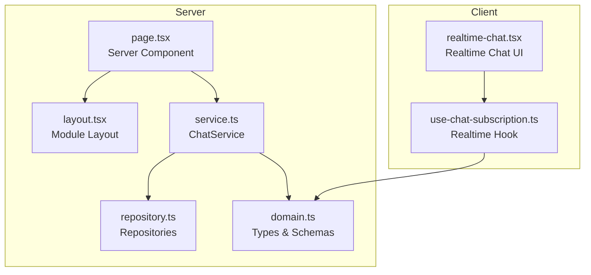
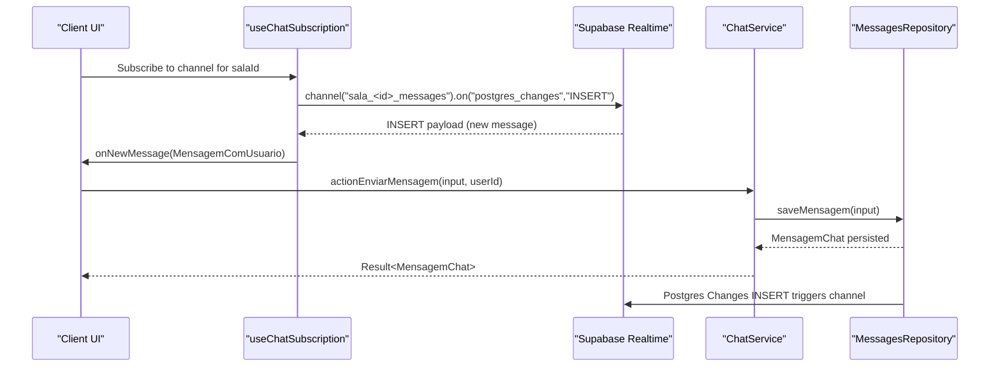
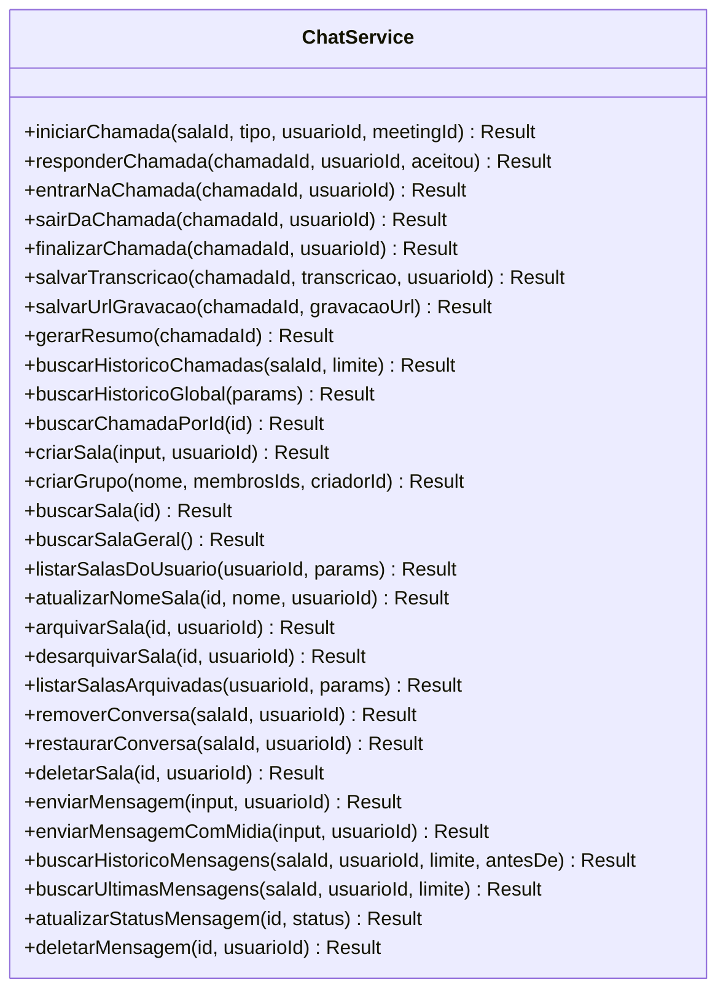
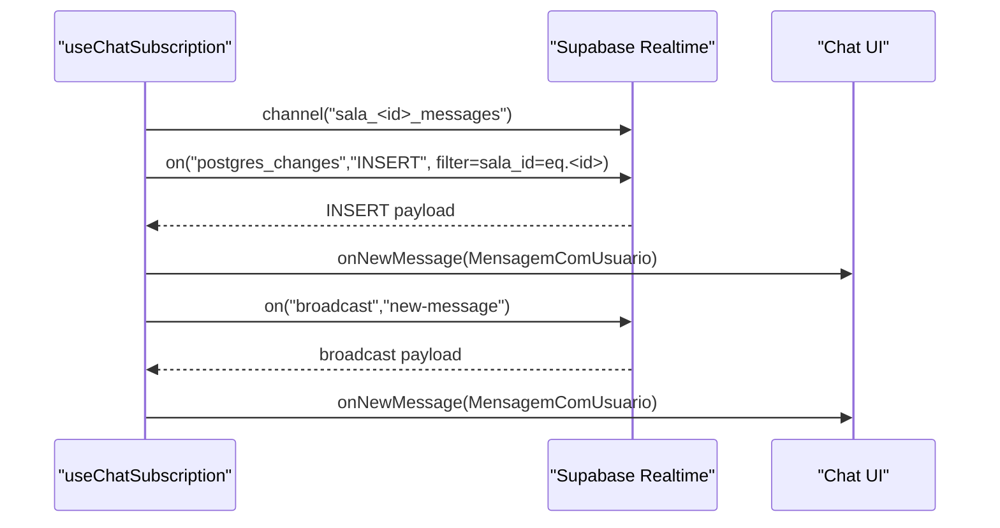
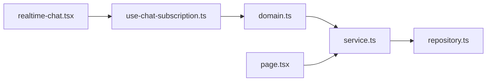

# Chat System

<cite>
**Referenced Files in This Document**
- [service.ts](file://src/app/(authenticated)/chat/service.ts)
- [repository.ts](file://src/app/(authenticated)/chat/repository.ts)
- [domain.ts](file://src/app/(authenticated)/chat/domain.ts)
- [page.tsx](file://src/app/(authenticated)/chat/page.tsx)
- [layout.tsx](file://src/app/(authenticated)/chat/layout.tsx)
- [index.ts](file://src/app/(authenticated)/chat/index.ts)
- [use-chat-subscription.ts](file://src/app/(authenticated)/chat/hooks/use-chat-subscription.ts)
- [realtime-chat.tsx](file://src/components/realtime/realtime-chat.tsx)
- [utils.ts](file://src/app/(authenticated)/chat/utils.ts)
</cite>

## Table of Contents
1. [Introduction](#introduction)
2. [Project Structure](#project-structure)
3. [Core Components](#core-components)
4. [Architecture Overview](#architecture-overview)
5. [Detailed Component Analysis](#detailed-component-analysis)
6. [Dependency Analysis](#dependency-analysis)
7. [Performance Considerations](#performance-considerations)
8. [Troubleshooting Guide](#troubleshooting-guide)
9. [Conclusion](#conclusion)

## Introduction
This document describes the Chat System component, focusing on room management, message handling, and user interactions. It explains the implementation of chat rooms, message persistence, and real-time message delivery. It also documents the component structure, server actions, message validation schemas, pagination handling, practical examples, security and permissions, and integration with Supabase real-time subscriptions and WebSocket connections.

## Project Structure
The chat feature is organized under the authenticated route group with a clear separation of concerns:
- Domain: Type definitions, enums, and validation schemas
- Service: Business logic and orchestration
- Repository: Data access and persistence
- Hooks: Real-time subscriptions and client-side utilities
- Components: UI building blocks (exported via public API)
- Pages: Server-side rendering and initial hydration

**Diagram sources**
- [page.tsx:1-83](file://src/app/(authenticated)/chat/page.tsx#L1-L83)
- [layout.tsx:1-4](file://src/app/(authenticated)/chat/layout.tsx#L1-L4)
- [service.ts:1-749](file://src/app/(authenticated)/chat/service.ts#L1-L749)
- [repository.ts:1-800](file://src/app/(authenticated)/chat/repository.ts#L1-L800)
- [domain.ts:1-519](file://src/app/(authenticated)/chat/domain.ts#L1-L519)
- [use-chat-subscription.ts:1-252](file://src/app/(authenticated)/chat/hooks/use-chat-subscription.ts#L1-L252)
- [realtime-chat.tsx:1-70](file://src/components/realtime/realtime-chat.tsx#L1-L70)

**Section sources**
- [page.tsx:1-83](file://src/app/(authenticated)/chat/page.tsx#L1-L83)
- [layout.tsx:1-4](file://src/app/(authenticated)/chat/layout.tsx#L1-L4)
- [index.ts:1-116](file://src/app/(authenticated)/chat/index.ts#L1-L116)

## Core Components
- ChatService: Orchestrates chat operations (rooms, messages, calls), applies validation, and coordinates repositories
- RoomsRepository, MessagesRepository, CallsRepository, MembersRepository: Data access layer for persistence
- useChatSubscription: Real-time subscription hook using Supabase Realtime
- Domain types and Zod schemas: Strongly typed models and validation for inputs
- Server Actions: Exposed via public API for client invocation

Key responsibilities:
- Room management: create, archive, unarchive, soft-delete, and list rooms
- Message handling: send, paginate, and mark status
- Real-time delivery: subscribe to inserts and broadcasts
- Call management: initiate, respond, enter/exit, finalize, and summarize calls

**Section sources**
- [service.ts:45-749](file://src/app/(authenticated)/chat/service.ts#L45-L749)
- [repository.ts:143-800](file://src/app/(authenticated)/chat/repository.ts#L143-L800)
- [domain.ts:165-210](file://src/app/(authenticated)/chat/domain.ts#L165-L210)
- [index.ts:68-104](file://src/app/(authenticated)/chat/index.ts#L68-L104)

## Architecture Overview
The system follows a layered architecture:
- Presentation: Next.js Server Component renders the chat shell and hydrates with initial data
- Application: ChatService encapsulates business rules and orchestrates repositories
- Persistence: Supabase ORM queries with RLS policies
- Real-time: Supabase Realtime channels for live updates

**Diagram sources**
- [use-chat-subscription.ts:181-221](file://src/app/(authenticated)/chat/hooks/use-chat-subscription.ts#L181-L221)
- [service.ts:632-667](file://src/app/(authenticated)/chat/service.ts#L632-L667)
- [repository.ts:631-662](file://src/app/(authenticated)/chat/repository.ts#L631-L662)

## Detailed Component Analysis

### ChatService: Business Orchestration
Responsibilities:
- Room lifecycle: create, update, archive/unarchive, soft-delete, list with pagination
- Message lifecycle: send, paginate history, update status, soft-delete
- Call lifecycle: initiate, respond, enter/exit, finalize, summarize, manage transcription/recording
- Authorization checks: enforce ownership and membership rules

Validation:
- Uses Zod schemas for inputs (e.g., criarMensagemChatSchema, criarSalaChatSchema)
- Returns typed errors via Result monad

Concurrency and context:
- Single Supabase client shared across repositories for consistent auth context

**Diagram sources**
- [service.ts:45-749](file://src/app/(authenticated)/chat/service.ts#L45-L749)

**Section sources**
- [service.ts:45-749](file://src/app/(authenticated)/chat/service.ts#L45-L749)

### Repositories: Data Access Layer
- RoomsRepository: CRUD for rooms, membership-aware listing, archive/unarchive, soft-delete
- MessagesRepository: paginated message retrieval, latest messages, status updates, soft-delete
- CallsRepository: call lifecycle, participant tracking, transcription/recording, summaries
- MembersRepository: membership management, participant enrollment, presence tracking

**Diagram sources**
- [repository.ts:143-800](file://src/app/(authenticated)/chat/repository.ts#L143-L800)

**Section sources**
- [repository.ts:143-800](file://src/app/(authenticated)/chat/repository.ts#L143-L800)

### Real-time Subscription Hook
The hook subscribes to:
- Postgres INSERT events on the messages table filtered by sala_id
- Broadcast events named "new-message" for fallback scenarios

It exposes:
- isConnected state
- broadcastNewMessage(payload) to emit fallback events

**Diagram sources**
- [use-chat-subscription.ts:181-221](file://src/app/(authenticated)/chat/hooks/use-chat-subscription.ts#L181-L221)

**Section sources**
- [use-chat-subscription.ts:1-252](file://src/app/(authenticated)/chat/hooks/use-chat-subscription.ts#L1-L252)

### Domain Types and Validation
Core types:
- SalaChat, MensagemChat, MensagemComUsuario, UsuarioChat, ChatItem
- Enums: TipoSalaChat, TipoMensagemChat, TipoChamada, StatusChamada
- Validation schemas: criarSalaChatSchema, criarMensagemChatSchema, criarChamadaSchema, responderChamadaSchema

Pagination:
- PaginatedResponse<T> with currentPage, pageSize, totalCount, totalPages
- ListarMensagensParams and ListarSalasParams support limits and offsets

**Section sources**
- [domain.ts:165-261](file://src/app/(authenticated)/chat/domain.ts#L165-L261)
- [domain.ts:286-441](file://src/app/(authenticated)/chat/domain.ts#L286-L441)

### Server Actions and Public API
The public API re-exports:
- Types and schemas
- Components (ChatLayout, ChatWindow, ChatSidebarWrapper, ChatSidebar)
- Hooks (useChatSubscription, useTypingIndicator, useChatStore)
- Server Actions (e.g., actionEnviarMensagem, actionCriarSala, actionListarSalas)

These actions are intended to be imported directly in server components/actions.

**Section sources**
- [index.ts:21-116](file://src/app/(authenticated)/chat/index.ts#L21-L116)

### Practical Examples

#### Example: Chat Room Creation
- Use actionCriarSala or ChatService.criarSala with a validated input conforming to criarSalaChatSchema
- For private chats, the service ensures uniqueness between two users and adds both as members

**Section sources**
- [service.ts:372-431](file://src/app/(authenticated)/chat/service.ts#L372-L431)
- [domain.ts:165-189](file://src/app/(authenticated)/chat/domain.ts#L165-L189)

#### Example: Sending a Message
- Use actionEnviarMensagem or ChatService.enviarMensagem with a validated input conforming to criarMensagemChatSchema
- The repository persists the message; Supabase Realtime emits an INSERT event that the client receives via useChatSubscription

**Section sources**
- [service.ts:632-667](file://src/app/(authenticated)/chat/service.ts#L632-L667)
- [repository.ts:631-662](file://src/app/(authenticated)/chat/repository.ts#L631-L662)
- [domain.ts:194-209](file://src/app/(authenticated)/chat/domain.ts#L194-L209)

#### Example: Retrieving Message History
- Use actionBuscarHistorico or ChatService.buscarHistoricoMensagens with ListarMensagensParams
- The repository returns a PaginatedResponse<MensagemComUsuario>

**Section sources**
- [service.ts:683-694](file://src/app/(authenticated)/chat/service.ts#L683-L694)
- [repository.ts:534-584](file://src/app/(authenticated)/chat/repository.ts#L534-L584)

### Security, Permissions, and Moderation
- Real-time security: The subscription setup logs potential causes for channel errors (RLS blocking, missing publication, or Realtime disabled)
- Ownership and membership: Several operations enforce ownership (e.g., only creator can hard-delete a room) or require active membership (e.g., initiating calls)
- Soft deletion: Removing a conversation hides it for the user while preserving data for others
- Moderation note: There is no explicit moderation API in the reviewed code; moderation features would require additional repository methods and UI components

**Section sources**
- [use-chat-subscription.ts:209-212](file://src/app/(authenticated)/chat/hooks/use-chat-subscription.ts#L209-L212)
- [service.ts:578-591](file://src/app/(authenticated)/chat/service.ts#L578-L591)
- [service.ts:617-622](file://src/app/(authenticated)/chat/service.ts#L617-L622)

### Integration with Supabase Realtime and WebSocket Connections
- Postgres Changes: Subscribes to INSERT events on mensagens_chat filtered by sala_id
- Broadcast fallback: Supports "new-message" broadcast events for scenarios where Postgres Changes might fail
- Automatic reconnection: Supabase Realtime handles exponential backoff and rejoin after network interruptions
- Channel states: SUBSCRIBED, TIMED_OUT, CLOSED, CHANNEL_ERROR are handled explicitly

**Section sources**
- [use-chat-subscription.ts:181-252](file://src/app/(authenticated)/chat/hooks/use-chat-subscription.ts#L181-L252)

## Dependency Analysis
High-level dependencies:
- ChatService depends on all repositories and domain schemas
- Repositories depend on Supabase client and convert rows to domain types
- Hooks depend on Supabase client and domain types
- Page depends on ChatService and exports ChatLayout

**Diagram sources**
- [domain.ts:1-519](file://src/app/(authenticated)/chat/domain.ts#L1-L519)
- [service.ts:1-749](file://src/app/(authenticated)/chat/service.ts#L1-L749)
- [repository.ts:1-800](file://src/app/(authenticated)/chat/repository.ts#L1-L800)
- [page.tsx:1-83](file://src/app/(authenticated)/chat/page.tsx#L1-L83)
- [use-chat-subscription.ts:1-252](file://src/app/(authenticated)/chat/hooks/use-chat-subscription.ts#L1-L252)
- [realtime-chat.tsx:1-70](file://src/components/realtime/realtime-chat.tsx#L1-L70)

**Section sources**
- [service.ts:738-748](file://src/app/(authenticated)/chat/service.ts#L738-L748)
- [repository.ts:515-519](file://src/app/(authenticated)/chat/repository.ts#L515-L519)

## Performance Considerations
- Pagination: Repositories accept limit and offset parameters; use them to avoid loading large datasets
- Indexes and queries: Ensure appropriate indexes on sala_id, created_at, and membership tables for efficient filtering and sorting
- Real-time efficiency: Use channel filters (e.g., sala_id=eq.<id>) to minimize event volume
- Batch operations: Consider batching message sends and reducing redundant queries in UI components

## Troubleshooting Guide
Common issues and resolutions:
- Realtime subscription errors: Check RLS policies, ensure the table is part of the realtime publication, and confirm Realtime is enabled
- Channel timeouts or closures: Verify network connectivity and consider client-side reconnection logic
- Permission denials: Confirm user membership and ownership for protected operations (e.g., deleting rooms, updating names)

**Section sources**
- [use-chat-subscription.ts:209-219](file://src/app/(authenticated)/chat/hooks/use-chat-subscription.ts#L209-L219)

## Conclusion
The Chat System implements a robust, layered architecture with strong typing, validation, and real-time capabilities powered by Supabase. Room and message lifecycles are well-defined, with pagination and membership-aware queries. Real-time delivery leverages Postgres Changes and broadcast fallbacks. Security is enforced through RLS and service-level checks. Extending moderation features would require adding repository methods and UI components aligned with existing patterns.