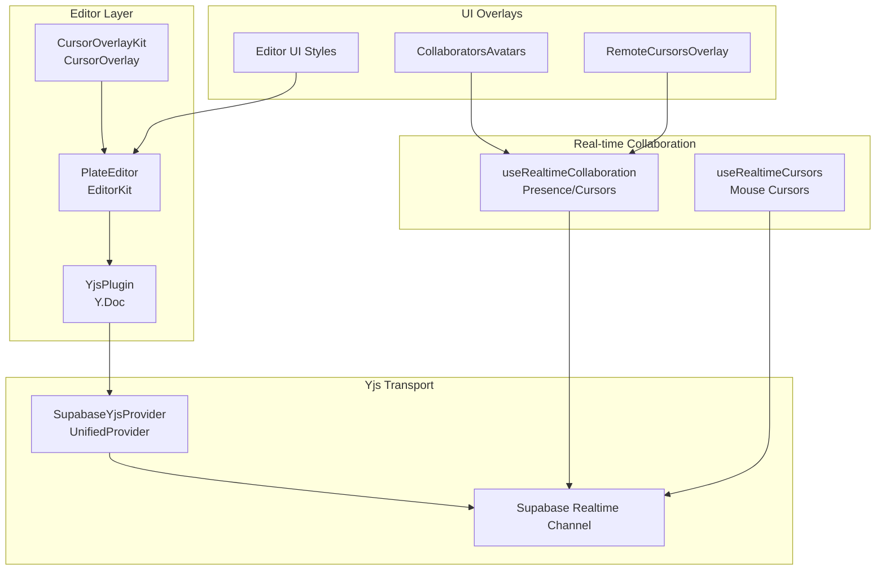
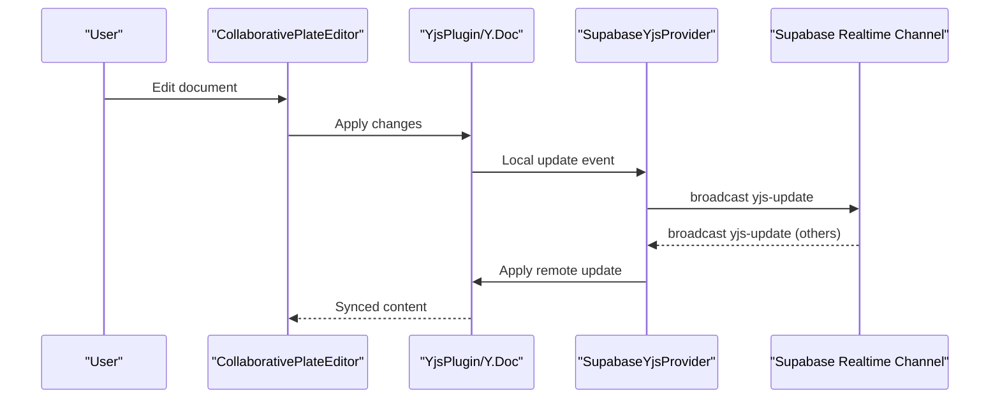
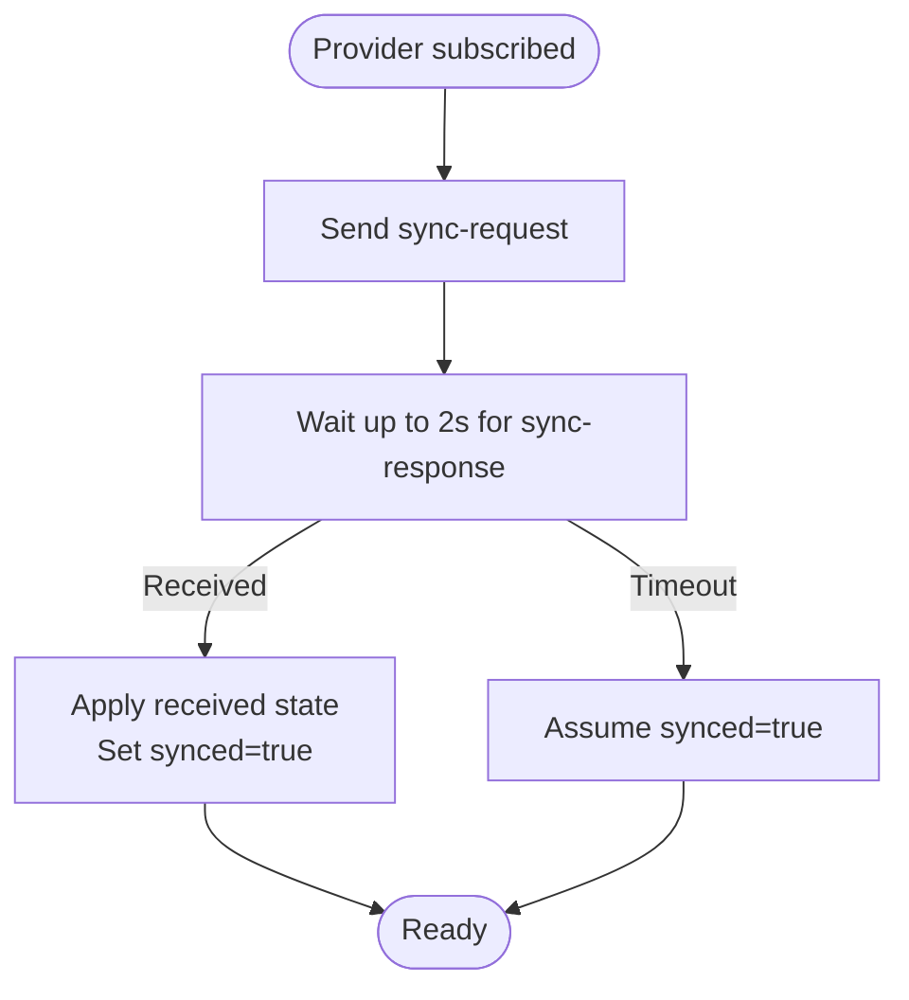
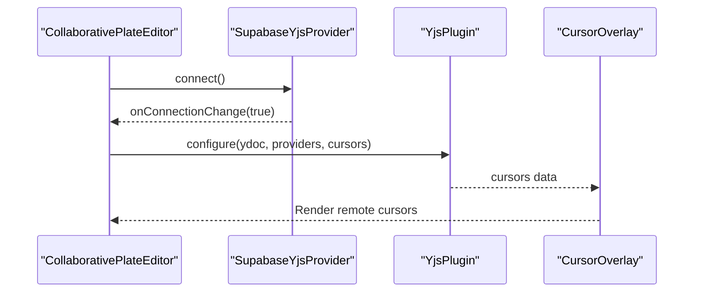
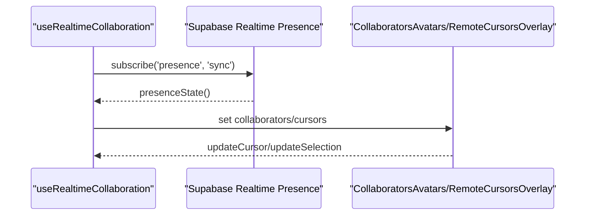
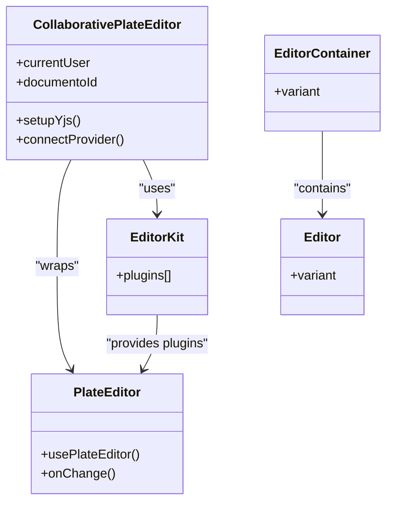
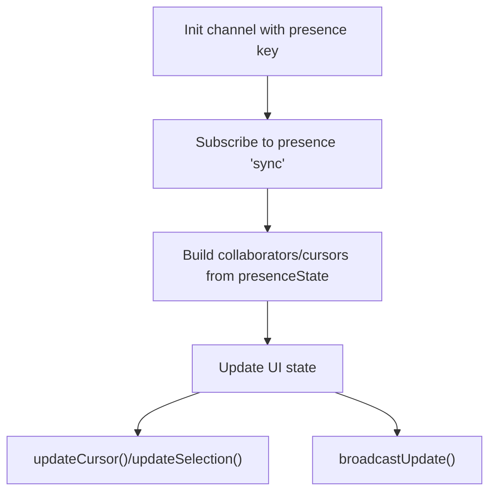
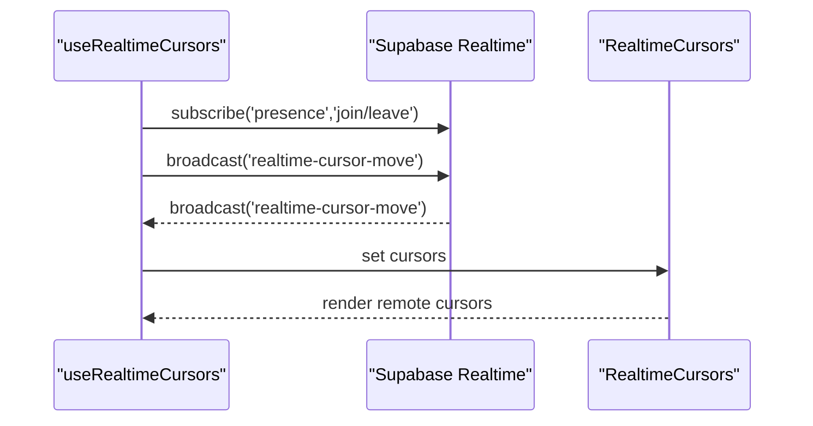
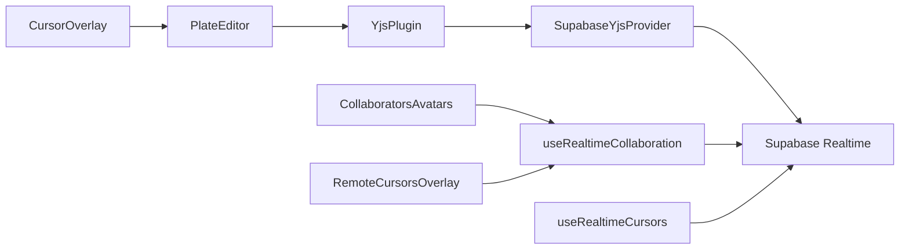

# Collaborative Editing

<cite>
**Referenced Files in This Document**
- [supabase-yjs-provider.ts](file://src/lib/yjs/supabase-yjs-provider.ts)
- [collaborative-plate-editor.tsx](file://src/components/editor/plate/collaborative-plate-editor.tsx)
- [plate-editor.tsx](file://src/components/editor/plate/plate-editor.tsx)
- [editor-kit.tsx](file://src/components/editor/plate/editor-kit.tsx)
- [cursor-overlay.tsx](file://src/components/editor/plate-ui/cursor-overlay.tsx)
- [cursor-overlay-kit.tsx](file://src/components/editor/plate/cursor-overlay-kit.tsx)
- [use-realtime-collaboration.ts](file://src/hooks/use-realtime-collaboration.ts)
- [collaborators-avatars.tsx](file://src/app/(authenticated)/documentos/components/collaborators-avatars.tsx)
- [remote-cursors-overlay.tsx](file://src/app/(authenticated)/documentos/components/remote-cursors-overlay.tsx)
- [document-editor.tsx](file://src/app/(authenticated)/documentos/components/document-editor.tsx)
- [document-chat.tsx](file://src/app/(authenticated)/documentos/components/document-chat.tsx)
- [use-realtime-cursors.ts](file://src/hooks/use-realtime-cursors.ts)
- [realtime-cursors.tsx](file://src/components/realtime/realtime-cursors.tsx)
- [cursor.tsx](file://src/components/realtime/cursor.tsx)
- [editor.tsx](file://src/components/editor/plate-ui/editor.tsx)
</cite>

## Table of Contents
1. [Introduction](#introduction)
2. [Project Structure](#project-structure)
3. [Core Components](#core-components)
4. [Architecture Overview](#architecture-overview)
5. [Detailed Component Analysis](#detailed-component-analysis)
6. [Dependency Analysis](#dependency-analysis)
7. [Performance Considerations](#performance-considerations)
8. [Troubleshooting Guide](#troubleshooting-guide)
9. [Conclusion](#conclusion)

## Introduction
This document explains the Collaborative Editing system built on Plate.js with Yjs real-time synchronization and Supabase Realtime transport. It covers Yjs integration for conflict-free replication, cursor and presence overlays, collaborative comments and suggestions, and the useRealtimeCollaboration hook. Practical workflows demonstrate multi-user editing, real-time formatting, and collaborative comments. Performance guidance addresses large documents, network optimization, and offline editing strategies.

## Project Structure
The collaborative editing stack spans UI components, editor kits, Yjs providers, and real-time hooks:

- Editor integration: Plate.js with Yjs and cursor overlay kits
- Yjs provider: CRDT synchronization via Supabase Realtime channels
- Real-time collaboration: Presence tracking, cursor broadcasting, and broadcast events
- UI overlays: Collaborator avatars, remote cursors, and editor cursor indicators

**Diagram sources**
- [collaborative-plate-editor.tsx:72-151](file://src/components/editor/plate/collaborative-plate-editor.tsx#L72-L151)
- [editor-kit.tsx:41-91](file://src/components/editor/plate/editor-kit.tsx#L41-L91)
- [cursor-overlay-kit.tsx:7-13](file://src/components/editor/plate/cursor-overlay-kit.tsx#L7-L13)
- [cursor-overlay.tsx:16-70](file://src/components/editor/plate-ui/cursor-overlay.tsx#L16-L70)
- [supabase-yjs-provider.ts:78-337](file://src/lib/yjs/supabase-yjs-provider.ts#L78-L337)
- [use-realtime-collaboration.ts:53-242](file://src/hooks/use-realtime-collaboration.ts#L53-L242)
- [use-realtime-cursors.ts:61-177](file://src/hooks/use-realtime-cursors.ts#L61-L177)
- [collaborators-avatars.tsx](file://src/app/(authenticated)/documentos/components/collaborators-avatars.tsx#L23-L51)
- [remote-cursors-overlay.tsx](file://src/app/(authenticated)/documentos/components/remote-cursors-overlay.tsx#L15-L47)
- [editor.tsx:38-119](file://src/components/editor/plate-ui/editor.tsx#L38-L119)

**Section sources**
- [collaborative-plate-editor.tsx:1-210](file://src/components/editor/plate/collaborative-plate-editor.tsx#L1-L210)
- [editor-kit.tsx:1-96](file://src/components/editor/plate/editor-kit.tsx#L1-L96)
- [supabase-yjs-provider.ts:1-357](file://src/lib/yjs/supabase-yjs-provider.ts#L1-L357)
- [use-realtime-collaboration.ts:1-242](file://src/hooks/use-realtime-collaboration.ts#L1-L242)
- [use-realtime-cursors.ts:1-177](file://src/hooks/use-realtime-cursors.ts#L1-L177)
- [collaborators-avatars.tsx](file://src/app/(authenticated)/documentos/components/collaborators-avatars.tsx#L1-L51)
- [remote-cursors-overlay.tsx](file://src/app/(authenticated)/documentos/components/remote-cursors-overlay.tsx#L1-L47)
- [editor.tsx:1-137](file://src/components/editor/plate-ui/editor.tsx#L1-L137)

## Core Components
- SupabaseYjsProvider: Implements a UnifiedProvider to synchronize Y.Doc updates and awareness via Supabase Realtime channels. Handles local and remote updates, initial sync requests, and awareness broadcasts.
- CollaborativePlateEditor: Integrates Plate.js with Yjs and cursor overlays, initializes the provider, and manages lifecycle.
- EditorKit: Aggregates editor plugins including discussion/comment/suggestion kits and cursor overlay kit.
- useRealtimeCollaboration: Manages presence, cursor positions, and broadcast events for collaborative editing.
- useRealtimeCursors: Tracks mouse movement and broadcasts cursor positions for non-editor overlays.
- UI overlays: CollaboratorsAvatars, RemoteCursorsOverlay, and CursorOverlay for visual collaboration cues.

**Section sources**
- [supabase-yjs-provider.ts:78-337](file://src/lib/yjs/supabase-yjs-provider.ts#L78-L337)
- [collaborative-plate-editor.tsx:72-151](file://src/components/editor/plate/collaborative-plate-editor.tsx#L72-L151)
- [editor-kit.tsx:41-91](file://src/components/editor/plate/editor-kit.tsx#L41-L91)
- [use-realtime-collaboration.ts:53-242](file://src/hooks/use-realtime-collaboration.ts#L53-L242)
- [use-realtime-cursors.ts:61-177](file://src/hooks/use-realtime-cursors.ts#L61-L177)
- [collaborators-avatars.tsx](file://src/app/(authenticated)/documentos/components/collaborators-avatars.tsx#L23-L51)
- [remote-cursors-overlay.tsx](file://src/app/(authenticated)/documentos/components/remote-cursors-overlay.tsx#L15-L47)
- [cursor-overlay.tsx:16-70](file://src/components/editor/plate-ui/cursor-overlay.tsx#L16-L70)

## Architecture Overview
The system uses Yjs CRDTs synchronized over Supabase Realtime channels. CollaborativePlateEditor configures Yjs with a SupabaseYjsProvider and Plate’s YjsPlugin. Presence and cursor data are tracked via separate Realtime channels. Editor cursor overlays render collaborative cursors, while document-level overlays show remote cursors and collaborators.

**Diagram sources**
- [collaborative-plate-editor.tsx:114-131](file://src/components/editor/plate/collaborative-plate-editor.tsx#L114-L131)
- [supabase-yjs-provider.ts:224-250](file://src/lib/yjs/supabase-yjs-provider.ts#L224-L250)
- [supabase-yjs-provider.ts:243-250](file://src/lib/yjs/supabase-yjs-provider.ts#L243-L250)

**Section sources**
- [collaborative-plate-editor.tsx:72-151](file://src/components/editor/plate/collaborative-plate-editor.tsx#L72-L151)
- [supabase-yjs-provider.ts:224-306](file://src/lib/yjs/supabase-yjs-provider.ts#L224-L306)

## Detailed Component Analysis

### Yjs Integration and Operational Transformation
- Provider lifecycle: Provider connects on mount, subscribes to channel events, and applies incoming updates to the Y.Doc. It ignores updates originating locally to prevent loops.
- Initial sync: On channel subscription, the provider requests a full state from peers and marks itself synced if no response arrives within a timeout.
- Awareness: Provider sends and receives awareness updates to share user presence and cursor selections.

**Diagram sources**
- [supabase-yjs-provider.ts:255-271](file://src/lib/yjs/supabase-yjs-provider.ts#L255-L271)
- [supabase-yjs-provider.ts:294-306](file://src/lib/yjs/supabase-yjs-provider.ts#L294-L306)

**Section sources**
- [supabase-yjs-provider.ts:78-337](file://src/lib/yjs/supabase-yjs-provider.ts#L78-L337)

### Shared Editing Sessions and Cursor Positioning
- CollaborativePlateEditor initializes a SupabaseYjsProvider with user data and attaches YjsPlugin to Plate. It renders the editor container and content area.
- Cursor overlay kit integrates with Plate to render collaborative cursors and selection rectangles.

**Diagram sources**
- [collaborative-plate-editor.tsx:99-131](file://src/components/editor/plate/collaborative-plate-editor.tsx#L99-L131)
- [cursor-overlay-kit.tsx:7-13](file://src/components/editor/plate/cursor-overlay-kit.tsx#L7-L13)
- [cursor-overlay.tsx:16-70](file://src/components/editor/plate-ui/cursor-overlay.tsx#L16-L70)

**Section sources**
- [collaborative-plate-editor.tsx:72-151](file://src/components/editor/plate/collaborative-plate-editor.tsx#L72-L151)
- [cursor-overlay-kit.tsx:1-13](file://src/components/editor/plate/cursor-overlay-kit.tsx#L1-L13)
- [cursor-overlay.tsx:1-70](file://src/components/editor/plate-ui/cursor-overlay.tsx#L1-L70)

### Collaborative Cursors and Presence
- useRealtimeCollaboration tracks presence and extracts remote cursor selections to render a visual overlay. It updates presence with user info, color, and selection.
- CollaboratorsAvatars displays online collaborators with colored borders and tooltips.
- RemoteCursorsOverlay shows remote user indicators with names and colors.

**Diagram sources**
- [use-realtime-collaboration.ts:100-128](file://src/hooks/use-realtime-collaboration.ts#L100-L128)
- [collaborators-avatars.tsx](file://src/app/(authenticated)/documentos/components/collaborators-avatars.tsx#L23-L51)
- [remote-cursors-overlay.tsx](file://src/app/(authenticated)/documentos/components/remote-cursors-overlay.tsx#L15-L47)

**Section sources**
- [use-realtime-collaboration.ts:53-242](file://src/hooks/use-realtime-collaboration.ts#L53-L242)
- [collaborators-avatars.tsx](file://src/app/(authenticated)/documentos/components/collaborators-avatars.tsx#L1-L51)
- [remote-cursors-overlay.tsx](file://src/app/(authenticated)/documentos/components/remote-cursors-overlay.tsx#L1-L47)

### Editor Integration with Plate.js and Real-time Synchronization
- EditorKit aggregates plugins including discussion/comment/suggestion kits and cursor overlay kit.
- PlateEditor provides a basic editor instance; CollaborativePlateEditor adds Yjs and provider configuration.
- Editor UI components define container and content styles for the editor.

**Diagram sources**
- [editor-kit.tsx:41-91](file://src/components/editor/plate/editor-kit.tsx#L41-L91)
- [plate-editor.tsx:22-77](file://src/components/editor/plate/plate-editor.tsx#L22-L77)
- [collaborative-plate-editor.tsx:72-151](file://src/components/editor/plate/collaborative-plate-editor.tsx#L72-L151)
- [editor.tsx:38-119](file://src/components/editor/plate-ui/editor.tsx#L38-L119)

**Section sources**
- [editor-kit.tsx:1-96](file://src/components/editor/plate/editor-kit.tsx#L1-L96)
- [plate-editor.tsx:1-635](file://src/components/editor/plate/plate-editor.tsx#L1-L635)
- [collaborative-plate-editor.tsx:1-210](file://src/components/editor/plate/collaborative-plate-editor.tsx#L1-L210)
- [editor.tsx:1-137](file://src/components/editor/plate-ui/editor.tsx#L1-L137)

### useRealtimeCollaboration Hook and Workflows
- Initializes a Supabase Realtime channel for presence with a unique user key.
- Subscribes to presence sync events to compute collaborators and remote cursors.
- Provides methods to update cursor and selection, and to broadcast content updates.

**Diagram sources**
- [use-realtime-collaboration.ts:89-181](file://src/hooks/use-realtime-collaboration.ts#L89-L181)
- [use-realtime-collaboration.ts:184-232](file://src/hooks/use-realtime-collaboration.ts#L184-L232)

**Section sources**
- [use-realtime-collaboration.ts:1-242](file://src/hooks/use-realtime-collaboration.ts#L1-L242)

### Non-editor Real-time Cursors
- useRealtimeCursors tracks mouse movement and throttles updates to a Supabase Realtime channel.
- RealtimeCursors renders remote cursors with avatars and names.

**Diagram sources**
- [use-realtime-cursors.ts:107-177](file://src/hooks/use-realtime-cursors.ts#L107-L177)
- [realtime-cursors.tsx:8-29](file://src/components/realtime/realtime-cursors.tsx#L8-L29)
- [cursor.tsx:4-28](file://src/components/realtime/cursor.tsx#L4-L28)

**Section sources**
- [use-realtime-cursors.ts:1-177](file://src/hooks/use-realtime-cursors.ts#L1-L177)
- [realtime-cursors.tsx:1-29](file://src/components/realtime/realtime-cursors.tsx#L1-L29)
- [cursor.tsx:1-28](file://src/components/realtime/cursor.tsx#L1-L28)

### Practical Examples
- Multi-user document editing: Users join the same document channel; edits propagate via Yjs updates and are rendered immediately for all participants.
- Real-time formatting: Formatting changes are synchronized as part of the Y.Doc CRDT, ensuring consistent rendering across clients.
- Collaborative comments: Comments and suggestions are stored within the document structure and rendered via discussion/comment plugins.

**Section sources**
- [collaborative-plate-editor.tsx:72-151](file://src/components/editor/plate/collaborative-plate-editor.tsx#L72-L151)
- [editor-kit.tsx:68-91](file://src/components/editor/plate/editor-kit.tsx#L68-L91)
- [document-editor.tsx](file://src/app/(authenticated)/documentos/components/document-editor.tsx#L122-L131)

## Dependency Analysis
The collaborative editing system exhibits clear separation of concerns:

- Editor components depend on Plate.js and YjsPlugin
- Yjs transport depends on SupabaseYjsProvider and Supabase Realtime
- Real-time collaboration hooks depend on Supabase Realtime presence and broadcast
- UI overlays depend on collaboration hooks and editor cursor overlay

**Diagram sources**
- [collaborative-plate-editor.tsx:114-131](file://src/components/editor/plate/collaborative-plate-editor.tsx#L114-L131)
- [supabase-yjs-provider.ts:78-337](file://src/lib/yjs/supabase-yjs-provider.ts#L78-L337)
- [use-realtime-collaboration.ts:53-242](file://src/hooks/use-realtime-collaboration.ts#L53-L242)
- [use-realtime-cursors.ts:61-177](file://src/hooks/use-realtime-cursors.ts#L61-L177)
- [cursor-overlay.tsx:16-70](file://src/components/editor/plate-ui/cursor-overlay.tsx#L16-L70)
- [collaborators-avatars.tsx](file://src/app/(authenticated)/documentos/components/collaborators-avatars.tsx#L23-L51)
- [remote-cursors-overlay.tsx](file://src/app/(authenticated)/documentos/components/remote-cursors-overlay.tsx#L15-L47)

**Section sources**
- [collaborative-plate-editor.tsx:72-151](file://src/components/editor/plate/collaborative-plate-editor.tsx#L72-L151)
- [supabase-yjs-provider.ts:78-337](file://src/lib/yjs/supabase-yjs-provider.ts#L78-L337)
- [use-realtime-collaboration.ts:53-242](file://src/hooks/use-realtime-collaboration.ts#L53-L242)
- [use-realtime-cursors.ts:61-177](file://src/hooks/use-realtime-cursors.ts#L61-L177)
- [cursor-overlay.tsx:1-70](file://src/components/editor/plate-ui/cursor-overlay.tsx#L1-L70)
- [collaborators-avatars.tsx](file://src/app/(authenticated)/documentos/components/collaborators-avatars.tsx#L1-L51)
- [remote-cursors-overlay.tsx](file://src/app/(authenticated)/documentos/components/remote-cursors-overlay.tsx#L1-L47)

## Performance Considerations
- Large documents: Prefer incremental updates and avoid unnecessary re-renders. Use Plate’s normalized nodes and keep plugin sets minimal.
- Network optimization: Throttle cursor updates (already implemented) and batch presence updates. Use initial sync timeouts to avoid blocking UI.
- Offline editing: The Yjs provider supports disconnected operation; changes are queued and applied upon reconnect. Consider persisting local drafts and merging on reconnect.
- Memory usage: Unmount providers and channels to release resources. Limit overlay rendering to visible cursors and collaborators.

[No sources needed since this section provides general guidance]

## Troubleshooting Guide
- Connection issues: Verify Supabase credentials and channel subscription status. Check provider connection callbacks and channel status handlers.
- Sync problems: Ensure initial sync responses arrive; otherwise, the provider assumes synced after timeout. Confirm awareness updates are being sent and received.
- Cursor not appearing: Validate presence keys and that remote cursors are extracted from presence state. Confirm overlay components are mounted and receiving cursor data.
- Chat integration: Confirm room creation and RealtimeChat component mounting for document-specific rooms.

**Section sources**
- [supabase-yjs-provider.ts:171-191](file://src/lib/yjs/supabase-yjs-provider.ts#L171-L191)
- [supabase-yjs-provider.ts:264-271](file://src/lib/yjs/supabase-yjs-provider.ts#L264-L271)
- [use-realtime-collaboration.ts:100-128](file://src/hooks/use-realtime-collaboration.ts#L100-L128)
- [document-chat.tsx](file://src/app/(authenticated)/documentos/components/document-chat.tsx#L32-L114)

## Conclusion
The Collaborative Editing system combines Plate.js with Yjs CRDTs and Supabase Realtime to deliver seamless multi-user editing. The SupabaseYjsProvider ensures robust synchronization, while hooks and overlays provide presence, cursors, and collaborative annotations. The architecture supports scalable real-time editing, with clear pathways for performance tuning and offline resilience.