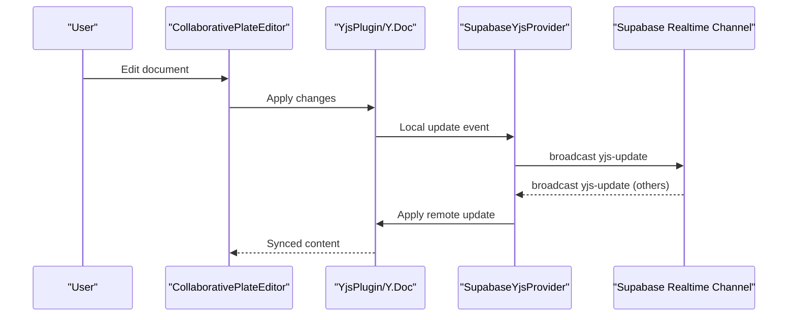
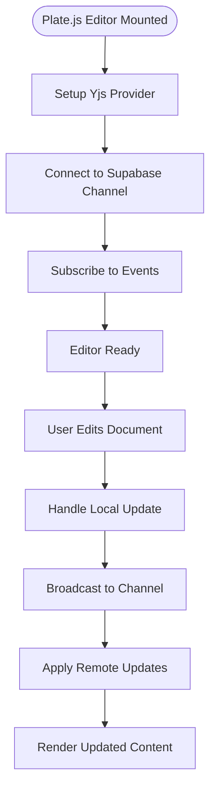
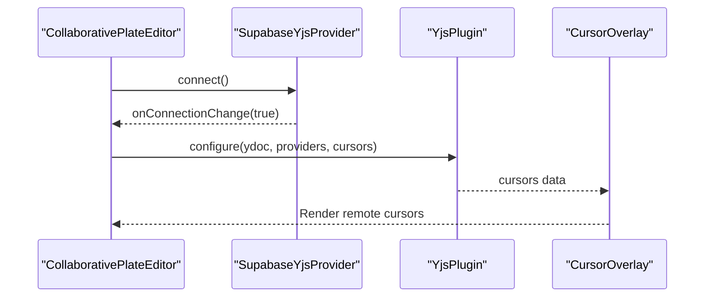
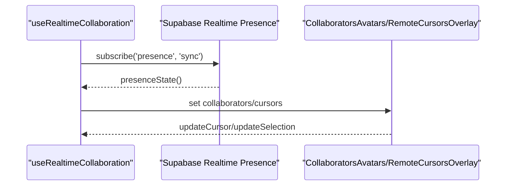
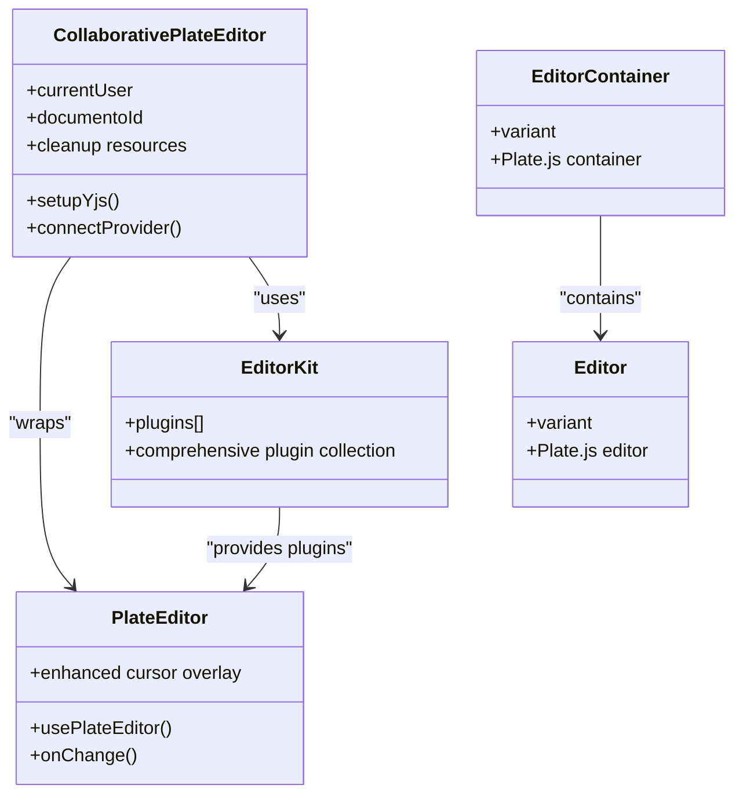
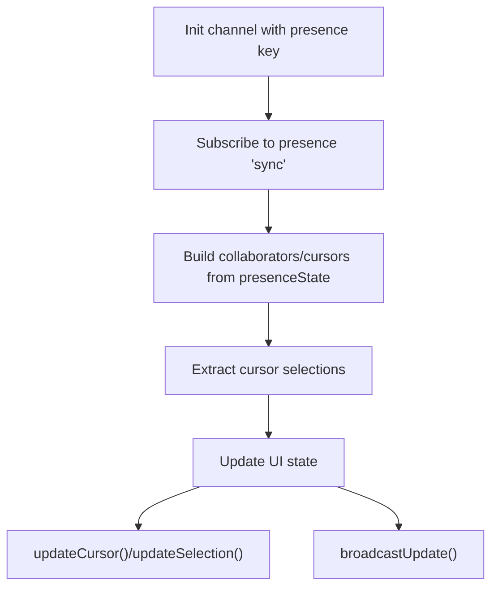
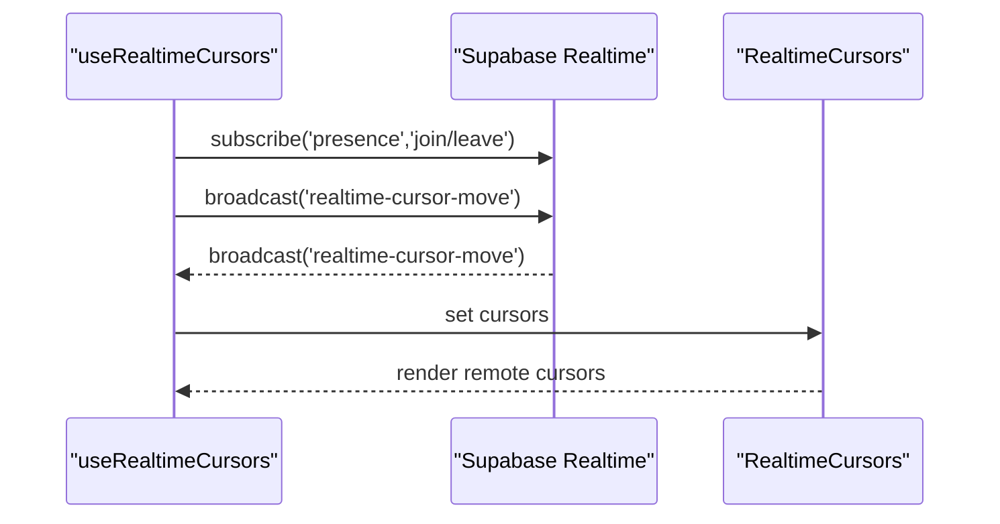
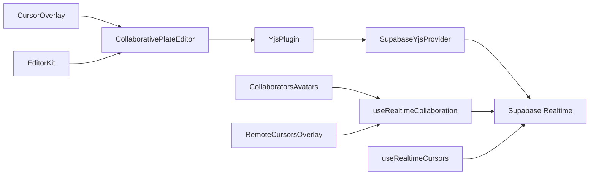

# Collaborative Editing

<cite>
**Referenced Files in This Document**
- [supabase-yjs-provider.ts](file://src/lib/yjs/supabase-yjs-provider.ts)
- [collaborative-plate-editor.tsx](file://src/components/editor/plate/collaborative-plate-editor.tsx)
- [yjs-kit.tsx](file://src/components/editor/plate/yjs-kit.tsx)
- [editor-kit.tsx](file://src/components/editor/plate/editor-kit.tsx)
- [cursor-overlay-kit.tsx](file://src/components/editor/plate/cursor-overlay-kit.tsx)
- [cursor-overlay.tsx](file://src/components/editor/plate-ui/cursor-overlay.tsx)
- [use-realtime-collaboration.ts](file://src/hooks/use-realtime-collaboration.ts)
- [collaborators-avatars.tsx](file://src/app/(authenticated)/documentos/components/collaborators-avatars.tsx)
- [remote-cursors-overlay.tsx](file://src/app/(authenticated)/documentos/components/remote-cursors-overlay.tsx)
- [document-editor.tsx](file://src/app/(authenticated)/documentos/components/document-editor.tsx)
- [document-chat.tsx](file://src/app/(authenticated)/documentos/components/document-chat.tsx)
- [use-realtime-cursors.ts](file://src/hooks/use-realtime-cursors.ts)
- [realtime-cursors.tsx](file://src/components/realtime/realtime-cursors.tsx)
- [cursor.tsx](file://src/components/realtime/cursor.tsx)
- [editor.tsx](file://src/components/editor/plate-ui/editor.tsx)
</cite>

## Update Summary
**Changes Made**
- Updated editor architecture to reflect migration from TipTap to Plate.js with Yjs integration
- Added comprehensive documentation for Plate.js editor integration with YjsPlugin
- Enhanced collaborative editor components documentation with new Plate.js cursor overlay system
- Updated architecture diagrams to show Plate.js-based collaborative editing workflow
- Added new Yjs integration utilities and cursor management components

## Table of Contents
1. [Introduction](#introduction)
2. [Project Structure](#project-structure)
3. [Core Components](#core-components)
4. [Architecture Overview](#architecture-overview)
5. [Detailed Component Analysis](#detailed-component-analysis)
6. [Dependency Analysis](#dependency-analysis)
7. [Performance Considerations](#performance-considerations)
8. [Troubleshooting Guide](#troubleshooting-guide)
9. [Conclusion](#conclusion)

## Introduction
This document explains the Collaborative Editing system built on Plate.js with Yjs real-time synchronization and Supabase Realtime transport. The system has been migrated from TipTap to Plate.js, providing enhanced real-time collaboration capabilities with improved cursor management, conflict-free replication, and comprehensive collaborative editing features. It covers Yjs integration for conflict-free replication, cursor and presence overlays, collaborative comments and suggestions, and the useRealtimeCollaboration hook. Practical workflows demonstrate multi-user editing, real-time formatting, and collaborative comments. Performance guidance addresses large documents, network optimization, and offline editing strategies.

## Project Structure
The collaborative editing stack now uses Plate.js as the core editor framework with YjsPlugin for real-time synchronization:

- **Editor Integration**: Plate.js with YjsPlugin for CRDT-based collaboration
- **Yjs Provider**: Custom SupabaseYjsProvider implementing UnifiedProvider interface
- **Real-time Collaboration**: Presence tracking, cursor broadcasting, and broadcast events
- **UI Overlays**: Enhanced cursor overlays, collaborator avatars, and remote cursor indicators

```mermaid
graph TB
subgraph "Plate.js Editor Layer"
PE["CollaborativePlateEditor<br/>Plate Editor"]
YJS["YjsPlugin<br/>Y.Doc"]
EK["EditorKit<br/>Plugin Collection"]
CO["CursorOverlayKit<br/>CursorOverlay"]
END
subgraph "Yjs Transport Layer"
SUPA["SupabaseYjsProvider<br/>UnifiedProvider"]
RT["Supabase Realtime Channel"]
END
subgraph "Real-time Collaboration Layer"
RTCOLL["useRealtimeCollaboration<br/>Presence/Cursors"]
RTCUR["useRealtimeCursors<br/>Mouse Cursors"]
END
subgraph "UI Overlay Layer"
AV["CollaboratorsAvatars"]
RC["RemoteCursorsOverlay"]
EUI["Editor UI Styles"]
END
PE --> YJS
YJS --> SUPA
SUPA --> RT
RTCOLL --> RT
RTCUR --> RT
CO --> PE
AV --> RTCOLL
RC --> RTCOLL
EUI --> PE
EK --> PE
```

**Diagram sources**
- [collaborative-plate-editor.tsx:72-151](file://src/components/editor/plate/collaborative-plate-editor.tsx#L72-L151)
- [editor-kit.tsx:41-91](file://src/components/editor/plate/editor-kit.tsx#L41-L91)
- [cursor-overlay-kit.tsx:7-13](file://src/components/editor/plate/cursor-overlay-kit.tsx#L7-L13)
- [cursor-overlay.tsx:16-70](file://src/components/editor/plate-ui/cursor-overlay.tsx#L16-L70)
- [supabase-yjs-provider.ts:78-337](file://src/lib/yjs/supabase-yjs-provider.ts#L78-L337)
- [use-realtime-collaboration.ts:53-242](file://src/hooks/use-realtime-collaboration.ts#L53-L242)
- [use-realtime-cursors.ts:61-177](file://src/hooks/use-realtime-cursors.ts#L61-L177)
- [collaborators-avatars.tsx](file://src/app/(authenticated)/documentos/components/collaborators-avatars.tsx#L23-L51)
- [remote-cursors-overlay.tsx](file://src/app/(authenticated)/documentos/components/remote-cursors-overlay.tsx#L15-L47)
- [editor.tsx:38-119](file://src/components/editor/plate-ui/editor.tsx#L38-L119)

**Section sources**
- [collaborative-plate-editor.tsx:1-210](file://src/components/editor/plate/collaborative-plate-editor.tsx#L1-L210)
- [editor-kit.tsx:1-96](file://src/components/editor/plate/editor-kit.tsx#L1-L96)
- [supabase-yjs-provider.ts:1-358](file://src/lib/yjs/supabase-yjs-provider.ts#L1-L358)
- [use-realtime-collaboration.ts:1-244](file://src/hooks/use-realtime-collaboration.ts#L1-L244)
- [use-realtime-cursors.ts:1-177](file://src/hooks/use-realtime-cursors.ts#L1-L177)
- [collaborators-avatars.tsx](file://src/app/(authenticated)/documentos/components/collaborators-avatars.tsx#L1-L72)
- [remote-cursors-overlay.tsx](file://src/app/(authenticated)/documentos/components/remote-cursors-overlay.tsx#L1-L49)
- [editor.tsx:1-137](file://src/components/editor/plate-ui/editor.tsx#L1-L137)

## Core Components
The system now centers around Plate.js with comprehensive Yjs integration:

- **SupabaseYjsProvider**: Implements UnifiedProvider interface to synchronize Y.Doc updates and awareness via Supabase Realtime channels. Handles local and remote updates, initial sync requests, and awareness broadcasts.
- **CollaborativePlateEditor**: Integrates Plate.js with YjsPlugin and cursor overlays, initializes the provider, and manages lifecycle with proper cleanup.
- **EditorKit**: Aggregates comprehensive editor plugins including discussion/comment/suggestion kits, cursor overlay kit, and various Plate.js plugins.
- **useRealtimeCollaboration**: Manages presence, cursor positions, and broadcast events for collaborative editing with enhanced cursor tracking.
- **useRealtimeCursors**: Tracks mouse movement and broadcasts cursor positions for non-editor overlays with throttling support.
- **Enhanced UI Overlays**: CollaboratorsAvatars, RemoteCursorsOverlay, and CursorOverlay for visual collaboration cues with improved positioning.

**Section sources**
- [supabase-yjs-provider.ts:78-337](file://src/lib/yjs/supabase-yjs-provider.ts#L78-L337)
- [collaborative-plate-editor.tsx:72-151](file://src/components/editor/plate/collaborative-plate-editor.tsx#L72-L151)
- [editor-kit.tsx:41-91](file://src/components/editor/plate/editor-kit.tsx#L41-L91)
- [use-realtime-collaboration.ts:53-242](file://src/hooks/use-realtime-collaboration.ts#L53-L242)
- [use-realtime-cursors.ts:61-177](file://src/hooks/use-realtime-cursors.ts#L61-L177)
- [collaborators-avatars.tsx](file://src/app/(authenticated)/documentos/components/collaborators-avatars.tsx#L23-L51)
- [remote-cursors-overlay.tsx](file://src/app/(authenticated)/documentos/components/remote-cursors-overlay.tsx#L15-L47)
- [cursor-overlay.tsx:16-70](file://src/components/editor/plate-ui/cursor-overlay.tsx#L16-L70)

## Architecture Overview
The system uses Plate.js as the core editor framework with Yjs CRDTs synchronized over Supabase Realtime channels. The migration from TipTap to Plate.js provides enhanced real-time collaboration capabilities with improved cursor management and plugin architecture.



**Diagram sources**
- [collaborative-plate-editor.tsx:114-131](file://src/components/editor/plate/collaborative-plate-editor.tsx#L114-L131)
- [supabase-yjs-provider.ts:224-250](file://src/lib/yjs/supabase-yjs-provider.ts#L224-L250)
- [supabase-yjs-provider.ts:243-250](file://src/lib/yjs/supabase-yjs-provider.ts#L243-L250)

**Section sources**
- [collaborative-plate-editor.tsx:72-151](file://src/components/editor/plate/collaborative-plate-editor.tsx#L72-L151)
- [supabase-yjs-provider.ts:224-306](file://src/lib/yjs/supabase-yjs-provider.ts#L224-L306)

## Detailed Component Analysis

### Plate.js Migration and Yjs Integration
The system has been successfully migrated from TipTap to Plate.js, providing enhanced real-time collaboration capabilities:

- **Provider Lifecycle**: Provider connects on mount, subscribes to channel events, and applies incoming updates to the Y.Doc. It ignores updates originating locally to prevent loops.
- **Initial Sync**: On channel subscription, the provider requests a full state from peers and marks itself synced if no response arrives within a timeout.
- **Awareness**: Provider sends and receives awareness updates to share user presence and cursor selections.
- **Plate.js Integration**: Uses YjsPlugin.configure with proper ydoc and providers array setup for seamless integration.



**Diagram sources**
- [collaborative-plate-editor.tsx:88-151](file://src/components/editor/plate/collaborative-plate-editor.tsx#L88-L151)
- [supabase-yjs-provider.ts:134-192](file://src/lib/yjs/supabase-yjs-provider.ts#L134-L192)
- [supabase-yjs-provider.ts:224-306](file://src/lib/yjs/supabase-yjs-provider.ts#L224-L306)

**Section sources**
- [supabase-yjs-provider.ts:78-337](file://src/lib/yjs/supabase-yjs-provider.ts#L78-L337)
- [collaborative-plate-editor.tsx:88-151](file://src/components/editor/plate/collaborative-plate-editor.tsx#L88-L151)

### Enhanced Shared Editing Sessions and Cursor Positioning
The Plate.js migration brings improved cursor management and positioning:

- **CollaborativePlateEditor**: Initializes a SupabaseYjsProvider with user data and attaches YjsPlugin to Plate. It renders the editor container and content area with proper cleanup.
- **Enhanced Cursor Overlay Kit**: Integrates with Plate's cursor overlay system to render collaborative cursors and selection rectangles with improved positioning.
- **Yjs Plugin Configuration**: Uses YjsPlugin.configure with proper cursor data setup for seamless Plate.js integration.



**Diagram sources**
- [collaborative-plate-editor.tsx:99-131](file://src/components/editor/plate/collaborative-plate-editor.tsx#L99-L131)
- [cursor-overlay-kit.tsx:7-13](file://src/components/editor/plate/cursor-overlay-kit.tsx#L7-L13)
- [cursor-overlay.tsx:16-70](file://src/components/editor/plate-ui/cursor-overlay.tsx#L16-L70)

**Section sources**
- [collaborative-plate-editor.tsx:72-151](file://src/components/editor/plate/collaborative-plate-editor.tsx#L72-L151)
- [cursor-overlay-kit.tsx:1-14](file://src/components/editor/plate/cursor-overlay-kit.tsx#L1-L14)
- [cursor-overlay.tsx:1-71](file://src/components/editor/plate-ui/cursor-overlay.tsx#L1-L71)

### Collaborative Cursors and Presence Management
The system now provides enhanced collaborative cursor and presence management:

- **useRealtimeCollaboration**: Tracks presence and extracts remote cursor selections to render visual overlays. It updates presence with user info, color, and selection with improved cursor tracking.
- **CollaboratorsAvatars**: Displays online collaborators with colored borders and tooltips, showing who is currently editing.
- **RemoteCursorsOverlay**: Shows remote user indicators with names and colors, providing visual cues of active collaborators.



**Diagram sources**
- [use-realtime-collaboration.ts:100-128](file://src/hooks/use-realtime-collaboration.ts#L100-L128)
- [collaborators-avatars.tsx](file://src/app/(authenticated)/documentos/components/collaborators-avatars.tsx#L23-L51)
- [remote-cursors-overlay.tsx](file://src/app/(authenticated)/documentos/components/remote-cursors-overlay.tsx#L15-L47)

**Section sources**
- [use-realtime-collaboration.ts:53-242](file://src/hooks/use-realtime-collaboration.ts#L53-L242)
- [collaborators-avatars.tsx](file://src/app/(authenticated)/documentos/components/collaborators-avatars.tsx#L1-L72)
- [remote-cursors-overlay.tsx](file://src/app/(authenticated)/documentos/components/remote-cursors-overlay.tsx#L1-L49)

### Plate.js Editor Integration and Real-time Synchronization
The migration to Plate.js provides enhanced editor integration and synchronization:

- **EditorKit**: Aggregates comprehensive plugins including discussion/comment/suggestion kits, cursor overlay kit, and various Plate.js plugins for enhanced functionality.
- **CollaborativePlateEditor**: Adds Yjs and provider configuration to the base Plate editor, providing real-time collaboration capabilities.
- **Editor UI Components**: Define container and content styles for the Plate.js editor with enhanced styling and responsiveness.



**Diagram sources**
- [editor-kit.tsx:41-91](file://src/components/editor/plate/editor-kit.tsx#L41-L91)
- [collaborative-plate-editor.tsx:72-151](file://src/components/editor/plate/collaborative-plate-editor.tsx#L72-L151)
- [editor.tsx:38-119](file://src/components/editor/plate-ui/editor.tsx#L38-L119)

**Section sources**
- [editor-kit.tsx:1-96](file://src/components/editor/plate/editor-kit.tsx#L1-L96)
- [collaborative-plate-editor.tsx:1-220](file://src/components/editor/plate/collaborative-plate-editor.tsx#L1-L220)
- [editor.tsx:1-137](file://src/components/editor/plate-ui/editor.tsx#L1-L137)

### Enhanced useRealtimeCollaboration Hook and Workflows
The enhanced hook provides improved collaborative editing workflows:

- **Initialization**: Initializes a Supabase Realtime channel for presence with a unique user key and comprehensive cursor tracking.
- **Presence Management**: Subscribes to presence sync events to compute collaborators and remote cursors with enhanced selection tracking.
- **Cursor Updates**: Provides methods to update cursor and selection with improved precision and real-time feedback.
- **Content Broadcasting**: Supports broadcasting content updates and managing collaborative editing state.



**Diagram sources**
- [use-realtime-collaboration.ts:89-181](file://src/hooks/use-realtime-collaboration.ts#L89-L181)
- [use-realtime-collaboration.ts:184-232](file://src/hooks/use-realtime-collaboration.ts#L184-L232)

**Section sources**
- [use-realtime-collaboration.ts:1-244](file://src/hooks/use-realtime-collaboration.ts#L1-L244)

### Enhanced Non-editor Real-time Cursors
The system now includes improved non-editor cursor tracking:

- **useRealtimeCursors**: Tracks mouse movement with throttling support and broadcasts cursor positions to Supabase Realtime channels.
- **RealtimeCursors**: Renders remote cursors with avatars and names using enhanced positioning and styling.
- **Throttling Support**: Implements efficient cursor update throttling to optimize network usage.



**Diagram sources**
- [use-realtime-cursors.ts:107-177](file://src/hooks/use-realtime-cursors.ts#L107-L177)
- [realtime-cursors.tsx:8-29](file://src/components/realtime/realtime-cursors.tsx#L8-L29)
- [cursor.tsx:4-28](file://src/components/realtime/cursor.tsx#L4-L28)

**Section sources**
- [use-realtime-cursors.ts:1-177](file://src/hooks/use-realtime-cursors.ts#L1-L177)
- [realtime-cursors.tsx:1-30](file://src/components/realtime/realtime-cursors.tsx#L1-L30)
- [cursor.tsx:1-28](file://src/components/realtime/cursor.tsx#L1-L28)

### Practical Examples
The Plate.js migration enables enhanced collaborative editing scenarios:

- **Multi-user document editing**: Users join the same document channel; edits propagate via Yjs updates with improved cursor positioning and real-time feedback.
- **Enhanced real-time formatting**: Formatting changes are synchronized as part of the Y.Doc CRDT with better cursor preservation and selection management.
- **Improved collaborative comments**: Comments and suggestions are stored within the document structure with enhanced cursor tracking and visual indicators.
- **Advanced cursor management**: Enhanced cursor positioning with precise selection tracking and visual feedback for collaborative editing.

**Section sources**
- [collaborative-plate-editor.tsx:72-151](file://src/components/editor/plate/collaborative-plate-editor.tsx#L72-L151)
- [editor-kit.tsx:68-91](file://src/components/editor/plate/editor-kit.tsx#L68-L91)
- [document-editor.tsx](file://src/app/(authenticated)/documentos/components/document-editor.tsx#L122-L131)

## Dependency Analysis
The Plate.js-based collaborative editing system maintains clear separation of concerns with enhanced dependencies:

- **Editor Components**: Depend on Plate.js and YjsPlugin with comprehensive plugin architecture
- **Yjs Transport**: Depends on SupabaseYjsProvider implementing UnifiedProvider interface
- **Real-time Collaboration**: Hooks depend on Supabase Realtime presence and broadcast systems
- **UI Overlays**: Depend on collaboration hooks and enhanced cursor overlay components



**Diagram sources**
- [collaborative-plate-editor.tsx:114-131](file://src/components/editor/plate/collaborative-plate-editor.tsx#L114-L131)
- [supabase-yjs-provider.ts:78-337](file://src/lib/yjs/supabase-yjs-provider.ts#L78-L337)
- [use-realtime-collaboration.ts:53-242](file://src/hooks/use-realtime-collaboration.ts#L53-L242)
- [use-realtime-cursors.ts:61-177](file://src/hooks/use-realtime-cursors.ts#L61-L177)
- [cursor-overlay.tsx:16-70](file://src/components/editor/plate-ui/cursor-overlay.tsx#L16-L70)
- [collaborators-avatars.tsx](file://src/app/(authenticated)/documentos/components/collaborators-avatars.tsx#L23-L51)
- [remote-cursors-overlay.tsx](file://src/app/(authenticated)/documentos/components/remote-cursors-overlay.tsx#L15-L47)

**Section sources**
- [collaborative-plate-editor.tsx:72-151](file://src/components/editor/plate/collaborative-plate-editor.tsx#L72-L151)
- [supabase-yjs-provider.ts:78-337](file://src/lib/yjs/supabase-yjs-provider.ts#L78-L337)
- [use-realtime-collaboration.ts:53-242](file://src/hooks/use-realtime-collaboration.ts#L53-L242)
- [use-realtime-cursors.ts:61-177](file://src/hooks/use-realtime-cursors.ts#L61-L177)
- [cursor-overlay.tsx:1-71](file://src/components/editor/plate-ui/cursor-overlay.tsx#L1-L71)
- [collaborators-avatars.tsx](file://src/app/(authenticated)/documentos/components/collaborators-avatars.tsx#L1-L72)
- [remote-cursors-overlay.tsx](file://src/app/(authenticated)/documentos/components/remote-cursors-overlay.tsx#L1-L49)

## Performance Considerations
The Plate.js migration brings enhanced performance characteristics:

- **Large Documents**: Plate.js provides optimized rendering with Yjs CRDTs, reducing re-render overhead and improving performance for large collaborative documents.
- **Network Optimization**: Enhanced throttling mechanisms for cursor updates and improved batching of presence updates reduce network overhead.
- **Memory Management**: Proper cleanup of Yjs providers and channels prevents memory leaks during component unmounting.
- **Offline Editing**: The Yjs provider supports disconnected operation with automatic queueing and merge strategies upon reconnect.
- **Cursor Precision**: Enhanced cursor positioning algorithms provide more accurate visual feedback during collaborative editing.

## Troubleshooting Guide
Enhanced troubleshooting for the Plate.js-based collaborative system:

- **Connection Issues**: Verify Supabase credentials and channel subscription status. Check provider connection callbacks and ensure proper cleanup on component unmount.
- **Sync Problems**: Ensure initial sync responses arrive; otherwise, the provider assumes synced after timeout. Confirm awareness updates are being sent and received with proper cursor data.
- **Cursor Positioning**: Validate presence keys and that remote cursors are extracted from presence state. Confirm overlay components are mounted and receiving cursor data with proper Plate.js integration.
- **Plugin Conflicts**: Check for conflicts between EditorKit plugins and ensure proper YjsPlugin configuration with correct cursor data setup.
- **Chat Integration**: Confirm room creation and RealtimeChat component mounting for document-specific rooms with proper user identification.

**Section sources**
- [supabase-yjs-provider.ts:171-191](file://src/lib/yjs/supabase-yjs-provider.ts#L171-L191)
- [supabase-yjs-provider.ts:264-271](file://src/lib/yjs/supabase-yjs-provider.ts#L264-L271)
- [use-realtime-collaboration.ts:100-128](file://src/hooks/use-realtime-collaboration.ts#L100-L128)
- [document-chat.tsx](file://src/app/(authenticated)/documentos/components/document-chat.tsx#L32-L114)

## Conclusion
The Collaborative Editing system has been successfully migrated to Plate.js with Yjs CRDTs and Supabase Realtime, delivering significantly enhanced multi-user editing capabilities. The migration provides improved cursor management, comprehensive plugin architecture, and better real-time collaboration features. The SupabaseYjsProvider implements a robust UnifiedProvider interface, while enhanced hooks and overlays provide sophisticated presence, cursors, and collaborative annotations. The architecture supports scalable real-time editing with improved performance characteristics, clear pathways for optimization, and enhanced offline resilience through better resource management and cleanup processes.