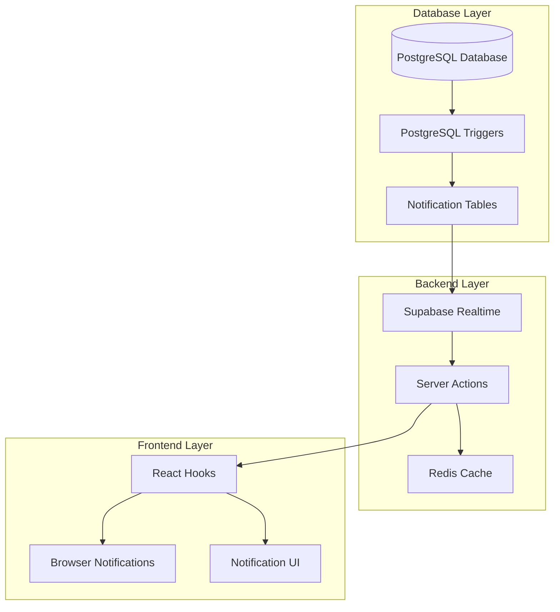
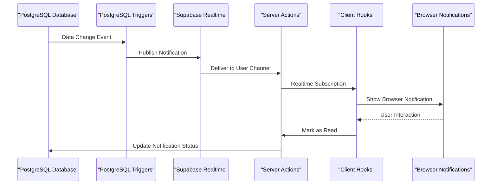
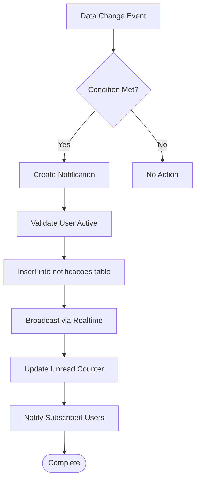
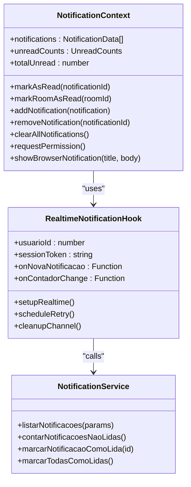
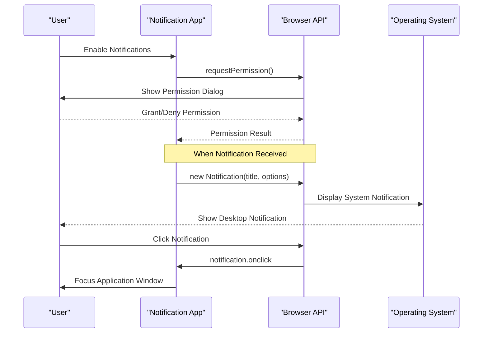
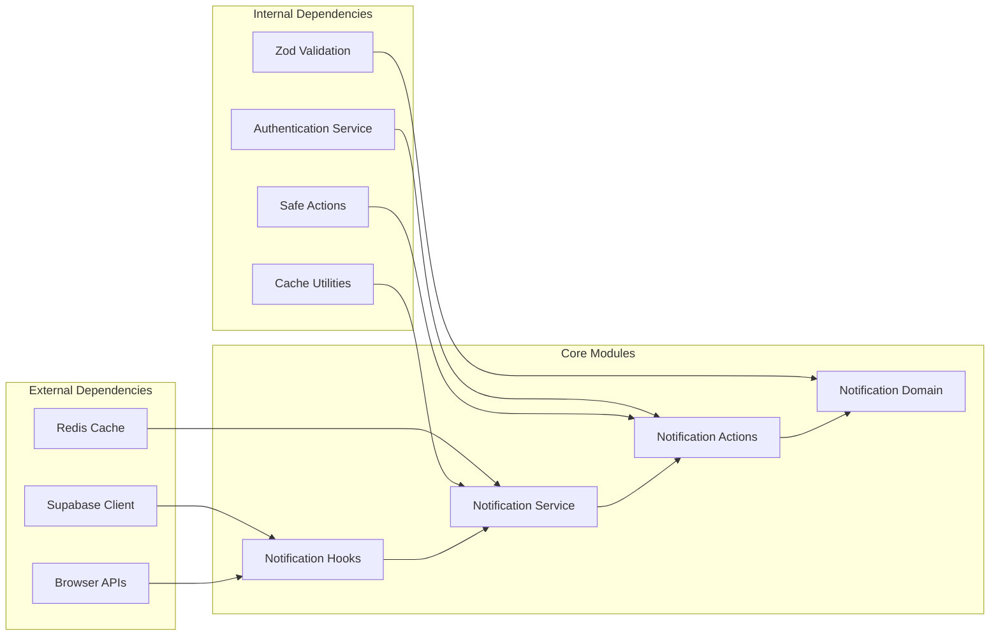

# Notification System

<cite>
**Referenced Files in This Document**
- [use-notifications.tsx](file://src/hooks/use-notifications.tsx)
- [50_notificacoes.sql](file://supabase/schemas/50_notificacoes.sql)
- [50_notificacoes_functions.sql](file://supabase/schemas/50_notificacoes_functions.sql)
- [use-notificacoes.ts](file://src/app/(authenticated)/notificacoes/hooks/use-notificacoes.ts)
- [domain.ts](file://src/app/(authenticated)/notificacoes/domain.ts)
- [notificacoes-actions.ts](file://src/app/(authenticated)/notificacoes/actions/notificacoes-actions.ts)
- [service.ts](file://src/app/(authenticated)/notificacoes/service.ts)
- [01_enums.sql](file://supabase/schemas/01_enums.sql)
- [notificacoes.tsx](file://src/app/(authenticated)/ajuda/content/configuracoes/notificacoes.tsx)
</cite>

## Table of Contents
1. [Introduction](#introduction)
2. [Project Structure](#project-structure)
3. [Core Components](#core-components)
4. [Architecture Overview](#architecture-overview)
5. [Detailed Component Analysis](#detailed-component-analysis)
6. [Dependency Analysis](#dependency-analysis)
7. [Performance Considerations](#performance-considerations)
8. [Troubleshooting Guide](#troubleshooting-guide)
9. [Conclusion](#conclusion)

## Introduction

The Notification System in Zattar-OS is a comprehensive real-time notification infrastructure that delivers timely alerts to users about important events related to their assigned legal processes. The system combines PostgreSQL triggers for automatic event detection, Supabase Realtime for instant delivery, and a robust client-side management layer with browser push notifications.

The system handles four primary notification categories: process assignments, hearing notifications, document deadline reminders, and movement notifications. It supports both in-app notifications and browser push notifications, with sophisticated filtering and user preference management capabilities.

## Project Structure

The notification system is organized across three main layers:

**Diagram sources**
- [50_notificacoes.sql:1-70](file://supabase/schemas/50_notificacoes.sql#L1-L70)
- [50_notificacoes_functions.sql:1-708](file://supabase/schemas/50_notificacoes_functions.sql#L1-L708)
- [use-notificacoes.ts](file://src/app/(authenticated)/notificacoes/hooks/use-notificacoes.ts#L1-L646)

**Section sources**
- [50_notificacoes.sql:1-70](file://supabase/schemas/50_notificacoes.sql#L1-L70)
- [50_notificacoes_functions.sql:1-708](file://supabase/schemas/50_notificacoes_functions.sql#L1-L708)

## Core Components

### Database Schema and Triggers

The notification system is built on a robust PostgreSQL foundation with specialized tables and triggers:

**Notification Types**: The system defines eight notification categories through the `tipo_notificacao_usuario` enum:
- Process assignments (`processo_atribuido`)
- Movement notifications (`processo_movimentacao`)
- Hearing assignments (`audiencia_atribuida`)
- Hearing changes (`audiencia_alterada`)
- Document assignments (`expediente_atribuido`)
- Document changes (`expediente_alterado`)
- Upcoming deadlines (`prazo_vencendo`)
- Overdue deadlines (`prazo_vencido`)

**Real-time Architecture**: PostgreSQL triggers automatically detect relevant events and broadcast notifications through Supabase Realtime channels. The system uses a dedicated `notificacoes` table with optimized indexing for performance.

**Security Model**: Row Level Security ensures users only receive notifications intended for them, with separate policies for service roles and authenticated users.

### Frontend Management Hooks

The client-side implementation provides two complementary approaches:

**use-notifications Hook**: Specialized for chat room notifications with browser push support and secure local storage for notification persistence.

**useNotificacoes Hook**: Comprehensive notification management with Realtime subscriptions, polling fallback, and sophisticated retry mechanisms.

### Browser Push Notifications

The system integrates native browser notification APIs with intelligent permission management, automatic dismissal after 5 seconds, and click-through handling that focuses the application window.

**Section sources**
- [01_enums.sql:283-294](file://supabase/schemas/01_enums.sql#L283-L294)
- [use-notifications.tsx:1-314](file://src/hooks/use-notifications.tsx#L1-L314)
- [use-notificacoes.ts](file://src/app/(authenticated)/notificacoes/hooks/use-notificacoes.ts#L1-L646)

## Architecture Overview

The notification system follows a publish-subscribe pattern with multiple delivery channels:

**Diagram sources**
- [50_notificacoes_functions.sql:68-84](file://supabase/schemas/50_notificacoes_functions.sql#L68-L84)
- [use-notificacoes.ts](file://src/app/(authenticated)/notificacoes/hooks/use-notificacoes.ts#L420-L468)

The architecture supports both immediate real-time delivery and reliable fallback mechanisms for network interruptions.

## Detailed Component Analysis

### Real-time Notification Delivery

The system employs PostgreSQL triggers to automatically detect relevant events and broadcast notifications:

**Diagram sources**
- [50_notificacoes_functions.sql:94-137](file://supabase/schemas/50_notificacoes_functions.sql#L94-L137)
- [50_notificacoes_functions.sql:230-277](file://supabase/schemas/50_notificacoes_functions.sql#L230-L277)

**Notification Trigger Categories**:
- **Process Assignments**: Automatic notifications when users are assigned to legal processes
- **Movement Tracking**: Notifications for new procedural movements in assigned processes
- **Hearing Management**: Real-time alerts for hearing assignments and modifications
- **Document Deadlines**: Automated reminders for upcoming and overdue document deadlines

### Client-side Notification Management

The frontend implements sophisticated real-time subscription management with automatic retry mechanisms:

**Diagram sources**
- [use-notifications.tsx:22-33](file://src/hooks/use-notifications.tsx#L22-L33)
- [use-notificacoes.ts](file://src/app/(authenticated)/notificacoes/hooks/use-notificacoes.ts#L262-L267)
- [service.ts](file://src/app/(authenticated)/notificacoes/service.ts#L1-L209)

### Browser Push Notification Implementation

The system provides native browser notification support with intelligent permission management:

**Diagram sources**
- [use-notifications.tsx:244-294](file://src/hooks/use-notifications.tsx#L244-L294)

### Notification Storage and Persistence

The system implements a hybrid storage approach combining database persistence with secure local storage:

**Database Storage**: PostgreSQL `notificacoes` table with optimized indexing for user-specific queries and unread counters
**Local Storage**: Secure encrypted storage for notification state and unread counts with TTL management
**Cache Layer**: Redis caching for frequently accessed notification statistics with user-segregated keys

**Section sources**
- [50_notificacoes.sql:32-36](file://supabase/schemas/50_notificacoes.sql#L32-L36)
- [use-notifications.tsx:57-67](file://src/hooks/use-notifications.tsx#L57-L67)
- [service.ts](file://src/app/(authenticated)/notificacoes/service.ts#L138-L146)

## Dependency Analysis

The notification system has well-defined dependencies across layers:

**Diagram sources**
- [use-notificacoes.ts](file://src/app/(authenticated)/notificacoes/hooks/use-notificacoes.ts#L10-L32)
- [service.ts](file://src/app/(authenticated)/notificacoes/service.ts#L16-L32)
- [notificacoes-actions.ts](file://src/app/(authenticated)/notificacoes/actions/notificacoes-actions.ts#L10-L16)

**Section sources**
- [use-notificacoes.ts](file://src/app/(authenticated)/notificacoes/hooks/use-notificacoes.ts#L10-L32)
- [service.ts](file://src/app/(authenticated)/notificacoes/service.ts#L16-L32)

## Performance Considerations

### Database Optimization

The notification system implements several performance optimizations:

**Index Strategy**: Strategic indexing on `usuario_id`, `lida` status, and entity relationships to minimize query times for user-specific notifications.

**Query Optimization**: Separate optimized queries for notification listing versus unread counting to reduce database load during frequent polling cycles.

**Real-time Efficiency**: PostgreSQL triggers minimize application logic overhead by handling notification creation at the database level.

### Client-side Optimizations

**Connection Management**: Sophisticated retry mechanisms with exponential backoff prevent connection storms during network issues.

**Memory Management**: Automatic cleanup of orphan channels prevents memory leaks in long-running applications.

**Cache Strategy**: User-segregated Redis caching reduces database queries while maintaining data isolation.

### Scalability Features

**Horizontal Scaling**: Redis-based caching supports multi-instance deployments without cache invalidation conflicts.

**Rate Limiting**: Built-in rate limiting prevents notification flooding during high-volume events.

**Graceful Degradation**: Automatic fallback from real-time to polling ensures system reliability under various network conditions.

## Troubleshooting Guide

### Common Issues and Solutions

**Real-time Connection Problems**:
- Verify Supabase Realtime authentication is properly configured
- Check network connectivity to Supabase servers
- Monitor retry logs for exponential backoff patterns

**Notification Delivery Failures**:
- Validate PostgreSQL trigger permissions and configurations
- Check notification type enums match expected values
- Verify user authentication state for proper channel subscriptions

**Browser Notification Issues**:
- Confirm browser permission settings allow notification display
- Check notification icon availability and CORS policies
- Validate service worker registration for Progressive Web App features

**Performance Degradation**:
- Monitor Redis cache hit rates and TTL configurations
- Review database query performance and index utilization
- Analyze client-side memory usage and connection pooling

### Monitoring and Debugging

The system includes comprehensive logging for troubleshooting:

**Real-time Debugging**: Structured logs for connection attempts, retry cycles, and channel cleanup operations.

**Database Triggers**: Audit trails for notification creation and delivery status tracking.

**Client-side Analytics**: Performance metrics for notification delivery timing and user interaction patterns.

**Section sources**
- [use-notificacoes.ts](file://src/app/(authenticated)/notificacoes/hooks/use-notificacoes.ts#L470-L492)
- [use-notificacoes.ts](file://src/app/(authenticated)/notificacoes/hooks/use-notificacoes.ts#L502-L531)

## Conclusion

The Zattar-OS Notification System provides a robust, scalable solution for delivering real-time alerts to legal professionals. Its architecture balances immediate real-time delivery with reliable fallback mechanisms, ensuring users stay informed about critical events affecting their cases.

The system's strength lies in its comprehensive coverage of legal process notifications, sophisticated real-time architecture, and user-centric design that respects privacy and performance. The combination of PostgreSQL triggers, Supabase Realtime, and intelligent client-side management creates a resilient notification infrastructure suitable for production environments.

Future enhancements could include advanced filtering capabilities, notification scheduling, and integration with external communication channels, building upon the solid foundation established by the current implementation.