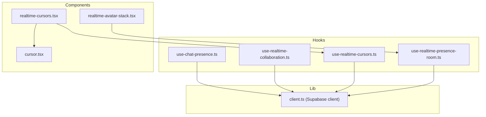
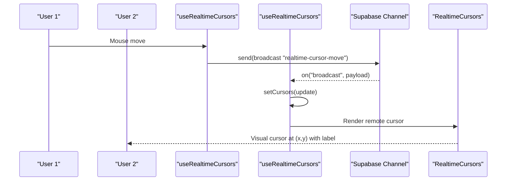
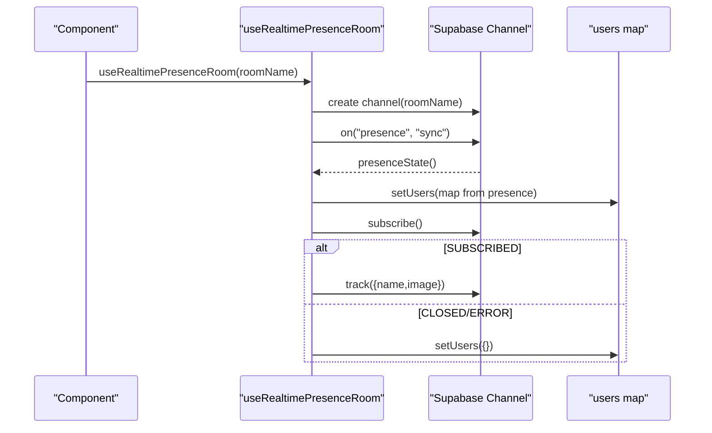
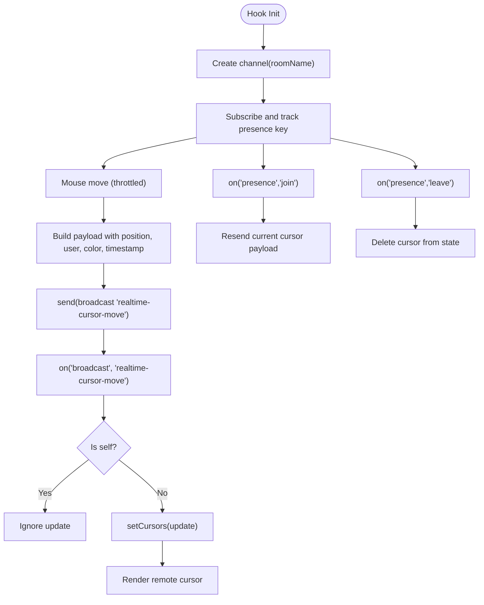
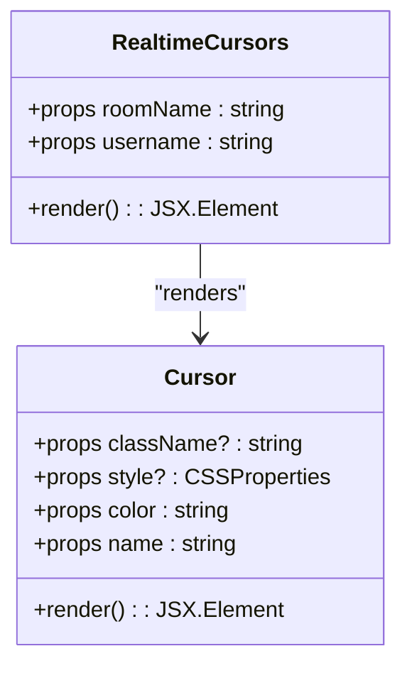
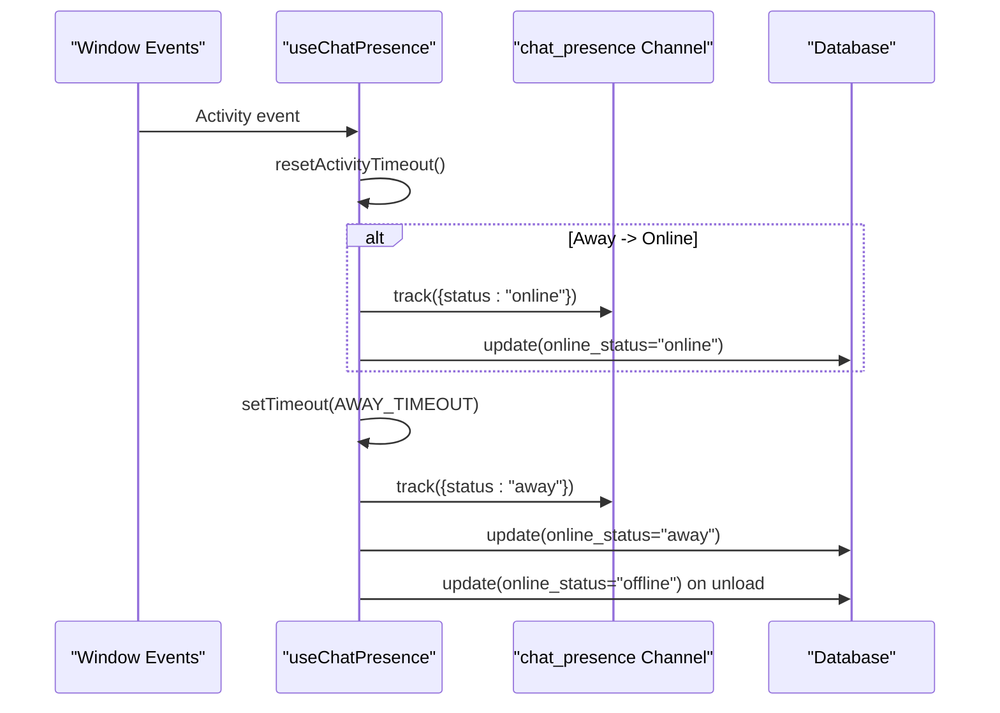
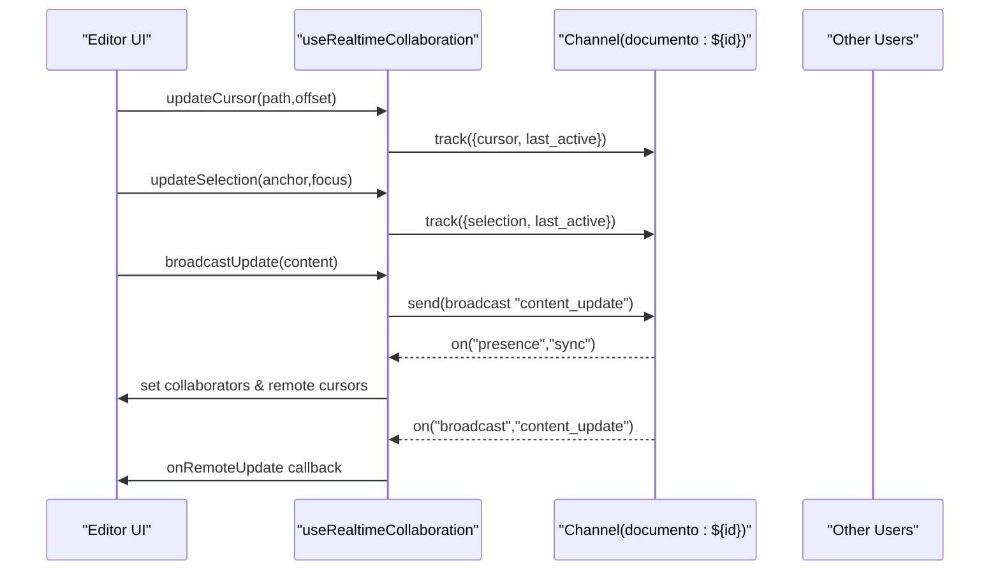
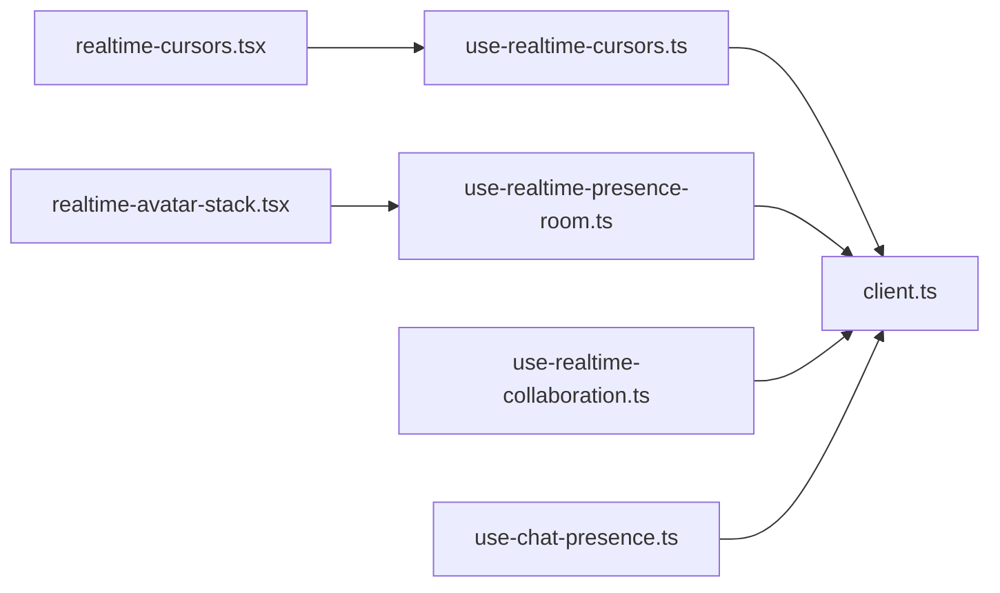

# Presence Indicators

<cite>
**Referenced Files in This Document**
- [use-realtime-presence-room.ts](file://src/hooks/use-realtime-presence-room.ts)
- [use-realtime-cursors.ts](file://src/hooks/use-realtime-cursors.ts)
- [use-realtime-collaboration.ts](file://src/hooks/use-realtime-collaboration.ts)
- [realtime-cursors.tsx](file://src/components/realtime/realtime-cursors.tsx)
- [cursor.tsx](file://src/components/realtime/cursor.tsx)
- [realtime-avatar-stack.tsx](file://src/components/realtime/realtime-avatar-stack.tsx)
- [use-chat-presence.ts](file://src/app/(authenticated)/chat/hooks/use-chat-presence.ts)
- [client.ts](file://src/lib/supabase/client.ts)
</cite>

## Table of Contents
1. [Introduction](#introduction)
2. [Project Structure](#project-structure)
3. [Core Components](#core-components)
4. [Architecture Overview](#architecture-overview)
5. [Detailed Component Analysis](#detailed-component-analysis)
6. [Dependency Analysis](#dependency-analysis)
7. [Performance Considerations](#performance-considerations)
8. [Troubleshooting Guide](#troubleshooting-guide)
9. [Conclusion](#conclusion)

## Introduction
This document explains the Presence Indicators system that enables real-time user presence tracking, cursor sharing, and collaborative editing features. It covers presence rooms, user status management, cursor synchronization, and the implementation of the useRealtimeCursors and useRealtimePresenceRoom hooks. It also documents WebSocket connections via Supabase Realtime, user activity detection, session management, practical examples for rendering cursors and avatars, and performance optimization strategies for large user groups.

## Project Structure
The Presence Indicators system is implemented primarily in React hooks and components under the src/hooks and src/components/realtime directories. Supabase Realtime is used for WebSocket-based communication, and a dedicated client factory ensures SSR-safe initialization.

**Diagram sources**
- [use-realtime-presence-room.ts:1-56](file://src/hooks/use-realtime-presence-room.ts#L1-L56)
- [use-realtime-cursors.ts:1-177](file://src/hooks/use-realtime-cursors.ts#L1-L177)
- [use-realtime-collaboration.ts:1-244](file://src/hooks/use-realtime-collaboration.ts#L1-L244)
- [use-chat-presence.ts](file://src/app/(authenticated)/chat/hooks/use-chat-presence.ts#L1-L191)
- [realtime-cursors.tsx:1-30](file://src/components/realtime/realtime-cursors.tsx#L1-L30)
- [cursor.tsx:1-28](file://src/components/realtime/cursor.tsx#L1-L28)
- [realtime-avatar-stack.tsx:1-18](file://src/components/realtime/realtime-avatar-stack.tsx#L1-L18)
- [client.ts:204-240](file://src/lib/supabase/client.ts#L204-L240)

**Section sources**
- [use-realtime-presence-room.ts:1-56](file://src/hooks/use-realtime-presence-room.ts#L1-L56)
- [use-realtime-cursors.ts:1-177](file://src/hooks/use-realtime-cursors.ts#L1-L177)
- [use-realtime-collaboration.ts:1-244](file://src/hooks/use-realtime-collaboration.ts#L1-L244)
- [realtime-cursors.tsx:1-30](file://src/components/realtime/realtime-cursors.tsx#L1-L30)
- [cursor.tsx:1-28](file://src/components/realtime/cursor.tsx#L1-L28)
- [realtime-avatar-stack.tsx:1-18](file://src/components/realtime/realtime-avatar-stack.tsx#L1-L18)
- [client.ts:204-240](file://src/lib/supabase/client.ts#L204-L240)

## Core Components
- Presence Room Hook: Tracks users in a named room and exposes a users map for rendering presence indicators.
- Realtime Cursors Hook: Throttles mouse movement, tracks presence, and synchronizes cursor positions across users.
- Realtime Collaboration Hook: Manages presence, cursor selections, and content updates for collaborative editing.
- Cursor Rendering Component: Renders remote cursors with colored pointers and user labels.
- Avatar Stack Component: Displays a stack of avatars for users present in a room.
- Chat Presence Hook: Tracks user online/away/offline status using activity events and persists state to the database.
- Supabase Client Factory: Provides a singleton, SSR-safe client with noise filtering for auth locks.

**Section sources**
- [use-realtime-presence-room.ts:16-55](file://src/hooks/use-realtime-presence-room.ts#L16-L55)
- [use-realtime-cursors.ts:61-177](file://src/hooks/use-realtime-cursors.ts#L61-L177)
- [use-realtime-collaboration.ts:53-242](file://src/hooks/use-realtime-collaboration.ts#L53-L242)
- [realtime-cursors.tsx:8-29](file://src/components/realtime/realtime-cursors.tsx#L8-L29)
- [cursor.tsx:4-27](file://src/components/realtime/cursor.tsx#L4-L27)
- [realtime-avatar-stack.tsx:7-17](file://src/components/realtime/realtime-avatar-stack.tsx#L7-L17)
- [use-chat-presence.ts](file://src/app/(authenticated)/chat/hooks/use-chat-presence.ts#L45-L190)
- [client.ts:204-240](file://src/lib/supabase/client.ts#L204-L240)

## Architecture Overview
The system uses Supabase Realtime channels for presence tracking and broadcasting:
- Presence channels maintain a synchronized state of connected users.
- Broadcast channels propagate cursor movements and content updates.
- Hooks encapsulate lifecycle management, throttling, and state updates.
- Components render presence indicators and cursors efficiently.

**Diagram sources**
- [use-realtime-cursors.ts:77-105](file://src/hooks/use-realtime-cursors.ts#L77-L105)
- [use-realtime-cursors.ts:133-148](file://src/hooks/use-realtime-cursors.ts#L133-L148)
- [realtime-cursors.tsx:8-29](file://src/components/realtime/realtime-cursors.tsx#L8-L29)

**Section sources**
- [use-realtime-cursors.ts:107-177](file://src/hooks/use-realtime-cursors.ts#L107-L177)
- [realtime-cursors.tsx:1-30](file://src/components/realtime/realtime-cursors.tsx#L1-L30)

## Detailed Component Analysis

### Presence Rooms and User Status Management
The presence room hook creates a named channel and tracks presence entries. On sync events, it rebuilds a users map from the channel’s presence state. It registers the current user on subscribe and clears state on disconnect.

**Diagram sources**
- [use-realtime-presence-room.ts:23-52](file://src/hooks/use-realtime-presence-room.ts#L23-L52)

**Section sources**
- [use-realtime-presence-room.ts:16-55](file://src/hooks/use-realtime-presence-room.ts#L16-L55)

### Realtime Cursors Hook
The realtime cursors hook:
- Generates a random color and numeric user ID per session.
- Throttles mousemove events to reduce network traffic.
- Sends broadcast events with cursor position, user info, and timestamp.
- Syncs presence join/leave events to manage remote cursors.
- Tracks presence key for self-identification to avoid rendering own cursor.

**Diagram sources**
- [use-realtime-cursors.ts:61-177](file://src/hooks/use-realtime-cursors.ts#L61-L177)

**Section sources**
- [use-realtime-cursors.ts:61-177](file://src/hooks/use-realtime-cursors.ts#L61-L177)

### Realtime Cursors Component
The RealtimeCursors component:
- Uses the realtime cursors hook with a throttle interval.
- Iterates over the cursors map and renders a Cursor component for each remote user.
- Applies fixed positioning and transitions for smooth movement.

**Diagram sources**
- [realtime-cursors.tsx:8-29](file://src/components/realtime/realtime-cursors.tsx#L8-L29)
- [cursor.tsx:4-27](file://src/components/realtime/cursor.tsx#L4-L27)

**Section sources**
- [realtime-cursors.tsx:1-30](file://src/components/realtime/realtime-cursors.tsx#L1-L30)
- [cursor.tsx:1-28](file://src/components/realtime/cursor.tsx#L1-L28)

### Avatar Stack Component
The RealtimeAvatarStack component:
- Consumes the presence room hook to obtain the users map.
- Converts the map into an array of avatar objects with name and image.
- Renders an AvatarStack component with the computed avatars.

**Section sources**
- [realtime-avatar-stack.tsx:1-18](file://src/components/realtime/realtime-avatar-stack.tsx#L1-L18)
- [use-realtime-presence-room.ts:16-55](file://src/hooks/use-realtime-presence-room.ts#L16-L55)

### Chat Presence Hook (User Activity Detection)
The chat presence hook:
- Creates a dedicated presence channel for chat.
- Resets an away timeout on user activity (mouse move, key down, click, scroll, touch).
- Updates user status in the database via Supabase and persists it on unload.
- Exposes helpers to check online status and retrieve status for any user.

**Diagram sources**
- [use-chat-presence.ts](file://src/app/(authenticated)/chat/hooks/use-chat-presence.ts#L75-L172)

**Section sources**
- [use-chat-presence.ts](file://src/app/(authenticated)/chat/hooks/use-chat-presence.ts#L45-L190)

### Realtime Collaboration Hook (Collaborative Editing)
The realtime collaboration hook:
- Manages presence for collaborative editing sessions.
- Tracks cursor and selection state for remote users.
- Broadcasts content updates to peers.
- Provides callbacks for presence changes, remote updates, and remote cursors.

**Diagram sources**
- [use-realtime-collaboration.ts:88-242](file://src/hooks/use-realtime-collaboration.ts#L88-L242)

**Section sources**
- [use-realtime-collaboration.ts:53-242](file://src/hooks/use-realtime-collaboration.ts#L53-L242)

### Supabase Client Factory
The Supabase client factory:
- Ensures SSR-safe creation of the browser client.
- Installs filters to suppress benign auth lock warnings.
- Provides a singleton client with configured cookies and user storage.

**Section sources**
- [client.ts:204-240](file://src/lib/supabase/client.ts#L204-L240)

## Dependency Analysis
The Presence Indicators system relies on Supabase Realtime for:
- Presence synchronization across users.
- Broadcasting cursor and content updates.
- Session lifecycle management (subscribe/unsubscribe).

**Diagram sources**
- [use-realtime-cursors.ts:1-40](file://src/hooks/use-realtime-cursors.ts#L1-L40)
- [use-realtime-presence-room.ts:3-8](file://src/hooks/use-realtime-presence-room.ts#L3-L8)
- [use-realtime-collaboration.ts:7-8](file://src/hooks/use-realtime-collaboration.ts#L7-L8)
- [use-chat-presence.ts](file://src/app/(authenticated)/chat/hooks/use-chat-presence.ts#L12-L13)
- [realtime-cursors.tsx:3-4](file://src/components/realtime/realtime-cursors.tsx#L3-L4)
- [realtime-avatar-stack.tsx:4-4](file://src/components/realtime/realtime-avatar-stack.tsx#L4-L4)
- [client.ts:204-240](file://src/lib/supabase/client.ts#L204-L240)

**Section sources**
- [use-realtime-cursors.ts:1-40](file://src/hooks/use-realtime-cursors.ts#L1-L40)
- [use-realtime-presence-room.ts:3-8](file://src/hooks/use-realtime-presence-room.ts#L3-L8)
- [use-realtime-collaboration.ts:7-8](file://src/hooks/use-realtime-collaboration.ts#L7-L8)
- [use-chat-presence.ts](file://src/app/(authenticated)/chat/hooks/use-chat-presence.ts#L12-L13)
- [realtime-cursors.tsx:3-4](file://src/components/realtime/realtime-cursors.tsx#L3-L4)
- [realtime-avatar-stack.tsx:4-4](file://src/components/realtime/realtime-avatar-stack.tsx#L4-L4)
- [client.ts:204-240](file://src/lib/supabase/client.ts#L204-L240)

## Performance Considerations
- Throttling: The realtime cursors hook throttles mousemove events to limit broadcast frequency and reduce bandwidth usage.
- Presence Tracking: Presence state is recomputed on sync events; keep payload minimal to reduce serialization overhead.
- Conditional Rendering: Components render only remote cursors and avatars, avoiding unnecessary DOM nodes.
- Cleanup: Channels are unsubscribed on component unmount to prevent memory leaks and stale updates.
- Offline Handling: While the current hooks rely on Realtime, consider implementing fallback mechanisms (e.g., polling) similar to notification hooks for degraded connectivity scenarios.

[No sources needed since this section provides general guidance]

## Troubleshooting Guide
- Cursors not appearing:
  - Verify the roomName is consistent across participants.
  - Ensure the realtime cursors hook is mounted and subscribed.
  - Confirm presence join/leave events are firing and not filtering out remote cursors.
- Presence room empty:
  - Check that track is called after subscription.
  - Validate that the presence sync handler rebuilds the users map correctly.
- Chat presence status stuck:
  - Confirm activity events are attached and the away timeout is being reset.
  - Verify database updates succeed and beforeunload cleanup runs.
- Connection issues:
  - Inspect subscription status and handle CLOSED/ERROR states by resetting state and attempting reconnection.
  - Review Supabase client configuration and environment variables.

**Section sources**
- [use-realtime-cursors.ts:107-177](file://src/hooks/use-realtime-cursors.ts#L107-L177)
- [use-realtime-presence-room.ts:23-52](file://src/hooks/use-realtime-presence-room.ts#L23-L52)
- [use-chat-presence.ts](file://src/app/(authenticated)/chat/hooks/use-chat-presence.ts#L96-L172)

## Conclusion
The Presence Indicators system leverages Supabase Realtime to deliver robust presence tracking, cursor synchronization, and collaborative editing capabilities. The hooks encapsulate connection lifecycle, throttling, and state management, while components provide efficient rendering of cursors and avatars. By following the performance and troubleshooting recommendations, teams can scale these features effectively for large user groups and resilient offline scenarios.