# Real-time Features

<cite>
**Referenced Files in This Document**
- [use-realtime-collaboration.ts](file://src/hooks/use-realtime-collaboration.ts)
- [use-realtime-cursors.ts](file://src/hooks/use-realtime-cursors.ts)
- [use-realtime-presence-room.ts](file://src/hooks/use-realtime-presence-room.ts)
- [use-realtime-chat.tsx](file://src/hooks/use-realtime-chat.tsx)
- [realtime-chat.tsx](file://src/components/realtime/realtime-chat.tsx)
- [realtime-cursors.tsx](file://src/components/realtime/realtime-cursors.tsx)
- [realtime-avatar-stack.tsx](file://src/components/realtime/realtime-avatar-stack.tsx)
- [cursor.tsx](file://src/components/realtime/cursor.tsx)
- [supabase-yjs-provider.ts](file://src/lib/yjs/supabase-yjs-provider.ts)
- [avatar.tsx](file://src/components/ui/avatar.tsx)
- [user-status-dot.tsx](file://src/app/(authenticated)/usuarios/components/shared/user-status-dot.tsx)
- [chat-header.tsx](file://src/app/(authenticated)/chat/components/chat-header.tsx)
- [SKILL.md (realtime-websocket)](.agents/skills/realtime-websocket/SKILL.md)
- [notificacoes.tsx](file://src/app/(authenticated)/ajuda/content/configuracoes/notificacoes.tsx)
- [use-notificacoes.ts](file://src/app/(authenticated)/notificacoes/hooks/use-notificacoes.ts)
- [cache-keys.ts](file://src/lib/redis/cache-keys.ts)
- [cache-utils.ts](file://src/lib/redis/cache-utils.ts)
- [client.ts](file://src/lib/redis/client.ts)
- [index.ts (Redis)](file://src/lib/redis/index.ts)
- [invalidation.ts](file://src/lib/redis/invalidation.ts)
- [utils.ts](file://src/lib/redis/utils.ts)
</cite>

## Update Summary
**Changes Made**
- Added documentation for the new RealtimeAvatarStack component
- Enhanced presence indicators documentation with AvatarIndicator and UserStatusDot components
- Updated component architecture to reflect the new avatar stack integration
- Expanded real-time presence system documentation to include multiple status display methods

## Table of Contents
1. [Introduction](#introduction)
2. [Project Structure](#project-structure)
3. [Core Components](#core-components)
4. [Architecture Overview](#architecture-overview)
5. [Detailed Component Analysis](#detailed-component-analysis)
6. [Dependency Analysis](#dependency-analysis)
7. [Performance Considerations](#performance-considerations)
8. [Troubleshooting Guide](#troubleshooting-guide)
9. [Conclusion](#conclusion)
10. [Appendices](#appendices)

## Introduction
This document explains the real-time features implemented in the project, focusing on:
- Communication systems using Supabase Realtime channels
- Presence indicators for rooms and collaborative editing
- Collaborative editing powered by Yjs over Supabase Realtime
- Notification systems including push notifications and polling-based alerts
- Practical examples of real-time collaboration, instant messaging, and live updates
- Performance optimization, connection handling, and scalability considerations

The implementation leverages Supabase Realtime for bidirectional messaging, presence tracking, and broadcasting, complemented by Redis utilities for caching and invalidation strategies. The system now includes enhanced avatar-based presence indicators through the AvatarIndicator component and UserStatusDot for comprehensive user status visualization.

## Project Structure
The real-time capabilities are organized around:
- Hooks for real-time collaboration, presence, cursors, and chat
- Components that wrap hooks for UI rendering
- A Yjs provider that integrates CRDT-based collaborative editing via Supabase channels
- Avatar-based presence indicators including RealtimeAvatarStack, AvatarIndicator, and UserStatusDot
- Redis utilities for caching and cache invalidation
- Notification utilities and help documentation for push notifications

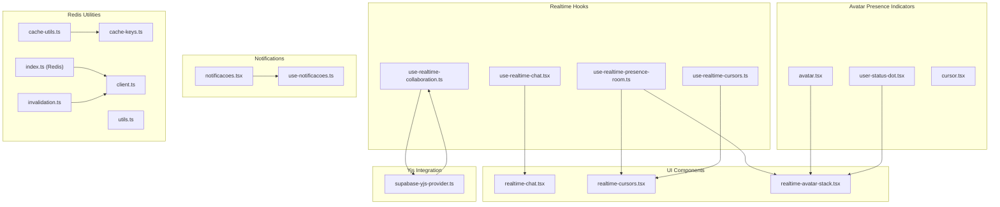

**Diagram sources**
- [use-realtime-collaboration.ts:1-244](file://src/hooks/use-realtime-collaboration.ts#L1-L244)
- [use-realtime-chat.tsx:1-256](file://src/hooks/use-realtime-chat.tsx#L1-L256)
- [use-realtime-presence-room.ts:1-56](file://src/hooks/use-realtime-presence-room.ts#L1-L56)
- [use-realtime-cursors.ts:1-177](file://src/hooks/use-realtime-cursors.ts#L1-L177)
- [realtime-chat.tsx:1-70](file://src/components/realtime/realtime-chat.tsx#L1-L70)
- [realtime-cursors.tsx:1-30](file://src/components/realtime/realtime-cursors.tsx#L1-L30)
- [realtime-avatar-stack.tsx:1-18](file://src/components/realtime/realtime-avatar-stack.tsx#L1-L18)
- [avatar.tsx:105-144](file://src/components/ui/avatar.tsx#L105-L144)
- [user-status-dot.tsx:1-58](file://src/app/(authenticated)/usuarios/components/shared/user-status-dot.tsx#L1-L58)
- [cursor.tsx:1-28](file://src/components/realtime/cursor.tsx#L1-L28)
- [supabase-yjs-provider.ts:1-358](file://src/lib/yjs/supabase-yjs-provider.ts#L1-L358)
- [notificacoes.tsx](file://src/app/(authenticated)/ajuda/content/configuracoes/notificacoes.tsx#L186-L214)
- [use-notificacoes.ts](file://src/app/(authenticated)/notificacoes/hooks/use-notificacoes.ts#L628-L644)
- [cache-keys.ts](file://src/lib/redis/cache-keys.ts)
- [cache-utils.ts](file://src/lib/redis/cache-utils.ts)
- [client.ts](file://src/lib/redis/client.ts)
- [index.ts (Redis)](file://src/lib/redis/index.ts)
- [invalidation.ts](file://src/lib/redis/invalidation.ts)
- [utils.ts](file://src/lib/redis/utils.ts)

**Section sources**
- [use-realtime-collaboration.ts:1-244](file://src/hooks/use-realtime-collaboration.ts#L1-L244)
- [use-realtime-chat.tsx:1-256](file://src/hooks/use-realtime-chat.tsx#L1-L256)
- [use-realtime-presence-room.ts:1-56](file://src/hooks/use-realtime-presence-room.ts#L1-L56)
- [use-realtime-cursors.ts:1-177](file://src/hooks/use-realtime-cursors.ts#L1-L177)
- [realtime-chat.tsx:1-70](file://src/components/realtime/realtime-chat.tsx#L1-L70)
- [realtime-cursors.tsx:1-30](file://src/components/realtime/realtime-cursors.tsx#L1-L30)
- [realtime-avatar-stack.tsx:1-18](file://src/components/realtime/realtime-avatar-stack.tsx#L1-L18)
- [avatar.tsx:105-144](file://src/components/ui/avatar.tsx#L105-L144)
- [user-status-dot.tsx:1-58](file://src/app/(authenticated)/usuarios/components/shared/user-status-dot.tsx#L1-L58)
- [cursor.tsx:1-28](file://src/components/realtime/cursor.tsx#L1-L28)
- [supabase-yjs-provider.ts:1-358](file://src/lib/yjs/supabase-yjs-provider.ts#L1-L358)
- [notificacoes.tsx](file://src/app/(authenticated)/ajuda/content/configuracoes/notificacoes.tsx#L186-L214)
- [use-notificacoes.ts](file://src/app/(authenticated)/notificacoes/hooks/use-notificacoes.ts#L628-L644)
- [cache-keys.ts](file://src/lib/redis/cache-keys.ts)
- [cache-utils.ts](file://src/lib/redis/cache-utils.ts)
- [client.ts](file://src/lib/redis/client.ts)
- [index.ts (Redis)](file://src/lib/redis/index.ts)
- [invalidation.ts](file://src/lib/redis/invalidation.ts)
- [utils.ts](file://src/lib/redis/utils.ts)

## Core Components
- Real-time collaboration hook: Manages presence, broadcast updates, and cursor/selection overlays for collaborative editing.
- Real-time chat hook: Handles message broadcasting, typing indicators, and connection state.
- Presence room hook: Tracks users present in a named room.
- Real-time cursors hook: Broadcasts mouse movement events and renders remote cursors.
- Real-time avatar stack: Displays avatar-based presence indicators for collaborative rooms.
- Yjs provider: Implements a unified provider for CRDT-based collaborative editing over Supabase Realtime.
- Avatar presence indicators: Comprehensive user status display through AvatarIndicator and UserStatusDot components.
- Notification utilities: Provide push notification setup and polling-based alert retrieval.
- Redis utilities: Offer cache keys, cache helpers, client initialization, invalidation, and general utilities.

**Section sources**
- [use-realtime-collaboration.ts:1-244](file://src/hooks/use-realtime-collaboration.ts#L1-L244)
- [use-realtime-chat.tsx:1-256](file://src/hooks/use-realtime-chat.tsx#L1-L256)
- [use-realtime-presence-room.ts:1-56](file://src/hooks/use-realtime-presence-room.ts#L1-L56)
- [use-realtime-cursors.ts:1-177](file://src/hooks/use-realtime-cursors.ts#L1-L177)
- [realtime-avatar-stack.tsx:1-18](file://src/components/realtime/realtime-avatar-stack.tsx#L1-L18)
- [supabase-yjs-provider.ts:1-358](file://src/lib/yjs/supabase-yjs-provider.ts#L1-L358)
- [avatar.tsx:105-144](file://src/components/ui/avatar.tsx#L105-L144)
- [user-status-dot.tsx:1-58](file://src/app/(authenticated)/usuarios/components/shared/user-status-dot.tsx#L1-L58)
- [notificacoes.tsx](file://src/app/(authenticated)/ajuda/content/configuracoes/notificacoes.tsx#L186-L214)
- [use-notificacoes.ts](file://src/app/(authenticated)/notificacoes/hooks/use-notificacoes.ts#L628-L644)
- [cache-keys.ts](file://src/lib/redis/cache-keys.ts)
- [cache-utils.ts](file://src/lib/redis/cache-utils.ts)
- [client.ts](file://src/lib/redis/client.ts)
- [index.ts (Redis)](file://src/lib/redis/index.ts)
- [invalidation.ts](file://src/lib/redis/invalidation.ts)
- [utils.ts](file://src/lib/redis/utils.ts)

## Architecture Overview
The system uses Supabase Realtime channels for:
- Presence tracking to maintain a list of connected users
- Broadcast events for chat messages and collaborative updates
- Awareness updates for Yjs cursors and selections

Enhanced avatar-based presence indicators provide comprehensive user status visualization through multiple components:
- RealtimeAvatarStack: Displays avatar stacks for collaborative rooms
- AvatarIndicator: Shows user status dots on avatars
- UserStatusDot: Provides detailed status indicators with pulse animations

Redis is used for caching and cache invalidation strategies to reduce database load and improve responsiveness.

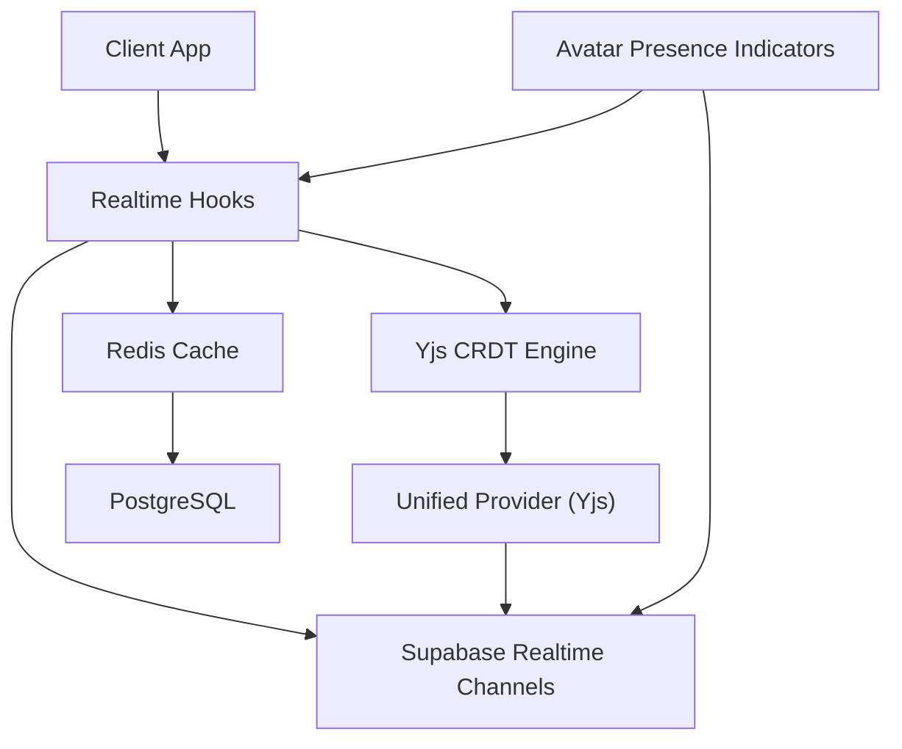

**Diagram sources**
- [use-realtime-collaboration.ts:88-181](file://src/hooks/use-realtime-collaboration.ts#L88-L181)
- [use-realtime-chat.tsx:71-151](file://src/hooks/use-realtime-chat.tsx#L71-L151)
- [use-realtime-presence-room.ts:23-47](file://src/hooks/use-realtime-presence-room.ts#L23-L47)
- [use-realtime-cursors.ts:107-163](file://src/hooks/use-realtime-cursors.ts#L107-L163)
- [realtime-avatar-stack.tsx:7-17](file://src/components/realtime/realtime-avatar-stack.tsx#L7-L17)
- [avatar.tsx:105-144](file://src/components/ui/avatar.tsx#L105-L144)
- [user-status-dot.tsx:32-49](file://src/app/(authenticated)/usuarios/components/shared/user-status-dot.tsx#L32-L49)
- [supabase-yjs-provider.ts:134-192](file://src/lib/yjs/supabase-yjs-provider.ts#L134-L192)
- [cache-keys.ts](file://src/lib/redis/cache-keys.ts)
- [cache-utils.ts](file://src/lib/redis/cache-utils.ts)
- [client.ts](file://src/lib/redis/client.ts)
- [index.ts (Redis)](file://src/lib/redis/index.ts)
- [invalidation.ts](file://src/lib/redis/invalidation.ts)
- [utils.ts](file://src/lib/redis/utils.ts)

## Detailed Component Analysis

### Real-time Collaboration Hook
Manages presence, broadcast updates, and remote cursors for collaborative editing. It:
- Creates a Supabase channel scoped to a document
- Tracks presence with user metadata and selection/cursor info
- Subscribes to presence and broadcast events
- Broadcasts content updates and cursor/selection changes
- Exposes connection state and update functions

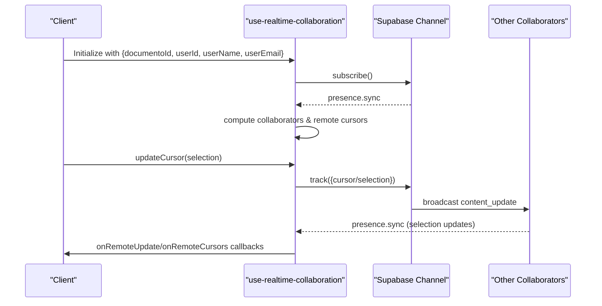

**Diagram sources**
- [use-realtime-collaboration.ts:88-181](file://src/hooks/use-realtime-collaboration.ts#L88-L181)
- [use-realtime-collaboration.ts:141-154](file://src/hooks/use-realtime-collaboration.ts#L141-L154)

**Section sources**
- [use-realtime-collaboration.ts:1-244](file://src/hooks/use-realtime-collaboration.ts#L1-L244)

### Real-time Avatar Stack Component
Displays avatar-based presence indicators for collaborative rooms:
- Integrates with useRealtimePresenceRoom hook to get current users
- Converts user data to avatar format for AvatarStack component
- Automatically updates when presence changes
- Provides a compact visual representation of active collaborators

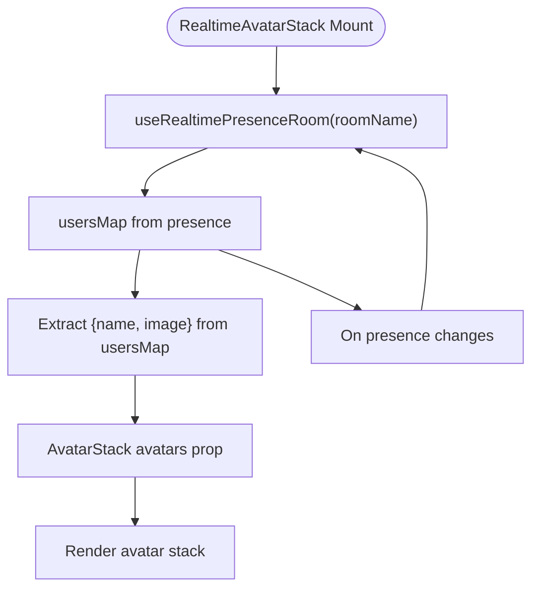

**Diagram sources**
- [realtime-avatar-stack.tsx:7-17](file://src/components/realtime/realtime-avatar-stack.tsx#L7-L17)
- [use-realtime-presence-room.ts:23-47](file://src/hooks/use-realtime-presence-room.ts#L23-L47)

**Section sources**
- [realtime-avatar-stack.tsx:1-18](file://src/components/realtime/realtime-avatar-stack.tsx#L1-L18)

### Avatar Presence Indicators System
Comprehensive user status visualization through multiple components:
- AvatarIndicator: Status dot overlay for individual avatars with four variants (online, away, offline, success)
- UserStatusDot: Detailed status indicators with pulse animations and size variants
- Integration with chat components for contact lists and headers

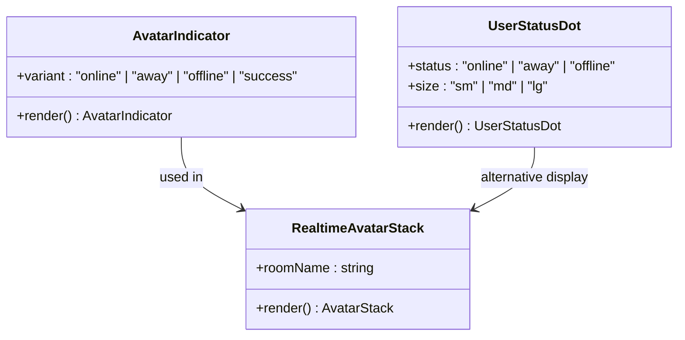

**Diagram sources**
- [avatar.tsx:105-144](file://src/components/ui/avatar.tsx#L105-L144)
- [user-status-dot.tsx:6-58](file://src/app/(authenticated)/usuarios/components/shared/user-status-dot.tsx#L6-L58)
- [realtime-avatar-stack.tsx:1-18](file://src/components/realtime/realtime-avatar-stack.tsx#L1-L18)

**Section sources**
- [avatar.tsx:105-144](file://src/components/ui/avatar.tsx#L105-L144)
- [user-status-dot.tsx:1-58](file://src/app/(authenticated)/usuarios/components/shared/user-status-dot.tsx#L1-L58)
- [realtime-avatar-stack.tsx:1-18](file://src/components/realtime/realtime-avatar-stack.tsx#L1-L18)

### Yjs Provider for Collaborative Editing
Implements a unified provider for Yjs that:
- Creates or uses a Y.Doc and Awareness
- Connects to a Supabase channel named after the document
- Listens for and sends:
  - Yjs updates
  - Sync requests/responses
  - Awareness updates
- Handles connection and sync state changes

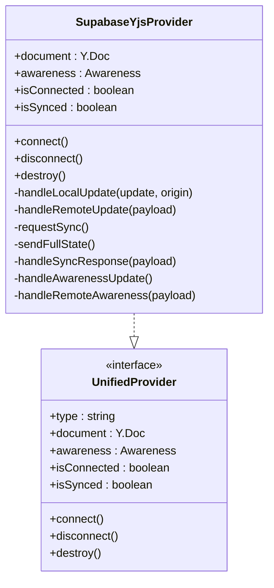

**Diagram sources**
- [supabase-yjs-provider.ts:78-337](file://src/lib/yjs/supabase-yjs-provider.ts#L78-L337)

**Section sources**
- [supabase-yjs-provider.ts:1-358](file://src/lib/yjs/supabase-yjs-provider.ts#L1-L358)

### Real-time Chat Hook and Component
Provides:
- Message broadcasting and deduplication
- Typing indicators with timeouts
- Connection state reporting
- UI wrapper component for chat

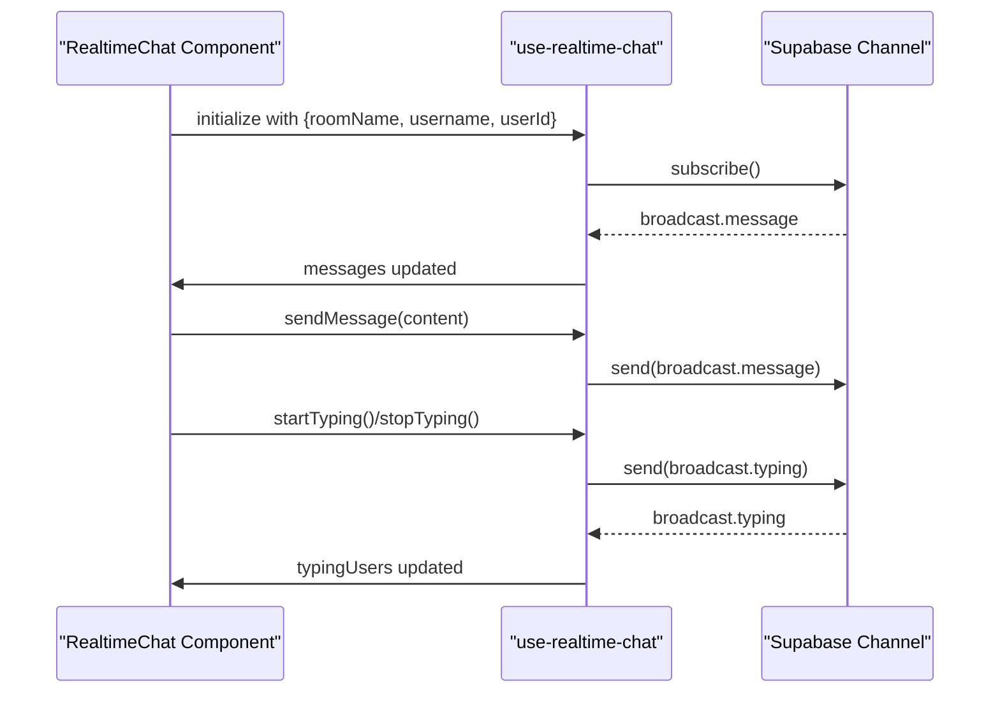

**Diagram sources**
- [use-realtime-chat.tsx:71-151](file://src/hooks/use-realtime-chat.tsx#L71-L151)
- [use-realtime-chat.tsx:204-232](file://src/hooks/use-realtime-chat.tsx#L204-L232)
- [realtime-chat.tsx:14-19](file://src/components/realtime/realtime-chat.tsx#L14-L19)

**Section sources**
- [use-realtime-chat.tsx:1-256](file://src/hooks/use-realtime-chat.tsx#L1-L256)
- [realtime-chat.tsx:1-70](file://src/components/realtime/realtime-chat.tsx#L1-L70)

### Presence Room Hook
Tracks users present in a named room:
- Subscribes to presence events
- Maintains a map of users with name and image
- Tracks current user presence on subscribe

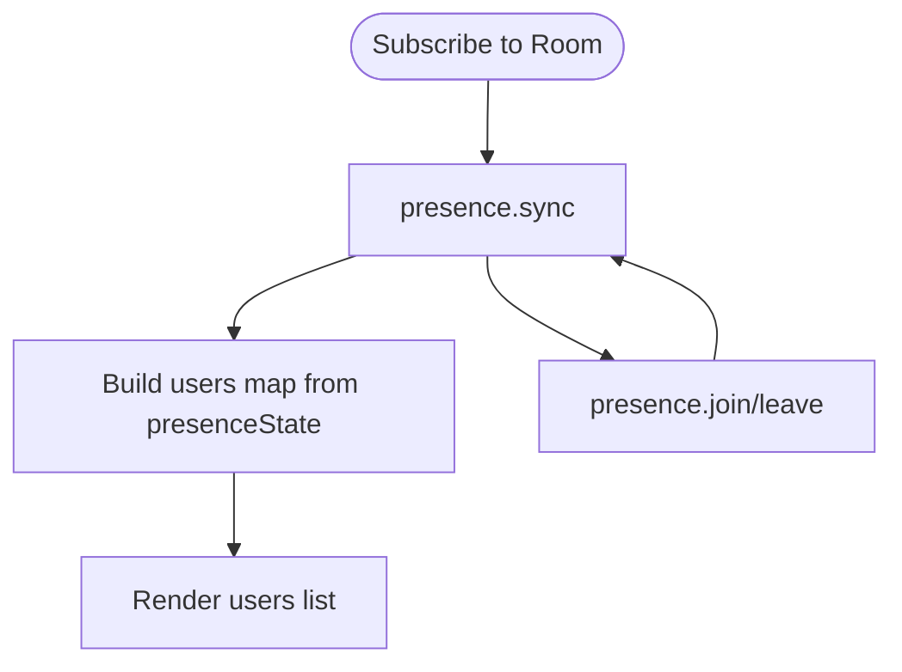

**Diagram sources**
- [use-realtime-presence-room.ts:23-47](file://src/hooks/use-realtime-presence-room.ts#L23-L47)

**Section sources**
- [use-realtime-presence-room.ts:1-56](file://src/hooks/use-realtime-presence-room.ts#L1-L56)

### Real-time Cursors Hook and Component
Broadcasts mouse movement and renders remote cursors:
- Throttles cursor events
- Sends broadcast events with position, user, and color
- Renders cursors for other users

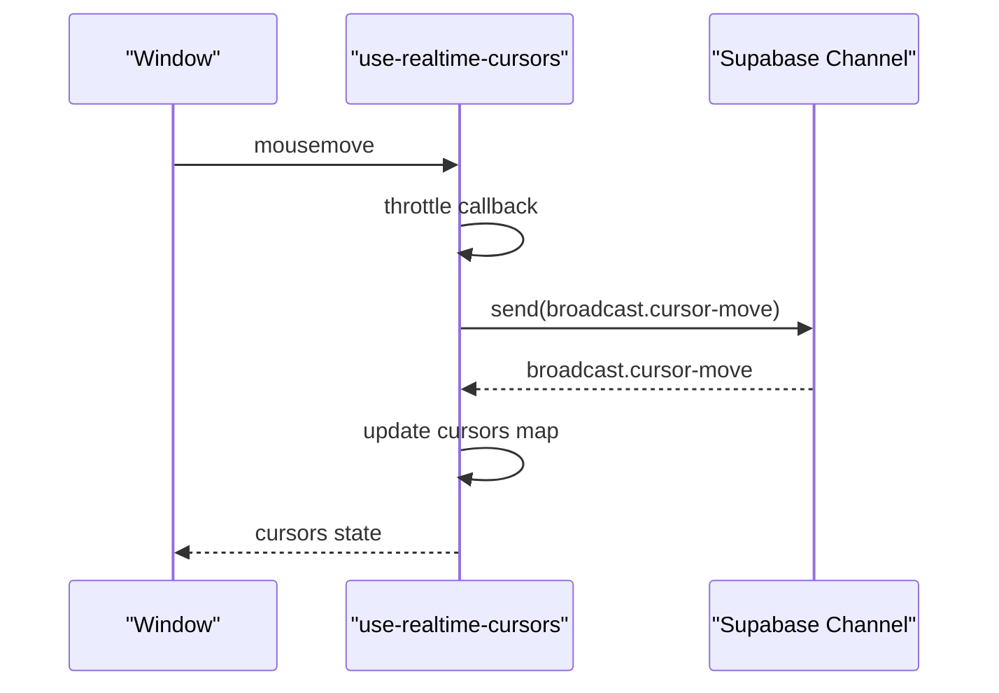

**Diagram sources**
- [use-realtime-cursors.ts:77-105](file://src/hooks/use-realtime-cursors.ts#L77-L105)
- [use-realtime-cursors.ts:133-148](file://src/hooks/use-realtime-cursors.ts#L133-L148)
- [realtime-cursors.tsx:8-9](file://src/components/realtime/realtime-cursors.tsx#L8-L9)

**Section sources**
- [use-realtime-cursors.ts:1-177](file://src/hooks/use-realtime-cursors.ts#L1-L177)
- [realtime-cursors.tsx:1-30](file://src/components/realtime/realtime-cursors.tsx#L1-L30)

### Notification Systems
- Push notifications: Help documentation outlines enabling and testing browser push notifications.
- Polling-based alerts: A hook periodically polls for notifications using a configurable interval.

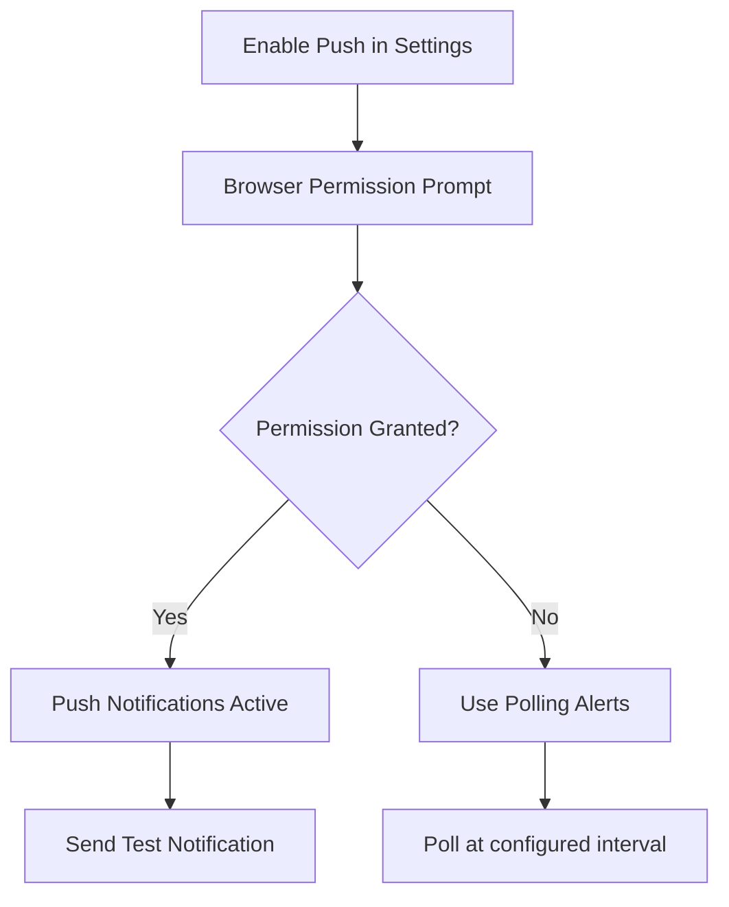

**Diagram sources**
- [notificacoes.tsx](file://src/app/(authenticated)/ajuda/content/configuracoes/notificacoes.tsx#L186-L214)
- [use-notificacoes.ts](file://src/app/(authenticated)/notificacoes/hooks/use-notificacoes.ts#L628-L644)

**Section sources**
- [notificacoes.tsx](file://src/app/(authenticated)/ajuda/content/configuracoes/notificacoes.tsx#L186-L214)
- [use-notificacoes.ts](file://src/app/(authenticated)/notificacoes/hooks/use-notificacoes.ts#L628-L644)

### WebSocket Decision Framework (Optional Hybrid Path)
While the current implementation primarily uses Supabase Realtime, the agent skill documents a framework for choosing WebSockets versus SSE and a hybrid approach combining SSE for server-to-client updates and server actions for mutations.

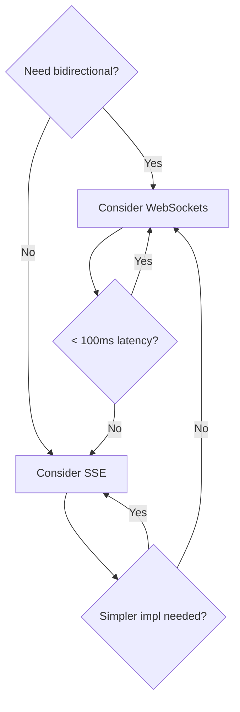

**Diagram sources**
- [.agents/skills/realtime-websocket/SKILL.md:31-50](file://.agents/skills/realtime-websocket/SKILL.md#L31-L50)

**Section sources**
- [.agents/skills/realtime-websocket/SKILL.md:31-515](file://.agents/skills/realtime-websocket/SKILL.md#L31-L515)

## Dependency Analysis
- Supabase Realtime is central to presence, broadcasting, and Yjs synchronization.
- Yjs provider depends on Y.Doc and Awareness for CRDT state and cursor awareness.
- UI components depend on hooks for state and event handling.
- Avatar presence indicators integrate with both Supabase presence and local status calculations.
- Redis utilities provide caching and invalidation mechanisms to offload database reads and manage cache coherence.

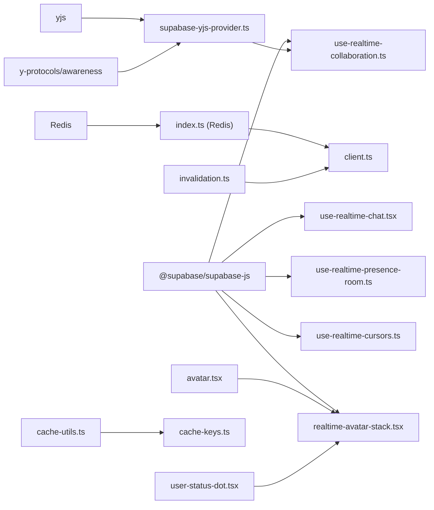

**Diagram sources**
- [use-realtime-collaboration.ts:6-8](file://src/hooks/use-realtime-collaboration.ts#L6-L8)
- [use-realtime-chat.tsx:30-31](file://src/hooks/use-realtime-chat.tsx#L30-L31)
- [use-realtime-presence-room.ts:3-5](file://src/hooks/use-real-time-presence-room.ts#L3-L5)
- [use-realtime-cursors.ts:1-2](file://src/hooks/use-realtime-cursors.ts#L1-L2)
- [realtime-avatar-stack.tsx:3-4](file://src/components/realtime/realtime-avatar-stack.tsx#L3-L4)
- [avatar.tsx:105-144](file://src/components/ui/avatar.tsx#L105-L144)
- [user-status-dot.tsx:1-58](file://src/app/(authenticated)/usuarios/components/shared/user-status-dot.tsx#L1-L58)
- [supabase-yjs-provider.ts:8-10](file://src/lib/yjs/supabase-yjs-provider.ts#L8-L10)
- [index.ts (Redis)](file://src/lib/redis/index.ts)
- [client.ts](file://src/lib/redis/client.ts)
- [cache-utils.ts](file://src/lib/redis/cache-utils.ts)
- [cache-keys.ts](file://src/lib/redis/cache-keys.ts)
- [invalidation.ts](file://src/lib/redis/invalidation.ts)

**Section sources**
- [use-realtime-collaboration.ts:1-244](file://src/hooks/use-realtime-collaboration.ts#L1-L244)
- [use-realtime-chat.tsx:1-256](file://src/hooks/use-realtime-chat.tsx#L1-L256)
- [use-realtime-presence-room.ts:1-56](file://src/hooks/use-realtime-presence-room.ts#L1-L56)
- [use-realtime-cursors.ts:1-177](file://src/hooks/use-realtime-cursors.ts#L1-L177)
- [realtime-avatar-stack.tsx:1-18](file://src/components/realtime/realtime-avatar-stack.tsx#L1-L18)
- [supabase-yjs-provider.ts:1-358](file://src/lib/yjs/supabase-yjs-provider.ts#L1-L358)
- [avatar.tsx:105-144](file://src/components/ui/avatar.tsx#L105-L144)
- [user-status-dot.tsx:1-58](file://src/app/(authenticated)/usuarios/components/shared/user-status-dot.tsx#L1-L58)
- [index.ts (Redis)](file://src/lib/redis/index.ts)
- [client.ts](file://src/lib/redis/client.ts)
- [cache-utils.ts](file://src/lib/redis/cache-utils.ts)
- [cache-keys.ts](file://src/lib/redis/cache-keys.ts)
- [invalidation.ts](file://src/lib/redis/invalidation.ts)

## Performance Considerations
- Presence and broadcast event handling:
  - Use throttling for cursor movement to limit event frequency.
  - Deduplicate messages on the client to avoid redundant renders.
  - Optimize avatar stack rendering by memoizing avatar data extraction.
- Yjs synchronization:
  - Request full sync only when necessary; rely on incremental updates.
  - Avoid echoing remote-origin updates to prevent loops.
- Connection lifecycle:
  - Track connection state and gracefully handle CLOSED/ERROR statuses.
  - Clean up intervals and subscriptions on unmount.
- Avatar presence indicators:
  - Use useMemo for avatar data transformation to prevent unnecessary re-renders.
  - Implement efficient presence state updates to minimize DOM changes.
- Redis caching:
  - Use cache keys and invalidation strategies to minimize database queries.
  - Apply cache utilities to normalize and invalidate cached entries efficiently.

**Section sources**
- [realtime-avatar-stack.tsx:8-14](file://src/components/realtime/realtime-avatar-stack.tsx#L8-L14)
- [use-realtime-collaboration.ts:155-169](file://src/hooks/use-realtime-collaboration.ts#L155-L169)
- [use-realtime-chat.tsx:83-93](file://src/hooks/use-realtime-chat.tsx#L83-L93)
- [use-realtime-chat.tsx:127-143](file://src/hooks/use-realtime-chat.tsx#L127-L143)
- [supabase-yjs-provider.ts:243-250](file://src/lib/yjs/supabase-yjs-provider.ts#L243-L250)
- [invalidation.ts](file://src/lib/redis/invalidation.ts)
- [cache-keys.ts](file://src/lib/redis/cache-keys.ts)

## Troubleshooting Guide
- Connection issues:
  - Verify subscription status and handle SUBSCRIBED/CLOSED/CHANNEL_ERROR transitions.
  - Ensure presence tracking is initialized after successful subscription.
- Duplicate messages:
  - Check for duplicate detection logic and avoid appending messages with existing IDs.
- Typing indicators timing out:
  - Confirm timeout intervals and cleanup logic for stale typing users.
- Yjs sync failures:
  - Validate sync request/response handling and error logging for malformed updates.
- Avatar presence issues:
  - Verify that useRealtimePresenceRoom hook is properly subscribed to the room.
  - Check avatar data extraction in RealtimeAvatarStack component.
  - Ensure AvatarIndicator and UserStatusDot components receive correct props.
- Redis cache problems:
  - Review cache key generation and invalidation flows to ensure cache coherence.

**Section sources**
- [use-realtime-collaboration.ts:155-169](file://src/hooks/use-realtime-collaboration.ts#L155-L169)
- [use-realtime-chat.tsx:83-93](file://src/hooks/use-realtime-chat.tsx#L83-L93)
- [use-realtime-chat.tsx:127-143](file://src/hooks/use-realtime-chat.tsx#L127-L143)
- [realtime-avatar-stack.tsx:7-17](file://src/components/realtime/realtime-avatar-stack.tsx#L7-L17)
- [avatar.tsx:105-144](file://src/components/ui/avatar.tsx#L105-L144)
- [user-status-dot.tsx:32-49](file://src/app/(authenticated)/usuarios/components/shared/user-status-dot.tsx#L32-L49)
- [supabase-yjs-provider.ts:243-250](file://src/lib/yjs/supabase-yjs-provider.ts#L243-L250)
- [invalidation.ts](file://src/lib/redis/invalidation.ts)
- [cache-keys.ts](file://src/lib/redis/cache-keys.ts)

## Conclusion
The project implements robust real-time features centered on Supabase Realtime channels:
- Presence tracking and broadcasting enable collaborative editing and cursor overlays.
- Yjs-based CRDT ensures conflict-free collaborative editing synchronized across clients.
- Enhanced avatar-based presence indicators provide comprehensive user status visualization through RealtimeAvatarStack, AvatarIndicator, and UserStatusDot components.
- Chat components provide instant messaging with typing indicators and optimistic updates.
- Notifications support both push notifications and polling-based alerts.
- Redis utilities enhance performance and scalability through caching and invalidation.

These components work together to deliver responsive, scalable, and user-friendly real-time experiences with rich presence visualization.

## Appendices
- Practical examples:
  - Real-time collaboration: Use the collaboration hook to broadcast content updates and synchronize cursors/selections.
  - Instant messaging: Integrate the chat component to send and receive messages with typing indicators.
  - Live updates: Combine presence and broadcast events to reflect live state changes across clients.
  - Avatar presence: Use RealtimeAvatarStack to display collaborative room participants with avatar indicators.
  - User status: Integrate AvatarIndicator and UserStatusDot for comprehensive user status visualization.
- Scalability tips:
  - Use throttling for high-frequency events (e.g., cursors).
  - Implement efficient cache invalidation and key normalization.
  - Monitor connection states and reconnect strategies for resilience.
  - Optimize avatar data transformation with useMemo for better performance.
  - Use presence state updates to minimize DOM changes in avatar stacks.