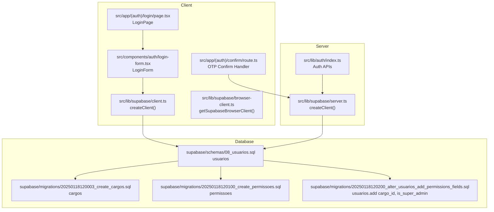
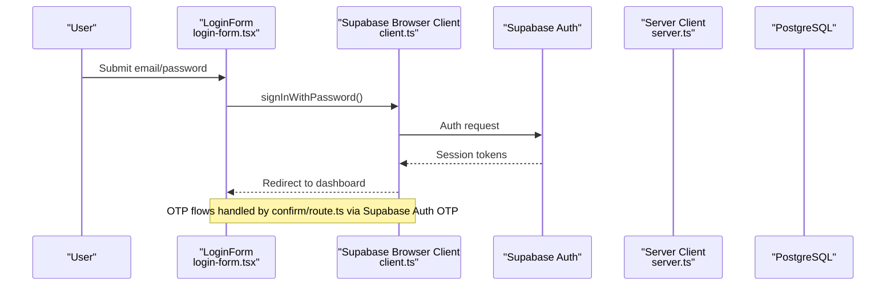
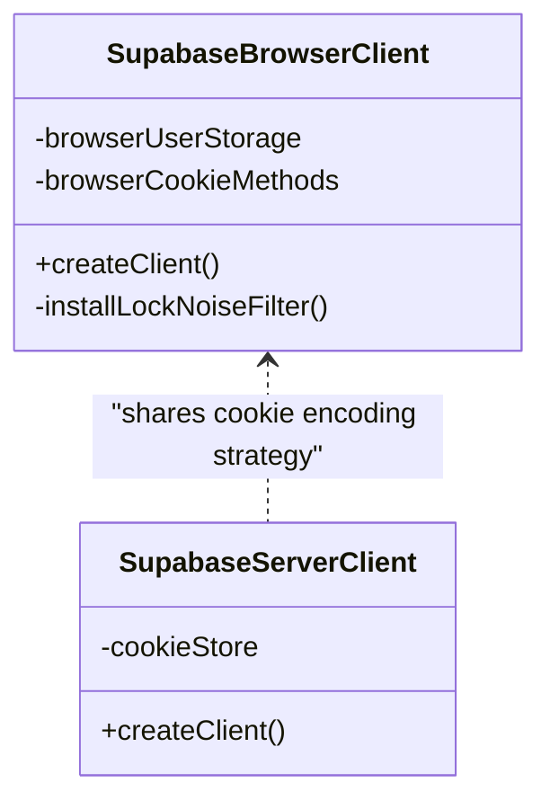
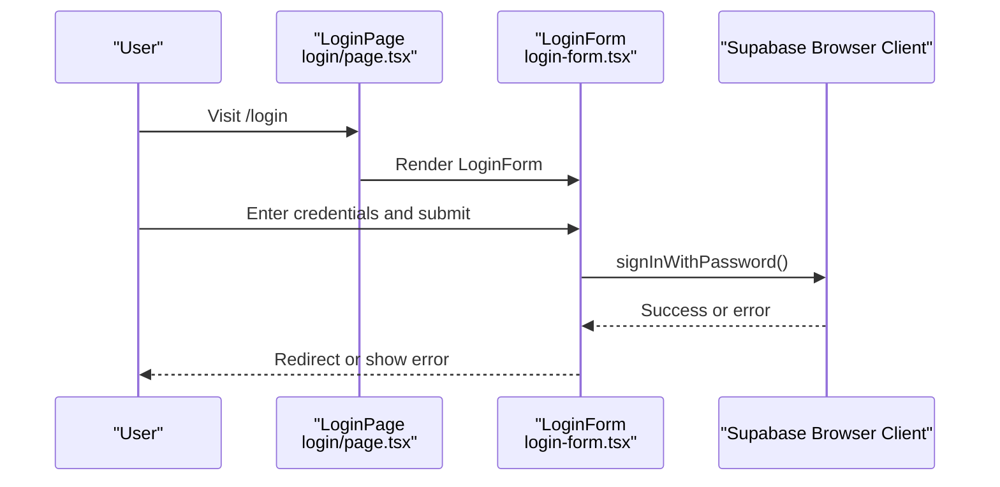
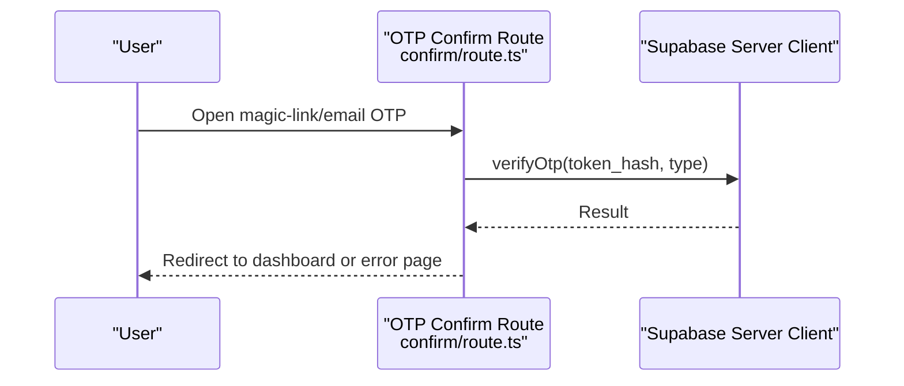
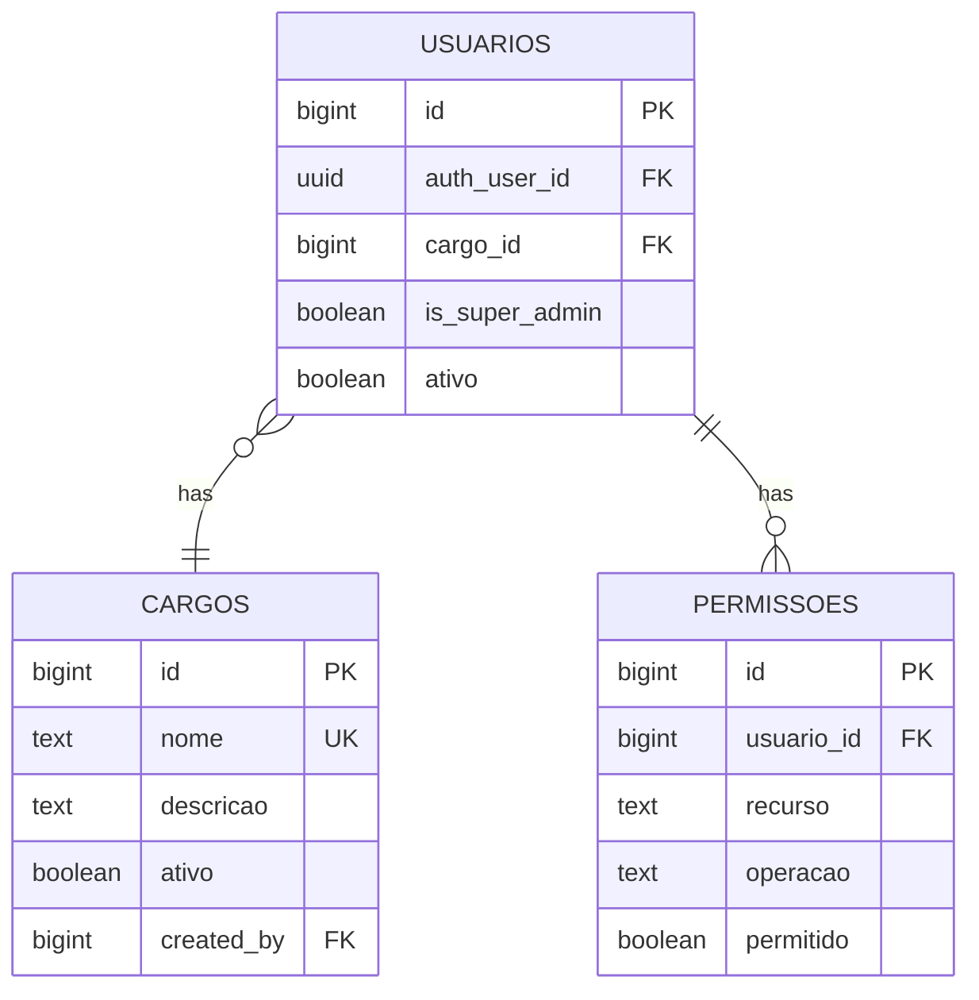
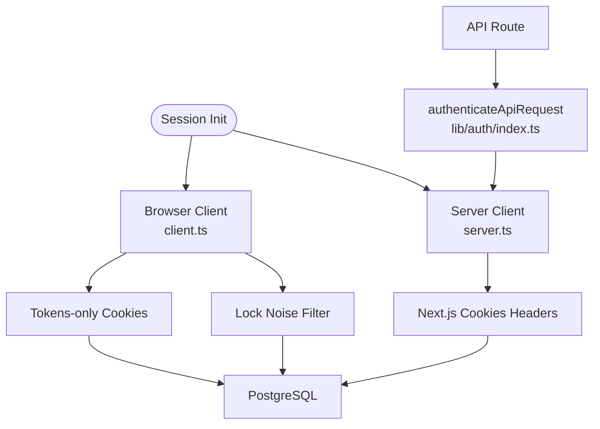
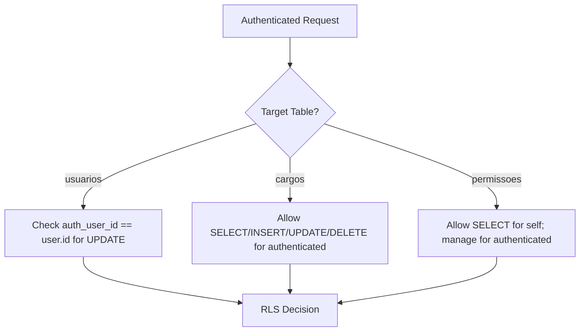
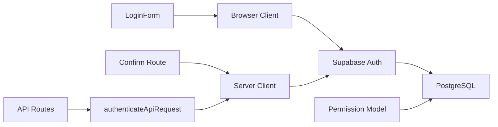

# Authentication and Authorization

<cite>
**Referenced Files in This Document**
- [src/lib/supabase/index.ts](file://src/lib/supabase/index.ts)
- [src/lib/supabase/client.ts](file://src/lib/supabase/client.ts)
- [src/lib/supabase/browser-client.ts](file://src/lib/supabase/browser-client.ts)
- [src/lib/supabase/server.ts](file://src/lib/supabase/server.ts)
- [src/app/(auth)/login/page.tsx](file://src/app/(auth)/login/page.tsx)
- [src/app/(auth)/confirm/route.ts](file://src/app/(auth)/confirm/route.ts)
- [src/components/auth/login-form.tsx](file://src/components/auth/login-form.tsx)
- [src/lib/auth/index.ts](file://src/lib/auth/index.ts)
- [supabase/schemas/08_usuarios.sql](file://supabase/schemas/08_usuarios.sql)
- [supabase/migrations/20250118120003_create_cargos.sql](file://supabase/migrations/20250118120003_create_cargos.sql)
- [supabase/migrations/20250118120100_create_permissoes.sql](file://supabase/migrations/20250118120100_create_permissoes.sql)
- [supabase/migrations/20250118120200_alter_usuarios_add_permissions_fields.sql](file://supabase/migrations/20250118120200_alter_usuarios_add_permissions_fields.sql)
</cite>

## Table of Contents
1. [Introduction](#introduction)
2. [Project Structure](#project-structure)
3. [Core Components](#core-components)
4. [Architecture Overview](#architecture-overview)
5. [Detailed Component Analysis](#detailed-component-analysis)
6. [Dependency Analysis](#dependency-analysis)
7. [Performance Considerations](#performance-considerations)
8. [Troubleshooting Guide](#troubleshooting-guide)
9. [Conclusion](#conclusion)
10. [Appendices](#appendices)

## Introduction
This document explains the authentication and authorization model implemented in the project, focusing on Supabase Auth integration, role-based access control (RBAC), and permission management. It covers user registration and login flows, two-factor authentication (2FA) via OTP, session management, cargo (role) creation and assignment, granular permission checks, Row Level Security (RLS) policies, function-level permissions, and data isolation strategies. Practical examples demonstrate user management, role assignment, and permission verification. It also documents authentication middleware, protected routes, and API endpoint security, along with best practices and troubleshooting guidance.

## Project Structure
Authentication and authorization span client-side and server-side modules, UI flows, and database schemas and migrations:
- Supabase client and server adapters for browser and server environments
- Authentication pages and handlers for login and OTP confirmation
- User profile and permission tables with RLS policies
- Cargo (internal role) and granular permission tables
- Auth utilities and API authentication helpers

**Diagram sources**
- [src/lib/supabase/client.ts:204-239](file://src/lib/supabase/client.ts#L204-L239)
- [src/lib/supabase/browser-client.ts:1-6](file://src/lib/supabase/browser-client.ts#L1-L6)
- [src/components/auth/login-form.tsx:31-76](file://src/components/auth/login-form.tsx#L31-L76)
- [src/app/(auth)/login/page.tsx](file://src/app/(auth)/login/page.tsx#L1-L6)
- [src/app/(auth)/confirm/route.ts](file://src/app/(auth)/confirm/route.ts#L6-L31)
- [src/lib/supabase/server.ts:4-36](file://src/lib/supabase/server.ts#L4-L36)
- [src/lib/auth/index.ts:1-11](file://src/lib/auth/index.ts#L1-L11)
- [supabase/schemas/08_usuarios.sql:6-100](file://supabase/schemas/08_usuarios.sql#L6-L100)
- [supabase/migrations/20250118120003_create_cargos.sql:4-65](file://supabase/migrations/20250118120003_create_cargos.sql#L4-L65)
- [supabase/migrations/20250118120100_create_permissoes.sql:4-60](file://supabase/migrations/20250118120100_create_permissoes.sql#L4-L60)
- [supabase/migrations/20250118120200_alter_usuarios_add_permissions_fields.sql:4-19](file://supabase/migrations/20250118120200_alter_usuarios_add_permissions_fields.sql#L4-L19)

**Section sources**
- [src/lib/supabase/index.ts:1-48](file://src/lib/supabase/index.ts#L1-L48)
- [src/lib/supabase/client.ts:1-240](file://src/lib/supabase/client.ts#L1-L240)
- [src/lib/supabase/browser-client.ts:1-6](file://src/lib/supabase/browser-client.ts#L1-L6)
- [src/lib/supabase/server.ts:1-38](file://src/lib/supabase/server.ts#L1-L38)
- [src/app/(auth)/login/page.tsx](file://src/app/(auth)/login/page.tsx#L1-L6)
- [src/app/(auth)/confirm/route.ts](file://src/app/(auth)/confirm/route.ts#L1-L32)
- [src/components/auth/login-form.tsx:1-196](file://src/components/auth/login-form.tsx#L1-L196)
- [src/lib/auth/index.ts:1-11](file://src/lib/auth/index.ts#L1-L11)
- [supabase/schemas/08_usuarios.sql:1-100](file://supabase/schemas/08_usuarios.sql#L1-L100)
- [supabase/migrations/20250118120003_create_cargos.sql:1-65](file://supabase/migrations/20250118120003_create_cargos.sql#L1-L65)
- [supabase/migrations/20250118120100_create_permissoes.sql:1-60](file://supabase/migrations/20250118120100_create_permissoes.sql#L1-L60)
- [supabase/migrations/20250118120200_alter_usuarios_add_permissions_fields.sql:1-19](file://supabase/migrations/20250118120200_alter_usuarios_add_permissions_fields.sql#L1-L19)

## Core Components
- Supabase client adapters:
  - Browser client with SSR-safe user storage and cookie encoding
  - Server client with cookie header integration
- Authentication UI and flows:
  - Login page and form handling
  - OTP confirmation handler for email-based 2FA
- Permission model:
  - Cargo (internal role) table with RLS policies
  - Granular permissions table with unique resource-operation constraints
  - Users table extended with cargo_id and is_super_admin flags
- Auth utilities:
  - Session and authorization helpers
  - API authentication wrapper

**Section sources**
- [src/lib/supabase/client.ts:1-240](file://src/lib/supabase/client.ts#L1-L240)
- [src/lib/supabase/server.ts:1-38](file://src/lib/supabase/server.ts#L1-L38)
- [src/app/(auth)/login/page.tsx](file://src/app/(auth)/login/page.tsx#L1-L6)
- [src/app/(auth)/confirm/route.ts](file://src/app/(auth)/confirm/route.ts#L1-L32)
- [src/components/auth/login-form.tsx:1-196](file://src/components/auth/login-form.tsx#L1-L196)
- [supabase/schemas/08_usuarios.sql:1-100](file://supabase/schemas/08_usuarios.sql#L1-L100)
- [supabase/migrations/20250118120003_create_cargos.sql:1-65](file://supabase/migrations/20250118120003_create_cargos.sql#L1-L65)
- [supabase/migrations/20250118120100_create_permissoes.sql:1-60](file://supabase/migrations/20250118120100_create_permissoes.sql#L1-L60)
- [supabase/migrations/20250118120200_alter_usuarios_add_permissions_fields.sql:1-19](file://supabase/migrations/20250118120200_alter_usuarios_add_permissions_fields.sql#L1-L19)
- [src/lib/auth/index.ts:1-11](file://src/lib/auth/index.ts#L1-L11)

## Architecture Overview
The system integrates Supabase Auth for identity and session management, with Supabase ORM clients on both browser and server. Authentication flows use email/password login and OTP confirmation. Permissions are enforced via:
- RLS policies on user-facing tables
- Granular permission records per user
- Optional internal cargo assignments
- Super admin bypass flag on users

**Diagram sources**
- [src/components/auth/login-form.tsx:31-76](file://src/components/auth/login-form.tsx#L31-L76)
- [src/lib/supabase/client.ts:204-239](file://src/lib/supabase/client.ts#L204-L239)
- [src/app/(auth)/confirm/route.ts](file://src/app/(auth)/confirm/route.ts#L6-L31)
- [src/lib/supabase/server.ts:4-36](file://src/lib/supabase/server.ts#L4-L36)

## Detailed Component Analysis

### Supabase Client Adapters
- Browser client:
  - SSR-safe user storage adapter and cookie methods
  - Configured with tokens-only cookie encoding and increased lock acquisition timeout
  - Prevents benign auth lock warnings during hydration and concurrent tabs
- Server client:
  - Integrates with Next.js cookies headers
  - Uses tokens-only encoding to avoid proxy-warnings on server-side session handling

**Diagram sources**
- [src/lib/supabase/client.ts:50-102](file://src/lib/supabase/client.ts#L50-L102)
- [src/lib/supabase/client.ts:118-202](file://src/lib/supabase/client.ts#L118-L202)
- [src/lib/supabase/server.ts:4-36](file://src/lib/supabase/server.ts#L4-L36)

**Section sources**
- [src/lib/supabase/client.ts:1-240](file://src/lib/supabase/client.ts#L1-L240)
- [src/lib/supabase/server.ts:1-38](file://src/lib/supabase/server.ts#L1-L38)

### Authentication UI and Flows
- Login page renders the LoginForm component
- LoginForm handles email/password submission, loading states, and error messaging
- OTP confirmation route verifies token hashes and redirects accordingly

**Diagram sources**
- [src/app/(auth)/login/page.tsx](file://src/app/(auth)/login/page.tsx#L1-L6)
- [src/components/auth/login-form.tsx:31-76](file://src/components/auth/login-form.tsx#L31-L76)
- [src/lib/supabase/client.ts:204-239](file://src/lib/supabase/client.ts#L204-L239)

**Section sources**
- [src/app/(auth)/login/page.tsx](file://src/app/(auth)/login/page.tsx#L1-L6)
- [src/components/auth/login-form.tsx:1-196](file://src/components/auth/login-form.tsx#L1-L196)

### Two-Factor Authentication (2FA) via OTP
- OTP confirmation handler reads token_hash and type from query parameters
- Verifies OTP via Supabase Auth and redirects on success or error
- Ensures secure, email-based 2FA flow

**Diagram sources**
- [src/app/(auth)/confirm/route.ts](file://src/app/(auth)/confirm/route.ts#L6-L31)
- [src/lib/supabase/server.ts:4-36](file://src/lib/supabase/server.ts#L4-L36)

**Section sources**
- [src/app/(auth)/confirm/route.ts](file://src/app/(auth)/confirm/route.ts#L1-L32)

### Role-Based Access Control (RBAC) and Permission Model
- Cargo (internal role) table:
  - Stores internal roles with unique names
  - RLS allows authenticated users to select, insert, update, delete cargos
- Users table extension:
  - Adds cargo_id foreign key and is_super_admin flag
  - Enables internal organizational roles and super admin bypass
- Granular permissions table:
  - Unique constraint on (usuario_id, recurso, operacao)
  - Policies allow users to read their own permissions and authenticated users to manage permissions
- Users table RLS:
  - Service role has full access
  - Authenticated users can read
  - Self-update policy restricts updates to the authenticated user’s record

**Diagram sources**
- [supabase/schemas/08_usuarios.sql:6-100](file://supabase/schemas/08_usuarios.sql#L6-L100)
- [supabase/migrations/20250118120003_create_cargos.sql:4-65](file://supabase/migrations/20250118120003_create_cargos.sql#L4-L65)
- [supabase/migrations/20250118120100_create_permissoes.sql:4-60](file://supabase/migrations/20250118120100_create_permissoes.sql#L4-L60)
- [supabase/migrations/20250118120200_alter_usuarios_add_permissions_fields.sql:4-19](file://supabase/migrations/20250118120200_alter_usuarios_add_permissions_fields.sql#L4-L19)

**Section sources**
- [supabase/migrations/20250118120003_create_cargos.sql:1-65](file://supabase/migrations/20250118120003_create_cargos.sql#L1-L65)
- [supabase/migrations/20250118120100_create_permissoes.sql:1-60](file://supabase/migrations/20250118120100_create_permissoes.sql#L1-L60)
- [supabase/migrations/20250118120200_alter_usuarios_add_permissions_fields.sql:1-19](file://supabase/migrations/20250118120200_alter_usuarios_add_permissions_fields.sql#L1-L19)
- [supabase/schemas/08_usuarios.sql:1-100](file://supabase/schemas/08_usuarios.sql#L1-L100)

### Session Management
- Browser client:
  - Tokens-only cookie encoding prevents user object leakage on server
  - Lock noise filter suppresses benign auth lock warnings
- Server client:
  - Cookie header integration for session refresh and verification
- API authentication:
  - Wrapper exports authenticateApiRequest for API routes

**Diagram sources**
- [src/lib/supabase/client.ts:204-239](file://src/lib/supabase/client.ts#L204-L239)
- [src/lib/supabase/client.ts:50-102](file://src/lib/supabase/client.ts#L50-L102)
- [src/lib/supabase/server.ts:4-36](file://src/lib/supabase/server.ts#L4-L36)
- [src/lib/auth/index.ts:7-11](file://src/lib/auth/index.ts#L7-L11)

**Section sources**
- [src/lib/supabase/client.ts:1-240](file://src/lib/supabase/client.ts#L1-L240)
- [src/lib/supabase/server.ts:1-38](file://src/lib/supabase/server.ts#L1-L38)
- [src/lib/auth/index.ts:1-11](file://src/lib/auth/index.ts#L1-L11)

### Data Isolation and RLS Strategies
- Users table:
  - Service role full access
  - Authenticated users can select
  - Self-update restricted to the authenticated user’s auth_user_id
- Cargo table:
  - Authenticated users can select, insert, update, delete
- Permissions table:
  - Users can read their own permissions
  - Authenticated users can manage permissions (backend enforcement recommended for sensitive operations)

**Diagram sources**
- [supabase/schemas/08_usuarios.sql:81-100](file://supabase/schemas/08_usuarios.sql#L81-L100)
- [supabase/migrations/20250118120003_create_cargos.sql:42-65](file://supabase/migrations/20250118120003_create_cargos.sql#L42-L65)
- [supabase/migrations/20250118120100_create_permissoes.sql:46-60](file://supabase/migrations/20250118120100_create_permissoes.sql#L46-L60)

**Section sources**
- [supabase/schemas/08_usuarios.sql:81-100](file://supabase/schemas/08_usuarios.sql#L81-L100)
- [supabase/migrations/20250118120003_create_cargos.sql:42-65](file://supabase/migrations/20250118120003_create_cargos.sql#L42-L65)
- [supabase/migrations/20250118120100_create_permissoes.sql:46-60](file://supabase/migrations/20250118120100_create_permissoes.sql#L46-L60)

### Practical Examples

- User registration and login
  - Use LoginForm to collect credentials and call the browser client sign-in method
  - On success, redirect to the dashboard; on failure, surface user-friendly messages
  - Reference: [LoginForm:31-76](file://src/components/auth/login-form.tsx#L31-L76), [Browser Client:204-239](file://src/lib/supabase/client.ts#L204-L239)

- OTP confirmation
  - Navigate to the OTP confirm route with token_hash and type
  - Verify OTP and redirect appropriately
  - Reference: [OTP Confirm Route](file://src/app/(auth)/confirm/route.ts#L6-L31)

- Cargo creation and assignment
  - Create cargos via authenticated inserts
  - Assign cargo_id to users for internal organization
  - Reference: [Cargo Table:4-65](file://supabase/migrations/20250118120003_create_cargos.sql#L4-L65), [Users Add Fields:4-19](file://supabase/migrations/20250118120200_alter_usuarios_add_permissions_fields.sql#L4-L19)

- Permission assignment and checking
  - Insert granular permissions for a user with unique (resource, operation)
  - Enforce checks in API routes or server actions using the auth wrapper
  - Reference: [Permissions Table:4-60](file://supabase/migrations/20250118120100_create_permissoes.sql#L4-L60), [API Auth Export:7-11](file://src/lib/auth/index.ts#L7-L11)

- Protected routes and API endpoint security
  - Wrap API routes with authenticateApiRequest to enforce session validity
  - Use RLS policies to enforce row-level access
  - Reference: [API Auth Index:7-11](file://src/lib/auth/index.ts#L7-L11), [Users RLS:81-100](file://supabase/schemas/08_usuarios.sql#L81-L100)

**Section sources**
- [src/components/auth/login-form.tsx:31-76](file://src/components/auth/login-form.tsx#L31-L76)
- [src/app/(auth)/confirm/route.ts](file://src/app/(auth)/confirm/route.ts#L6-L31)
- [supabase/migrations/20250118120003_create_cargos.sql:4-65](file://supabase/migrations/20250118120003_create_cargos.sql#L4-L65)
- [supabase/migrations/20250118120200_alter_usuarios_add_permissions_fields.sql:4-19](file://supabase/migrations/20250118120200_alter_usuarios_add_permissions_fields.sql#L4-L19)
- [supabase/migrations/20250118120100_create_permissoes.sql:4-60](file://supabase/migrations/20250118120100_create_permissoes.sql#L4-L60)
- [src/lib/auth/index.ts:7-11](file://src/lib/auth/index.ts#L7-L11)
- [supabase/schemas/08_usuarios.sql:81-100](file://supabase/schemas/08_usuarios.sql#L81-L100)

## Dependency Analysis
- Client adapters depend on Supabase SSR client and Next.js environment variables
- Authentication UI depends on the browser client for sign-in operations
- OTP confirmation depends on the server client for OTP verification
- Permission model depends on users, cargos, and permissions tables with RLS policies
- API routes depend on the auth wrapper for session validation

**Diagram sources**
- [src/components/auth/login-form.tsx:31-76](file://src/components/auth/login-form.tsx#L31-L76)
- [src/lib/supabase/client.ts:204-239](file://src/lib/supabase/client.ts#L204-L239)
- [src/app/(auth)/confirm/route.ts](file://src/app/(auth)/confirm/route.ts#L6-L31)
- [src/lib/supabase/server.ts:4-36](file://src/lib/supabase/server.ts#L4-L36)
- [src/lib/auth/index.ts:7-11](file://src/lib/auth/index.ts#L7-L11)
- [supabase/migrations/20250118120100_create_permissoes.sql:4-60](file://supabase/migrations/20250118120100_create_permissoes.sql#L4-L60)

**Section sources**
- [src/lib/supabase/index.ts:1-48](file://src/lib/supabase/index.ts#L1-L48)
- [src/lib/supabase/client.ts:1-240](file://src/lib/supabase/client.ts#L1-L240)
- [src/lib/supabase/server.ts:1-38](file://src/lib/supabase/server.ts#L1-L38)
- [src/lib/auth/index.ts:1-11](file://src/lib/auth/index.ts#L1-L11)
- [supabase/migrations/20250118120100_create_permissoes.sql:1-60](file://supabase/migrations/20250118120100_create_permissoes.sql#L1-L60)

## Performance Considerations
- Prefer direct imports from the Supabase barrel export to improve tree-shaking
- Use tokens-only cookie encoding to minimize payload and avoid SSR warnings
- Increase lock acquisition timeout in low-bandwidth environments to reduce spurious token lock steals
- Ensure proper indexing on permission and user tables to support fast permission checks
- Keep RLS policies minimal and selective to avoid complex query plans

[No sources needed since this section provides general guidance]

## Troubleshooting Guide
- Benign auth lock warnings:
  - The browser client installs a lock noise filter to suppress warnings caused by concurrent tabs and strict mode
  - Reference: [Lock Noise Filter:50-102](file://src/lib/supabase/client.ts#L50-L102)
- OTP verification errors:
  - Ensure token_hash and type are present and valid
  - Redirect to error page with decoded message on failure
  - Reference: [OTP Confirm Route](file://src/app/(auth)/confirm/route.ts#L6-L31)
- Login failures:
  - Handle invalid credentials, unconfirmed emails, and server errors with user-friendly messages
  - Reference: [LoginForm Error Handling:57-76](file://src/components/auth/login-form.tsx#L57-L76)
- Permission denied:
  - Verify user permissions and RLS policies; ensure unique resource-operation constraints are respected
  - Reference: [Permissions Table:14-16](file://supabase/migrations/20250118120100_create_permissoes.sql#L14-L16)

**Section sources**
- [src/lib/supabase/client.ts:50-102](file://src/lib/supabase/client.ts#L50-L102)
- [src/app/(auth)/confirm/route.ts](file://src/app/(auth)/confirm/route.ts#L6-L31)
- [src/components/auth/login-form.tsx:57-76](file://src/components/auth/login-form.tsx#L57-L76)
- [supabase/migrations/20250118120100_create_permissoes.sql:14-16](file://supabase/migrations/20250118120100_create_permissoes.sql#L14-L16)

## Conclusion
The project implements a robust authentication and authorization framework leveraging Supabase Auth, RLS, and a dual-layer permission model combining internal cargo assignments and granular permissions. Clients are configured for SSR safety and optimal session handling, while OTP-based 2FA ensures secure login. The permission system supports fine-grained access control, and API routes can be secured using the provided authentication wrapper. Following the best practices and troubleshooting steps outlined here will help maintain a secure and performant system.

[No sources needed since this section summarizes without analyzing specific files]

## Appendices
- Authentication utilities:
  - Session helpers and authorization utilities
  - API authentication wrapper for request validation
  - Reference: [Auth Index:1-11](file://src/lib/auth/index.ts#L1-L11)

**Section sources**
- [src/lib/auth/index.ts:1-11](file://src/lib/auth/index.ts#L1-L11)