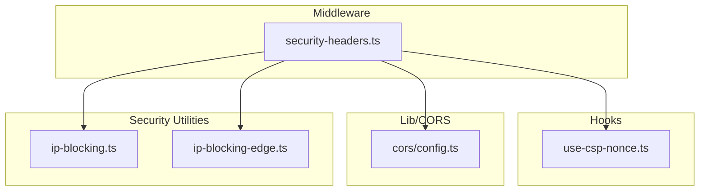
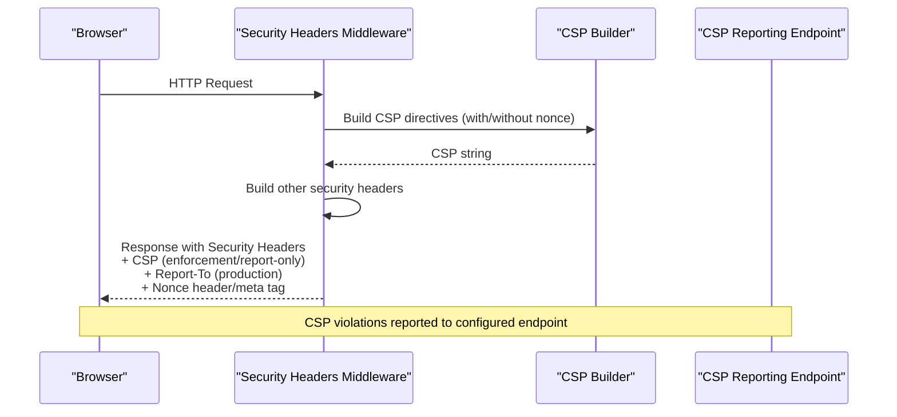
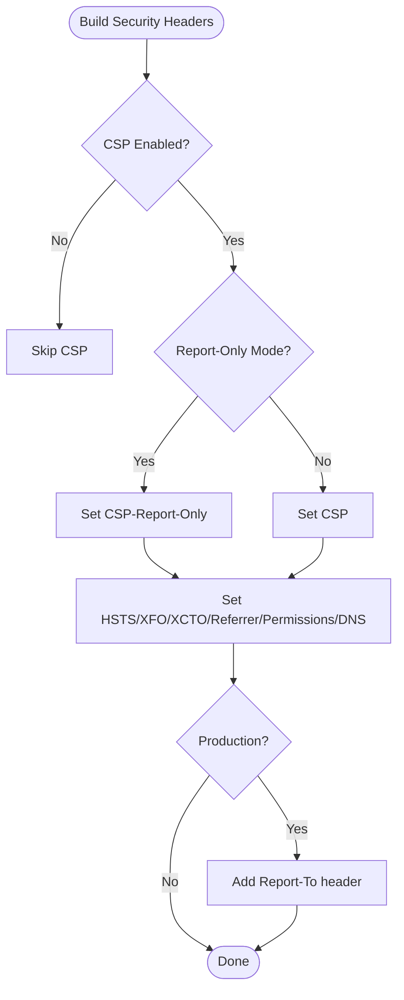
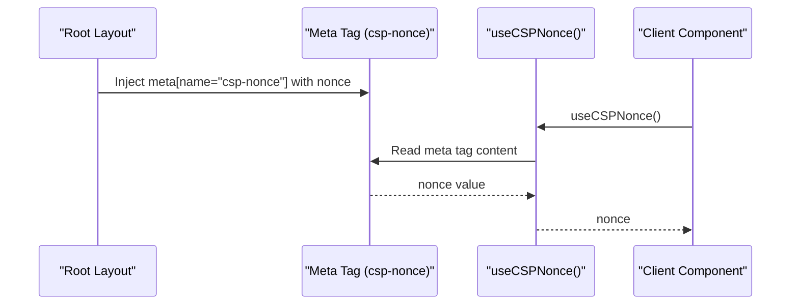
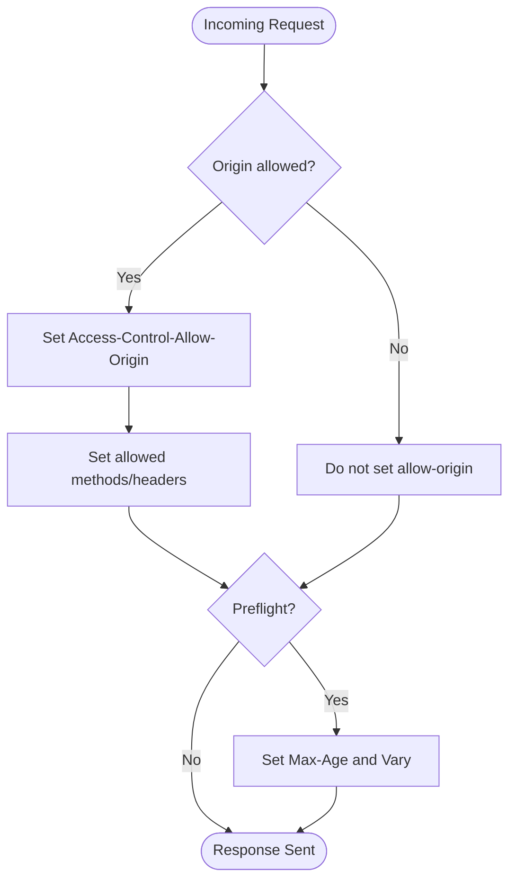
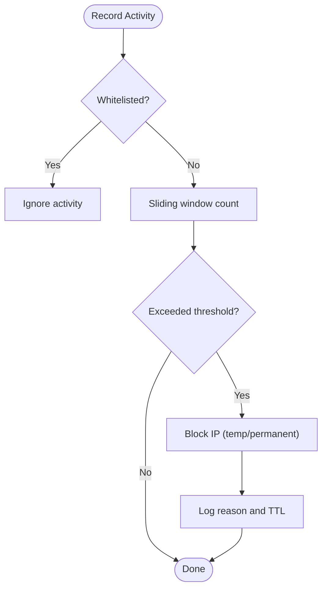
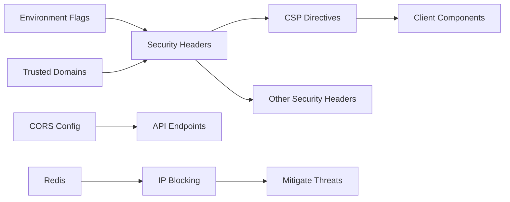

# Content Security Policy and Headers

<cite>
**Referenced Files in This Document**
- [security-headers.ts](file://src/middleware/security-headers.ts)
- [use-csp-nonce.ts](file://src/hooks/use-csp-nonce.ts)
- [config.ts](file://src/lib/cors/config.ts)
- [config.test.ts](file://src/lib/cors/__tests__/config.test.ts)
- [cors.test.ts](file://src/app/api/mcp/__tests__/cors.test.ts)
- [ip-blocking.ts](file://src/lib/security/ip-blocking.ts)
- [ip-blocking-edge.ts](file://src/lib/security/ip-blocking-edge.ts)
</cite>

## Table of Contents
1. [Introduction](#introduction)
2. [Project Structure](#project-structure)
3. [Core Components](#core-components)
4. [Architecture Overview](#architecture-overview)
5. [Detailed Component Analysis](#detailed-component-analysis)
6. [Dependency Analysis](#dependency-analysis)
7. [Performance Considerations](#performance-considerations)
8. [Troubleshooting Guide](#troubleshooting-guide)
9. [Conclusion](#conclusion)
10. [Appendices](#appendices)

## Introduction
This document provides comprehensive guidance on Content Security Policy (CSP) and HTTP security headers for the project. It explains how CSP directives are built and applied, how to enable enforcement versus report-only mode, and how to configure reporting endpoints. It also documents related headers such as Strict-Transport-Security (HSTS), X-Frame-Options, X-Content-Type-Options, Referrer-Policy, and Permissions-Policy. Practical guidance is included for validating headers, debugging CSP violations, and understanding performance implications. Finally, it covers Cross-Origin Resource Sharing (CORS) configuration and IP blocking capabilities that complement the security posture.

## Project Structure
Security headers and CSP are implemented in the middleware and shared utilities:
- Middleware applies security headers to HTTP responses and builds CSP directives.
- A React hook provides access to the CSP nonce for client components.
- CORS configuration is centralized for API endpoints.
- IP blocking utilities provide additional defense-in-depth controls.

**Diagram sources**
- [security-headers.ts:1-329](file://src/middleware/security-headers.ts#L1-L329)
- [use-csp-nonce.ts:1-100](file://src/hooks/use-csp-nonce.ts#L1-L100)
- [config.ts:1-233](file://src/lib/cors/config.ts#L1-L233)
- [ip-blocking.ts:1-599](file://src/lib/security/ip-blocking.ts#L1-L599)
- [ip-blocking-edge.ts:1-271](file://src/lib/security/ip-blocking-edge.ts#L1-L271)

**Section sources**
- [security-headers.ts:1-329](file://src/middleware/security-headers.ts#L1-L329)
- [use-csp-nonce.ts:1-100](file://src/hooks/use-csp-nonce.ts#L1-L100)
- [config.ts:1-233](file://src/lib/cors/config.ts#L1-L233)
- [ip-blocking.ts:1-599](file://src/lib/security/ip-blocking.ts#L1-L599)
- [ip-blocking-edge.ts:1-271](file://src/lib/security/ip-blocking-edge.ts#L1-L271)

## Core Components
- Security headers middleware: Builds and applies CSP (report-only or enforcement), HSTS, X-Frame-Options, X-Content-Type-Options, Referrer-Policy, Permissions-Policy, and DNS prefetch control. It supports CSP reporting via Report-To and legacy Report-URI.
- CSP nonce hook: Provides access to the CSP nonce for client components to safely embed inline styles/scripts.
- CORS configuration: Centralizes allowed origins, methods, headers, and preflight caching.
- IP blocking: Distributed IP blocking with Redis-backed persistence and in-memory fallback for Edge runtime.

**Section sources**
- [security-headers.ts:102-179](file://src/middleware/security-headers.ts#L102-L179)
- [security-headers.ts:232-280](file://src/middleware/security-headers.ts#L232-L280)
- [use-csp-nonce.ts:73-75](file://src/hooks/use-csp-nonce.ts#L73-L75)
- [config.ts:226-233](file://src/lib/cors/config.ts#L226-L233)
- [ip-blocking.ts:150-182](file://src/lib/security/ip-blocking.ts#L150-L182)
- [ip-blocking-edge.ts:138-161](file://src/lib/security/ip-blocking-edge.ts#L138-L161)

## Architecture Overview
The middleware orchestrates security headers and CSP generation. It decides whether to apply CSP enforcement or report-only mode, injects the CSP nonce into response headers/meta tags, and sets complementary headers. CORS configuration is applied consistently across API routes. IP blocking complements these protections by mitigating brute-force and scanning attacks.

**Diagram sources**
- [security-headers.ts:232-280](file://src/middleware/security-headers.ts#L232-L280)
- [security-headers.ts:102-179](file://src/middleware/security-headers.ts#L102-L179)
- [security-headers.ts:285-302](file://src/middleware/security-headers.ts#L285-L302)

## Detailed Component Analysis

### Security Headers Middleware
- CSP modes:
  - Report-only mode is default outside development unless disabled via environment.
  - Enforcement mode can be enabled after validation.
- CSP directives:
  - Base policy uses 'self' with trusted domains for Supabase, storage, fonts, AI, video calls, images, chat widget, CopilotKit, Cloudflare Stream, and ViaCEP.
  - Script-src includes 'strict-dynamic' and optional nonce when present.
  - Style-src uses 'unsafe-inline' for element styles to accommodate third-party widgets; attribute styles allow 'unsafe-inline'.
  - Connect-src permits Supabase, storage, AI, video, chat, CopilotKit, and ViaCEP.
  - Frame-src permits video and chat widgets; media-src includes blob and external providers.
  - Worker-src allows 'self' and blob.
  - Object-src is 'none'; base-uri and form-action are 'self'.
  - Upgrade-Insecure-Requests is applied in production.
- Other headers:
  - HSTS: enforced in production with includeSubDomains and preload hints; disabled in development.
  - X-Frame-Options: DENY.
  - X-Content-Type-Options: nosniff.
  - Referrer-Policy: strict-origin-when-cross-origin.
  - Permissions-Policy: minimal permissions; camera/microphone allowed for video calls; fullscreen/picture-in-picture allowed.
  - DNS Prefetch Control: on.
- Reporting:
  - Report-To header is set in production with endpoint pointing to configured CSP_REPORT_URI.
  - Legacy Report-URI directive is included for broader compatibility.
- Nonce handling:
  - Nonce is generated and attached to headers for client-side use.

**Diagram sources**
- [security-headers.ts:232-280](file://src/middleware/security-headers.ts#L232-L280)
- [security-headers.ts:262-277](file://src/middleware/security-headers.ts#L262-L277)

**Section sources**
- [security-headers.ts:19-27](file://src/middleware/security-headers.ts#L19-L27)
- [security-headers.ts:102-179](file://src/middleware/security-headers.ts#L102-L179)
- [security-headers.ts:232-280](file://src/middleware/security-headers.ts#L232-L280)
- [security-headers.ts:285-302](file://src/middleware/security-headers.ts#L285-L302)
- [security-headers.ts:308-328](file://src/middleware/security-headers.ts#L308-L328)

### CSP Nonce Hook
- Purpose: Provide the CSP nonce to client components for safe inline styles/scripts.
- Mechanism:
  - Reads from a meta tag injected at the root layout.
  - Falls back to the first script with a nonce attribute.
  - Caches the nonce to avoid repeated DOM reads.
- Usage:
  - Inject a meta tag containing the nonce in the root layout.
  - Use the hook inside client components to access the nonce.

**Diagram sources**
- [use-csp-nonce.ts:96-99](file://src/hooks/use-csp-nonce.ts#L96-L99)
- [use-csp-nonce.ts:27-52](file://src/hooks/use-csp-nonce.ts#L27-L52)
- [use-csp-nonce.ts:73-75](file://src/hooks/use-csp-nonce.ts#L73-L75)

**Section sources**
- [use-csp-nonce.ts:1-100](file://src/hooks/use-csp-nonce.ts#L1-L100)

### CORS Configuration
- Allowed origins:
  - Default includes local development origins when not overridden.
  - Can be configured via environment variable to restrict to approved domains.
- Methods and headers:
  - Standard methods and commonly required headers are permitted.
  - Preflight requests are cached via Max-Age.
- Validation:
  - Unit tests verify parsing, preflight headers, origin validation, and wildcard support.

**Diagram sources**
- [config.ts:213-219](file://src/lib/cors/config.ts#L213-L219)
- [config.ts:226-233](file://src/lib/cors/config.ts#L226-L233)

**Section sources**
- [config.ts:1-233](file://src/lib/cors/config.ts#L1-L233)
- [config.test.ts:33-52](file://src/lib/cors/__tests__/config.test.ts#L33-L52)
- [cors.test.ts:32-46](file://src/app/api/mcp/__tests__/cors.test.ts#L32-L46)

### IP Blocking Utilities
- Purpose: Automatically block IPs exhibiting suspicious behavior (auth failures, rate limit abuse, invalid endpoints).
- Features:
  - Configurable thresholds and time windows.
  - Whitelist support for trusted IPs.
  - Temporary and permanent blocking.
  - Redis-backed persistence with graceful in-memory fallback.
- Edge Runtime:
  - A simplified edge-compatible module is provided for middleware environments without Redis.

**Diagram sources**
- [ip-blocking.ts:352-423](file://src/lib/security/ip-blocking.ts#L352-L423)
- [ip-blocking-edge.ts:212-259](file://src/lib/security/ip-blocking-edge.ts#L212-L259)

**Section sources**
- [ip-blocking.ts:1-599](file://src/lib/security/ip-blocking.ts#L1-L599)
- [ip-blocking-edge.ts:1-271](file://src/lib/security/ip-blocking-edge.ts#L1-L271)

## Dependency Analysis
- CSP depends on:
  - Environment flags for enabling CSP and report-only mode.
  - Trusted domains for external resources (Supabase, storage, fonts, AI, video, chat, etc.).
  - Nonce generation and propagation to client components.
- Security headers depend on:
  - Production environment for HSTS and Report-To.
  - CSP reporting endpoint availability.
- CORS depends on:
  - Environment-controlled allowed origins.
  - Consistent method/header lists across endpoints.
- IP blocking depends on:
  - Redis availability for persistence; falls back to in-memory storage.

**Diagram sources**
- [security-headers.ts:19-27](file://src/middleware/security-headers.ts#L19-L27)
- [security-headers.ts:32-56](file://src/middleware/security-headers.ts#L32-L56)
- [config.ts:226-233](file://src/lib/cors/config.ts#L226-L233)
- [ip-blocking.ts:159-169](file://src/lib/security/ip-blocking.ts#L159-L169)

**Section sources**
- [security-headers.ts:19-27](file://src/middleware/security-headers.ts#L19-L27)
- [security-headers.ts:32-56](file://src/middleware/security-headers.ts#L32-L56)
- [config.ts:226-233](file://src/lib/cors/config.ts#L226-L233)
- [ip-blocking.ts:159-169](file://src/lib/security/ip-blocking.ts#L159-L169)

## Performance Considerations
- CSP enforcement adds minimal overhead; report-only mode reduces risk during rollout.
- HSTS and Referrer-Policy are lightweight headers with negligible performance cost.
- Permissions-Policy restricts browser features, reducing potential attack surface without impacting performance.
- CORS preflight caching via Max-Age reduces redundant OPTIONS requests.
- IP blocking relies on Redis for persistence; in-memory fallback avoids blocking on edge but loses cross-request state.

[No sources needed since this section provides general guidance]

## Troubleshooting Guide
- Validate headers:
  - Use browser DevTools Network panel to inspect response headers.
  - Confirm CSP, HSTS, XFO, XCTO, Referrer-Policy, Permissions-Policy, and Report-To presence.
- CSP violation reporting:
  - Ensure CSP_REPORT_URI is reachable and accepts POST requests.
  - In production, verify Report-To header is present; in development, rely on CSP-Report-Only.
- Debugging CSP:
  - Temporarily switch to report-only mode to observe violations without breaking functionality.
  - Review browser console for CSP violation messages and offending directives.
  - Gradually tighten directives and monitor reports.
- Browser compatibility:
  - Report-To is preferred; legacy Report-URI remains for broader compatibility.
  - Some older browsers may not support all directives; maintain fallbacks where applicable.
- Security header validation:
  - Confirm HSTS is only enabled in production.
  - Verify Referrer-Policy aligns with privacy requirements.
  - Keep Permissions-Policy minimal and purpose-specific.
- Performance impact:
  - Monitor CSP enforcement latency; report-only mode typically introduces no blocking overhead.
  - CORS Max-Age reduces preflight overhead.

**Section sources**
- [security-headers.ts:232-280](file://src/middleware/security-headers.ts#L232-L280)
- [security-headers.ts:262-277](file://src/middleware/security-headers.ts#L262-L277)

## Conclusion
The project implements a robust security posture through a configurable CSP (report-only by default), comprehensive headers (HSTS, XFO, XCTO, Referrer-Policy, Permissions-Policy), and centralized CORS configuration. The nonce mechanism enables safe inline content where necessary, while IP blocking provides additional defense against malicious traffic. By leveraging report-only mode during validation and carefully monitoring violation reports, teams can progressively harden security without disrupting user experience.

[No sources needed since this section summarizes without analyzing specific files]

## Appendices

### Practical Examples and Best Practices
- Enabling enforcement:
  - After validating CSP in report-only mode, disable report-only mode to enforce policies.
- Reporting endpoint:
  - Ensure the CSP_REPORT_URI endpoint persists and surfaces violation reports for triage.
- Header testing:
  - Use curl or browser dev tools to confirm header presence and correctness.
- Browser compatibility:
  - Maintain Report-URI alongside Report-To for legacy clients.
- Legal applications:
  - Align CSP with data minimization and least-privilege principles.
  - Restrict connect-src to trusted APIs and storage providers.
  - Keep Permissions-Policy minimal to reduce exposure of sensitive device features.

[No sources needed since this section provides general guidance]