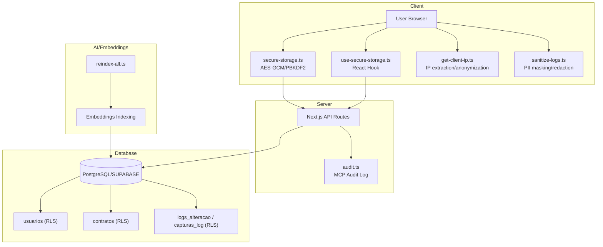
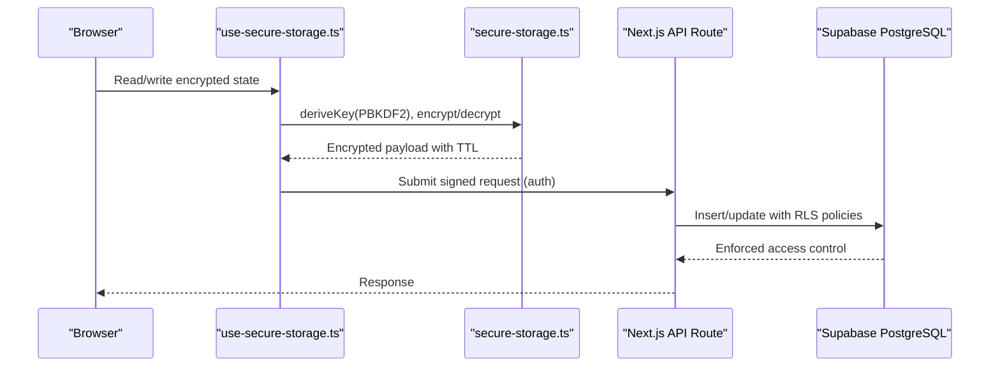
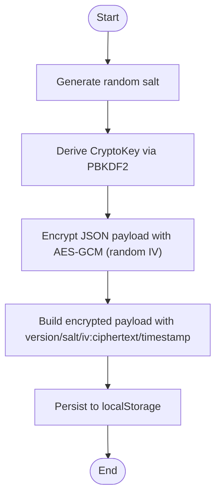
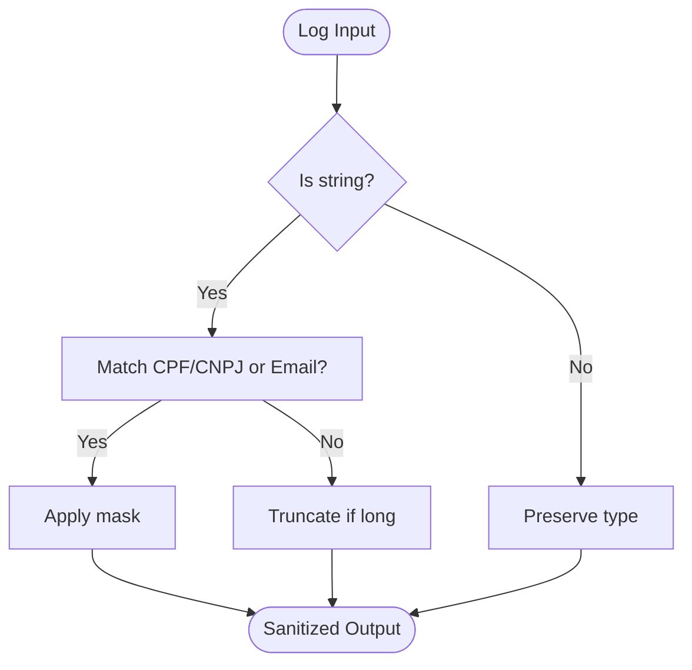
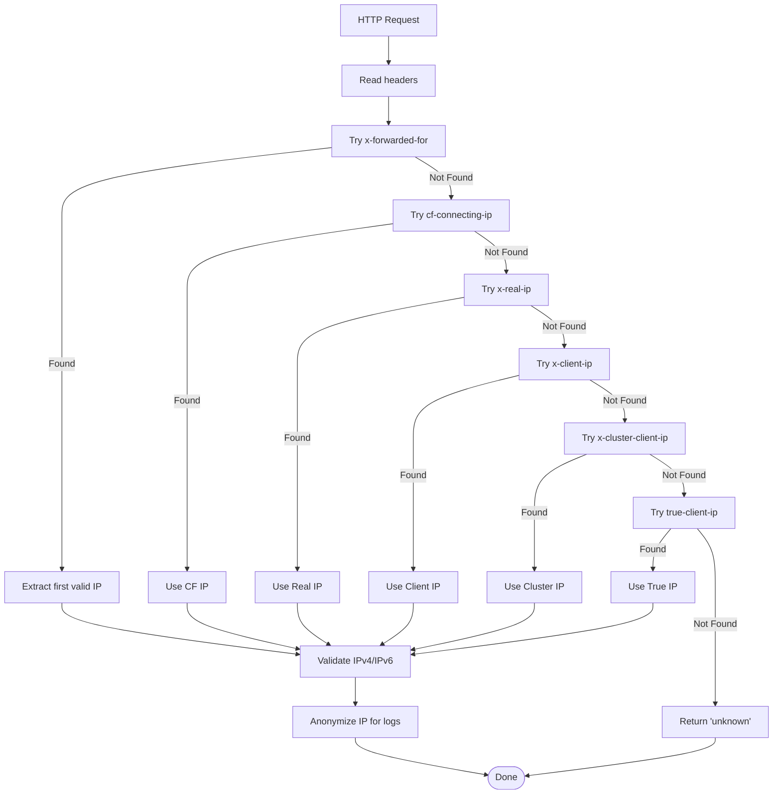
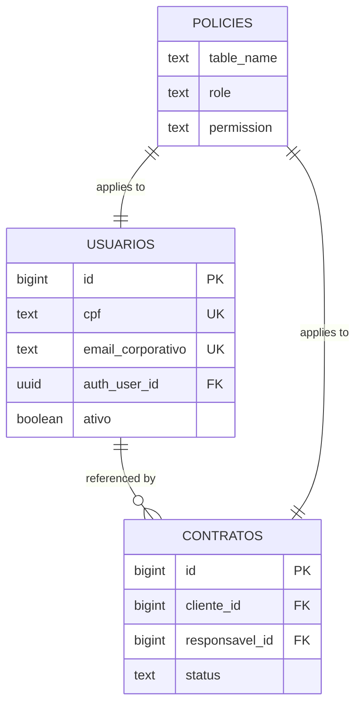
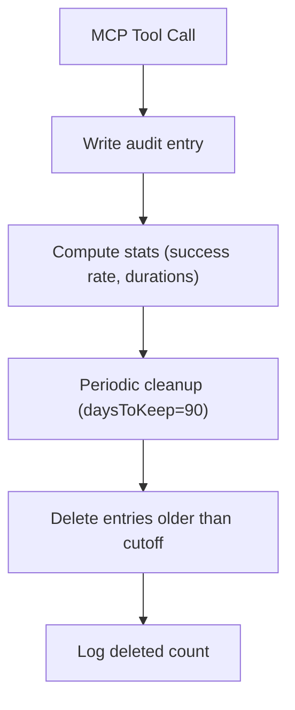
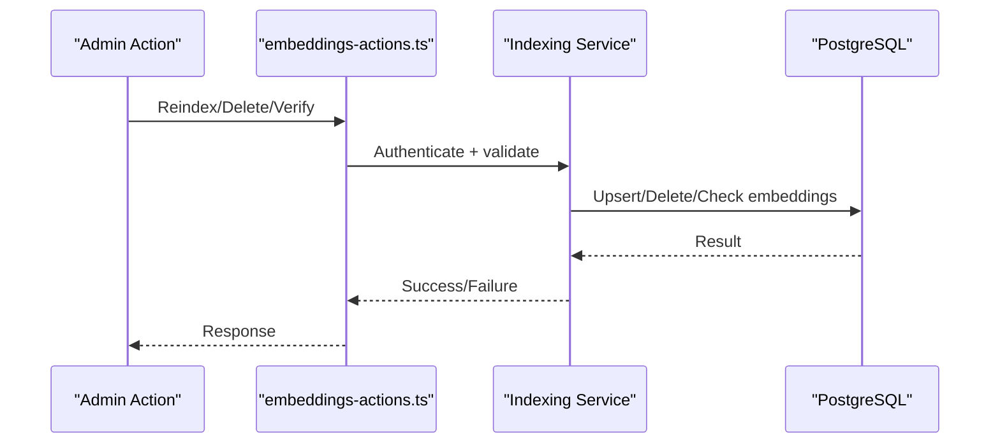
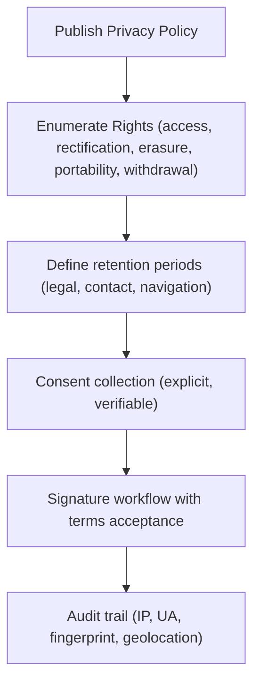
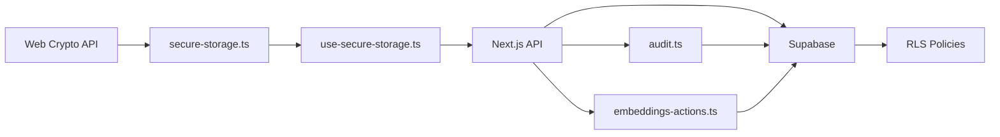

# Data Protection and Privacy

<cite>
**Referenced Files in This Document**
- [secure-storage.ts](file://src/lib/utils/secure-storage.ts)
- [sanitize-logs.ts](file://src/lib/utils/sanitize-logs.ts)
- [get-client-ip.ts](file://src/lib/utils/get-client-ip.ts)
- [use-secure-storage.ts](file://src/hooks/use-secure-storage.ts)
- [politica-de-privacidade/page.tsx](file://src/app/website/politica-de-privacidade/page.tsx)
- [08_usuarios.sql](file://supabase/schemas/08_usuarios.sql)
- [11_contratos.sql](file://supabase/schemas/11_contratos.sql)
- [20250120000001_fix_rls_policies_granular_permissions.sql](file://supabase/migrations/20250120000001_fix_rls_policies_granular_permissions.sql)
- [audit.ts](file://src/lib/mcp/audit.ts)
- [mcp_best_practices.md](file://.agents/skills/mcp-builder/reference/mcp_best_practices.md)
- [reindex-all.ts](file://scripts/ai/reindex-all.ts)
- [embeddings-actions.ts](file://src/lib/ai/actions/embeddings-actions.ts)
- [RULES.md](file://src/app/(authenticated)/documentos/RULES.md)
</cite>

## Table of Contents
1. [Introduction](#introduction)
2. [Project Structure](#project-structure)
3. [Core Components](#core-components)
4. [Architecture Overview](#architecture-overview)
5. [Detailed Component Analysis](#detailed-component-analysis)
6. [Dependency Analysis](#dependency-analysis)
7. [Performance Considerations](#performance-considerations)
8. [Troubleshooting Guide](#troubleshooting-guide)
9. [Conclusion](#conclusion)
10. [Appendices](#appendices)

## Introduction
This document provides comprehensive data protection and privacy guidance for the Zattar-OS project. It focuses on encryption at rest and in transit, data masking, privacy preservation, secure storage, anonymization for AI processing, and compliance with legal data handling requirements. It also documents encryption key management, secure data transmission protocols, data retention policies, GDPR measures, data subject rights, consent management, practical examples of secure processing, audit and logging, and incident response considerations.

## Project Structure
The data protection mechanisms span client-side secure storage utilities, server-side logging and auditing, database schemas with Row Level Security (RLS), and privacy-focused UI and policy pages. The following diagram maps the key components involved in data protection and privacy.

**Diagram sources**
- [secure-storage.ts:1-291](file://src/lib/utils/secure-storage.ts#L1-L291)
- [use-secure-storage.ts:159-205](file://src/hooks/use-secure-storage.ts#L159-L205)
- [get-client-ip.ts:1-245](file://src/lib/utils/get-client-ip.ts#L1-L245)
- [sanitize-logs.ts:1-123](file://src/lib/utils/sanitize-logs.ts#L1-L123)
- [audit.ts:203-270](file://src/lib/mcp/audit.ts#L203-L270)
- [08_usuarios.sql:1-100](file://supabase/schemas/08_usuarios.sql#L1-L100)
- [11_contratos.sql:1-61](file://supabase/schemas/11_contratos.sql#L1-L61)
- [20250120000001_fix_rls_policies_granular_permissions.sql:276-311](file://supabase/migrations/20250120000001_fix_rls_policies_granular_permissions.sql#L276-L311)
- [reindex-all.ts:46-82](file://scripts/ai/reindex-all.ts#L46-L82)

**Section sources**
- [secure-storage.ts:1-291](file://src/lib/utils/secure-storage.ts#L1-L291)
- [get-client-ip.ts:1-245](file://src/lib/utils/get-client-ip.ts#L1-L245)
- [sanitize-logs.ts:1-123](file://src/lib/utils/sanitize-logs.ts#L1-L123)
- [08_usuarios.sql:1-100](file://supabase/schemas/08_usuarios.sql#L1-L100)
- [11_contratos.sql:1-61](file://supabase/schemas/11_contratos.sql#L1-L61)
- [20250120000001_fix_rls_policies_granular_permissions.sql:276-311](file://supabase/migrations/20250120000001_fix_rls_policies_granular_permissions.sql#L276-L311)
- [audit.ts:203-270](file://src/lib/mcp/audit.ts#L203-L270)
- [reindex-all.ts:46-82](file://scripts/ai/reindex-all.ts#L46-L82)

## Core Components
- Client-side secure storage: AES-GCM with PBKDF2-derived keys, randomized IV, embedded timestamp, and TTL enforcement.
- Data masking and sanitization: PII redaction and truncation in logs and sensitive outputs.
- IP anonymization: Masking of IPv4 and IPv6 for logging and audit trails.
- Database RLS: Row-level security policies for sensitive tables (e.g., users, contracts) and audit tables.
- Audit logging: MCP audit log with statistics and retention cleanup.
- AI indexing and embeddings: Controlled reindexing and deletion actions with optional environment gating.
- Privacy policy and retention: Public-facing policy and retention periods aligned with legal obligations.

**Section sources**
- [secure-storage.ts:1-291](file://src/lib/utils/secure-storage.ts#L1-L291)
- [sanitize-logs.ts:1-123](file://src/lib/utils/sanitize-logs.ts#L1-L123)
- [get-client-ip.ts:223-244](file://src/lib/utils/get-client-ip.ts#L223-L244)
- [08_usuarios.sql:82-100](file://supabase/schemas/08_usuarios.sql#L82-L100)
- [11_contratos.sql:58-61](file://supabase/schemas/11_contratos.sql#L58-L61)
- [20250120000001_fix_rls_policies_granular_permissions.sql:276-311](file://supabase/migrations/20250120000001_fix_rls_policies_granular_permissions.sql#L276-L311)
- [audit.ts:203-270](file://src/lib/mcp/audit.ts#L203-L270)
- [embeddings-actions.ts:58-111](file://src/lib/ai/actions/embeddings-actions.ts#L58-L111)
- [reindex-all.ts:46-82](file://scripts/ai/reindex-all.ts#L46-L82)
- [politica-de-privacidade/page.tsx:56-65](file://src/app/website/politica-de-privacidade/page.tsx#L56-L65)

## Architecture Overview
The system implements layered protections:
- Transport security: HTTPS/TLS enforced by deployment and CDN/proxy configurations.
- In-transit integrity: API routes and audit logs rely on authenticated sessions and signed storage URLs.
- At-rest protection: Client-side encryption for sensitive browser storage; database RLS and minimal data exposure.
- Privacy by design: IP anonymization, PII masking, and retention-aligned archival.

**Diagram sources**
- [use-secure-storage.ts:159-205](file://src/hooks/use-secure-storage.ts#L159-L205)
- [secure-storage.ts:73-160](file://src/lib/utils/secure-storage.ts#L73-L160)
- [08_usuarios.sql:82-100](file://supabase/schemas/08_usuarios.sql#L82-L100)
- [11_contratos.sql:58-61](file://supabase/schemas/11_contratos.sql#L58-L61)

## Detailed Component Analysis

### Client-Side Encryption and Secure Storage
- Key derivation: PBKDF2 with SHA-256, 100k iterations, random salt and IV per record.
- Encryption: AES-GCM with random IV; payload includes version, salt, IV, ciphertext, and timestamp.
- TTL enforcement: Automatic expiration after 7 days; expired items are removed.
- Session-bound encryption: Requires a session token to derive keys; prevents unauthorized access if token is lost.
- Migration safety: Non-encrypted items are ignored and can be migrated to encrypted format.

**Diagram sources**
- [secure-storage.ts:66-160](file://src/lib/utils/secure-storage.ts#L66-L160)

**Section sources**
- [secure-storage.ts:1-291](file://src/lib/utils/secure-storage.ts#L1-L291)
- [use-secure-storage.ts:159-205](file://src/hooks/use-secure-storage.ts#L159-L205)

### Data Masking and Logging Sanitization
- Redaction: Keys indicating secrets (password, token, secret, authorization, API keys) are redacted.
- PII masking: CPF/CNPJ masked to prefix + asterisks; emails masked to first 3 chars + asterisks; long strings truncated.
- Error sanitization: Errors logged with sanitized messages; dates preserved as ISO strings.

**Diagram sources**
- [sanitize-logs.ts:29-60](file://src/lib/utils/sanitize-logs.ts#L29-L60)

**Section sources**
- [sanitize-logs.ts:1-123](file://src/lib/utils/sanitize-logs.ts#L1-L123)

### IP Extraction and Anonymization
- Extraction: Uses standard headers (x-forwarded-for, CF, Nginx, Apache, LB, Akamai) to obtain the client IP.
- Validation: Strict IPv4/IPv6 validation; supports compressed IPv6.
- Anonymization: IPv4 last octet zeroed; IPv6 last 80 bits removed (keep first 3 groups + ::).

**Diagram sources**
- [get-client-ip.ts:108-183](file://src/lib/utils/get-client-ip.ts#L108-L183)
- [get-client-ip.ts:223-244](file://src/lib/utils/get-client-ip.ts#L223-L244)

**Section sources**
- [get-client-ip.ts:1-245](file://src/lib/utils/get-client-ip.ts#L1-L245)

### Database RLS and Access Control
- Users table: RLS enabled with policies allowing service role full access, authenticated users read-only, and self-update restricted to the authenticated user.
- Contracts table: RLS enabled; policies govern access based on roles and ownership.
- Audit tables: Dedicated policies grant service role write access and authenticated read access for auditability.

**Diagram sources**
- [08_usuarios.sql:82-100](file://supabase/schemas/08_usuarios.sql#L82-L100)
- [11_contratos.sql:58-61](file://supabase/schemas/11_contratos.sql#L58-L61)
- [20250120000001_fix_rls_policies_granular_permissions.sql:276-311](file://supabase/migrations/20250120000001_fix_rls_policies_granular_permissions.sql#L276-L311)

**Section sources**
- [08_usuarios.sql:1-100](file://supabase/schemas/08_usuarios.sql#L1-L100)
- [11_contratos.sql:1-61](file://supabase/schemas/11_contratos.sql#L1-L61)
- [20250120000001_fix_rls_policies_granular_permissions.sql:276-311](file://supabase/migrations/20250120000001_fix_rls_policies_granular_permissions.sql#L276-L311)

### Audit Logging and Retention
- MCP audit log: Tracks tool usage, success rates, durations, and top tools; includes cleanup routine to remove old entries.
- Retention: Default 90-day retention with cleanup function.

**Diagram sources**
- [audit.ts:203-270](file://src/lib/mcp/audit.ts#L203-L270)

**Section sources**
- [audit.ts:203-270](file://src/lib/mcp/audit.ts#L203-L270)

### AI Indexing and Embeddings Privacy Controls
- Controlled reindexing: Environment flag to disable AI indexing; actions support reindexing, deletion, and verification.
- Embeddings lifecycle: Deletion and verification actions enforce authentication and structured metadata.

**Diagram sources**
- [embeddings-actions.ts:58-111](file://src/lib/ai/actions/embeddings-actions.ts#L58-L111)
- [reindex-all.ts:46-82](file://scripts/ai/reindex-all.ts#L46-L82)

**Section sources**
- [embeddings-actions.ts:58-111](file://src/lib/ai/actions/embeddings-actions.ts#L58-L111)
- [reindex-all.ts:46-82](file://scripts/ai/reindex-all.ts#L46-L82)

### Consent Management and Privacy Policy Alignment
- Privacy policy outlines data categories, lawful basis, retention periods, and data subject rights.
- Consent alignment: Explicit acceptance required for signature workflows; terms versioning ensures auditable consent.

**Diagram sources**
- [politica-de-privacidade/page.tsx:14-65](file://src/app/website/politica-de-privacidade/page.tsx#L14-L65)

**Section sources**
- [politica-de-privacidade/page.tsx:1-142](file://src/app/website/politica-de-privacidade/page.tsx#L1-L142)

## Dependency Analysis
- Client-side encryption depends on Web Crypto API; tests mock crypto primitives to validate behavior.
- Hooks depend on secure-storage utilities for encryption/decryption and TTL checks.
- Database policies depend on authenticated user context and service role for backend operations.
- Audit logging depends on Supabase client initialization and environment configuration.
- AI indexing depends on environment flags and authenticated requests.

**Diagram sources**
- [secure-storage.ts:11-17](file://src/lib/utils/secure-storage.ts#L11-L17)
- [use-secure-storage.ts:159-205](file://src/hooks/use-secure-storage.ts#L159-L205)
- [audit.ts:203-270](file://src/lib/mcp/audit.ts#L203-L270)
- [embeddings-actions.ts:58-111](file://src/lib/ai/actions/embeddings-actions.ts#L58-L111)

**Section sources**
- [secure-storage.ts:1-291](file://src/lib/utils/secure-storage.ts#L1-L291)
- [use-secure-storage.ts:159-205](file://src/hooks/use-secure-storage.ts#L159-L205)
- [audit.ts:203-270](file://src/lib/mcp/audit.ts#L203-L270)
- [embeddings-actions.ts:58-111](file://src/lib/ai/actions/embeddings-actions.ts#L58-L111)

## Performance Considerations
- PBKDF2 iterations: 100k provide strong key derivation cost; consider environment-specific tuning if performance impacts arise.
- TTL enforcement: Prevents stale data accumulation; expired items are proactively removed.
- RLS overhead: Policies add minimal overhead; ensure indexes on foreign keys and frequently filtered columns.
- Audit log cleanup: Scheduled cleanup reduces table growth; tune retention period per compliance needs.

[No sources needed since this section provides general guidance]

## Troubleshooting Guide
- Decryption failures: Check payload format, version compatibility, and timestamp validity; expired items are automatically removed.
- Missing session token: Encryption requires a session token; ensure token availability before secure storage operations.
- IP extraction issues: Verify proxy headers; fallback to “unknown” if none are present.
- Audit log anomalies: Confirm authenticated context and environment configuration; review cleanup logs.
- Embeddings inconsistencies: Validate environment flags and authentication; re-run reindexing actions.

**Section sources**
- [secure-storage.ts:115-147](file://src/lib/utils/secure-storage.ts#L115-L147)
- [get-client-ip.ts:108-137](file://src/lib/utils/get-client-ip.ts#L108-L137)
- [audit.ts:251-270](file://src/lib/mcp/audit.ts#L251-L270)
- [embeddings-actions.ts:79-92](file://src/lib/ai/actions/embeddings-actions.ts#L79-L92)

## Conclusion
Zattar-OS implements robust data protection through client-side encryption, strict RLS policies, anonymization, sanitization, and controlled AI indexing. The system aligns with legal obligations by retaining data only as required and by providing clear privacy policy disclosures and consent mechanisms. Operational safeguards include audit logging, retention controls, and environment-driven toggles for AI features.

[No sources needed since this section summarizes without analyzing specific files]

## Appendices

### Practical Examples
- Secure browser storage: Use the secure storage utilities to encrypt and persist sensitive data with TTL and automatic cleanup.
- Privacy-preserving AI: Use environment flags to disable AI indexing; leverage deletion and verification actions to manage embeddings lifecycle.
- Consent and signature workflows: Enforce explicit consent and maintain audit trail with IP, user agent, and device fingerprint.

**Section sources**
- [secure-storage.ts:195-279](file://src/lib/utils/secure-storage.ts#L195-L279)
- [embeddings-actions.ts:58-111](file://src/lib/ai/actions/embeddings-actions.ts#L58-L111)
- [politica-de-privacidade/page.tsx:14-65](file://src/app/website/politica-de-privacidade/page.tsx#L14-L65)

### Data Retention Policies
- Processual data: Retained per legal and regulatory requirements.
- Contact data: Up to 5 years after case closure.
- Navigation data: Up to 12 months for security purposes.

**Section sources**
- [politica-de-privacidade/page.tsx:56-65](file://src/app/website/politica-de-privacidade/page.tsx#L56-L65)

### Transport Security and Protocols
- Enforce TLS/HTTPS at CDN/proxy and application layers.
- Use signed URLs for temporary access to storage resources.
- Prefer SSE or HTTP transport for MCP integrations as appropriate.

**Section sources**
- [mcp_best_practices.md:192-231](file://.agents/skills/mcp-builder/reference/mcp_best_practices.md#L192-L231)
- [RULES.md](file://src/app/(authenticated)/documentos/RULES.md#L163-L177)