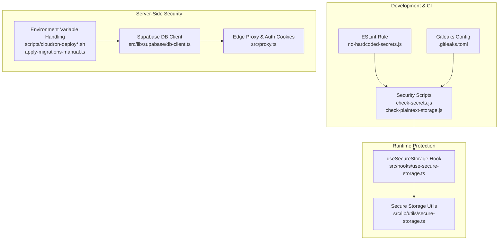
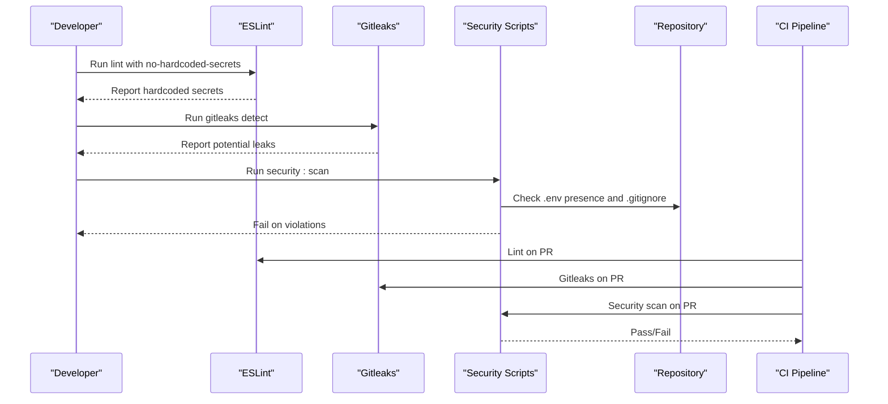
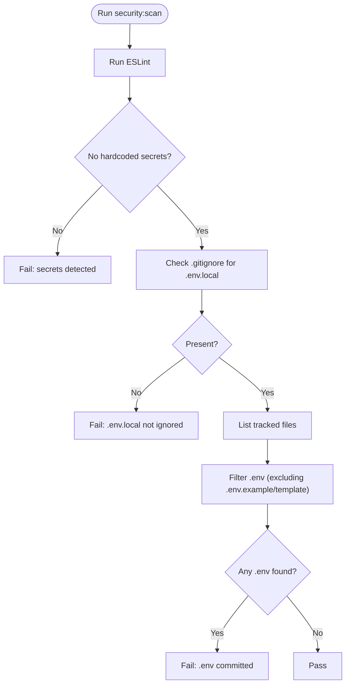
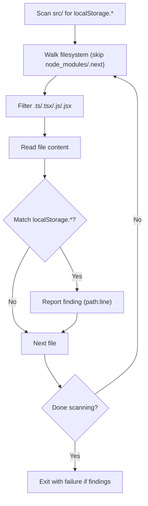
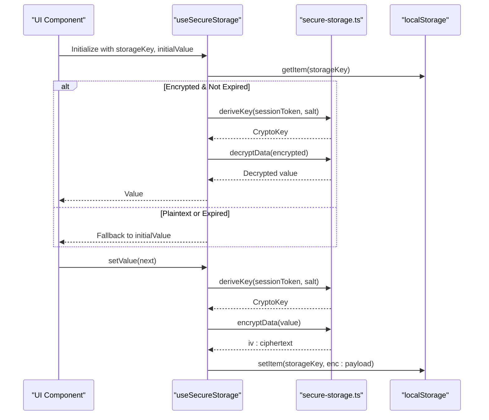
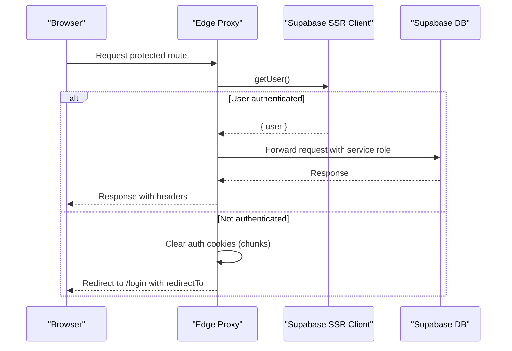
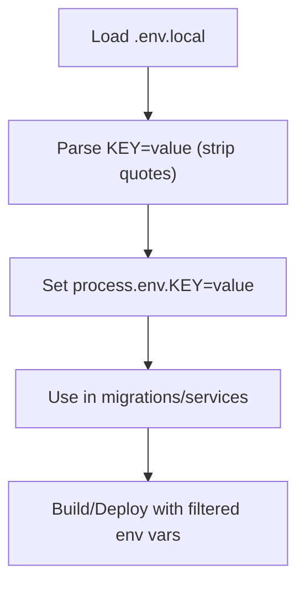
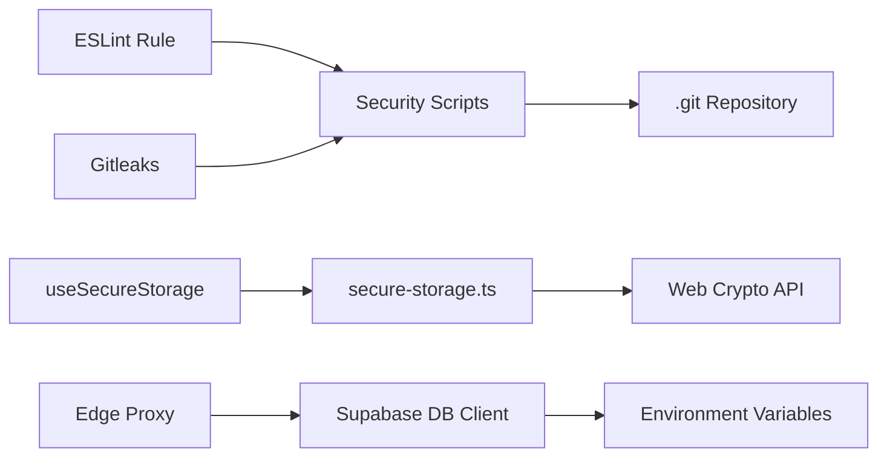

# Secret Management and Environment Security

<cite>
**Referenced Files in This Document**
- [.gitleaks.toml](file://.gitleaks.toml)
- [package.json](file://package.json)
- [eslint-rules/no-hardcoded-secrets.js](file://eslint-rules/no-hardcoded-secrets.js)
- [scripts/security/check-secrets.js](file://scripts/security/check-secrets.js)
- [scripts/security/check-plaintext-storage.js](file://scripts/security/check-plaintext-storage.js)
- [src/hooks/use-secure-storage.ts](file://src/hooks/use-secure-storage.ts)
- [src/lib/utils/secure-storage.ts](file://src/lib/utils/secure-storage.ts)
- [src/lib/supabase/db-client.ts](file://src/lib/supabase/db-client.ts)
- [src/proxy.ts](file://src/proxy.ts)
- [src/app/(authenticated)/mail/repository.ts](file://src/app/(authenticated)/mail/repository.ts)
- [supabase/migrations/20260303000001_create_credenciais_email.sql](file://supabase/migrations/20260303000001_create_credenciais_email.sql)
- [scripts/cloudron-deploy.sh](file://scripts/cloudron-deploy.sh)
- [scripts/cloudron-deploy-local.sh](file://scripts/cloudron-deploy-local.sh)
- [scripts/database/migrations/apply-migrations-manual.ts](file://scripts/database/migrations/apply-migrations-manual.ts)
</cite>

## Table of Contents
1. [Introduction](#introduction)
2. [Project Structure](#project-structure)
3. [Core Components](#core-components)
4. [Architecture Overview](#architecture-overview)
5. [Detailed Component Analysis](#detailed-component-analysis)
6. [Dependency Analysis](#dependency-analysis)
7. [Performance Considerations](#performance-considerations)
8. [Troubleshooting Guide](#troubleshooting-guide)
9. [Conclusion](#conclusion)
10. [Appendices](#appendices)

## Introduction
This document provides comprehensive guidance for secret management and environment security across the project. It covers secret detection, environment variable security, credential protection strategies, and secure deployment practices. It documents the Gitleaks configuration for detecting hardcoded secrets, prevents plaintext storage, and mitigates sensitive data exposure. It also explains secure environment variable management, credential rotation procedures, access control for secrets, database credential security, API key management, and third-party service authentication. Practical examples of secret scanning implementation, false positive handling, and automated security checks are included, along with secret lifecycle management, secure deployment practices, incident response for compromised credentials, common security vulnerabilities, prevention strategies, and compliance considerations.

## Project Structure
The repository implements secret management across three primary layers:
- Static secret scanning via ESLint and Gitleaks
- Runtime protection for sensitive data stored in browser localStorage
- Secure server-side database client usage and environment variable handling

**Diagram sources**
- [eslint-rules/no-hardcoded-secrets.js:1-43](file://eslint-rules/no-hardcoded-secrets.js#L1-L43)
- [.gitleaks.toml:1-87](file://.gitleaks.toml#L1-L87)
- [scripts/security/check-secrets.js:1-60](file://scripts/security/check-secrets.js#L1-L60)
- [scripts/security/check-plaintext-storage.js:1-74](file://scripts/security/check-plaintext-storage.js#L1-L74)
- [src/hooks/use-secure-storage.ts:1-266](file://src/hooks/use-secure-storage.ts#L1-L266)
- [src/lib/utils/secure-storage.ts:1-291](file://src/lib/utils/secure-storage.ts#L1-L291)
- [src/lib/supabase/db-client.ts:22-181](file://src/lib/supabase/db-client.ts#L22-L181)
- [src/proxy.ts:188-400](file://src/proxy.ts#L188-L400)
- [scripts/cloudron-deploy.sh:166-206](file://scripts/cloudron-deploy.sh#L166-L206)
- [scripts/cloudron-deploy-local.sh:155-196](file://scripts/cloudron-deploy-local.sh#L155-L196)
- [scripts/database/migrations/apply-migrations-manual.ts:2-30](file://scripts/database/migrations/apply-migrations-manual.ts#L2-L30)

**Section sources**
- [package.json:47-50](file://package.json#L47-L50)
- [eslint-rules/no-hardcoded-secrets.js:1-43](file://eslint-rules/no-hardcoded-secrets.js#L1-L43)
- [.gitleaks.toml:1-87](file://.gitleaks.toml#L1-L87)
- [scripts/security/check-secrets.js:1-60](file://scripts/security/check-secrets.js#L1-L60)
- [scripts/security/check-plaintext-storage.js:1-74](file://scripts/security/check-plaintext-storage.js#L1-L74)
- [src/hooks/use-secure-storage.ts:1-266](file://src/hooks/use-secure-storage.ts#L1-L266)
- [src/lib/utils/secure-storage.ts:1-291](file://src/lib/utils/secure-storage.ts#L1-L291)
- [src/lib/supabase/db-client.ts:22-181](file://src/lib/supabase/db-client.ts#L22-L181)
- [src/proxy.ts:188-400](file://src/proxy.ts#L188-L400)
- [scripts/cloudron-deploy.sh:166-206](file://scripts/cloudron-deploy.sh#L166-L206)
- [scripts/cloudron-deploy-local.sh:155-196](file://scripts/cloudron-deploy-local.sh#L155-L196)
- [scripts/database/migrations/apply-migrations-manual.ts:2-30](file://scripts/database/migrations/apply-migrations-manual.ts#L2-L30)

## Core Components
- Secret detection pipeline
  - ESLint rule detects hardcoded secrets in source code during development and CI.
  - Gitleaks configuration scans repositories for leaked secrets and supports allowlists for false positives.
  - Security scripts enforce environment hygiene and prevent accidental commits of sensitive files.
- Runtime protection for sensitive data
  - useSecureStorage hook and secure-storage utilities provide encryption-at-rest for localStorage using AES-GCM and PBKDF2.
- Server-side security
  - Supabase DB client enforces server-only usage to prevent exposure of service keys.
  - Edge proxy manages authentication cookies and ensures secure cookie attributes.
  - Environment variable handling scripts separate build-time and runtime variables for secure deployments.

**Section sources**
- [eslint-rules/no-hardcoded-secrets.js:14-42](file://eslint-rules/no-hardcoded-secrets.js#L14-L42)
- [.gitleaks.toml:6-29](file://.gitleaks.toml#L6-L29)
- [.gitleaks.toml:30-87](file://.gitleaks.toml#L30-L87)
- [scripts/security/check-secrets.js:8-16](file://scripts/security/check-secrets.js#L8-L16)
- [scripts/security/check-secrets.js:18-25](file://scripts/security/check-secrets.js#L18-L25)
- [scripts/security/check-secrets.js:27-57](file://scripts/security/check-secrets.js#L27-L57)
- [src/hooks/use-secure-storage.ts:43-265](file://src/hooks/use-secure-storage.ts#L43-L265)
- [src/lib/utils/secure-storage.ts:66-96](file://src/lib/utils/secure-storage.ts#L66-L96)
- [src/lib/utils/secure-storage.ts:98-147](file://src/lib/utils/secure-storage.ts#L98-L147)
- [src/lib/utils/secure-storage.ts:149-182](file://src/lib/utils/secure-storage.ts#L149-L182)
- [src/lib/supabase/db-client.ts:31-39](file://src/lib/supabase/db-client.ts#L31-L39)
- [src/lib/supabase/db-client.ts:158-168](file://src/lib/supabase/db-client.ts#L158-L168)
- [src/proxy.ts:349-384](file://src/proxy.ts#L349-L384)
- [scripts/cloudron-deploy.sh:180-206](file://scripts/cloudron-deploy.sh#L180-L206)
- [scripts/cloudron-deploy-local.sh:177-196](file://scripts/cloudron-deploy-local.sh#L177-L196)
- [scripts/database/migrations/apply-migrations-manual.ts:6-30](file://scripts/database/migrations/apply-migrations-manual.ts#L6-L30)

## Architecture Overview
The secret management architecture integrates static analysis, runtime protection, and server-side controls to minimize exposure and mitigate risks.

**Diagram sources**
- [package.json:45-50](file://package.json#L45-L50)
- [eslint-rules/no-hardcoded-secrets.js:14-42](file://eslint-rules/no-hardcoded-secrets.js#L14-L42)
- [.gitleaks.toml:1-87](file://.gitleaks.toml#L1-L87)
- [scripts/security/check-secrets.js:8-16](file://scripts/security/check-secrets.js#L8-L16)
- [scripts/security/check-secrets.js:18-25](file://scripts/security/check-secrets.js#L18-L25)
- [scripts/security/check-secrets.js:27-57](file://scripts/security/check-secrets.js#L27-L57)

## Detailed Component Analysis

### Secret Detection Pipeline
- ESLint rule
  - Scans literal strings for patterns indicating passwords, API keys, tokens, secrets, OpenAI keys, GitHub tokens, and Slack tokens.
  - Reports potential hardcoded secrets with a standardized message.
- Gitleaks configuration
  - Defines rules for Supabase service keys, OpenAI API keys, generic API keys, and Brazilian CPF/CNPJ patterns.
  - Provides allowlists for paths and regexes to reduce false positives.
- Security scripts
  - Runs ESLint, verifies .env.local is ignored, and ensures no .env files are committed.
  - Exits with failure on violations to block insecure changes.

**Diagram sources**
- [package.json:47-50](file://package.json#L47-L50)
- [scripts/security/check-secrets.js:8-16](file://scripts/security/check-secrets.js#L8-L16)
- [scripts/security/check-secrets.js:18-25](file://scripts/security/check-secrets.js#L18-L25)
- [scripts/security/check-secrets.js:27-57](file://scripts/security/check-secrets.js#L27-L57)

**Section sources**
- [eslint-rules/no-hardcoded-secrets.js:14-42](file://eslint-rules/no-hardcoded-secrets.js#L14-L42)
- [.gitleaks.toml:6-29](file://.gitleaks.toml#L6-L29)
- [.gitleaks.toml:30-87](file://.gitleaks.toml#L30-L87)
- [scripts/security/check-secrets.js:8-16](file://scripts/security/check-secrets.js#L8-L16)
- [scripts/security/check-secrets.js:18-25](file://scripts/security/check-secrets.js#L18-L25)
- [scripts/security/check-secrets.js:27-57](file://scripts/security/check-secrets.js#L27-L57)

### Plaintext Storage Prevention
- Purpose
  - Detects direct usage of localStorage in the client code to prevent storing sensitive data in plaintext.
- Mechanism
  - Recursively scans TypeScript/JavaScript files under src/, excluding specific utility files.
  - Flags localStorage.setItem/getItem/removeItem calls outside approved modules.
- Remediation
  - Replace direct localStorage usage with useSecureStorage hook or secure storage utilities.

**Diagram sources**
- [scripts/security/check-plaintext-storage.js:20-53](file://scripts/security/check-plaintext-storage.js#L20-L53)

**Section sources**
- [scripts/security/check-plaintext-storage.js:15-18](file://scripts/security/check-plaintext-storage.js#L15-L18)
- [scripts/security/check-plaintext-storage.js:20-53](file://scripts/security/check-plaintext-storage.js#L20-L53)
- [src/hooks/use-secure-storage.ts:43-265](file://src/hooks/use-secure-storage.ts#L43-L265)
- [src/lib/utils/secure-storage.ts:195-219](file://src/lib/utils/secure-storage.ts#L195-L219)
- [src/lib/utils/secure-storage.ts:228-279](file://src/lib/utils/secure-storage.ts#L228-L279)

### Runtime Credential Protection (LocalStorage Encryption)
- useSecureStorage hook
  - Loads encrypted values from localStorage using a session-derived key.
  - Supports TTL-based expiration and optional migration from plaintext.
  - Encrypts and persists values using AES-GCM with PBKDF2-derived keys.
- secure-storage utilities
  - Implements PBKDF2 key derivation, AES-GCM encryption/decryption, salt/IV generation, and payload serialization.
  - Enforces encryption versioning and timestamp-based TTL checks.

**Diagram sources**
- [src/hooks/use-secure-storage.ts:78-226](file://src/hooks/use-secure-storage.ts#L78-L226)
- [src/lib/utils/secure-storage.ts:73-96](file://src/lib/utils/secure-storage.ts#L73-L96)
- [src/lib/utils/secure-storage.ts:98-147](file://src/lib/utils/secure-storage.ts#L98-L147)
- [src/lib/utils/secure-storage.ts:149-182](file://src/lib/utils/secure-storage.ts#L149-L182)

**Section sources**
- [src/hooks/use-secure-storage.ts:43-265](file://src/hooks/use-secure-storage.ts#L43-L265)
- [src/lib/utils/secure-storage.ts:66-96](file://src/lib/utils/secure-storage.ts#L66-L96)
- [src/lib/utils/secure-storage.ts:98-147](file://src/lib/utils/secure-storage.ts#L98-L147)
- [src/lib/utils/secure-storage.ts:149-182](file://src/lib/utils/secure-storage.ts#L149-L182)

### Server-Side Secret Protection and Access Control
- Supabase DB client
  - Enforces server-only usage to prevent service role keys from leaking to the browser.
  - Provides a singleton client with debug logging and slow query warnings.
- Edge proxy and authentication cookies
  - Manages Supabase auth cookies securely, clearing chunked tokens and setting secure flags.
  - Redirects unauthenticated users to login with proper cookie cleanup.
- Database credential security
  - Uses RLS policies to restrict access to credential tables.
  - Service role has full access for administrative operations.

**Diagram sources**
- [src/lib/supabase/db-client.ts:31-39](file://src/lib/supabase/db-client.ts#L31-L39)
- [src/lib/supabase/db-client.ts:158-168](file://src/lib/supabase/db-client.ts#L158-L168)
- [src/proxy.ts:349-384](file://src/proxy.ts#L349-L384)

**Section sources**
- [src/lib/supabase/db-client.ts:22-181](file://src/lib/supabase/db-client.ts#L22-L181)
- [src/proxy.ts:188-400](file://src/proxy.ts#L188-L400)
- [src/app/(authenticated)/mail/repository.ts:47-102](file://src/app/(authenticated)/mail/repository.ts#L47-L102)
- [supabase/migrations/20260303000001_create_credenciais_email.sql:43-69](file://supabase/migrations/20260303000001_create_credenciais_email.sql#L43-L69)

### Environment Variable Security and Deployment
- Build-time vs runtime separation
  - Deployment scripts filter environment variables to expose only NEXT_PUBLIC_* and selected service URLs to the build.
- Local environment loading
  - Migration scripts parse .env.local for server-side operations, avoiding external dependencies.

**Diagram sources**
- [scripts/database/migrations/apply-migrations-manual.ts:6-30](file://scripts/database/migrations/apply-migrations-manual.ts#L6-L30)
- [scripts/cloudron-deploy.sh:180-206](file://scripts/cloudron-deploy.sh#L180-L206)
- [scripts/cloudron-deploy-local.sh:177-196](file://scripts/cloudron-deploy-local.sh#L177-L196)

**Section sources**
- [scripts/cloudron-deploy.sh:166-206](file://scripts/cloudron-deploy.sh#L166-L206)
- [scripts/cloudron-deploy-local.sh:155-196](file://scripts/cloudron-deploy-local.sh#L155-L196)
- [scripts/database/migrations/apply-migrations-manual.ts:6-30](file://scripts/database/migrations/apply-migrations-manual.ts#L6-L30)

## Dependency Analysis
- ESLint rule depends on regular expressions to match hardcoded secrets.
- Gitleaks configuration depends on regex rules and allowlists.
- Security scripts depend on Git and filesystem operations.
- useSecureStorage depends on secure-storage utilities and session tokens.
- Supabase DB client depends on environment variables and server-only constraints.
- Edge proxy depends on Supabase SSR client and cookie management.

**Diagram sources**
- [eslint-rules/no-hardcoded-secrets.js:14-42](file://eslint-rules/no-hardcoded-secrets.js#L14-L42)
- [.gitleaks.toml:6-29](file://.gitleaks.toml#L6-L29)
- [scripts/security/check-secrets.js:8-16](file://scripts/security/check-secrets.js#L8-L16)
- [src/hooks/use-secure-storage.ts:43-265](file://src/hooks/use-secure-storage.ts#L43-L265)
- [src/lib/utils/secure-storage.ts:66-96](file://src/lib/utils/secure-storage.ts#L66-L96)
- [src/lib/supabase/db-client.ts:158-168](file://src/lib/supabase/db-client.ts#L158-L168)
- [src/proxy.ts:258-284](file://src/proxy.ts#L258-L284)

**Section sources**
- [eslint-rules/no-hardcoded-secrets.js:14-42](file://eslint-rules/no-hardcoded-secrets.js#L14-L42)
- [.gitleaks.toml:6-29](file://.gitleaks.toml#L6-L29)
- [scripts/security/check-secrets.js:8-16](file://scripts/security/check-secrets.js#L8-L16)
- [src/hooks/use-secure-storage.ts:43-265](file://src/hooks/use-secure-storage.ts#L43-L265)
- [src/lib/utils/secure-storage.ts:66-96](file://src/lib/utils/secure-storage.ts#L66-L96)
- [src/lib/supabase/db-client.ts:158-168](file://src/lib/supabase/db-client.ts#L158-L168)
- [src/proxy.ts:258-284](file://src/proxy.ts#L258-L284)

## Performance Considerations
- Encryption overhead
  - PBKDF2 iteration count balances security and performance; adjust judiciously for production environments.
- TTL-based eviction
  - Encrypted localStorage entries are automatically removed after expiration to limit exposure windows.
- Build-time environment filtering
  - Limiting exported environment variables reduces bundle size and attack surface.

[No sources needed since this section provides general guidance]

## Troubleshooting Guide
- Hardcoded secrets flagged by ESLint
  - Review reported patterns and replace with environment variables or secure storage.
- Gitleaks false positives
  - Add appropriate paths or regexes to the allowlist to suppress false detections.
- .env accidentally committed
  - Remove from staging, add to .gitignore, and rerun security:scan.
- Plaintext localStorage usage
  - Replace with useSecureStorage or secure storage utilities; exclude exceptions only when necessary.
- Supabase service key exposure risk
  - Ensure server-only usage and avoid importing server-only modules in client components.
- Authentication cookie issues
  - Verify cookie deletion and secure flags; confirm proxy matcher configuration.

**Section sources**
- [.gitleaks.toml:30-87](file://.gitleaks.toml#L30-L87)
- [scripts/security/check-secrets.js:18-25](file://scripts/security/check-secrets.js#L18-L25)
- [scripts/security/check-secrets.js:27-57](file://scripts/security/check-secrets.js#L27-L57)
- [scripts/security/check-plaintext-storage.js:55-71](file://scripts/security/check-plaintext-storage.js#L55-L71)
- [src/lib/supabase/db-client.ts:31-39](file://src/lib/supabase/db-client.ts#L31-L39)
- [src/proxy.ts:349-384](file://src/proxy.ts#L349-L384)

## Conclusion
The project implements a layered secret management strategy combining static analysis, runtime protection, and server-side controls. By enforcing strict environment variable handling, preventing plaintext storage, and securing database credentials, it minimizes the risk of secret exposure. Automated checks in CI and clear remediation steps help maintain a robust security posture.

[No sources needed since this section summarizes without analyzing specific files]

## Appendices

### Practical Examples and Procedures
- Secret scanning implementation
  - Run the security scan via npm scripts to detect hardcoded secrets, verify .env hygiene, and prevent plaintext localStorage usage.
- False positive handling
  - Update the Gitleaks allowlist with specific paths and regexes for legitimate matches.
- Automated security checks
  - Integrate ESLint and Gitleaks into CI workflows to gate merges on passing security checks.
- Secret lifecycle management
  - Rotate API keys and database credentials regularly; invalidate compromised tokens and remove plaintext copies.
- Secure deployment practices
  - Use deployment scripts to filter environment variables and avoid exposing secrets in builds.
- Incident response for compromised credentials
  - Revoke affected keys, rotate secrets, audit logs, and notify impacted parties.

**Section sources**
- [package.json:47-50](file://package.json#L47-L50)
- [.gitleaks.toml:30-87](file://.gitleaks.toml#L30-L87)
- [scripts/security/check-secrets.js:8-16](file://scripts/security/check-secrets.js#L8-L16)
- [scripts/security/check-plaintext-storage.js:55-71](file://scripts/security/check-plaintext-storage.js#L55-L71)
- [scripts/cloudron-deploy.sh:180-206](file://scripts/cloudron-deploy.sh#L180-L206)
- [scripts/database/migrations/apply-migrations-manual.ts:6-30](file://scripts/database/migrations/apply-migrations-manual.ts#L6-L30)