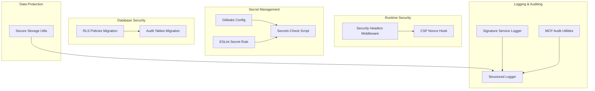
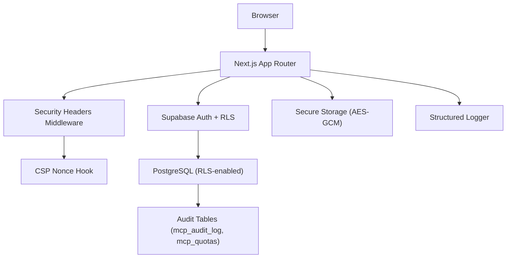
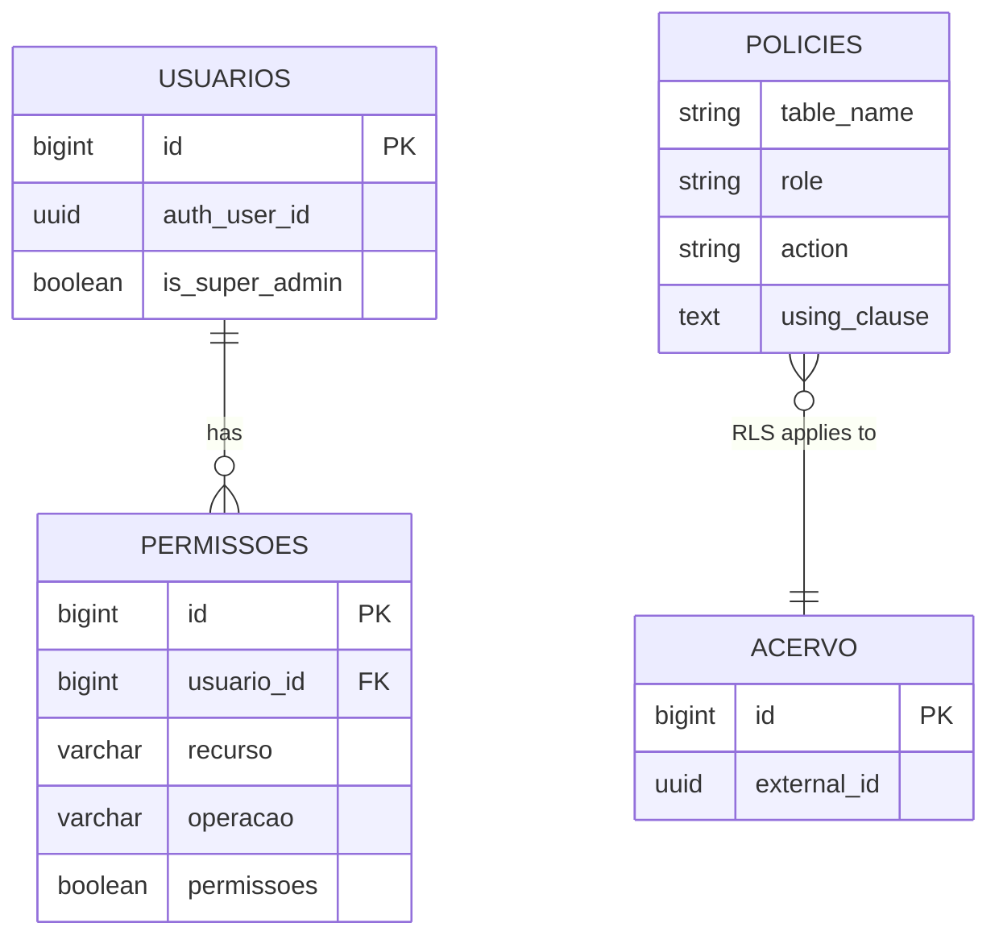
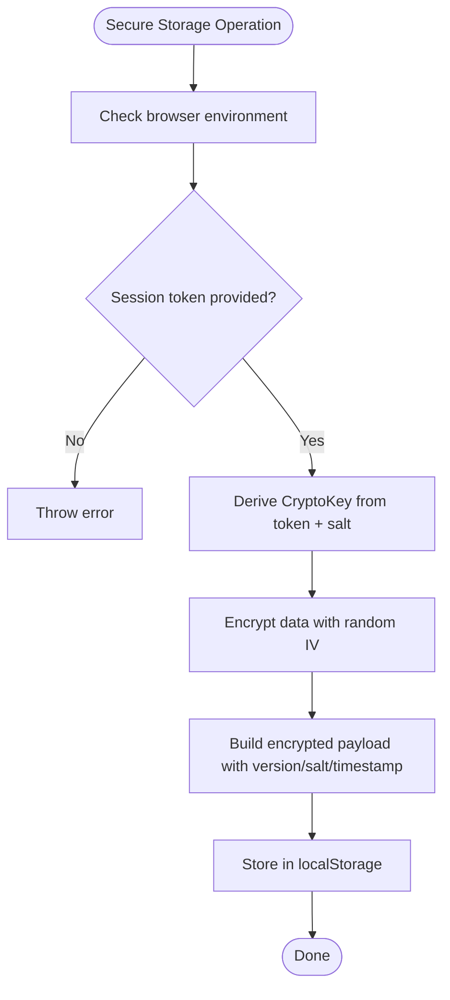
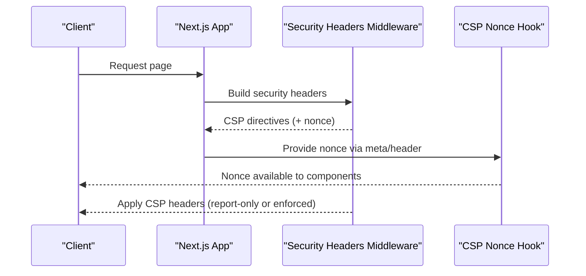
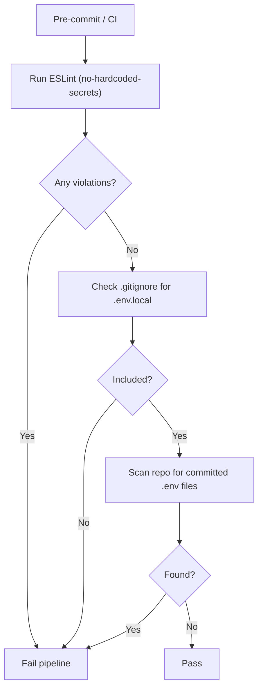
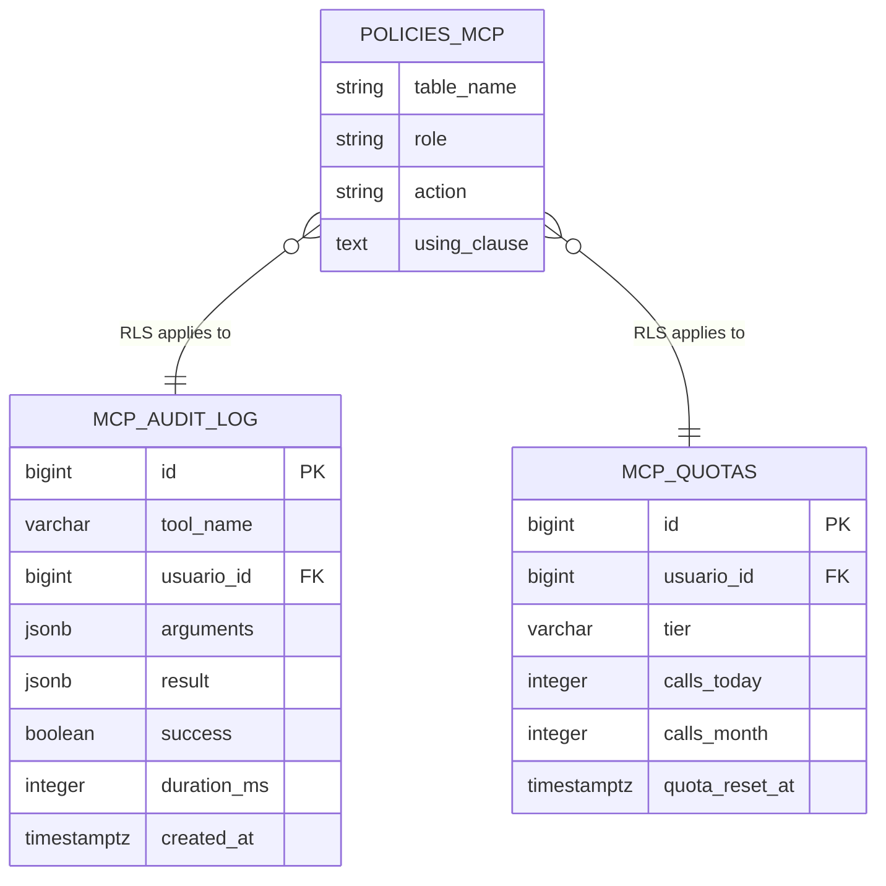
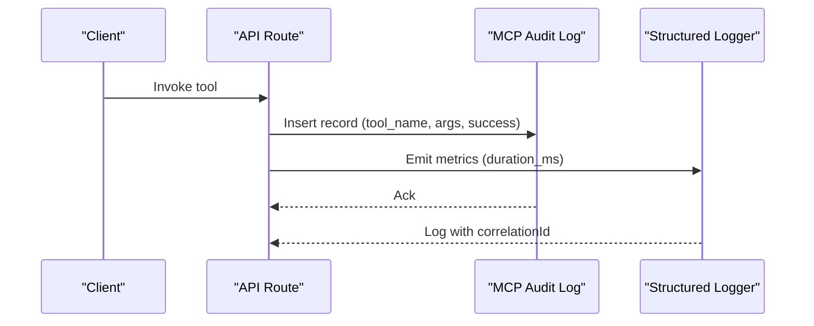
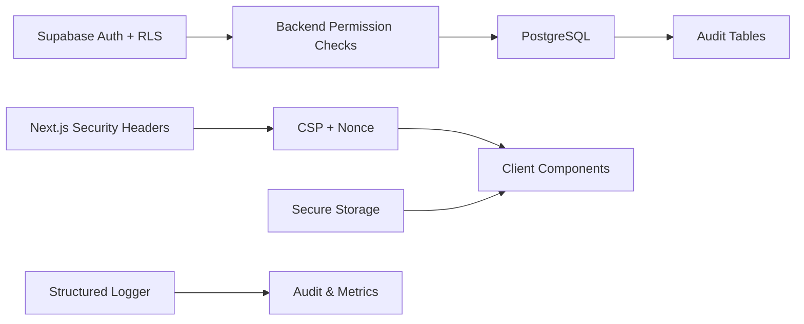

# Security Considerations

<cite>
**Referenced Files in This Document**
- [.gitleaks.toml](file://.gitleaks.toml)
- [eslint-rules/no-hardcoded-secrets.js](file://eslint-rules/no-hardcoded-secrets.js)
- [scripts/security/check-secrets.js](file://scripts/security/check-secrets.js)
- [scripts/security/check-plaintext-storage.js](file://scripts/security/check-plaintext-storage.js)
- [src/middleware/security-headers.ts](file://src/middleware/security-headers.ts)
- [src/hooks/use-csp-nonce.ts](file://src/hooks/use-csp-nonce.ts)
- [supabase/migrations/20251226120000_create_mcp_audit_log.sql](file://supabase/migrations/20251226120000_create_mcp_audit_log.sql)
- [supabase/migrations/20250120000001_fix_rls_policies_granular_permissions.sql](file://supabase/migrations/20250120000001_fix_rls_policies_granular_permissions.sql)
- [src/lib/utils/secure-storage.ts](file://src/lib/utils/secure-storage.ts)
- [src/lib/logger/index.ts](file://src/lib/logger/index.ts)
- [src/shared/assinatura-digital/services/logger.ts](file://src/shared/assinatura-digital/services/logger.ts)
- [src/lib/mcp/audit.ts](file://src/lib/mcp/audit.ts)
- [src/app/(authenticated)/captura/services/persistence/README.md](file://src/app/(authenticated)/captura/services/persistence/README.md)
</cite>

## Table of Contents
1. [Introduction](#introduction)
2. [Project Structure](#project-structure)
3. [Core Components](#core-components)
4. [Architecture Overview](#architecture-overview)
5. [Detailed Component Analysis](#detailed-component-analysis)
6. [Dependency Analysis](#dependency-analysis)
7. [Performance Considerations](#performance-considerations)
8. [Troubleshooting Guide](#troubleshooting-guide)
9. [Conclusion](#conclusion)
10. [Appendices](#appendices)

## Introduction
This document consolidates the security posture of the project across authentication and authorization, data protection, Content Security Policy (CSP), secret management, Row Level Security (RLS), access control, data isolation, encryption, secure communications, audit logging, compliance, and incident response. It synthesizes repository-backed evidence to guide secure development, deployment, and operations.

## Project Structure
Security-relevant areas include:
- Middleware and runtime headers for CSP and transport security
- CSP nonce distribution to client components
- Secret detection via ESLint rules and CI checks
- Gitleaks configuration for secret scanning
- Database RLS policies and audit tables
- Secure local storage utilities with encryption
- Structured logging with correlation IDs and audit events
- MCP audit logging and quotas

**Diagram sources**
- [src/middleware/security-headers.ts:1-324](file://src/middleware/security-headers.ts#L1-L324)
- [src/hooks/use-csp-nonce.ts:1-100](file://src/hooks/use-csp-nonce.ts#L1-L100)
- [.gitleaks.toml:1-87](file://.gitleaks.toml#L1-L87)
- [eslint-rules/no-hardcoded-secrets.js:1-43](file://eslint-rules/no-hardcoded-secrets.js#L1-L43)
- [scripts/security/check-secrets.js:1-60](file://scripts/security/check-secrets.js#L1-L60)
- [supabase/migrations/20250120000001_fix_rls_policies_granular_permissions.sql:1-455](file://supabase/migrations/20250120000001_fix_rls_policies_granular_permissions.sql#L1-L455)
- [supabase/migrations/20251226120000_create_mcp_audit_log.sql:1-161](file://supabase/migrations/20251226120000_create_mcp_audit_log.sql#L1-L161)
- [src/lib/utils/secure-storage.ts:1-290](file://src/lib/utils/secure-storage.ts#L1-L290)
- [src/lib/logger/index.ts:1-57](file://src/lib/logger/index.ts#L1-L57)
- [src/shared/assinatura-digital/services/logger.ts:109-158](file://src/shared/assinatura-digital/services/logger.ts#L109-L158)
- [src/lib/mcp/audit.ts:203-256](file://src/lib/mcp/audit.ts#L203-L256)

**Section sources**
- [src/middleware/security-headers.ts:1-324](file://src/middleware/security-headers.ts#L1-L324)
- [src/hooks/use-csp-nonce.ts:1-100](file://src/hooks/use-csp-nonce.ts#L1-L100)
- [.gitleaks.toml:1-87](file://.gitleaks.toml#L1-L87)
- [eslint-rules/no-hardcoded-secrets.js:1-43](file://eslint-rules/no-hardcoded-secrets.js#L1-L43)
- [scripts/security/check-secrets.js:1-60](file://scripts/security/check-secrets.js#L1-L60)
- [supabase/migrations/20250120000001_fix_rls_policies_granular_permissions.sql:1-455](file://supabase/migrations/20250120000001_fix_rls_policies_granular_permissions.sql#L1-L455)
- [supabase/migrations/20251226120000_create_mcp_audit_log.sql:1-161](file://supabase/migrations/20251226120000_create_mcp_audit_log.sql#L1-L161)
- [src/lib/utils/secure-storage.ts:1-290](file://src/lib/utils/secure-storage.ts#L1-L290)
- [src/lib/logger/index.ts:1-57](file://src/lib/logger/index.ts#L1-L57)
- [src/shared/assinatura-digital/services/logger.ts:109-158](file://src/shared/assinatura-digital/services/logger.ts#L109-L158)
- [src/lib/mcp/audit.ts:203-256](file://src/lib/mcp/audit.ts#L203-L256)

## Core Components
- Authentication and Authorization
  - Supabase Auth integrates with Next.js App Router sessions; RLS policies complement backend permission checks.
  - Granular permissions enforced via backend before write operations; service role bypass for internal tasks.
- Data Protection
  - AES-GCM/PBKDF2 encryption for sensitive client-side storage with time-based expiration.
- CSP Implementation
  - Strict CSP directives with report-only mode by default; nonce generation and distribution to client components.
- Secret Management
  - Gitleaks rules for secrets and PII; ESLint rule for hardcoded secrets; CI script to prevent committing environment files.
- Audit Logging
  - Structured logging with correlation IDs; MCP audit log with quotas; signature service audit validations.
- Compliance and Monitoring
  - Audit trails, quotas, and structured logs support compliance and incident response.

**Section sources**
- [supabase/migrations/20250120000001_fix_rls_policies_granular_permissions.sql:1-455](file://supabase/migrations/20250120000001_fix_rls_policies_granular_permissions.sql#L1-L455)
- [src/lib/utils/secure-storage.ts:1-290](file://src/lib/utils/secure-storage.ts#L1-L290)
- [src/middleware/security-headers.ts:1-324](file://src/middleware/security-headers.ts#L1-L324)
- [.gitleaks.toml:1-87](file://.gitleaks.toml#L1-L87)
- [eslint-rules/no-hardcoded-secrets.js:1-43](file://eslint-rules/no-hardcoded-secrets.js#L1-L43)
- [scripts/security/check-secrets.js:1-60](file://scripts/security/check-secrets.js#L1-L60)
- [src/lib/logger/index.ts:1-57](file://src/lib/logger/index.ts#L1-L57)
- [src/lib/mcp/audit.ts:203-256](file://src/lib/mcp/audit.ts#L203-L256)

## Architecture Overview
High-level security architecture integrating runtime headers, CSP, RLS, audit logging, and secure storage.

**Diagram sources**
- [src/middleware/security-headers.ts:1-324](file://src/middleware/security-headers.ts#L1-L324)
- [src/hooks/use-csp-nonce.ts:1-100](file://src/hooks/use-csp-nonce.ts#L1-L100)
- [supabase/migrations/20250120000001_fix_rls_policies_granular_permissions.sql:1-455](file://supabase/migrations/20250120000001_fix_rls_policies_granular_permissions.sql#L1-L455)
- [supabase/migrations/20251226120000_create_mcp_audit_log.sql:1-161](file://supabase/migrations/20251226120000_create_mcp_audit_log.sql#L1-L161)
- [src/lib/utils/secure-storage.ts:1-290](file://src/lib/utils/secure-storage.ts#L1-L290)
- [src/lib/logger/index.ts:1-57](file://src/lib/logger/index.ts#L1-L57)

## Detailed Component Analysis

### Authentication and Authorization
- Supabase Auth session integration with Next.js App Router.
- RLS enabled across tables; service role permitted full access; authenticated users granted read access for collaboration; backend enforces granular permissions and super admin bypass.
- Policies documented with comments and explicit roles.

**Diagram sources**
- [supabase/migrations/20250120000001_fix_rls_policies_granular_permissions.sql:1-455](file://supabase/migrations/20250120000001_fix_rls_policies_granular_permissions.sql#L1-L455)

**Section sources**
- [supabase/migrations/20250120000001_fix_rls_policies_granular_permissions.sql:1-455](file://supabase/migrations/20250120000001_fix_rls_policies_granular_permissions.sql#L1-L455)

### Data Protection and Secure Storage
- AES-GCM with PBKDF2-derived keys for client-side storage.
- Time-to-live (TTL) enforcement and encrypted payload format.
- Utilities for encryption, decryption, and secure item management.

**Diagram sources**
- [src/lib/utils/secure-storage.ts:184-290](file://src/lib/utils/secure-storage.ts#L184-L290)

**Section sources**
- [src/lib/utils/secure-storage.ts:1-290](file://src/lib/utils/secure-storage.ts#L1-L290)

### Content Security Policy (CSP)
- CSP directives built dynamically with nonce support for inline scripts/styles.
- Report-only mode by default; production adds HSTS and Report-To endpoint.
- Trusted domains configured for Supabase, storage, AI, video, chat widgets, etc.

**Diagram sources**
- [src/middleware/security-headers.ts:229-297](file://src/middleware/security-headers.ts#L229-L297)
- [src/hooks/use-csp-nonce.ts:1-100](file://src/hooks/use-csp-nonce.ts#L1-L100)

**Section sources**
- [src/middleware/security-headers.ts:1-324](file://src/middleware/security-headers.ts#L1-L324)
- [src/hooks/use-csp-nonce.ts:1-100](file://src/hooks/use-csp-nonce.ts#L1-L100)

### Secret Detection and Management
- Gitleaks rules for Supabase keys, OpenAI keys, generic API keys, and CPF/CNPJ.
- ESLint rule detects hardcoded secrets in code.
- CI script runs linting, verifies .gitignore exclusions, and blocks committed .env files.

**Diagram sources**
- [eslint-rules/no-hardcoded-secrets.js:1-43](file://eslint-rules/no-hardcoded-secrets.js#L1-L43)
- [scripts/security/check-secrets.js:1-60](file://scripts/security/check-secrets.js#L1-L60)
- [.gitleaks.toml:1-87](file://.gitleaks.toml#L1-L87)

**Section sources**
- [.gitleaks.toml:1-87](file://.gitleaks.toml#L1-L87)
- [eslint-rules/no-hardcoded-secrets.js:1-43](file://eslint-rules/no-hardcoded-secrets.js#L1-L43)
- [scripts/security/check-secrets.js:1-60](file://scripts/security/check-secrets.js#L1-L60)

### Row Level Security (RLS) Policies and Access Control
- RLS enabled on audit and operational tables; service role permitted full access; authenticated users granted read access.
- MCP audit log and quotas enforce access and usage controls with indices for performance.

**Diagram sources**
- [supabase/migrations/20251226120000_create_mcp_audit_log.sql:1-161](file://supabase/migrations/20251226120000_create_mcp_audit_log.sql#L1-L161)

**Section sources**
- [supabase/migrations/20251226120000_create_mcp_audit_log.sql:1-161](file://supabase/migrations/20251226120000_create_mcp_audit_log.sql#L1-L161)

### Audit Logging and Compliance
- Structured logging with correlation IDs for traceability.
- MCP audit log captures tool invocations, durations, and outcomes; quotas track usage.
- Signature service includes audit operations and entropy validation for legal compliance.

**Diagram sources**
- [src/lib/mcp/audit.ts:203-256](file://src/lib/mcp/audit.ts#L203-L256)
- [src/lib/logger/index.ts:1-57](file://src/lib/logger/index.ts#L1-L57)
- [src/shared/assinatura-digital/services/logger.ts:109-158](file://src/shared/assinatura-digital/services/logger.ts#L109-L158)

**Section sources**
- [src/lib/mcp/audit.ts:203-256](file://src/lib/mcp/audit.ts#L203-L256)
- [src/lib/logger/index.ts:1-57](file://src/lib/logger/index.ts#L1-L57)
- [src/shared/assinatura-digital/services/logger.ts:109-158](file://src/shared/assinatura-digital/services/logger.ts#L109-L158)

### Data Isolation Strategies
- RLS policies restrict access to authenticated users and service role.
- Backend permission checks and optional super admin bypass ensure least privilege.
- Indexing and initPlan guidance applied to RLS policies for performance.

**Section sources**
- [supabase/migrations/20250120000001_fix_rls_policies_granular_permissions.sql:1-455](file://supabase/migrations/20250120000001_fix_rls_policies_granular_permissions.sql#L1-L455)

### Encryption Requirements and Secure Communication Protocols
- Client-side encryption with AES-GCM/PBKDF2 and random IVs.
- Transport security via HSTS in production and upgrade-insecure-requests.
- CSP strict-src with trusted domains for media, AI, and third-party integrations.

**Section sources**
- [src/lib/utils/secure-storage.ts:1-290](file://src/lib/utils/secure-storage.ts#L1-L290)
- [src/middleware/security-headers.ts:1-324](file://src/middleware/security-headers.ts#L1-L324)

### Practical Examples
- CSP nonce distribution to React components via meta tag or header.
- Secret scanning pre-commit via ESLint and Gitleaks; CI blocks committed .env files.
- RLS policy creation for audit tables with service role and authenticated user access.
- Secure storage usage for tokens or credentials with TTL and encryption.

**Section sources**
- [src/hooks/use-csp-nonce.ts:1-100](file://src/hooks/use-csp-nonce.ts#L1-L100)
- [scripts/security/check-secrets.js:1-60](file://scripts/security/check-secrets.js#L1-L60)
- [supabase/migrations/20251226120000_create_mcp_audit_log.sql:1-161](file://supabase/migrations/20251226120000_create_mcp_audit_log.sql#L1-L161)
- [src/lib/utils/secure-storage.ts:1-290](file://src/lib/utils/secure-storage.ts#L1-L290)

### Vulnerability Assessment
- Run secret detection locally and in CI.
- Review CSP report-only logs and adjust directives iteratively.
- Validate RLS policies with indexes and initPlan guidance.
- Monitor MCP audit logs for anomalies and quota breaches.

**Section sources**
- [scripts/security/check-secrets.js:1-60](file://scripts/security/check-secrets.js#L1-L60)
- [src/middleware/security-headers.ts:1-324](file://src/middleware/security-headers.ts#L1-L324)
- [supabase/migrations/20250120000001_fix_rls_policies_granular_permissions.sql:1-455](file://supabase/migrations/20250120000001_fix_rls_policies_granular_permissions.sql#L1-L455)
- [src/lib/mcp/audit.ts:203-256](file://src/lib/mcp/audit.ts#L203-L256)

### Incident Response Procedures
- Enable CSP enforcement after validation; collect Report-To reports.
- Investigate audit logs for failed tool calls and excessive usage.
- Rotate secrets flagged by Gitleaks and reissue tokens.
- Revoke compromised access and review RLS policy applicability.

**Section sources**
- [src/middleware/security-headers.ts:1-324](file://src/middleware/security-headers.ts#L1-L324)
- [supabase/migrations/20251226120000_create_mcp_audit_log.sql:1-161](file://supabase/migrations/20251226120000_create_mcp_audit_log.sql#L1-L161)
- [.gitleaks.toml:1-87](file://.gitleaks.toml#L1-L87)

## Dependency Analysis
Security components depend on:
- Supabase Auth and RLS for identity and row-level access.
- Next.js middleware and hooks for CSP and nonce distribution.
- Local secure storage utilities for sensitive client-side data.
- Structured logging for observability and audit trails.

**Diagram sources**
- [supabase/migrations/20250120000001_fix_rls_policies_granular_permissions.sql:1-455](file://supabase/migrations/20250120000001_fix_rls_policies_granular_permissions.sql#L1-L455)
- [supabase/migrations/20251226120000_create_mcp_audit_log.sql:1-161](file://supabase/migrations/20251226120000_create_mcp_audit_log.sql#L1-L161)
- [src/middleware/security-headers.ts:1-324](file://src/middleware/security-headers.ts#L1-L324)
- [src/lib/utils/secure-storage.ts:1-290](file://src/lib/utils/secure-storage.ts#L1-L290)
- [src/lib/logger/index.ts:1-57](file://src/lib/logger/index.ts#L1-L57)

**Section sources**
- [supabase/migrations/20250120000001_fix_rls_policies_granular_permissions.sql:1-455](file://supabase/migrations/20250120000001_fix_rls_policies_granular_permissions.sql#L1-L455)
- [supabase/migrations/20251226120000_create_mcp_audit_log.sql:1-161](file://supabase/migrations/20251226120000_create_mcp_audit_log.sql#L1-L161)
- [src/middleware/security-headers.ts:1-324](file://src/middleware/security-headers.ts#L1-L324)
- [src/lib/utils/secure-storage.ts:1-290](file://src/lib/utils/secure-storage.ts#L1-L290)
- [src/lib/logger/index.ts:1-57](file://src/lib/logger/index.ts#L1-L57)

## Performance Considerations
- RLS policy performance improvements: indexes on filtered columns, wrapping auth functions in subqueries to leverage initPlan caching, minimizing joins, specifying roles explicitly.
- MCP audit log indexing supports fast filtering and cleanup.
- Secure storage TTL prevents stale data accumulation.

**Section sources**
- [supabase/migrations/20250120000001_fix_rls_policies_granular_permissions.sql:156-247](file://supabase/migrations/20250120000001_fix_rls_policies_granular_permissions.sql#L156-L247)
- [supabase/migrations/20251226120000_create_mcp_audit_log.sql:24-94](file://supabase/migrations/20251226120000_create_mcp_audit_log.sql#L24-L94)
- [src/lib/utils/secure-storage.ts:1-290](file://src/lib/utils/secure-storage.ts#L1-L290)

## Troubleshooting Guide
- CSP violations: switch to enforcement mode after validating directives; review Report-To reports; confirm nonce availability in meta/header.
- Secret leaks: rerun secret checks; ensure .env files are excluded from commits; rotate affected keys.
- RLS access denied: verify user role and backend permission checks; confirm indexes exist for policy filters.
- Audit anomalies: inspect MCP audit logs and quotas; investigate failures and durations; schedule cleanup jobs.

**Section sources**
- [src/middleware/security-headers.ts:1-324](file://src/middleware/security-headers.ts#L1-L324)
- [scripts/security/check-secrets.js:1-60](file://scripts/security/check-secrets.js#L1-L60)
- [supabase/migrations/20250120000001_fix_rls_policies_granular_permissions.sql:1-455](file://supabase/migrations/20250120000001_fix_rls_policies_granular_permissions.sql#L1-L455)
- [src/lib/mcp/audit.ts:203-256](file://src/lib/mcp/audit.ts#L203-L256)

## Conclusion
The project implements a layered security model: Supabase Auth and RLS for access control, CSP with nonce-based strictness, secret detection and management, secure client-side storage, and comprehensive audit logging. Adhering to the practices and references herein ensures robust security, compliance readiness, and resilient incident response.

## Appendices
- Compliance considerations: MCP audit logs, quotas, and structured logs support governance and traceability. Signature service audit operations align with legal validation requirements.
- Data capture auditing: PostgreSQL-based structured logs and raw payloads enable granular auditability for capture operations.

**Section sources**
- [src/shared/assinatura-digital/services/logger.ts:109-158](file://src/shared/assinatura-digital/services/logger.ts#L109-L158)
- [src/app/(authenticated)/captura/services/persistence/README.md](file://src/app/(authenticated)/captura/services/persistence/README.md#L1-L30)