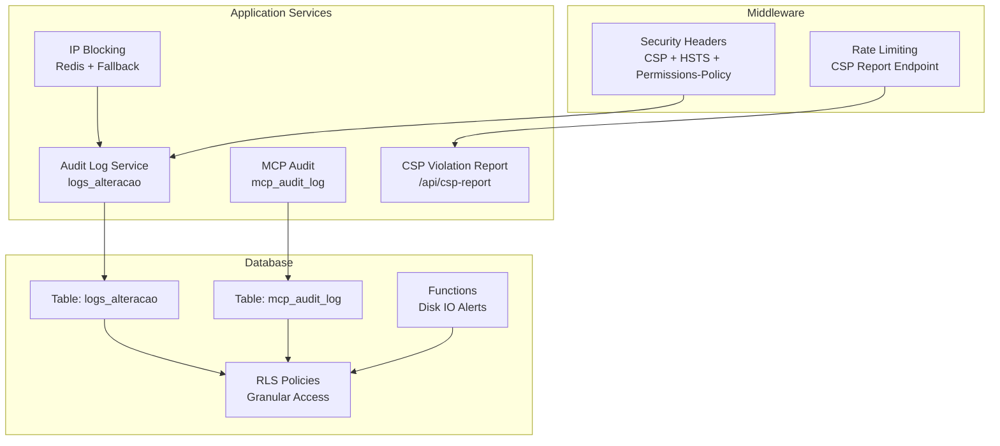
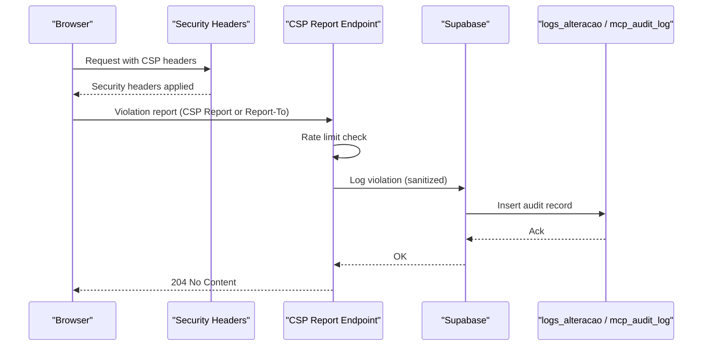
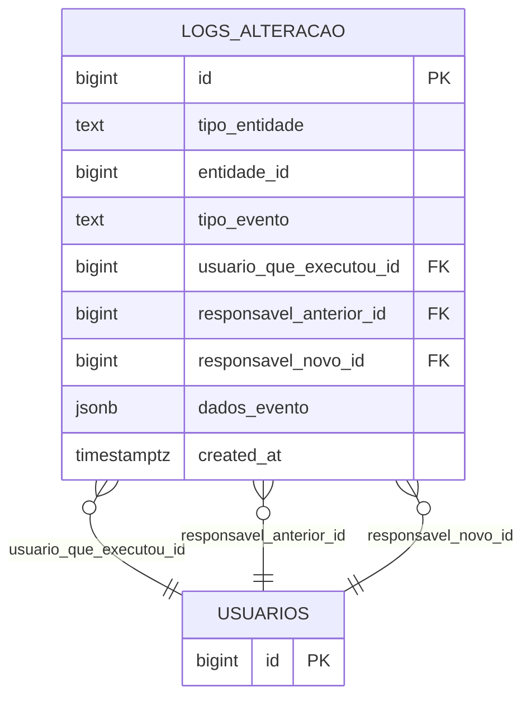
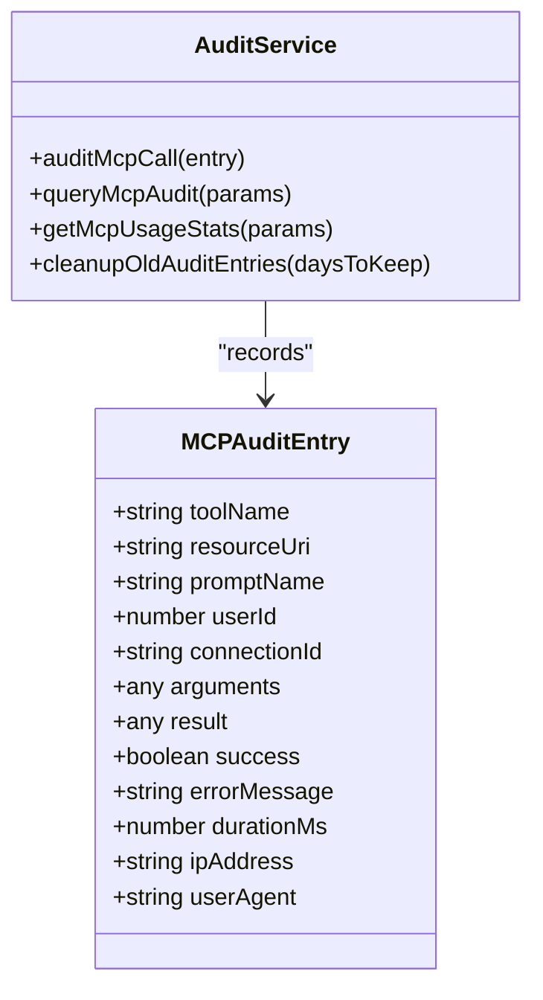
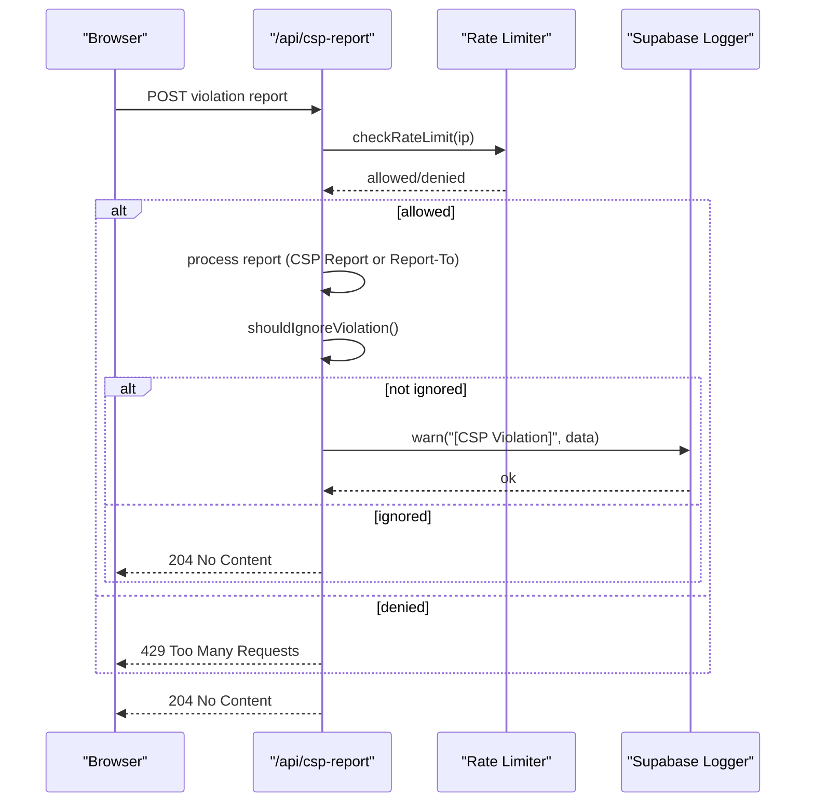
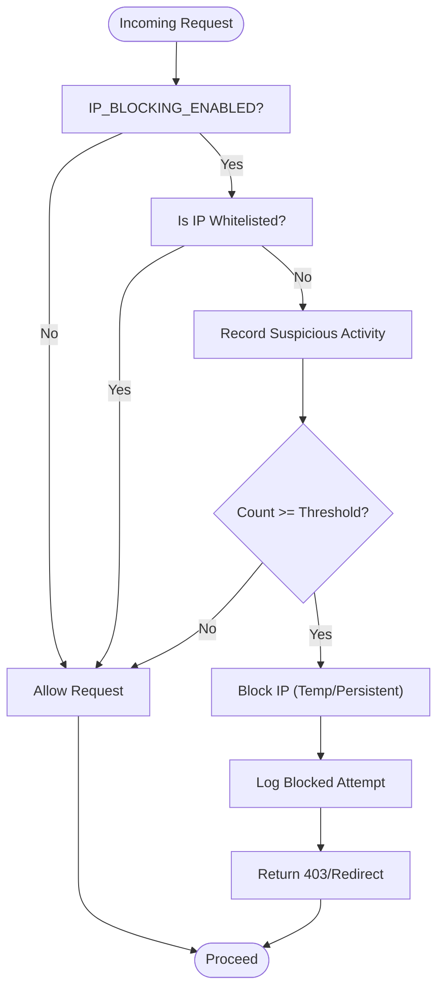
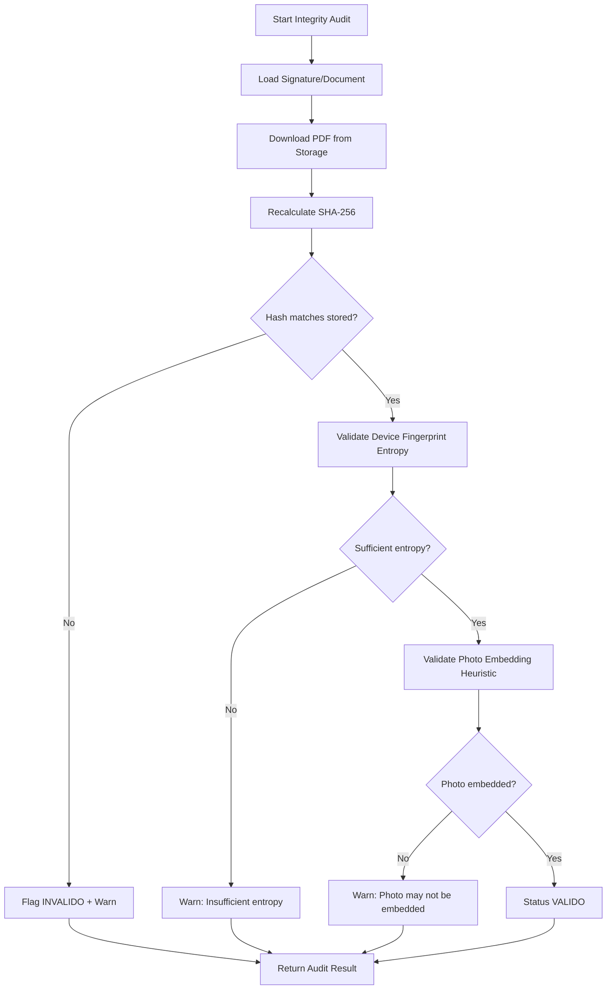
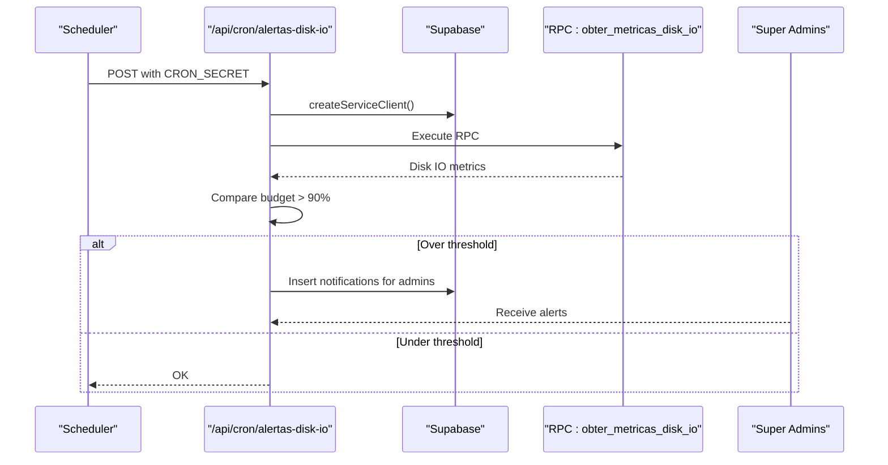
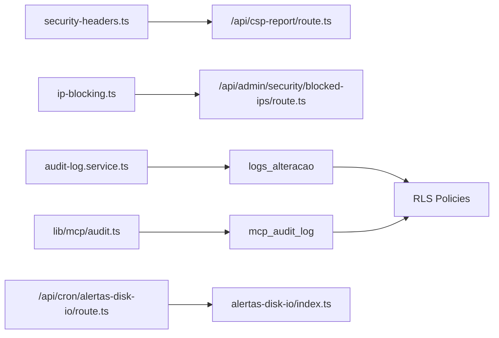

# Security Monitoring and Auditing

<cite>
**Referenced Files in This Document**
- [audit-log.service.ts](file://src/lib/domain/audit/services/audit-log.service.ts)
- [use-audit-logs.ts](file://src/lib/domain/audit/hooks/use-audit-logs.ts)
- [create_logs_alteracao.sql](file://supabase/migrations/20251117015304_create_logs_alteracao.sql)
- [fix_rls_policies_granular_permissions.sql](file://supabase/migrations/00000000000001_production_schema.sql)
- [audit.ts](file://src/lib/mcp/audit.ts)
- [20251226120000_create_mcp_audit_log.sql](file://supabase/migrations/20251226120000_create_mcp_audit_log.sql)
- [mcp_audit.sql](file://supabase/schemas/40_mcp_audit.sql)
- [route.ts](file://src/app/api/csp-report/route.ts)
- [security-headers.ts](file://src/middleware/security-headers.ts)
- [ip-blocking.ts](file://src/lib/security/ip-blocking.ts)
- [ip-blocking-edge.ts](file://src/lib/security/ip-blocking-edge.ts)
- [blocked-ips/route.ts](file://src/app/api/admin/security/blocked-ips/route.ts)
- [audit-atividades-actions.ts](file://src/app/(authenticated)/usuarios/actions/audit-atividades-actions.ts)
- [audit.service.ts](file://src/shared/assinatura-digital/services/signature/audit.service.ts)
- [logger.ts](file://src/lib/supabase/logger.ts)
- [route.ts](file://src/app/api/cron/alertas-disk-io/route.ts)
- [index.ts](file://supabase/functions/alertas-disk-io/index.ts)
- [database.types.ts](file://src/lib/supabase/database.types.ts)
</cite>

## Table of Contents
1. [Introduction](#introduction)
2. [Project Structure](#project-structure)
3. [Core Components](#core-components)
4. [Architecture Overview](#architecture-overview)
5. [Detailed Component Analysis](#detailed-component-analysis)
6. [Dependency Analysis](#dependency-analysis)
7. [Performance Considerations](#performance-considerations)
8. [Troubleshooting Guide](#troubleshooting-guide)
9. [Conclusion](#conclusion)
10. [Appendices](#appendices)

## Introduction
This document provides comprehensive guidance for security monitoring and auditing in the system. It covers audit logging, intrusion detection, security event tracking, CSP violation reporting, security header validation, access pattern analysis, dashboard implementation, alerting configuration, incident response workflows, compliance logging, retention policies, and forensic analysis. It also addresses security metrics, performance monitoring, continuous security assessment, SIEM integration, and automated security response procedures.

## Project Structure
Security monitoring spans three layers:
- Middleware and transport security: CSP, security headers, and rate limiting
- Application services: audit logging, change tracking, and MCP usage tracking
- Database and functions: structured audit tables, RLS policies, and alerting functions

**Diagram sources**
- [security-headers.ts:1-329](file://src/middleware/security-headers.ts#L1-L329)
- [route.ts:1-237](file://src/app/api/csp-report/route.ts#L1-L237)
- [audit-log.service.ts:1-51](file://src/lib/domain/audit/services/audit-log.service.ts#L1-L51)
- [audit.ts:1-271](file://src/lib/mcp/audit.ts#L1-L271)
- [ip-blocking.ts:1-598](file://src/lib/security/ip-blocking.ts#L1-L598)
- [create_logs_alteracao.sql:1-54](file://supabase/migrations/20251117015304_create_logs_alteracao.sql#L1-L54)
- [20251226120000_create_mcp_audit_log.sql:152-160](file://supabase/migrations/20251226120000_create_mcp_audit_log.sql#L152-L160)
- [mcp_audit.sql:1-120](file://supabase/schemas/40_mcp_audit.sql#L1-L120)
- [fix_rls_policies_granular_permissions.sql:276-311](file://supabase/migrations/00000000000001_production_schema.sql#L276-L311)
- [index.ts:176-230](file://supabase/functions/alertas-disk-io/index.ts#L176-L230)

**Section sources**
- [security-headers.ts:1-329](file://src/middleware/security-headers.ts#L1-L329)
- [route.ts:1-237](file://src/app/api/csp-report/route.ts#L1-L237)
- [audit-log.service.ts:1-51](file://src/lib/domain/audit/services/audit-log.service.ts#L1-L51)
- [audit.ts:1-271](file://src/lib/mcp/audit.ts#L1-L271)
- [ip-blocking.ts:1-598](file://src/lib/security/ip-blocking.ts#L1-L598)
- [create_logs_alteracao.sql:1-54](file://supabase/migrations/20251117015304_create_logs_alteracao.sql#L1-L54)
- [20251226120000_create_mcp_audit_log.sql:152-160](file://supabase/migrations/20251226120000_create_mcp_audit_log.sql#L152-L160)
- [mcp_audit.sql:1-120](file://supabase/schemas/40_mcp_audit.sql#L1-L120)
- [fix_rls_policies_granular_permissions.sql:276-311](file://supabase/migrations/00000000000001_production_schema.sql#L276-L311)
- [index.ts:176-230](file://supabase/functions/alertas-disk-io/index.ts#L176-L230)

## Core Components
- Audit logging for entity changes: generic logs table with JSONB flexibility and RLS policies for authenticated access.
- MCP audit trail: structured logging of tool calls, durations, outcomes, and contextual metadata.
- CSP violation reporting: endpoint receiving browser CSP violation reports with rate limiting and filtering.
- Security headers: CSP (report-only by default), HSTS, XFO, XCTO, Referrer-Policy, Permissions-Policy, and Report-To.
- Intrusion detection: IP blocking with Redis-backed sliding windows and in-memory fallback; admin-managed whitelisting and blocking.
- Compliance and forensic analysis: signature integrity audit with hash verification, device fingerprint entropy checks, and embedding validation.
- Database alerting: Disk IO budget monitoring with notifications to administrators.

**Section sources**
- [audit-log.service.ts:1-51](file://src/lib/domain/audit/services/audit-log.service.ts#L1-L51)
- [create_logs_alteracao.sql:1-54](file://supabase/migrations/20251117015304_create_logs_alteracao.sql#L1-L54)
- [audit.ts:1-271](file://src/lib/mcp/audit.ts#L1-L271)
- [20251226120000_create_mcp_audit_log.sql:152-160](file://supabase/migrations/20251226120000_create_mcp_audit_log.sql#L152-L160)
- [route.ts:1-237](file://src/app/api/csp-report/route.ts#L1-L237)
- [security-headers.ts:1-329](file://src/middleware/security-headers.ts#L1-L329)
- [ip-blocking.ts:1-598](file://src/lib/security/ip-blocking.ts#L1-L598)
- [ip-blocking-edge.ts:1-149](file://src/lib/security/ip-blocking-edge.ts#L1-L149)
- [audit.service.ts:1-539](file://src/shared/assinatura-digital/services/signature/audit.service.ts#L1-L539)
- [route.ts:1-87](file://src/app/api/cron/alertas-disk-io/route.ts#L1-L87)
- [index.ts:176-230](file://supabase/functions/alertas-disk-io/index.ts#L176-L230)

## Architecture Overview
The security monitoring architecture integrates middleware, application services, and database functions to provide comprehensive visibility and protection.

**Diagram sources**
- [security-headers.ts:232-280](file://src/middleware/security-headers.ts#L232-L280)
- [route.ts:136-202](file://src/app/api/csp-report/route.ts#L136-L202)
- [create_logs_alteracao.sql:1-54](file://supabase/migrations/20251117015304_create_logs_alteracao.sql#L1-L54)
- [20251226120000_create_mcp_audit_log.sql:152-160](file://supabase/migrations/20251226120000_create_mcp_audit_log.sql#L152-L160)

## Detailed Component Analysis

### Audit Logging and Change Tracking
- Generic audit log table captures entity changes with JSONB for flexible event data and indices for performance.
- RLS policies grant authenticated read access and service role full access for backend writes.
- Frontend hook and service provide paginated retrieval of audit logs for UI timelines.

**Diagram sources**
- [create_logs_alteracao.sql:1-54](file://supabase/migrations/20251117015304_create_logs_alteracao.sql#L1-L54)
- [audit-log.service.ts:1-51](file://src/lib/domain/audit/services/audit-log.service.ts#L1-L51)

**Section sources**
- [create_logs_alteracao.sql:1-54](file://supabase/migrations/20251117015304_create_logs_alteracao.sql#L1-L54)
- [fix_rls_policies_granular_permissions.sql:276-311](file://supabase/migrations/00000000000001_production_schema.sql#L276-L311)
- [audit-log.service.ts:1-51](file://src/lib/domain/audit/services/audit-log.service.ts#L1-L51)
- [use-audit-logs.ts:1-15](file://src/lib/domain/audit/hooks/use-audit-logs.ts#L1-L15)

### MCP Audit Trail
- Structured logging of MCP tool calls with sanitization, success flags, durations, and contextual metadata.
- Query APIs support filtering by tool, user, date range, and outcome.
- Statistics computation aggregates top tools and error rates.
- Cleanup routine removes old entries to maintain retention.

**Diagram sources**
- [audit.ts:15-271](file://src/lib/mcp/audit.ts#L15-L271)
- [20251226120000_create_mcp_audit_log.sql:152-160](file://supabase/migrations/20251226120000_create_mcp_audit_log.sql#L152-L160)
- [mcp_audit.sql:1-120](file://supabase/schemas/40_mcp_audit.sql#L1-L120)
- [database.types.ts:4919-4959](file://src/lib/supabase/database.types.ts#L4919-L4959)

**Section sources**
- [audit.ts:1-271](file://src/lib/mcp/audit.ts#L1-L271)
- [20251226120000_create_mcp_audit_log.sql:152-160](file://supabase/migrations/20251226120000_create_mcp_audit_log.sql#L152-L160)
- [mcp_audit.sql:1-120](file://supabase/schemas/40_mcp_audit.sql#L1-L120)
- [database.types.ts:4919-4959](file://src/lib/supabase/database.types.ts#L4919-L4959)

### CSP Violation Reporting and Security Header Validation
- CSP Report endpoint accepts legacy CSP Reports and Report-To API bodies, applies rate limiting, ignores benign false positives, and logs violations.
- Security headers middleware builds CSP (report-only by default), HSTS, XFO, XCTO, Referrer-Policy, Permissions-Policy, and Report-To headers.
- Nonce generation and header injection support CSP strict-dynamic.

**Diagram sources**
- [route.ts:136-202](file://src/app/api/csp-report/route.ts#L136-L202)
- [security-headers.ts:232-280](file://src/middleware/security-headers.ts#L232-L280)

**Section sources**
- [route.ts:1-237](file://src/app/api/csp-report/route.ts#L1-L237)
- [security-headers.ts:1-329](file://src/middleware/security-headers.ts#L1-L329)

### Intrusion Detection and Access Pattern Analysis
- IP blocking system records suspicious activity (auth failures, rate limit abuse, invalid endpoints) with sliding window counters.
- Automatic blocking thresholds trigger temporary or permanent blocks; whitelisting bypasses checks.
- Admin endpoints manage blocked IPs, whitelist, and clear suspicious activity.
- Edge-compatible IP blocking uses in-memory storage for middleware environments.

**Diagram sources**
- [ip-blocking.ts:363-423](file://src/lib/security/ip-blocking.ts#L363-L423)
- [blocked-ips/route.ts:125-213](file://src/app/api/admin/security/blocked-ips/route.ts#L125-L213)

**Section sources**
- [ip-blocking.ts:1-598](file://src/lib/security/ip-blocking.ts#L1-L598)
- [ip-blocking-edge.ts:1-149](file://src/lib/security/ip-blocking-edge.ts#L1-L149)
- [blocked-ips/route.ts:84-213](file://src/app/api/admin/security/blocked-ips/route.ts#L84-L213)

### Compliance Logging and Forensic Analysis
- Signature integrity audit validates cryptographic hash consistency, device fingerprint entropy, and photo embedding heuristics.
- Results include status, warnings, errors, and detailed metrics for legal and compliance purposes.
- Audit actions are logged in MCP audit trail for traceability.

**Diagram sources**
- [audit.service.ts:73-314](file://src/shared/assinatura-digital/services/signature/audit.service.ts#L73-L314)

**Section sources**
- [audit.service.ts:1-539](file://src/shared/assinatura-digital/services/signature/audit.service.ts#L1-L539)

### Security Metrics, Performance Monitoring, and Alerting
- Database alerting function monitors Disk IO budget and sends notifications to super admins when thresholds are exceeded.
- Supabase query logger supports debug mode for SQL performance insights.
- MCP usage statistics provide top tools and error rates for capacity planning and anomaly detection.

**Diagram sources**
- [route.ts:61-87](file://src/app/api/cron/alertas-disk-io/route.ts#L61-L87)
- [index.ts:176-230](file://supabase/functions/alertas-disk-io/index.ts#L176-L230)

**Section sources**
- [route.ts:1-87](file://src/app/api/cron/alertas-disk-io/route.ts#L1-L87)
- [index.ts:176-230](file://supabase/functions/alertas-disk-io/index.ts#L176-L230)
- [logger.ts:1-217](file://src/lib/supabase/logger.ts#L1-L217)
- [audit.ts:155-242](file://src/lib/mcp/audit.ts#L155-L242)

### SIEM Integration and Automated Security Response
- CSP violation reports are logged to Supabase for ingestion by SIEM systems.
- MCP audit logs provide structured telemetry for external SIEM correlation.
- Disk IO budget alerts trigger internal notifications; extend with webhook dispatch for SIEM forwarding.
- Admin-managed IP blocking can be integrated with SIEM watchlists for automated remediation.

**Section sources**
- [route.ts:1-237](file://src/app/api/csp-report/route.ts#L1-L237)
- [audit.ts:1-271](file://src/lib/mcp/audit.ts#L1-L271)
- [blocked-ips/route.ts:125-213](file://src/app/api/admin/security/blocked-ips/route.ts#L125-L213)

## Dependency Analysis
Security monitoring components depend on:
- Supabase for audit tables, RLS, and RPC functions
- Redis for distributed IP blocking state (optional fallback to in-memory)
- Environment variables for thresholds, secrets, and URIs
- Middleware for CSP and security headers

**Diagram sources**
- [security-headers.ts:1-329](file://src/middleware/security-headers.ts#L1-L329)
- [route.ts:1-237](file://src/app/api/csp-report/route.ts#L1-L237)
- [ip-blocking.ts:1-598](file://src/lib/security/ip-blocking.ts#L1-L598)
- [blocked-ips/route.ts:84-213](file://src/app/api/admin/security/blocked-ips/route.ts#L84-L213)
- [audit-log.service.ts:1-51](file://src/lib/domain/audit/services/audit-log.service.ts#L1-L51)
- [audit.ts:1-271](file://src/lib/mcp/audit.ts#L1-L271)
- [route.ts:1-87](file://src/app/api/cron/alertas-disk-io/route.ts#L1-L87)
- [index.ts:176-230](file://supabase/functions/alertas-disk-io/index.ts#L176-L230)

**Section sources**
- [security-headers.ts:1-329](file://src/middleware/security-headers.ts#L1-L329)
- [route.ts:1-237](file://src/app/api/csp-report/route.ts#L1-L237)
- [ip-blocking.ts:1-598](file://src/lib/security/ip-blocking.ts#L1-L598)
- [blocked-ips/route.ts:84-213](file://src/app/api/admin/security/blocked-ips/route.ts#L84-L213)
- [audit-log.service.ts:1-51](file://src/lib/domain/audit/services/audit-log.service.ts#L1-L51)
- [audit.ts:1-271](file://src/lib/mcp/audit.ts#L1-L271)
- [route.ts:1-87](file://src/app/api/cron/alertas-disk-io/route.ts#L1-L87)
- [index.ts:176-230](file://supabase/functions/alertas-disk-io/index.ts#L176-L230)

## Performance Considerations
- Use indices on audit tables for filtering by tool, user, and timestamps.
- Apply rate limiting on CSP report endpoint to prevent abuse.
- Enable Redis-backed IP blocking for production; fallback to in-memory for middleware-only environments.
- Keep MCP audit retention aligned with compliance requirements; schedule cleanup jobs.
- Monitor Disk IO budget via cron-triggered alerts to avoid performance degradation.

[No sources needed since this section provides general guidance]

## Troubleshooting Guide
- CSP violations flooding: Verify report-only mode, adjust ignored sources, and confirm Report-To configuration.
- Missing audit logs: Confirm RLS policies and authenticated access; verify service role writes.
- MCP audit gaps: Check sanitization of sensitive data and ensure audit calls are invoked after operations.
- IP blocking not working: Validate Redis availability; inspect fallback memory state and thresholds.
- Disk IO alerts not firing: Confirm CRON_SECRET and Management API token; verify RPC function availability.

**Section sources**
- [route.ts:108-134](file://src/app/api/csp-report/route.ts#L108-L134)
- [fix_rls_policies_granular_permissions.sql:276-311](file://supabase/migrations/00000000000001_production_schema.sql#L276-L311)
- [audit.ts:47-69](file://src/lib/mcp/audit.ts#L47-L69)
- [ip-blocking.ts:371-423](file://src/lib/security/ip-blocking.ts#L371-L423)
- [route.ts:65-73](file://src/app/api/cron/alertas-disk-io/route.ts#L65-L73)

## Conclusion
The system provides a robust foundation for security monitoring and auditing through structured audit logs, MCP telemetry, CSP violation reporting, security headers, IP-based intrusion detection, compliance-focused integrity audits, and database alerting. Integrating with SIEM and automating remediation steps enables continuous security assessment and rapid incident response.

[No sources needed since this section summarizes without analyzing specific files]

## Appendices

### Practical Examples
- Security dashboard implementation: Use MCP usage statistics and audit log queries to power dashboards and widgets.
- Alerting configuration: Set up Disk IO budget thresholds, CSP violation rate limits, and IP blocking thresholds; route notifications to administrators.
- Incident response workflows: On CSP violations, triage benign vs malicious; on IP blocks, escalate to admin review; on integrity audits, flag documents for legal review.

[No sources needed since this section provides general guidance]