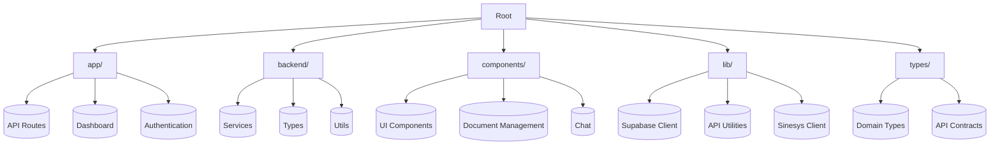
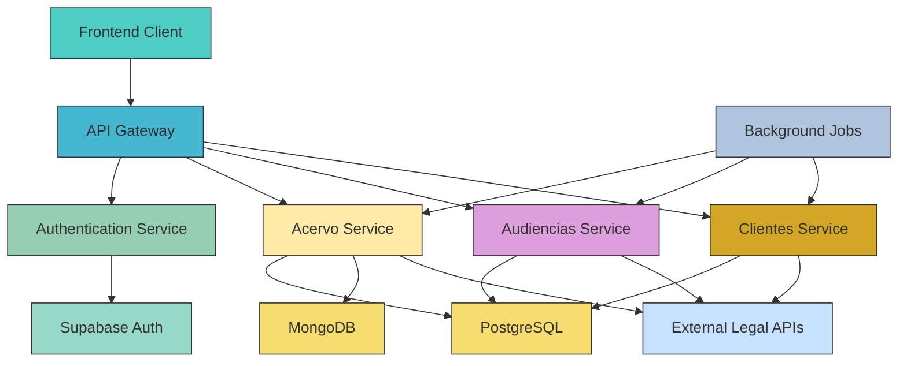
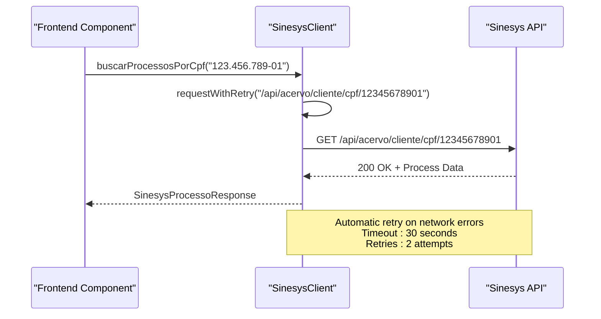
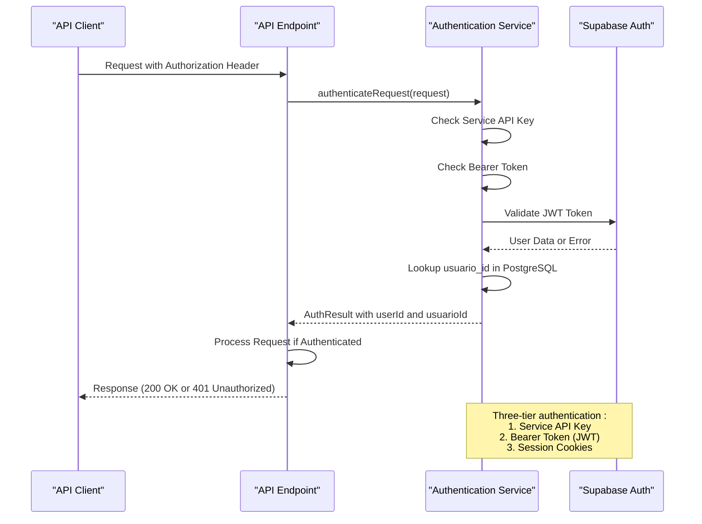
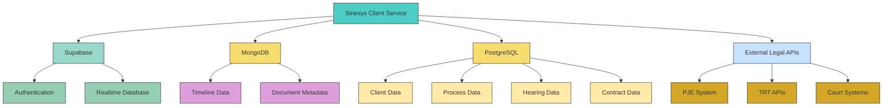

# Sinesys Client Service

<cite>
**Referenced Files in This Document**   
- [sinesys-client.ts](file://lib/services/sinesys-client.ts)
- [meu-processo-types.ts](file://lib/types/meu-processo-types.ts)
- [acervo/cliente/cpf/[cpf]/route.ts](file://app/api/acervo/cliente/cpf/[cpf]/route.ts)
- [audiencias/cliente/cpf/[cpf]/route.ts](file://app/api/audiencias/cliente/cpf/[cpf]/route.ts)
- [clientes/buscar/por-cpf/[cpf]/route.ts](file://app/api/clientes/buscar/por-cpf/[cpf]/route.ts)
- [api-auth.ts](file://backend/auth/api-auth.ts)
- [buscar-processos-cliente-cpf.service.ts](file://backend/acervo/services/buscar-processos-cliente-cpf.service.ts)
- [buscar-audiencias-cliente-cpf.service.ts](file://backend/audiencias/services/buscar-audiencias-cliente-cpf.service.ts)
- [buscar-cliente.service.ts](file://backend/clientes/services/clientes/buscar-cliente.service.ts)
</cite>

## Table of Contents
1. [Introduction](#introduction)
2. [Project Structure](#project-structure)
3. [Core Components](#core-components)
4. [Architecture Overview](#architecture-overview)
5. [Detailed Component Analysis](#detailed-component-analysis)
6. [Dependency Analysis](#dependency-analysis)
7. [Performance Considerations](#performance-considerations)
8. [Troubleshooting Guide](#troubleshooting-guide)
9. [Conclusion](#conclusion)

## Introduction
The Sinesys Client Service is a comprehensive legal technology platform designed to manage client data, court proceedings, hearings, contracts, and financial agreements. The system integrates with external legal databases and provides a unified interface for law firms to track client cases, manage digital signatures, and automate workflows. The service is built with a microservices architecture, leveraging Supabase for authentication and PostgreSQL for data persistence, while incorporating MongoDB for timeline data storage. The system supports advanced features such as AI-powered document processing, real-time collaboration, and secure digital signature workflows.

## Project Structure
The Sinesys Client Service follows a well-organized directory structure that separates concerns between frontend, backend, and shared components. The application is built using Next.js with a clear separation between client-side and server-side functionality. The structure includes dedicated directories for API routes, backend services, frontend components, and utility functions.



**Diagram sources**
- [app/](file://app/)
- [backend/](file://backend/)
- [components/](file://components/)
- [lib/](file://lib/)
- [types/](file://types/)

**Section sources**
- [app/](file://app/)
- [backend/](file://backend/)
- [components/](file://components/)
- [lib/](file://lib/)
- [types/](file://types/)

## Core Components
The Sinesys Client Service is built around several core components that handle client data retrieval, authentication, and API communication. The primary component is the SinesysClient class, which serves as a centralized abstraction layer for all API interactions. This client handles authentication, request retries, and error handling, providing a consistent interface for consuming various endpoints. The system also includes specialized services for handling acervo (legal proceedings), audiencias (hearings), and cliente (client) data, each with their own persistence and business logic layers. The architecture follows a service-oriented pattern where frontend components interact with API routes, which in turn orchestrate backend services that access data from multiple sources including PostgreSQL, MongoDB, and external APIs.

**Section sources**
- [sinesys-client.ts](file://lib/services/sinesys-client.ts)
- [meu-processo-types.ts](file://lib/types/meu-processo-types.ts)
- [acervo/cliente/cpf/[cpf]/route.ts](file://app/api/acervo/cliente/cpf/[cpf]/route.ts)
- [audiencias/cliente/cpf/[cpf]/route.ts](file://app/api/audiencias/cliente/cpf/[cpf]/route.ts)
- [clientes/buscar/por-cpf/[cpf]/route.ts](file://app/api/clientes/buscar/por-cpf/[cpf]/route.ts)

## Architecture Overview
The Sinesys Client Service follows a layered architecture with clear separation between presentation, application logic, and data access layers. The system is designed to handle complex legal data workflows while maintaining high performance and reliability. The architecture incorporates multiple data sources, including PostgreSQL for relational data, MongoDB for timeline data, and external APIs for legal information retrieval.



**Diagram sources**
- [sinesys-client.ts](file://lib/services/sinesys-client.ts)
- [acervo/cliente/cpf/[cpf]/route.ts](file://app/api/acervo/cliente/cpf/[cpf]/route.ts)
- [audiencias/cliente/cpf/[cpf]/route.ts](file://app/api/audiencias/cliente/cpf/[cpf]/route.ts)
- [clientes/buscar/por-cpf/[cpf]/route.ts](file://app/api/clientes/buscar/por-cpf/[cpf]/route.ts)
- [api-auth.ts](file://backend/auth/api-auth.ts)

## Detailed Component Analysis

### Sinesys Client Analysis
The SinesysClient class is the primary interface for interacting with the Sinesys API from the frontend. It provides a clean, type-safe abstraction over HTTP requests with built-in error handling, retry logic, and timeout management. The client is designed to be used by the "Meu Processo" application to consume data from various endpoints.

#### Class Diagram
```mermaid
classDiagram
class SinesysClient {
-config : SinesysClientConfig
+constructor(config : SinesysClientConfig)
-request<T>(endpoint : string, options? : RequestInit) : Promise~T~
-requestWithRetry<T>(endpoint : string, options? : RequestInit) : Promise~T~
+buscarProcessosPorCpf(cpf : string) : Promise~SinesysProcessoResponse~
+buscarAudienciasPorCpf(cpf : string) : Promise~SinesysAudienciasResponse~
+buscarClientePorCpf(cpf : string) : Promise~SinesysClienteResponse~
+buscarContratosPorClienteId(clienteId : number, options? : {pagina? : number; limite? : number}) : Promise~SinesysContratosResponse~
+buscarContratosPorCpf(cpf : string, options? : {pagina? : number; limite? : number}) : Promise~SinesysContratosResponse~
+buscarAcordosPorProcessoId(processoId : number, options? : {pagina? : number; limite? : number}) : Promise~SinesysAcordosResponse~
+buscarDadosClientePorCpf(cpf : string) : Promise~any~
+buscarAcordosDoCliente(cpf : string) : Promise~SinesysAcordosResponse~
}
class SinesysAPIError {
+message : string
+statusCode? : number
+details? : string
+code? : string
+constructor(message : string, statusCode? : number, details? : string, code? : string)
}
SinesysClient --> SinesysAPIError : "throws"
```

**Diagram sources**
- [sinesys-client.ts](file://lib/services/sinesys-client.ts)
- [meu-processo-types.ts](file://lib/types/meu-processo-types.ts)

#### API Request Flow


**Diagram sources**
- [sinesys-client.ts](file://lib/services/sinesys-client.ts)
- [acervo/cliente/cpf/[cpf]/route.ts](file://app/api/acervo/cliente/cpf/[cpf]/route.ts)

**Section sources**
- [sinesys-client.ts](file://lib/services/sinesys-client.ts)
- [meu-processo-types.ts](file://lib/types/meu-processo-types.ts)

### API Endpoint Analysis
The Sinesys Client Service exposes several API endpoints for retrieving client-related data. These endpoints follow a consistent pattern of authentication, input validation, and response formatting. The primary endpoints include client data retrieval by CPF, legal proceedings (acervo) by client CPF, and hearings (audiencias) by client CPF.

#### Acervo API Flow
```mermaid
flowchart TD
A[GET /api/acervo/cliente/cpf/{cpf}] --> B{Authentication}
B --> |Valid| C[Validate CPF Format]
C --> |Invalid| D[Return 400 Bad Request]
C --> |Valid| E[Query PostgreSQL for Processes]
E --> F{Processes Found?}
F --> |No| G[Return 404 Not Found]
F --> |Yes| H[Fetch Timelines from MongoDB]
H --> I{Timelines Available?}
I --> |No| J[Trigger Background Sync]
I --> |Yes| K[Format Response Data]
J --> K
K --> L[Return 200 OK with Process Data]
style A fill:#E1F5FE,stroke:#333
style B fill:#B3E5FC,stroke:#333
style C fill:#81D4FA,stroke:#333
style D fill:#EF9A9A,stroke:#333
style E fill:#4FC3F7,stroke:#333
style F fill:#4FC3F7,stroke:#333
style G fill:#EF9A9A,stroke:#333
style H fill:#4FC3F7,stroke:#333
style I fill:#4FC3F7,stroke:#333
style J fill:#FFB74D,stroke:#333
style K fill:#66BB6A,stroke:#333
style L fill:#A5D6A7,stroke:#333
```

**Diagram sources**
- [acervo/cliente/cpf/[cpf]/route.ts](file://app/api/acervo/cliente/cpf/[cpf]/route.ts)
- [buscar-processos-cliente-cpf.service.ts](file://backend/acervo/services/buscar-processos-cliente-cpf.service.ts)

#### Authentication Flow


**Diagram sources**
- [api-auth.ts](file://backend/auth/api-auth.ts)
- [acervo/cliente/cpf/[cpf]/route.ts](file://app/api/acervo/cliente/cpf/[cpf]/route.ts)

**Section sources**
- [acervo/cliente/cpf/[cpf]/route.ts](file://app/api/acervo/cliente/cpf/[cpf]/route.ts)
- [audiencias/cliente/cpf/[cpf]/route.ts](file://app/api/audiencias/cliente/cpf/[cpf]/route.ts)
- [clientes/buscar/por-cpf/[cpf]/route.ts](file://app/api/clientes/buscar/por-cpf/[cpf]/route.ts)
- [api-auth.ts](file://backend/auth/api-auth.ts)

## Dependency Analysis
The Sinesys Client Service has a well-defined dependency structure that separates frontend, backend, and shared components. The system relies on several external services and libraries to provide its functionality.



**Diagram sources**
- [sinesys-client.ts](file://lib/services/sinesys-client.ts)
- [api-auth.ts](file://backend/auth/api-auth.ts)
- [buscar-processos-cliente-cpf.service.ts](file://backend/acervo/services/buscar-processos-cliente-cpf.service.ts)

**Section sources**
- [sinesys-client.ts](file://lib/services/sinesys-client.ts)
- [api-auth.ts](file://backend/auth/api-auth.ts)
- [buscar-processos-cliente-cpf.service.ts](file://backend/acervo/services/buscar-processos-cliente-cpf.service.ts)
- [buscar-audiencias-cliente-cpf.service.ts](file://backend/audiencias/services/buscar-audiencias-cliente-cpf.service.ts)
- [buscar-cliente.service.ts](file://backend/clientes/services/clientes/buscar-cliente.service.ts)

## Performance Considerations
The Sinesys Client Service implements several performance optimizations to ensure responsive user experiences and efficient data retrieval. The system uses parallel processing for multi-source data queries, implements lazy synchronization for timeline data, and employs caching strategies to reduce redundant API calls. The SinesysClient class includes configurable timeout and retry settings to handle network instability, while the backend services are designed to minimize database queries through efficient data aggregation. For high-traffic scenarios, the system can leverage background jobs to process timeline synchronization without blocking user requests, ensuring that the primary data retrieval operations remain fast and reliable.

## Troubleshooting Guide
When encountering issues with the Sinesys Client Service, consider the following common problems and solutions:

1. **Authentication failures**: Verify that the appropriate authentication method (Service API Key, Bearer Token, or Session) is being used correctly. Check that the API key or token has not expired and that the user has the necessary permissions.

2. **Data retrieval timeouts**: The system has a 30-second timeout for API requests. If requests are timing out, check network connectivity and the status of external legal APIs. Consider implementing pagination for large datasets.

3. **Missing timeline data**: When timeline data is not immediately available, the system triggers background synchronization. Clients should handle the "sincronizando" status by waiting 1-2 minutes and retrying the request.

4. **CPF validation errors**: Ensure that CPF numbers are provided in the correct format (11 digits, with or without formatting). The system validates CPF length but does not validate the check digits.

5. **Database connection issues**: Monitor the health of PostgreSQL and MongoDB connections. The system uses connection pooling and retry logic, but persistent connection issues may require infrastructure investigation.

**Section sources**
- [sinesys-client.ts](file://lib/services/sinesys-client.ts)
- [acervo/cliente/cpf/[cpf]/route.ts](file://app/api/acervo/cliente/cpf/[cpf]/route.ts)
- [api-auth.ts](file://backend/auth/api-auth.ts)

## Conclusion
The Sinesys Client Service provides a robust platform for managing legal client data with a well-structured architecture that separates concerns between frontend, backend, and data access layers. The system's modular design allows for easy extension and maintenance, while its comprehensive API coverage enables integration with various client applications. The service demonstrates best practices in API design, including consistent error handling, proper authentication, and efficient data retrieval patterns. With its support for multiple data sources and asynchronous processing, the Sinesys Client Service is well-positioned to handle the complex requirements of legal technology applications.