# Sinesys Type Definitions

<cite>
**Referenced Files in This Document**   
- [types/index.ts](file://types/index.ts)
- [types/domain/index.ts](file://types/domain/index.ts)
- [types/contracts/index.ts](file://types/contracts/index.ts)
- [types/sinesys/index.ts](file://types/sinesys/index.ts)
- [types/domain/common.ts](file://types/domain/common.ts)
- [types/domain/acervo.ts](file://types/domain/acervo.ts)
- [types/domain/audiencias.ts](file://types/domain/audiencias.ts)
- [types/domain/partes.ts](file://types/domain/partes.ts)
- [types/domain/processo-partes.ts](file://types/domain/processo-partes.ts)
- [types/contracts/acervo.ts](file://types/contracts/acervo.ts)
- [types/contracts/audiencias.ts](file://types/contracts/audiencias.ts)
- [types/contracts/partes.ts](file://types/contracts/partes.ts)
- [types/sinesys/common.ts](file://types/sinesys/common.ts)
- [types/sinesys/processos.ts](file://types/sinesys/processos.ts)
- [types/assinatura-digital/formulario.types.ts](file://types/assinatura-digital/formulario.types.ts)
- [types/assinatura-digital/segmento.types.ts](file://types/assinatura-digital/segmento.types.ts)
</cite>

## Table of Contents
1. [Introduction](#introduction)
2. [Type System Architecture](#type-system-architecture)
3. [Domain Types](#domain-types)
4. [Contract Types](#contract-types)
5. [Sinesys-Specific Types](#sinesys-specific-types)
6. [Assinatura Digital Types](#assinatura-digital-types)
7. [Type Relationships and Dependencies](#type-relationships-and-dependencies)
8. [Conclusion](#conclusion)

## Introduction

The Sinesys application features a comprehensive type system organized into distinct categories that serve different purposes within the application architecture. This documentation provides an in-depth analysis of the type definitions, their organization, relationships, and usage patterns across the codebase. The type system is structured to separate domain entities from API contracts and application-specific types, creating a clear separation of concerns and facilitating maintainability.

The type definitions are primarily located in the `/types` directory and are organized into several subdirectories: `domain` for core business entities, `contracts` for API request/response shapes, `sinesys` for application-specific types, and `assinatura-digital` for digital signature related types. This modular structure allows for type reusability and clear boundaries between different aspects of the application.

**Section sources**
- [types/index.ts](file://types/index.ts)
- [types/domain/index.ts](file://types/domain/index.ts)
- [types/contracts/index.ts](file://types/contracts/index.ts)
- [types/sinesys/index.ts](file://types/sinesys/index.ts)

## Type System Architecture

The Sinesys type system follows a layered architecture with clear separation between different type categories. The architecture is designed to promote type safety, reusability, and maintainability across the application.

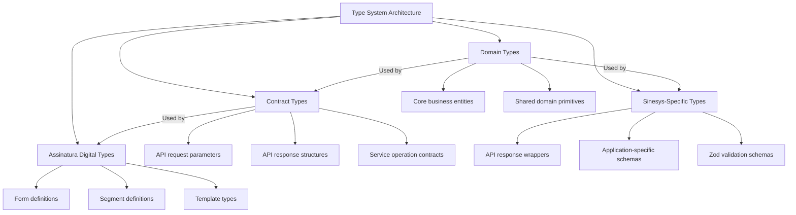

**Diagram sources**
- [types/index.ts](file://types/index.ts)
- [types/domain/index.ts](file://types/domain/index.ts)
- [types/contracts/index.ts](file://types/contracts/index.ts)
- [types/sinesys/index.ts](file://types/sinesys/index.ts)

**Section sources**
- [types/index.ts](file://types/index.ts)
- [types/domain/index.ts](file://types/domain/index.ts)
- [types/contracts/index.ts](file://types/contracts/index.ts)
- [types/sinesys/index.ts](file://types/sinesys/index.ts)

## Domain Types

The domain types represent the core business entities and primitives of the Sinesys application. These types define the fundamental data structures used throughout the system and are organized in the `types/domain` directory. The domain types serve as the single source of truth for business entities and are imported and extended by other type categories.

### Common Domain Primitives

The `common.ts` file in the domain directory defines shared types and enums used across multiple domain entities. These include pagination structures, person types, PJE status codes, jurisdiction degrees, and process status enums.

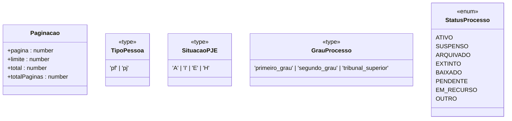

**Diagram sources**
- [types/domain/common.ts](file://types/domain/common.ts)

### Acervo Domain Types

The acervo types define the structure of legal cases and processes within the system. The `Acervo` interface represents a case record with detailed information including process number, jurisdiction, parties involved, and status. The system also includes specialized types for process grouping and unified views that aggregate data from multiple instances of a process.

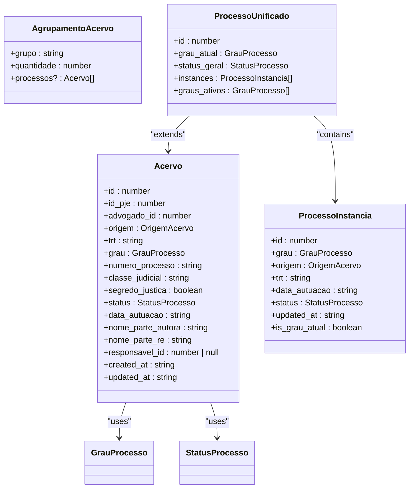

**Diagram sources**
- [types/domain/acervo.ts](file://types/domain/acervo.ts)

### Audiencias Domain Types

The audiencias types define the structure of court hearings within the system. The `Audiencia` interface contains comprehensive information about a hearing including date, time, location, participants, and status. The system includes specific types for hearing status, modality, and hybrid presence to capture the different ways hearings can be conducted.

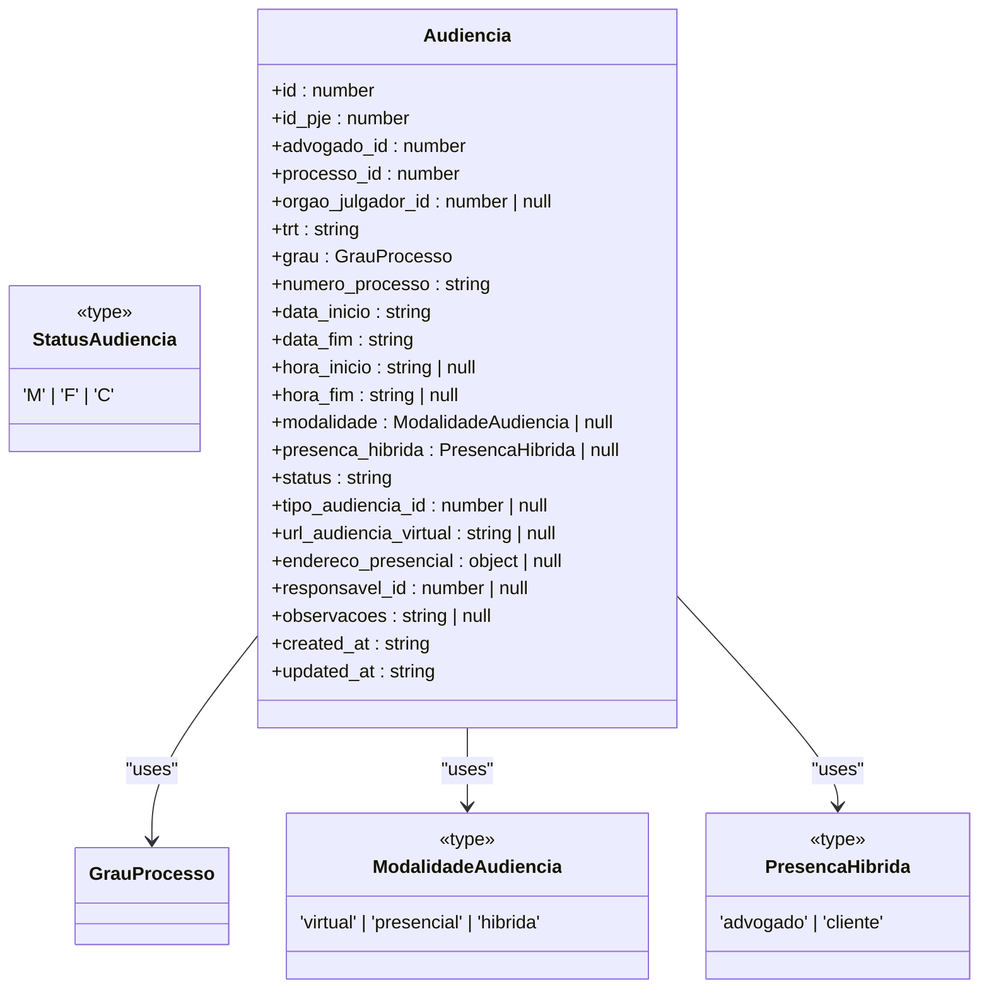

**Diagram sources**
- [types/domain/audiencias.ts](file://types/domain/audiencias.ts)

### Partes Domain Types

The partes types define the structure of parties involved in legal cases, including clients, opposing parties, and third parties. The system uses a discriminated union pattern to handle both physical and legal persons, with specific interfaces for each type that extend a common base interface.

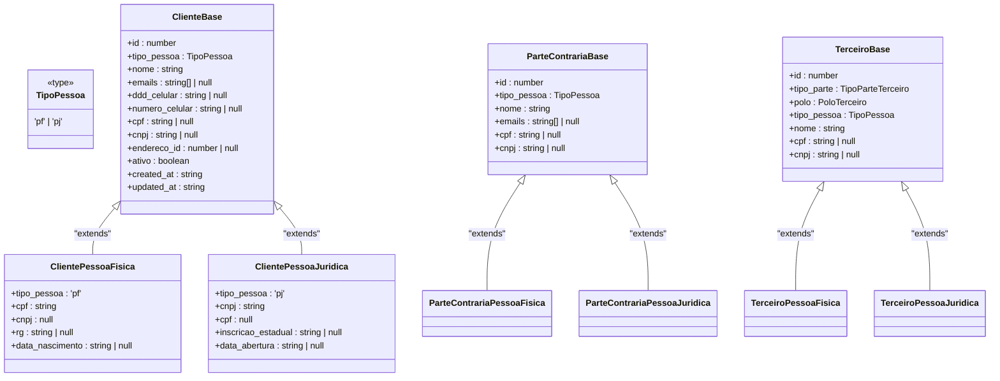

**Diagram sources**
- [types/domain/partes.ts](file://types/domain/partes.ts)

### Processo-Partes Domain Types

The processo-partes types define the relationship between parties and legal cases, serving as the junction table for the many-to-many relationship between parties and processes. These types include the `ProcessoParte` interface that represents a party's participation in a case, along with related types for retrieving parties with complete data and processes with participation information.

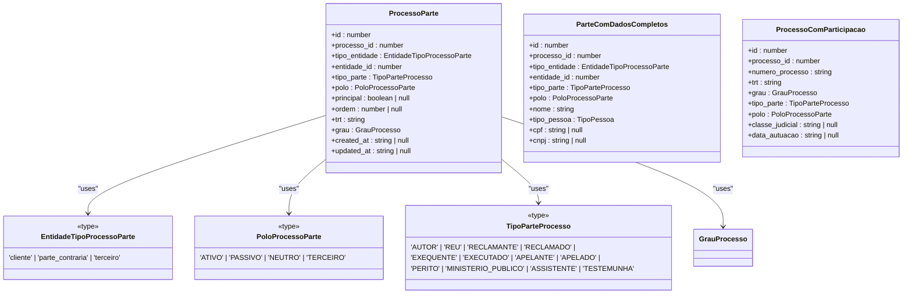

**Diagram sources**
- [types/domain/processo-partes.ts](file://types/domain/processo-partes.ts)

**Section sources**
- [types/domain/common.ts](file://types/domain/common.ts)
- [types/domain/acervo.ts](file://types/domain/acervo.ts)
- [types/domain/audiencias.ts](file://types/domain/audiencias.ts)
- [types/domain/partes.ts](file://types/domain/partes.ts)
- [types/domain/processo-partes.ts](file://types/domain/processo-partes.ts)

## Contract Types

The contract types define the shapes of API requests and responses, serving as the interface between the frontend and backend services. These types are organized in the `types/contracts` directory and are designed to be used in API service calls, form validations, and data transfer operations.

### Acervo Contract Types

The acervo contract types define the parameters and response structures for operations related to legal cases. These include types for sorting, filtering, and grouping cases, as well as the result structures for different query operations.

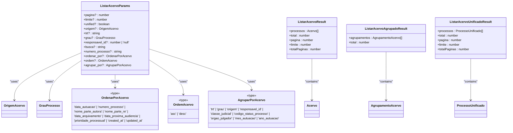

**Diagram sources**
- [types/contracts/acervo.ts](file://types/contracts/acervo.ts)

### Audiencias Contract Types

The audiencias contract types define the parameters and response structures for operations related to court hearings. These include types for sorting and filtering hearings, as well as parameter types for creating new hearings.

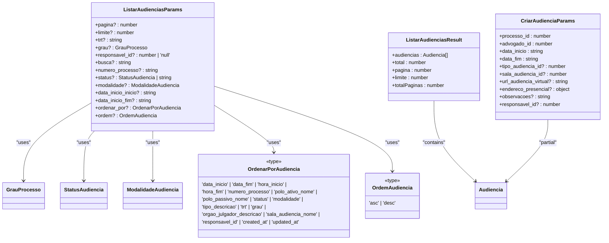

**Diagram sources**
- [types/contracts/audiencias.ts](file://types/contracts/audiencias.ts)

### Partes Contract Types

The partes contract types define the parameters and response structures for operations related to parties (clients, opposing parties, and third parties). These include comprehensive types for creating, updating, and listing parties, with specific variants for physical and legal persons.

```mermaid
flowchart TD
A["Partes Contract Types"] --> B["Creation Parameters"]
A --> C["Update Parameters"]
A --> D["Listing Parameters"]
A --> E["Result Structures"]
B --> B1["CriarClientePFParams"]
B --> B2["CriarClientePJParams"]
B --> B3["CriarParteContrariaPFParams"]
B --> B4["CriarParteContrariaPJParams"]
B --> B5["CriarTerceiroPFParams"]
B --> B6["CriarTerceiroPJParams"]
C --> C1["AtualizarClientePFParams"]
C --> C2["AtualizarClientePJParams"]
C --> C3["AtualizarParteContrariaPFParams"]
C --> C4["AtualizarParteContrariaPJParams"]
C --> C5["AtualizarTerceiroPFParams"]
C --> C6["AtualizarTerceiroPJParams"]
D --> D1["ListarClientesParams"]
D --> D2["ListarPartesContrariasParams"]
D --> D3["ListarTerceirosParams"]
E --> E1["ListarClientesResult"]
E --> E2["ListarPartesContrariasResult"]
E --> E3["ListarTerceirosResult"]
B1 --> B7["CriarClienteParams"]
B2 --> B7
B3 --> B8["CriarParteContrariaParams"]
B4 --> B8
B5 --> B9["CriarTerceiroParams"]
B6 --> B9
C1 --> C7["AtualizarClienteParams"]
C2 --> C7
C3 --> C8["AtualizarParteContrariaParams"]
C4 --> C8
C5 --> C9["AtualizarTerceiroParams"]
C6 --> C9
E1 --> E4["ClienteComEndereco"]
E2 --> E5["ParteContrariaComEndereco"]
E3 --> E6["TerceiroComEndereco"]
```

**Diagram sources**
- [types/contracts/partes.ts](file://types/contracts/partes.ts)

**Section sources**
- [types/contracts/acervo.ts](file://types/contracts/acervo.ts)
- [types/contracts/audiencias.ts](file://types/contracts/audiencias.ts)
- [types/contracts/partes.ts](file://types/contracts/partes.ts)

## Sinesys-Specific Types

The Sinesys-specific types are located in the `types/sinesys` directory and define application-specific interfaces, enums, and validation schemas. These types are tailored to the specific needs of the Sinesys application and often include Zod schemas for runtime validation of API responses.

### Common Sinesys Types

The common types in the sinesys namespace define shared application-specific types and their corresponding Zod validation schemas. These include types for API responses, timeline status, client roles, hearing modalities, and agreement types.

```mermaid
classDiagram
class ApiResponse {
+success : boolean
+data? : T
+error? : string
}
class TimelineStatus {
<<type>>
'disponivel' | 'sincronizando' | 'indisponivel'
}
class PapelCliente {
<<type>>
'Reclamante' | 'Reclamado' | 'Autor' | 'Réu'
}
class ModalidadeAudiencia {
<<type>>
'Virtual' | 'Presencial' | 'Híbrida'
}
class StatusAudiencia {
<<type>>
'Designada' | 'Realizada' | 'Cancelada' | 'Adiada'
}
class TipoLocalAudiencia {
<<type>>
'virtual' | 'presencial' | 'hibrido'
}
class StatusContrato {
<<type>>
'ativo' | 'encerrado' | 'suspenso'
}
class TipoAcordo {
<<type>>
'acordo' | 'condenacao'
}
class DirecaoAcordo {
<<type>>
'recebimento' | 'pagamento'
}
class FormaPagamento {
<<type>>
'unica' | 'parcelada'
}
class ModalidadePagamento {
<<type>>
'judicial' | 'extrajudicial'
}
class StatusParcela {
<<type>>
'pendente' | 'paga' | 'vencida'
}
ApiResponse <|-- ProcessosResponse : "specialization"
```

**Diagram sources**
- [types/sinesys/common.ts](file://types/sinesys/common.ts)

### Processos Sinesys Types

The processos types define the structure of legal cases as represented in the Sinesys application, including timeline items, instance information, party details, and response structures for the process API. These types are specifically designed for the Sinesys frontend and include comprehensive Zod schemas for validation.

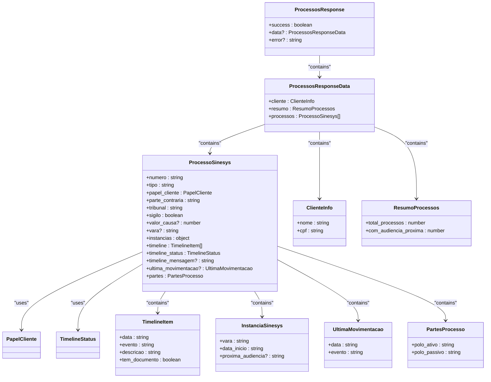

**Diagram sources**
- [types/sinesys/processos.ts](file://types/sinesys/processos.ts)

**Section sources**
- [types/sinesys/common.ts](file://types/sinesys/common.ts)
- [types/sinesys/processos.ts](file://types/sinesys/processos.ts)

## Assinatura Digital Types

The assinatura digital types are located in the `types/assinatura-digital` directory and define the structures for digital signature forms, segments, and templates. These types support the digital document signing functionality within the Sinesys application.

### Formulario Types

The formulario types define the structure of digital forms, including form schemas, form entities, and template definitions. These types support the creation and management of digital forms that can be signed electronically.

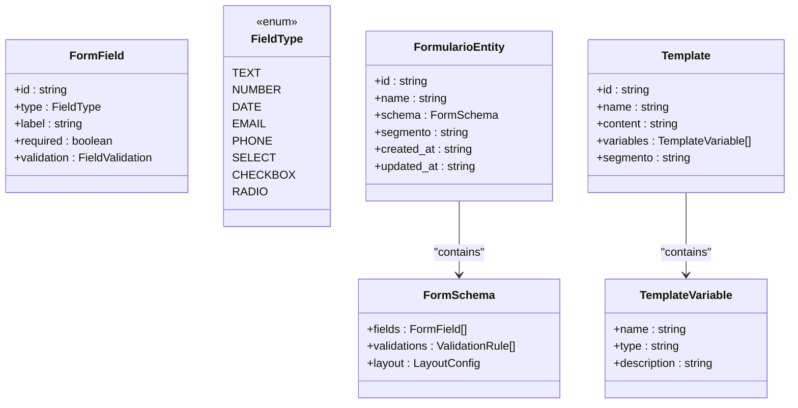

**Diagram sources**
- [types/assinatura-digital/formulario.types.ts](file://types/assinatura-digital/formulario.types.ts)

### Segmento Types

The segmento types define the structure of form segments, which are used to organize digital forms by business area or client type. These types support the categorization and management of forms within different segments of the application.

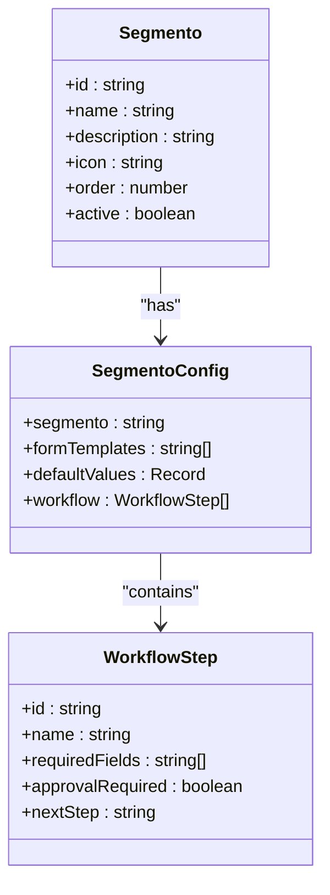

**Diagram sources**
- [types/assinatura-digital/segmento.types.ts](file://types/assinatura-digital/segmento.types.ts)

**Section sources**
- [types/assinatura-digital/formulario.types.ts](file://types/assinatura-digital/formulario.types.ts)
- [types/assinatura-digital/segmento.types.ts](file://types/assinatura-digital/segmento.types.ts)

## Type Relationships and Dependencies

The Sinesys type system features a well-defined dependency hierarchy where domain types serve as the foundation for contract and application-specific types. This section analyzes the relationships and dependencies between different type categories.

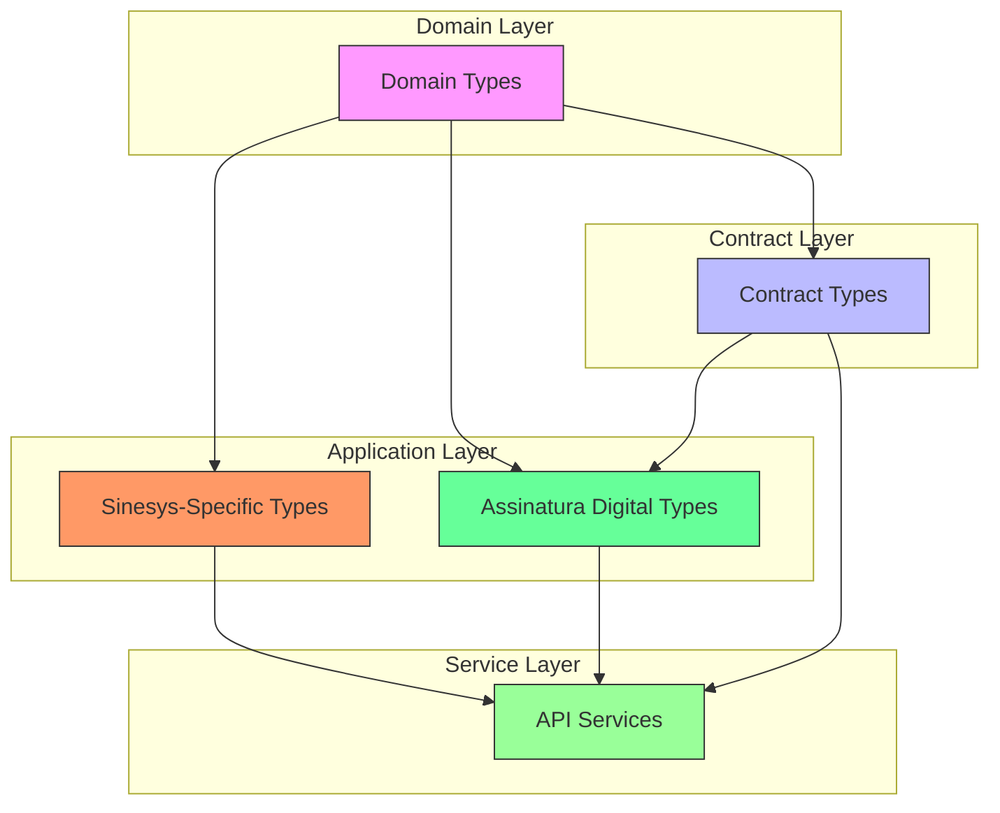

The dependency analysis reveals several key patterns in the type system:

1. **Domain-Centric Architecture**: The domain types serve as the foundation of the entire type system, with all other type categories depending on them. This ensures consistency and reduces duplication across the application.

2. **Separation of Concerns**: The system clearly separates domain entities (what the data is) from contracts (how the data is transferred) and application-specific types (how the data is used in the UI).

3. **Validation Layer**: The Sinesys-specific types include Zod schemas that provide runtime validation for API responses, adding an additional layer of type safety beyond compile-time TypeScript checking.

4. **Extensibility**: The contract types extend domain types with additional properties needed for API operations, such as pagination parameters and filtering options, while maintaining compatibility with the underlying domain entities.

5. **Feature-Specific Types**: The assinatura digital types represent a specialized feature area with its own type hierarchy, demonstrating how the system can accommodate feature-specific requirements while still integrating with the broader type system.

**Section sources**
- [types/index.ts](file://types/index.ts)
- [types/domain/index.ts](file://types/domain/index.ts)
- [types/contracts/index.ts](file://types/contracts/index.ts)
- [types/sinesys/index.ts](file://types/sinesys/index.ts)

## Conclusion

The Sinesys type system is a comprehensive and well-structured implementation that effectively separates concerns between domain entities, API contracts, and application-specific types. The system demonstrates several best practices in TypeScript type design:

1. **Modular Organization**: Types are organized into logical directories based on their purpose, making them easy to locate and understand.

2. **Clear Hierarchy**: The dependency hierarchy flows from domain types to contracts to application-specific types, creating a clear progression from business entities to UI representations.

3. **Reusability**: Common types and primitives are defined once and reused across multiple domains, reducing duplication and ensuring consistency.

4. **Runtime Validation**: The inclusion of Zod schemas for API responses provides an additional layer of type safety beyond compile-time checking.

5. **Extensibility**: The system is designed to accommodate new features and requirements through well-defined extension points.

The type system serves as a single source of truth for data structures across the application, enabling better collaboration between frontend and backend teams, reducing bugs related to data shape mismatches, and improving overall code quality. By maintaining a clear separation between different type categories and establishing well-defined dependencies, the Sinesys type system provides a solid foundation for the application's continued development and evolution.