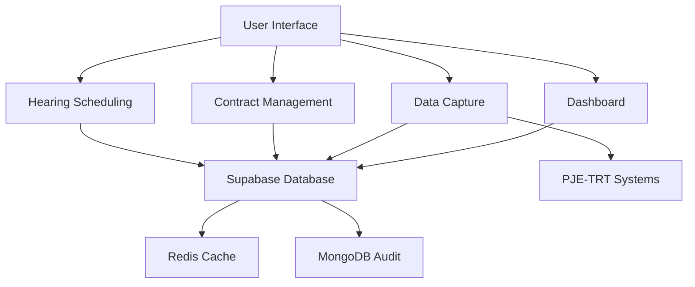
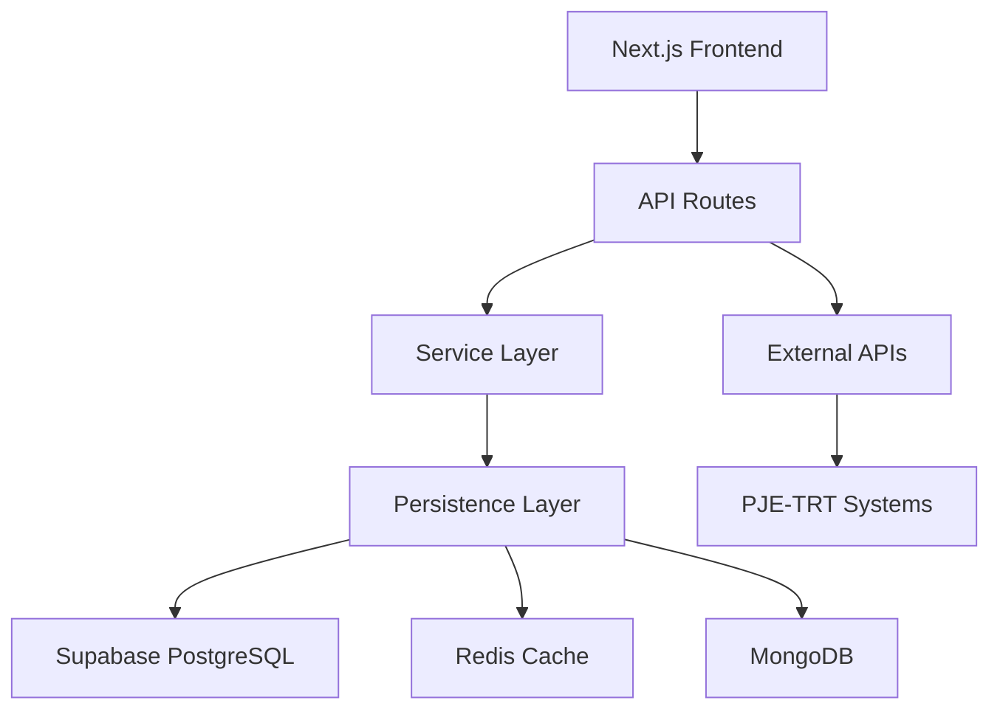
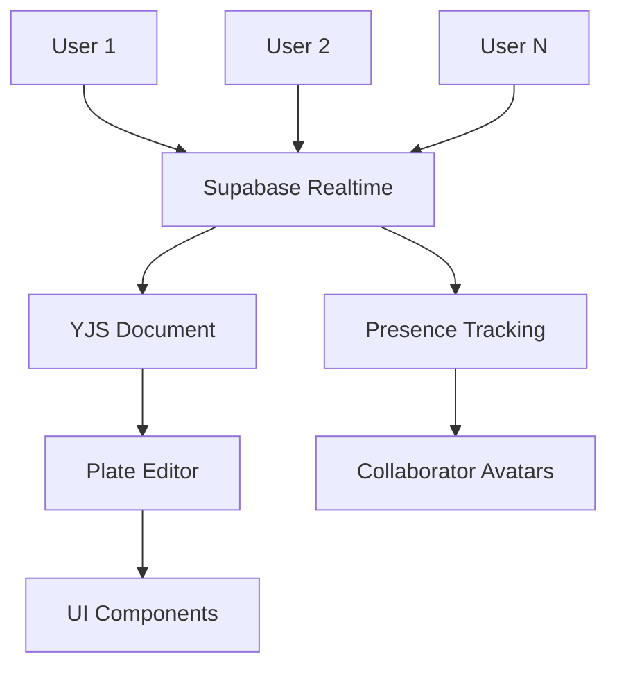

# System Overview

<cite>
**Referenced Files in This Document**   
- [README.md](file://README.md)
- [package.json](file://package.json)
- [next.config.ts](file://next.config.ts)
- [supabase/schemas/01_enums.sql](file://supabase/schemas/01_enums.sql)
- [backend/audiencias/services/criar-audiencia.service.ts](file://backend/audiencias/services/criar-audiencia.service.ts)
- [backend/contratos/services/contratos/criar-contrato.service.ts](file://backend/contratos/services/contratos/criar-contrato.service.ts)
- [backend/expedientes/services/listar-pendentes.service.ts](file://backend/expedientes/services/listar-pendentes.service.ts)
- [app/(dashboard)/dashboard/page.tsx](file://app/(dashboard)/dashboard/page.tsx)
- [app/_lib/supabase.ts](file://app/_lib/supabase.ts)
- [hooks/use-realtime-collaboration.ts](file://hooks/use-realtime-collaboration.ts)
- [components/documentos/collaborators-avatars.tsx](file://components/documentos/collaborators-avatars.tsx)
</cite>

## Table of Contents
1. [Introduction](#introduction)
2. [Core Components](#core-components)
3. [Architecture Overview](#architecture-overview)
4. [Technical Implementation](#technical-implementation)
5. [Real-time Collaboration](#real-time-collaboration)
6. [Conclusion](#conclusion)

## Introduction

The Sinesys legal management system is a comprehensive platform designed for law firms to manage legal processes, client relationships, and judicial data capture from PJE/TRT systems. Built with modern web technologies, Sinesys provides a centralized solution for legal professionals to streamline their workflow, enhance collaboration, and maintain accurate records of legal proceedings.

The system serves as a complete case management solution, integrating various aspects of legal practice including contract management, hearing scheduling, process tracking, and financial management. Its primary purpose is to automate the capture of judicial data from external systems like PJE (Processo Judicial Eletrônico) and TRT (Tribunal Regional do Trabalho), reducing manual data entry and ensuring up-to-date information across all case files.

Sinesys follows a Domain-Driven Design (DDD) approach, organizing its architecture around core legal concepts such as "acervo" (legal portfolio), "audiencias" (hearings), and "expedientes" (procedural documents). This domain-centric approach ensures that the system's structure reflects the actual workflow and terminology used by legal professionals, making it intuitive and efficient for daily use.

The platform is designed to support real-time collaboration among team members, allowing multiple users to work on documents simultaneously while maintaining data consistency and providing presence indicators. This collaborative capability is particularly valuable for law firms with distributed teams or multiple attorneys working on complex cases.

**Section sources**
- [README.md](file://README.md#L28-L43)

## Core Components

Sinesys is built around several core components that work together to provide a comprehensive legal management solution. These components are organized in a modular architecture that allows for independent development and maintenance while ensuring seamless integration across the system.

The **dashboard** serves as the central hub of the application, providing an overview of key metrics, upcoming hearings, pending actions, and recent activities. It aggregates data from various sources to give users a comprehensive view of their caseload and practice management metrics at a glance.

The **data capture system** is responsible for integrating with external judicial systems like PJE-TRT to automatically retrieve process information, hearing schedules, and pending actions. This component handles authentication, data extraction, and normalization of information from various tribunals, ensuring that case data is consistently formatted regardless of the source system.

The **contract management** module provides comprehensive functionality for creating, tracking, and managing client contracts. It supports various contract types including ajuizamento (filing), defesa (defense), and assessoria (advisory), with associated financial terms and obligations. Contracts can be linked to specific legal processes, enabling better financial tracking and resource allocation.

The **hearing scheduling** component manages both automatically captured hearings from judicial systems and manually created hearings. It provides calendar views organized by year, month, week, and day, allowing users to easily visualize their schedule and identify potential conflicts. Each hearing record includes details such as date, time, virtual or physical location, participants, and responsible attorneys.

These components are interconnected through a shared data model that ensures consistency across the system. For example, when a new process is captured from PJE-TRT, it automatically creates associated records in the acervo, potentially generates contract records based on predefined templates, and populates upcoming hearings in the scheduling system.

**Diagram sources **
- [README.md](file://README.md#L34-L40)
- [supabase/schemas/01_enums.sql](file://supabase/schemas/01_enums.sql#L129-L144)

**Section sources**
- [README.md](file://README.md#L34-L40)
- [supabase/schemas/01_enums.sql](file://supabase/schemas/01_enums.sql#L129-L144)

## Architecture Overview

Sinesys follows a three-tier architecture with a Next.js frontend, backend services, and Supabase database, implementing Domain-Driven Design principles to organize its codebase around business domains. The system is built using modern web technologies including Next.js 16, TypeScript 5, and Supabase as the backend-as-a-service platform.

The frontend is implemented using Next.js with the App Router pattern, providing server-side rendering and optimized performance. It uses React 19 for the UI components, TypeScript for type safety, and Tailwind CSS for styling. The interface leverages shadcn/ui and Radix UI components to create a consistent and accessible user experience across all screens.

The backend consists of Next.js API routes that serve as the interface between the frontend and business logic. These routes handle authentication, input validation, and response formatting before delegating to service layer components. The service layer contains the core business logic organized by domain (acervo, audiencias, contratos, etc.), following the principles of Domain-Driven Design.

Data persistence is handled through Supabase, which provides a PostgreSQL database with Row Level Security (RLS) for fine-grained access control. The system also utilizes MongoDB for storing audit trails and timeline data, and Redis for caching frequently accessed data to improve performance. This multi-database approach allows each data store to be optimized for its specific use case.

The architecture follows a layered pattern with clear separation of concerns:
- **API Layer**: Handles HTTP requests, authentication, and response formatting
- **Service Layer**: Contains business logic and orchestrates operations
- **Persistence Layer**: Manages database interactions and data access

This separation ensures that business rules are not mixed with presentation or infrastructure concerns, making the system more maintainable and testable.

**Diagram sources **
- [README.md](file://README.md#L75-L101)
- [package.json](file://package.json#L48-L65)

**Section sources**
- [README.md](file://README.md#L44-L65)
- [package.json](file://package.json#L48-L65)

## Technical Implementation

The Sinesys system implements a Domain-Driven Design approach with a three-tier architecture that separates concerns and promotes maintainability. The codebase is organized around business domains such as acervo (legal portfolio), audiencias (hearings), and contratos (contracts), with each domain having its own service and persistence layers.

The service layer contains the core business logic implemented as independent services that can be composed to accomplish complex operations. For example, the `criarAudiencia` service in the audiencias module handles the creation of new hearings by validating input parameters, retrieving related process data, and inserting records into the database. Similarly, the `cadastrarContrato` service manages contract creation with proper error handling and logging.

The persistence layer abstracts database interactions through dedicated service classes that handle CRUD operations and complex queries. These services use Supabase's PostgreSQL database with Row Level Security to ensure data isolation between users and organizations. The system also implements caching with Redis to improve performance for frequently accessed data, using a cache-aside pattern where data is first checked in the cache before querying the database.

TypeScript is used throughout the codebase with a comprehensive type system that includes domain types, contract types (DTOs), and frontend-specific types. The types are organized in a shared `/types` directory with subdirectories for domain models and application contracts, ensuring consistency across the frontend and backend while maintaining separation of concerns.

The system uses environment variables for configuration, with different settings for development, testing, and production environments. Sensitive credentials are stored securely and never committed to version control. The deployment process is containerized using Docker, with orchestration through Docker Swarm and routing via Traefik.

**Section sources**
- [backend/audiencias/services/criar-audiencia.service.ts](file://backend/audiencias/services/criar-audiencia.service.ts#L1-L110)
- [backend/contratos/services/contratos/criar-contrato.service.ts](file://backend/contratos/services/contratos/criar-contrato.service.ts#L1-L46)
- [next.config.ts](file://next.config.ts#L1-L131)

## Real-time Collaboration

Sinesys implements real-time collaboration features that allow multiple users to work on documents simultaneously while maintaining data consistency and providing presence awareness. This functionality is built using Supabase's real-time capabilities combined with YJS, a CRDT-based framework for conflict-free collaborative editing.

The collaboration system is implemented through the `useRealtimeCollaboration` custom hook, which establishes a WebSocket connection to a Supabase Realtime channel for a specific document. When users open a document, they join the channel and their presence is broadcast to other collaborators. The hook manages presence tracking, cursor positions, and selection states, allowing users to see who else is editing the document and where they are working.

Collaborators are represented by colored avatars that display their names and editing status. The system uses a deterministic color assignment based on user ID to ensure consistency across sessions. When multiple users are editing the same document, their cursor positions and selections are synchronized in real-time, enabling effective collaboration and reducing the risk of conflicting changes.

The document editor itself is built using Plate, a rich-text editor framework that supports collaborative editing through YJS. Changes made by any user are automatically synced to all connected clients, with operational transformation ensuring that edits are applied consistently regardless of network latency or the order in which they are received. The system also implements auto-save functionality to prevent data loss and maintains a version history that allows users to revert to previous states if needed.

This real-time collaboration capability is particularly valuable for legal teams working on complex documents such as briefs, contracts, and pleadings, as it eliminates the need for manual file sharing and version control while providing a seamless collaborative experience.

**Diagram sources **
- [hooks/use-realtime-collaboration.ts](file://hooks/use-realtime-collaboration.ts#L1-L98)
- [components/documentos/collaborators-avatars.tsx](file://components/documentos/collaborators-avatars.tsx#L1-L50)

**Section sources**
- [hooks/use-realtime-collaboration.ts](file://hooks/use-realtime-collaboration.ts#L1-L98)
- [components/documentos/collaborators-avatars.tsx](file://components/documentos/collaborators-avatars.tsx#L1-L50)

## Conclusion

The Sinesys legal management system provides a comprehensive platform for law firms to manage their legal processes, client relationships, and judicial data capture. By integrating with PJE/TRT systems, the platform automates the collection of case information, reducing manual data entry and ensuring that attorneys have access to the most current information.

The system's architecture, built on Next.js, Supabase, and a Domain-Driven Design approach, provides a solid foundation for scalability and maintainability. The separation of concerns between API, service, and persistence layers ensures that business logic remains clean and testable, while the use of TypeScript and comprehensive typing provides type safety across the entire stack.

Key features like the dashboard, data capture system, contract management, and hearing scheduling work together to provide a unified view of a law firm's operations. The real-time collaboration capabilities enable teams to work together efficiently on documents and cases, regardless of their physical location.

For developers, the system offers a well-organized codebase with clear patterns and conventions that make it easier to understand and extend. The use of modern web technologies and best practices in software architecture ensures that Sinesys can evolve to meet the changing needs of legal practices while maintaining high performance and reliability.