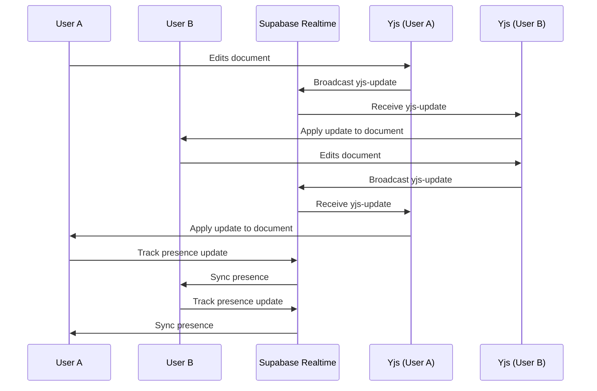
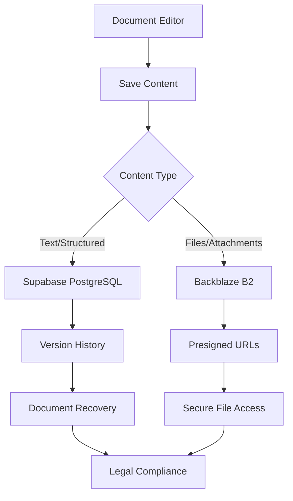

# Technology Stack

<cite>
**Referenced Files in This Document**   
- [package.json](file://package.json)
- [next.config.ts](file://next.config.ts)
- [app/layout.tsx](file://app/layout.tsx)
- [lib/client.ts](file://lib/client.ts)
- [lib/supabase/client.ts](file://lib/supabase/client.ts)
- [lib/yjs/supabase-yjs-provider.ts](file://lib/yjs/supabase-yjs-provider.ts)
- [components/plate/plate-editor.tsx](file://components/plate/plate-editor.tsx)
- [hooks/use-realtime-collaboration.ts](file://hooks/use-realtime-collaboration.ts)
- [backend/storage/backblaze-b2.service.ts](file://backend/storage/backblaze-b2.service.ts)
- [backend/api/twofauth.service.ts](file://backend/api/twofauth.service.ts)
- [Dockerfile](file://Dockerfile)
</cite>

## Table of Contents
1. [Frontend Architecture](#frontend-architecture)
2. [Backend Services](#backend-services)
3. [Database Systems](#database-systems)
4. [Infrastructure Components](#infrastructure-components)
5. [Real-time Collaboration](#real-time-collaboration)
6. [Document Storage and Management](#document-storage-and-management)
7. [Authentication and Security](#authentication-and-security)
8. [Containerization and Deployment](#containerization-and-deployment)

## Frontend Architecture

The Sinesys frontend is built on a modern technology stack centered around Next.js 16 with React 19, leveraging the App Router architecture for server-side rendering and optimized data fetching. The application uses React Server Components extensively to minimize client-side JavaScript payload and improve performance. The component library is built on shadcn/ui, a collection of reusable React components based on Radix UI and Tailwind CSS, providing a consistent design system across the application.

The UI framework combines Tailwind CSS for utility-first styling with a custom component library that extends shadcn/ui components to meet the specific needs of the legal technology domain. This approach enables rapid development of complex interfaces while maintaining design consistency. The application also implements a Progressive Web App (PWA) architecture using the @ducanh2912/next-pwa package, allowing offline functionality and app-like installation on user devices.

**Section sources**
- [package.json](file://package.json#L140-L154)
- [next.config.ts](file://next.config.ts#L55-L131)
- [app/layout.tsx](file://app/layout.tsx#L1-L72)

## Backend Services

The backend architecture features a Node.js runtime with Express-like API routes implemented through Next.js API routes. This serverless function approach provides scalability and efficient request handling. Browser automation is handled through both Puppeteer and Playwright, enabling the system to interact with external legal systems and capture data from web-based court portals. The backend services are organized in a modular structure with dedicated service layers for different domains such as document management, user authentication, and data synchronization.

The API architecture follows a service-oriented pattern with clearly defined service boundaries and dependency injection. Each service handles specific business capabilities and communicates through well-defined interfaces. The backend also implements a comprehensive logging system using Pino for structured logging, facilitating debugging and monitoring in production environments.

**Section sources**
- [package.json](file://package.json#L148-L149)
- [Dockerfile](file://Dockerfile#L43-L185)

## Database Systems

Sinesys employs a multi-database strategy with specialized systems for different data types and access patterns. The primary relational database is Supabase PostgreSQL, which provides a robust foundation for structured data storage with Row Level Security (RLS) for fine-grained access control. The Supabase platform also enables real-time data synchronization through its Realtime API, which is leveraged for collaborative editing features.

For timeline data and other unstructured or semi-structured data, the system uses MongoDB, providing flexible schema capabilities and efficient querying for time-series data. Redis is implemented as a caching layer to improve performance for frequently accessed data and to support distributed locking mechanisms. This combination of database technologies allows the application to handle diverse data requirements efficiently while maintaining data integrity and performance.

**Section sources**
- [package.json](file://package.json#L110-L112)
- [package.json](file://package.json#L139)
- [package.json](file://package.json#L134)

## Infrastructure Components

The infrastructure architecture is designed for scalability, reliability, and security. Docker is used for containerization, providing consistent deployment environments across development, testing, and production. The Docker configuration is optimized for memory usage and build performance, with multi-stage builds to reduce image size and improve startup times. The containerized application is designed to run in orchestrated environments, with health checks and resource limits configured to prevent out-of-memory errors.

Document storage is handled by Backblaze B2, an S3-compatible object storage service that provides cost-effective and reliable storage for legal documents and other file attachments. The integration with Backblaze B2 uses AWS SDK v3 for compatibility with the S3 API, enabling secure file uploads, downloads, and management. The system generates presigned URLs for secure access to private documents, ensuring that sensitive legal files are protected while allowing authorized access.

Two-factor authentication is implemented using 2FAuth, a dedicated service for managing time-based one-time passwords (TOTP). This external service integration enhances security by separating authentication concerns from the core application logic. The 2FAuth integration follows a standardized API pattern that can be reused across different court systems and authentication requirements.

**Section sources**
- [Dockerfile](file://Dockerfile#L1-L185)
- [backend/storage/backblaze-b2.service.ts](file://backend/storage/backblaze-b2.service.ts#L1-L195)
- [backend/api/twofauth.service.ts](file://backend/api/twofauth.service.ts#L1-L196)

## Real-time Collaboration

The real-time collaboration system is built on the Yjs CRDT (Conflict-free Replicated Data Type) library, enabling seamless multi-user editing of legal documents with automatic conflict resolution. The implementation uses a custom SupabaseYjsProvider that bridges Yjs with Supabase Realtime, allowing real-time synchronization through Supabase's WebSocket-based Realtime API. This integration enables multiple users to collaborate on documents simultaneously with low-latency updates and operational transformation.

The collaboration system includes awareness features that show which users are currently viewing or editing a document, along with their cursor positions and selection ranges. This presence information is transmitted through Supabase Realtime channels, providing a Google Docs-like collaborative experience. The system also implements document synchronization protocols that handle connection interruptions and ensure data consistency across clients.

**Diagram sources **
- [lib/yjs/supabase-yjs-provider.ts](file://lib/yjs/supabase-yjs-provider.ts#L1-L358)
- [hooks/use-realtime-collaboration.ts](file://hooks/use-realtime-collaboration.ts#L1-L244)

**Section sources**
- [lib/yjs/supabase-yjs-provider.ts](file://lib/yjs/supabase-yjs-provider.ts#L1-L358)
- [hooks/use-realtime-collaboration.ts](file://hooks/use-realtime-collaboration.ts#L1-L244)

## Document Storage and Management

The document management system is built around the Plate editor, a rich-text editing framework based on Slate.js that provides advanced document editing capabilities. Plate is configured with a comprehensive set of plugins for AI-powered editing, comments, suggestions, and collaborative features. The editor supports a wide range of content types including formatted text, tables, code blocks, media embedding, and mathematical expressions.

The document storage architecture follows a hybrid approach where document content is stored in the database as structured JSON, while file attachments and large binary objects are stored in Backblaze B2. This separation optimizes database performance while ensuring reliable storage for large files. The system implements a version history mechanism that tracks document changes over time, enabling users to revert to previous versions when needed.

**Diagram sources **
- [components/plate/plate-editor.tsx](file://components/plate/plate-editor.tsx#L1-L600)
- [backend/storage/backblaze-b2.service.ts](file://backend/storage/backblaze-b2.service.ts#L1-L195)

**Section sources**
- [components/plate/plate-editor.tsx](file://components/plate/plate-editor.tsx#L1-L600)

## Authentication and Security

The authentication architecture combines Supabase Auth for user management with 2FAuth for two-factor authentication, creating a robust security framework for handling sensitive legal data. Supabase provides email/password authentication, session management, and JWT-based token authentication, while 2FAuth adds an additional layer of security through time-based one-time passwords.

The system implements role-based access control (RBAC) through Supabase Row Level Security policies, ensuring that users can only access data they are authorized to view. The security model includes both static policies defined in database migrations and dynamic permission checks in application code. All API routes include authorization middleware that validates user permissions before allowing access to sensitive operations.

**Section sources**
- [lib/client.ts](file://lib/client.ts#L1-L9)
- [lib/supabase/client.ts](file://lib/supabase/client.ts#L1-L3)
- [backend/api/twofauth.service.ts](file://backend/api/twofauth.service.ts#L1-L196)

## Containerization and Deployment

The deployment architecture is built around Docker containerization with optimizations for production performance and reliability. The Docker configuration uses multi-stage builds to create lightweight production images, reducing attack surface and improving startup times. The build process is optimized for memory usage, with specific Node.js heap size limits configured to prevent out-of-memory errors in containerized environments.

The container includes a health check endpoint that verifies application readiness, enabling orchestration platforms to manage application lifecycle and perform automatic restarts if needed. The standalone output mode in Next.js generates a minimal production bundle that includes only necessary dependencies, further reducing image size and attack surface. The deployment strategy supports both CapRover and other container orchestration platforms, providing flexibility for different hosting environments.

**Section sources**
- [Dockerfile](file://Dockerfile#L1-L185)
- [next.config.ts](file://next.config.ts#L5-L53)